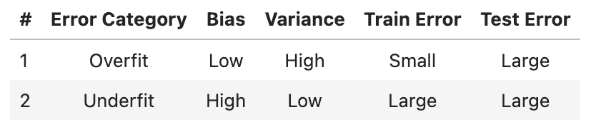
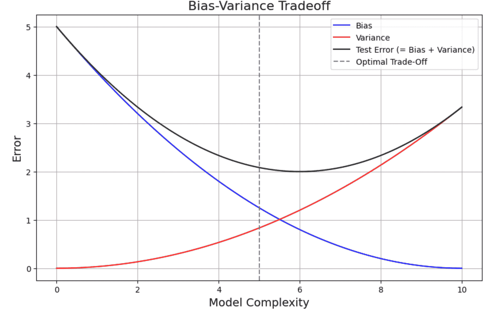
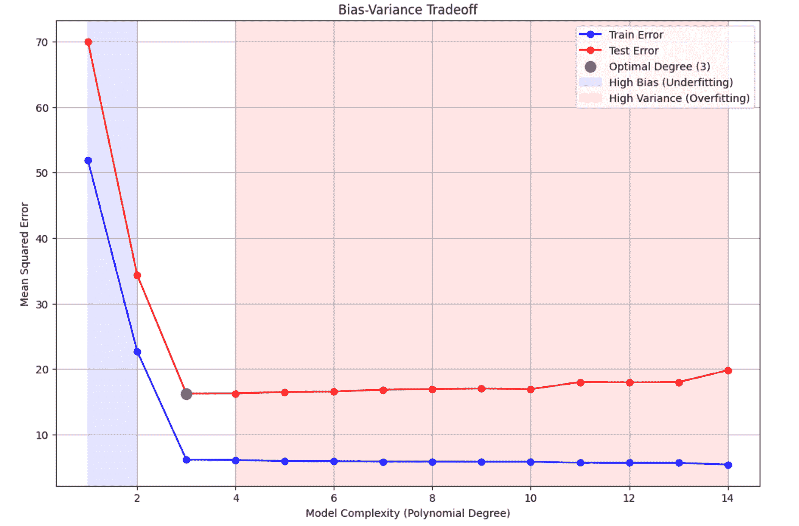
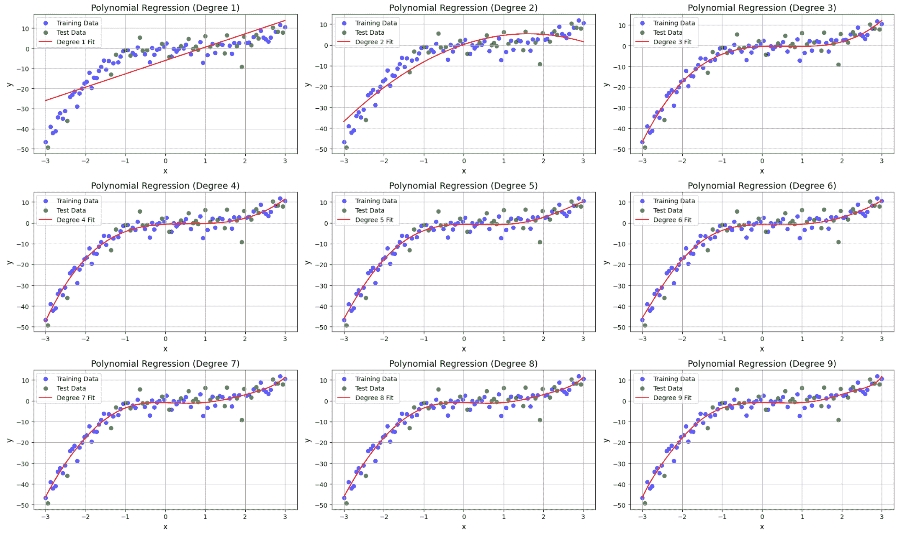
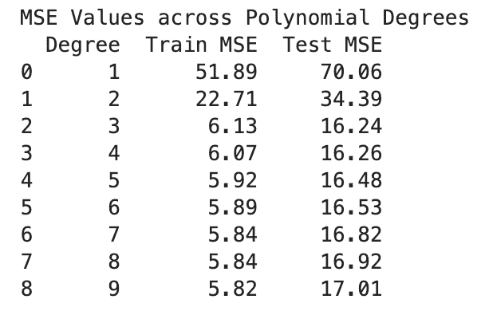
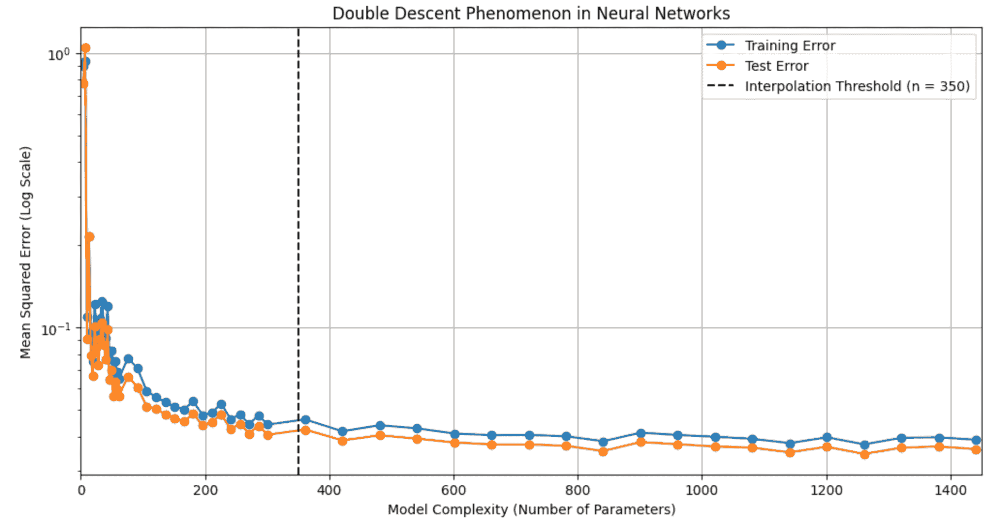

# 超越偏差-方差权衡进入双下降现象

> [原文链接](https://towardsdatascience.com/going-beyond-bias-variance-tradeoff-into-double-descent-phenomenon-4efd2c4f86d3/)


图片由 [Jakob Boman](https://unsplash.com/@bomanbo?utm_content=creditCopyText&utm_medium=referral&utm_source=unsplash) 在 [Unsplash](https://unsplash.com/photos/woman-diving-underwater-Td9FnTMHu0A?utm_content=creditCopyText&utm_medium=referral&utm_source=unsplash) 提供

在数据科学家面试中，讨论偏差-方差权衡是我在过去作为被面试者以及最近作为面试候选人和参与此类面试的人时遇到的最常见话题之一。在本文的后续部分，我们将讨论什么是偏差-方差权衡以及为什么它在深度学习练习中工作方式不同，但让我先解释一下为什么我认为这个话题在决定数据科学家候选人（无论是入门级还是经验丰富级）的机器学习知识广度时总是反复出现。

作为机器学习科学家，我们投入了大量的时间、精力、关注和计算资源来训练优秀的机器学习模型，但我们始终知道，我们的模型在泛化时将会有一定程度的误差，这也就是所说的测试误差。经验较少的数据科学家往往专注于学习新的建模方法和算法，我相信这是一项健康的练习。然而，经验更丰富的数据科学家是那些随着时间的推移学会了如何更好地理解和处理那些训练模型中不可避免存在的测试误差的人。

偏差-方差权衡是一项基本知识，它将指导我们通过学习错误来改进我们的训练模型。这就是为什么我借用了常用的说法：“重要的不是你跌倒了多少次，而是你爬起来了多少次”。在这个类比中，不可避免的测试误差是我们跌倒的次数，而我们如何利用这些知识来改进模型就是我们的爬起来的方式。这正是为什么经验丰富的数据科学家愿意与那些在不可避免地遇到测试误差后仍有计划的面试者交谈。这回答了为什么我们会对入门级科学家提出这个问题。但我们在经验丰富的科学家角色的面试中为什么总是看到这个话题？这带我们来到了双下降现象，这是本文的主要话题。

我们将首先简要回顾经典的偏差-方差权衡，以确保我们使用相同的术语，然后我们将转向对双下降现象的讨论。

让我们开始吧！

* * *

## 1. 建立术语

在讨论偏差-方差权衡和双下降之前，我们需要先定义一些概念，以确保本文后续内容的连贯性（如果您熟悉这些主题，可以自由跳转到第二部分）。这些是所有科学家都应该熟悉的基本主题。我将简要地在这里定义它们，因为大多数科学家都熟悉这些概念，但如果您需要更详细的介绍，请参考以下文章：

> [**我在数据科学家面试中寻找的机器学习基础知识**](https://towardsdatascience.com/machine-learning-basics-i-look-for-in-data-scientist-interviews-a6ff25be38c9)

+   **机器学习生命周期**：每个监督机器学习生命周期都包括一个训练过程，其中模型学习训练数据的潜在模式。在训练期间测量的误差称为“训练误差”。我们期望随着我们训练模型时间的延长，训练误差会降低，这表明模型正在学习训练数据。然后，训练好的模型用于对测试集进行预测，这是模型之前没有见过的。预测不会是完美的，因此在测试训练好的模型时，总是期望存在一个误差，这被称为“测试误差”。我们测量“测试误差”，然后使用各种工具来改进模型，从而降低“测试误差”。换句话说，测试误差越低，训练好的模型就越好。我们几乎可以说，机器学习练习的目的是降低“测试误差”。

+   **欠拟合和过拟合模型**：我们训练的模型不会是完美的。当一个模型过于简单，无法捕捉训练数据的潜在细节时，它被称为“欠拟合”模型。通常在这里我们看到的是模型具有高训练误差，因为它没有很好地学习训练数据，因此测试误差也会很高。“过拟合”模型是欠拟合模型的另一面。当一个模型学习到了训练数据过多的细节，例如学习训练数据中存在的噪声，它被称为“过拟合”模型。在这些情况下，我们通常看到训练误差很低，因为模型已经很好地学习了训练数据，但测试误差却出人意料地高，这表明模型没有很好地泛化，并且对于做出实际预测没有用。记住，机器学习练习的目的是最终降低测试误差。在“过拟合”场景中，尽管训练误差很低，但测试误差很高，因此这不是一个令人满意的结果。现在我们理解了测试误差是谜题中的重要部分，并且熟悉了欠拟合和过拟合的场景，让我们更深入地探讨测试误差的组成部分。

+   **偏差与方差：**测试误差可以分解为两个组成部分，即偏差和方差。偏差是由于模型过于简单而产生的误差，因此我们可以想象高偏差表明欠拟合。另一方面，方差是由于模型过于复杂而产生的误差。换句话说，高方差表明过拟合。所以，这里是你想要记住的映射——偏差与欠拟合相关，方差与过拟合相关。

这里是对我们上面讨论内容的表格总结：



表 1 – 欠拟合和过拟合特征

现在我们已经熟悉了这些术语，让我们定义偏差-方差权衡，然后我们可以继续讨论其双下降方面。

* * *

## 2. 偏差-方差权衡

如前所述，机器学习算法的目标是从训练数据中学习，然后在测试时泛化其学习。换句话说，使用有限量的训练数据，模型学习对模型之前未遇到的数据（即未见数据）进行预测。如果我们把"误差"定义为模型预期预测值与实际预测值之间的距离，那么我们可以把训练过程想象成这样。在训练过程中，模型的目标是最小化"训练"误差（即模型学习对训练数据进行准确预测），机器学习模型的主要目标是当我们使用它时尽可能做出最准确的预测，或者最小化"测试"误差（即模型在测试时预测的结果尽可能接近实际结果）。如前所述，测试误差包括两个称为偏差和方差的组成部分，这两个部分之间的权衡是本节讨论的主题。

在经典机器学习中，通过经验观察，随着模型复杂性的增加，"训练"误差会降低，因为模型在训练过程中更好地拟合训练数据。另一方面，随着复杂性的增加，"测试"误差最初会降低，但最终由于过拟合，"测试"误差开始增加。

最好的演示方式是查看一个图表来可视化"测试"误差的组成部分。让我们创建一些具有偏差-方差权衡形状的合成数据，然后我们可以进一步讨论。为了本文的目的，你不需要理解下面的代码，因为这里不是重点，但我决定将其包括在内，作为一个有趣的练习来观察。

```py
# import libraries
import numpy as np
import matplotlib.pyplot as plt

# generate values for model complexity
model_complexity = np.linspace(0, 10, 100)

# define functions for bias, variance, and test error
bias_squared = (10 - model_complexity) ** 2 / 20
variance = model_complexity ** 2 / 30

# test error is bias and variance together
test_error = bias_squared + variance

# plot
plt.figure(figsize=(10, 6))
plt.plot(model_complexity, bias_squared, label=r'Bias', color='blue')
plt.plot(model_complexity, variance, label='Variance', color='red')
plt.plot(model_complexity, test_error, label='Test Error (= Bias + Variance)', color='black')

# labels, title and legend
plt.xlabel('Model Complexity', fontsize=14)
plt.ylabel('Error', fontsize=14)
plt.title('Bias-Variance Tradeoff', fontsize=16)
plt.axvline(x=5, color='gray', linestyle='--', label='Optimal Trade-Off')
plt.legend()
plt.grid(True)
plt.show()
```

结果：



图 1 – 偏差-方差权衡

上面的图表是你在机器学习课程中通常看到的，用于教授偏差-方差权衡。我们可以从图中看到，正如我们之前解释的，偏差（蓝色线）在左上角一个简单模型中开始相当高，随着 x 轴上模型复杂度的增加，偏差（蓝色线）减少，方差（红色线）增加。黑色线是测试误差，它是偏差和方差的和。记住，我们真正关心的是“测试误差”或黑色线。术语“权衡”指的是，正如我们所见，整体测试误差（黑色线）在左上角开始较高，然后随着模型复杂度的增加直到一个最佳点而改善，然后又开始上升。由于机器学习练习的目标是找到测试误差的最低点，因此我们想要找到那个甜蜜点，这意味着偏差和方差之间的权衡。

在现实中，你不会看到如此干净的偏差与方差对比图来选择最佳点。因此，我决定包括一个更现实的例子，说明实际中图表可能的样子。在下面的代码块中，我们使用多项式线性回归模型进行训练，并通过增加多项式度数来增加复杂度。然后我们测量误差并将它们绘制出来。我添加了注释，以便更容易理解代码。

```py
# import libraries
import numpy as np
import matplotlib.pyplot as plt
from sklearn.preprocessing import PolynomialFeatures
from sklearn.linear_model import LinearRegression
from sklearn.metrics import mean_squared_error
from sklearn.model_selection import train_test_split

# generate synthetic data
np.random.seed(1234)
X = np.linspace(-3, 3, 100)
y = X**3 - 2*X**2 + X + np.random.normal(0, 3, X.shape[0])

# split data into training and test sets
X_train, X_test, y_train, y_test = train_test_split(X, y, test_size=0.3, random_state=1234)
X_train = X_train.reshape(-1, 1)
X_test = X_test.reshape(-1, 1)

# variables to store error
train_errors = []
test_errors = []
degrees = range(1, 15)

# loop over degrees to fit polynomial models of increasing complexity
for degree in degrees:
    poly_features = PolynomialFeatures(degree=degree)
    X_train_poly = poly_features.fit_transform(X_train)
    X_test_poly = poly_features.transform(X_test)

    model = LinearRegression()
    model.fit(X_train_poly, y_train)

    # calculate errors
    y_train_pred = model.predict(X_train_poly)
    y_test_pred = model.predict(X_test_poly)
    train_errors.append(mean_squared_error(y_train, y_train_pred))
    test_errors.append(mean_squared_error(y_test, y_test_pred))

# optimal degree where test error is minimized
optimal_degree = degrees[np.argmin(test_errors)]

# plot
plt.figure(figsize=(12, 8))

plt.plot(degrees, train_errors, label="Train Error", marker='o', linestyle='-', color='b')
plt.plot(degrees, test_errors, label="Test Error", marker='o', linestyle='-', color='r')

plt.scatter(optimal_degree, min(test_errors), color="purple", s=100, label=f"Optimal Degree ({optimal_degree})", zorder=5)

plt.axvspan(degrees[0], optimal_degree - 1, color="blue", alpha=0.1, label="High Bias (Underfitting)")
plt.axvspan(optimal_degree + 1, degrees[-1], color="red", alpha=0.1, label="High Variance (Overfitting)")

plt.xlabel("Model Complexity (Polynomial Degree)")
plt.ylabel("Mean Squared Error")
plt.title("Bias-Variance Tradeoff")
plt.legend()
plt.grid(True)
plt.show()
```

结果：



图 2 – 误差与模型复杂度

如我们在图中所见，x 轴描述的是模型复杂度，这是通过用于训练的线性回归模型的多项式度数来衡量的，而 y 轴描述的是误差。请注意，我们无法直接测量偏差和方差中的每一个，而是通过展示训练和测试误差来观察偏差-方差权衡。随着模型复杂度的增加，我们看到训练集和测试集在之前我们标记为“高偏差”的浅蓝色区域面积减小。注意，这正是我们之前对欠拟合和高偏差区域的定义，其中测试和训练误差都较高。然后我们看到在模型复杂度为 2 到 4 之间的一个最佳区域，然后从模型复杂度为 4 开始，我们看到训练和测试误差开始发散。随着模型变得更加复杂，训练误差持续下降，但测试误差开始缓慢上升。这是用浅红色阴影标记的区域，描述了过拟合或高方差的定义，其中训练误差低但测试误差高，因此模型泛化能力不佳。从这个练习中得到的启示是，我们会选择一个最佳复杂度水平，例如三次多项式回归，其中训练和测试误差都较低。

让我们也看看这些模型与实际训练集和测试数据的拟合情况，以直观地看到随着模型复杂度的增加，模型拟合如何变得更好，直到某个点。注意，即使在我们进行这个练习之前，我们也知道三次多项式将是最佳拟合，因为我们使用三次多项式公式生成我们的合成数据，但这个练习仍然很有价值，因为它展示了拟合如何最初在最佳点改善，然后随着模型过度拟合到超过三次多项式的训练数据而退化。

我在下面的代码中添加了注释，以便于理解，但总的来说，我们首先创建与上一个示例中使用的相同的训练集和测试集，然后创建不同多项式度数的子图，以显示模型拟合（红色线条）到训练数据（蓝色点）和测试数据（绿色点）。最后，我添加了一个误差表，类似于上一个示例，以定量地观察到最低的测试误差发生在第三次多项式度数。

让我们编写代码并查看结果。

```py
# import libraries
import numpy as np
import matplotlib.pyplot as plt
from sklearn.preprocessing import PolynomialFeatures
from sklearn.linear_model import LinearRegression
from sklearn.model_selection import train_test_split
from sklearn.metrics import mean_squared_error
import pandas as pd

# generate synthetic data
np.random.seed(1234)
X = np.linspace(-3, 3, 100)
y = X**3 - 2*X**2 + X + np.random.normal(0, 3, X.shape[0])

# split data into training and test sets, using what we had in the previous section
X_train, X_test, y_train, y_test = train_test_split(X, y, test_size=0.3, random_state=1234)
X_train = X_train.reshape(-1, 1)
X_test = X_test.reshape(-1, 1)

# lists to store errors (mean squared error or mse)
train_mse_list = []
test_mse_list = []

# create figure for subplots
plt.figure(figsize=(20, 12))

# plot polynomial regression fits for degrees 1 to 9
degrees = range(1, 10)
for i, degree in enumerate(degrees, 1):
    poly_features = PolynomialFeatures(degree=degree)
    X_train_poly = poly_features.fit_transform(X_train)
    X_test_poly = poly_features.transform(X_test)

    model = LinearRegression()
    model.fit(X_train_poly, y_train)

    # predictions
    y_train_pred = model.predict(X_train_poly)
    y_test_pred = model.predict(X_test_poly)
    X_range = np.linspace(-3, 3, 500).reshape(-1, 1)
    X_range_poly = poly_features.transform(X_range)
    y_range_pred = model.predict(X_range_poly)

    # calculate errors and store
    train_mse = mean_squared_error(y_train, y_train_pred)
    test_mse = mean_squared_error(y_test, y_test_pred)
    train_mse_list.append(train_mse)
    test_mse_list.append(test_mse)

    # subplot
    plt.subplot(3, 3, i)
    plt.scatter(X_train, y_train, color="blue", label="Training Data", alpha=0.6)
    plt.scatter(X_test, y_test, color="green", label="Test Data", alpha=0.6)
    plt.plot(X_range, y_range_pred, color="red", label=f"Degree {degree} Fit")
    plt.title(f"Polynomial Regression (Degree {degree})", fontsize=14)
    plt.xlabel("x", fontsize=12)
    plt.ylabel("y", fontsize=12)
    plt.legend(fontsize=10)
    plt.grid(True)

# adjust layout and show
plt.tight_layout()
plt.show()

# dataframe for errors
mse_df = pd.DataFrame({
    "Degree": [f"{d}" for d in degrees],
    "Train MSE": [round(mse, 2) for mse in train_mse_list],
    "Test MSE": [round(mse, 2) for mse in test_mse_list]
})

# display errors
print("MSE Values across Polynomial Degrees")
print(mse_df)
```

结果：



图 3 – 模型复杂度（多项式度数）下的拟合比较



表 2 – 模型复杂度（多项式度数）下训练集和测试集的平均平方误差

如我们在子图中所见，从三次多项式开始，训练/测试集的散点图与红色线条中的模型之间有相对良好的拟合。更仔细地查看子图之后的 MSE 表，我们可以看到测试误差如何降低到第三次多项式，然后正如我们所预期的，它开始增加，这意味着偏差-方差权衡的最佳点是三次多项式。

到目前为止，你可能想知道当我们面对训练中的错误时，“重新站起来”的整体想法又发生了什么，这个练习就是一个很好的例子。我们想要意识到的是，如果我们训练一个训练误差低但测试误差高的模型，这意味着模型过度拟合，因此，一个解决方案是使用更简单的模型。另一方面，如果我们看到训练和测试误差都很高，我们可以得出结论，使用更复杂的模型可能会改善结果。换句话说，我们想要从我们的错误中学习，找到一种方法来站起来并提高我们的模型性能，这强调了理解偏差-方差权衡的重要性。

到目前为止，我们只介绍了经典的偏差-方差权衡，这在初级数据科学家面试中可能会遇到，但什么会使这成为经验丰富的数据科学家面试的候选人？那就是我们接下来要介绍的双下降现象。

* * *

## 3\. 双下降现象

正如我们之前探讨偏差-方差权衡时观察到的，我们注意到模型复杂性如何影响训练模型的泛化，如下所示：

1.  **第一次下降：** 当模型复杂性从小到大（如图中蓝色阴影部分）增加时，测试误差降低，达到测试误差最低的甜蜜点（如图中蓝色和红色阴影之间的区域）。

1.  **过拟合上升：** 随着复杂性的增加，测试误差持续增加（如图中红色阴影部分），直到我们达到过拟合的峰值。

但如果我们只是忽略测试误差的增加，继续进一步提高复杂性，会发生什么？这将导致“第二次下降”。实际上观察到，对于使用的非常复杂的模型，测试误差实际上可以开始再次下降。由于这种次级测试误差降低，这种现象被称为双下降，主要在高度复杂的深度学习模型中观察到。但是什么导致了这种现象？为什么我们没有在传统的机器学习建模中观察到这一点？为什么这很重要？这种现象背后的原因是什么？我们将在文章的剩余部分探讨这些重要问题，并随后通过一个示例来实现可视化。

> **提示：**鉴于深度学习在创建大型语言模型（以及类似的大型和复杂模型）中的影响和重要性，我们期望我们的经验科学家熟悉围绕深度学习的讨论。其中一个主题就是双下降现象，这是本节的主要焦点。

* * *

### 3.1\. 为什么我们没有预见第二次下降？

在经典的机器学习建模中，假设一直是，一旦模型开始过拟合，如果我们继续增加其大小，它将继续这样做，因为过拟合会导致测试误差增加，所以很少会继续追求这条路径。在经典的小规模场景中，例如具有有限参数的线性回归或甚至更小的神经网络，很少观察到第二次下降。因此，在深度学习中开始使用更复杂的模型之前，这种假设在经典的机器学习中并未受到挑战。在大型深度学习模型中，我们处理的是极端高维参数空间，模型复杂性、优化和泛化之间的关系与第二次下降中观察到的不同。但为什么我们会关心这种现象？让我们接下来探讨这一点。

* * *

### 3.2\. 为什么双下降现象很重要？

双下降现象的重要性可以归纳为三个主要类别：

1.  **新范式的出现**。正如我们在前一个问题中所讨论的，在经典机器学习中，我们甚至没有期望能够通过增加复杂性来改进我们的模型，因此，这是实践者较少探索的一条道路。一旦观察到双下降现象，这些人为的障碍就被打破了，越来越多的研究人员开始探索高度参数化的系统，这导致了更多对这个领域的关注和发现。

1.  **神经网络架构**。现代神经网络模型通常具有非常大量的参数（例如，Meta 的 Llama 3.1 高达 405B 个参数），并且由于这种复杂性而实现了高性能水平。如果我们不了解双下降现象，我们可能会停留在规模较小的神经网络，或者更早地停止训练过程，以避免过拟合。现在我们知道我们可以增加模型大小和训练，这可能会导致更好的性能。

1.  **深度学习的影响**。与我们在经典机器学习建模期间所认为的不同，我们现在了解到在深度学习中，更大的模型似乎更好。更大的模型，如各种 GPT，可以很好地泛化，甚至超出了我们以前在经典意义上认为过拟合的领域。这在某种程度上类似于理查德·萨顿的"[苦涩的教训](http://www.incompleteideas.net/IncIdeas/BitterLesson.html)"，他在其中论证说，人工智能（主要归因于深度学习架构）的最重大进步来自于关注利用高计算能力的通用方法，而不是关注深度学习中的较小手工制作的特征。

接下来，让我们尝试培养对双下降的直觉。

* * *

### 3.3. 双下降为什么会出现？

这是一个开放的研究问题，但以下是双下降背后的主要原因：

1.  **过参数化**：正如其名所示，它指的是具有大量参数的模型，因此被称为“过参数化”。这些过参数化模型可能具有比训练数据更多的参数，这导致多个解决方案适合训练数据。并非所有这些解决方案的泛化能力都与其他解决方案一样好，在这种情况下，优化算法，如梯度下降，引导我们朝着更可泛化的解决方案前进。因此，尽管模型在技术上“过拟合”了训练数据，但它也具有良好的泛化能力。

1.  **数据质量和大小**：这些高度参数化的模型在大量的数据上训练，增加了噪声或错误标记的数据点的存在，这可能导致双下降现象。在经典模型中，过度拟合的模型表现出高测试误差的原因是模型学习了数据中的噪声，而不是对泛化有用的底层模式。另一方面，在过度参数化的设置中，模型学会区分实际模式和噪声，这导致模型有更好的泛化能力。

1.  **特征学习**：这种理论认为模型在不同的尺度和速度下学习特征。最初，模型可能对快速学习的特征过度拟合，这是学习过程中的经典过度拟合部分。但也有一些特征需要模型用更多的数据花费更长的时间来学习——这些较慢学习的特征是在第二次下降期间学习的，导致测试误差的降低。

现在我们已经理解了双下降现象，让我们尝试在一个例子中创建它。

* * *

## 4. 双下降现象 – 实现

到目前为止，我们讨论了在经典机器学习中，我们观察到随着模型复杂性的增加，测试误差最初降低，达到一个甜点然后开始增加，这表明进入了过度拟合区域。然后我们讨论了在深度学习场景中，具有高度参数化模型的测试误差观察到第二次降低，这是双下降现象的第二下降部分。在这一部分，我们将通过训练过程创建越来越复杂的神经网络，观察测试误差如何随着复杂性的增加而变化。我在代码中添加了注释，以便更容易理解。

```py
# import libraries
import numpy as np
import matplotlib.pyplot as plt
from sklearn.model_selection import train_test_split
import tensorflow as tf
from tensorflow.keras import layers, models

# set random seeds for numpy and tensorflow
np.random.seed(1234)
tf.random.set_seed(1234)

# generate synthetic data
n_samples = 500
X = np.random.uniform(-2, 2, (n_samples, 1))
y = np.sin(5 * X) / (5 * X) + np.random.normal(0, 0.05, (n_samples, 1))  # Non-linear function with noise

# split data into training and test sets
test_size = 0.3
X_train, X_test, y_train, y_test = train_test_split(
    X, y, test_size=test_size, random_state=1234
)
n_train = X_train.shape[0]

# lists to store errors and model complexities
train_errors = []
test_errors = []
model_complexities = []

# range of model complexities (number of hidden units)
hidden_units_list = list(range(1, 20)) + list(range(20, 100, 5)) + list(range(100, 500, 20))

for hidden_units in hidden_units_list:
    # build neural network model
    model = models.Sequential()
    model.add(layers.Dense(hidden_units, activation='relu', input_shape=(1,)))
    model.add(layers.Dense(1))

    # compile with adam optimizer and mse for loss
    model.compile(optimizer='adam', loss='mean_squared_error')

    # train
    history = model.fit(
        X_train, y_train, 
        epochs=200, 
        batch_size=n_train,  # batch gradient descent
        verbose=0, 
        validation_data=(X_test, y_test)
    )

    # evaluate train &amp; test error
    train_error = history.history['loss'][-1]
    test_error = history.history['val_loss'][-1]

    # record errors and model complexity
    train_errors.append(train_error)
    test_errors.append(test_error)

    # total number of parameters
    total_params = hidden_units * (1 + 1) + hidden_units + 1  # weights and biases
    model_complexities.append(total_params)

# convert lists to arrays
train_errors = np.array(train_errors)
test_errors = np.array(test_errors)
model_complexities = np.array(model_complexities)

# plotting errors
plt.figure(figsize=(12, 6))

# plot
plt.plot(model_complexities, train_errors, label='Training Error', marker='o')
plt.plot(model_complexities, test_errors, label='Test Error', marker='o')

# highlight interpolation threshold
plt.axvline(x=n_train, color='k', linestyle='--', label='Interpolation Threshold (n = {})'.format(n_train))

# log scale for errors
plt.yscale('log')

plt.xlabel('Model Complexity (Number of Parameters)')
plt.ylabel('Mean Squared Error (Log Scale)')
plt.title('Double Descent Phenomenon in Neural Networks')
plt.legend()
plt.grid(True)

# adjust x-axis limits to focus on key regions
plt.xlim([0, max(model_complexities) + 10])

# show plot
plt.show()
```

结果：



图 4 – 复杂度下的误差展示双下降现象

如上图所示，测试误差在模型复杂度达到约 300 个参数时继续降低。然后观察到增加，这表明进入了过度拟合区域。在经典机器学习中，我们可能已经停止在这个点，但现在我们期望第二次下降，我们继续增加底层神经网络模型的复杂性，并观察测试误差如何开始再次降低，超过 350 的插值阈值。这种趋势会继续，至少从理论上讲，我们会继续向架构中添加更多数据和计算。

* * *

## 感谢阅读！

如果你觉得这篇文章有帮助，请[在 Medium 上关注我](https://towardsdatascience.com/@fmnobar)并[订阅](https://towardsdatascience.com/@fmnobar/subscribe)以接收我的最新文章！

（除非另有说明，所有图像均由作者提供。）
