# 理解 ChatGPT 的演变：第二部分——GPT-2 和 GPT-3

> [原文链接](https://towardsdatascience.com/understanding-the-evolution-of-chatgpt-part-2-gpt-2-and-gpt-3-77a01ed934c5/)

（图片来自[Unsplash](https://www.istockphoto.com/photo/success-transformation-gm1417761158-464748077)）

这是我们的 GPT 系列文章的第二篇，我们将深入探讨 GPT-2 和 GPT-3 的发展，模型大小从 1.17 亿增加到惊人的 1750 亿。

如果你对这个 GPT 系列的其它文章感兴趣，请查看下面的链接：

+   第一部分：[理解 ChatGPT 的演变：第一部分——深入探讨 GPT-1 及其灵感来源。](https://medium.com/towards-data-science/understanding-the-evolution-of-gpt-part-1-an-in-depth-look-at-gpt-1-and-what-inspired-it-b7388a32e87d)

+   第三部分：[从 Codex 和 InstructGPT 中获得见解](https://medium.com/towards-data-science/understanding-the-evolution-of-chatgpt-part-3-insights-from-codex-and-instructgpt-04ece2967bf7)

我们选择一起介绍 GPT-2 和 GPT-3，不仅因为它们具有相似的架构，而且它们都是基于一种共同的理念开发的，旨在绕过微调阶段，使大型语言模型真正智能化。此外，为了实现这一目标，它们都探索了几个关键技术要素，如任务无关学习、规模假设和上下文学习等。它们共同展示了在大数据集上训练大型模型的力量，激发了进一步研究新兴能力，建立了新的评估协议，并引发了关于增强大型语言模型安全性和伦理方面的讨论。

下面是我们将在本文中涵盖的内容：

+   **概述**：绕过微调的范式转变，以及使其成为可能的三个关键要素：任务无关学习、规模假设和上下文学习。

+   **GPT-2**：模型架构、训练数据、评估结果等。

+   **GPT-3**：核心概念和新发现。

+   **结论**。

* * *

## 概述

### 趋向于绕过微调的范式转变

在我们之前的文章中，[《理解 GPT 的演变：第一部分——深入探讨 GPT-1 及其灵感来源》](https://medium.com/towards-data-science/understanding-the-evolution-of-gpt-part-1-an-in-depth-look-at-gpt-1-and-what-inspired-it-b7388a32e87d)，我们回顾了 GPT-1 的核心概念以及其灵感来源。通过结合自回归语言模型预训练和仅解码器的 Transformer，GPT-1 彻底改变了自然语言处理领域，并使**预训练加微调**成为标准范式。

但 OpenAI 并没有止步于此。

相反，尽管他们试图理解为什么 Transformer 的语言模型预训练是有效的，但他们开始注意到 GPT-1 的零样本行为，随着预训练的进行，模型能够稳步提高它在未进行微调的任务上的性能，这表明预训练确实可以提高其零样本能力，如图下所示：

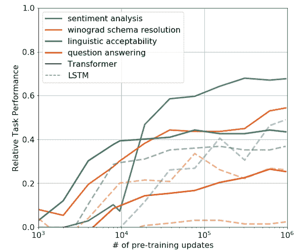

图 1. 零样本性能在不同任务上的演变，作为 LM 预训练更新的函数。（图片来自[GPT-1 论文](https://cdn.openai.com/research-covers/language-unsupervised/language_understanding_paper.pdf)。）

这促使范式从“**预训练加微调**”转变为“**仅预训练**”，换句话说，一个任务无关的预训练模型，它可以处理不同的任务**而不需要微调**。

GPT-2 和 GPT-3 都是按照这个理念设计的。

但你可能想知道，为什么**预训练加微调**的魔法没有正常工作？跳过微调阶段还有什么额外的好处？

### **微调的局限性**

微调对于一些定义明确的任务工作得很好，但不是所有任务，问题在于 NLP 领域中存在许多我们从未有机会实验的任务。

对于这些任务，微调阶段的要求意味着我们需要为每个新的任务收集一个有意义的微调数据集，如果我们希望我们的模型有一天真正变得智能，这显然不是理想的情况。

同时，在一些研究中，研究人员观察到，随着我们使用的模型越来越大，在微调数据中利用虚假相关性的风险越来越高。这创造了一个悖论：模型需要足够大，以便在训练过程中尽可能多地吸收信息，但在小而分布狭窄的数据集上微调这样一个大模型将使其在泛化到分布外样本时遇到困难。

另一个原因是，作为人类，我们不需要大量的监督数据集来学习大多数语言任务，而且如果我们希望我们的模型有一天能变得有用，我们希望它们也能拥有这样的流畅性和通用性。

现在可能真正的疑问是，我们能做些什么来实现这个目标并跳过微调？

在深入探讨 GPT-2 和 GPT-3 的细节之前，让我们首先看看影响它们模型设计的三个关键要素：任务无关学习、规模假设和上下文学习。

### **任务无关学习**

任务无关学习，也称为**元学习**或**学习如何学习**，指的是机器学习中的一个新范式，其中模型在训练时发展出一套广泛的能力，然后在推理时使用这些能力快速适应新任务。

例如，在[MAML](https://arxiv.org/abs/1703.03400)（模型无关元学习）中，作者展示了模型可以仅用很少的例子适应新任务。更具体地说，在每次内部循环（用蓝色突出显示）中，模型首先从一系列任务中采样一个任务，并执行几个梯度下降步骤，从而得到一个适应后的模型。这个适应后的模型将在外部循环（用橙色突出显示）中的相同任务上进行评估，然后损失将用于更新模型参数。

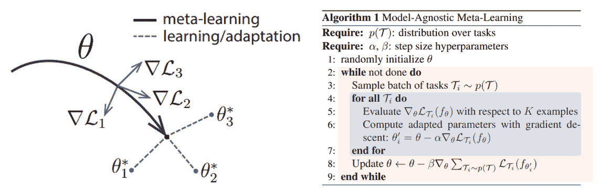

图 2. 模型无关元学习。（图片来自[MAML 论文](https://arxiv.org/pdf/1703.03400)）

MAML 表明学习可以更加通用和灵活，这与绕过每个单独任务的微调方向一致。在接下来的图中，GPT-3 的作者解释了如何将这一想法与情境学习相结合，以扩展到学习语言模型，外部循环遍历不同的任务，而内部循环使用**情境学习**来描述，这将在后面的章节中更详细地解释。

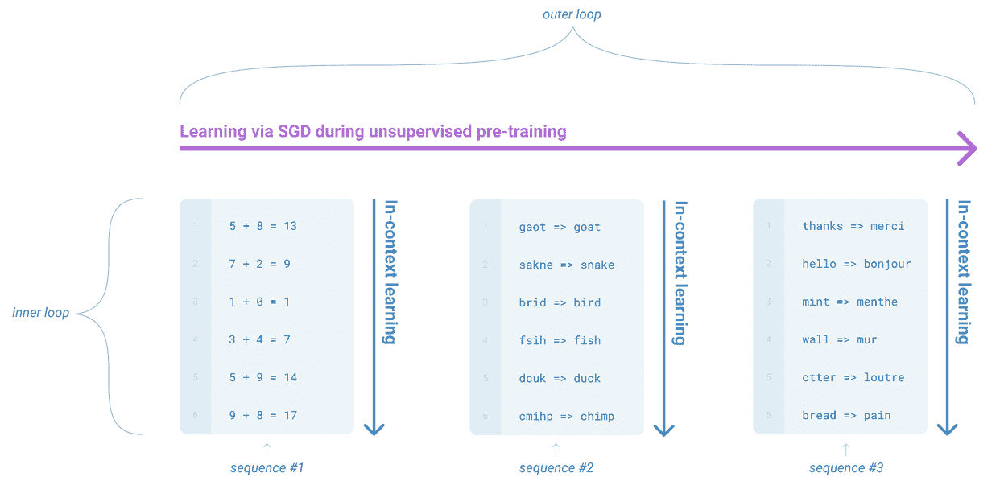

图 3. 语言模型元学习。（图片来自[GPT-3 论文](https://arxiv.org/abs/2005.14165)）

### **规模假设**

作为 GPT-2 和 GPT-3 发展背后的最具影响力的想法之一，规模假设指的是观察到的现象，即当使用大量数据进行训练时，大模型可以自动发展出新的能力，而无需显式监督，或者换句话说，当扩展时，**涌现**能力可能会出现，就像我们在预训练的 GPT-1 的零样本能力中看到的那样。

GPT-2 和 GPT-3 都可以被视为测试这一假设的实验，其中 GPT-2 旨在测试是否可以直接使用在大数据集上预训练的更大模型来解决下游任务，而 GPT-3 旨在测试在进一步扩展时，情境学习是否能在 GPT-2 的基础上带来改进。

我们将在后面的章节中更详细地讨论他们如何实现这一想法。

### **情境学习**

如图 3 所示，在语言模型的背景下，情境学习指的是元学习过程的内部循环，其中模型在推理时被给予一个自然语言指令和几个任务演示，并期望通过自动发现给定演示中的模式来完成该任务。

注意，上下文学习发生在测试阶段**没有梯度更新**，这与传统的微调完全不同，更类似于人类执行新任务的方式。

如果你对术语不熟悉，**演示**通常是指与特定任务相关联的示例输入-输出对，正如我们在下面图中的“**示例**”部分所展示的：

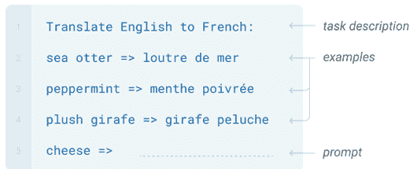

图 4. 几次示例中的上下文学习。（图片来自[GPT-3 论文](https://arxiv.org/abs/2005.14165)）

在 GPT-2 中隐式地探索了上下文学习，然后在 GPT-3 中更正式地定义了三种不同的设置：零次、一次和几次，这取决于向模型提供的演示数量。

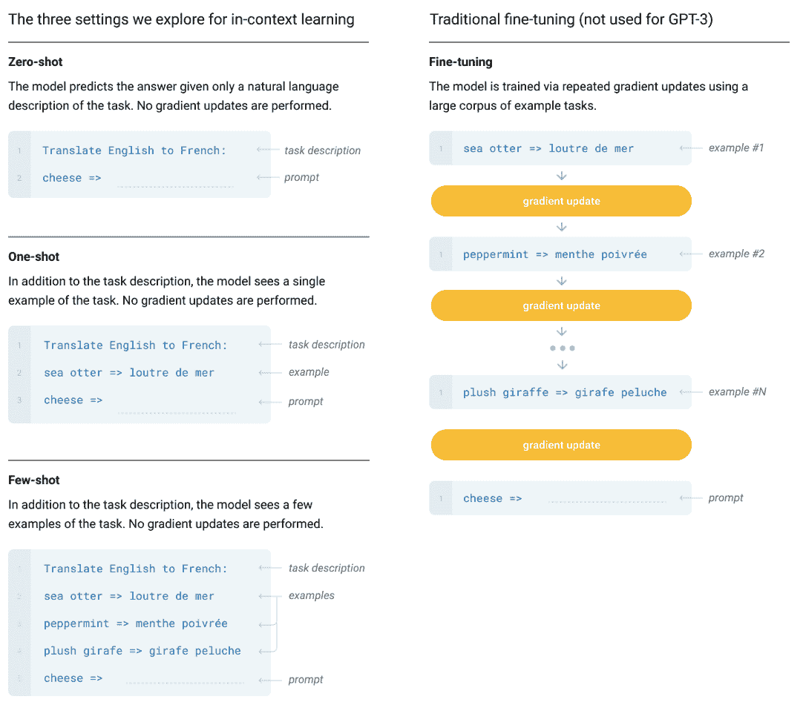

图 5. 零次、一次和几次上下文学习，与传统的微调进行对比。（图片来自[GPT-3 论文](https://arxiv.org/abs/2005.14165)）

简而言之，**任务无关学习突出了绕过微调的潜力，而规模假设和上下文学习则提出了一条实现这一目标的实际途径。**

在接下来的章节中，我们将分别详细介绍 GPT-2 和 GPT-3 的更多细节。

* * *

## GPT-2

### **模型架构**

GPT-2 的模型架构主要遵循 GPT-1 的设计，略有修改：

+   将 LayerNorm 移动到每个子块的输入处，并在最终的自我注意力块之后添加一个额外的 LayerNorm，以使训练更加稳定。

+   通过 1/sqrt(N)的因子缩放残差层的权重，其中 N 是残差层的数量。

+   扩展词汇到 50257，并使用修改后的 BPE 词汇表。

+   将上下文大小从 512 增加到 1024 个标记，并使用更大的批处理大小 512。

在 GPT-2 论文中，作者训练了四个模型，其大小大约是按对数均匀分布的，参数数量从 1.17 亿到 15 亿不等：

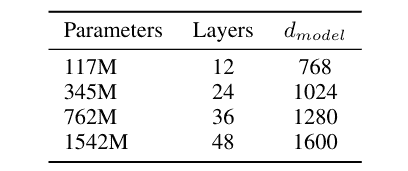

表 1. 4 个 GPT-2 模型的架构超参数。（图片来自[GPT-2 论文](https://cdn.openai.com/better-language-models/language_models_are_unsupervised_multitask_learners.pdf)）

### **训练数据**

随着我们扩大模型规模，我们也需要使用更大的数据集进行训练，这就是为什么在 GPT-2 中，作者创建了一个新的数据集，称为 WebText，包含大约 4500 万个链接，比用于预训练 GPT-1 的链接要多得多。他们还提到了许多清理数据以提高其质量的技术。

### **评估结果**

总体而言，GPT-2 在许多任务上取得了良好的结果，尤其是在与语言建模相关的任务上。然而，对于阅读理解、翻译和问答等任务，它仍然不如相应的 SOTA 模型表现好，这在一定程度上促使了 GPT-3 的开发。

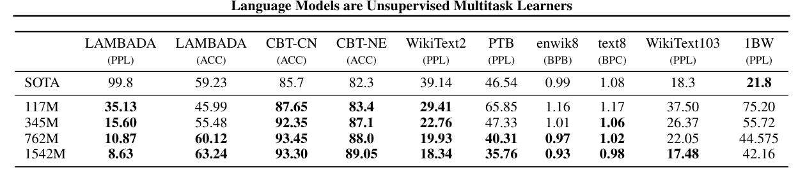

表 2. GPT-2 零样本性能。（图片来自[GPT-2 论文](https://cdn.openai.com/better-language-models/language_models_are_unsupervised_multitask_learners.pdf)）

* * *

## GPT-3

### 模型架构

GPT-3 采用了与 GPT-2 非常相似的模型架构，唯一的区别是 GPT-3 在 Transformer 中使用了交替的密集和局部带状稀疏注意力模式。

GPT-3 训练了 8 个不同大小的模型，参数数量从 12.5 亿到 1750 亿不等：

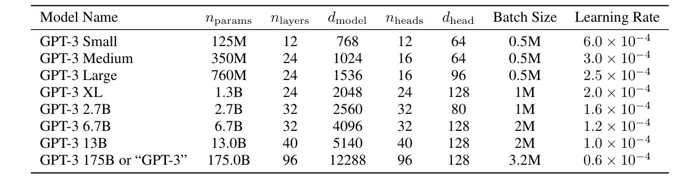

表 3. 8 个 GPT-3 模型的架构超参数。（图片来自[GPT-3 论文](https://arxiv.org/abs/2005.14165)）

### **训练数据**

GPT-3 模型是在更大的数据集上训练的，如下表所示，作者再次进行了一些清理工作以提高数据质量。同时，训练数据集的采样不是按其大小比例进行的，而是根据其质量，高质量的数据集在训练过程中被更频繁地采样。

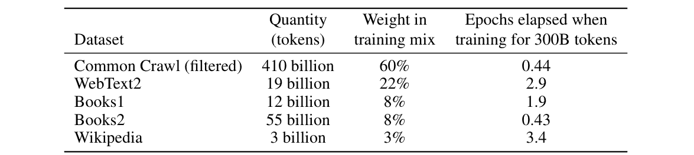

表 4. GPT-3 训练中使用的数据集。（图片来自[GPT-3 论文](https://arxiv.org/abs/2005.14165)）

### **评估结果**

通过结合更大的模型和情境学习，GPT-3 在包括翻译、问答、完形填空任务以及需要即时推理或领域适应的任务在内的许多 NLP 数据集上取得了强大的性能。作者在[原始论文](https://arxiv.org/abs/2005.14165)中展示了非常详细的评估结果。

在本文中，我们想强调的一些发现：

首先，在 GPT-3 的训练过程中，他们观察到性能与计算量之间呈现出平滑的缩放趋势，如图所示，其中验证损失随着计算量的指数增长而线性下降。

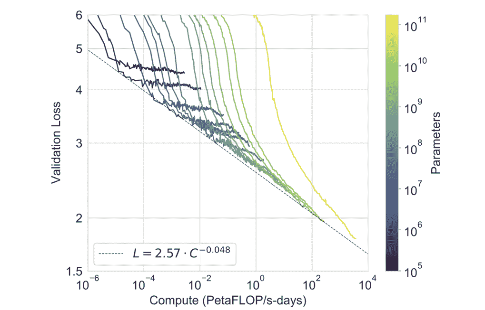

图 6.性能与计算量的平滑缩放。（图片来自[GPT-3 论文](https://arxiv.org/abs/2005.14165)）

其次，当比较三种情境学习设置（零样本、单样本和少样本）时，他们观察到在所有三种设置中，更大的模型都显得更有效率：

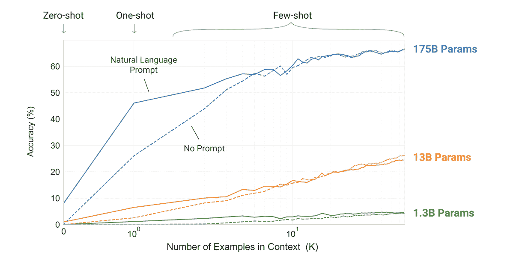

图 7. 更大的模型在上下文学习方面更有效率。（图片来自[GPT-3 论文](https://arxiv.org/abs/2005.14165)）

在此之后，他们绘制了所有三个设置的综合性能图，这进一步证明了更大的模型更有效，并且少样本性能比其他两种设置增长得更快。

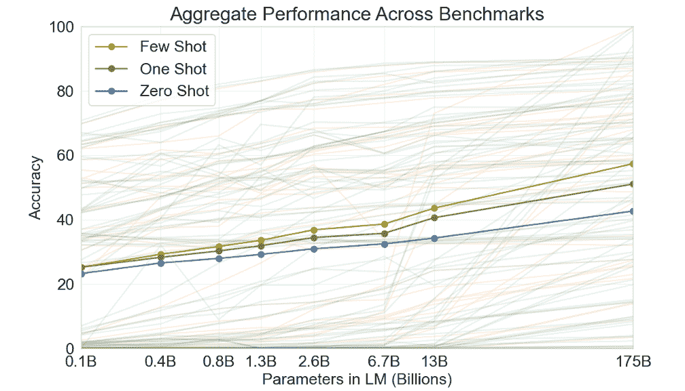

图 8. 所有 42 个基于准确率的基准测试的综合性能。（图片来自[GPT-3 论文](https://arxiv.org/abs/2005.14165)）

* * *

## 结论

GPT-2 和 GPT-3 的发展弥合了原始 GPT-1 与更先进的版本如 InstructGPT 之间的差距，反映了 OpenAI 在训练有用的大型语言模型（LLM）方面的方法论持续改进。

他们的成功也为自然语言处理（NLP）和更广泛的机器学习（ML）社区开辟了新的研究方向，许多后续工作都集中在理解新兴能力、开发新的训练范式、探索更有效的数据清洗策略，以及提出针对安全、公平和伦理考量等方面的有效评估协议等。

在下一篇文章中，我们将继续我们的探索，并带您了解 GPT-3.5 和 InstructGPT 的关键要素。

感谢阅读！
