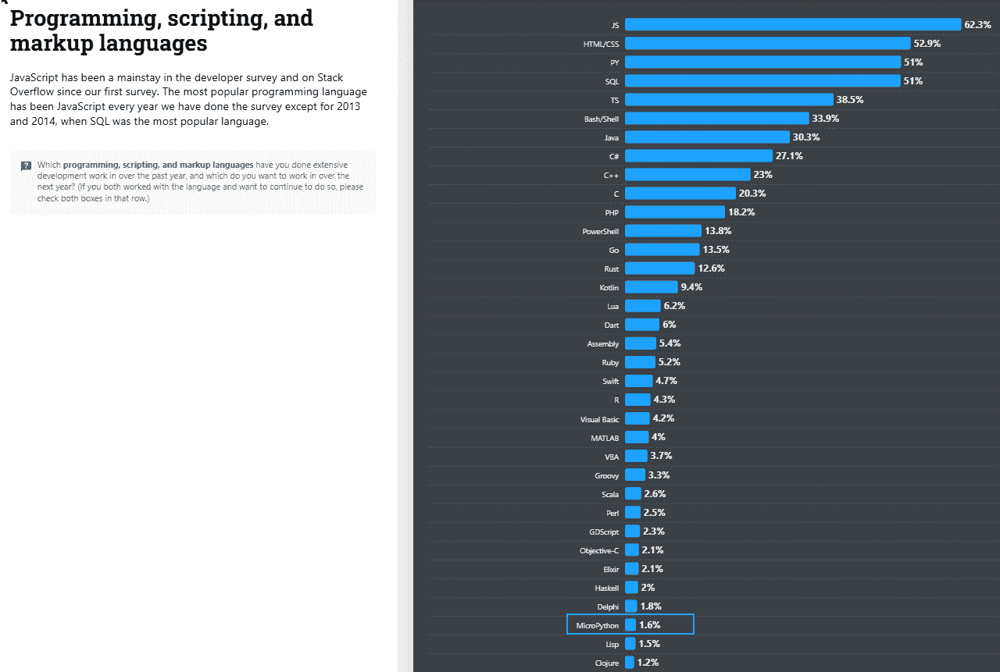
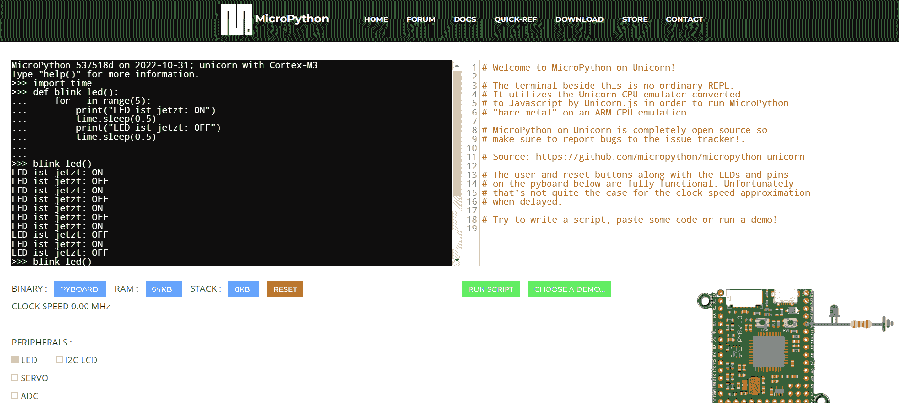

# 什么是 MicroPython？我作为数据科学家需要了解它吗？

> [原文链接](https://towardsdatascience.com/what-is-micropython-do-i-need-to-know-it-as-a-data-scientist-5b4567a21b99/)

当我看到 MicroPython 出现在今年 Stack Overflow 调查的列表上时，我想知道我能用这种语言做什么。我还想知道它是否可以作为硬件和软件之间的桥梁。在这篇文章中，我分析了 MicroPython 是什么以及数据科学家应该了解什么。

> **目录** 1 – 什么是 MicroPython 以及它为什么特别？ 2 – 为什么作为数据科学家我应该了解 MicroPython？ 3 – 与 Python 和其他编程语言有什么区别？ 4 – 在实践中这看起来是什么样子？（仅限基于 Web 的模拟器） 5 – 结语 & 在哪里继续学习？



来自[Stack Overflow](https://survey.stackoverflow.co/2024/technology#admired-and-desired?target=blank)的图片

## 什么是 MicroPython 以及它为什么特别？

MicroPython 是专为在微控制器和其他低资源嵌入式系统上使用而设计的 Python 3 的简化、紧凑版本。正如我们可以在官方网站上阅读的那样，该语言提供了一个缩减的标准库和特殊模块，可以直接与硬件组件（如 GPIO 引脚、传感器或 LED）交互。

*[参考：官方 MicroPython 网站](https://micropython.org/)*

**让我们来分解这个定义：**

+   简化、紧凑的 Python：MicroPython 被设计为比标准 Python 版本使用更少的内存和计算能力。这种语言非常适合只有几 KB RAM 的设备。

+   微控制器与嵌入式系统：将微控制器想象成芯片上的小型计算机。它可以控制物联网传感器、智能家居设备和机器人等设备。

+   低资源系统：这意味着这些系统内存很少（通常不到 1MB）且计算能力有限。

+   GPIO 引脚：这些是微控制器上的引脚，可用于各种输入和输出功能。例如，它们可以用来控制 LED 或读取传感器数据。

### MicroPython 为什么相关？

如果你了解 Python，你可以用 MicroPython 来编程硬件——无需学习像 C++或汇编这样的新复杂语言。当然，C++和汇编提供了更多选项，并且两者都更接近机器语言。但如果你想要以相对较少的努力创建原型，MicroPython 为你提供了一个理想的起点。

## 为什么作为数据科学家我应该了解 MicroPython？

简而言之：因为它在 Stack Overflow 调查中被列出，并且在开发者社区中越来越受欢迎...

物联网和边缘计算在人工智能和数据科学项目中扮演着越来越重要的角色。特别是当我们想要使我们的城市更智能（智能城市）时。

MicroPython 可以在这里作为硬件和软件之间的桥梁，因为它使得收集传感器数据并在数据科学管道或机器学习模型中处理数据成为可能。例如，一个 MicroPython 传感器可以测量空气质量并将数据发送到机器学习管道。MicroPython 还可以直接在设备上运行简单的 AI 模型（边缘计算）——这使得它非常适合本地计算，而设备不依赖于云。

因此，我的结论是：MicroPython 使硬件对数据科学家更加易于访问。如果你知道 Python，你还可以使用 MicroPython 并将其应用于智能家居项目中。

## 与 Python 和其他编程语言相比，有什么区别？

虽然 Python 是为在功能强大的设备（如 PC 或服务器）上运行的通用软件应用程序而开发的，但 MicroPython 是为低资源设备（如微控制器）开发的，这些设备通常只有几千字节内存和计算能力。

如我们所知，Python 提供了广泛的数据分析（pandas、numpy）、机器学习（scikit-learn、tensorflow）或网络开发库。另一方面，MicroPython 只包含一个精简的标准库和如‘math’或‘os’之类的精简模块。相反，它提供了特殊的硬件模块，如用于计时器的‘utime’或用于控制微控制器引脚的‘machine’。

虽然 Python 更适合数据密集型任务，但 MicroPython 允许直接访问硬件组件，因此非常适合嵌入式系统（例如微波炉和智能电视等日常电子产品或血压计等医疗设备）和物联网项目。

## 这在实际中是什么样的？应用领域和快速模拟器演示

MicroPython 在哪些领域被使用？

+   物联网（IoT）：MicroPython 可以用来控制智能家居设备或控制仪表板上的传感器数据。

+   边缘计算：你可以在边缘设备（例如物联网传感器、智能手机、路由器、智能摄像头、智能家居设备等）上直接运行机器学习模型。

+   原型设计：只需付出相对较少的努力，你就可以快速为硬件项目搭建一个原型——尤其是如果你熟悉 Python。

+   机器人技术：MicroPython 可以用于控制机器人项目中的电机或传感器。

## 在模拟器中闪烁 LED 作为实际示例

由于作为数据科学家或软件专家，你可能不想仅仅为了尝试 MicroPython 就购买硬件，所以我探索了在线可用的 MicroPython 模拟器。这是一种简单且适合初学者的方式，可以在不使用物理设备的情况下开始编程硬件概念：

1.  打开 [`micropython.org/unicorn/`](https://micropython.org/unicorn/)

1.  首先导入时间，然后定义函数，并在最后调用该函数。请在网络终端中单独输入每个代码片段，然后点击“Enter”。你可以使用以下代码：

```py
#Provides functions to work with time
#(standard Python library instead of 'utime', as the code is used in the simulator)
import time
```

```py
# Simulated LED by defining the function
def blink_led():
    for _ in range(5):
        print("LED ist jetzt: ON")
        time.sleep(0.5)  # Waits for 0.5 seconds
        print("LED ist jetzt: OFF")
        time.sleep(0.5)
```

```py
# Start the blinking by calling the function
blink_led()
```

现在我们看到 LED 灯（仅在控制台）在开和关之间切换。在这个模拟器示例中，我只使用了时间库来实现延迟。要使用真实硬件运行示例，你应该使用额外的库，例如‘machine’或‘utime’。



在网页模拟器中，我们可以通过编写一个小脚本输出闪烁的 LED 来编写一个‘hello world’程序。

## 最后的想法

MicroPython 对于从事硬件项目如物联网和边缘计算的人来说当然很重要。但由于其易于访问，并且任何了解 Python 的人都可以使用 MicroPython，这种语言在数据科学、人工智能和硬件技术之间架起了一座桥梁。至少了解 MicroPython 的目的和与 Python 的区别是很好的。如果你对尝试智能家居设备或物联网感兴趣，这当然是一个可访问的入门点。

### 接下来去哪里学习？

+   [Stack Overflow 调查](https://survey.stackoverflow.co/2024/technology#admired-and-desired?target=blank)

+   [MicroPython – 下载、文档和讨论](https://micropython.org/)

+   [MicroPython for RaspberryPi](https://www.raspberrypi.com/documentation/microcontrollers/micropython.html)

+   [MicroPython Wiki](https://github.com/micropython/micropython/wiki)

+   [YouTube – Hello IoT](https://www.youtube.com/playlist?list=PLmsFUfdnGr3xRts0TIwyaHyQuHaNQcb6-)


个人可视化 – 来自[unDraw.co](https://undraw.co/illustrations)的插图
