# 5 Crucial Tweaks That Will Make Your Charts Accessible to People with Visual Impairments

> 原文：[`towardsdatascience.com/5-crucial-tweaks-that-will-make-your-charts-accessible-to-people-with-visual-impairments/`](https://towardsdatascience.com/5-crucial-tweaks-that-will-make-your-charts-accessible-to-people-with-visual-impairments/)

[大约 4.5%的世界人口患有色盲。](https://www.colorblindguide.com/post/colorblind-people-population-live-counter)

<mdspan datatext="el1749213472718" class="mdspan-comment">这大约是 3.5 亿人，他们仅有一种视觉障碍。如果考虑所有情况，数字会显著增加。然而，这是一个很少被讨论的话题。

作为数据专业人士，你不想任何人误解你的视觉呈现。当然，更加清晰明确需要更多的工作，但你会让相当一部分人感到满意。

今天，你将获得 5 个实用的技巧，帮助你使现有的可视化对视觉障碍人士更易访问。

## 在你的数据可视化中实施可访问性的具体指南

但首先，让我们回顾一下当可访问性是首要任务时应遵循的一些一般性指南。

以下列出的每一项都是[A11Y 项目](https://www.a11yproject.com/checklist/)的精选和显著简化的清单。如果你想知道，“A11Y”是“可访问性”（A 和 Y 之间有 11 个字母）的缩写。

总之，以下是你应该注意的事项：

+   **不要仅依赖颜色来解释数据** – 相当一部分人患有色盲或存在其他视觉障碍。模式是一种可行的方式。

+   **如果使用颜色，请选择深色、高对比度的色调** – 浅色和低对比度的颜色几乎无法在图表中视觉上区分各组。

+   **不要将重要数据隐藏在交互之后** – 悬停事件仅在桌面版上可用。大多数用户都在智能手机上。

+   **使用标签和图例** – 没有它们，读者不知道数据代表什么。

+   **将数据转化为清晰的见解** – 尽可能简化数据，然后进一步简化。你不想让任何事物存在解释的余地。

+   **提供上下文并解释可视化** – 如果可行，标注感兴趣的数据点，并添加副标题/字幕。

+   **考虑到屏幕阅读器的用户** – 视觉障碍人士使用屏幕阅读器来浏览网页。使用替代文本来描述你嵌入的图表。

考虑到这些因素，我提出了 5 个你可以立即实施的实用调整。

让我们深入探讨#1。

## 1\. 使用高对比度或色盲友好型调色板

理解为什么颜色选择很重要最简单的方法是先做错。

考虑以下数据集：

```py
x = np.array(["New York", "San Francisco", "Los Angeles", "Chicago", "Miami"])
y1 = np.array([50, 63, 40, 68, 35])
y2 = np.array([77, 85, 62, 89, 58])
y3 = np.array([50, 35, 79, 43, 67])
y4 = np.array([59, 62, 33, 77, 72])
```

这是一个完美的堆叠柱状图的候选者。换句话说，要在 X 轴上显示办公地点，在 Y 轴上堆叠员工数量。

现在想象一下你真的很喜欢绿色。

你可能想要用不同深浅的绿色来着色单个条形部分。这是一种糟糕的做法（除了某些单色调色板），如下所示：

```py
plt.bar(x, y1, label="HR", color="#32a852")
plt.bar(x, y2, bottom=y1, label="Engineering", color="#3ebd61")
plt.bar(x, y3, bottom=y1 + y2, label="Marketing", color="#2bc254")
plt.bar(x, y4, bottom=y1 + y2 + y3, label="Sales", color="#44c767")

plt.title("[DON'T] Employee Count Per Location And Department", loc="left", fontdict={"weight": "bold"}, y=1.06)
plt.xlabel("Office Location")
plt.ylabel("Count")

plt.legend(loc="upper right", ncol=4)
plt.ylim(top=320)
plt.show()
```

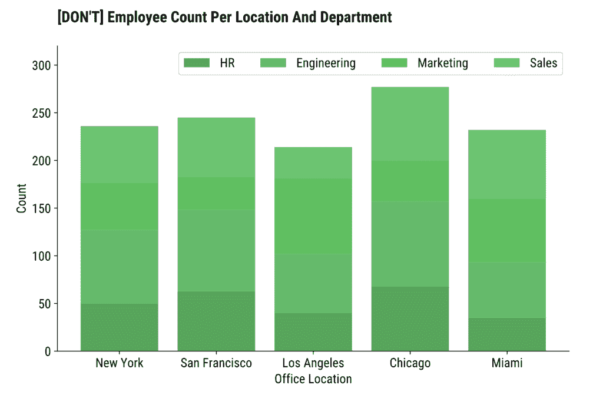

图像 1 – 难以区分颜色的调色板（图片由作者提供）

许多人想知道如果他们的图表被印在黑白书中会是什么样子。

这个看起来只会稍微差一点，但仅仅是因为它一开始就看起来很糟糕。即使对于没有视力障碍的人来说，区分条形部分也很困难。

*[你可以使用这个网站来检查两种颜色之间的对比度。](https://contrastchecker.online/)*

让我们通过使用高对比度调色板来解决这个问题。

### 自定义高对比度调色板

我将继续假设你喜欢绿色。

**问题：**如何从一个颜色创建一个高对比度调色板？

**答案：**从深色调开始，以与主色调相似的颜色结束。在这种情况下，黄金色是一个完美的选择。

这样你就能兼顾两者。你仍然在使用你喜欢的颜色，而且颜色不需要随着条形部分的过渡而变浅（这会降低对比度）。

实际上，这归结为对所有部分玩转`color`参数：

```py
plt.bar(x, y1, label="HR", color="#14342B")
plt.bar(x, y2, bottom=y1, label="Engineering", color="#60935D")
plt.bar(x, y3, bottom=y1 + y2, label="Marketing", color="#BAB700")
plt.bar(x, y4, bottom=y1 + y2 + y3, label="Sales", color="#F5E400")

plt.title("[DO] Employee Count Per Location And Department", loc="left", fontdict={"weight": "bold"}, y=1.06)
plt.xlabel("Office Location")
plt.ylabel("Count")

plt.legend(loc="upper right", ncol=4)
plt.ylim(top=320)
plt.show()
```

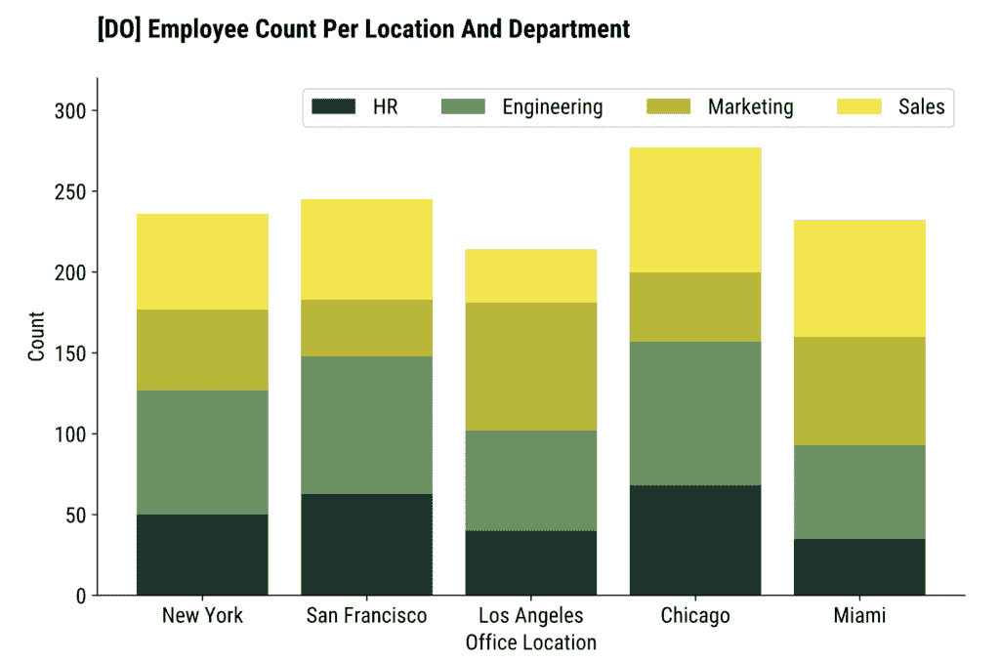

图像 2 – 自定义调色板（图片由作者提供）

这样对眼睛来说更容易接受。

### 预定义的色盲调色板

但请考虑以下场景：

+   你没有时间玩转不同的颜色组合

+   你确实有时间，但你的数据集中大约有十几个类别（读作：要找到十几种颜色）

有一个更简单的解决方案可以使你的图表配色方案更容易接受，同时考虑到视力受损的人。

一种解决方案是使用色盲友好的调色板。

片段的第一行显示了如何操作：

```py
plt.style.use("tableau-colorblind10")

plt.bar(x, y1, label="HR")
plt.bar(x, y2, bottom=y1, label="Engineering")
plt.bar(x, y3, bottom=y1 + y2, label="Marketing")
plt.bar(x, y4, bottom=y1 + y2 + y3, label="Sales")

plt.title("[DO] Employee Count Per Location And Department", loc="left", fontdict={"weight": "bold"}, y=1.06)
plt.xlabel("Office Location")
plt.ylabel("Count")

plt.legend(loc="upper right", ncol=4)
plt.ylim(top=320)
plt.show()
```

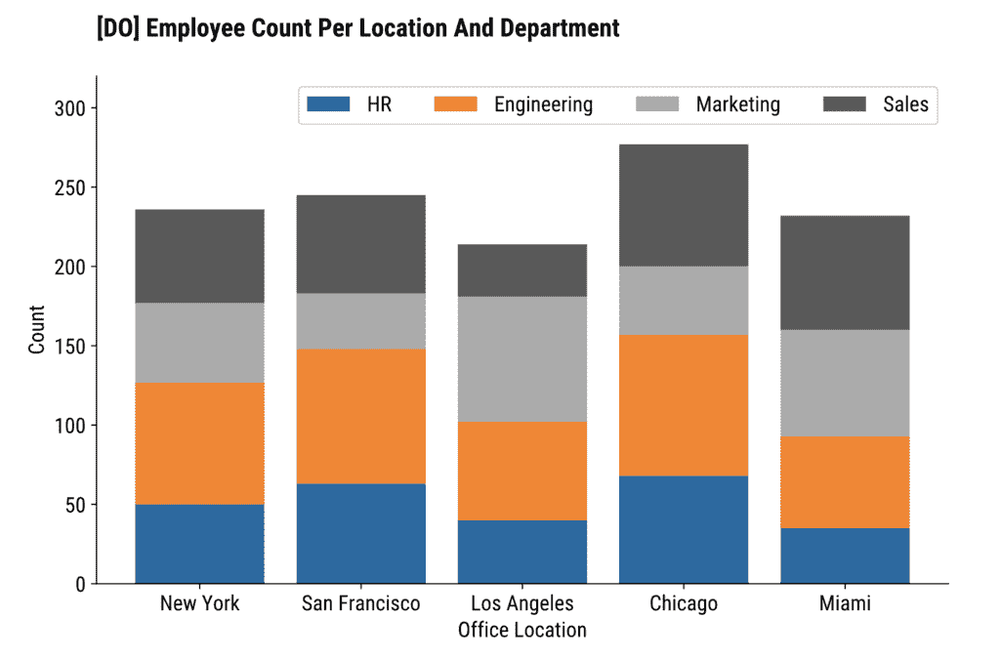

图像 3 – 内置色盲调色板（图片由作者提供）

这个调色板包含 10 种色盲友好颜色，因此它非常适合有 10 组或更少的图表。

如果你需要更多，也许重新思考你的可视化策略会更好。

## 2. 停止使用颜色 - 使用图案代替

从你的图表中移除任何误解的另一个好方法是使用图案而不是颜色（或者作为颜色的补充）。

Matplotlib 有[10 种图案样式](https://matplotlib.org/stable/gallery/shapes_and_collections/hatch_style_reference.html)可供选择。

你可以通过增加密度或组合多个图案来进一步自定义图案。但这将是另一个话题。

要实现图案，将`hatch`参数添加到`plt.bar()`中。以下示例通过设置`fill=False`完全去除了颜色：

```py
plt.bar(x, y1, label="HR", fill=False, hatch="*")
plt.bar(x, y2, bottom=y1, label="Engineering", fill=False, hatch="xx")
plt.bar(x, y3, bottom=y1 + y2, label="Marketing", fill=False, hatch="..")
plt.bar(x, y4, bottom=y1 + y2 + y3, label="Sales", fill=False, hatch="//")

plt.title("[DO] Employee Count Per Location And Department", loc="left", fontdict={"weight": "bold"}, y=1.06)
plt.xlabel("Office Location")
plt.ylabel("Count")

plt.legend(loc="upper right", ncol=4)
plt.ylim(top=320)
plt.show()
```

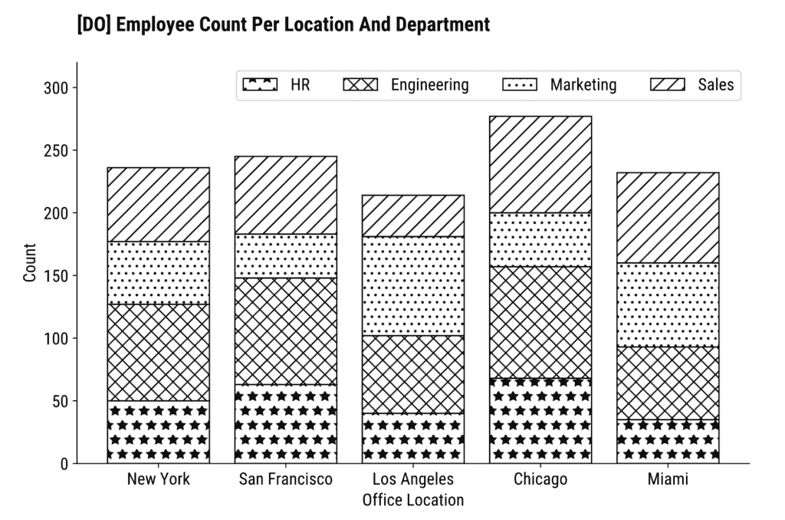

图像 4 – 使用图案绘图（图片由作者提供）

现在无法误解这个图表上的数据。

### 你能将图案与颜色混合吗？

如果你想两者兼得，颜色加图案就是关键所在。

你可能想移除 fill=False 参数，并用 `color` 替换它。或者，只需复制以下代码片段：

```py
plt.bar(x, y1, label="HR", color="#14342B", hatch="*")
plt.bar(x, y2, bottom=y1, label="Engineering", color="#60935D", hatch="xx")
plt.bar(x, y3, bottom=y1 + y2, label="Marketing", color="#BAB700", hatch="..")
plt.bar(x, y4, bottom=y1 + y2 + y3, label="Sales", color="#F5E400", hatch="//")

plt.title("[DO] Employee Count Per Location And Department", loc="left", fontdict={"weight": "bold"}, y=1.06)
plt.xlabel("Office Location")
plt.ylabel("Count")

plt.legend(loc="upper right", ncol=4)
plt.ylim(top=320)
plt.show()
```

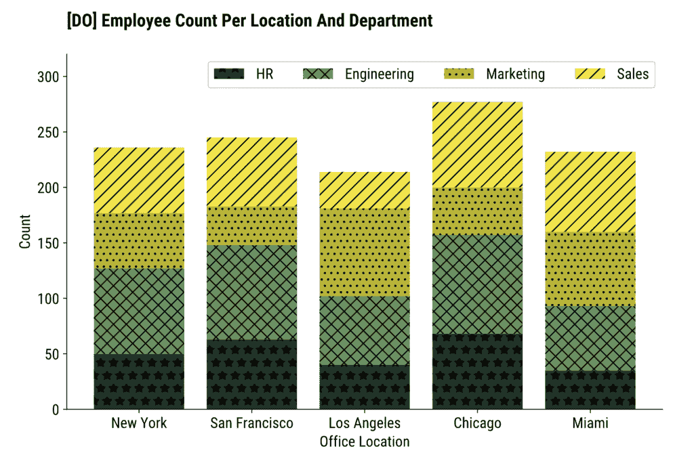

图像 5 – 使用颜色和图案绘图（作者图片）

暗色图案在条形段上清晰可见，但情况不一定总是如此。

`edgecolor` 参数控制图案颜色。让我们看看将其设置为白色后会发生什么：

```py
plt.bar(x, y1, label="HR", color="#14342B", hatch="*", edgecolor="#FFFFFF")
plt.bar(x, y2, bottom=y1, label="Engineering", color="#60935D", hatch="xx", edgecolor="#FFFFFF")
plt.bar(x, y3, bottom=y1 + y2, label="Marketing", color="#BAB700", hatch="..", edgecolor="#FFFFFF")
plt.bar(x, y4, bottom=y1 + y2 + y3, label="Sales", color="#F5E400", hatch="///", edgecolor="#FFFFFF")

plt.title("[MAYBE] Employee Count Per Location And Department", loc="left", fontdict={"weight": "bold"}, y=1.06)
plt.xlabel("Office Location")
plt.ylabel("Count")

plt.legend(loc="upper right", ncol=4)
plt.ylim(top=320)
plt.show()
```

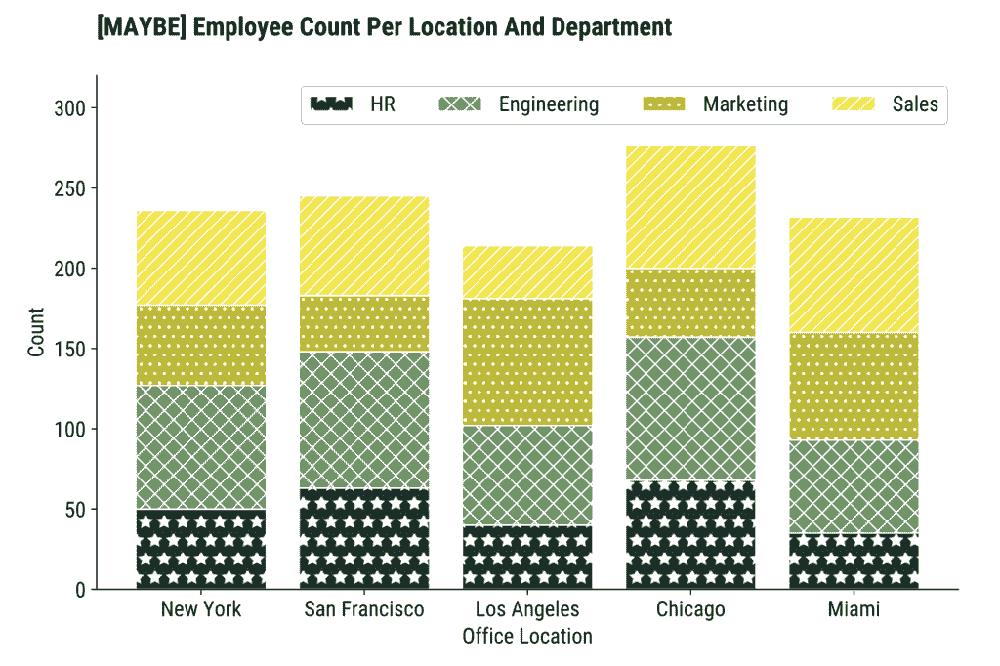

图像 6 – 使用颜色和图案绘图（2）（作者图片）

图案对于 **HR** 和 **Engineering** 部门是可见的，但顶部的两个则不同。

你可能没有困难地看到最上面的图表段上的线条，但请设身处地考虑一个有视觉障碍的人。他们应该始终是你的参考框架。

**记住**：浅色图案在深色背景上效果很好。深色图案在浅色背景上效果很好。相应调整。

## 3. 不要让用户信息过载

这个原则有两个方向：

+   不要在单个图表上放置太多信息

+   不要把太多的图表放在一起，例如，在你的应用程序/仪表板上。

同时做这两件事在数据可视化中可以说是**终极罪过**。

让我们先添加几个更多部门到混合中。

使用 Python 列表管理数据变得越来越困难，所以我选择了 Pandas DataFrame：

```py
import pandas as pd

df = pd.DataFrame({
    "HR": [50, 63, 40, 68, 35],
    "Engineering": [77, 85, 62, 89, 58],
    "Marketing": [50, 35, 79, 43, 67],
    "Sales": [59, 62, 33, 77, 72],
    "Customer Service": [31, 34, 61, 70, 39],
    "Distribution": [35, 21, 66, 90, 31],
    "Logistics": [50, 54, 13, 71, 32],
    "Production": [22, 51, 54, 28, 40],
    "Maintenance": [50, 32, 61, 69, 50],
    "Quality Control": [20, 21, 88, 89, 39]
}, index=["New York", "San Francisco", "Los Angeles", "Chicago", "Miami"])

df
```

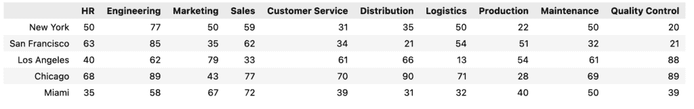

图像 7 – 更宽的数据集（作者图片）

现在，使用色盲友好调色板，让我们按地点和部门绘制员工数量堆叠条形图。为了使事情更加拥挤，我还加入了文本计数：

```py
plt.style.use("tableau-colorblind10")
ax = df.plot(kind="bar", stacked=True)

for container in ax.containers:
    ax.bar_label(container, label_type="center", fontsize=10, color="#000000", fontweight="bold")

plt.title("[DON'T] Employee Count Per Location And Department", loc="left", fontdict={"weight": "bold"}, y=1.06)
plt.xlabel("Office Location")
plt.ylabel("Count")
plt.legend(title="Department", bbox_to_anchor=(1.05, 1), loc='upper left', ncol=1)

plt.show()
```

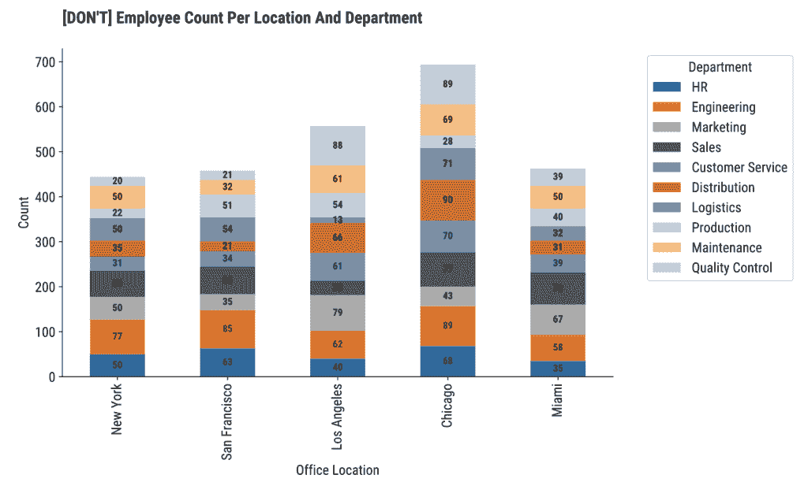

图像 8 – 拥挤的可视化（作者图片）

现在看起来真的很丑。

### 修正 #1 – 展示更少的信息

解决这种难以呈现的混乱的一种方法是通过向用户展示更少的信息。

例如，只在一个城市（跨部门）显示员工数量。然后你可以在图表旁边添加一个**下拉菜单**，让用户可以控制办公室位置。

以下代码片段以水平条形图的形式绘制芝加哥的每个部门的员工数量：

```py
chicago_data = df.loc["Chicago"].sort_values()

bars = plt.barh(chicago_data.index, chicago_data.values, color="#60935D", edgecolor="#000000")
for bar in bars:
    plt.text(bar.get_width() + 2, bar.get_y() + bar.get_height() / 2, f"{int(bar.get_width())}", va="center", ha="left", fontsize=14, color="#000000")

plt.title("[DO] Employee Count by Department in Chicago", loc="left", fontdict={"weight": "bold"}, y=1.06)
plt.xlabel("Count")
plt.ylabel("Department")

plt.show()
```

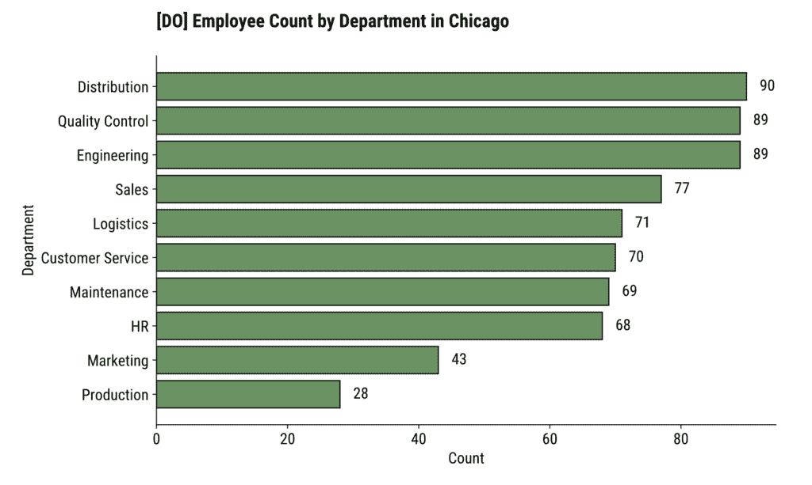

图像 9 – 更易读的可视化（作者图片）

### 修正 #2 – 重新组织数据

如果展示更少的信息不是一个选择，也许你可以**转置你的数据**。

例如，我们处理了 5 个办公室位置和 10 个部门。显示 10 列而不是 10 个条形段对眼睛来说更容易。

这样，你最终会以条形段的形式显示办公室位置，而不是部门：

```py
df_transposed = df.T
df_sorted = df_transposed.loc[df_transposed.sum(axis=1).sort_values().index]

ax = df_sorted.plot(kind="barh", width=0.8, edgecolor="#000000", stacked=True)

for container in ax.containers:
    ax.bar_label(container, label_type="center", fontsize=10, color="#FFFFFF", fontweight="bold")

plt.title("[DO] Employee Count Per Location And Department", loc="left", fontdict={"weight": "bold"}, y=1.06)
plt.xlabel("Office Location")
plt.ylabel("Count")

plt.show()
```

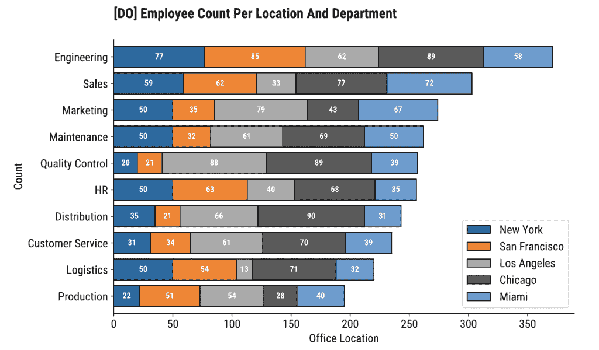

图像 10 – 转置的柱状图（作者图片）

这只是重新定义问题。

*图像 10*上的图表比*图像 8*上的图表好得多。这是一个事实。没有人可以对此提出异议。

## 4. 在图表中提供数据的深入解释

你可以利用图表的副标题和/或说明部分添加额外信息。

当你想提供更多关于数据的背景信息、引用来源或总结可视化中的主要观点时，这很有用。最后一个对于视力障碍人士来说最适用。

matplotlib 的问题在于它**没有为图表副标题和标题提供专用函数**。你可以使用 suptitle()，但你需要调整 x 和 y 轴坐标。

这里有一个例子：

```py
plt.bar(x, y1, label="HR", color="#14342B", hatch="*")
plt.bar(x, y2, bottom=y1, label="Engineering", color="#60935D", hatch="xx")
plt.bar(x, y3, bottom=y1 + y2, label="Marketing", color="#BAB700", hatch="..")
plt.bar(x, y4, bottom=y1 + y2 + y3, label="Sales", color="#F5E400", hatch="//")

plt.suptitle("Chart shows how the employees are distributed per department and per office location.\nChicago office has the most employees.", x=0.125, y=0.98, ha="left", fontsize=14, fontstyle="italic")
plt.title("Employee Count Per Location And Department", fontsize=20, fontweight="bold", y=1.15, loc="left")
plt.xlabel("Office Location")
plt.ylabel("Count")

plt.legend(loc="upper right", ncol=4)
plt.ylim(top=320)
plt.show()
```

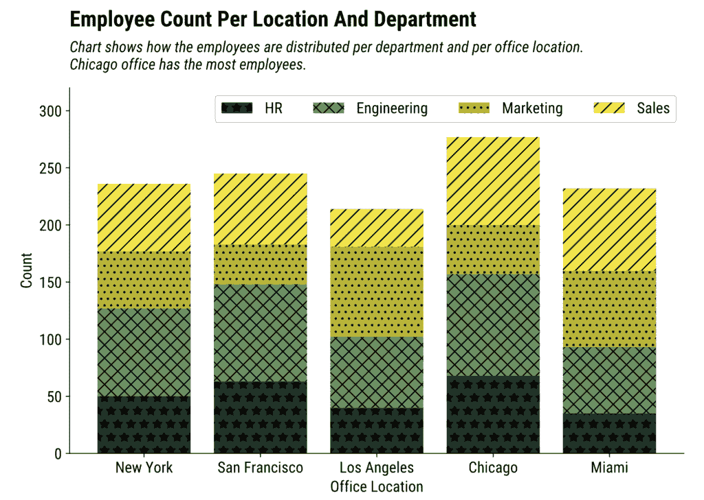

图像 11 – 带有标题和副标题的图表（图片由作者提供）

如果你更喜欢标题而不是副标题，你只需要在`plt.suptitle()`中更改 y 轴坐标：

```py
plt.bar(x, y1, label="HR", color="#14342B", hatch="*")
plt.bar(x, y2, bottom=y1, label="Engineering", color="#60935D", hatch="xx")
plt.bar(x, y3, bottom=y1 + y2, label="Marketing", color="#BAB700", hatch="..")
plt.bar(x, y4, bottom=y1 + y2 + y3, label="Sales", color="#F5E400", hatch="//")

plt.suptitle("Chart shows how the employees are distributed per department and per office location.\nChicago office has the most employees.", x=0.125, y=0, ha="left", fontsize=14, fontstyle="italic")
plt.title("Employee Count Per Location And Department", fontsize=20, fontweight="bold", y=1.06, loc="left")
plt.xlabel("Office Location")
plt.ylabel("Count")

plt.legend(loc="upper right", ncol=4)
plt.ylim(top=320)
plt.show()
```

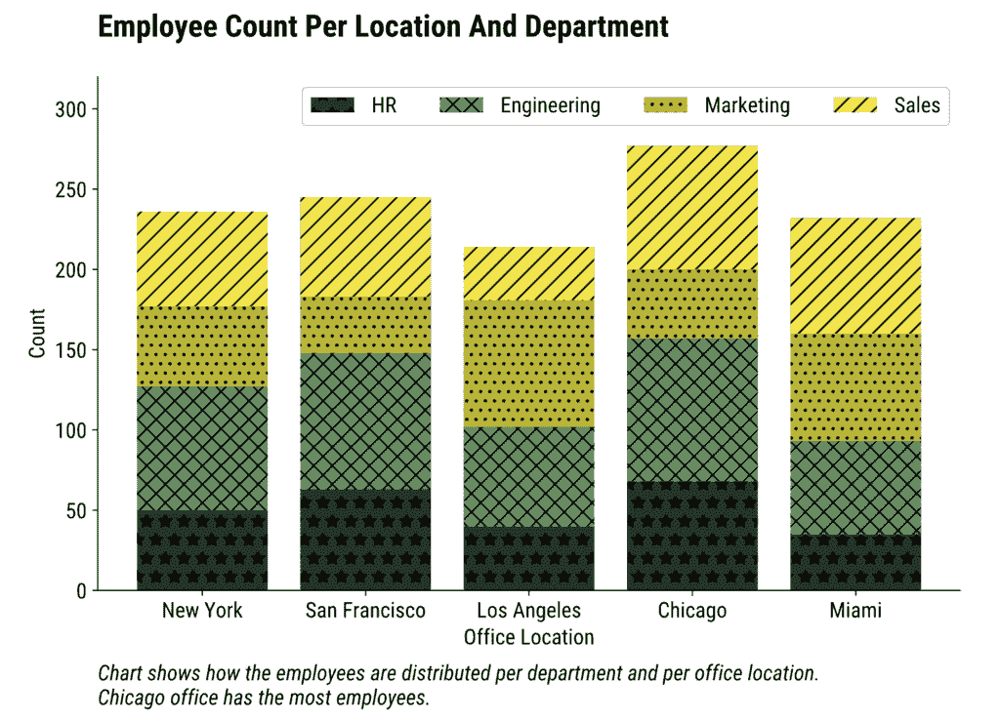

图像 12 – 带有标题和说明的图表（图片由作者提供）

总的来说，副标题或标题可能是正确传达信息给视力障碍人士的决定性因素。

只不过不要让它变成 10 个段落那么长。否则，这又成了这篇文章的第三点。

## 5. 在嵌入图表时添加替代文本

许多视力障碍人士使用屏幕阅读器。

**屏幕阅读器和图表的问题**在于它们根本无法共存。它们可能能够从图表中提取文本元素，但无法解释视觉内容。因此，每次你分享你的可视化（例如，将其嵌入到网站中），你必须添加替代文本。

这是一个屏幕阅读器将读给用户听的段落。

为了演示，让我们使用`plt.savefig()`函数将图表保存为图像：

```py
plt.bar(x, y1, label="HR", color="#14342B", hatch="*")
plt.bar(x, y2, bottom=y1, label="Engineering", color="#60935D", hatch="xx")
plt.bar(x, y3, bottom=y1 + y2, label="Marketing", color="#BAB700", hatch="..")
plt.bar(x, y4, bottom=y1 + y2 + y3, label="Sales", color="#F5E400", hatch="//")

plt.suptitle("Chart shows how the employees are distributed per department and per office location.\nChicago office has the most employees.", x=0.125, y=0, ha="left", fontsize=14, fontstyle="italic")
plt.title("Employee Count Per Location And Department", fontsize=20, fontweight='bold', y=1.06, loc="left")
plt.xlabel("Office Location")
plt.ylabel("Count")

plt.legend(loc="upper right", ncol=4)
plt.ylim(top=320)
plt.savefig("figure.jpg", dpi=300, bbox_inches="tight")
```

在一个新的 HTML 文档中，添加一个指向图片的``标签。这是你应该提供替代文本的地方：

```py
<!DOCTYPE html>
<html lang="en">
<head>
    <meta charset="UTF-8">
    <meta name="viewport" content="width=device-width, initial-scale=1.0">
    <title>Document</title>
</head>
<body>
    
</body>
</html>
```

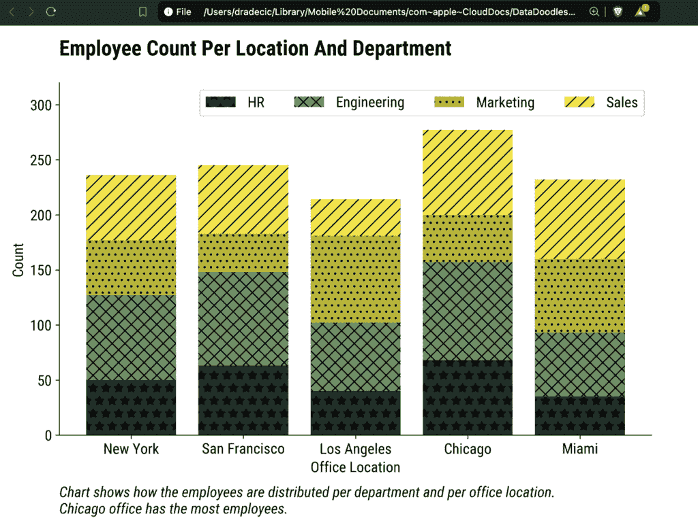

图像 13 – 嵌入 HTML 中的图表图像（图片由作者提供）

当你打开 HTML 文件时，你无法看到替代文本，但这是因为你没有使用屏幕阅读器。

如果检测到屏幕阅读器，替代文本将自动读给用户听。

你能做的最好的事情是使用一个[屏幕阅读器插件](https://chromewebstore.google.com/detail/screen-reader/kgejglhpjiefppelpmljglcjbhoiplfn)或者指向 HTML 中不存在的图片：

```py

```

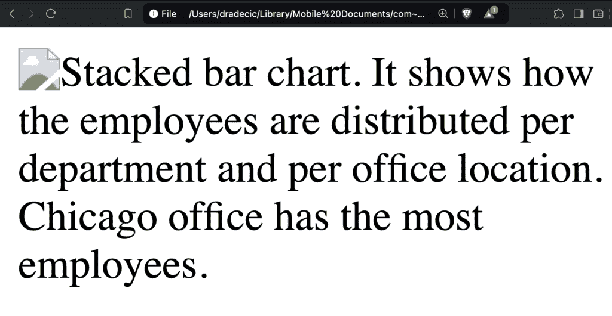

图像 14 – 未找到图片的替代文本（图片由作者提供）

现在图片找不到，所以显示替代文本。

## 总结数据可视化可访问性

就这样——在设计数据可视化时，你应该始终牢记这 5 件事。

这些技巧在一般情况下很有帮助，但在可访问性至关重要时更是如此。而且它始终应该是这样。这需要你做一点额外的工作，但可以使你的发现对全球数百万额外的人可访问。

*<mdspan datatext="el1749213397534" class="mdspan-comment">您为您的图表和应用实现了哪些可访问性的数据可视化功能？</mdspan>*
