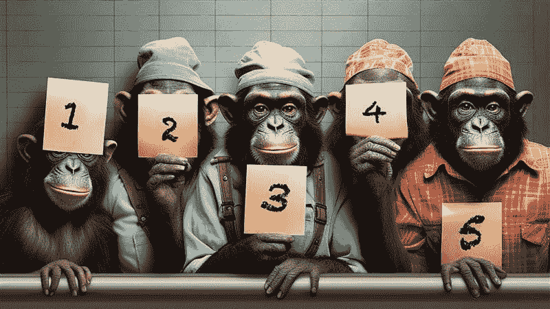

# 从我的数据科学之旅中学到的五个关键提示

> 原文：[`towardsdatascience.com/5-essential-tips-learned-from-my-data-science-journey-c1f3b9a18e6f/`](https://towardsdatascience.com/5-essential-tips-learned-from-my-data-science-journey-c1f3b9a18e6f/)

由 Midjourney 创建的图片

十年前，我开始了我的数据科学领域之旅。我清楚地记得这次冒险的开始——我的想法、我的情感，以及踏入新领域的兴奋。一切始于在一家大型保险公司担任咨询职位。

我是研发团队的一员，我们的目标——坦白说——是不明确的。我们渴望在公司内部获取数据来实验，尝试不同的事物，并创新。

我和公司都真正没有准备好迎接这一步。但回顾过去，我看到这一步是多么关键。公司后来成长为一个技术领导者，对我而言，那些年是一个学习的游乐场——探索、学习和掌握那个时代的工具和技术。

当我回想起那个情境时，我看到一个充满活力和渴望创新的年轻专业人士。我带着极大的喜爱和一丝怀旧之情回顾我每天所犯的失败，因为它们塑造了今天的我。

如果我能和那个年轻的自己对话，我会给他一些建议，以减轻他的旅程。有趣的是，那些建议和我现在给团队成员的建议是一样的。

本文将总结我在这十年中艰难学到的五件事。

## 理解商业逻辑

由 Midjourney 创建的图片

这可能听起来令人惊讶，但我仍然发现有些人未能将技术决策与商业目标联系起来。

理解问题的本质不仅对于构建算法解决方案至关重要，而且对于创建有意义的变量和评估它们的影响也至关重要。

曾经，我评估了一种“类似烤箱”的温度数据对食品生产过程的影响。

我们正在调查一种导致产品出现“类似燃烧效果”的缺陷。商业逻辑（以及常识）表明，异常高的温度可能与这种缺陷有关联。

然而，我们通过分析发现，当温度低于正常温度时，燃烧效果出现了显著的峰值。

一个缺乏经验的分析师可能会满足于找到这样一个强大的预测模式。然而，商业逻辑告诉我们需要深入挖掘。与团队一起，我们决定将其视为一个虚假现象，尽管它具有预测性，但这是由实现过程中未知的其他因素引起的。

通过追溯可能的原因，我们发现这一现象是由一个之前一直外生的事件引起的：一个之前未被追踪的步骤！

这个洞察力使我们能够追踪到与外生事件相关的新数据源，从而得到更多可预测和可解释的变量。

我可以提到无数这样的例子。教训？始终将你的分析建立在业务逻辑上。这正是我们引导数学走向更加光明的未来的原因。

## 如果你技术不精，你无法写出糟糕的代码

你实际上可以，但请尽量不要。

由 Midjourney 创建的图片

并非总是有足够的时间遵循所有编程最佳实践。在时间紧迫的实验环境中，快速前进通常是必要的。将精力集中在尝试不同的解决方案，而不是寻找“最佳”代码，可以是一个战略优势。

然而，写出“糟糕的代码”是经验丰富的数据科学家的特权。

如果你还不是“专业”开发者，以较慢的速度前进并努力遵守高质量标准会更安全。这样，你可以在实验过程中最大限度地减少犯重大错误的风险。

矛盾吗？其实并不。事情是这样的：进行更多实验会让你在下一阶段有更多机会，但这只在没有犯重大错误的前提下才是真的。

实验中的评估错误可能会演变成代价高昂的挫折——或者更糟，导致不可行的解决方案，这也会影响你的声誉。

通常，我们可能会寻找一个折衷方案。如果你请的管道工只为了告诉你你梦寐以求的翻新无法完成，就破坏了你整个浴室，你会真的高兴吗？

我需要很多时间来学习编写好的代码，但学习编写糟糕而有用的代码花了我更长的时间。

然而，糟糕且无用的代码，每个人都知道如何编写。

## 如果你不想深入研究数学，就掌握直觉

由 Midjourney 创建的图片

由 Midjourney 创建的图片

我深情地回忆起我过去一篇一篇阅读科学文章的日子。不幸的是，保持前沿是一个全职工作。

在我的职业生涯中，我读过的无用论文比有用的论文多。随着时间的推移，许多看似绝妙的主意都被遗忘了；一些其他的主意在后续研究中意外地变得非常受欢迎。

因此，保持跟进并不总是容易。

并非每个人都能负担得起全职学习；许多人必须在工作中学习和更新自己。

因此，我逐渐确定的技术是专注于直觉而不是数学可重复性。

我来自一所非常理论化的意大利大学，它教会了我，如果你不能证明它，那就意味着你不知道它。限制自己只管理直觉是非常困难的。我倾向于深入挖掘，手动进行计算，但面对如此大量的信息，我做不到。

我不得不改变范式：如果你不能总结它（如果你不能画出来），那就意味着你不知道它。

以这种方式，我从想要详细了解**如何**转变为关注**为什么**。

我不是建议你完全忽视数学；我是建议你选择何时深入研究数学，以及首先掌握直觉。

但请不要只是“使用”事物！

## 没有规则规则

由 Midjourney 创建的图像

人类大脑是自大的。它寻求先入为主的观念，并创造偏见以简化计算过程。我们是按照这种方式编程的；我不是谈论这些事情的正确人选，但我向你保证，仅仅阅读关于这个主题的文献就会得出这个结论。

为什么介绍先入为主的观念？因为人们倾向于通过构建结构和遵循的程序来简化。一些例子？

*"热编码": 我移除一个类别，否则“它就会出错”。* 我看到很多决策树中存在缺失的类别。

*是否有缺失值？我使用均值和众数进行插补；我移除它们。* 我见过多少 XGBoost 模型中存在大量以奇妙方式插补的缺失值？在这种情况下并不必要！

*不同尺度的数据？我进行标准化、归一化、MinMaxScale。* 树木看起来对我们非常困惑。

该领域的所有年轻人都会问我同样的问题：“我应该做什么？”

正确的答案是最简单的：这取决于！

没有金科玉律；否则，就会有脚本 _data*scientist.py* 来应用所有这些规则，实际上，我就不需要一个团队，只需要扩展这个脚本。

幸运的是（截至今天 😊，不知道以后是否如此），仍然需要有人去思考，有人去评估。每个故事，每个问题，都有其独特性。你需要深入业务逻辑，批判性地评估问题，并以创造性和能力找到微观解决方案。

那么？我应该做什么？这取决于！

## 数学是简单的一部分

由 Midjourney 创建的图像

在我的经验中，数据科学项目很少因为数学缺陷而失败。

相反，它们通常因为与业务需求或用户期望的匹配度差而失败。

解决方案是否解决了一个真实的问题？是否具有成本效益？是否用户友好？

让我们考虑一个非常愚蠢的案例。假设我们有一个可以用人工智能解决的问题。假设问题本身每年要花费公司€10,000。如果你的解决方案每年要花费€50,000 会发生什么？

**我保留问题，因为它不值得解决**。

同样，关于一个虽然不便但非常出色的解决方案呢？

**没有人会去做！**

在我的职业生涯中，很少看到项目因数学问题而失败；很多时候，我看到它们因愚蠢的行为而失败，只有少数是因为计算原因。

## **结论**

我们在这里。我希望这五个小贴士对某个人有所帮助。在我的日常生活中，我经常发现自己在与一些健忘的人交谈时提及它们，以刷新他们的记忆。

再见。
