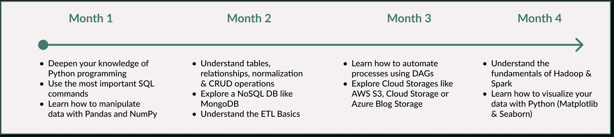

# 今天开始做的 5 个简单项目：数据工程学习路线图

> 原文：[`towardsdatascience.com/5-simple-projects-to-start-today-a-learning-roadmap-for-data-engineering-940ecbad6b5f/`](https://towardsdatascience.com/5-simple-projects-to-start-today-a-learning-roadmap-for-data-engineering-940ecbad6b5f/)

指南帮助你理解基础知识。你肯定会学到一些东西。然而，真正的学习效果来自于你直接实施小型项目，并将理论与实践相结合。

如果你向他人解释你所学的知识，你会受益更多。你还可以使用 ChatGPT 作为学习伙伴或导师 – 用你自己的话解释你所学的知识，并获得反馈。使用我在路线图后附上的提示。

在本文中，我提出了一份为期 4 个月的路线图，以学习数据工程初学者最重要的概念。你从基础知识开始，逐步提高难度，以应对更复杂的话题。唯一的要求是你有一些 Python 编程技能，对数据处理有基本了解（例如简单的 SQL 查询）以及动力🚀

为什么只有 4 个月？

在较短的时间内承诺一个目标对我们来说更容易。我们保持更专注和有动力。立即打开你喜欢的应用并基于示例开始一个项目。或者设置日历条目来为实施留出时间。

## 4 个月路线图中的 5 个项目

作为数据工程师，你确保收集、存储和准备的数据对数据科学家和分析人员来说是可访问和可用的。

你可以说是厨房厨师，负责组织厨房并确保所有原料都是新鲜且随时可用的。数据科学家是主厨，将它们结合成创意菜肴。

### 第 1 个月 – 编程和 SQL

**深化 Python 基础知识** CSV 和 JSON 文件是数据交换的常见格式。学习如何编辑 CSV 和 JSON 文件。了解如何使用 Pandas 和 NumPy 库操纵数据。

**第 1 个月开始的小项目** 清理包含非结构化数据的 CSV 文件，为数据分析做准备，并以干净格式保存。使用 Pandas 进行数据处理和基本的 Python 函数进行编辑。

1.  使用‘pd.read_csv()’读取文件，并通过‘df.head()’和‘df.info()’获取概览。

1.  使用‘df.drop_duplicates()’删除重复项，并使用‘df.fillna(df.mean())’用平均值填充缺失值。可选：研究处理缺失值可用的选项。

1.  使用‘df[‘new_column’]’创建一个新列，例如，将所有高于某个值的行填充为‘True’，其余的填充为‘False’。

1.  使用‘df.to_csv(‘new_name.csv’, index=False)’将清洗后的数据保存到新的 CSV 文件中。

这个项目解决了什么问题？数据质量至关重要。不幸的是，在商业世界中接收数据时，这并不总是如此。

*工具和语言：Python（Pandas & NumPy 库）、Jupyter Lab*

**理解 SQL** SQL 允许你高效地查询和组织数据。了解如何使用最重要的命令，如 CREATE TABLE、ALTER TABLE、DROP TABLE、SELECT、WHERE、ORDER BY、GROUP BY、HAVING、COUNT、SUM、AVG、MAX & MIN、JOIN。

**第一个月的小项目：** 创建一个关系数据模型，以映射真实业务流程。你所在的城市有没有中型书店？这无疑是一个很好的起点场景。

1.  考虑书店管理的数据。例如，包含标题、作者、ISBN（唯一标识符）的书籍，以及包含姓名、电子邮件等数据的客户。

1.  现在绘制一个显示数据之间关系的图表。书店有几种书籍，这些书籍可能来自几位作者。客户同时购买这些书籍。考虑这些数据是如何相互关联的。

1.  接下来，列出你需要哪些表以及每个表有哪些列。例如，书籍表中的列有 ISBN、标题、作者和价格。为步骤 1 中确定的所有数据执行此步骤。

1.  可选：使用‘CREATE TABLE nametable ();’在 SQLite 数据库中创建表。你可以使用以下代码创建一个表。

```py
-- Creating a table with the name of the columns and their data types
CREATE TABLE Books (
    BookID INT PRIMARY KEY,
    Title VARCHAR(100),
    Author VARCHAR(50),
    Price DECIMAL(10, 2)
);
```

这个项目解决了什么问题？通过一个精心设计的数据库模型，公司可以高效地设置重要流程，例如跟踪客户购买或管理库存。

*工具和语言：SQL、SQLite、MySQL 或 PostgreSQL*

### 第二个月 – 数据库和 ETL 管道

**掌握关系数据库和 NoSQL 数据库** 了解表、关系、归一化和 SQL 查询的概念。了解 CRUD 操作（创建、读取、更新、删除）是什么。学习如何高效地存储、组织和查询数据。了解 NoSQL 相对于关系数据库的优势。

*工具和语言：SQLite、MySQL、PostgreSQL 用于关系数据库；MongoDB 或 Apache Cassandra 用于 NoSQL 数据库*

**理解 ETL 基础** 了解如何从 CSV、JSON 或 XML 文件以及从 API 中提取数据。学习如何将清洗后的数据加载到关系数据库中。

**第二个月的小项目：** 创建一个管道，从 CSV 文件中提取数据，转换它并将其加载到 SQLite 数据库中。实现简单的 ETL 逻辑。

1.  使用‘pd.read_csv()’加载 CSV 文件，并再次查看数据概览。同样，删除缺失值和重复项（参见项目 1）。你可以在 Kaggle 上找到公开可访问的数据集。例如，搜索包含产品的数据集。

1.  根据 CSV 数据创建 SQLite 数据库并定义一个表。下面可以看到这个示例的代码。SQLite 更容易上手，因为 SQLite 库在 Python 中默认可用（模块 sqlite3）。

1.  使用‘df.to_sql(‘tablename’, conn, if_exists=’replace’, index=False)’将清洗后的数据从 DataFrame 导入 SQLite 数据库。

1.  现在执行一个简单的 SQL 查询，例如使用 SELECT 和 ORDER BY。将结果限制为 5 个输出。最后关闭数据库连接。

```py
import sqlite3

# Create the connection to the SQLite-DB
conn = sqlite3.connect('produkte.db')

# Create the table
conn.execute('''
CREATE TABLE IF NOT EXISTS Produkte (
    ProduktID INTEGER PRIMARY KEY,
    Name TEXT,
    Kategorie TEXT,
    Preis REAL
)
''')
print("Tabelle erstellt.")
```

*工具和语言：Python（SQLAlchemy 库），SQL*

### 第 3 个月 – 工作流程编排和云存储

**工作流程编排** 工作流程编排意味着你以特定的顺序自动化和协调流程（任务）。学习如何规划和执行简单的工作流程。你还将获得 DAG（有向无环图）框架的基本理解。DAG 是 Apache Airflow 的基本结构，描述了工作流程中哪些任务被执行以及执行顺序。

*工具和语言：Apache Airflow*

**云存储** 学习如何在云中存储数据。至少了解最大的云服务提供商（如 AWS 的 S3、EC2、Redshift，Google Cloud 的 BigQuery、Dataflow、Cloud Storage，Azure 的 Blob Storage，Synapse Analytics，Azure Data Factory）的主要产品名称。众多不同的产品可能会让人感到不知所措——从你喜欢的开始。

**第 3 个月的一个小项目** 使用 Python 创建一个简单的工作流程编排概念（不使用 Apache Airflow，因为这会降低你的入门门槛），在日常生活中发送自动提醒：

1.  规划工作流程：定义诸如“喝水”、“锻炼 3 分钟”或“呼吸新鲜空气”的提醒任务。

1.  创建任务序列（DAG）：决定任务执行的顺序。定义它们是否相互依赖。例如，任务 A（“喝水”）先执行，然后是任务 B（“锻炼 3 分钟”），依此类推。

1.  在 Python 中实现任务：为每个提醒编写一个 Python 函数（见下面的代码片段 1 作为示例）。

1.  将任务链接起来：安排函数以便它们按顺序执行（见下面的代码片段 2 作为示例）。

```py
import os
import time

# Task 1: Send a reminder
def send_reminder():
    print("Reminder: Drink water!")  # Print a reminder message
    time.sleep(1)  # Pause for 1 second before proceeding to the next task
```

```py
if __name__ == "__main__":
    print("Start Workflow...")  # Indicate the workflow has started

    # Execute tasks in sequence
    send_reminder()  # Task 1: Send a reminder to drink water

    # Additional tasks (uncomment and define these functions if needed)
    # reminder_exercise()  # Example: Send the second reminder
    # create_task_list()    # Advanced-Example: Create a daily task list

    print("Workflow is done!")  # Indicate the workflow has completed
```

太简单了吗？安装 Apache Airflow 并创建你的第一个 DAG，执行打印“Hello World”的任务，或者将转换后的数据加载到 S3 桶中并本地分析。

*工具和语言：AWS，Google Cloud，Azure*



通过实施 5 个项目，你将比只看理论学到的多一倍。

### 第 4 个月 – 大数据与可视化简介

**大数据基础** 理解 Hadoop 和 Apache Spark 的基础知识。以下是一个来自 simplilearn 的极简视频，介绍了 Hadoop 和 Apache Spark。

*工具和语言：Hadoop，Apache Spark，PySpark（Apache Spark 的 Python API），Python*

**数据可视化** 理解数据可视化的基础知识

**第 4 个月的一个小项目** 为了避免需要像 Apache Spark 或 Hadoop 这样的大数据工具，但仍然应用这些概念，从 Kaggle 下载一个数据集，用 Python 分析它并可视化结果：

1.  从 Kaggle 下载一个公开的中等规模数据集（例如天气数据），使用 Pandas 读取数据集，并了解你的数据概览。

1.  执行一个小型的探索性数据分析（EDA）。

1.  创建例如平均温度的折线图或每月降雨和日照天数的条形图。

*工具和语言：Python（Matplotlib & Seaborn 库）*

## 使用 ChatGPT 作为学习伙伴或导师的 2 个提示

当我学习新事物时，这两个提示帮助我重现我所学的知识，并使用 ChatGPT 检查我是否理解了它。试试看它是否对你也有帮助。

1.  *我刚刚学习了[主题/项目]，并想确保我正确理解了它。以下是我的解释：[你的解释]。请对我的解释提供反馈。添加任何遗漏或我没有清楚解释的内容。*

1.  *我希望更好地理解[主题/项目]。以下是我迄今为止学到的东西：[你的解释]。我的解释中是否有错误、遗漏或如何更好地解释的建议？可选：我如何扩展项目？我接下来可以学习什么？*

## 接下来是什么？

+   深入理解第 1-4 个月的概念。

+   学习复杂的 SQL 查询，如子查询和数据库优化技术。

+   理解数据仓库、数据湖和数据湖屋的原则。查看 Snowflake、AmazonRedshift、GoogleBigQuery 或 Salesforce Data Cloud 等工具。

+   学习数据工程师的 CI/CD 实践。

+   学习如何为机器学习模型准备数据管道

+   深化你对云平台的知识，特别是在无服务器计算（例如 AWS Lambda）领域。


自己的可视化 – 来自 [unDraw.co](https://undraw.co/illustrations) 的插图

## 最后的想法

公司和个人正在生成越来越多的数据 – 而且增长仍在加速。其中一个原因是，我们从物联网设备、社交媒体和客户互动等来源获得了越来越多的数据。同时，数据是机器学习模型的基础，其在日常生活中的重要性预计将继续增加。使用 AWS、Google Cloud 或 Azure 等云服务也越来越普遍。如果没有设计良好的数据管道和可扩展的基础设施，这些数据既不能被有效地处理，也不能被有效地使用。此外，在电子商务或金融科技等领域，我们能够实时处理数据变得越来越重要。

作为数据工程师，我们创建基础设施，以便数据可供机器学习模型和实时流式传输（零 ETL）使用。通过这个路线图中的要点，你可以建立基础。

### 你在哪里可以继续学习？

+   [YouTube Simplilearn – 5 分钟了解 Hadoop](https://www.youtube.com/watch?v=aReuLtY0YMI)

+   [YouTube IBM – 什么是 Apache Spark?](https://www.youtube.com/watch?v=VZ7EHLdrVo0&t=18s)

+   [YouTube – Apache Airflow 是什么？适合初学者](https://www.youtube.com/watch?v=CGxxVj13sOs&t=213s)

+   [Medium – Python 数据分析生态系统 – 初学者路线图](https://python.plainenglish.io/python-data-analysis-ecosystem-a-beginners-roadmap-adf22ba20ed2)

+   [Medium – 在 Python 应用机器学习前，初学者必做的 9 个步骤](https://python.plainenglish.io/mastering-time-series-data-9-essential-steps-for-beginners-before-applying-machine-learning-in-2d9a7c6749c3)

+   [Medium – Python 和 Pandas 的实际应用：Python 数据分析](https://python.plainenglish.io/data-analysis-with-python-a-practical-dive-into-numpy-and-pandas-7d8974e930a8)

+   [Medium – 数据中谁做什么？数据工程师和数据科学家角色的实用介绍](https://towardsdatascience.com/who-does-what-in-data-a-practical-introduction-to-the-role-of-a-data-engineer-data-scientist-894d06bf5da9)

+   [Medium – SQL 和数据建模实战：深入数据湖屋](https://towardsdatascience.com/sql-and-data-modelling-in-action-a-deep-dive-into-data-lakehouses-fcbab9a4b9c2)
