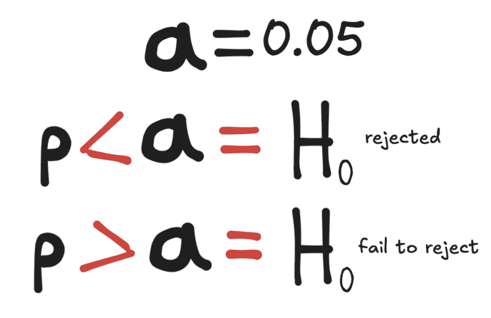
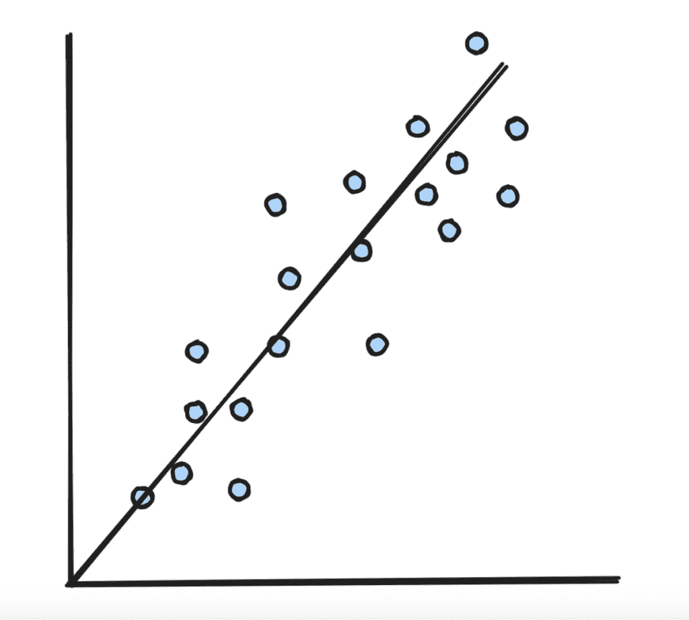
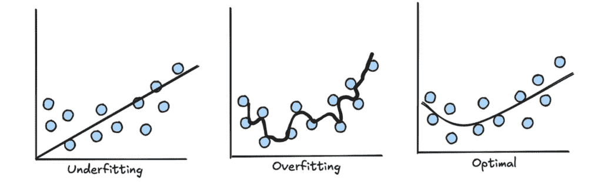

# 在下一次数据科学面试之前你需要知道的 5 个统计概念

> 原文：[`towardsdatascience.com/5-statistical-concepts-you-need-to-know-before-your-next-data-science-interview/`](https://towardsdatascience.com/5-statistical-concepts-you-need-to-know-before-your-next-data-science-interview/)

<mdspan datatext="el1748284412008" class="mdspan-comment">最近我一直在</mdspan>自己的数据科学求职旅程中，并且非常幸运地得到了面试许多公司的机会。

这些面试包括与真实人物的技术和行为面试，我也有自己完成的一些评估任务。

在经历这个过程时，我做了很多关于在数据科学面试中常见问题的研究。这些是你不仅应该熟悉，而且要知道如何解释的概念。

## 1. P 值

图片由作者提供

当你运行一个统计测试时，通常你会有一个零假设 H0 和一个备择假设 H1。

假设你正在进行一个实验，以确定某种减肥药物的有效性。A 组服用了安慰剂，B 组服用了药物。然后，你计算每个组在六个月内平均减重的磅数，并想看看 B 组的减重数量是否在统计上显著高于 A 组。在这种情况下，零假设 H0 将是两组平均减重之间没有统计上显著差异，这意味着药物对减重没有真正的影响。H1 将是存在显著差异，并且 B 组由于药物而减重更多。

为了回顾：

+   H0: A 组平均减重 = B 组平均减重

+   H1: A 组平均减重 < B 组平均减重

然后，你会进行[t-test](https://www.jmp.com/en/statistics-knowledge-portal/t-test#:~:text=A%20t%2Dtest%20may%20be,dependent%20samples%20t%2Dtest%29)来比较均值以获得 p 值。这可以在 Python 或其他统计软件中完成。然而，在获得 p 值之前，你首先会选择一个α（α）值（即显著性水平），然后将其与 p 值进行比较。

通常选择的典型α值是 0.05，这意味着一类错误（在实际上没有差异时说有差异）的概率是 0.05 或 5%。

如果你的 p 值小于α值，你可以拒绝零假设。否则，如果 p > α，你未能拒绝零假设。

## 2. Z 分数（以及其他异常值检测方法）

Z 分数是衡量数据点与均值距离的指标，也是最常见的异常值检测方法之一。

为了理解 z 分数，你需要了解基本统计概念，例如：

+   **均值**—一组值的平均值

+   **标准差**—衡量数据集中值与平均值之间差异的一个指标（也是方差的平方根）。换句话说，它显示了数据集中值与平均值之间的差异程度。

对于一个特定的数据点，z 分数值为 2 表示该值比平均值高 2 个标准差。z 分数为-1.5 表示该值比平均值低 1.5 个标准差。

通常，z 分数大于 3 或小于-3 的数据点被认为是异常值。

异常值是数据科学中的一个常见问题，因此了解如何识别和处理它们非常重要。

要了解更多关于其他一些简单的异常值检测方法，请查看我关于 z 分数、四分位数范围和修正 z 分数的文章：

> [3 种简单的异常值检测统计方法](https://towardsdatascience.com/3-simple-statistical-methods-for-outlier-detection-db762e86cd9d/)

## 3. 线性回归

图片由作者提供

[线性回归](https://www.geeksforgeeks.org/ml-linear-regression/)是最基本的机器学习和统计模型之一，理解它是成功从事任何数据科学角色的关键。

从高层次来看，线性回归旨在模拟自变量（s）与因变量之间的关系，并试图使用自变量来预测因变量的值。它通过将“最佳拟合线”拟合到数据集来实现这一点——一条最小化实际值与预测值之间平方差的线。

例如，当尝试建立温度和电能消耗之间的关系时。在测量建筑物的电能消耗时，温度通常会影响到使用，因为电力通常用于冷却，随着温度的升高，建筑物将需要更多的能量来冷却其空间。

因此，我们可以使用回归模型来模拟这种关系，其中自变量是温度，因变量是消耗（因为使用依赖于温度，而不是反过来）。

线性回归将输出一个格式为 y=mx+b 的方程，其中 m 是线的斜率，b 是 y 轴截距。要预测 y 的值，您需要将 x 值代入方程中。

回归对基础数据有 4 个不同的假设，可以用首字母缩略词 LINE 来记住：

**L: 线性关系**独立变量 x 和因变量 y 之间。

**I: 残差的独立性**。残差之间互不影响。（残差是预测值与实际值之间的差异）。

**N: 均匀分布**的残差。残差遵循均匀分布。

**E: 残差在不同 x 值上的方差相等**。

在线性回归中，最常见的性能指标是 R²，它告诉你依赖变量中可以由独立变量解释的方差比例。R²为 1 表示完美的线性关系，而 R²为 0 表示该数据集没有预测能力。好的 R²通常在 0.75 或以上，但这也取决于你解决的问题类型。

**线性回归与相关系数不同。**两个变量之间的***相关系数***给出一个介于-1 和 1 之间的数值，表示两个变量之间关系的强度和方向。***回归***给出一个方程，可以用来根据过去值的最佳拟合线预测未来的值。

## 4. 中心极限定理

[中心极限定理（CLT）](https://www.investopedia.com/terms/c/central_limit_theorem.asp)是统计学中的一个基本概念，它表明随着样本量的增大，样本均值的分布将趋近于正态分布，无论数据的原始分布如何。

正态分布，也称为钟形曲线，是一种统计分布，其中均值是 0，标准差是 1。

CLT 基于以下假设：

+   数据是独立的

+   数据的总体具有有限水平的方差

+   样本抽取是随机的

样本量≥30 通常被认为是 CLT 成立的最小可接受值。然而，随着样本量的增加，分布将越来越像钟形曲线。

CLT 允许统计学家使用正态分布对总体参数进行推断，即使基础总体不是正态分布。它是许多统计方法的基础，包括置信区间和假设检验。

## 5. 过度拟合和欠拟合

作者提供的图像

当模型**欠拟合**时，它未能正确捕捉训练数据中的模式。因此，它不仅在训练数据集上表现不佳，在未见过的数据上表现也差。

如何知道模型是否欠拟合：

+   模型在训练、交叉验证和测试集上都有较高的误差

当模型**过度拟合**时，这意味着它已经过于紧密地学习了训练数据。本质上，它已经记住了训练数据，并且擅长预测它，但在预测新值时无法推广到未见过的数据。

如何知道模型是否过度拟合：

+   模型在整个训练集上的误差较低，但在测试和交叉验证集上的误差较高

此外：

**欠拟合的模型具有高偏差。**

**过度拟合的模型具有高方差。**

在两者之间找到良好的平衡被称为***偏差-方差权衡***。

## 结论

这绝不是一份详尽的列表。其他需要审查的重要主题包括：

+   决策树

+   第一类和第二类错误

+   混淆矩阵

+   回归与分类

+   随机森林

+   训练/测试集划分

+   交叉验证

+   机器学习生命周期

这里有一些我写的其他文章，涵盖了这些基本的机器学习和统计学概念：

+   **[初学者必须了解的 10 个关键数据科学术语](https://medium.com/@pelletierhaden/10-key-data-science-terms-beginners-must-understand-bf85aabc74a6)**

> [机器学习生命周期每一步简单解释](https://towardsdatascience.com/every-step-of-the-machine-learning-life-cycle-simply-explained-d1bca7c1772f/)

当复习这些概念时感到不知所措是很正常的，尤其是如果你自从学校的数据科学课程以来没有见过很多这些概念。但更重要的是确保你了解对你自己的经验最相关的内容（例如，如果你是时间序列建模的专家，那么就是时间序列建模的基础），并且对这些其他概念有一个基本的理解。

此外，记住，在面试中解释这些概念的最佳方式是使用一个例子，并在你讨论场景的同时向面试官解释相关的定义。这也有助于你更好地记住所有内容。

## 感谢您的阅读

+   在[LinkedIn](http://linkedin.com/in/hadenpelletier/)上与我建立联系

+   [请支持我的工作，给我买杯咖啡](http://buymeacoffee.com/hadenpell)!

+   我现在提供一对一的数据科学辅导、职业指导/辅导、写作建议、简历审查等服务，请访问[Topmate](https://topmate.io/haden_p)!
