# 关于新 Power BI 存储模式你需要知道的一切

> 原文：[`towardsdatascience.com/50-shades-of-direct-lake-everything-you-need-to-know-about-the-new-power-bi-storage-mode/`](https://towardsdatascience.com/50-shades-of-direct-lake-everything-you-need-to-know-about-the-new-power-bi-storage-mode/)

**<mdspan datatext="el1755745271097" class="mdspan-comment">免责声明：</mdspan>** 这篇文章的目的**不是**回答以下问题：“哪个更好——导入还是 Direct Lake？”因为这是不可能回答的，因为没有一种“一统天下”的解决方案…虽然导入（仍然）在大多数情况下应该是默认选择，但在某些情况下，你可能会选择走 Direct Lake 的道路。本文的主要目标是提供关于 Direct Lake 模式幕后工作方式的详细信息，并进一步阐明各种 Direct Lake 概念。

如果你想了解更多关于如何比较导入（和 DirectQuery）与 Direct Lake，以及何时选择其中一个而不是另一个，我强烈建议你观看以下视频：[`www.youtube.com/watch?v=V4rgxmBQpk0`](https://www.youtube.com/watch?v=V4rgxmBQpk0)

现在，我们可以开始了...

我不知道你们，但当我看电影并看到一些令人叹为观止的场景时，我总是想知道——他们是怎么做到这一点的？！他们从袖子里掏出了什么技巧，让它变得如此完美？

然后，当我看到 Direct Lake 在行动时，我有一种感觉！对于那些可能还没有听说过 Power BI 语义模型的新存储模式，或者想知道 Direct Lake 和艾伦·艾弗森有什么共同之处的你，我鼓励你先阅读我的[上一篇文章](https://data-mozart.com/what-do-allen-iverson-and-direct-lake-have-in-common/)。

这篇文章的目的是揭开幕后发生的事情的神秘面纱，这个“东西”实际上是如何工作的，并给你一些提示，关于在处理 Direct Lake 语义模型时需要注意的一些细微差别。

> ***Direct Lake 存储模式克服了导入和 DirectQuery 模式两者的不足——提供与导入模式相似的性能，没有数据重复和数据延迟——因为在查询执行期间数据是直接从 delta 表中检索的。***

听起来像是个梦，对吧？所以，让我们尝试检查不同的概念，这些概念使得这个梦想成真...

## 框架（即 Direct Lake 的“刷新”）

这些天，我经常从客户那里听到的问题是如何刷新 Direct Lake 语义模型？这是一个合理的问题。因为他们已经依赖导入模式多年，而 Direct Lake 承诺提供“类似导入模式的性能”...所以，必须有一个类似的过程来保持你的数据是最新的，对吧？

嗯，ja-in…（你现在在想什么，我听到你在想😀）。德国人有一个完美的词（说实话，有很多）来定义可以既是“是”又是“否”的东西（**ja**=是，ne**in**=否）。Chris Webb 已经就这个话题写了一篇[优秀的博客文章](https://blog.crossjoin.co.uk/2023/10/08/what-does-it-mean-to-refresh-a-direct-lake-power-bi-dataset-in-fabric/)，所以我不想重复那里写的内容（去看看 Chris 的博客，这是学习 Power BI 的最佳资源之一）。我的想法是展示后台发生的流程，并强调一些可能会受到您决策影响的细微差别。

但是，首先，让我们先来谈谈…

## 同步数据

一旦您在 Microsoft Fabric 中创建数据湖，您将自动获得两个额外的对象——用于查询数据湖中的数据的 SQL 分析端点（是的，您可以使用 T-SQL 从数据湖中**读取**数据），以及一个包含***所有表***的默认语义模型。那么，当新表到达数据湖时会发生什么？嗯，这取决于：

如果您打开 SQL 分析端点的设置窗口，并转到默认 Power BI 语义模型属性，您将看到以下选项：

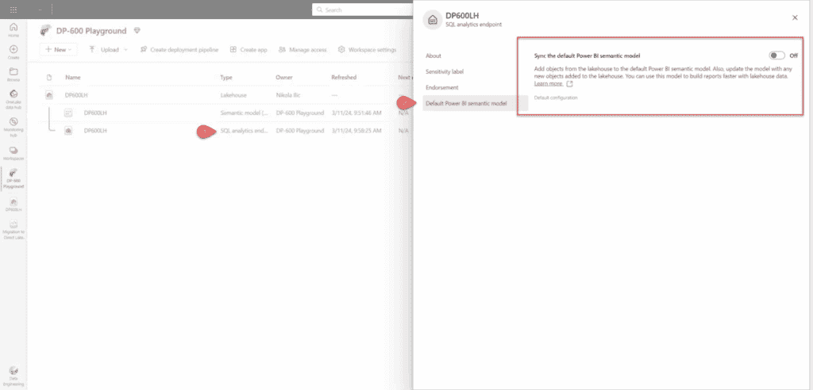

图片由作者提供

此设置允许您定义当新表到达数据湖时会发生什么。默认情况下，此表**不会**自动包含在默认语义模型中。而且，这是与直接湖模式中“刷新”数据相关的第一个要点。

在此刻，我的数据湖中有 4 个 delta 表：DimCustomer、DimDate、DimProduct 和 FactOnlineSales。由于我已禁用数据湖和语义模型之间的自动同步，默认语义模型中目前没有表！

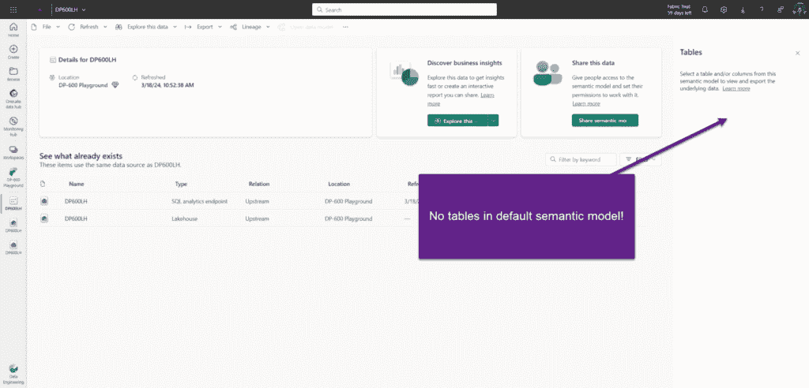

图片由作者提供

这意味着我首先需要将数据添加到我的默认语义模型中。一旦我打开 SQL 分析端点并选择创建新报告，系统会提示我将数据添加到默认语义模型中：

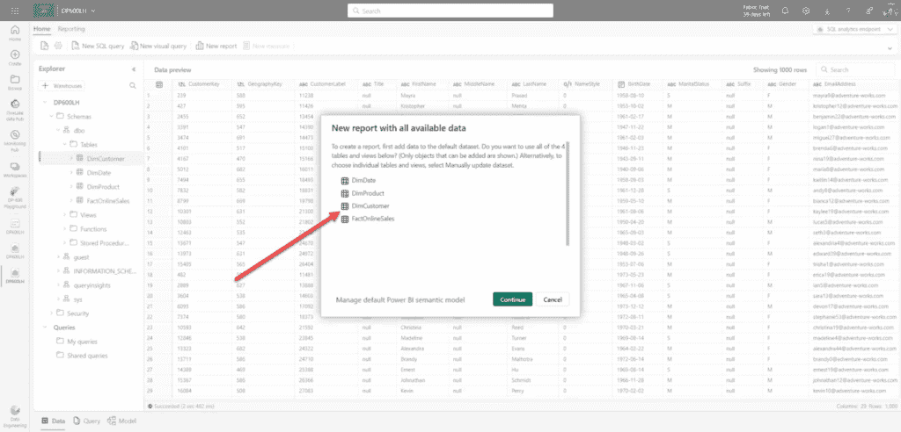

图片由作者提供

好的，让我们看看如果新表到达数据湖会发生什么？我已经在数据湖中添加了一个新表：DimCurrency。

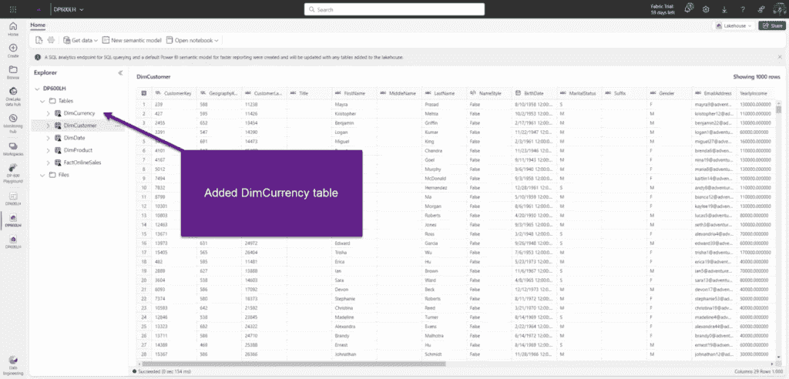

图片由作者提供

但是，当我选择在默认语义模型上创建报告时，没有 DimCurrency 表可用：

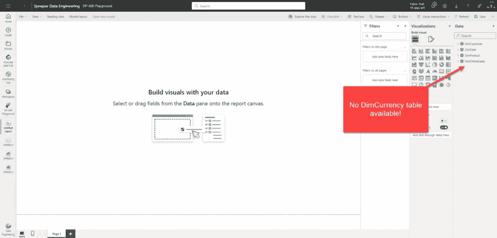

图片由作者提供

我现在已启用自动同步选项，几分钟后，DimCurrency 表出现在默认语义模型对象视图中：

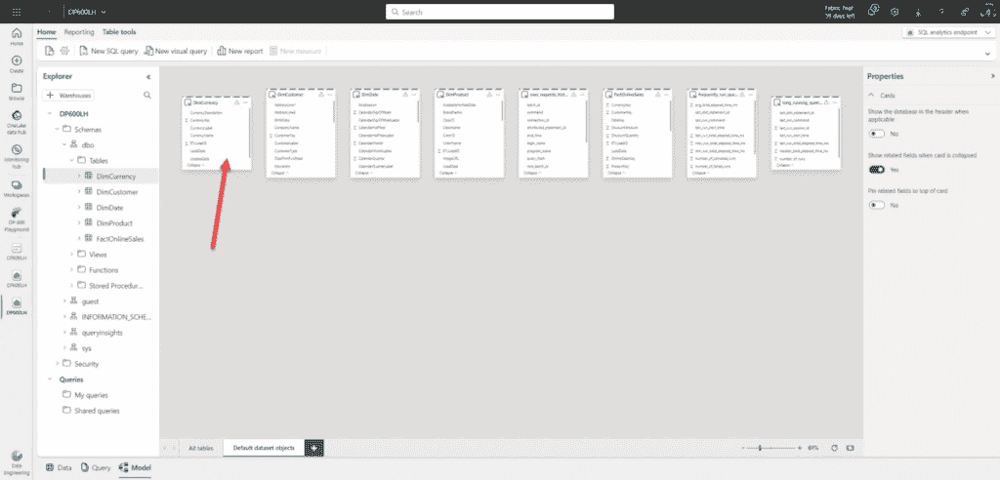

图片由作者提供

因此，这个同步选项允许您决定从数据湖中创建的新表是否自动添加到语义模型中。

## 同步 = 向语义模型添加新表

但是，数据本身会发生什么？也就是说，如果 delta 表中的数据发生变化，我们是否需要刷新语义模型，就像我们使用导入模式时必须做的那样，以便在我们的 Power BI 报告中提供最新的数据？

是时候介绍框架的概念了。在此之前，让我们快速检查我们的数据在底层是如何存储的。我已经详细介绍了[Parquet 文件格式](https://data-mozart.com/parquet-file-format-everything-you-need-to-know/)，所以这里重要的是要记住，我们的 delta 表 DimCustomer 由一个或多个 parquet 文件组成（在这种情况下是两个 parquet 文件），而 delta_log 则支持版本控制——跟踪 DimCustomer 表发生的所有更改。

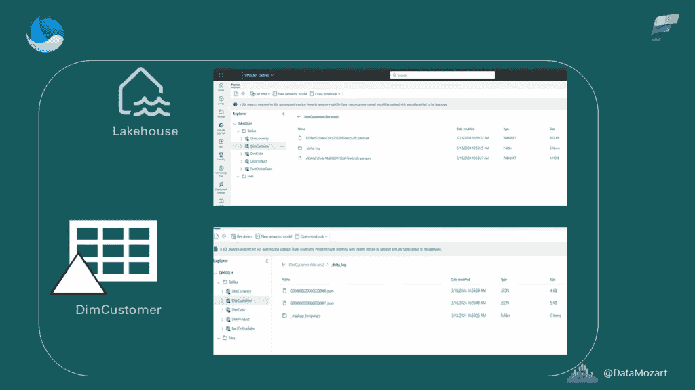

图片由作者提供

我创建了一个非常基础的报告来检查框架是如何工作的。报告显示了客户 Aaron Adams 的姓名和电子邮件地址：

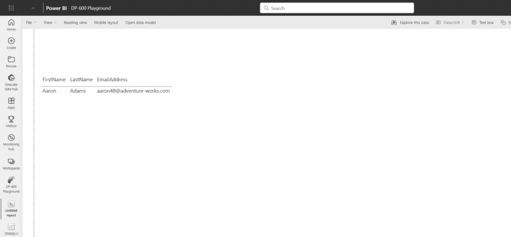

图片由作者提供

我现在将更改数据源中的电子邮件地址，从 aaron48 更改为 aaron048：

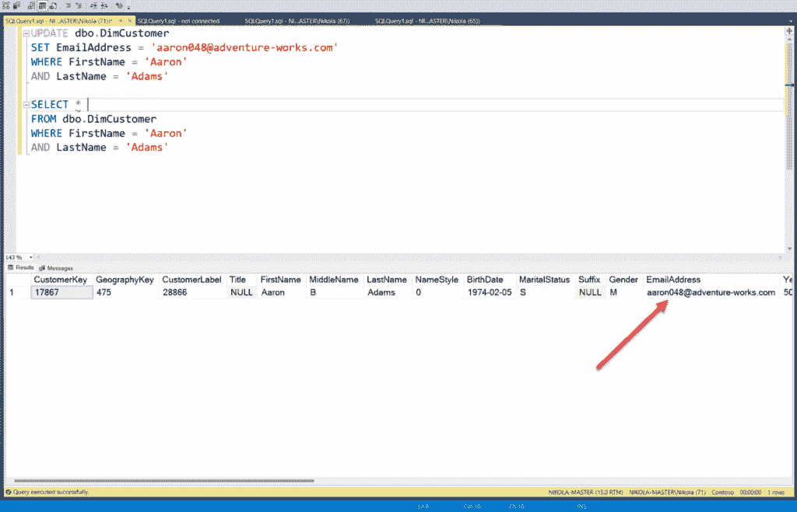

图片由作者提供

让我们将数据重新加载到 Fabric lakehouse 并检查后台 DimCustomer 表发生了什么：

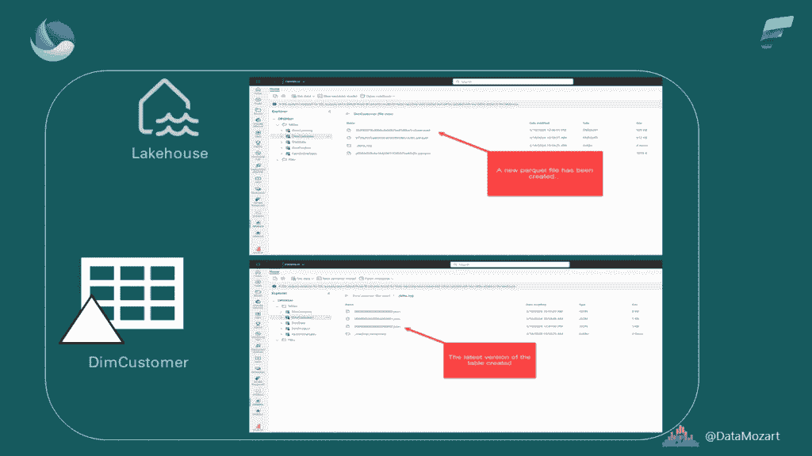

图片由作者提供

出现了一个新的 parquet 文件，同时，在 delta_log 中，也创建了一个新版本。

一旦我回到我的报告并点击刷新按钮…

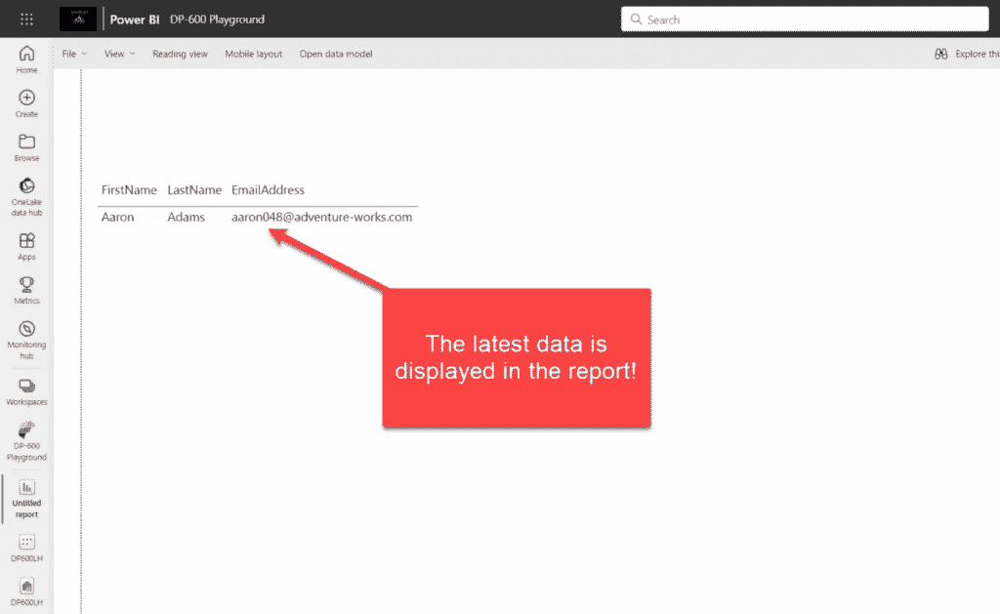

图片由作者提供

这是因为我的语义模型刷新的默认设置被配置为在 delta 表中启用更改检测并自动更新语义模型：

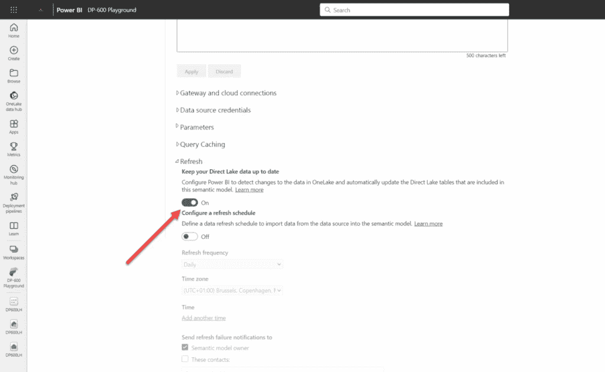

图片由作者提供

现在，如果我禁用此选项会发生什么？让我们检查…我将电子邮件地址改回 aaron48 并重新加载 lakehouse 中的数据。首先，在 delta_log 中有一个新版本的文件，与上一个情况相同：

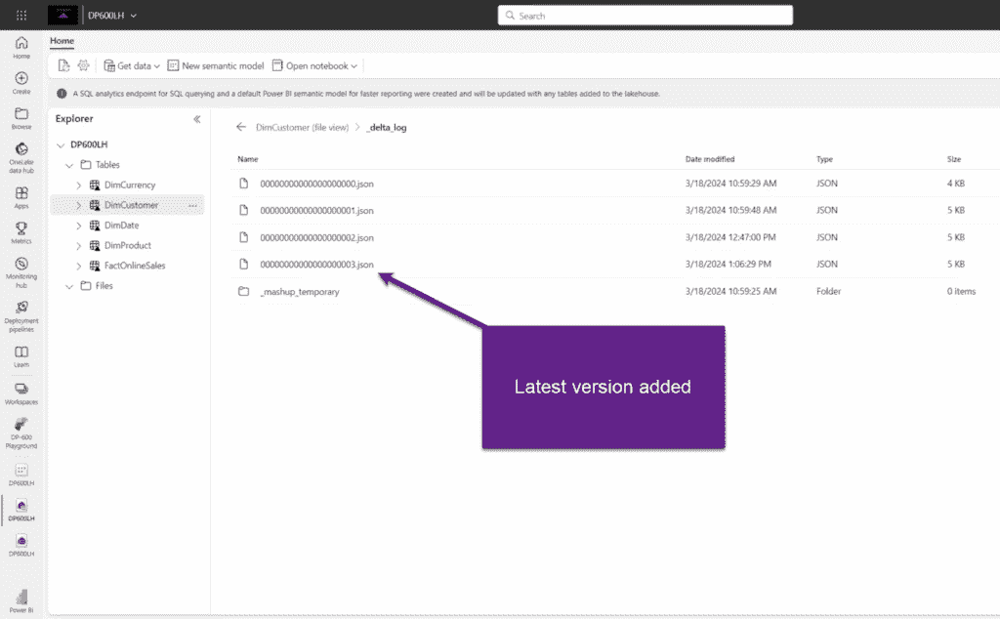

图片由作者提供

如果我通过 SQL 分析端点查询 lakehouse，你会看到包含的最新数据（aaron48）：

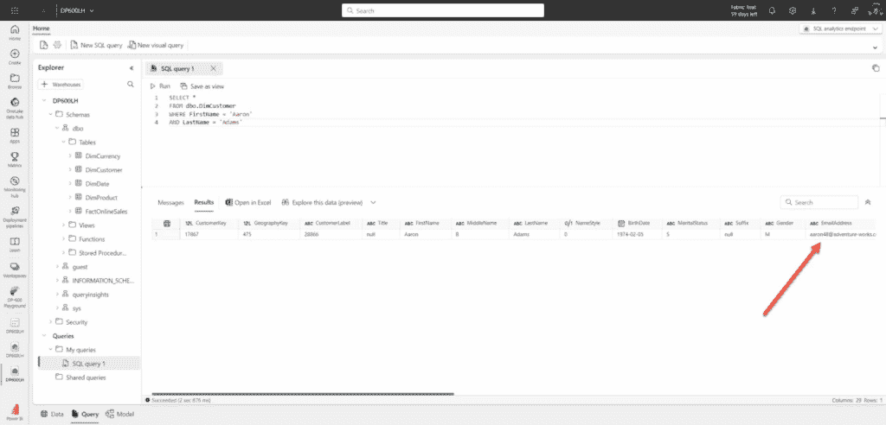

图片由作者提供

但是，如果我转到报告并点击刷新…我仍然看到 aaron048！

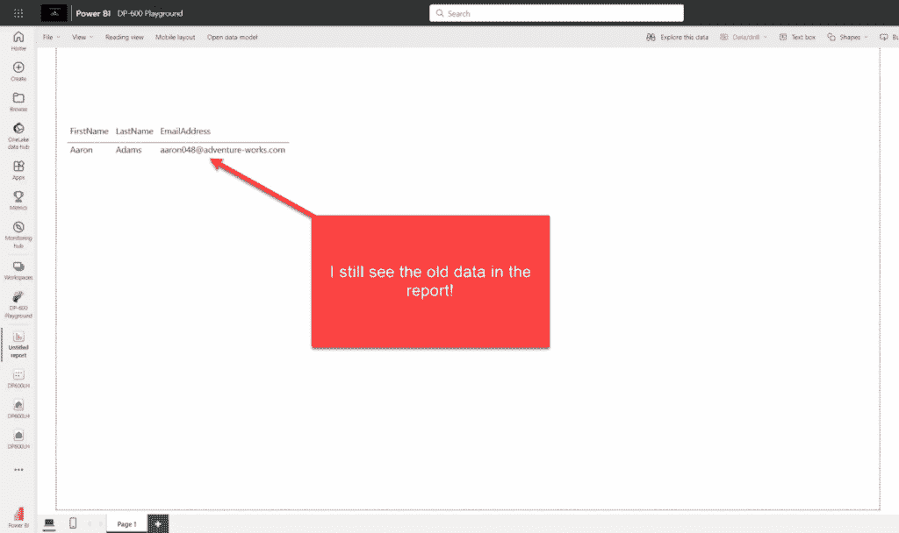

图片由作者提供

由于我已禁用从 lakehouse（OneLake）到语义模型的最新数据自动传播，我只有两个选项来保持我的语义模型（以及，相应地，我的报告）完整：

+   再次启用“保持您的 Direct Lake 数据最新”选项

+   手动刷新语义模型。当我说是手动时，它可以是真正意义上的手动，通过点击“立即刷新”按钮，或者通过执行刷新操作（即使用 Fabric 笔记本或 REST API）作为编排管道的一部分

为什么你想要保持这个选项禁用（就像我在最新的例子中所做的那样）？好吧，你的语义模型通常由多个表组成，代表面向最终用户的托管层。而且，你可能不希望报告中的数据按顺序（逐表）更新，而是在整个语义模型刷新并同步到源数据之后。

这个将语义模型与 delta 表的最新版本保持同步的过程被称为**重新构建**。

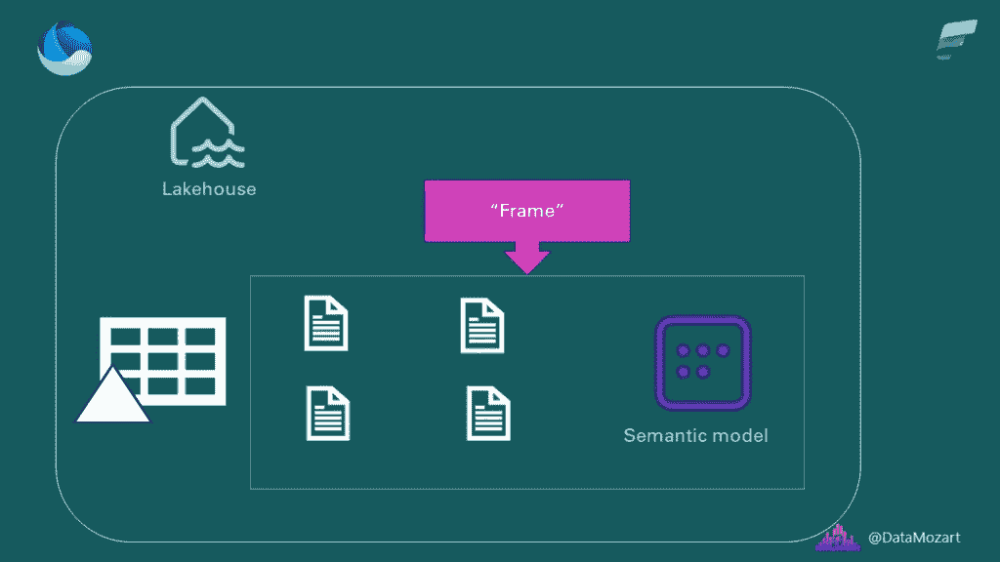

图片由作者提供

在上面的图中，你可以看到当前在语义模型上下文中“重新构建”的文件。一旦新文件进入湖屋（OneLake），为了使最新的文件包含在语义模型中，以下应该发生什么。

语义模型必须“重新构建”以包含最新的数据。这个过程有多重含义，你应该了解。首先，也是最重要的，每当进行重新构建时，当前存储在内存（我们说的是缓存内存）中的所有数据都会从缓存中清除。这对于我们接下来要讨论的下一个概念至关重要——转码。

接下来，在重新构建过程中并没有发生“真实”的数据刷新…

> **与导入模式不同，启动刷新过程会将物理数据的快照直接放入语义模型中，而重新构建只刷新元数据！所以，数据仍然留在 OneLake 的 delta 表中（Direct Lake 语义模型中没有加载数据），我们只是在告诉我们的语义模型：嘿，下面有一个新文件，当你需要报告中的数据时，从这里取它…这是 Direct Lake 和导入模式之间的一个关键区别***

由于 Direct Lake 的“刷新”仅仅是元数据刷新，这通常是一个低强度操作，不应该消耗太多时间和资源。即使你有一个包含十亿行数据的表，别忘了——你并不是在刷新你的语义模型中的十亿行数据——你只刷新了关于那个巨大表格的信息…

## 转码——你的按需缓存魔法

好吧，现在你知道了如何将湖屋中的数据与你的语义模型同步（同步），以及如何将最新的“关于数据的数据”包含到语义模型中（重新构建），现在是时候了解一旦你将你的语义模型投入实际应用，幕后到底发生了什么！

这就是 Direct Lake 的卖点，对吧？导入模式的性能，但又不复制数据。那么，让我们来探讨一下转码的概念…

> **简单来说：转码代表将 delta 表的某些部分（当我提到部分时，我指的是某些列）或整个 delta 表加载到缓存内存中的过程！**

让我停下来，并将上面的句子放在导入模式的上下文中：

+   将数据加载到内存（缓存）中是确保导入模式性能极快的一种方式

+   在导入模式下，如果你还没有启用大型格式语义模型功能，整个语义模型将存储在内存中（它必须符合内存限制），而在直接湖模式中，**仅存储查询所需的列**在内存中！

简单来说：项目一意味着一旦直接湖模式的列被加载到内存中，这绝对与导入模式相同（唯一可能的不同可能是 VertiPaq 对数据的排序方式与 delta 表中的排序方式不同）！项目二意味着直接湖模式的语义模型的缓存内存占用可能显著低于，或者在最坏的情况下与导入模式相同（我承诺很快就会向你展示）。显然，这种较低的内存占用是有代价的，那就是需要等待从 OneLake 到语义模型“按需转码”的数据的第一个加载时间。

在我们深入例子之前，你可能想知道：这个机制是如何工作的？为什么存储在 delta 表中的数据可以被 Power BI 引擎以与导入模式相同的方式读取？

答案是：有一个叫做**转码**的过程，当 Power BI 查询请求数据时，这个过程会即时发生。这个过程并不昂贵，因为 Parquet 文件中的数据存储方式与 Power BI 和 AAS 背后的列式数据库[VertiPaq](https://data-mozart.com/vertipaq-brain-muscles-behind-power-bi/)存储数据的方式非常相似。此外，如果你的数据是使用 v-ordering 算法（微软用于重新排列和排序数据以实现更好的读取性能的专有算法）写入 delta 表的，转码会使 delta 表中的数据看起来与存储在 AAS 专有格式中完全相同。

现在我将向你展示分页在实际中的工作方式。对于这个例子，我将使用 Greg Beaumont（MIT 许可证。去访问[Greg 的 GitHub](https://github.com/isinghrana/fabric-samples-healthcare/blob/main/analytics-bi-directlake-starschema/Readme.md)，那里充满了丰富的资源）提供的医疗保健数据集。事实表包含约 2.2 亿行，我的语义模型是一个精心设计的[星型模式](https://data-mozart.com/data-modeling-for-mere-mortals-part-2-dimensional-modeling-fundamentals/)。

## 导入模式与直接湖模式

理念是这样的：我有两个完全相同的语义模型（相同的数据、相同的表、相同的关系等）——一个在导入模式，另一个在直接湖模式。

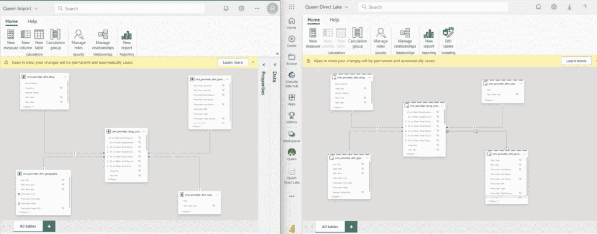

左侧为导入模式，右侧为直接湖模式

我现在将打开 Power BI 桌面版，连接到每个语义模型，并在其上创建一个相同的报告。我需要 Power BI 桌面版中的性能分析工具，以捕获查询并在稍后使用[DAX Studio](https://data-mozart.com/mastering-dp-500-dp-600-exam-troubleshoot-dax-performance-with-dax-studio/)进行分析。

我创建了一个非常基础的报告页面，只有一个表格视觉，显示了每年记录的总数。在这两个报告中，我从一张白纸开始，因为我想要确保没有任何内容是从缓存中检索出来的，所以让我们比较一下每个视觉的第一次运行：

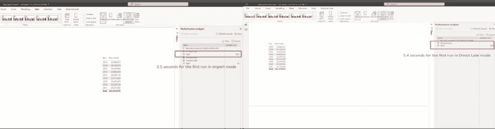

图片由作者提供

如你所注意到的，导入模式在第一次运行时性能略好，这可能是由于在 Direct Lake 模式下第一次“分页”数据时的转码成本开销。我现在将在两个报告中创建一个年份筛选器，在不同的年份之间切换，并再次比较性能：

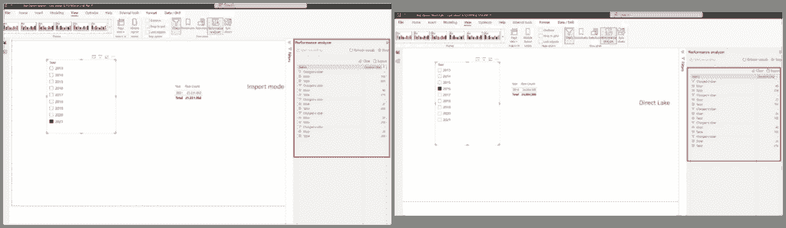

图片由作者提供

性能基本上没有差异（数字还使用了 DAX Studio 中的基准功能进行了测试）！这意味着，一旦 Direct Lake 语义模型中的列被加载到内存中，它的行为与导入模式完全相同。

然而，如果我们把额外的列包含在范围内会发生什么呢？一旦我把总药物成本度量放入表格视觉中，我们就来测试一下这两个报告的性能：

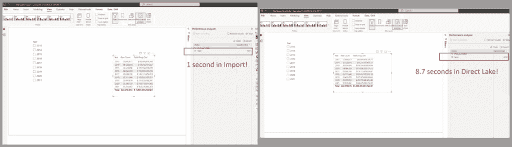

图片由作者提供

而且，这是一个导入模式轻易超越 Direct Lake 的场景！别忘了，在导入模式下，整个语义模型被加载到内存中，而在 Direct Lake 中，只有查询需要的列被加载到内存中。在这个例子中，由于总药物成本不是原始查询的一部分，它没有被加载到内存中。一旦用户将其包含在报告中，Power BI 不得不花费一些时间将此数据实时从 OneLake 转换为 VertiPaq 并加载到内存中。

## 内存占用

好的，我们也提到了导入模式与 Direct Lake 语义模型的内存占用可能差异很大。让我快速展示一下我在说什么。我首先将检查导入模式语义模型的详细信息，使用 DAX Studio 中的 VertiPaq Analyzer：

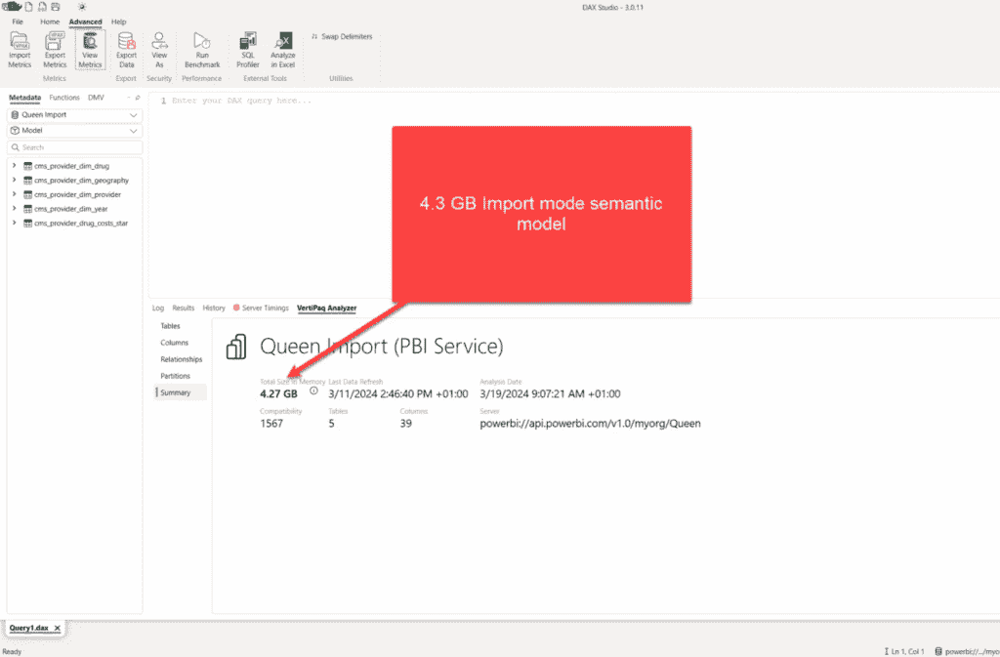

图片由作者提供

正如你所见，语义模型的大小几乎达到了 4.3 GB！而且，看看最昂贵的列…

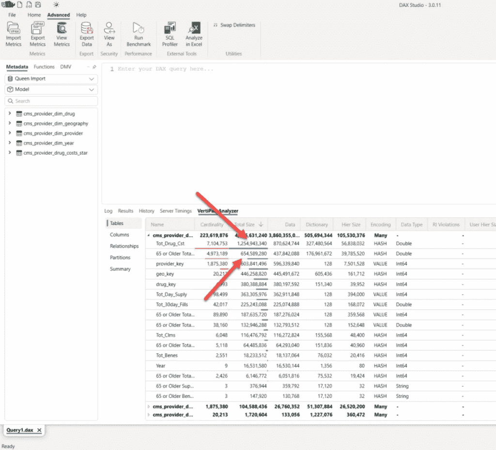

图片由作者提供

“Tot_Drug_Cost”和“65 or Older Total”列几乎占用了整个模型 2 GB 的空间！所以，从理论上讲，即使没有人使用这些列在报告中，它们仍然会占用它们应有的 RAM 份额（除非你启用了大型语义模型选项）。

我现在将使用相同的方法分析 DIrect Lake 语义模型：

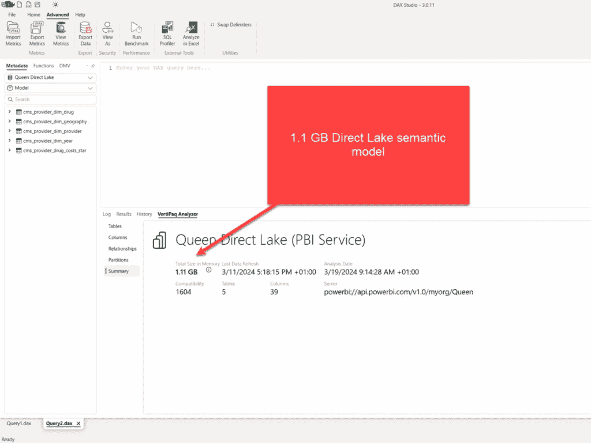

图片由作者提供

哇，内存占用减少了 4 倍！让我们快速检查模型中最昂贵的列…

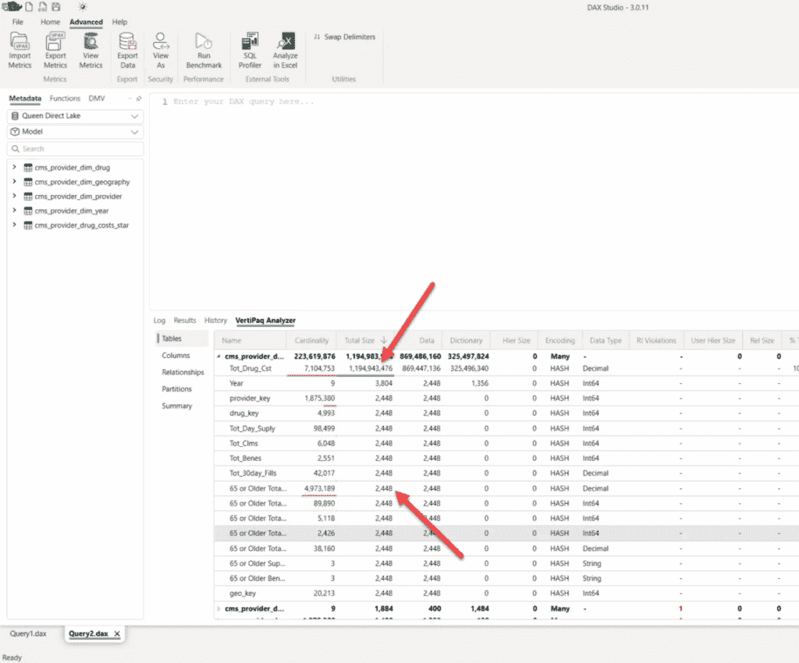

图片由作者提供

让我们在这里简要地停下来，检查上图显示的结果。 “Tot_Drug_Cst”列几乎占用了这个语义模型的所有内存——因为我们用它来创建我们的表格可视化，它被分页到内存中。但是，看看所有其他的列，包括之前在导入模式中消耗了 650 MB 的“65 岁及以上总数”！现在只有 2.4 KB！这只是元数据！只要我们不在这个报告中使用这个列，它就不会消耗任何 RAM。

这意味着，如果我们谈论直接湖中的内存限制，我们指的是每个查询的**最大内存限制**！只有当查询超出你 Fabric 容量 SKU 的内存限制时，它才会回退到直接查询（当然，假设你的配置遵循默认回退行为设置）：

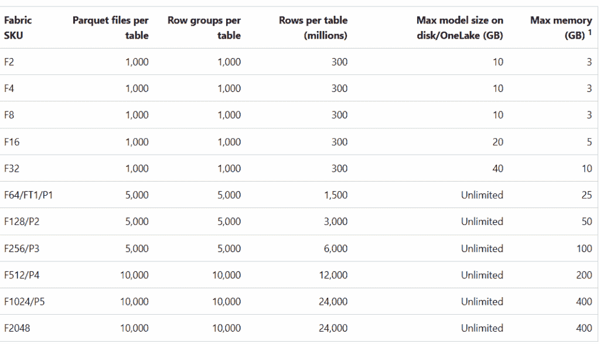

[来自官方 MS Learn 文档的表格](https://learn.microsoft.com/en-us/fabric/fundamentals/direct-lake-overview#fabric-capacity-requirements)

这是在导入模式和直接湖模式之间的一个关键区别。回到我们之前的例子，我的直接湖报告使用最低的 F SKU（F2）将运行得很好。

## “你热了又冷……你进去了又出来了……”

Katy Perry 有首著名的歌曲“Hot N Cold”，副歌中唱道：“你热了又冷……你进去了又出来了……”这完美地总结了在直接湖模式中列是如何被处理的！我想向你介绍的最后一个是列“温度”。

这个概念在与直接湖模式工作时至关重要，因为根据列的温度，引擎决定哪些列保留在内存中，哪些被踢回到 OneLake。

> ***列被查询得越多，其温度就越高！*** ***列的温度越高，它保留在内存中的可能性就越大。***

Marc Lelijveld 已经就这个主题写了一篇[优秀的文章](https://data-marc.com/2023/09/28/understanding-data-temperature-with-direct-lake-in-fabric/)，所以我就不会重复 Marc 完美解释的所有细节了。在这里，我只是想向你展示如何检查你的直接湖语义模型特定列的温度，并分享一些保持“热情”的技巧和窍门：

```py
SELECT DIMENSION_NAME
, COLUMN_ID
, DICTIONARY_SIZE
, DICTIONARY_TEMPERATURE
, DICTIONARY_LAST_ACCESSED
FROM $SYSTEM.DISCOVER_STORAGE_TABLE_COLUMNS
ORDER BY DICTIONARY_TEMPERATURE DESC
```

对 DMV Discover_Storage_Table_Columns 的上述查询可以快速提示你在直接湖中“热”和“冷”的概念是如何工作的：

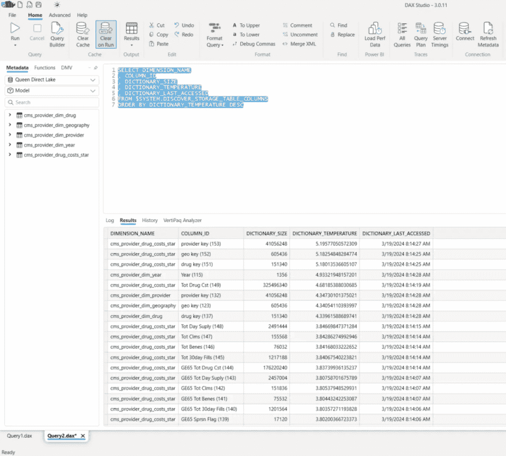

作者图片

如你所注意到的，由于过滤传播，引擎保持关系列的字典“温暖”。还有我们在表格视图中使用的列：年份、总药物成本和总索赔。如果我不对我的报告做任何事情，温度会随着时间的推移慢慢降低。但是，让我们在报告中执行一些操作，并再次检查温度：

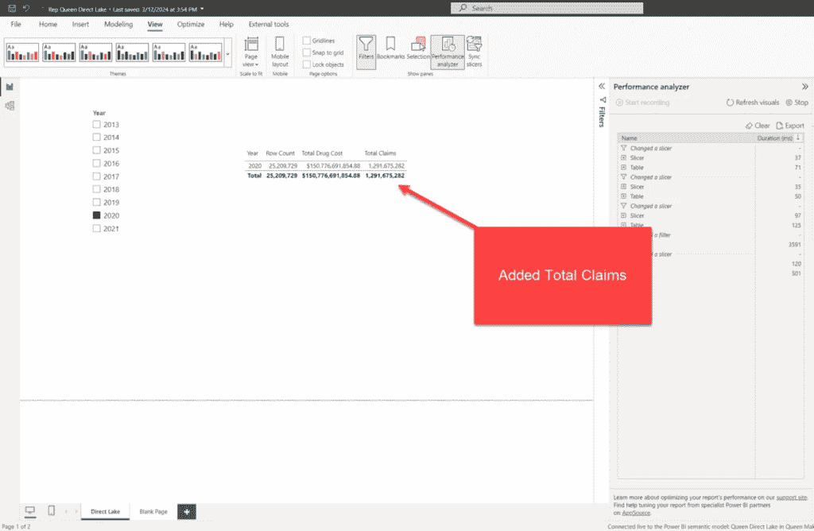

作者图片

我添加了总索赔度量（基于“Tot Clms”列）并更改了切片器上的年份。现在让我们看看温度：

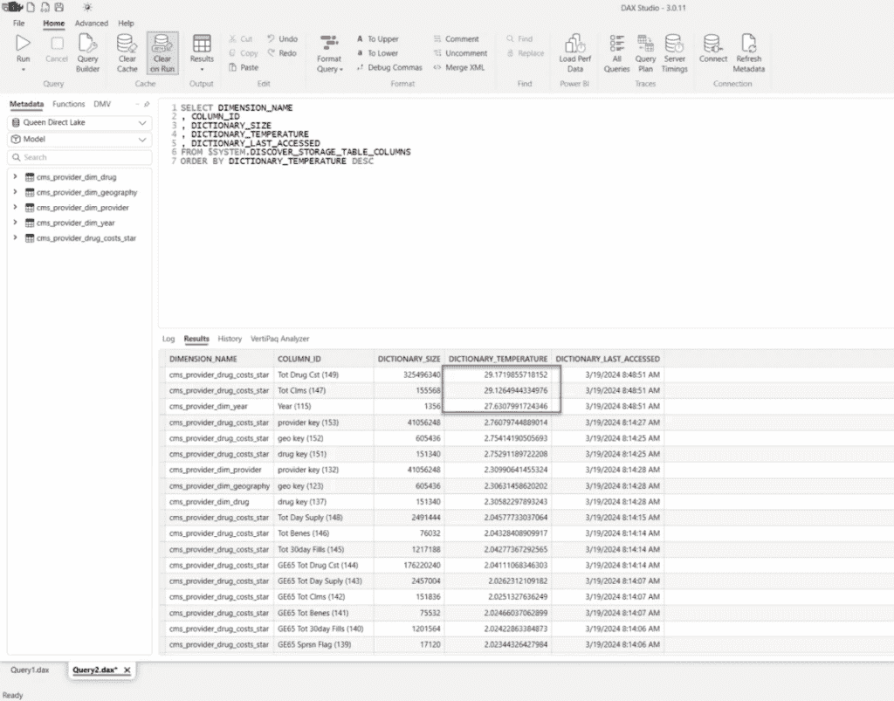

图片由作者提供

哇哦，这三个列的温度比未在报告中使用的列高 10 倍。这样，引擎确保最常用的列将保留在缓存内存中，以便报告性能对最终用户来说尽可能最佳。

现在，一个公平的问题会是：一旦我的所有最终用户在下午 5 点回家，直到第二天早上没有人触摸 Direct Lake 语义模型，会发生什么？

好吧，第一个用户将不得不“牺牲”所有人，等待第一次运行的时间稍长一些，然后每个人都可以从缓存中准备好“热”列中受益。但是，如果第一个用户是你的经理或 CEO 呢？！那就不好了:)

我有个好消息——有一个技巧可以预先预热缓存，通过提前加载最常用的列，一旦你的数据在 OneLake 刷新后即可。我的朋友 Sandeep Pawar 写了一个[逐步教程](https://fabric.guru/pre-warming-the-direct-lake-dataset-for-warm-cache-import-like-performance)来介绍如何操作（[语义链接](https://data-mozart.com/augmenting-gold-layer-with-semantic-link-and-sparksql-in-microsoft-fabric/)来帮助），如果你想要避免给第一个用户带来糟糕的体验，你绝对应该考虑实施这项技术。

## 结论

直接湖（Direct Lake）是 Microsoft Fabric 引入的一项开创性功能。然而，由于这是一个全新的解决方案，它依赖于一个全新的概念世界。在这篇文章中，我们介绍了一些我认为最重要的概念。

总结一下，由于我是一个视觉型的人，我准备了一张所有我们讨论过的概念的插图：

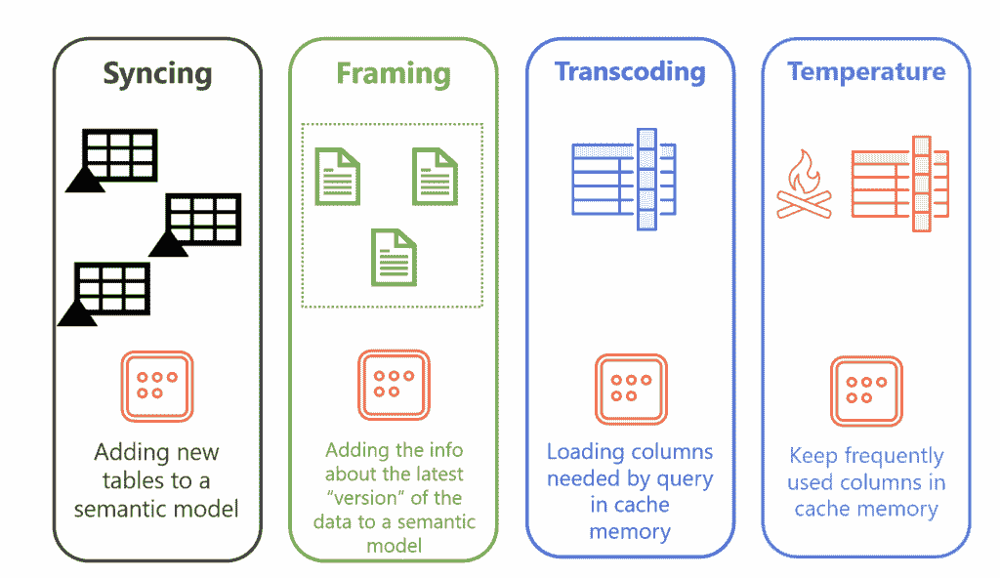

图片由作者提供

感谢阅读！
