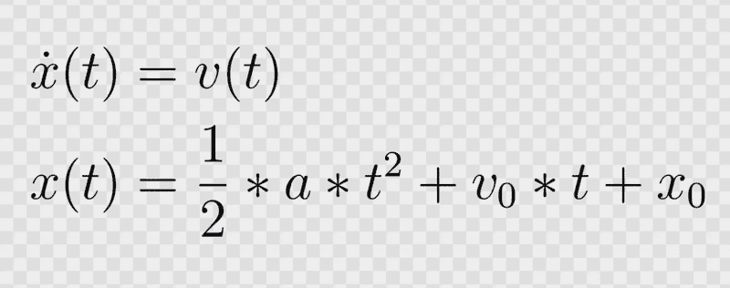
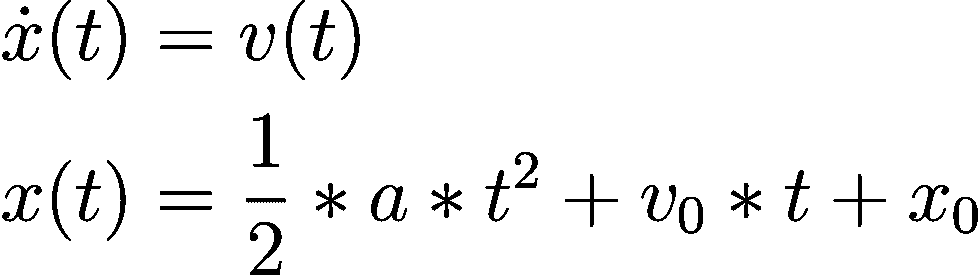
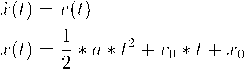
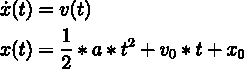
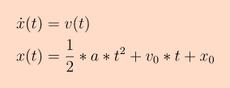

# 精通透明图像：添加背景层

> [`towardsdatascience.com/mastering-transparent-images-adding-a-background-layer-610b6227dab0/`](https://towardsdatascience.com/mastering-transparent-images-adding-a-background-layer-610b6227dab0/)



使用 Alpha 通道为图像添加彩色背景

最近，我需要为几个带有透明背景的图像添加白色背景。当然，我使用了 **Python** 和 **OpenCV**来自动化这个过程，我可不打算为每个图像打开图像编辑器。

> 添加背景颜色听起来足够简单，对吧？

嗯，在我第一次尝试实现这个功能时，我没有完全成功，不得不迭代解决方案，所以我决定与你分享这个过程。

如果你想要跟随，请确保在你的本地 Python 环境中安装了 **opencv-python** 和 **numpy** 包。你可以使用以下透明方程图像进行实验，你可以从这里 [下载](https://raw.githubusercontent.com/trflorian/image-processing/refs/heads/main/images/equation.png)。



带有 Alpha 通道的 PNG 图像

### 加载带有 Alpha 通道的图像

在第一步中，我们需要加载包含 Alpha 通道的透明图像。如果我们使用 ***cv2.imread*** 正常加载图像而不带所需的参数，它将简单地忽略 Alpha 通道，在这种情况下图像将是完全黑色的。

```py
img = cv2.imread("equation.png")

cv2.imshow("Image", img)

cv2.waitKey(0)
cv2.destroyAllWindows()
```


读取不带 Alpha 通道的 PNG 图像

如果你查看图像的 ***shape***，你会注意到对于蓝色、绿色和红色值只有 3 个颜色通道，但没有 Alpha 通道。

```py
# Shape of image in order (H, W, C) with H=height, W=width, C=color
print(img.shape)
```

```py
> (69, 244, 3)
```

在 ***imread*** 函数中有一个 ***flag*** 参数，默认为 _**cv2.IMREAD_COLOR***_。这将始终将图像转换为 3 通道 BGR 图像。为了保留 Alpha 通道，我们需要指定标志 ***cv2.IMREAD_UNCHANGED**_。

```py
img = cv2.imread("equation.png", flags=cv2.IMREAD_UNCHANGED)

# Shape of image in order (H, W, C) with H=height, W=width, C=color
print(img.shape)
```

```py
> (69, 244, 4)
```

正如你现在所看到的，Alpha 通道也被包含在内，颜色通道的顺序是 **BGRA**，因此对于每个像素，我们得到 4 个值，最后一个值是 Alpha 值。

如果你尝试使用 ***imshow*** 显示图像，你会看到它仍然是黑色的。该函数简单地忽略了 Alpha 通道，但我们知道它在那里。****** 现在我们可以开始用彩色背景替换 Alpha 通道。

### 二值背景

在第一次尝试中，我们可以尝试将图像的透明像素替换为背景颜色，例如白色。例如，我们可以将所有超过 50%透明度的像素设置为白色。由于图像数组是用 8 位无符号整数表示的，因此 alpha 通道的值从 0 到 255。因此，我们可以将所有 alpha 值小于或等于 128（256 的 50%）的像素替换为白色（所有 3 个颜色通道设置为 255）。

```py
# Values for background
bg_threshold = 128 # 50% transparency
bg_color = (255, 255, 255) # White

# Threshold alpha channel
bg_indices = img[:, :, 3] <= bg_threshold

# Replace image at indices with background color
img[bg_indices, :3] = bg_color
```

这里你可以看到结果：



你也可以尝试不同的阈值，在极端情况下，使用阈值为 0，这样只有 100%透明的像素被认为是背景，因此被着色为白色。



### 背景混合

如你可能已经注意到的，这两张图片看起来并不完全正确。你可能找到一个更好的阈值，使图片看起来更合适，但根本问题是我们在设置一个**二进制**阈值，而透明度/alpha 通道是一个连续值。背景颜色实际上应该**混合**到原始颜色中，所以让我们看看我们如何实现这一点。

为了根据 alpha 值将原始颜色与背景颜色混合，我们希望有以下行为：

+   在 100%不透明度时，我们应该应用 100%的原始颜色

+   在 60%不透明度时，我们希望有 60%的原始颜色和 40%的背景颜色。

+   在 0%不透明度时，我们只想保留背景颜色。

换句话说，最终图像中每个像素的颜色应该是这样的，其中 alpha 是一个介于 0 和 1 之间的值：

```py
# alpha=0 -> 0% opacity, fully transparent
# alpha=1 -> 100% opacity, fully opaque
color_final = alpha * original + (1 - alpha) * background
```

要实现这一点，我们首先必须提取 alpha 通道并将其归一化。确保在归一化之前将数据类型转换为***float***，如果我们使用原始的***uint8***数据类型，我们只会得到 0s 和 1s。

> **注意：**我们除以 255 而不是 256，因为 8 位整数的最大值可以是 255，我们希望这正好是 1。

```py
alpha = img[:, :, 3].astype(float)
alpha = alpha / 255.0
```

接下来，我们应该通过索引**BGRA**图像中的前三个颜色通道来准备原始的 3 个颜色通道图像。我们还需要将这些值转换为***floats***，否则我们无法在后面将它们与 alpha 值相乘和相加。

```py
# BGR for blue, green, red
img_bgr_original = img[:, :, :3].astype(float)
```

我们还可以准备背景图像，每个像素包含我们的背景颜色。使用**numpy**的**full_like**函数，我们可以重复一个值，在我们的例子中是背景颜色，以使其形状与输入数组，即我们的图像相同。再次使用**float**数据类型。

```py
img_bgr_background = np.full_like(a=img_bgr_original, fill_value=bg_color, dtype=float)
```

现在我们几乎准备好使用上面的公式进行乘法了。事实上，让我们试试看会发生什么，这样你也可以理解为什么我们需要进行额外的步骤。

```py
img_blended = alpha * img_bgr_original + (1 - alpha) * img_bgr_background
```

如果我们运行这个程序，我们会得到以下错误：

```py
 img_blended = alpha * img_bgr_original + (1 - alpha) * img_bgr_background
                  ~~~~~~^~~~~~~~~~~~~~~~~~
ValueError: operands could not be broadcast together with shapes (69,244) (69,244,3) 
```

问题在于，我们的 alpha 图像具有维度***(69, 244)***，这是一个二维维度，没有颜色通道维度。而图像具有颜色通道维度***(69, 244, 3)***，维度是 3。为了解决这个问题，我们想要确保两个数组都有 3 个维度，然后我们才能将它们相乘。为此，我们可以使用**_np.expand_dims_**函数扩展 alpha 数组的维度。

```py
print(f"{img.shape=}") # img.shape=(69, 244, 4)
print(f"{img_bgr_original.shape=}") # img_bgr_original.shape=(69, 244, 3)
print(f"{img_bgr_background.shape=}") # img_bgr_background.shape=(69, 244, 3)
print(f"{alpha.shape=}") # alpha.shape=(69, 244)

alpha = np.expand_dims(alpha, axis=-1)

print(f"{alpha.shape=}") # alpha.shape=(69, 244, 1) <- see the additional dimension here!
```

**这个概念非常重要，但并不容易理解**。我鼓励你花些时间来理解和实验数组的形状。

现在我们终于可以使用上面的代码计算混合图像了。在我们能够展示图像之前，我们还需要进行一个最后的步骤，那就是将其转换回 8 位无符号整数数组。

```py
img_blended = alpha * img_bgr_original + (1 - alpha) * img_bgr_background
img_blended = img_blended.astype(np.uint8)

cv2.imshow("Blended Background", img_blended)
```

现在我们可以可视化混合图像并查看干净的结果：


我们还可以将背景颜色更改为橙色等颜色，并在图像周围添加一些背景颜色的填充。

```py
bg_color = (200, 220, 255) # Orange
bg_padding = 20

...

img_blended = cv2.copyMakeBorder(
    img_blended, bg_padding, bg_padding, bg_padding, bg_padding, cv2.BORDER_CONSTANT, value=bg_color
)

...
```



## 结论

在这个项目中，你学习了如何向具有透明度的图像添加背景图层。我们首先探索了一种使用阈值设置图像中背景颜色的二进制方法。然而，这种方法并没有产生视觉上令人满意的结果。在第二次尝试中，我们使用了一种基于 alpha 值混合背景颜色的方法。这产生了看起来自然的干净图像。我们研究了有关图像维度的细节，并解决了一个在处理***numpy***数组时可能发生的常见错误。

完整的源代码可在以下 GitHub 链接中找到。我希望你学到了一些东西！

> [**image-processing/transparent_background.py at main · trflorian/image-processing**](https://github.com/trflorian/image-processing/blob/main/transparent_background.py)

* * *

*本帖中所有可视化图表均由作者创建。*
