# 如何通过 3 个简单步骤创建定制的 GenAI 视频

> [`towardsdatascience.com/how-to-create-a-customized-genai-video-in-3-simple-steps-e60dfdbb82f6/`](https://towardsdatascience.com/how-to-create-a-customized-genai-video-in-3-simple-steps-e60dfdbb82f6/)

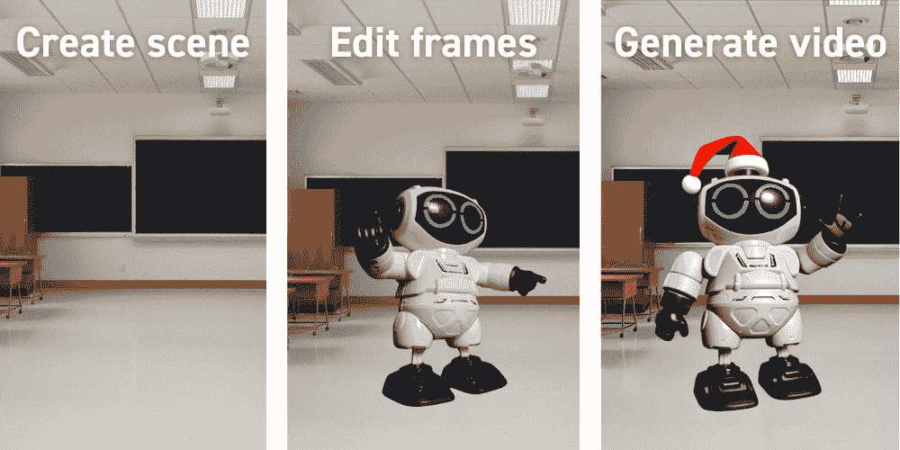

使用 GenAI 持续创建视频的三个步骤。

生成式 AI（GenAI）的进步惊人地快。它在各种文本驱动型任务中变得更加成熟，从典型的自然语言处理（NLP）到能够独立执行高级任务的 AI 代理。然而，在图像、音频和视频创建方面，它仍然处于起步阶段。虽然这些领域仍然新颖、难以控制，有时甚至有些花哨，但它们每个月都在变得更好。为了说明这一点，下面的视频展示了过去一年中视频生成是如何演变的，以臭名昭著的“意大利面吃法*基准*”为例*。

<iframe src="[`cdn.embedly.com/widgets/media.html?src=https%3A%2F%2Fwww.youtube.com%2Fembed%2FfGUn7GwXBvQ%3Ffeature%3Doembed&display_name=YouTube&url=https%3A%2F%2Fwww.youtube.com%2Fwatch%3Fv%3DfGUn7GwXBvQ&image=https%3A%2F%2Fi.ytimg.com%2Fvi%2FfGUn7GwXBvQ%2Fhqdefault.jpg&type=text%2Fhtml&schema=youtube`](https://cdn.embedly.com/widgets/media.html?src=https%3A%2F%2Fwww.youtube.com%2Fembed%2FfGUn7GwXBvQ%3Ffeature%3Doembed&display_name=YouTube&url=https%3A%2F%2Fwww.youtube.com%2Fwatch%3Fv%3DfGUn7GwXBvQ&image=https%3A%2F%2Fi.ytimg.com%2Fvi%2FfGUn7GwXBvQ%2Fhqdefault.jpg&type=text%2Fhtml&schema=youtube)" title="各种视频生成模型（DreamBooth, Sora, Veo 2）的演变：以臭名昭著的意大利面吃法“基准”为例。" height="480" width="854">

在这篇文章中，我专注于视频生成，并展示你如何生成包含你自己或真实世界物体的视频——正如下面所示的“GenAI 圣诞”视频所示。本文将回答以下问题：

+   现在的视频生成有多好？

+   是否可以生成围绕特定对象的视频？

+   我如何自己创建一个？

+   我可以期待什么样的质量水平？

让我们直接深入探讨！

* * *

## GenAI 视频创建的类型

通过 AI 进行视频生成有多种形式，每种都有其独特的功能和挑战。通常，你可以将 GenAI 视频分为以下三个类别：

+   包含知名概念和名人的视频

+   从微调的图像生成模型开始的基于图像的视频

+   从编辑内容开始的基于图像的视频

让我们更详细地分解每个步骤！

### **包含知名概念和名人的视频**

这种类型的视频生成完全依赖于文本提示，使用大型视觉模型（LVM）已经知道的概念来产生内容。这些通常是通用的概念（例如，“一个低角度的镜头捕捉了一群粉红色的火烈鸟优雅地在郁郁葱葱、宁静的泻湖中漫步。”*~ 如下 Veo 2 演示所示*）混合在一起，以创建一个真正真实的视频，与输入的提示相吻合。

![由谷歌的 Veo 2 制作的视频——提示：一个低角度的镜头捕捉了一群粉红色的火烈鸟优雅地在郁郁葱葱、宁静的泻湖中漫步。[……]](../Images/a2f28ac24f28861eafde04bda6f0ddac.png)

由谷歌的 Veo 2 制作的视频——提示：一个低角度的镜头捕捉了一群粉红色的火烈鸟优雅地在郁郁葱葱、宁静的泻湖中漫步。[……]

然而，一张图片胜过千言万语，而提示永远不会这么长（即使是这样，视频生成也不会听）。这使得这种方法几乎不可能创建一致的后续镜头，这些镜头可以在更长的视频中相互配合。以可口可乐 2024 年完全由 AI 生成的广告为例——以及展示的卡车中缺乏一致性（它们每一帧都在变化！）。

> **学习：使用文本到视频模型创建一致的后续镜头几乎是不可能的。**

<iframe src="[`cdn.embedly.com/widgets/media.html?src=https%3A%2F%2Fwww.youtube.com%2Fembed%2FE3-J0MwvBSI%3Ffeature%3Doembed%26start%3D0&display_name=YouTube&url=https%3A%2F%2Fwww.youtube.com%2Fwatch%3Fv%3DE3-J0MwvBSI&image=https%3A%2F%2Fi.ytimg.com%2Fvi%2FE3-J0MwvBSI%2Fhqdefault.jpg&type=text%2Fhtml&schema=youtube`](https://cdn.embedly.com/widgets/media.html?src=https%3A%2F%2Fwww.youtube.com%2Fembed%2FE3-J0MwvBSI%3Ffeature%3Doembed%26start%3D0&display_name=YouTube&url=https%3A%2F%2Fwww.youtube.com%2Fwatch%3Fv%3DE3-J0MwvBSI&image=https%3A%2F%2Fi.ytimg.com%2Fvi%2FE3-J0MwvBSI%2Fhqdefault.jpg&type=text%2Fhtml&schema=youtube)" title="可口可乐的完全由 AI 生成的广告，由“Wild Card”工作室制作——展示了生成的卡车中的不一致性。" height="480" width="854">

一致性限制的一个例外，可能是最广为人知的，就是名人。由于他们精心策划的媒体形象，大型视觉模型（LVM）通常有足够的训练数据来根据文本提示生成这些名人的图像或视频。在其中添加一些*明确*的内容，就有可能走红——正如下面由 Dor 兄弟制作的音乐视频所示。然而，请注意，他们仍然在保持一致性上遇到了困难，正如每个镜头中不断变化的衣服所展示的那样。

<iframe src="[`cdn.embedly.com/widgets/media.html?src=https%3A%2F%2Fwww.youtube.com%2Fembed%2FTbXZoMocpM8%3Ffeature%3Doembed&display_name=YouTube&url=https%3A%2F%2Fwww.youtube.com%2Fwatch%3Fv%3DTbXZoMocpM8&image=https%3A%2F%2Fi.ytimg.com%2Fvi%2FTbXZoMocpM8%2Fhqdefault.jpg&type=text%2Fhtml&schema=youtube`](https://cdn.embedly.com/widgets/media.html?src=https%3A%2F%2Fwww.youtube.com%2Fembed%2FTbXZoMocpM8%3Ffeature%3Doembed&display_name=YouTube&url=https%3A%2F%2Fwww.youtube.com%2Fwatch%3Fv%3DTbXZoMocpM8&image=https%3A%2F%2Fi.ytimg.com%2Fvi%2FTbXZoMocpM8%2Fhqdefault.jpg&type=text%2Fhtml&schema=youtube)" title="Music video featuring celebrities in AI-generated scenes – "The Drill" from The Dor Brothers." height="480" width="854">

通用人工智能工具的民主化使得人们比以往任何时候都更容易创建自己的内容。这很好，因为它充当了创意的推动者，但也增加了误用的可能性。这反过来又引发了重要的伦理和法律问题，尤其是在同意和误导性表述方面。如果没有适当的规则，有害或误导性内容涌入数字平台的风险很高，这使得我们更难相信我们在网上看到的内容。幸运的是，许多工具，如 Runway，都设有系统来标记可疑或不适当的内容，有助于保持事物的秩序。

> **学习要点：由于名人的（视觉）数据丰富，名人可以持续生成，这合理地引发了伦理和法律上的担忧。幸运的是，大多数生成引擎都通过标记此类请求来帮助监控误用。**

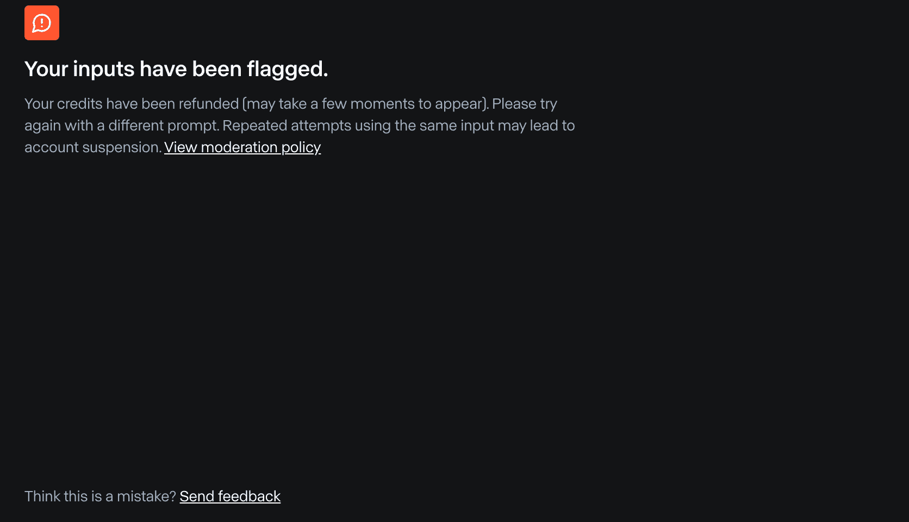

Runway 因为检测到名人而阻止视频生成。

### **基于微调的图像生成模型开始的图像视频**

生成视频的另一种流行方法是从小幅修改的图像开始，该图像作为视频的第一帧。这个帧可以完全生成——如下面的第一个示例所示——或者基于真实图像，稍作修改以提供更好的控制。例如，你可以手动修改图像或使用图像到图像模型。以下面的第二个示例所示，一种方法是使用修复技术。

> **学习要点：
> 
> +   使用图像作为生成视频中的特定帧，可以提供更大的控制权，帮助你将视频锚定到特定的视角。
> +   
> +   可以从头开始使用图像生成模型创建帧。 — 你可以利用图像到图像模型来改变更适合故事情节的现有图像。**

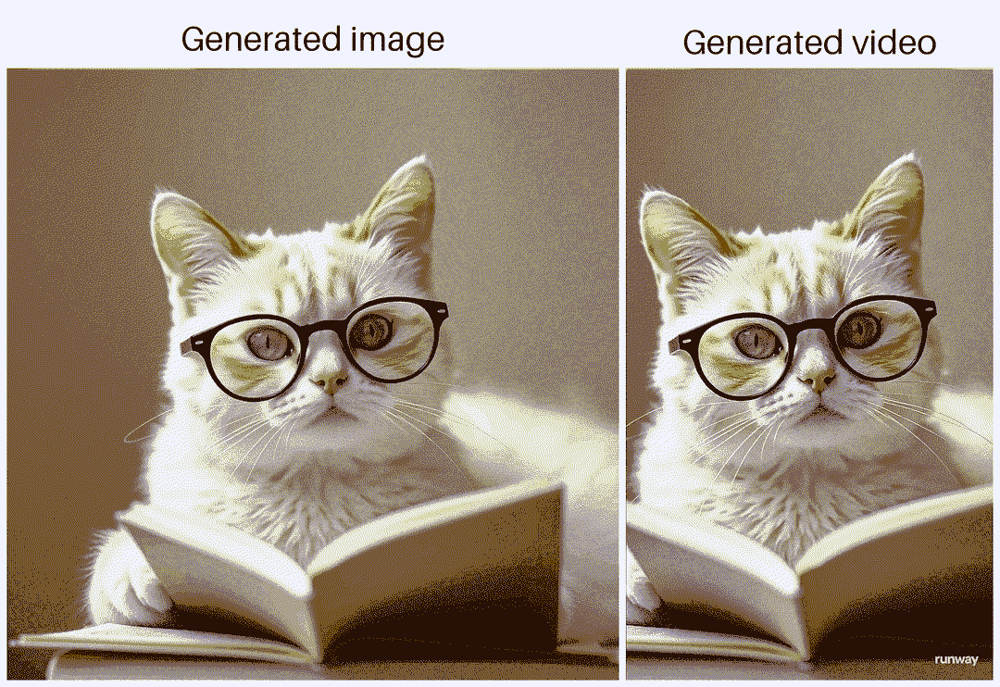

基于生成的图像阅读书籍的猫，自行使用 Flux 进行图像生成和 Ruway 将图像转换为视频。

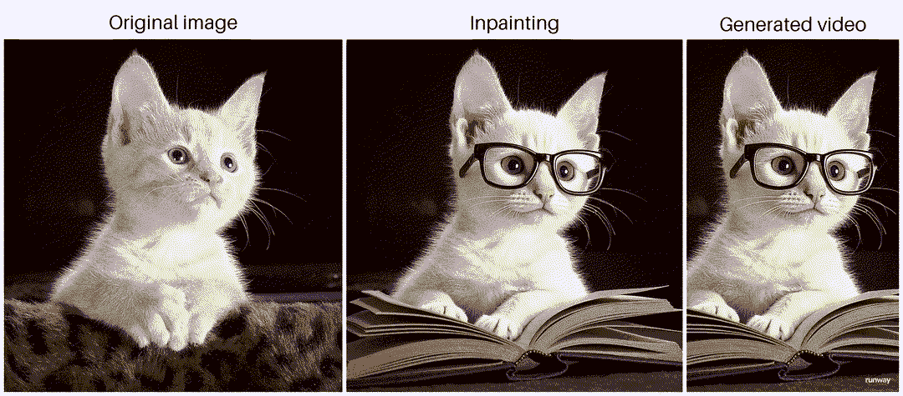

一只猫基于真实图像读书，使用 Flux 进行修复和 Runway 将图像转换为视频。

其他更复杂的方法包括完全使用风格迁移模型更改照片的风格，或者让模型学习特定的概念或人物，然后生成变体，就像在 DreamBooth 中做的那样。然而，这非常困难，因为微调并不简单，需要大量的尝试和错误才能正确。此外，最终结果将始终是“尽可能好”，在调优过程的开始时几乎无法预测输出质量。尽管如此，当做得正确时，结果看起来非常惊人，就像这个“逼真的辛普森一家”视频所示：

<iframe src="[`cdn.embedly.com/widgets/media.html?src=https%3A%2F%2Fwww.youtube.com%2Fembed%2FmBJatkcofgU%3Ffeature%3Doembed&display_name=YouTube&url=https%3A%2F%2Fwww.youtube.com%2Fwatch%3Fv%3DmBJatkcofgU&image=https%3A%2F%2Fi.ytimg.com%2Fvi%2FmBJatkcofgU%2Fhqdefault.jpg&type=text%2Fhtml&schema=youtube`](https://cdn.embedly.com/widgets/media.html?src=https%3A%2F%2Fwww.youtube.com%2Fembed%2FmBJatkcofgU%3Ffeature%3Doembed&display_name=YouTube&url=https%3A%2F%2Fwww.youtube.com%2Fwatch%3Fv%3DmBJatkcofgU&image=https%3A%2F%2Fi.ytimg.com%2Fvi%2FmBJatkcofgU%2Fhqdefault.jpg&type=text%2Fhtml&schema=youtube)" title="由*demonflyingfox*创建的 AI 生成视频“辛普森一家 – 1950 年代超级潘纳维申 70”" height="480" width="854">

### 从编辑内容开始的基于图像的视频

最后一个选项——这是我主要用来生成本文引言中展示的视频的方法——是在将图像输入到图像到视频生成模型之前手动编辑图像。这些手动编辑的图像随后作为生成视频的起始帧，甚至作为中间和最终帧。这种方法提供了显著的控制，因为您只受限于自己的编辑技能和视频生成模型在锚定帧之间的解释自由度。以下图示展示了我是如何使用 Sora 在两个连续的锚定帧之间创建过渡的。

> **学习：大多数视频生成工具（Runway、Sora 等）允许您指定起始、中间和/或结束帧，在视频生成过程中提供极大的控制。**

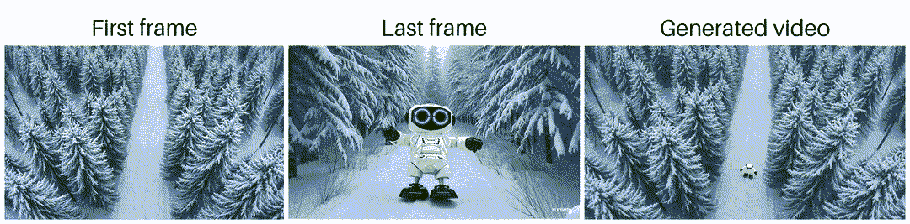

从起始帧到结束帧的过渡，使用 Flux 1.1 Schnell 生成两个背景，并使用 Sora 进行视频生成。请注意，Sora 在视频的第二帧中生成了机器人的俯视图——这是一个“快乐的意外”，因为它非常适合。

令人兴奋的是，编辑的质量甚至不需要很高，只要视频生成模型理解您想要做什么。下面的示例显示了初始编辑——将机器人简单复制粘贴到生成的背景场景中——以及它是如何转换成机器人穿越森林的。

> **学习：低质量的编辑仍然可以导致高质量的视频生成。**

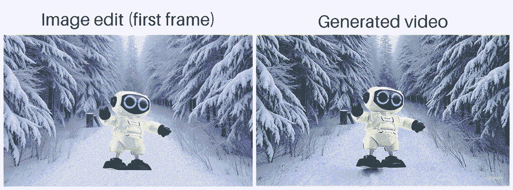

基于经过（糟糕的）编辑的图像生成的 AI 视频，其中机器人简单地粘贴到场景中，使用 Runway 生成的自制视频。

由于生成的视频由自编辑的图像锚定，因此控制视频流程变得容易得多，从而确保连续镜头更好地结合在一起。在下一节中，我将深入探讨如何具体实现这一点。

> **学习：手动编辑特定的帧以锚定生成的视频，可以使您创建一致的后续镜头。**

* * *

## 制作您自己的视频！

好了，长篇大论先放一边，现在您如何开始真正制作视频呢？

下面的三个部分将逐步解释如何制作您在本文开头看到的视频中的大多数镜头。简而言之，它们几乎总是遵循相同的方法：

+   第 1 步：通过图像生成生成场景

+   第 2 步：对您的场景进行编辑——即使是糟糕的编辑也可以！

+   第 3 步：将您的图像转换为生成的视频

让我们动手吧！

## 第 1 步：通过图像生成生成场景

首先，让我们生成特定场景的设置。在我创建的音乐视频中，提到了越来越聪明的代理，所以我决定教室场景会很合适。为了生成这个场景，我使用了 Flux 1.1 Schnell。我个人认为，Black Forest Labs 的 Flux 模型的结果比 OpenAI 的 DALL-E3、Midjourney 的模型或 Stability AI 的 Stable Diffusion 模型更令人满意。

> **学习：在撰写本文时，Black Forest Labs 的 Flux 模型提供了最好的文本到图像和修复结果。**

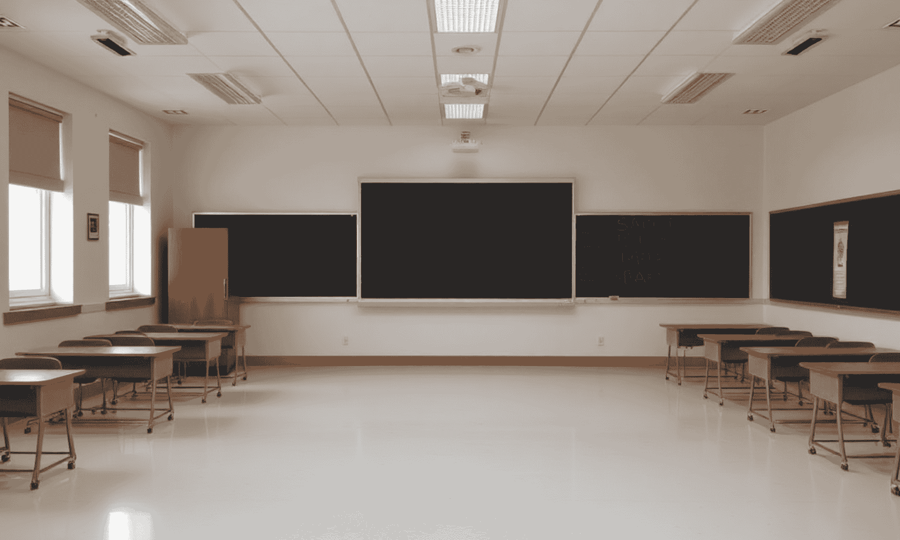

使用 Flux 1.1 Schnell 自制的空教室图片。

## 第 2 步：对您的场景进行编辑——即使是糟糕的编辑也可以！

接下来，我想在场景中包含一个玩具机器人——视频的主题。为此，我拍摄了机器人的照片。为了更容易地移除背景，我使用了绿幕，尽管这不是必需的。如今，像 Daniel Gatis 的 [rembg](https://github.com/danielgatis/rembg) 或 Meta 的 [Segment Anything Model (SAM)](https://ai.meta.com/sam2/) 这样的 AI 模型在执行这项任务方面非常出色。如果你不想担心这些模型的本地设置，你总是可以使用在线解决方案，比如 [remove.bg](https://www.remove.bg/upload)。

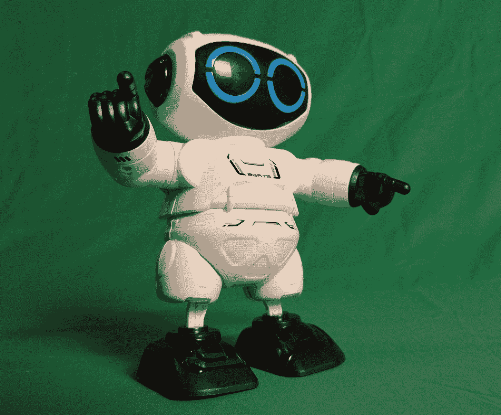

真实世界玩具机器人的图像捕捉。

一旦你移除了主体的背景——并且可选地添加了一些其他组件，比如哑铃——你就可以将这些粘贴到原始场景中。编辑得越好，生成的视频质量就越高。正确设置光线是一个我似乎没有成功的挑战。尽管如此，视频生成可以做得如此之好，即使是从非常糟糕的编辑图片开始，也令人惊讶。对于编辑，我推荐查看 [Canva](https://canva.com/)，这是一个易于使用的在线工具，学习曲线非常小。

> **学习：Canva 是编辑图片的利器。**

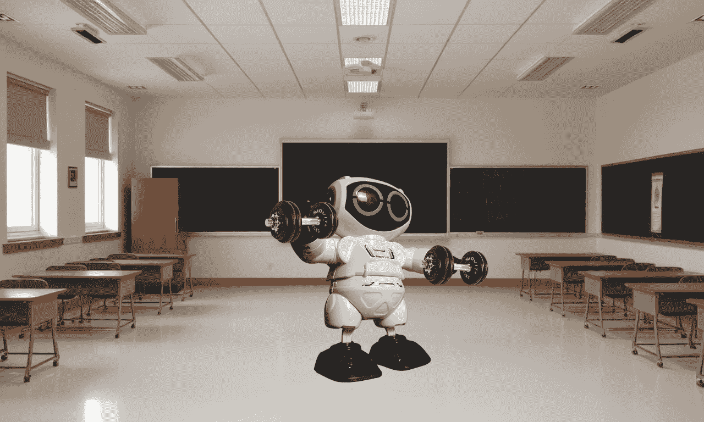

拍摄的玩具机器人手持哑铃的编辑。

## 第 3 步：将你的图片转换为生成视频

一旦你有了锚定帧，你可以使用所选的视频生成模型和精心制作的提示将这些转换为视频。为此，我实验了 [Runway 的视频生成模型](https://runwayml.com/) 和 [OpenAI 的 Sora](https://sora.com/)（不幸的是，还没有访问到 [Google 的 Veo 2](https://deepmind.google/technologies/veo/veo-2/)）。在我的实验中，Runway 通常给出了更好的结果。有趣的是，Runway Gen-3 Alpha *Turbo* 的成功率最高，而不是它的哥哥 Gen-3 Alpha。很好，因为它更便宜，而且视频生成模型的生成信用额度相当昂贵且稀少。根据我在网上看到的视频，Google 的 Veo 2 似乎是生成能力的一次重大飞跃。希望它很快就能普遍可用！

> **学习要点：
> 
> +   Runway 的 Gen-3 Alpha Turbo 在 Runway 的其他模型——Gen-2 和 Gen-3 Alpha——以及 OpenAI 的 Sora 中具有最高的成功率。
> +   
> +   在所有平台上，生成信用额度都很昂贵且稀少。你不会得到很多钱，特别是考虑到生成过程中对“运气”的高度依赖。**

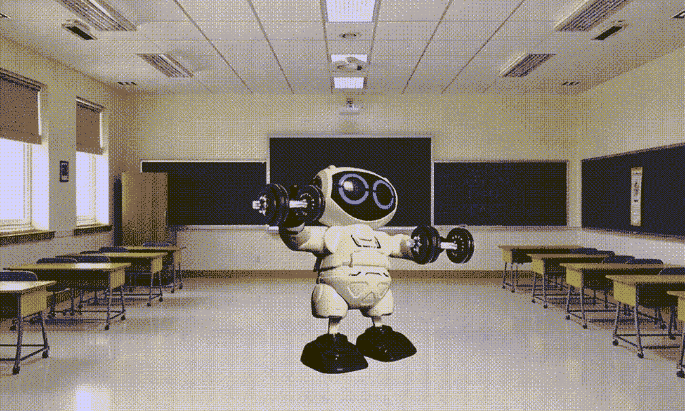

基于编辑起始帧的 AI 生成视频，自行使用 Runway 制作。

很遗憾，生成视频仍然更多的是失败而非成功。虽然让摄像机在场景中移动相对简单，但要求视频主题进行特定动作仍然非常困难。像“举起右手”这样的指令几乎不可能实现——所以甚至不要考虑指导主题的右手应该如何举起。为了说明，下面是前一部分讨论的起始帧和结束帧之间转换的失败生成示例。对于这次生成，指令是对一个有机器人在上面行走的雪地道路进行缩放。对于更多滑稽而令人不安的视频生成，请参阅下一节；“*请注意！预期失败…*”。

> **学习：生成视频更多的是失败而非成功。特别是指导动作，几乎难以实现，几乎不可能完成。**

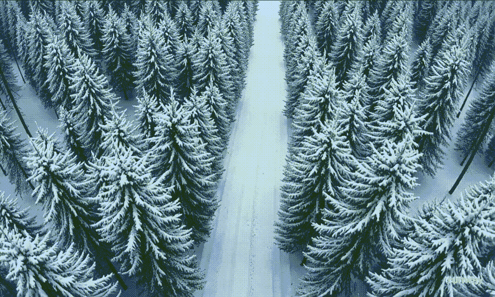

使用 Runway 自行制作的起始到结束帧视频转换的失败生成。

## 重复...

一旦你得到满意的结果，你可以重复这个过程来获取连续的、相互匹配的镜头。这可以通过多种方式完成，例如创建一个新的起始帧（见下面第一个示例），或者通过使用上一轮生成的帧继续视频生成，但使用不同的提示来改变主题的行为（见下面第二个示例）。

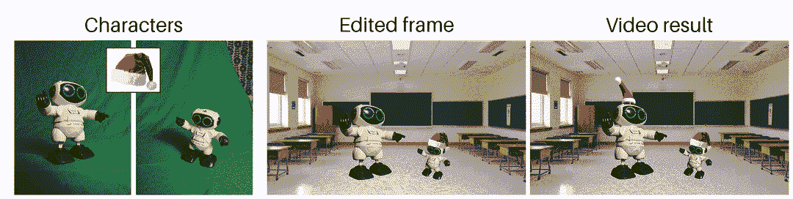

基于新创建的起始帧的合适下一镜头示例。

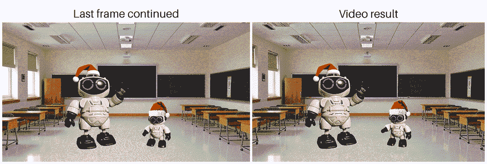

基于前一代最终帧的合适下一镜头示例。这种方法在很大程度上依赖于视频生成提示来改变场景。

* * *

## 请注意！预期失败…

如前所述，生成视频是件困难的事情，所以请降低你的期望。你想要生成一个特定的镜头或动作吗？没门。你想要生成一个*任何事物*的漂亮镜头，但你不在乎具体是什么吗？是的，这可能行得通！生成的结果不错，但你想要在其中做一些小的修改吗？再次没门...

为了让你对这一过程有一个大致的了解，这里汇集了我创建视频过程中产生的几例*最佳*失败案例。

![所有从编辑过的起始帧开始的失败视频生成。左上角：“戴着欧洲旗帜的驯鹿出现 [...]”。右上角：“在乐队中玩耍的机器人 [...]”。左下角：“帮助辅导孩子的机器人 [...]”。右下角：“将要坐在它后面的沙发上坐下的机器人 [...]”。使用 Sora 或 Runway 生成的视频。](../Images/5bc5396aa428d0734ef0a0e1e4aec6f2.png)

失败的视频生成，所有都是从编辑的起始帧开始的。左上角：“戴着欧洲旗帜的驯鹿出现……”。右上角：“在乐队中玩耍的机器人……”。左下角：“帮助辅导孩子的机器人……”。右下角：“将要坐在它后面的沙发上坐下的机器人……”。使用 Sora 或 Runway 生成的视频。

* * *

## 从普通视频到音乐视频——将你的故事变成一首歌

甜点上的樱桃是一个完全由 AI 生成的歌曲，以补充视频中描绘的故事。当然，这实际上是蛋糕的*基础*，因为音乐是在视频之前生成的，但这不是重点。重点是……音乐生成变得多么伟大？！

本文开头介绍的音乐视频中的歌曲是使用[Suno](https://suno.com/)这个 AI 应用程序创建的，它给我留下了最大的“哇！”效果。生成真正不错的音乐的速度和便捷性令人惊叹。为了说明，音乐视频是在五分钟的工作中生成的——这包括模型处理所需的时间！

> **学习：Suno 很棒！**

我理想的音乐生成工作流程如下：

1.  使用 ChatGPT（简单的 40 个字就足够了，01 没有增加太多）构思一个故事，并提取好的部分。

1.  通过向 ChatGPT 提供反馈和手动编辑，将好的部分和想法汇聚起来，完成歌词。

1.  使用 Suno（v4）生成歌曲，并尝试不同的风格。如果某些词听起来不合适（而不是“GenAI”，写成“Gen-AI”以防止发音为“genaj”）的话，可以重新编写特定的词。

1.  在 Suno（v4）中重新制作这首歌。这提高了歌曲的质量和范围，这几乎总是比原始版本有所改进。

* * *

## 所有经验教训的总结

总结一下，以下是我制作自己的音乐视频和撰写本文时学到的所有经验教训：

+   使用文本到视频模型创建一致的后续镜头几乎是不可能的。

+   由于关于名人的（视觉）数据丰富，因此可以持续生成名人，这无疑引发了伦理和法律上的担忧。幸运的是，大多数生成引擎通过标记此类请求来帮助监控滥用。

+   在生成的视频中使用图像作为特定帧提供更大的控制，帮助你将视频锚定到特定视角。

+   可以从头开始使用图像生成模型创建帧。

+   你可以利用图像到图像模型来改变更适合故事线的现有图像。

+   大多数视频生成工具（Runway、Sora、…）允许你指定起始、中间和/或结束帧，在视频生成过程中提供极大的控制。

+   低质量的编辑仍然可能导致高质量的视频生成。

+   通过手动编辑特定帧来锚定生成的视频，你可以创建一致的后续镜头。

+   在撰写本文时，Black Forest Labs 的 Flux 模型提供了最佳的文本到图像和修复结果。

+   Canva 非常适合编辑图片。

+   Runway 的 Gen-3 Alpha Turbo 在 Runway 的其他模型——Gen-2 和 Gen-3 Alpha——以及 OpenAI 的 Sora 中，成功率最高。

+   在所有平台上，生成信用都是昂贵的且稀缺。你花出去的钱回报不多，尤其是考虑到生成过程中对“运气”的高度依赖。

+   生成视频更多的是失败而非成功。特别是定向动作，几乎仍然难以实现。

+   Suno 很棒！

* * *

你喜欢这个内容吗？欢迎关注我的**[LinkedIn](https://www.linkedin.com/in/rubenbroekx/)**，查看我的下一次探索，或者关注我的**[Medium](https://medium.com/@broekxruben)**！

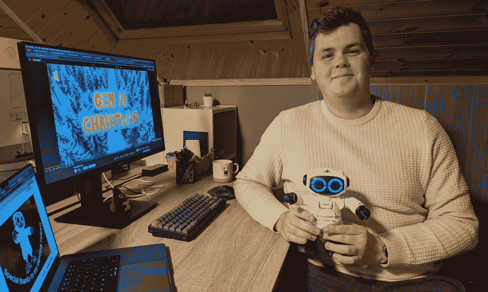
