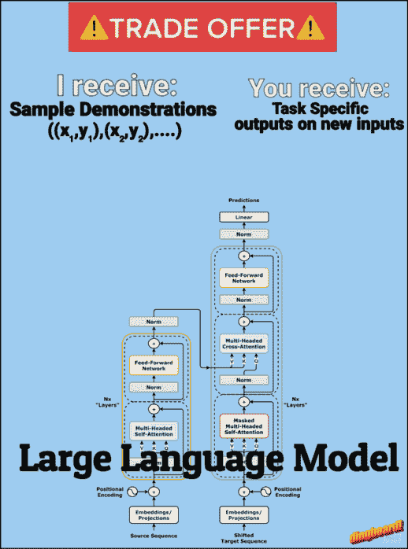
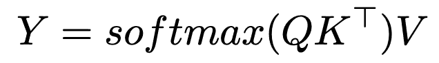
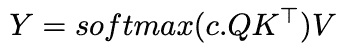
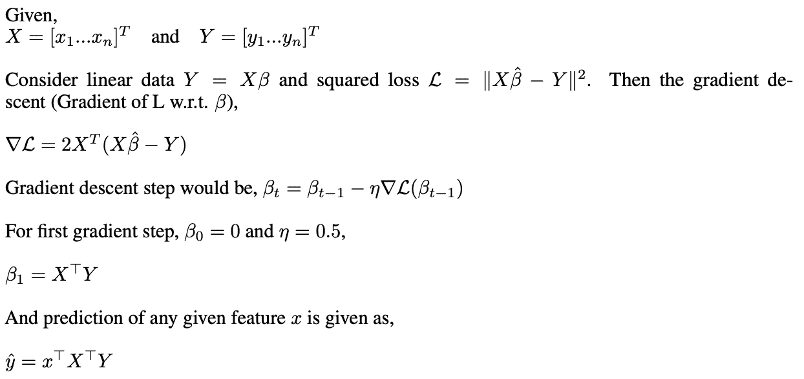
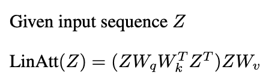
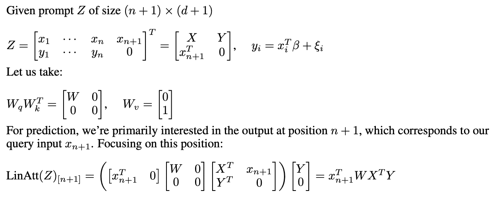
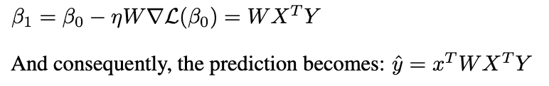

# 在上下文中学习的数学原理

> [原文链接](https://towardsdatascience.com/the-math-behind-in-context-learning-e4299264be74/)

上下文学习（ICL）——Transformer 根据输入提示中提供的示例调整其行为的能力，已成为现代 LLM 使用的基石。在少量提示中，我们提供几个所需任务的示例，特别有效于展示 LLM 我们希望它做什么。但这里有趣的部分是：为什么 Transformer 可以如此容易地根据这些示例调整其行为？在这篇文章中，我将给你一个直观的感觉，了解 Transformer 如何完成这个学习技巧。

来源：作者图片（使用[dingboard](https://dingboard.com)制作）

这将为上下文学习背后的潜在机制提供一个高级介绍，这有助于我们更好地理解这些模型如何处理和适应示例。

ICL 的核心目标可以表述为：给定一组演示对((x,y)对)，我们能否证明注意力机制可以学习/实现一个算法，从这些演示中形成假设，以正确地将新的查询映射到其输出？

## Softmax 注意力

让我们回顾一下基本的 softmax 注意力公式，

来源：作者图片

我们都听说过温度如何影响模型输出，但实际上在引擎盖下发生了什么？关键在于我们如何通过逆温度参数修改标准的 softmax 注意力。这个单一变量改变了模型分配注意力的方式——在通过 softmax 之前缩放注意力分数，将分布从软分布变为越来越尖锐的分布。这将略微修改注意力公式，

来源：作者图片

其中 c 是我们的逆温度参数。考虑一个简单的向量 z = [2, 1, 0.5]。让我们看看 softmax(c*z)在不同 c 值下的行为：

当 c = 0 时：

+   softmax(0 * [2, 1, 0.5]) = [0.33, 0.33, 0.33]

+   所有标记都获得相同程度的注意力，完全失去了区分相似度的能力

当 c = 1 时：

+   softmax([2, 1, 0.5]) ≈ [0.59, 0.24, 0.17]

+   注意力分配与相似度得分成比例，在选择和分配之间保持平衡

当 c = 10000（接近无穷大）时：

+   softmax(10000 * [2, 1, 0.5]) ≈ [1.00, 0.00, 0.00]

+   注意力收敛到一个 one-hot 向量，完全集中在最相似的标记上——这正是我们需要的邻近行为

现在是时候看看这对于上下文学习有多有趣了：当 c 趋向于无穷大时，我们的注意力机制本质上变成了一个 1-最近邻搜索！想想看——如果我们关注所有除了我们的查询之外的标记，我们基本上是在从我们的演示示例中找到最接近的匹配。这为我们对 ICL 有了新的看法——我们可以将其视为通过注意力的机制在输入-输出对上实现最近邻算法。

但是当 c 是有限的时候会发生什么呢？在这种情况下，注意力更像是一个高斯核平滑算法，其中每个标记的权重与它们的指数相似度成比例。

我们看到 Softmax 可以做最近邻搜索，很好，但知道这一点有什么用呢？嗯，如果我们可以说 transformer 可以学习一个“学习算法”（如最近邻、线性回归等），那么我们也许可以在 AutoML 领域使用它，只需给它一些数据，然后让它找到最好的模型/超参数；[Hollmann 等人](https://arxiv.org/pdf/2207.01848)就做了类似的事情，他们在许多合成数据集上训练了一个 transformer，以有效地学习整个 AutoML 流程。transformer 学会自动确定对于任何给定的数据集，哪种类型、超参数和训练方法会最好。当展示新数据时，它可以在单次前向传递中做出预测——本质上将模型选择、超参数调整和训练压缩为一步。

* * *

在 2022 年，Anthropic 发布了一篇论文，其中他们展示了证据表明[归纳头可能构成 ICL 的机制](https://arxiv.org/pdf/2209.11895)。什么是归纳头？正如 Anthropic 所述——“归纳头是通过一个由不同层中一对注意力头组成的电路实现的，这些注意力头协同工作以复制或完成模式。”简单来说，归纳头所做的就是给定一个如——[……, A, B,…, A]的序列，它将通过推理将其补充为 B，其推理是如果 A 在上下文中之前被 B 跟随，那么 A 再次被 B 跟随的可能性很大。当你有一个如“…A, B…A”的序列时，第一个注意力头将前一个标记的信息复制到每个位置，第二个注意力头使用这些信息来找到 A 之前出现的位置并预测其后的内容（B）。

最近，许多研究表明，通过梯度下降([Garg 等人 2022](https://arxiv.org/pdf/2208.01066)，[Oswald 等人 2023](https://arxiv.org/pdf/2212.07677)等)可以实现 ICL，通过展示线性注意力与梯度下降之间的关系。让我们回顾一下最小二乘法和梯度下降，

来源：作者提供的图片

现在我们来看看这与线性注意力是如何联系的

## 线性注意力

在这里，我们将线性注意力视为与 softmax 注意力相同，只是没有 softmax 操作。基本的线性注意力公式，

来源：作者图片

让我们从单层构建开始，它能够捕捉情境学习的本质。想象一下，我们有 n 个训练示例（x₁,y₁）…（xₙ,yₙ），我们想要预测新输入 x*{n+1}的 y*{n+1}。

来源：作者图片

这看起来与我们在梯度下降中得到的非常相似，只是在线性注意力中我们有一个额外的项‘W’。线性注意力所实现的是一种称为预条件梯度下降（**PGD**）的东西，其中我们不是使用标准的梯度步，而是用一个预条件矩阵 W 来修改梯度，

来源：作者图片

我们在这里所展示的是，我们可以构建一个权重矩阵，使得线性注意力的一层将执行一步 PGD。

## 结论

我们看到了注意力如何实现“学习算法”，这些算法基本上是，如果我们提供大量的演示（x,y），那么模型就会从这些演示中学习，以预测任何新查询的输出。虽然涉及多个注意力层和 MLP 的确切机制很复杂，但研究人员在理解情境学习的工作机制方面已经取得了进展。本文提供了一个直观的、高级的介绍，以帮助读者理解这种新兴能力的内部工作原理。

要了解更多关于这个主题的信息，我建议以下论文：

[In-context Learning and Induction Heads](https://transformer-circuits.pub/2022/in-context-learning-and-induction-heads/index.html)

[What Can Transformers Learn In-Context? A Case Study of Simple Function Classes](https://arxiv.org/pdf/2208.01066)

[Transformers Learn In-Context by Gradient Descent](https://arxiv.org/pdf/2212.07677)

[Transformers learn to implement preconditioned gradient descent for in-context learning](https://arxiv.org/pdf/2306.00297)

## 致谢

这篇博客文章灵感来源于我在 2024 年秋季在密歇根大学的研究生课程。虽然这些课程提供了探索这些主题的基础知识和动力，但本文中的任何错误或误解都是我个人的。这代表了我对材料的个人理解和探索。
