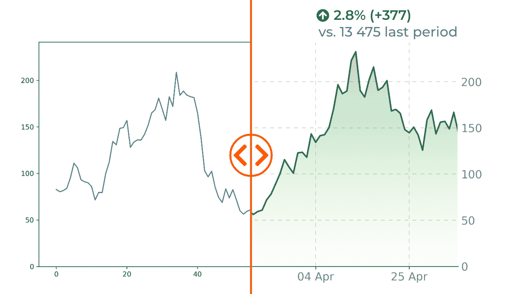
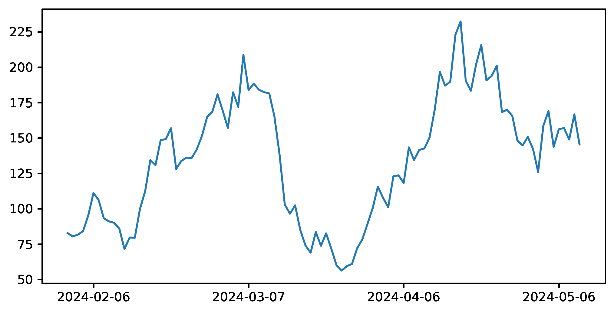
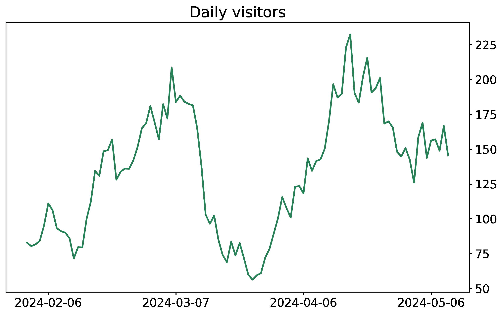
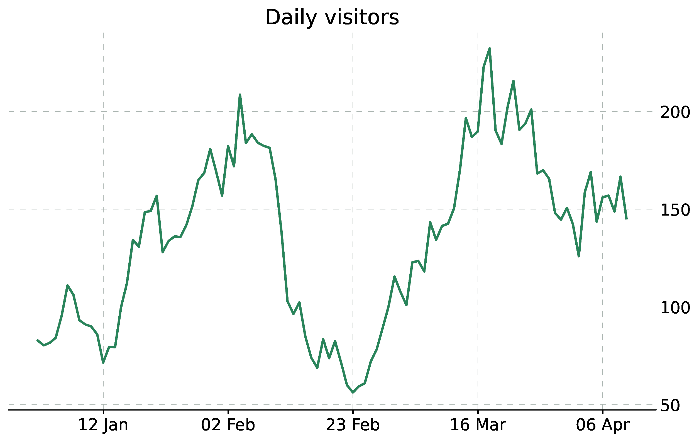
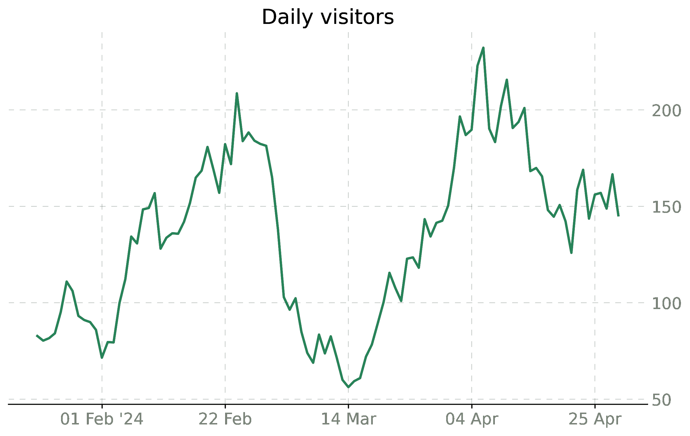
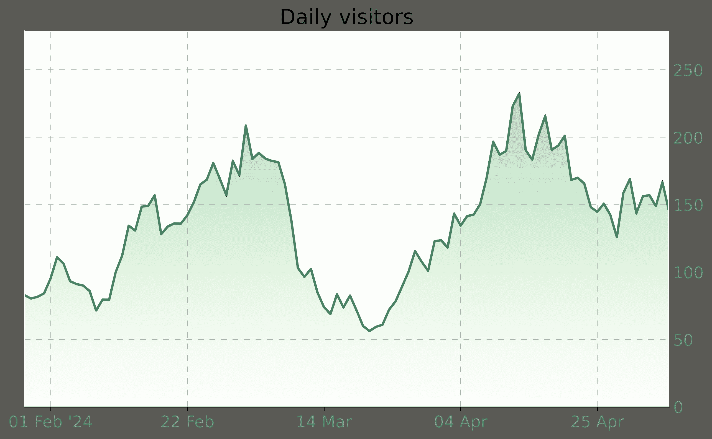
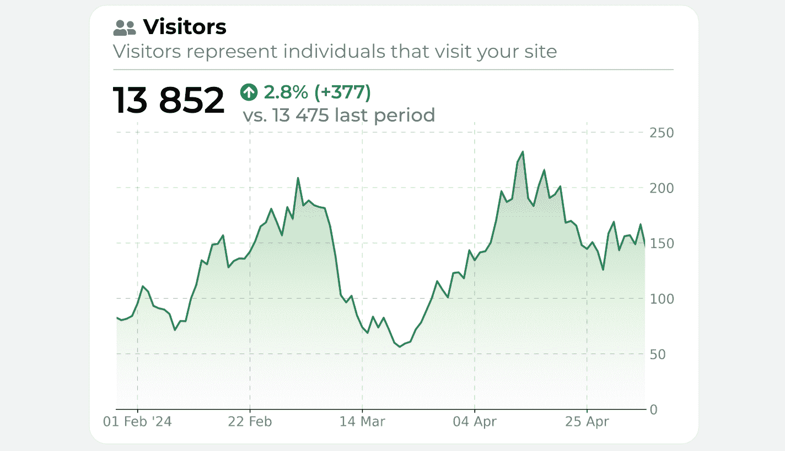

# 从默认 Python 线形图到期刊质量信息图表

> [原文链接](https://towardsdatascience.com/from-default-python-line-chart-to-journal-quality-infographics-80e3949eacc3/)



封面，图片由作者提供

每个使用过 Matplotlib 的人都知道默认图表看起来有多丑。在这个系列的文章中，我将分享一些技巧，让你的可视化更加突出，并反映你的个人风格。

我们将从简单的线形图开始，这是广泛使用的。主要的亮点是在图表下方添加渐变填充——这是一个并不完全直接的任务。

那么，让我们深入探讨并了解这个转换的所有关键步骤！

让我们先进行所有必要的导入。

```py
import pandas as pd
import numpy as np
import matplotlib.dates as mdates
import matplotlib.pyplot as plt
import matplotlib.ticker as ticker
from matplotlib import rcParams
from matplotlib.path import Path
from matplotlib.patches import PathPatch

np.random.seed(38)
```

现在我们需要为我们的可视化生成样本数据。我们将创建类似股票价格的样子。

```py
dates = pd.date_range(start='2024-02-01', periods=100, freq='D')
initial_rate = 75
drift = 0.003
volatility = 0.1
returns = np.random.normal(drift, volatility, len(dates))
rates = initial_rate * np.cumprod(1 + returns)

x, y = dates, rates
```

让我们来看看默认的 Matplotlib 设置效果如何。

```py
fix, ax = plt.subplots(figsize=(8, 4))
ax.plot(dates, rates)
ax.xaxis.set_major_locator(mdates.DayLocator(interval=30))
plt.show()
```



默认图表，图片由作者提供

并非真的令人着迷，对吧？但我们将逐步让它看起来更好。

+   设置标题

+   设置通用图表参数——大小和字体

+   将 Y 轴刻度放置在右侧

+   更改主线的颜色、样式和宽度

```py
# General parameters
fig, ax = plt.subplots(figsize=(10, 6))
plt.title("Daily visitors", fontsize=18, color="black")
rcParams['font.family'] = 'DejaVu Sans'
rcParams['font.size'] = 14

# Axis Y to the right
ax.yaxis.tick_right()
ax.yaxis.set_label_position("right")

# Plotting main line
ax.plot(dates, rates, color='#268358', linewidth=2)
```



应用通用参数，图片由作者提供

好的，现在看起来干净多了。

现在我们想在背景中添加简约的网格，去除边框以获得更干净的外观，并从 Y 轴移除刻度。

```py
# Grid
ax.grid(color="gray", linestyle=(0, (10, 10)), linewidth=0.5, alpha=0.6)
ax.tick_params(axis="x", colors="black")
ax.tick_params(axis="y", left=False, labelleft=False) 

# Borders
ax.spines["top"].set_visible(False)
ax.spines['right'].set_visible(False)
ax.spines["bottom"].set_color("black")
ax.spines['left'].set_color('white')
ax.spines['left'].set_linewidth(1)

# Remove ticks from axis Y
ax.tick_params(axis='y', length=0)
```



添加网格，图片由作者提供

现在我们添加一个微小的美学细节——年份靠近 X 轴的第一个刻度。同时，我们还将刻度标签的字体颜色变得更浅。

```py
# Add year to the first date on the axis
def custom_date_formatter(t, pos, dates, x_interval):
    date = dates[pos*x_interval]
    if pos == 0:
        return date.strftime('%d %b '%y')  
    else:
        return date.strftime('%d %b')  
ax.xaxis.set_major_formatter(ticker.FuncFormatter((lambda x, pos: custom_date_formatter(x, pos, dates=dates, x_interval=x_interval))))

# Ticks label color
[t.set_color('#808079') for t in ax.yaxis.get_ticklabels()]
[t.set_color('#808079') for t in ax.xaxis.get_ticklabels()]
```



年份靠近第一个日期，图片由作者提供

我们正接近最棘手的一刻——如何在曲线下方创建渐变。实际上，Matplotlib 中没有这样的选项，但我们可以通过创建渐变图像并将其与图表裁剪来模拟它。

```py
# Gradient
numeric_x = np.array([i for i in range(len(x))])
numeric_x_patch = np.append(numeric_x, max(numeric_x))
numeric_x_patch = np.append(numeric_x_patch[0], numeric_x_patch)
y_patch = np.append(y, 0)
y_patch = np.append(0, y_patch)

path = Path(np.array([numeric_x_patch, y_patch]).transpose())
patch = PathPatch(path, facecolor='none')
plt.gca().add_patch(patch)

ax.imshow(numeric_x.reshape(len(numeric_x), 1),  interpolation="bicubic",
                cmap=plt.cm.Greens, 
                origin='lower',
                alpha=0.3,
                extent=[min(numeric_x), max(numeric_x), min(y_patch), max(y_patch) * 1.2], 
                aspect="auto", clip_path=patch, clip_on=True)
```



添加梯度，图片由作者提供

现在看起来整洁又美观。我们只需要使用任何编辑器（我更喜欢 Google Slides）添加几个细节——标题、圆角边框和一些数字指示器。



最终可视化，图片由作者提供

以下是完全复制可视化所需的代码：
