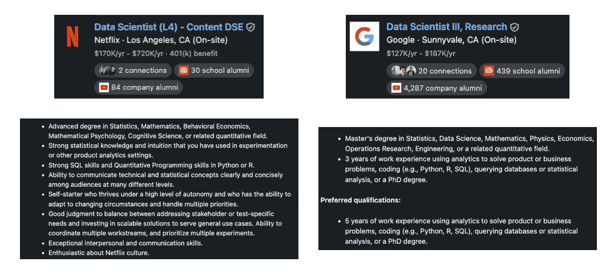
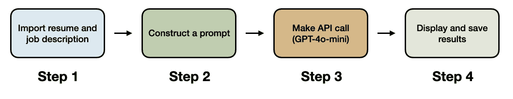
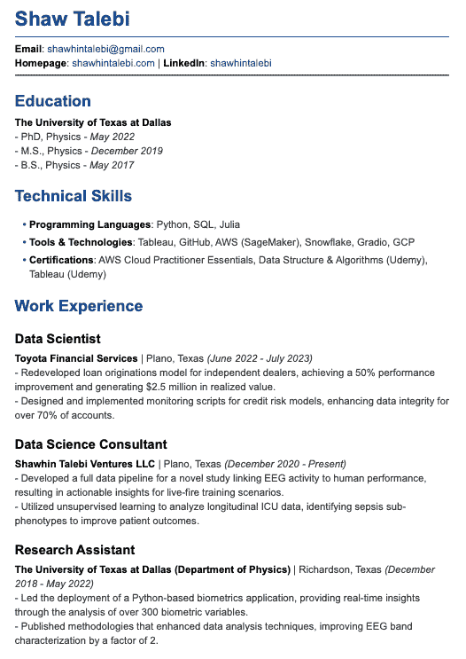
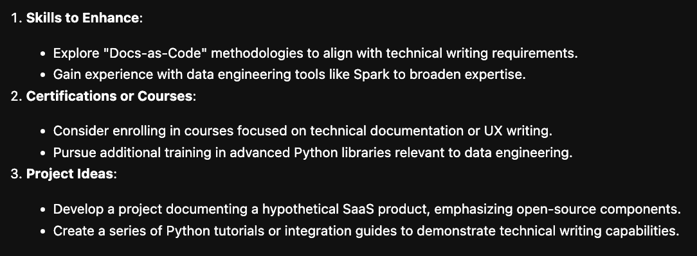
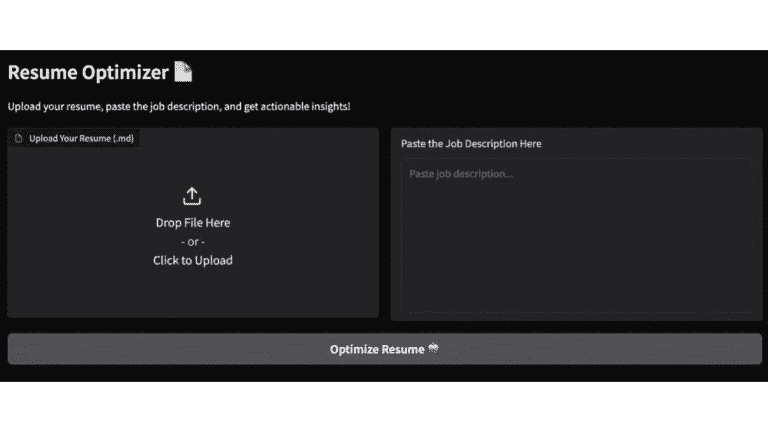

# 如何使用 AI 构建简历优化器

> [原文链接](https://towardsdatascience.com/how-to-build-a-resume-optimizer-with-ai-d73c2f9b9fcd/)

在之前的一篇博客文章中，我分享了[这个周末你可以构建的 5 个 AI 项目](https://towardsdatascience.com/5-ai-projects-you-can-build-this-weekend-with-python-c57724e9c461)，其中第一个项目想法是一个简历优化工具。从那时起，许多人要求更多关于实施这个项目的指导。在这篇文章中，我将通过使用 Python 和 OpenAI 的 API 来展示一个示例实现。


图片来自 Canva。

* * *

适应不同的职位描述是寻找工作的一个有效但繁琐的部分。即使你已经为特定角色定制了你的简历，公司可能对类似的职位名称有不同的期望。

例如，以下是在 Netflix 和 Google 的两个类似的数据科学家职位，具有略微不同的职位描述。幸运的是，有了今天的 AI 工具，**我们可以构建一个应用程序来简化这个过程**。



相似数据科学家职位的比较。图片由作者提供。

## **我能使用 ChatGPT 吗？**

听到这个想法，你可能会想，**我能不能只用 ChatGPT 或 Claude 这样的无代码 AI 工具来做这个？**

答案是肯定的！实际上，**我建议在你想构建类似这样的项目时，从无代码解决方案开始**。然而，有两个限制需要考虑。

**首先**，在聊天 UI 中处理长提示可能会变得繁琐，尤其是当你有多个工作想要申请时。**其次**，如果你想把这个过程从 5 份简历扩展到 50 份，使用 ChatGPT（或类似工具）可能变得不切实际。

## **项目工作流程**

从高层次来看，这个项目旨在接受一份简历和职位描述（JD），并根据 JD 返回一个优化的简历版本。虽然人们可以用许多方式实现这样的工具，但在这里我将使用以下**4 步工作流程**。

1.  **导入简历和 JD**：加载你的简历并定义你想要的目标职位描述。

1.  **构建提示词**：创建一个提示词来引导 AI 重写你的简历。

1.  **调用 API**：使用 OpenAI 的 API 提示 GPT-4o-mini 重写你的简历。

1.  **显示和保存结果**：将新的简历保存为 PDF。



4 步工作流程。图片由作者提供。

## **示例代码：自动简历优化器**

对于我们想要构建的内容及其原因的基本理解，让我们看看如何用 Python 实现这个项目。示例代码在[GitHub](https://github.com/ShawhinT/AI-Builders-Bootcamp-2/tree/main/lightning-lesson)上免费提供。

> [**AI-Builders-Bootcamp-2/lightning-lesson at main · ShawhinT/AI-Builders-Bootcamp-2**](https://github.com/ShawhinT/AI-Builders-Bootcamp-2/tree/main/lightning-lesson)

* * *

### **导入**

我们首先导入几个 Python 库。关键的是*openai*，用于访问 GPT-4o-mini，以及*markdown*和*weasyprint*，用于创建最终简历的 PDF 版本。*注意：此项目需要 OpenAI API 密钥，我从另一个 Python 脚本中导入。*

```py
from IPython.display import display, Markdown
from openai import OpenAI
from top_secret import my_sk

from markdown import markdown
from weasyprint import HTML
```

### **第 1 步：输入简历与 JD**

接下来，我们将输入简历作为字符串加载到 Python 中，并使用 Python 的*input()*函数，以便在运行脚本时将其复制粘贴到任何职位描述中。

```py
# open and read the markdown file
with open("resumes/resume.md", "r", encoding="utf-8") as file:
    resume_string = file.read()

# input job description
jd_string = input()
```

这里有一个细节是**简历以 Markdown 格式保存**。这很重要，因为它会鼓励 GPT-4o-mini 生成一个新的 Markdown 格式的简历，我们可以轻松地将其样式化为 PDF。*注意：ChatGPT（或类似工具）可以将您的 PDF 简历转换为 Markdown。*

### **第 2 步：构建提示**

在导入我们的简历和职位描述后，我们现在可以构建一个提示来指导模型优化简历。这里的一个小技巧是**使用 ChatGPT 编写这个提示的初始版本**，因为 1）它相当长，2）大型语言模型倾向于编写更符合其他大型语言模型期望的指令。

经过一些实验，我最终得到了以下提示模板，它重新编写了简历，并在存在技能差距的情况下提供了额外的改进建议。

```py
prompt_template = lambda resume_string, jd_string : f"""
You are a professional resume optimization expert specializing in tailoring 
resumes to specific job descriptions. Your goal is to optimize my resume and 
provide actionable suggestions for improvement to align with the target role.

### Guidelines:
1\. **Relevance**:  
   - Prioritize experiences, skills, and achievements **most relevant to the 
job description**.  
   - Remove or de-emphasize irrelevant details to ensure a **concise** and 
**targeted** resume.
   - Limit work experience section to 2-3 most relevant roles
   - Limit bullet points under each role to 2-3 most relevant impacts

2\. **Action-Driven Results**:  
   - Use **strong action verbs** and **quantifiable results** (e.g., 
percentages, revenue, efficiency improvements) to highlight impact.  

3\. **Keyword Optimization**:  
   - Integrate **keywords** and phrases from the job description naturally to 
optimize for ATS (Applicant Tracking Systems).  

4\. **Additional Suggestions** *(If Gaps Exist)*:  
   - If the resume does not fully align with the job description, suggest:  
     1\. **Additional technical or soft skills** that I could add to make my 
profile stronger.  
     2\. **Certifications or courses** I could pursue to bridge the gap.  
     3\. **Project ideas or experiences** that would better align with the role.  

5\. **Formatting**:  
   - Output the tailored resume in **clean Markdown format**.  
   - Include an **"Additional Suggestions"** section at the end with 
actionable improvement recommendations.  

---

### Input:
- **My resume**:  
{resume_string}

- **The job description**:  
{jd_string}

---

### Output:  
1\. **Tailored Resume**:  
   - A resume in **Markdown format** that emphasizes relevant experience, 
skills, and achievements.  
   - Incorporates job description **keywords** to optimize for ATS.  
   - Uses strong language and is no longer than **one page**.

2\. **Additional Suggestions** *(if applicable)*:  
   - List **skills** that could strengthen alignment with the role.  
   - Recommend **certifications or courses** to pursue.  
   - Suggest **specific projects or experiences** to develop.
"""
```

### **第 3 步：调用 API**

使用上述提示模板，我们可以动态地构建一个提示，使用输入的简历和职位描述，然后通过 OpenAI 的 API 将其发送给他们。

```py
# create prompt
prompt = prompt_template(resume_string, jd_string)

# setup api client
client = OpenAI(api_key=my_sk)

# make api call
response = client.chat.completions.create(
    model="gpt-4o-mini",
    messages=[
        {"role": "system", "content": "Expert resume writer"},
        {"role": "user", "content": prompt}
    ], 
    temperature = 0.7
)

# extract response
response_string = response.choices[0].message.content
```

### 第 4 步：保存新简历

最后，我们可以提取优化后的简历和改进建议。

```py
# separate new resume from improvement suggestions
response_list = response_string.split("## Additional Suggestions")
```

对于简历，我们可以使用 markdown 库将 Markdown 输出转换为 HTML。然后，使用 weasyprint 将 HTML 转换为 PDF。

```py
# save as PDF
output_pdf_file = "resumes/resume_new.pdf"

# Convert Markdown to HTML
html_content = markdown(response_list[0])

# Convert HTML to PDF and save
HTML(string=html_content).write_pdf(output_pdf_file, 
                                    stylesheets=['resumes/style.css'])
```

下面是最终结果的样子。



简历的最终 PDF 版本。图片由作者提供。

对于改进建议，我们可以直接打印出来。

```py
display(Markdown(response_list[1]))
```



改进建议。图片由作者提供。

### **附加内容：构建 GUI**

虽然上面的代码在某种程度上简化了这个过程，但我们还可以做得更好。为了提高这个工具的可用性，我们可以**使用 Gradio 创建一个简单的 Web 界面**。

最终产品如下所示。用户可以上传他们的 Markdown 简历文件并将其粘贴到任何职位描述中，这更加直接。我还添加了一个区域，用户可以在将其导出为 PDF 之前编辑新的简历。



最终 GUI 的演示。GIF 由作者提供。

**示例代码可在 GitHub 仓库[此处](https://github.com/ShawhinT/AI-Builders-Bootcamp-2/blob/main/lightning-lesson/resume_optimizer_UI.ipynb)找到**。查看[YouTube 视频](https://youtu.be/R5WXaxmb6m4)以了解我如何讲解代码。

## **接下来是什么？**

虽然根据特定的职位描述定制简历是一种让申请脱颖而出有效的方法，但这可能相当繁琐。在这里，我们通过使用 Python 和 OpenAI 的 API 来实现一个 AI 驱动的简历优化工具。

如果您有任何问题或想要深入了解所涵盖的任何主题，请在评论中告诉我 🙂

+   *[y2b.io](https://y2b.io/) 帮助我写了这篇文章。*

* * *

👉 *获取独家访问 AI 资源和项目想法：**[了解更多](https://the-data-entrepreneurs.kit.com/shaw)***
