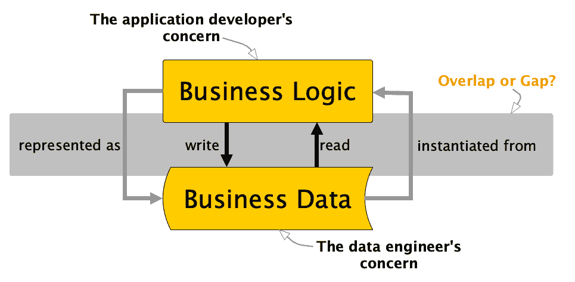
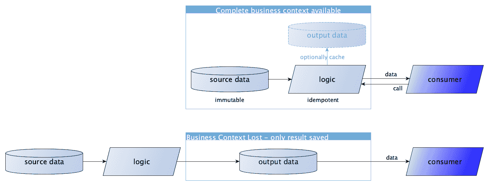
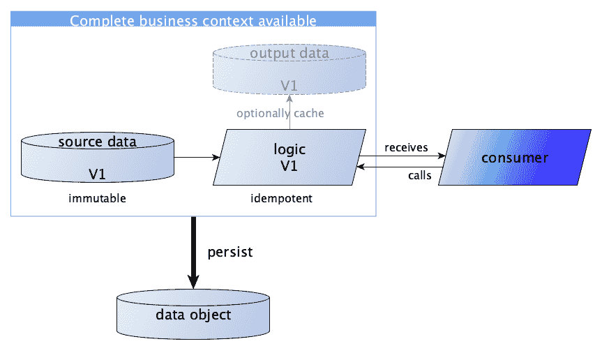
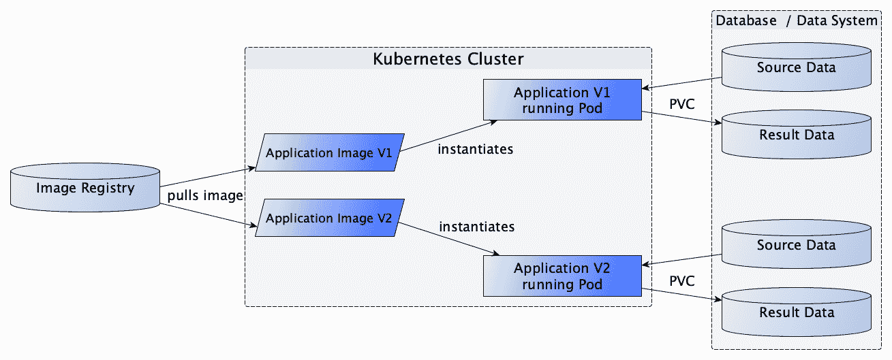
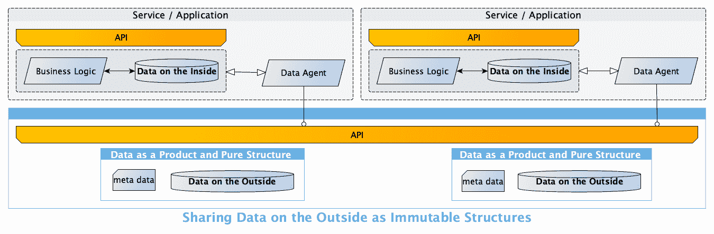

# 现代数据与应用工程打破业务语境

> [现代数据与应用工程打破业务语境的丧失](https://towardsdatascience.com/modern-data-and-application-engineering-breaks-the-loss-of-business-context-7d0bca755adb/)

数据与应用工程师的巨大任务——由 DALL-E 创建的图像

我之前写过关于重新定义当前数据工程学科的需求[重新定义当前数据工程学科](https://medium.com/towards-data-science/data-engineering-redefined-643249cbbadd)。我主要从组织角度来考虑，并描述了数据工程师应该和不应该承担的责任。

主要论点是业务逻辑应该是应用工程师（开发者）的关心点，而所有关于数据的问题应该是数据工程师的关心点。我提倡重新定义数据工程为“关于数据的移动、操作和管理的一切”。

谁关心数据与逻辑的交集？ – 作者提供的图片

现在，事实上，应用工程师创建的逻辑表示实际上也产生了数据。根据我们看待这个问题的角度，这意味着我们在这个数据与逻辑的交叉点上要么存在技术差距，要么重叠过多。

因此，让我们卷起袖子，共同承担维护逻辑与数据之间依赖关系的责任。

## 数据、信息和两者之间的逻辑究竟是什么？

让我们通过一些基本定义来更好地理解这种依赖关系以及我们如何可以保持它。

+   **数据**是信息的数字化表示。

+   **信息**是经过处理和赋予语境的数据，以提供意义。

+   **逻辑**本质上是概念性的，代表各种推理过程，如决策、回答和问题解决。

+   **应用**是使用编程语言实现的、人类定义逻辑的机器可执行、数字表示。

+   **编程语言**是设计成用计算机可以理解和执行应用的方式来表达人类逻辑的正式表示系统。

+   **机器学习（ML**）是通过逻辑（复杂的算法）从数据中推导信息和逻辑的过程。产生的逻辑可以保存在模型中。

+   **模型**是从机器学习中派生出的逻辑表示。模型可以在应用中使用，根据先前未见的数据输入进行智能预测或决策。在这种情况下，模型是逻辑的软件模块，这些逻辑无法通过编程语言轻松表达。

最后，我们可以得出结论，应用于源数据的逻辑会导致信息或其他（机器生成）逻辑。逻辑本身也可以被编码或表示为数据——这与信息数字化非常相似。

表示可以是编程语言、编译应用程序或可执行镜像（如 docker）、从机器学习（如 ONNX）生成的模型以及其他中间表示，如 Java 字节码（JVM）、LLVM 中间表示（IR）或.NET 通用中间语言（CIL）。

如果我们真正努力维护源数据与应用逻辑之间的关系，我们就可以通过重新执行该逻辑在任何时候重新创建派生信息。

现在这给我们带来了什么？

## 业务背景是数据洞察的关键

没有任何业务背景（或[元数据](https://en.wikipedia.org/wiki/Metadata)）的数据基本上是无价值的。你对模式和生产数据的逻辑了解得越少，从其中提取信息就越困难。

> [**数据赋予企业力量**](https://towardsdatascience.com/data-empowers-business-3120a6632081)

惜哉，我们常常将元数据视为次要的。尽管所需信息通常可在源应用程序中找到，但它很少与相关数据一起存储。尽管如此，我们知道，即使借助人工智能，仅从数据中重建业务背景也是极其具有挑战性和昂贵的。

### 为什么会丢失上下文？

那么为什么我们要丢弃上下文，而后来又不得不以更高的成本重建它呢？

记住，我不仅是在谈论通常被认为很重要的数据模式。这是关于信息创建的完整业务背景。这包括从可用来源（源数据或源应用程序本身、模式以及以数字化形式存在的逻辑）重新创建信息所需的一切，以及有助于理解意义和背景的信息（描述、关系、创建时间、数据所有者等）。

保持从逻辑中重建派生数据的能力的策略与函数式编程（FP）或面向数据编程（DOP）的核心原则相似。这些原则建议我们将逻辑与数据分离，并允许我们透明地决定是否保留逻辑和源数据，或者为了优化目的也缓存该逻辑的结果。两种方式在概念上是相同的，只要逻辑（函数）是[幂等的](https://en.wikipedia.org/wiki/Idempotence)且源数据是[不可变的](https://www.cidrdb.org/cidr2015/Papers/CIDR15_Paper16.pdf)。

保留或丢失业务背景——图片由作者提供

现在，我不想为或反对使用函数式编程语言增加论据。虽然函数式编程在当今越来越受欢迎，但据 2023 年报道，函数式编程语言总共占不到 5%的份额（https://surferjeff.medium.com/why-functional-programming-languages-will-never-be-mainstream-e1b5a8c9e4d8）。

可能这就是为什么，在企业层面，我们仍然主要只缓存结果数据，从而失去了源应用程序的业务上下文。

这实际上是一种令人遗憾的做法，数据和应用程序工程迫切需要解决这个问题。

如果我们的数据和应用程序架构基于以下原则，那么在数据在企业中流动时，我们有很大的机会保持业务的相关性。

## 保存和版本控制应用于源数据的所有逻辑

逻辑**和**数据作为对象版本化和持久化 - 作者图片

### 幂等性

参考函数式编程原则，我们企业架构中的应用程序可以也应该像幂等函数一样行动。

当多次使用相同的输入调用这些函数时，它们会产生与只调用一次完全相同的输出。换句话说，执行这样的应用程序多次不会改变结果，除了初始应用之外。

然而，在应用程序内部（在微观层面），数据的内部处理可以非常广泛，只要这些变化不影响应用程序的外部输出或可观察的副作用（在宏观层面）。

这种内部处理可能包括本地数据操作、临时计算、中间状态变化或缓存。

应用程序的内部工作方式甚至可以在每次处理数据时有所不同，只要最终输出对于相同的输入保持一致。

我们真正需要避免的是全局状态变化，这可能导致使用相同输入的重复调用产生不同的输出。

### 将逻辑视为数据

我们的应用程序表示目前由应用程序工程师管理。他们在代码库（如 GIT）中存储源代码，以及自从 DevOps 出现以来所需的一切，以生成可执行代码。这当然是一个好习惯，但实际应用于特定数据版本的应用程序逻辑关系并没有由应用程序工程管理。

我们目前还没有一个很好的系统来管理和存储应用程序逻辑与数据之间的动态关系，就像我们对待数据本身那样严格。

数字表示从数据开始，而不是逻辑。逻辑被编码在编程语言的源代码中，编译成机器可执行的应用程序（包含机器可执行字节码的文件）。对于操作系统来说，它只是数据，直到一个特殊的可执行文件作为程序启动。

操作系统可以轻松启动任何应用程序版本来处理特定版本的数据。然而，它也没有内置的功能来跟踪哪个应用程序版本处理了哪个数据版本。

我们迫切需要在企业级别上建立这样的系统。它需要的紧迫性就像数据库曾经被需要来管理数据一样。

由于应用程序逻辑的表示也是数据，我相信这两个工程学科都需要承担起责任。

### 主动维护逻辑与数据之间的关系

现今在系统中管理逻辑及其相关数据主要有两种主要方法。要么是像应用工程中那样以**应用为中心**，要么是像数据工程中那样以**数据为中心**。

* * *

企业今天主要实践的是**应用为中心**的逻辑管理类型。

应用程序主要通过应用打包系统安装在操作系统上。这些系统允许从中央仓库拉取应用程序版本，并处理所有必要的依赖项。

默认情况下，众所周知的 APT（高级打包工具）不支持同时安装一个应用程序的多个版本。它被设计用来管理和安装单个版本。

自从容器技术在 Linux 上出现以来，应用工程增强了该系统，以更好地管理隔离环境中的应用程序。

这使我们能够并排安装和管理同一应用程序的几个版本。

例如，在 Kubernetes 集群中，可执行的 Docker 镜像在名为 registry 的镜像数据库中管理。集群动态地安装和运行任何特定版本的应用程序（如果你愿意，可以称为微服务），该版本在隔离的容器中请求。然后使用持久卷声明（PVC）从数据库或数据系统中读取和写入数据。

同一个应用以不同的版本在隔离的容器中并发运行 – 图片由作者提供

虽然我们在管理多个应用程序版本并发执行方面看到了进步，但数据与应用逻辑的动态关系仍然被忽视。没有标准的方式来管理这种关系随时间的变化。

* * *

Apache Spark 作为一个典型的**以数据为中心**的系统，将逻辑视为紧密耦合到其源数据的函数。弹性分布式数据集（RDD）的核心抽象定义了这样一个数据对象为一个具有预定义的低级函数（map、reduce/aggregate、filter、join 等）的抽象类，这些函数可以按顺序应用于源数据。

应用到源数据的函数链被追踪为一个有向无环图（DAG）。因此，Spark 中的应用程序是应用于源数据的函数链的实例化。因此，Spark 在 RDD 中正确地管理了数据和逻辑的关系。

然而，由于 RDDs 和 Spark 架构的特性，直接在应用程序之间传递 RDDs 是不可能的。RDD 追踪应用于源数据的逻辑谱系，但它是不持久的，并且仅限于应用程序本地，不能传输到另一个 Spark 应用程序。每次您从 RDD 持久化数据以与其他应用程序交换时，应用逻辑的上下文再次被剥离。

* * *

不幸的是，这两个工程学科都在各自煮自己的汤。一方面，我们有应用程序工程师维护的文件系统、代码存储库和镜像注册表。另一方面，我们有数据工程师维护的数据库或数据平台，允许应用逻辑被应用。

不幸的是，没有任何单一学科发明了一个良好的通用系统来管理数据和应用逻辑的组合。一旦逻辑被应用，并且需要持久化结果数据，这种关系在很大程度上就会丢失。

我已经听到你尖叫着说我们有一个处理这个问题的原则。是的，我们有面向对象编程（OOP），它教会我们将逻辑和数据捆绑到对象中。这是真的，但不幸的是，这也是 OOP 未能完全实现的事实。

在这里也没有提供在完全不同的环境中运行的应用程序之间持久化和交换对象的良好解决方案。由于这种限制，面向对象的数据库管理系统（OODBMS）从未获得认可。

> 我认为数据和应用工程必须就一种方式达成一致，以保持数据和应用逻辑作为一个对象，但允许这两部分独立发展。

只需想象 RDDs（弹性分布式数据集）作为一个可持久化的抽象，它追踪任意复杂逻辑的谱系，并且可以在系统边界之间交换应用程序。

我在我的文章["将您的数据作为产品交付，而不是作为应用程序"](https://medium.com/towards-data-science/deliver-your-data-as-a-product-but-not-as-an-application-99c4af23c0fb)中将这样的对象描述为抽象“使用*纯数据结构*的数据作为产品”。

注意，这个概念与完全基于事件的数据处理不同。基于事件的处理系统是所有参与应用**仅**以事件形式进行通信和处理的架构。事件是系统内发生的重要变化或动作的记录，与下一章中描述的数据原子相当。

这些系统通常设计为通过响应事件来一致地处理实时数据流。然而，在企业层面的处理通常需要更多不同的方式来转换和管理数据。特别是遗留应用可能使用完全不同的处理风格，并且不能直接参与基于事件的处理。

但正如我们所看到的，只要在宏观层面保持幂等性，应用就可以以非常不同的方式本地行动。

如果我们坚持这些原则，我们可以在宏观（企业）层面整合任何类型的应用，并防止业务上下文丢失。我们不必强迫应用只处理近实时数据原子（事件）。应用可以根据需要管理其内部数据（内部数据），并且完全独立于与其他应用交换的数据（外部数据）。

应用可以通过管理内部数据（内部数据）与共享数据完全不同，以保持宏观层面的幂等性 - 图片由作者提供

## 以原子形式创建源数据并保持其不可变性

现在，如果我们能够无缝跟踪和管理企业中所有应用的数据血缘，我们需要特别关注源数据。

源数据是特殊的，因为它包含了原始信息，除了最初编码成数据之外，尚未被应用逻辑进一步转换。

这是**新**信息，不能通过应用逻辑对现有数据进行获取。相反，它必须首先由公司创建、测量、观察或以其他方式记录，并编码成数据。

如果我们将源应用创建的原始信息以**不可变**和**原子**的形式保存，我们就能使数据以最紧凑和损失最小的形式存储，以便随后以最灵活的方式使用。

### 不可变性

不可变性强制对任何源数据更新进行版本控制，而不是直接覆盖数据。这使得我们能够完全保留所有曾经用于应用转换逻辑的数据。

数据不可变性指的是一旦创建，数据就不能在以后被更改的概念。

这意味着一旦创建，我们就不能改变任何东西了吗？

不，这完全不切实际。我们不是修改现有的数据结构，而是创建新的结构，这些结构可以轻松地进行版本控制。

但企业中的大部分信息不是源自原始信息，而是作为新信息被创建的吗？

是的，正如讨论的那样，这种推导最好通过应用于不可变源数据的版本链来追踪和管理。

除了不可变数据的核心好处之外，它还提供了其他好处：

• **可预测性**

由于数据不会改变，因此操作不可变数据的应用程序更容易理解，其影响可以更好地预测。

• **并发**

不可变数据结构天生是线程安全的。这使并发处理成为可能，而无需管理共享可变状态带来的复杂性。

• **调试**

使用不可变数据，系统在任何时间点的状态是固定的。这极大地简化了调试过程。

但让我再次向您保证：我们不必将所有数据库和数据存储转换为不可变性。例如，一个应用程序使用传统的关系数据库系统来管理其本地状态是完全可行的。

在宏观（企业）层面，需要保持不变的是公开共享的原始信息。

### 原子性

以原子形式存储数据是源数据的最佳模型，因为它捕捉了组织随着时间的推移所发生或得知的每一个细节。

如我在[对数据建模的新视角](https://medium.com/@bernd.wessely/a-fresh-view-on-data-modeling-b48e90341399)一文中所述，任何其他数据模型都可以通过应用适当的转换逻辑从原子数据中推导出来。在数据网格的概念描述中，数据作为产品通常被分类为源对齐和消费者对齐。这是对从原子形式源数据中可以推导出的许多可能中间数据模型的一种过于粗略的分类。

由于源数据无法通过保存的逻辑重新创建，因此持久保存这些数据非常重要。因此，最好为它设置一个适当的备份流程。

如果我们决定持久化（或缓存）特定的派生数据，我们就能使用这个作为专门的物理数据模型来进一步优化基于该数据的逻辑。在这个设置中，任何派生数据模型都可以被视为逻辑的长期缓存。

查阅我关于[现代企业数据建模](https://medium.com/towards-data-science/modern-enterprise-data-modeling-a3d61f7c0c25)的文章，了解更多关于如何将复杂信息编码为时间顺序数据原子以及如何在企业层面组织数据治理的细节。应用于编码信息的最小模式允许极其灵活的使用，与完全无结构化数据相当。然而，与无结构化变体相比，它允许数据以更高的效率进行处理。

这种最大灵活性对于源数据尤为重要，因为我们尚不知道它将在企业中如何进一步转换和使用。

通过遵循所描述的原则，我们可以在宏观或企业层面整合任何类型的应用，并打破业务上下文丢失的问题。

* * *

如果这两个工程学科就一个在数据和逻辑交叉处起作用的共同系统达成一致，我们就能更好地在整个企业中维护业务意义。

+   当消费者及其个别需求尚不清楚时，应用工程以原子形式提供源数据。

+   数据和应用工程通过一个共同系统就数据与逻辑关系的管理达成一致。

+   数据工程不实现任何业务逻辑，而是将此留给应用工程师。

+   数据工程抽象掉了数据流和批量处理之间的低级差异，以及数据的一致性（最终一致性和即时一致性）。

* * *

这种在企业管理数据中的现代方式，是我所说的**通用数据供应**的支柱。

> [**迈向通用数据供应**](https://medium.com/@bernd.wessely/towards-universal-data-supply-98ff53158183)
