# 我从 Power BI 转向 Looker 的经历（作为一名高级数据分析师）

> [`towardsdatascience.com/my-experience-switching-from-power-bi-to-looker-as-a-senior-data-analyst-d244cfe62613/`](https://towardsdatascience.com/my-experience-switching-from-power-bi-to-looker-as-a-senior-data-analyst-d244cfe62613/)
> 
> ***⚠️ 注意：** 这篇文章是在比较 **Power BI** 和 **Looker**（不是 Looker Studio）。*


从 Power BI 转向 Looker（来源：自产内容）

当我开始在我当前的工作中使用 Looker 时，我对网上关于它的有用信息如此之少感到惊讶。

搜索“Looker”，你通常会找到关于 Looker Studio 的内容，这是一个完全不同的工具。

> 我无法找到一篇真实且实用的关于 Power BI 与 Looker（不是 Looker Studio）的比较评论，所以我决定基于我对两者的经验创建一篇。

在之前在 [Zensai](https://zensai.com/)（原名 LMS365）的职位中使用 Power BI 的经验，以及在我当前在 [Trustpilot](https://business.trustpilot.com/jobs) 的职位中转向 Looker，我想记录一些你在未来可能自己进行这种转变时需要了解的重要技术细节。

在这篇文章中，我将：

+   讨论 Power BI 和 Looker 之间的主要区别，

+   讨论每个工具的优缺点，

+   分享两个平台之间平稳过渡的技巧，以减少痛苦，

+   突出 Looker 的我喜欢的独特功能，

+   并提及我是否更喜欢 Power BI 或 Looker 作为一名高级数据分析师。

* * *

## **Looker 的集成表格视图在可视化下节省时间**。

> *(Looker **1:0** Power BI)*

我非常欣赏 Looker 中的一个功能，那就是在探索阶段在你的可视化下方显示的集成数据表。

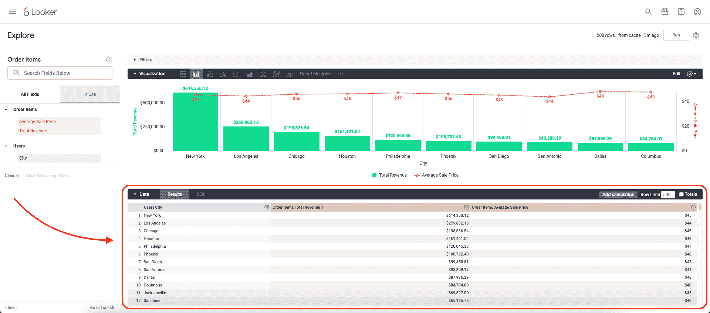

数据表始终位于你的可视化下方（来源：自产内容）

我无法计算有多少次在构建图表、调试和检查列时，不得不在 Power BI 的报告视图选项卡和数据视图选项卡之间来回切换。

> 在 Power BI 中，你可以将可视化显示为表格 – 你点击三个点并选择“显示为表格”。但这里有个问题：表格并不像你所说的那样完全交互式。你不能编辑它，旋转或像在 Looker 中那样自定义它。它更像是一个快照而不是一个工具。如果你想进行更改，你必须进入 Power Query。你无法在编辑时看到可视化 – 这是一个断开的过程。

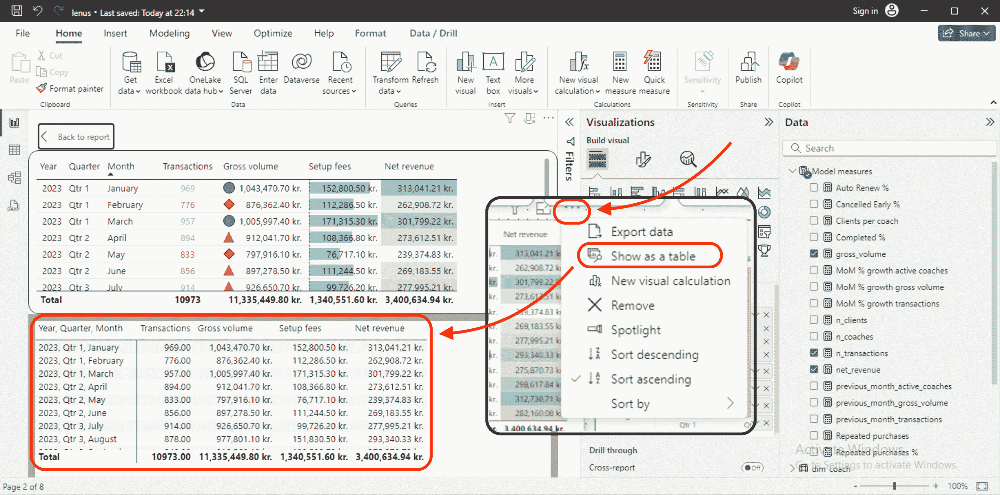

Power BI 中的表格不像 Looker 那样可自定义（旋转、计算新列、度量、维度、隐藏列等。）（来源：本人制作）

在 Looker 中，始终在可视化下方有一个可自定义的表格视图，这可以节省大量时间，并且确实是一个你很快就会习惯的实用功能。

## **Looker 表达式缺乏 DAX 公式的强大功能和功能。**

> *(Looker **1:1** Power BI)*

然而，我不喜欢 Looker 表达式。

与 [DAX（数据分析表达式）](https://learn.microsoft.com/en-us/dax/) 相比，它们在函数数量方面的发展程度并不相同。

DAX 提供了一个丰富的函数库，用于复杂计算和时间智能，这对于高级分析至关重要。

我在 Power BI 中最喜欢的 DAX 函数无疑是 [=CALCULATE 函数](https://learn.microsoft.com/en-us/dax/calculate-function-dax)。`CALCULATE` 改变筛选条件以给出你想要的结果——它对于基于时间或特定类别的计算等非常有用：

```py
Previous_Month_Gross_Volume = 
CALCULATE(
    [gross_volume], 
    DATEADD(dim_date[Date], -1, MONTH),
    dim_product[Category] = "Electronics",
    dim_region[Region] = "North America"
)
```

虽然 Looker 提供了一系列用于数据操作的表达式，它们称之为 [Looker 表达式](https://cloud.google.com/looker/docs/functions-and-operators)（有时称为 Lexp），但它们并不匹配 Power BI 中 DAX 的深度和多功能性。

> 与 DAX 相比，Looker 的表达式被采用得较少，在线论坛、文档和教育资源中的存在感也较小。这也因为 DAX 还用于 Analysis Services 和 Excel 中的 Power Pivot。

我还注意到，生成式 AI 模型有时会难以处理 Looker 表达式的精确结构/公式，因为它们是在 DAX 之后引入的——即使为模型设置了正确的上下文和额外的参数。

> 还有一点需要记住的是，Looker 表达式与 [LookML 语言](https://cloud.google.com/looker/docs/write-lookml-intro) 并不相同——这可能是某些人产生混淆的地方。
> 
> Looker 表达式用于执行计算，并使用你在 LookML 中定义的字段。

例如，当你将一个字段添加到表达式中时，**Looker 使用该字段的 LookML 标识符**，其形式类似于 `${view_name.field_name}`。

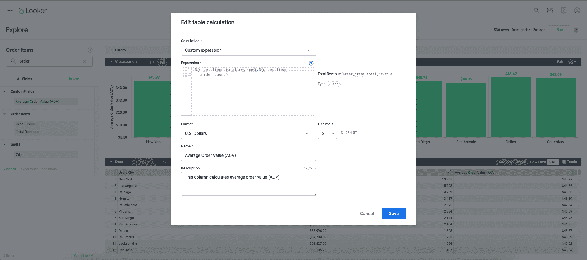

在 Looker 中创建新的计算列（来源：本人制作）

Looker 表达式用于创建：

+   自定义维度

+   自定义计算列

+   自定义度量

+   并自定义过滤

…**在** Looker 探索界面中。

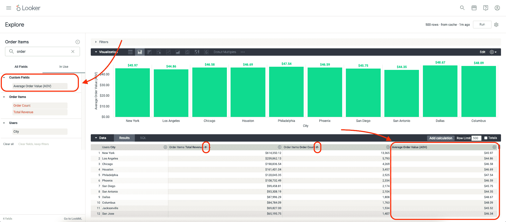

计算列可以通过仅使用数据表中存在的字段来创建——稍后你可以隐藏它们，如果你不想在图表上显示它们（来源：本生产）

这看起来很简单——但如果你结合了***多个***维度、***度量值***、***计算列***和***数据透视***，你最终可以得到一个非常强大的数据表。

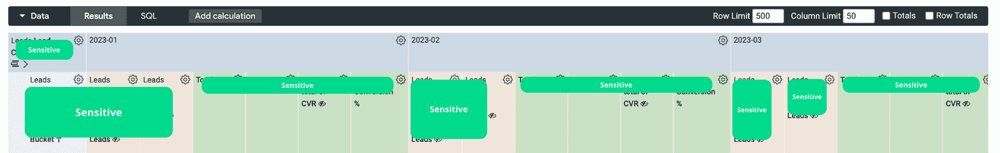

使用多个维度、度量值和计算列创建队列时的转置数据表（来源：本生产）

## **Power BI 中的 Power Query 编辑器使数据操作变得简单易行。**

> *(Looker **1:2** Power BI)*

Power BI 有一个 Power Query 编辑器，类似于 Excel 中的编辑器。

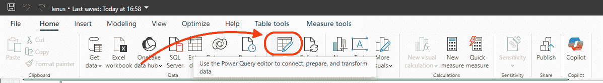

在 Power BI 中启动 Power Query 编辑器（来源：本生产）

您可以通过几点击操作创建计算列、删除首行、将首行设置为标题，以及更多功能***只需几点击即可***。

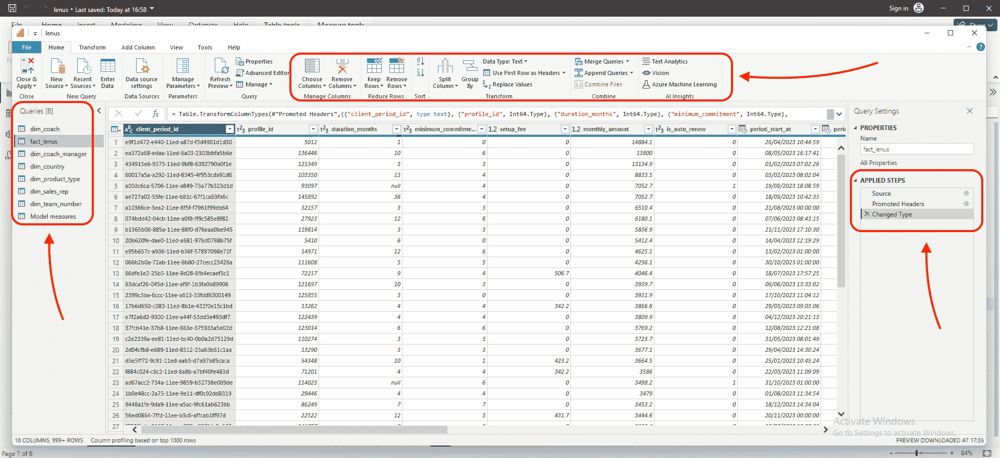

Power BI 中的 Power Query 编辑器（来源：本生产）

这个 Power Query 编辑器在 Looker 中不存在——尽管你可以在 Looker 的 Explore 中非常容易地创建自定义度量值、自定义维度和自定义计算列。

然而，对于 Power BI/Excel 中其他有用的转换，你需要编写 LookML 代码。

正如你将在本文后面发现的那样，这也是 Looker 的一个大优点，因为数据是集中化的。

## **Looker 仅基于 Web。**

> *(Looker **1:3** Power BI)*

我喜欢 Power BI 作为一个桌面应用程序，这让我可以使用***离线***和***本地***数据集工作，并利用我本地机器的处理能力！

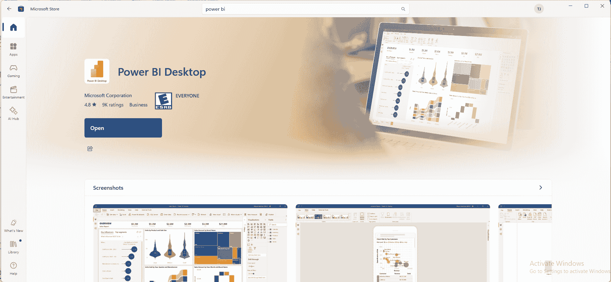

Power BI 是一个桌面应用程序，而 Looker 不是（来源：本生产）

Looker 不是一个桌面应用程序——它仅基于 Web。如果你更喜欢 Mac，基于 Web 是一个优势——特别是考虑到 Power BI 的桌面应用程序仅适用于 Windows。

> 我必须说，我喜欢 Looker 的一点是，您可以使用浏览器上的前后按钮轻松地导航到您的更改，无论是向前还是向后。这是因为 Looker 探索中的每个更改都会创建一个新的唯一 URL 链接。当您修改查询或调整设置时，URL 会更新以反映您探索的当前状态。这与 Looker 的缓存功能相辅相成，允许您再次访问查询和视觉元素，而无需再次运行它们，因此它们可以即时加载（默认缓存保留策略为 [一小时](https://cloud.google.com/looker/docs/caching-and-datagroups#:~:text=Warning%3A%20For%20queries%20run%20on,retention%20policy%20is%20one%20hour.)）。

虽然 ***Power BI 服务*** – 用户在此处上传和编辑报告、协作和创建应用程序，也是基于 Web 的，但 Looker 的完全基于浏览器的方法完全消除了操作系统限制。

## **Power BI 简化了星型模式建模，而 Looker 需要学习 LookML**。

> *(Looker **1:4** Power BI)*

在 Power BI 的 ***建模选项卡*** 中建模和创建您的星型模式非常简单。

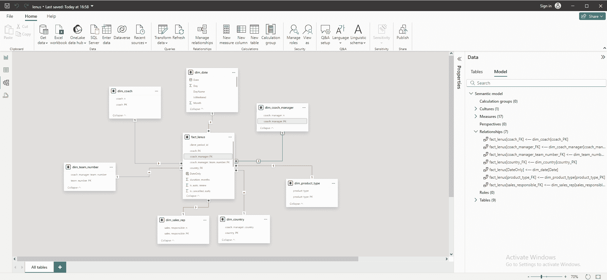

使用建模选项卡在 Power BI 中创建的星型模式（来源：自产）

您可以享受一个非常大的画布，其中包含所有导入的表，并可以使用外键（FK）和主键（PK）通过事实表和您的维度表之间的多对一关系来链接您的表。

> 例如，进入您业务的潜在客户可以存储在事实表中，而地区、联系表单、潜在客户来源和渠道则是具有唯一值的单独维度表。

这有助于您快速且高效地查询事实表 ***非常*** ***快速*** 和 ***高效***。此外，使用 Power BI 的 ***点击选择*** 功能调整关系非常容易。

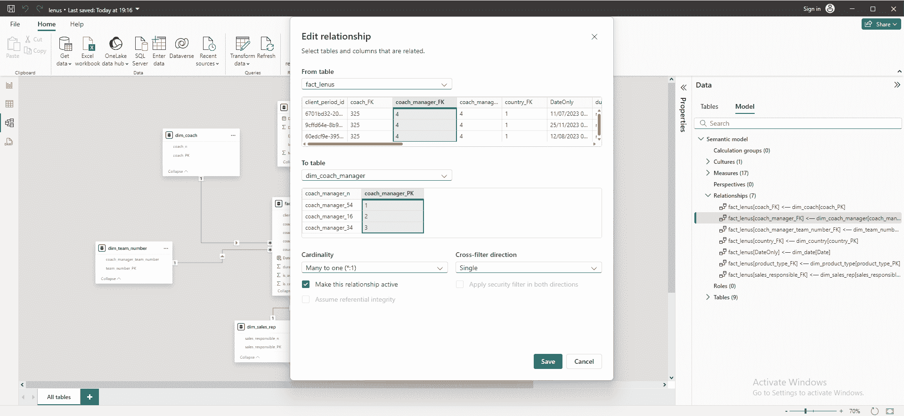

通过双击关系线，您可以点击几下调整您的关系（来源：自产）

> 在 Looker 中，这不像点击并使用几点击建立关系那样简单。

您需要学习 LookML 来在探索中连接您不同的视图（= 视图反映了从您的数据仓库加载到 Looker 的表）并使用 LookML 语言定义您的关系和键。

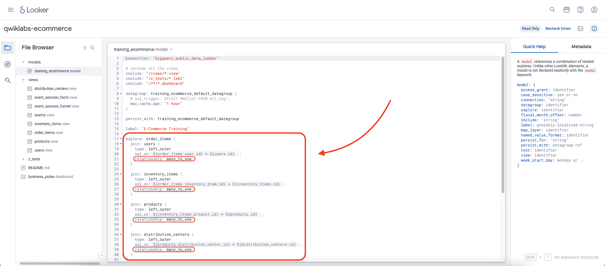

Looker 中的星型模式使用 LookML 代码实现（来源：自产）

## Power BI 在图表选项方面优于 Looker。

> *(Looker **1:5** Power BI)*

使用 Power BI，您可以选择更多默认图表。

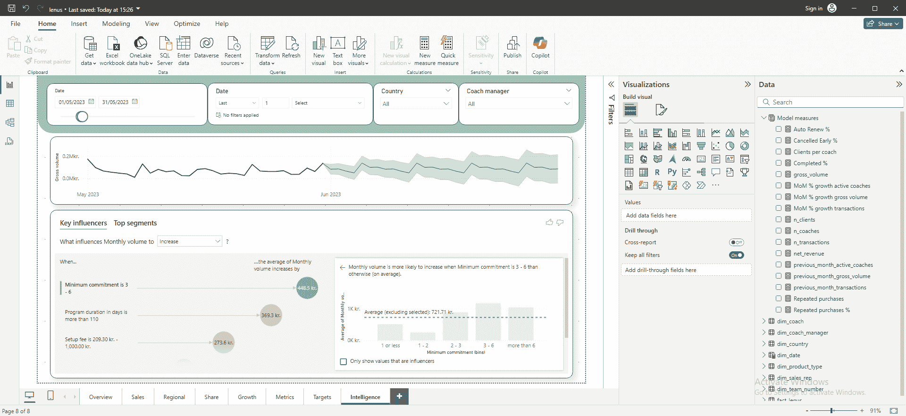

Power BI 中的智能图表，包括三指数平滑预测（Holt-Winters）和关键影响因素图表（来源：自产）

我确实很怀念那个基本上一眼就能构建一个简单回归模型的关键影响因素图表！

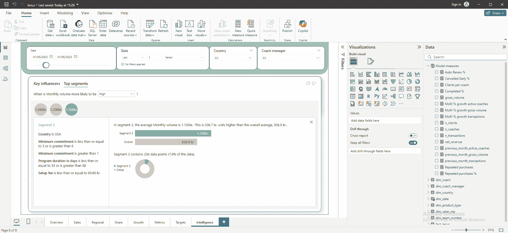

在 Power BI 中使用“顶级段”可视化进行简单的分段（来源：自产）

然而，好消息是 Looker 也有图表市场，尽管许多**不是官方支持的 Google 产品**。

## **Looker 基本上是一个大型的透明 SQL 运行机。**

> *(Looker **2:5** Power BI)*

我喜欢 Looker 总是运行并且能轻松地显示你可视化下创建表的 BQ SQL 查询，然后使用它来创建你上面的可视化（尽管如果没有妥善处理，运行这些查询可能会变得很昂贵）。

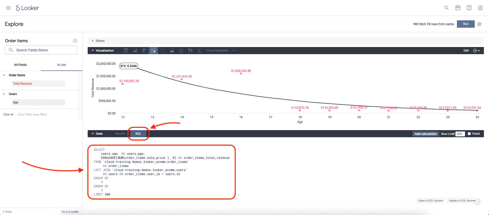

SQL 选项卡显示在你的可视化下方直接运行的数据仓库查询（来源：自产）

> 你可以非常容易地在 Looker 中点击 SQL 选项卡，并看到针对你的数据仓库运行的精确查询，这对于调试和查看用于构建可视化的数据仓库中的哪些表非常有帮助。
> 
> 我的调试技巧是复制你视觉的 SQL 查询，并使用生成式 AI（如 Claude 或 ChatGPT）来询问潜在的问题。

在 Power BI 中，访问底层查询需要额外的步骤，例如使用***性能分析器***或像***DAX Studio***这样的外部工具。

## **在 Looker 中格式化图表有点繁琐。**

> *(Looker **2:6** Power BI)*

你的图表格式化选项不如 Power BI 强大。

> 微软在 Power BI 中创建的图表的定制方面一直在提升，当你构建图表时，几乎可以为你想到的任何事情设置很多不同的**点击并选择**下拉菜单。

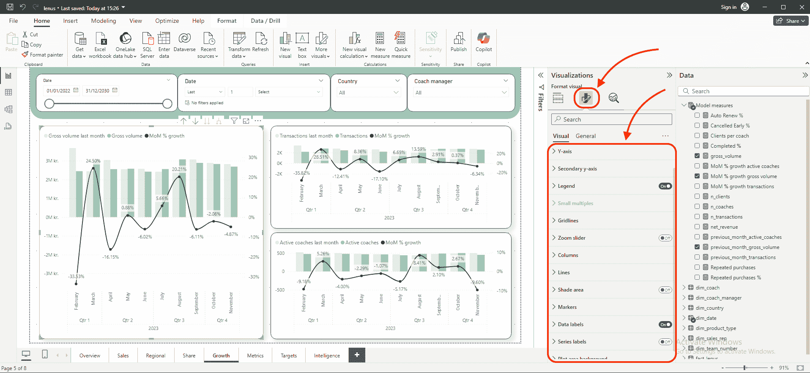

在 Power BI 中编辑任何图表都非常简单，只需点击并选择下拉菜单即可（来源：自产）

我并不是说你在 Power BI 中能做的，在 Looker 中做不到——而是在 Power BI 中，条件格式化、目标、目标设定、坐标轴、字体、标题以及任何视觉的所有方面都可以通过简单的下拉菜单进行调整。

你还可以调整 Power BI 可视化中**特定度量**的外观，而无需更改整个图表或表格的外观——这允许你仅对关注的度量进行精确编辑。

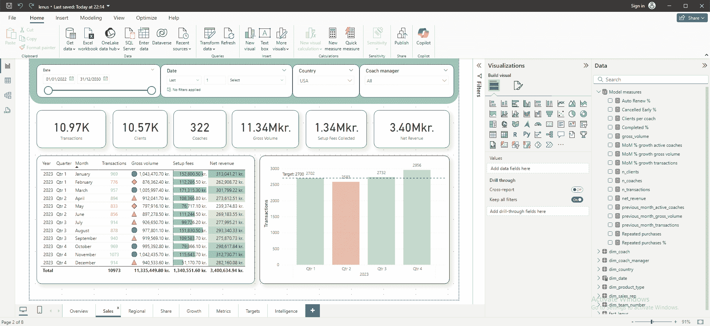

在 Power BI 中，可以通过下拉菜单简单地编辑条件格式化、目标和目标设置（来源：自产生产）

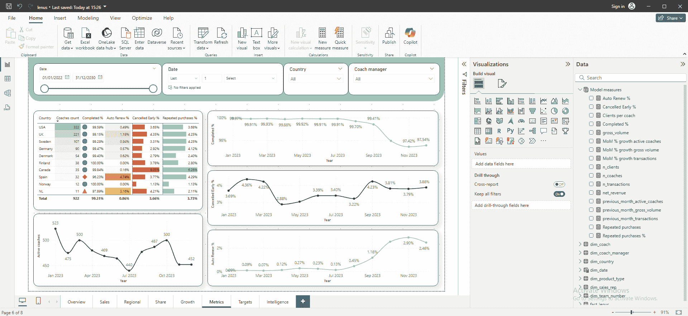

在 Power BI 中，可以轻松编辑所有类型的条件格式化、平滑线条、网格线，如虚线、点或实线（来源：自产生产）

对于 Looker，我不得不写下以下 JSON 代码片段`{"backgroundColor": "#code"}`来更改图表的背景颜色——这随后也导致了在 Looker 中显示的此通知：

> *"⚠️ 图表配置编辑器中已进行更改。编辑可视化设置可能会导致意外行为。"*

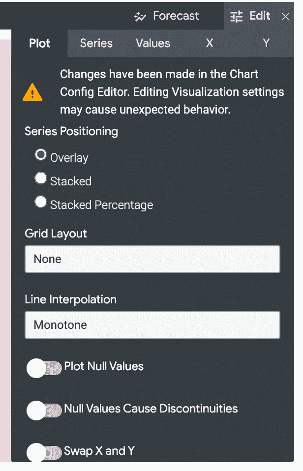

在 Looker 中使用 json 代码片段调整图表背景时出现错误（来源：自产生产）

## **Looker 的 git 版本控制是内置的，并且易于使用。**

> *(Looker **3:6** Power BI)*

我非常喜欢 Looker 内置的版本控制，因为它非常直观且易于使用——你不需要离开 Looker。

如果你决定建模、编辑或创建新的维度和度量，你首先需要开启**开发模式** – 这将允许你设置自己的开发区域，这样你不会影响到生产环境中的任何内容。

然后，你可以在 Looker 中直接创建自己的个人（或共享）分支，并在此处编写 LookML 代码。

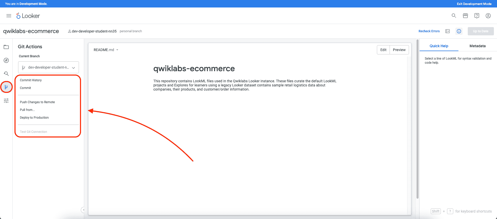

Looker 中的 Git 版本控制是内置的，并且易于使用（来源：自产生产）

之后，你可以简单地将你的分支发布到远程仓库（GitHub）中，然后创建合并你的新分支到主分支的 PR。

## **使用 LookML 进行数据建模确保了组织内度量值和维度的统一。**

> *(Looker **4:6** Power BI)*

Looker 非常出色，我喜欢它使用专有的 LookML 语言进行集中式数据建模的方法。

> LookML 代码允许您在组织内部署中保持定义的一致性。在实践中，这意味着因为我们所有人都是作为数据分析师/科学家用一种语言编写一切，我们最终都会使用由我们的团队定义和批准的相同度量值和维度。简单来说，Looker 允许您在数据仓库中预建模数据的基础上构建内容。

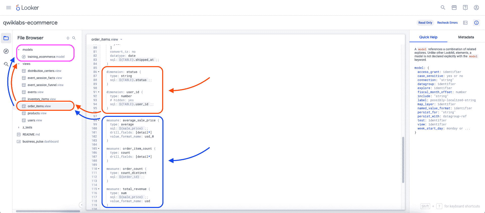

在您的视图中（=表）中定义的维度和度量值使用 LookML，这确保了在不同模型中只有一个定义（来源：自产）

您的平均员工无法定义内部的数据模型，但将能够自由地使用这些数据。这旨在创建组织内每个人都想要的单一事实来源。

> 技术上，当您更改业务中指标的定义时，您应该能够在一个地方编辑您的 LookML，并且使用该指标的所有探索、查看和仪表板都将自动更新。

我还喜欢 Looker 的地方是，当您创建视图时，可以使用 LookML 中的 `sql:` 参数进行 SQL 编辑（视图反映了从您的数据仓库加载到 Looker 的表）。

## **Looker 的工作流程促进了在构建仪表板之前的数据探索。**

> *(Looker **5:6** Power BI)*

虽然比较不是一一对应的，Power BI 的开发流程阶段：

+   **报告 → 仪表板 → 应用**

…将与 Looker 的以下示例相似：

+   **探索 → Look → 仪表板。**

我发现 Looker 的方法更直观，因为它允许在构建仪表板之前更好地探索数据：

1.  在 Looker 中，您从 ***探索*** 开始，这允许使用临时查询进行交互式 EDA。

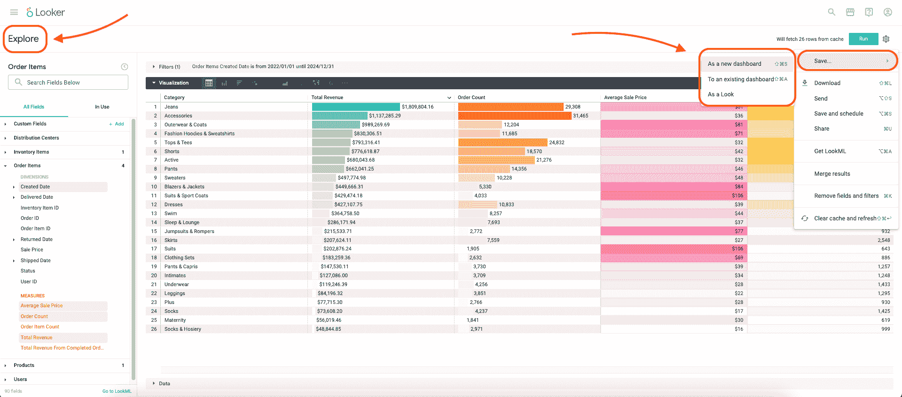

Looker 中的探索示例 – 在“探索”部分，您可以决定是否将您的视图保存为 Look 或直接保存到仪表板中（来源：自产）

1.  然后，您可以将使用这些探索构建的图表保存为 ***Look*** – 这些 ****是可重用的，并且可以将它们附加到任何仪表板。

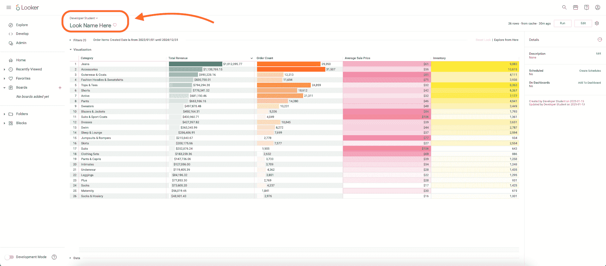

Looker 中的 Look 示例 – Look 是任何仪表板的基本构建块（来源：自产）

1.  这些 Look 包括图表，可以之后拼接到一起形成 ***仪表板***，以全面概述您的关键指标。

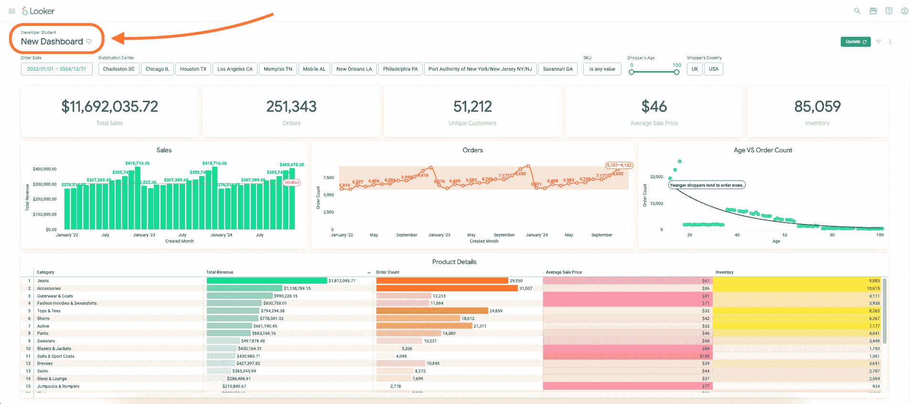

Looker 中的简单仪表板示例（来源：自产）

> 我非常喜欢 Looker 中的 Explorers，因为它们赋予组织中的任何人都深入数据的能力，而无需了解 SQL。当你作为一个 Looker 开发者准备 Explorers 以供使用时，它使得财务专家、市场营销经理、收入总监——实际上任何人——都可以与 Explorers 中的准备视图进行交互。他们不需要技术专业知识或 SQL 知识——他们可以提出自己的问题，并通过旋转、切片和过滤来获得即时答案。

在仪表板投入生产之前存在于 Looker 中的这一层，与 Power BI 相比，无疑是 Looker 的一个重大优势。

在 Power BI 中，虽然用户可以与报告交互并应用过滤器，但创建新的分析通常需要构建新的报告或拥有更高级的技能。

当使用 Looker 时，任何人的即席探索选项是组织拥有的非常有用的工具。

## Power BI 可以免费使用 - Looker 则不行。

> *(Looker **5:7** Power BI)*

尽管有一个名为 ***Looker Studio*** 的免费工具，但它与功能齐全的 ***Looker 企业 BI 平台*** 有显著差异——这使得学习 Looker 非常具有挑战性。

然而，我发现对于获得 Looker 的实际操作经验来说，[互动的 Google Cloud 实验室](https://www.cloudskillsboost.google/paths/28)（这些实验室允许你在模拟、时间有限的会话中尝试 Looker - 此外，完成这些实验室还可以获得 Google 徽章！）非常有帮助。

> Power BI Desktop 可以完全免费下载作为独立的桌面应用程序，而且其付费的企业版本与 Looker 相比更具成本效益，因为随着分析团队的扩大，Looker 的成本可能会螺旋式上升。

## Gartner 表示，Power BI 是当前的选择。

> *(Looker **5:8** Power BI)*

根据 Gartner 2024 年的[分析和商业智能平台魔力象限](https://www.gartner.com/doc/reprints?id=1-2HVUGEM6&ct=240620&st=sb)，微软的 Power BI 在其与微软生态系统的集成、功能性和性价比方面脱颖而出。

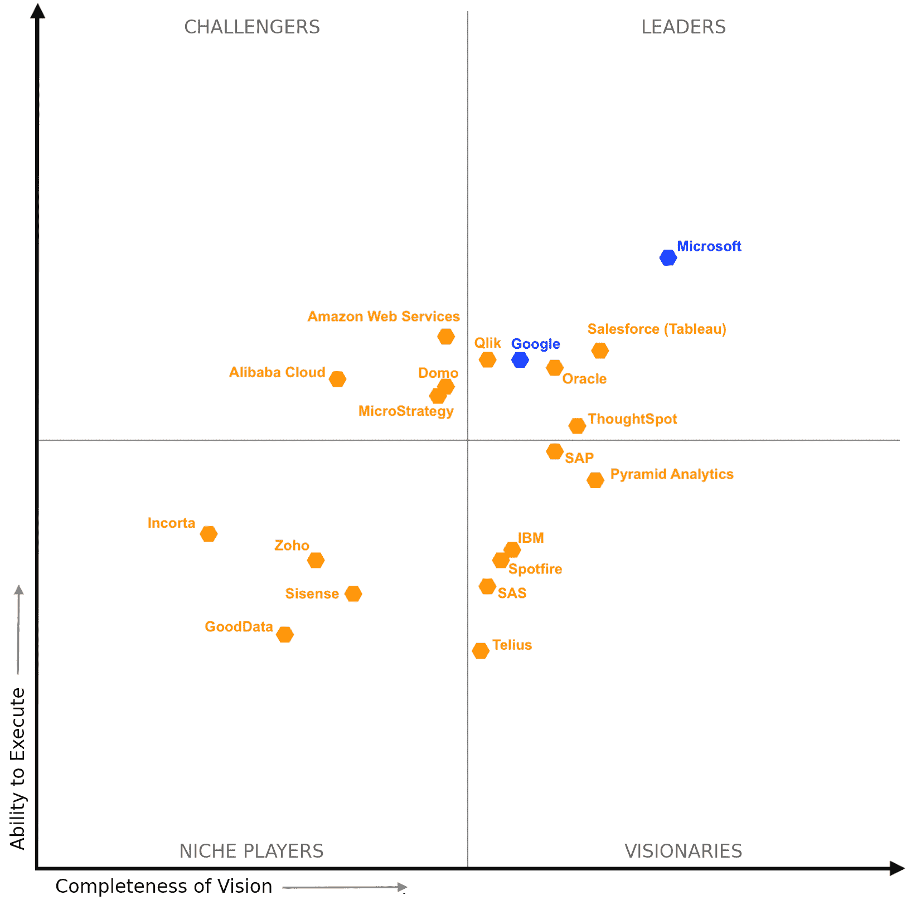

分析和商业智能平台魔力象限将微软评为领导者（来源：自产；评分来自 Gartner, Inc 2024；链接[这里](https://www.gartner.com/doc/reprints?id=1-2HVUGEM6&ct=240620&st=sb)）。

## 作为高级数据分析师，我的偏好。

我已经是一个重度的 Power BI 用户 4-5 年了，我认为它是一个出色的工具。它易于使用，功能丰富，非常适合想要立即开始构建的人。***在功能方面，我更喜欢 Power BI。***

但现在我已经过渡到 Looker 并花时间了解它是如何工作的，***我开始看到 Looker 有可能成为我未来将使用的 #1 BI 工具。***

如果我在功能上给 Power BI 打了更高的分，我为什么会这么说？***这一切都归结于公司的环境（正如 Gartner 研究也指出的一样）。***

如果更多公司开始采用 BQ 及其云市场份额增长，它会产生一种锁定效应。即使你换工作，你也可能会再次遇到 Looker。所以你的#1 BI 工具将由你决定（当然，也可以反过来适用于 Azure 和 PowerBI）。

在此之前，我曾在[Zensai](https://zensai.com/)（原名 LMS365）工作，在那里（https://cloud.google.com/customers/trustpilot）我们严重依赖 Microsoft 生态系统——甚至我们的产品都集成到了 Microsoft 中。但现在在[Trustpilot](https://business.trustpilot.com/jobs)工作，由于我们使用 Google Cloud Platform（GCP），Looker 更有意义——您可以在这里了解更多我们如何使用 GCP。

> 如果您的公司已经使用 GCP 和 BigQuery，Looker 可以完美集成。它简化了所有事情——从探索数据、创建图表到调试问题。它并不完美（我可以没有定制选项的缺乏、随机错误、基于 Web 的缓慢以及几乎需要为所有事情编写 LookML 代码的需求），但在 Google Cloud 环境中，我认为 Looker 是一个很好的选择，因为它变成了一种非常简单的工具，用于创建图表、在构建仪表板之前探索您的数据，以及快速调试——这些是我最看重的任何可视化工具的品质。

话虽如此，Power BI 和 Looker 之间的选择实际上取决于您的公司使用什么作为其 1) ***数据仓库***，2) ***人力资源***，3) ***前员工经验***，以及您的 4) ***财务资源***。

* * *

**PS：** 这里有一个决策框架表格，以清单格式引导您在***Power BI***和***Looker***之间做出选择。

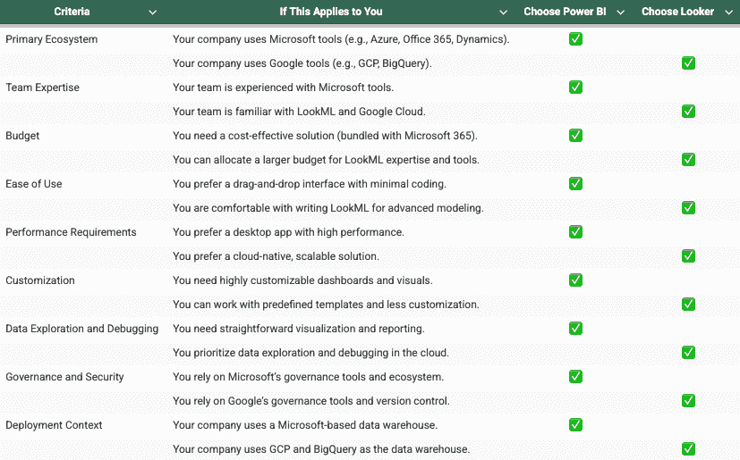

检查您是否应该在您的组织中获取 Power BI 或 Looker（来源：自产）

* * *

感谢阅读。如果您喜欢这篇评论或学到了新知识，请***鼓掌***并关注我获取更多内容。随时***联系***我，在[LinkedIn](https://www.linkedin.com/in/tomas-jancovic/)上找到我。
