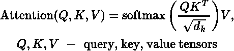
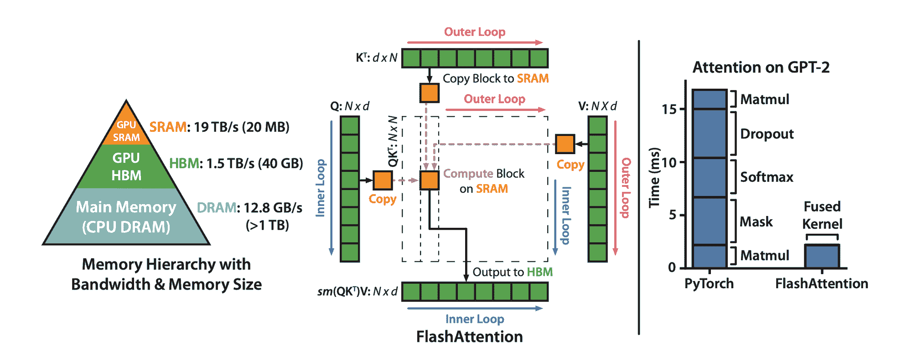
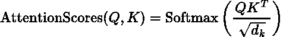
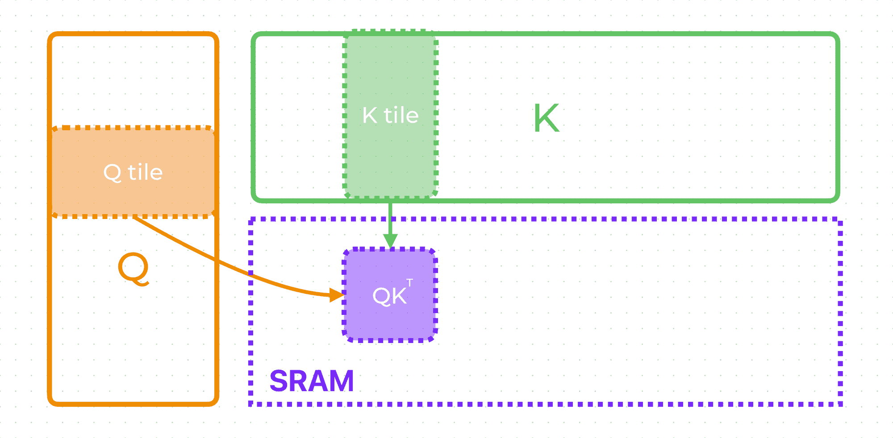
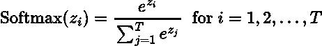
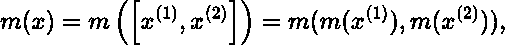
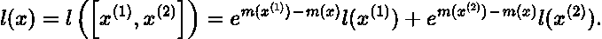
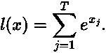
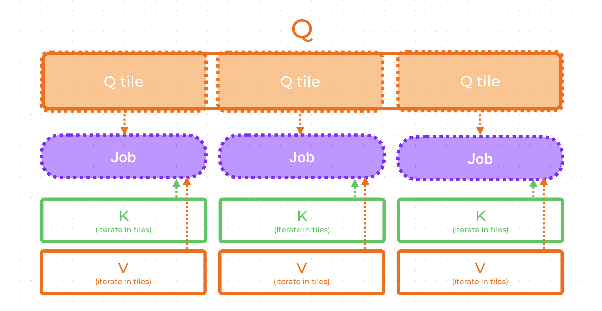
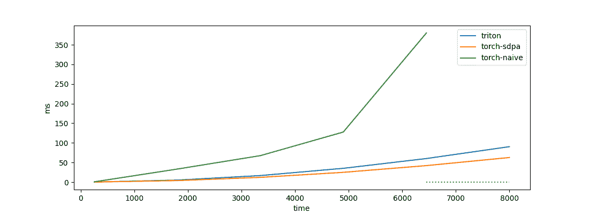

# 理解 Flash Attention：在 Triton 中从头编写算法

> [`towardsdatascience.com/understanding-flash-attention-writing-the-algorithm-from-scratch-in-triton-5609f0b143ea/`](https://towardsdatascience.com/understanding-flash-attention-writing-the-algorithm-from-scratch-in-triton-5609f0b143ea/)
> 
> 在[alexdremov.me](https://alexdremov.me/understanding-flash-attention-writing-the-algorithm-from-scratch-in-triton?utm_source=medium)免费阅读

Flash Attention 是一种革命性的技术，它显著加速了基于 Transformer 模型的注意力机制，处理速度比朴素方法快许多倍。通过巧妙地铺展数据和最小化内存传输，它解决了大型语言模型经常遇到的著名的 GPU 内存瓶颈问题。

在这篇文章中，我们将深入探讨 Flash Attention 如何利用高效的 *I/O-awareness* 来减少开销，然后通过在 Triton 中构建一个 **块稀疏注意力内核**更进一步。

> 💥 我将提供一个关于 Flash Attention 工作原理的简单解释。然后，我们将实现所解释的算法在 Triton 中！

## 什么是注意力？

注意力机制（或缩放点积注意力）是 Transformer 模型的一个核心元素，它是解决语言建模问题的主要架构。所有流行的模型，如 GPT、LLaMA 和 BERT，都依赖于注意力。

公式相当简单：

其余的都是历史。

尽管公式看起来很简单，但其计算涉及大张量的乘法和大量数据移动。考虑到这是 Transformer 架构的核心部分，优化算法极大地提高了模型的整体性能。

在朴素实现中，注意力机制需要**O(n²)**额外的内存和**O(n²)**的计算时间复杂度，其中**n**是序列长度。**这可真不少！**

## **Flash Attention**

### **核心思想**

Flash 注意力的主要思想可以用 [原始论文](https://arxiv.org/pdf/2205.14135?ref=alexdremov.me) 中的一个简单引言来概括：

> 我们认为，一个缺失的原则是使注意力算法具有 I/O-awareness – 考虑 GPU 内存层级之间的读写操作。

也就是说，现代 GPU 有几种类型的内存：

+   **SRAM** – 快速，片上，小

+   **HBM –** 比 SRAM 慢，容量大。这是我们通常所说的 GPU 内存。

查看下图中内存层次结构，以了解不同内存类型的带宽和大小差异。

Image from FlashAttention: Fast and Memory-Efficient Exact Attention with IO-Awareness by Tri Dao et al.

> 💡 为了进行计算，数据必须从 HBM 转移到 SRAM，而这种转移并非没有开销！

Flash Attention 算法提出了一种在**瓦片**中**计算注意力**的方法，而不需要显式地实现注意力分数张量：

> 💥 **不实现矩阵**意味着在任何给定的时间，矩阵在内存中都不以完整的形状存在。

很容易看出，这个矩阵需要**O(n²**)的内存来存储。对于长的序列，**那将是非常多的数据**！所以，如果我们能够避免显式地实现这个矩阵，我们就可以节省大量的内存。

然而，这个矩阵对于 transformer 训练是必要的，因为它是反向传播和梯度计算的一部分。作者提出，在反向传播期间重新计算这个矩阵（再次不进行显式实现）会更好。这不仅节省了大量内存，而且由于我们不需要在不同 GPU 内存类型之间传输这个巨大的矩阵，这也提供了巨大的速度提升。

总体而言，这种方法不仅通过考虑 GPU I/O 特性来加速计算，而且由于内存复杂度降低到**O(n**)，还允许处理巨大的序列长度。

### 瓦片注意力计算

最后要理解的是如何**在瓦片中**计算注意力。基本上，这意味着我们将通过处理传入的标记的小部分来计算整个序列的注意力。

好吧，很容易在瓦片中计算 **QK^T**。考虑到注意力维度不是很高，我们可以加载完整的矩阵行和列，并在瓦片中进行乘法运算。

> 😡 是的，如果我们想要有一个巨大的注意力维度，Flash Attention 没有算法修改将无法工作。

尺寸通常即使对于巨大的模型来说也非常小，因此这种限制是合理的。

Tiled QK^T | 作者图片

因此，我们在 SRAM 中计算了 **QK^T**。剩下要做的就是应用 softmax，乘以 **V**，然后就可以了！

那就是技巧所在。

问题在于 softmax 分母需要聚合序列长度以归一化分数，而我们无法访问整个长度，因为我们以瓦片的形式加载数据。

为了解决这个问题，我们可以实现一个连接的 softmax 算法。使用它，我们可以以“批量”模式计算 softmax：通过调整计算值与新的传入数据。

从原始文章的算法中提取，我们可以定义计算数据连接的 softmax 的规则。有两个向量 **x1** 和 **x2**，我们需要计算这些向量的连接 **[x1, x2]** 上的 softmax 分母 **l(x)**。如果向量的最大值是 **m(x)**，我们可以很容易地推导出连接的 softmax 分母：

最后的等价性可以很容易地验证为

因此，现在我们得到了我们想要的东西——我们可以按块计算 softmax，然后通过执行上述公式的重新归一化来计算全局 softmax。最后要做的就是将 **V** 张量的块纳入其中，并继续进行相同的重新归一化（因为矩阵乘法是一个线性操作）。

而且这一切都不需要将整个序列加载到内存中或具体化 **QK^T**！

> 💥 注意，我们仅在块中计算 **Softmax(QK^T)**，无需在任何时刻拥有整个矩阵。

此外，在实际的数值稳定性算法中，我们将计算的不是 **Softmax(x)**，而是 **Softmax(x – max(x))**。我们可以这样做，因为 softmax 对常数平移是不变的。

## Triton 实现

现在，我们可以在 Triton 中轻松实现概述的算法，Triton 是一个允许我们用 Python 的便捷性编写高效 GPU 内核的工具。

> 💡 想要了解更多关于 Triton 的信息，请查看他们的官方指南。
> 
> [**教程 – Triton 文档**](https://triton-lang.org/main/getting-started/tutorials/index.html?ref=alexdremov.me)

### 概述算法

第一步是决定我们将如何分配任务以及每个任务将加载什么数据。根据分块 softmax 算法，每个任务必须能够访问整个序列长度的 **K, V**。因此，每个任务将按块遍历 **K, V**。我们没有对处理 **Q** 块数量的算法限制。因此，每个任务将只加载一个 **Q** 块并与之一起工作——这样我们就能最大化任务并行性。

内核任务数据管理 | 作者图片

总结来说，每个任务将加载单个 **Q** 块，遍历 **K** 和 **V** 中的所有块，并存储与 **Q** 块对应的单个结果块。

### 内核

剩下的就是编写实际的代码了。让我们先关注核心部分，然后再添加 Triton 特定的模板。

下面是一个带有每行解释的 Triton 伪代码。

看到了吗？很简单！

重要的是，一旦我们理解了分块 softmax 的概念，编写这样的事情就变得非常简单。除此之外，从算法角度来看，没有其他复杂之处。

> 💥 通过实现 triton 优化，这个内核可以变得更快。然而，这超出了本文的范围。

这段伪代码与实际代码非常接近。您可以通过以下链接在我的 GitHub 上找到它。我添加的只是数据管理和 PyTorch 包装器。

> [**kernels/src/self_attention/kernel.py at main · alexdremov/kernels**](https://github.com/alexdremov/kernels/blob/main/src/self_attention/kernel.py)
> 
> ❗ 如果有什么不清楚的地方，请随时提问。我在评论里 😁。

上述代码[经过广泛测试](https://github.com/alexdremov/kernels/blob/main/tests/test_self_attention.py?ref=alexdremov.me)以匹配 PyTorch 的 `scaled_dot_product_attention`。你还可以查看测试以了解如何使用编写的内核。

## 基准测试

虽然我们用 Triton 编写了内核来提高算法理解，但将性能与朴素实现和 PyTorch 的 `scaled_dot_product_attention` 进行比较很有趣。

不同序列长度的基准实现 | 图片由作者提供

如预期的那样，Flash Attention 算法在性能上完全优于朴素实现。此外，我用虚线标记了导致 CUDA 内存不足错误的长度范围。

我们看到，我们的 Triton 实现略逊于 PyTorch SDPA。但差距并不大，考虑到 PyTorch SDPA 是一个经过良好优化的 CUDA 内核，这是一个不错的结果。

基准测试代码也存放在仓库中。

> [**kernels/benchmark/benchmark_self_attention.py at main · alexdremov/kernels**](https://github.com/alexdremov/kernels/blob/main/benchmark/benchmark_self_attention.py)
> 
> 这个故事最初发表在 [alexdremov.me](https://alexdremov.me/understanding-flash-attention-writing-the-algorithm-from-scratch-in-triton?utm_source=medium) 上，去看看吧！（至少，那里的 TEX 看起来更好）

## 结论

在这篇文章中，我介绍了 Flash Attention 算法的动机以及其算法细节。最后，我们能够在 Triton 中从头实现它，重现了论文中的速度提升。

希望这篇帖子能提高你对 Flash Attention 的理解。如果你有任何问题，请随时在下面留言。

## 参考文献

> [**FlashAttention：具有 I/O 感知的快速且内存高效的精确注意力机制**](https://arxiv.org/abs/2205.14135?ref=alexdremov.me)
> 
> [**教程 – Triton 文档**](https://triton-lang.org/main/getting-started/tutorials/index.html?ref=alexdremov.me)
> 
> [**GitHub – alexdremov/kernels：有用内核集合**](https://github.com/alexdremov/kernels/tree/main?ref=alexdremov.me)
