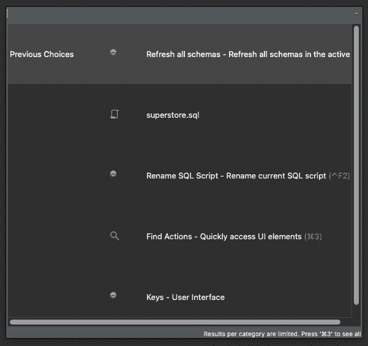
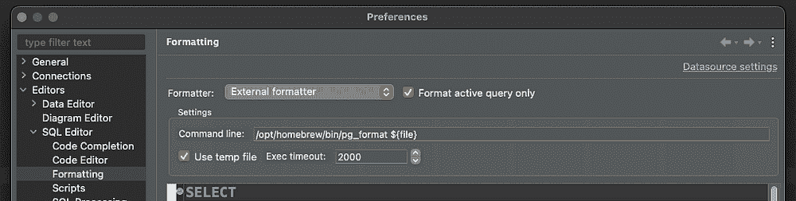
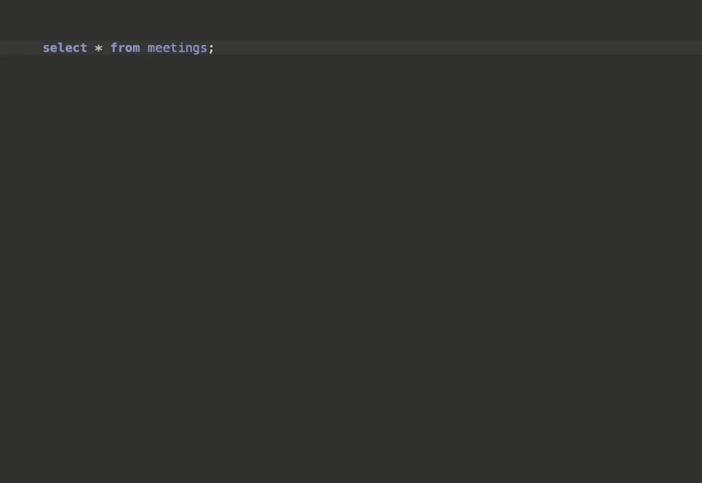
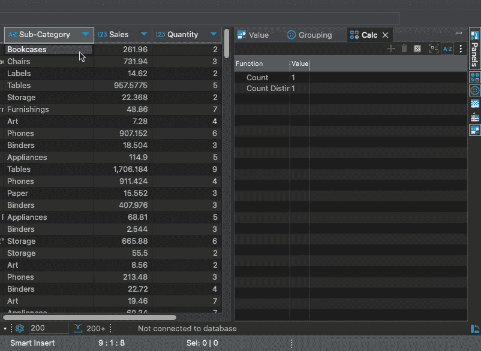
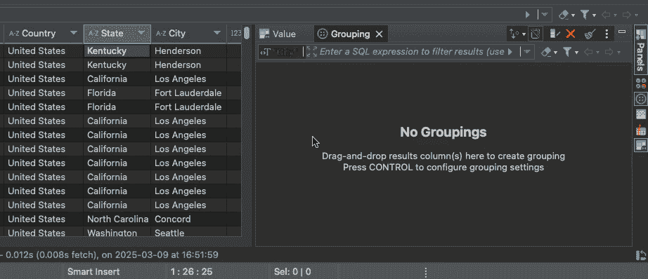
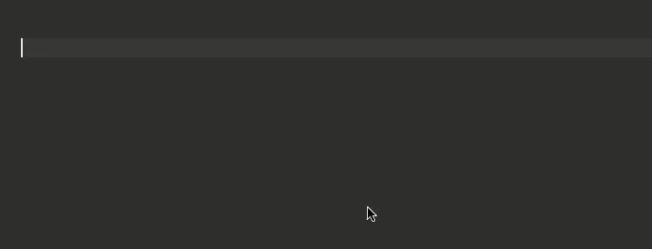
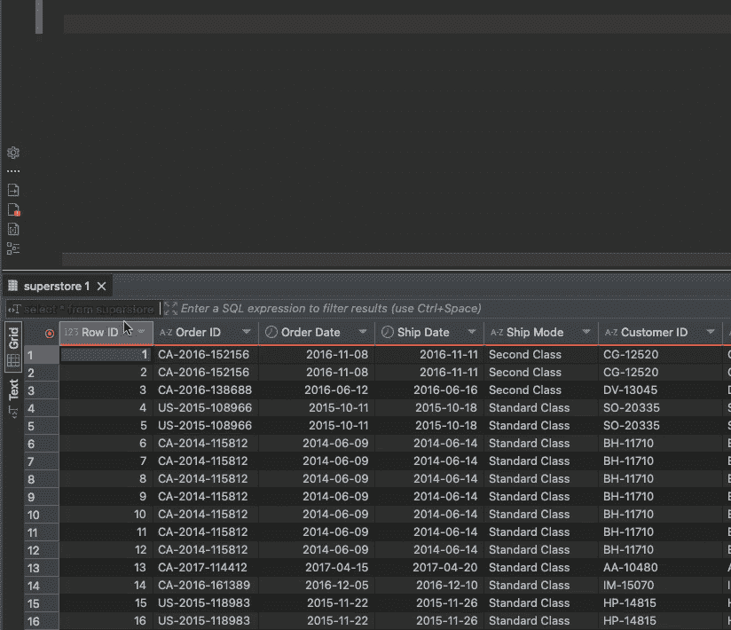
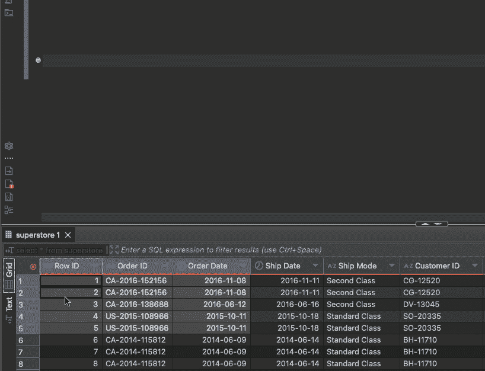

# 7 个强大的 DBeaver 技巧和窍门，提升你的 SQL 工作流程

> 原文：[`towardsdatascience.com/7-powerful-dbeaver-tips-and-tricks-to-improve-your-sql-workflow/`](https://towardsdatascience.com/7-powerful-dbeaver-tips-and-tricks-to-improve-your-sql-workflow/)

[DBeaver](https://github.com/dbeaver/dbeaver) 是最强大的开源 SQL IDE，但人们不知道它有几个功能。在这篇文章中，我将与你分享几个可以加快你工作流程的功能，没有任何废话。

我是在深入研究我日常使用的工具时学到这些的，从 DBeaver 开始。在未来的文章中，我会比较 DBeaver 与在 VSCode（或 Cursor）上构建你的 SQL 开发环境之间的工作流程。如果你对此感兴趣，请确保关注我的出版物！

今天，我们的重点是学习 DBeaver 的酷炫功能。让我们开始吧。

## 命令面板

这是 DBeaver 中最强大但最隐蔽的功能之一。也许人们忽略了它，因为它不被称为“命令面板”。你可以使用**CMD + 3（Mac）或 CTRL + 3（Windows）**来打开它。



从这里，你可以访问 IDE 中的基本任何操作。我主要用它来做：

+   在 SQL 脚本之间切换。

+   导航到特定设置。

+   快速访问操作，如导出结果、刷新架构、打开模板、重命名文件等。

（官方上，DBeaver 中的这个功能称为“查找操作。”）

## 自定义 SQL 格式化器

你知道你可以在 DBeaver 中轻松设置不同的格式化器吗？我个人并不喜欢默认的格式化，而且由于我主要使用 PostgreSQL，我更喜欢 pg_formatter。

让我展示如何设置 pg_formatter，但请记住，这个过程对于任何你可以通过终端调用的 SQL 格式化器都是类似的。

```py
# Install PG Formatter
brew install pgformatter

# Find where the program is located.
# In my case: opt/homebrew/bin/pg_format
which pg_format
```

接下来，转到**首选项 → 编辑器 → SQL 编辑器 → 格式化，选择一个“外部格式化器”，**然后粘贴你想要的格式化器的路径。

💡 或者你可以简单地打开命令面板并搜索“格式化”。



## 在 SELECT 中展开列

通常，你可能需要从表中选取大部分列，仅排除少数几列。DBeaver 通过将你的 SELECT *扩展为显式列名来简化这一过程。

你可以用**CTRL + Space**快捷键做到这一点，无论是在 Mac 还是 Windows 上。如果它被绑定到另一个系统快捷键，这可能不起作用，在这种情况下，你可以在命令面板中查找“内容辅助”。



## 快速查找列统计信息

DBeaver 有许多功能可以加快你的分析速度。其中之一是我经常使用的“计算标签”，位于你的查询结果右侧。它让你可以快速获取查询结果中列的信息。

这是你可以用它做什么：

+   查找分类列的唯一值和非空值的数量。

+   获取数值列的最小值、最大值、平均值、中位数等。



非常方便快速了解你的数据集！

## 临时分组

与“计算”标签页类似，“分组”标签页允许你快速创建分组查询，而无需手动编写 SQL。

你可以用它做什么：

+   快速计数值的出现次数。

+   添加多个聚合。



虽然这个对于简单的聚合来说相当不错，但我发现它有点令人失望，因为没有方法可以计数唯一值，就像我在上面的 GIF 中做的那样，而不必手动编写度量函数。

## SQL 模板

SQL 模板非常强大，尽管我承认我没有像应该的那样经常使用它们。模板可以让你避免反复编写常见的表达式。

你可以通过打开命令面板并搜索“模板”来查看内置模板。你会看到以下快捷方式的缩写：

+   `SELECT * FROM {table}`

+   `SELECT * FROM {table} WHERE {col} = {value}`

+   以及其他，如选择和排序，按组计数等。

你需要做的只是编写查询的缩写并按 Tab 键：



你也可以创建自己的模板，如果你只是复制现有的模板并对其进行修改，这并不难。

## 高级复制技巧

你可能已经知道 DBeaver 有广泛的数据导出选项。然而，标准导出向导可能会让你感到有些不知所措，因为它显示了大量的配置，即使你只是想快速导出 CSV。

一个更快的方法是在“结果”标签页中选择数据，右键单击，然后选择“高级复制”。通过这样做，你可以以多种格式复制你的数据，如 CSV、JSON、Markdown、TXT，甚至 SQL 插入语句。



我觉得这个特别有用，尤其是在我需要快速将数据发送给队友的时候。

一个额外的提示是，你可以将此数据复制到 TSV，Excel 和 Google Sheets 会将其正确识别到相应的单元格中！不过，对于这个，你必须非常精通，根据 DBeaver 😅



## 结论

我非常喜欢 DBeaver 作为 SQL IDE。它非常强大，界面非常干净。说实话，这个工具免费且开源真是令人难以置信。如果你还没有尝试过，我强烈推荐它！

我没有看到很多人谈论它的一些最棒的功能和技巧，而我分享的大多数提示都只是使用软件的结果。可能还有很多我遗漏了，尤其是在插件方面，我使用得不多。

我知道我非常快地浏览了所有的提示，所以如果你有疑问，请随时联系。另外，如果你有更多的工作流程提示，我很乐意听听它们！

***

我希望你学到了一些新东西！

如果你对这篇帖子中没有提到的其他技巧感到好奇，或者喜欢了解一般的数据话题，**请订阅我在 Substack 上的免费通讯**[**免费通讯链接**](https://mtrentz.substack.com/)。我会在有真正有趣的内容分享时发布。

想直接联系或有问题？**随时通过[mtrentz.com](https://mtrentz.com)联系我**。**

*除非另有说明，所有图像和动画均由作者创作*
