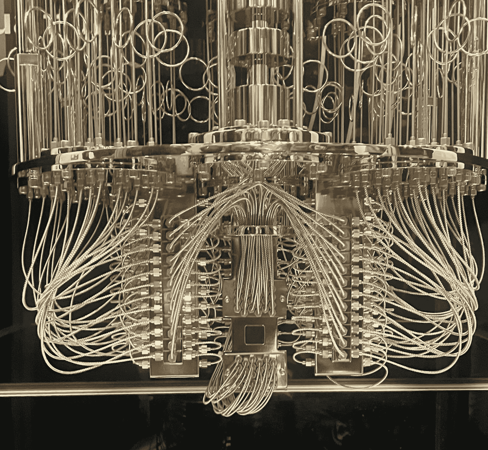
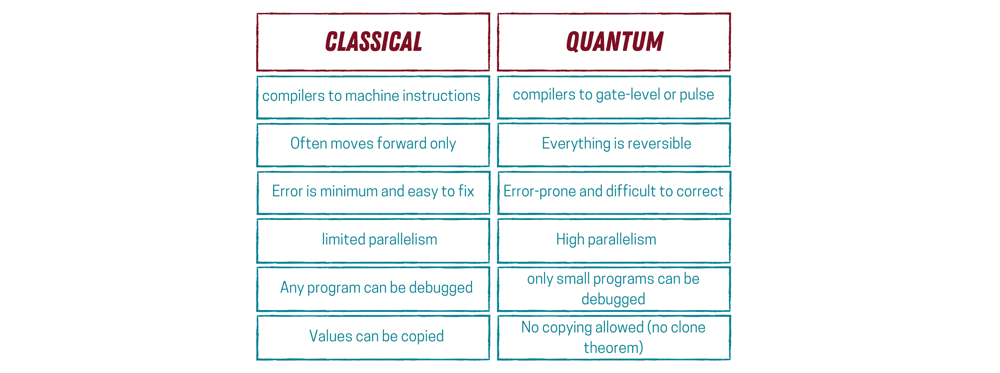
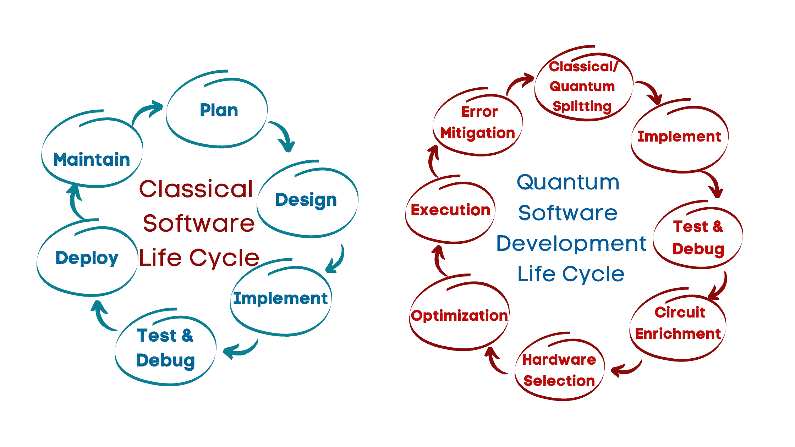

# 量子计算的状态：我们今天在哪里？

> [量子计算的状态：我们今天在哪里？](https://towardsdatascience.com/the-state-of-quantum-computing-where-are-we-today-17ee19f51b1d/)

由作者提供的 IBM Quantalier 模型的图片

过去几年，量子计算技术的进步一直在迅速增加。当我于 2018 年首次加入这个领域时，很少有人了解这个领域的实际应用，或者寻求了解它，可能是因为当时只有少数人知道量子计算机是什么，或者因为我们当时没有量子计算机。从那时起，一切都变了。

越来越多的人对这个领域产生了兴趣，从学术界到工业界，甚至一些公众。所以，当我坐下来思考我的 2025 年第一篇文章时，量子计算的现状似乎是个不错的主题。

不仅是因为量子领域发展得如此之快，而且因为今年，量子力学开始发展的第 100 年，联合国宣布 2025 年为[国际量子科学和技术年](https://quantum2025.org/en/)。

那么，对于那些好奇我们现在作为领域处于何种状态的人来说，现在讨论这个领域不是最好的时机吗？

* * *

### 什么是量子计算机？一个非常简短的介绍

但首先，对于这个领域的新手，让我们简要地谈谈量子计算是什么以及为什么每个人都应该关心它。

我们今天使用的计算机（我们将它们称为经典计算机）以二进制方式工作，即 0 或 1。这些代表电流是否通过电路；我们称它们为比特。从根本上说，我们使用晶体管来控制电流是否通过计算机内部的电路。为了简化，可以把晶体管想象成一个开关；如果开关是闭合的，电流就会通过，或者我们有 1。如果它没有闭合，就没有电流通过，我们就有 0。

今天的计算机有数百万个微小的晶体管（开关），操纵这些晶体管的状况使我们能够执行各种计算和解决问题。

相反，量子计算机以不同的方式工作。在量子计算机中，我们利用量子力学的现象来解决一些问题。但在我不自量力之前，让我退一步，谈谈量子计算机中比特的等价物。

*量子比特*，或量子位，是量子计算机的基本构建块。它们比经典比特复杂一些，主要是因为我们可以用它们来编码更多信息。你可能会问，它们有什么不同？

*经典比特*表示电路中是否有电流通过。相反，一个量子比特是一个小系统（或量子系统），如光子或一个小超导电路。正因为如此，量子比特为我们提供了更多的自由度来编码信息，同时也带来了一组不同的挑战（我们将在稍后讨论）。

由于量子比特是量子系统，我们可以操纵它们的状态（如叠加和纠缠）以执行计算并解决 *一些* 问题，比经典计算机更好。

图片由作者提供

* * *

这里的关键词是 "*一些*" 问题。这让我想到了下一个问题：为什么我们应该关心量子计算机？这些计算机将比我们当前的计算机更好地解决哪些问题？

### 量子计算机将擅长解决的问题

量子计算机将非常擅长解决 "多变量问题"。这些问题涉及多个变量，它们相互作用并影响结果。它们在数学、科学、工程、经济学和机器学习等多个领域都很常见。

**以下是一些此类问题的例子：**

+   寻找函数的最大值或最小值。

+   将资源分配以最大化效率或最小化成本。

+   安排任务以最小化总完成时间。

+   训练输入（特征）是多维向量的模型。

+   基于价格、收入和生产成本来模拟供需关系。

+   设计受多个变量（如速度、效率和安全性）约束的系统。

这些类型的问题的独特之处在于变量在复杂方式中的相互作用。解决这些问题需要理解它们的相互依赖性以及它们如何共同影响系统和最终解决方案。因此，我们可以将这些问题的挑战总结如下：

+   变量之间的复杂相互作用。

+   随着变量数量的增加，复杂性也在增长。

+   变量可能以非线性方式相互关联。

+   现实世界中的问题通常具有不确定或噪声数据。

我们今天使用不同的方法，尽我们所能使用当前技术来尝试解决这些问题。我们使用诸如代换和消元、梯度下降、拉格朗日乘数、蒙特卡洛模拟、神经网络、回归模型或聚类算法等技术。尽管这些技术在大多数问题上都工作得很好，但它们可能需要非常长的时间（数年）来解决像找到大量因子这样的问题。这正是量子计算机大放异彩的地方。量子系统存在于叠加态和纠缠态的能力使我们能够比今天更快地解决多变量问题。

既然我们已经知道了量子计算机是什么以及它们能解决什么问题，那么让我们讨论一下我们目前在这个领域的位置。我将讨论量子计算的两个方面：硬件方面和软件方面。

* * *

## **量子硬件**

目前，有不同方法构建量子比特，研究人员正在努力改进这些方法并开发新的方法。但既然我们正在讨论量子硬件的当前状态，我们将讨论构建量子比特的 5 种领先方法。

**超导量子比特**（由 IBM 和谷歌使用）：这些微型超导电路冷却至接近绝对零度以创建和操纵量子状态。

**捕获离子**（由 IonQ 和霍尼韦尔使用）：这种方法使用电磁场捕获的单独离子，通过激光控制量子状态。捕获离子量子比特以其较长的相干时间和高精度而闻名。

**基于光学的系统**：依赖于光子（光粒子）作为量子比特，因为它们有可能实现长距离通信。

**中性原子**：这些系统使用激光场固定在原位的单个原子，通过光来操纵量子状态。由于原子的自然均匀性，它们承诺具有可扩展性。

**拓扑量子比特**是一种基于奇异粒子的理论方法，这些粒子通过其编织路径编码信息，以产生更稳健的系统。

虽然这些系统各自都有其优势和劣势，但量子计算整体面临的挑战包括：

### 规模化问题

规模化量子系统在不同层面上都是一个相当复杂的挑战，包括：

**物理限制**：

+   每个量子比特都需要精确的控制和从噪声中隔离。随着量子比特数量的增加，保持控制变得指数级复杂。

+   空间和基础设施需求（如使用超导量子比特的低温冷却）随着系统规模的增加而增加。

**量子比特互连**：

量子算法通常需要量子比特相互交互。

**控制系统**：

规模化需要复杂的控制系统来管理每个量子比特的操作，同时不引入额外的噪声或复杂性。

**制造**：

在规模上生产均匀、高质量的量子比特对超导电路或捕获离子来说是一个挑战，因为制造中的可变性可能导致性能不一致。

### 错误率和破坏性

不幸的是，由于量子系统对外部因素的敏感性，它们容易受到错误和信息丢失的影响。这可以通过两种方式之一发生：

**错误率**

+   **门错误**：这些错误是在量子门操作过程中由于控制脉冲的不完美或环境因素而引入的。

+   **读出错误**：在测量量子比特状态时发生的错误。这些错误可能源于测量过程中的不完美或来自邻近量子比特的干扰。

+   **串扰**：未有意纠缠的量子比特之间的相互作用可以在操作过程中引入错误。

### 破坏性

破坏性是量子比特由于与其环境（如热波动、电磁干扰或量子系统的不完美隔离）的相互作用而失去其量子状态。

科学家和公司正在研究不同的方法来解决这些问题，并寻找使用量子纠错等方法的解决方案来构建更大的量子计算机。

## **软件和算法开发**

图片由作者提供

量子计算硬件方面并不是唯一仍在开发中的方面。为了科学家和工程师利用当前硬件并推动其发展，我们需要软件达到相同水平（如果不是更好），以实现利用量子系统不同优势的算法。

现在，科学家和任何对量子技术感兴趣的人都可以开始使用 Qiskit、Cirq 和 TKET 等开源解决方案来开发和实现针对优化问题（例如，物流、金融建模）的算法，量子化学和材料科学，以及密码学和其对网络安全的含义。

虽然这些工具目前很好，但量子软件方面的发展速度并不像硬件方面那样快。我们仍然需要开发堆栈中的工具，以便充分利用当前和未来的硬件。

我们需要更高级的方法来实现算法、调试和测试工具及策略，以及能够独立于目标硬件实现算法的能力。

* * *

## 最后的想法

尽管量子计算机已经从研究实验室走向实践，但它们仍然面临着许多挑战。然而，该领域的承诺和它能够解决的潜在应用使其成为改善我们当前技术的优秀工具。

因此，如果你在想是否已经太晚进入量子领域，我想告诉你，并不是。事实上，2025 年是进入量子领域并成为这个充满选择和激动人心的领域的绝佳时机。

该领域内有许多机会，任何人都可以参与其中，而无需了解量子物理、力学，甚至数学。

我写这篇文章的目的是通过对其当前状态的简要总结来阐明量子计算领域。
