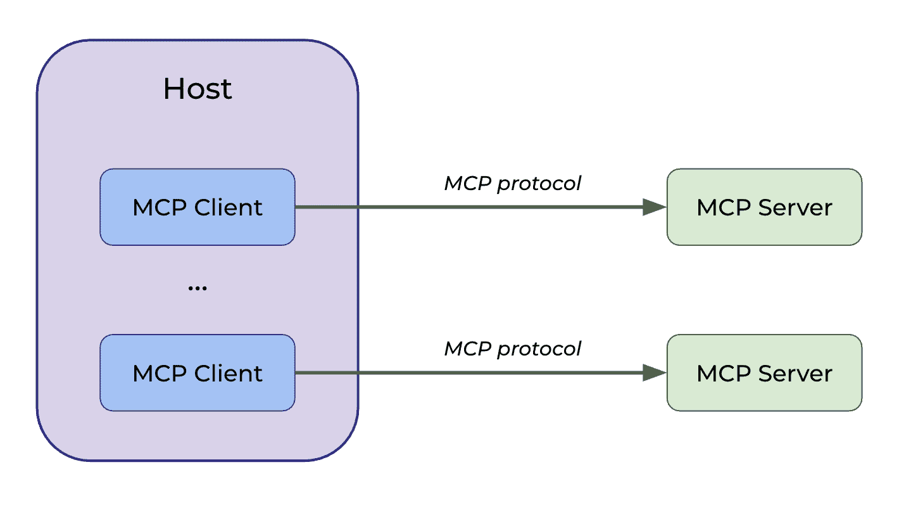
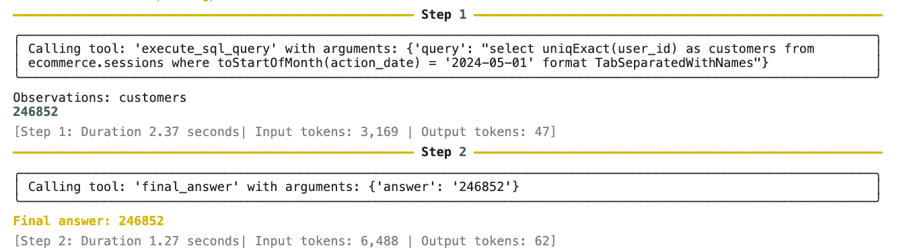

# 构建自定义 MCP 聊天机器人

> 原文：[`towardsdatascience.com/building-a-%d1%81ustom-mcp-chatbot/`](https://towardsdatascience.com/building-a-%d1%81ustom-mcp-chatbot/)

<mdspan datatext="el1752176987570" class="mdspan-comment">**MCP (模型上下文协议)** 是一种标准化 AI 应用程序与外部工具或数据源之间通信的方法。这种标准化有助于减少所需的集成数量（从 N*M 到 N+M）：

+   当您需要常用功能时，可以使用社区构建的 MCP 服务器，这样可以节省时间，避免每次都需要重新发明轮子。

+   您还可以公开自己的工具和资源，使它们可供他人使用。

在[我的上一篇文章](https://towardsdatascience.com/your-personal-analytics-toolbox/)中，我们构建了分析工具箱（一组可能自动化您日常流程的工具）。我们构建了一个 MCP 服务器，并使用其功能与现有的客户端如 MCP Inspector 或 Claude Desktop 进行交互。

现在，我们希望在我们的 AI 应用程序中直接使用这些工具。为此，让我们构建自己的 MCP 客户端。我们将编写相当底层的代码，这也会让您更清楚地了解像 Claude Code 这样的工具如何在底层与 MCP 交互。

此外，我还想实现目前（2025 年 7 月）在 Claude Desktop 中缺失的功能：LLM 能够自动检查它是否有适合当前任务的合适提示模板，并使用它。目前，您必须手动选择模板，这并不太方便。

作为额外奖励，我还会分享一个使用 smolagents 框架的高级实现，该框架非常适合您仅使用 MCP 工具且不需要太多定制化的场景。

### MCP 协议概述

这里是一个快速回顾 MCP，以确保我们处于同一页面上。MCP 是由 Anthropic 开发的一种协议，用于标准化 LLM 与外部世界的交互方式。

它遵循客户端-服务器架构，并包含三个主要组件：

+   **主机**是面向用户的应用程序。

+   **MCP 客户端**是主机中的一个组件，它与服务器建立一对一的连接，并使用 MCP 协议定义的消息进行通信。

+   **MCP 服务器**公开了如提示模板、资源和工具等功能。



图片由作者提供

由于我们之前已经[实现了 MCP 服务器](https://github.com/miptgirl/mcp-analyst-toolkit)，这次我们将专注于构建 MCP 客户端。我们将从一个相对简单的实现开始，稍后添加动态选择提示模板的能力。

> *您可以在[GitHub](https://github.com/miptgirl/miptgirl_medium/tree/main/mcp_client_example)上找到完整的代码。*

## 构建 MCP 聊天机器人

让我们从初始设置开始：我们将从配置文件中加载 Anthropic API 密钥，并调整 Python 的`asyncio`事件循环以支持嵌套事件循环。

```py
# Load configuration and environment
with open('../../config.json') as f:
    config = json.load(f)
os.environ["ANTHROPIC_API_KEY"] = config['ANTHROPIC_API_KEY']

nest_asyncio.apply()
```

让我们先构建程序的基本框架，以获得应用程序高级架构的清晰视图。

```py
async def main():
    """Main entry point for the MCP ChatBot application."""
    chatbot = MCP_ChatBot()
    try:
        await chatbot.connect_to_servers()
        await chatbot.chat_loop()
    finally:
        await chatbot.cleanup()

if __name__ == "__main__":
    asyncio.run(main())
```

我们首先创建`MCP_ChatBot`类的实例。聊天机器人首先发现可用的 MCP 功能（遍历所有配置的 MCP 服务器，建立连接并请求其功能列表）。

一旦建立连接，我们将初始化一个无限循环，其中聊天机器人监听用户查询，在需要时调用工具，并继续此循环，直到手动停止进程。

最后，我们将执行清理步骤以关闭所有打开的连接。

现在，让我们更详细地走过每个阶段。

### 初始化 ChatBot 类

让我们先创建类并定义`__init__`方法。ChatBot 类的主要字段是：

+   `exit_stack`管理多个异步线程（连接到 MCP 服务器）的生命周期，确保即使我们在执行过程中遇到错误，所有连接也将被适当地关闭。此逻辑在`cleanup`函数中实现。

+   `anthropic`是用于向 LLM 发送消息的 Anthropic API 客户端。

+   `available_tools`和`available_prompts`是我们连接到的所有 MCP 服务器暴露的工具和提示列表。

+   `sessions`是将工具、提示和资源映射到其相应 MCP 会话的映射。这允许聊天机器人在 LLM 选择特定工具时将请求路由到正确的 MCP 服务器。

```py
class MCP_ChatBot:
  """
  MCP (Model Context Protocol) ChatBot that connects to multiple MCP servers
  and provides a conversational interface using Anthropic's Claude.

  Supports tools, prompts, and resources from connected MCP servers.
  """

  def __init__(self):
    self.exit_stack = AsyncExitStack() 
    self.anthropic = Anthropic() # Client for Anthropic API
    self.available_tools = [] # Tools from all connected servers
    self.available_prompts = [] # Prompts from all connected servers  
    self.sessions = {} # Maps tool/prompt/resource names to MCP sessions

  async def cleanup(self):
    """Clean up resources and close all connections."""
    await self.exit_stack.aclose()
```

### 连接到服务器

我们聊天机器人的第一个任务是初始化与所有配置的 MCP 服务器的连接，并发现我们可以使用哪些功能。

我们代理可以连接到的 MCP 服务器列表定义在`server_config.json`文件中。我已经设置了与三个 MCP 服务器的连接：

+   [分析工具包](https://github.com/miptgirl/mcp-analyst-toolkit)是我对前一篇文章中讨论的日常分析工具的实现，

+   [文件系统](https://github.com/modelcontextprotocol/servers/tree/main/src/filesystem)允许代理处理文件，

+   [Fetch](https://github.com/modelcontextprotocol/servers/tree/main/src/fetch)帮助 LLM 检索网页内容，并将其从 HTML 转换为 markdown 以提高可读性。

```py
{
  "mcpServers": {
    "analyst_toolkit": {
      "command": "uv",
      "args": [
        "--directory",
        "/path/to/github/mcp-analyst-toolkit/src/mcp_server",
        "run",
        "server.py"
      ],
      "env": {
          "GITHUB_TOKEN": "your_github_token"
      }
    },
    "filesystem": {
      "command": "npx",
      "args": [
        "-y",
        "@modelcontextprotocol/server-filesystem",
        "/Users/marie/Desktop",
        "/Users/marie/Documents/github"
      ]
    },
    "fetch": {
        "command": "uvx",
        "args": ["mcp-server-fetch"]
      }
  }
}
```

首先，我们将读取配置文件，解析它，然后连接到列出的每个服务器。

```py
async def connect_to_servers(self):
  """Load server configuration and connect to all configured MCP servers."""
  try:
    with open("server_config.json", "r") as file:
      data = json.load(file)

    servers = data.get("mcpServers", {})
    for server_name, server_config in servers.items():
      await self.connect_to_server(server_name, server_config)
  except Exception as e:
    print(f"Error loading server config: {e}")
    traceback.print_exc()
    raise
```

对于每个服务器，我们执行几个步骤来建立连接：

+   **在传输级别**，我们将 MCP 服务器作为 stdio 进程启动，并获取发送和接收消息的流。

+   **在会话级别**，我们创建一个包含流的`ClientSession`，然后通过调用`initialize`方法执行 MCP 握手。

+   我们在上下文管理器`exit_stack`中注册了会话和传输对象，以确保所有连接最终都能正确关闭。

+   最后一步是**注册服务器功能**。我们将此功能封装到一个单独的函数中，稍后我们将对其进行讨论。

```py
async def connect_to_server(self, server_name, server_config):
    """Connect to a single MCP server and register its capabilities."""
    try:
      server_params = StdioServerParameters(**server_config)
      stdio_transport = await self.exit_stack.enter_async_context(
          stdio_client(server_params)
      )
      read, write = stdio_transport
      session = await self.exit_stack.enter_async_context(
          ClientSession(read, write)
      )
      await session.initialize()
      await self._register_server_capabilities(session, server_name)

    except Exception as e:
      print(f"Error connecting to {server_name}: {e}")
      traceback.print_exc()
```

注册功能涉及遍历从会话中检索到的所有工具、提示和资源。因此，我们更新了内部变量`sessions`（MCP 客户端和服务器之间资源与特定会话之间的映射）、`available_prompts`和`available_tools`。

```py
async def _register_server_capabilities(self, session, server_name):
  """Register tools, prompts and resources from a single server."""
  capabilities = [
    ("tools", session.list_tools, self._register_tools),
    ("prompts", session.list_prompts, self._register_prompts), 
    ("resources", session.list_resources, self._register_resources)
  ]

  for capability_name, list_method, register_method in capabilities:
    try:
      response = await list_method()
      await register_method(response, session)
    except Exception as e:
      print(f"Server {server_name} doesn't support {capability_name}: {e}")

async def _register_tools(self, response, session):
  """Register tools from server response."""
  for tool in response.tools:
    self.sessions[tool.name] = session
    self.available_tools.append({
        "name": tool.name,
        "description": tool.description,
        "input_schema": tool.inputSchema
    })

async def _register_prompts(self, response, session):
  """Register prompts from server response."""
  if response and response.prompts:
    for prompt in response.prompts:
        self.sessions[prompt.name] = session
        self.available_prompts.append({
            "name": prompt.name,
            "description": prompt.description,
            "arguments": prompt.arguments
        })

async def _register_resources(self, response, session):
  """Register resources from server response."""
  if response and response.resources:
    for resource in response.resources:
        resource_uri = str(resource.uri)
        self.sessions[resource_uri] = session
```

到这一阶段结束时，我们的`MCP_ChatBot`对象已经拥有了与用户交互所需的一切：

+   所有配置的 MCP 服务器连接都已建立，

+   所有提示、资源和工具都已注册，包括 LLM 理解如何使用这些功能所需的描述，

+   这些资源与其相应会话之间的映射被存储，因此我们知道每个请求应该发送到哪个位置。

### 聊天循环

因此，现在是时候通过创建`chat_loop`函数来开始与用户的聊天了。

我们将首先与用户分享所有可用的命令：

+   列出资源、工具和提示

+   执行工具调用

+   查看资源

+   使用提示模板

+   退出聊天（*有一个明确的退出无限循环的方式是很重要的*）。

之后，我们将进入一个无限循环，根据用户输入执行相应的操作：无论是上述命令之一还是向 LLM 发出请求。

```py
async def chat_loop(self):
  """Main interactive chat loop with command processing."""
  print("\nMCP Chatbot Started!")
  print("Commands:")
  print("  quit                           - Exit the chatbot")
  print("  @periods                       - Show available changelog periods") 
  print("  @<period>                      - View changelog for specific period")
  print("  /tools                         - List available tools")
  print("  /tool <name> <arg1=value1>     - Execute a tool with arguments")
  print("  /prompts                       - List available prompts")
  print("  /prompt <name> <arg1=value1>   - Execute a prompt with arguments")

  while True:
    try:
      query = input("\nQuery: ").strip()
      if not query:
          continue

      if query.lower() == 'quit':
          break

      # Handle resource requests (@command)
      if query.startswith('@'):
        period = query[1:]
        resource_uri = "changelog://periods" if period == "periods" else f"changelog://{period}"
        await self.get_resource(resource_uri)
        continue

      # Handle slash commands
      if query.startswith('/'):
        parts = self._parse_command_arguments(query)
        if not parts:
          continue

        command = parts[0].lower()

        if command == '/tools':
          await self.list_tools()
        elif command == '/tool':
          if len(parts) < 2:
            print("Usage: /tool <name> <arg1=value1> <arg2=value2>")
            continue

          tool_name = parts[1]
          args = self._parse_prompt_arguments(parts[2:])
          await self.execute_tool(tool_name, args)
        elif command == '/prompts':
          await self.list_prompts()
        elif command == '/prompt':
          if len(parts) < 2:
            print("Usage: /prompt <name> <arg1=value1> <arg2=value2>")
            continue

          prompt_name = parts[1]
          args = self._parse_prompt_arguments(parts[2:])
          await self.execute_prompt(prompt_name, args)
        else:
          print(f"Unknown command: {command}")
        continue

      # Process regular queries
      await self.process_query(query)

    except Exception as e:
      print(f"\nError in chat loop: {e}")
      traceback.print_exc()
```

有一些辅助函数用于解析参数并返回我们之前注册的可用工具和提示列表。由于这相当直接，这里我就不多做详细说明了。如果您感兴趣，可以查看[完整代码](https://github.com/miptgirl/miptgirl_medium/blob/main/mcp_client_example/mcp_client_example_base.py)。

相反，让我们更深入地了解 MCP 客户端和服务器在不同场景下的交互方式。

在处理资源时，我们使用`self.sessions`映射来找到适当的会话（如果需要，还有回退选项），然后使用该会话来读取资源。

```py
async def get_resource(self, resource_uri):
  """Retrieve and display content from an MCP resource."""
  session = self.sessions.get(resource_uri)

  # Fallback: find any session that handles this resource type
  if not session and resource_uri.startswith("changelog://"):
    session = next(
        (sess for uri, sess in self.sessions.items() 
         if uri.startswith("changelog://")), 
        None
    )

  if not session:
    print(f"Resource '{resource_uri}' not found.")
    return

  try:
    result = await session.read_resource(uri=resource_uri)
    if result and result.contents:
        print(f"\nResource: {resource_uri}")
        print("Content:")
        print(result.contents[0].text)
    else:
        print("No content available.")
  except Exception as e:
    print(f"Error reading resource: {e}")
    traceback.print_exc()
```

要执行工具，我们遵循类似的过程：首先找到会话，然后使用它来调用工具，传递其名称和参数。

```py
async def execute_tool(self, tool_name, args):
  """Execute an MCP tool directly with given arguments."""
  session = self.sessions.get(tool_name)
  if not session:
      print(f"Tool '{tool_name}' not found.")
      return

  try:
      result = await session.call_tool(tool_name, arguments=args)
      print(f"\nTool '{tool_name}' result:")
      print(result.content)
  except Exception as e:
      print(f"Error executing tool: {e}")
      traceback.print_exc()
```

没有惊喜。相同的做法也适用于执行提示。

```py
async def execute_prompt(self, prompt_name, args):
    """Execute an MCP prompt with given arguments and process the result."""
    session = self.sessions.get(prompt_name)
    if not session:
        print(f"Prompt '{prompt_name}' not found.")
        return

    try:
        result = await session.get_prompt(prompt_name, arguments=args)
        if result and result.messages:
            prompt_content = result.messages[0].content
            text = self._extract_prompt_text(prompt_content)

            print(f"\nExecuting prompt '{prompt_name}'...")
            await self.process_query(text)
    except Exception as e:
        print(f"Error executing prompt: {e}")
        traceback.print_exc()
```

我们还没有涵盖的唯一主要用例是处理用户的一般、自由形式的输入（不是特定命令之一）。

在这种情况下，我们首先向 LLM 发送初始请求，然后解析输出，确定是否有工具调用。如果有工具调用，我们执行它们。否则，我们退出无限循环并返回答案给用户。

```py
async def process_query(self, query):
  """Process a user query through Anthropic's Claude, handling tool calls iteratively."""
  messages = [{'role': 'user', 'content': query}]

  while True:
    response = self.anthropic.messages.create(
        max_tokens=2024,
        model='claude-3-7-sonnet-20250219', 
        tools=self.available_tools,
        messages=messages
    )

    assistant_content = []
    has_tool_use = False

    for content in response.content:
        if content.type == 'text':
            print(content.text)
            assistant_content.append(content)
        elif content.type == 'tool_use':
            has_tool_use = True
            assistant_content.append(content)
            messages.append({'role': 'assistant', 'content': assistant_content})

            # Execute the tool call
            session = self.sessions.get(content.name)
            if not session:
                print(f"Tool '{content.name}' not found.")
                break

            result = await session.call_tool(content.name, arguments=content.input)
            messages.append({
                "role": "user", 
                "content": [{
                    "type": "tool_result",
                    "tool_use_id": content.id,
                    "content": result.content
                }]
            })

      if not has_tool_use:
          break
```

因此，我们现在已经完全涵盖了 MCP 聊天机器人在底层是如何工作的。现在，是时候在实际操作中测试它了。您可以通过以下命令从命令行界面运行它。

```py
python mcp_client_example_base.py
```

当您运行聊天机器人时，您首先会看到以下介绍消息，概述潜在选项：

```py
MCP Chatbot Started!
Commands:
  quit                           - Exit the chatbot
  @periods                       - Show available changelog periods
  @<period>                      - View changelog for specific period
  /tools                         - List available tools
  /tool <name> <arg1=value1>     - Execute a tool with arguments
  /prompts                       - List available prompts
  /prompt <name> <arg1=value1>   - Execute a prompt with arguments
```

从那里，您可以尝试不同的命令，例如，

+   调用工具以列出 DB 中可用的数据库

+   列出所有可用的提示

+   使用提示模板，调用方式如下 `/prompt sql_query_prompt question="我们在 2024 年 5 月有多少客户？”`。

最后，我可以通过输入`quit`来结束你的聊天。

```py
Query: /tool list_databases
[07/02/25 18:27:28] INFO     Processing request of type CallToolRequest                server.py:619
Tool 'list_databases' result:
[TextContent(type='text', text='INFORMATION_SCHEMA\ndatasets\ndefault\necommerce\necommerce_db\ninformation_schema\nsystem\n', annotations=None, meta=None)]

Query: /prompts
Available prompts:
- sql_query_prompt: Create a SQL query prompt
  Arguments:
    - question

Query: /prompt sql_query_prompt question="How many customers did we have in May 2024?"
[07/02/25 18:28:21] INFO     Processing request of type GetPromptRequest               server.py:619
Executing prompt 'sql_query_prompt'...
I'll create a SQL query to find the number of customers in May 2024.
[07/02/25 18:28:25] INFO     Processing request of type CallToolRequest                server.py:619
Based on the query results, here's the final SQL query:
```sql

select uniqExact(user_id) as customer_count

from ecommerce.sessions

where toStartOfMonth(action_date) = '2024-05-01'

format TabSeparatedWithNames

```py
Query: /tool execute_sql_query query="select uniqExact(user_id) as customer_count from ecommerce.sessions where toStartOfMonth(action_date) = '2024-05-01' format TabSeparatedWithNames"
I'll help you execute this SQL query to get the unique customer count for May 2024\. Let me run this for you.
[07/02/25 18:30:09] INFO     Processing request of type CallToolRequest                server.py:619
The query has been executed successfully. The results show that there were 246,852 unique customers (unique user_ids) in May 2024 based on the ecommerce.sessions table.

Query: quit
```

看起来非常酷！我们的基本版本运行良好！现在，是时候更进一步，通过教会它根据客户输入实时建议相关提示来使我们的聊天机器人变得更智能。

## 提示建议

在实践中，建议与用户任务最匹配的提示模板可以非常有帮助。目前，我们聊天机器人的用户要么已经了解可用的提示，或者至少足够好奇去自己探索以从我们所构建的内容中受益。通过添加提示建议功能，我们可以为用户提供这种发现，并使我们的聊天机器人变得更加方便和用户友好。

让我们头脑风暴一下添加这个功能的方法。我会以以下方式处理这个功能：

**使用 LLM 评估提示的相关性**。遍历所有可用的提示模板，并对每个模板进行评估，看它是否与用户的查询匹配。

**向用户建议匹配的提示**。如果我们找到了相关的提示模板，就与用户分享，并询问他们是否想要执行它。

**将提示模板与用户输入合并**。如果用户接受，将选定的提示与原始查询相结合。由于提示模板有占位符，我们可能需要 LLM 来填充它们。一旦我们将提示模板与用户的查询合并，我们就会有一个准备发送给 LLM 的更新消息。

我们将把这个逻辑添加到`process_query`函数中。得益于我们的模块化设计，添加这个增强功能而不会干扰到其他代码是非常容易的。

让我们首先实现一个函数来找到最相关的提示模板。我们将使用 LLM 评估每个提示，并给它分配一个从 0 到 5 的相关性分数。然后，我们将过滤掉任何得分低于 2 的提示，并只返回最相关的提示（在剩余结果中相关性分数最高的那个）。

```py
async def _find_matching_prompt(self, query):
  """Find a matching prompt for the given query using LLM evaluation."""
  if not self.available_prompts:
    return None

  # Use LLM to evaluate prompt relevance
  prompt_scores = []

  for prompt in self.available_prompts:
    # Create evaluation prompt for the LLM
    evaluation_prompt = f"""
You are an expert at evaluating whether a prompt template is relevant for a user query.

User Query: "{query}"

Prompt Template:
- Name: {prompt['name']}
- Description: {prompt['description']}

Rate the relevance of this prompt template for the user query on a scale of 0-5:
- 0: Completely irrelevant
- 1: Slightly relevant
- 2: Somewhat relevant  
- 3: Moderately relevant
- 4: Highly relevant
- 5: Perfect match

Consider:
- Does the prompt template address the user's intent?
- Would using this prompt template provide a better response than a generic query?
- Are the topics and context aligned?

Respond with only a single number (0-5) and no other text.
"""

    try:
      response = self.anthropic.messages.create(
          max_tokens=10,
          model='claude-3-7-sonnet-20250219',
          messages=[{'role': 'user', 'content': evaluation_prompt}]
      )

      # Extract the score from the response
      score_text = response.content[0].text.strip()
      score = int(score_text)

      if score >= 3:  # Only consider prompts with score >= 3
          prompt_scores.append((prompt, score))

    except Exception as e:
        print(f"Error evaluating prompt {prompt['name']}: {e}")
        continue

  # Return the prompt with the highest score
  if prompt_scores:
      best_prompt, best_score = max(prompt_scores, key=lambda x: x[1])
      return best_prompt

  return None
```

我们接下来需要实现的功能是将选定的提示模板与用户输入相结合。我们将依靠 LLM 智能地组合它们，根据需要填充所有占位符。

```py
async def _combine_prompt_with_query(self, prompt_name, user_query):
  """Use LLM to combine prompt template with user query."""
  # First, get the prompt template content
  session = self.sessions.get(prompt_name)
  if not session:
      print(f"Prompt '{prompt_name}' not found.")
      return None

  try:
      # Find the prompt definition to get its arguments
      prompt_def = None
      for prompt in self.available_prompts:
          if prompt['name'] == prompt_name:
              prompt_def = prompt
              break

      # Prepare arguments for the prompt template
      args = {}
      if prompt_def and prompt_def.get('arguments'):
          for arg in prompt_def['arguments']:
              arg_name = arg.name if hasattr(arg, 'name') else arg.get('name', '')
              if arg_name:
                  # Use placeholder format for arguments
                  args[arg_name] = '<' + str(arg_name) + '>'

      # Get the prompt template with arguments
      result = await session.get_prompt(prompt_name, arguments=args)
      if not result or not result.messages:
          print(f"Could not retrieve prompt template for '{prompt_name}'")
          return None

      prompt_content = result.messages[0].content
      prompt_text = self._extract_prompt_text(prompt_content)

      # Create combination prompt for the LLM
      combination_prompt = f"""
You are an expert at combining prompt templates with user queries to create optimized prompts.

Original User Query: "{user_query}"

Prompt Template:
{prompt_text}

Your task:
1\. Analyze the user's query and the prompt template
2\. Combine them intelligently to create a single, coherent prompt
3\. Ensure the user's specific question/request is addressed within the context of the template
4\. Maintain the structure and intent of the template while incorporating the user's query

Respond with only the combined prompt text, no explanations or additional text.
"""

      response = self.anthropic.messages.create(
          max_tokens=2048,
          model='claude-3-7-sonnet-20250219',
          messages=[{'role': 'user', 'content': combination_prompt}]
      )

      return response.content[0].text.strip()

  except Exception as e:
      print(f"Error combining prompt with query: {e}")
      return None
```

然后，我们将简单地更新`process_query`逻辑，以检查匹配的提示，询问用户确认，并决定向 LLM 发送哪条消息。

```py
async def process_query(self, query):
  """Process a user query through Anthropic's Claude, handling tool calls iteratively."""
  # Check if there's a matching prompt first
  matching_prompt = await self._find_matching_prompt(query)

  if matching_prompt:
    print(f"Found matching prompt: {matching_prompt['name']}")
    print(f"Description: {matching_prompt['description']}")

    # Ask user if they want to use the prompt template
    use_prompt = input("Would you like to use this prompt template? (y/n): ").strip().lower()

    if use_prompt == 'y' or use_prompt == 'yes':
        print("Combining prompt template with your query...")

        # Use LLM to combine prompt template with user query
        combined_prompt = await self._combine_prompt_with_query(matching_prompt['name'], query)

        if combined_prompt:
            print(f"Combined prompt created. Processing...")
            # Process the combined prompt instead of the original query
            messages = [{'role': 'user', 'content': combined_prompt}]
        else:
            print("Failed to combine prompt template. Using original query.")
            messages = [{'role': 'user', 'content': query}]
    else:
        # Use original query if user doesn't want to use the prompt
        messages = [{'role': 'user', 'content': query}]
  else:
    # Process the original query if no matching prompt found
    messages = [{'role': 'user', 'content': query}]

  # print(messages)

  # Process the final query (either original or combined)
  while True:
    response = self.anthropic.messages.create(
        max_tokens=2024,
        model='claude-3-7-sonnet-20250219', 
        tools=self.available_tools,
        messages=messages
    )

    assistant_content = []
    has_tool_use = False

    for content in response.content:
      if content.type == 'text':
          print(content.text)
          assistant_content.append(content)
      elif content.type == 'tool_use':
          has_tool_use = True
          assistant_content.append(content)
          messages.append({'role': 'assistant', 'content': assistant_content})

          # Log tool call information
          print(f"\n[TOOL CALL] Tool: {content.name}")
          print(f"[TOOL CALL] Arguments: {json.dumps(content.input, indent=2)}")

          # Execute the tool call
          session = self.sessions.get(content.name)
          if not session:
              print(f"Tool '{content.name}' not found.")
              break

          result = await session.call_tool(content.name, arguments=content.input)

          # Log tool result
          print(f"[TOOL RESULT] Tool: {content.name}")
          print(f"[TOOL RESULT] Content: {result.content}")

          messages.append({
              "role": "user", 
              "content": [{
                  "type": "tool_result",
                  "tool_use_id": content.id,
                  "content": result.content
              }]
          })

    if not has_tool_use:
        break
```

现在，让我们用一个关于我们数据的问题来测试我们的更新版本。令人兴奋的是，聊天机器人能够找到正确的提示并使用它来找到正确的答案。

```py
Query: How many customers did we have in May 2024?
Found matching prompt: sql_query_prompt
Description: Create a SQL query prompt
Would you like to use this prompt template? (y/n): y
Combining prompt template with your query...
[07/05/25 14:38:58] INFO     Processing request of type GetPromptRequest               server.py:619
Combined prompt created. Processing...
I'll write a query to count unique customers who had sessions in May 2024\. Since this is a business metric, I'll exclude fraudulent sessions.

[TOOL CALL] Tool: execute_sql_query
[TOOL CALL] Arguments: {
  "query": "/* Count distinct users with non-fraudulent sessions in May 2024\n   Using uniqExact for precise user count\n   Filtering for May 2024 using toStartOfMonth and adding date range */\nSELECT \n    uniqExactIf(s.user_id, s.is_fraud = 0) AS active_customers_count\nFROM ecommerce.sessions s\nWHERE toStartOfMonth(action_date) = toDate('2024-05-01')\nFORMAT TabSeparatedWithNames"
}
[07/05/25 14:39:17] INFO     Processing request of type CallToolRequest                server.py:619
[TOOL RESULT] Tool: execute_sql_query
[TOOL RESULT] Content: [TextContent(type='text', text='active_customers_count\n245287\n', annotations=None, meta=None)]
The query shows we had 245,287 unique customers with legitimate (non-fraudulent) sessions in May 2024\. Here's a breakdown of why I wrote the query this way:

1\. Used uniqExactIf() to get precise count of unique users while excluding fraudulent sessions in one step
2\. Used toStartOfMonth() to ensure we capture all days in May 2024
3\. Specified the date format properly with toDate('2024-05-01')
4\. Used TabSeparatedWithNames format as required
5\. Provided a meaningful column alias

Would you like to see any variations of this analysis, such as including fraudulent sessions or breaking down the numbers by country?
```

测试负面例子也是一个好主意。在这种情况下，聊天机器人表现得如预期，当给出不相关的问题时不会建议与 SQL 相关的提示。

```py
Query: How are you?
I should note that I'm an AI assistant focused on helping you work with the available tools, which include executing SQL queries, getting database/table information, and accessing GitHub PR data. I don't have a tool specifically for responding to personal questions.

I can help you:
- Query a ClickHouse database
- List databases and describe tables
- Get information about GitHub Pull Requests

What would you like to know about these areas?
```

现在我们聊天机器人已经上线并运行，我们准备结束这篇文章。

## BONUS：使用 smolagents 快速且简单的 MCP 客户端

我们已经查看了一些低级代码，这些代码可以用来构建高度定制的 MCP 客户端，但许多用例只需要基本功能。因此，我决定与你分享一个快速且直接的实现，适用于你只需要工具的场景。我们将使用我最喜欢的代理框架之一——来自 HuggingFace 的 smolagents（*我在我的上一篇文章中详细讨论了此框架[*我的上一篇文章*](https://towardsdatascience.com/code-agents-the-future-of-agentic-ai/)）。

```py
# needed imports
from smolagents import CodeAgent, DuckDuckGoSearchTool, LiteLLMModel, VisitWebpageTool, ToolCallingAgent, ToolCollection
from mcp import StdioServerParameters
import json
import os

# setting OpenAI APIKey 
with open('../../config.json') as f:
    config = json.loads(f.read())

os.environ["OPENAI_API_KEY"] = config['OPENAI_API_KEY']

# defining the LLM 
model = LiteLLMModel(
    model_id="openai/gpt-4o-mini",  
    max_tokens=2048
)

# configuration for the MCP server
server_parameters = StdioServerParameters(
    command="uv",
    args=[
        "--directory",
        "/path/to/github/mcp-analyst-toolkit/src/mcp_server",
        "run",
        "server.py"
    ],
    env={"GITHUB_TOKEN": "github_<your_token>"},
)

# prompt 
CLICKHOUSE_PROMPT_TEMPLATE = """
You are a senior data analyst with more than 10 years of experience writing complex SQL queries, specifically optimized for ClickHouse to answer user questions.

## Database Schema

You are working with an e-commerce analytics database containing the following tables:

### Table: ecommerce.users 
**Description:** Customer information for the online shop
**Primary Key:** user_id
**Fields:** 
- user_id (Int64) - Unique customer identifier (e.g., 1000004, 3000004)
- country (String) - Customer's country of residence (e.g., "Netherlands", "United Kingdom")
- is_active (Int8) - Customer status: 1 = active, 0 = inactive
- age (Int32) - Customer age in full years (e.g., 31, 72)

### Table: ecommerce.sessions 
**Description:** User session data and transaction records
**Primary Key:** session_id
**Foreign Key:** user_id (references ecommerce.users.user_id)
**Fields:** 
- user_id (Int64) - Customer identifier linking to users table (e.g., 1000004, 3000004)
- session_id (Int64) - Unique session identifier (e.g., 106, 1023)
- action_date (Date) - Session start date (e.g., "2021-01-03", "2024-12-02")
- session_duration (Int32) - Session duration in seconds (e.g., 125, 49)
- os (String) - Operating system used (e.g., "Windows", "Android", "iOS", "MacOS")
- browser (String) - Browser used (e.g., "Chrome", "Safari", "Firefox", "Edge")
- is_fraud (Int8) - Fraud indicator: 1 = fraudulent session, 0 = legitimate
- revenue (Float64) - Purchase amount in USD (0.0 for non-purchase sessions, >0 for purchases)

## ClickHouse-Specific Guidelines

1\. **Use ClickHouse-optimized functions:**
   - uniqExact() for precise unique counts
   - uniqExactIf() for conditional unique counts
   - quantile() functions for percentiles
   - Date functions: toStartOfMonth(), toStartOfYear(), today()

2\. **Query formatting requirements:**
   - Always end queries with "format TabSeparatedWithNames"
   - Use meaningful column aliases
   - Use proper JOIN syntax when combining tables
   - Wrap date literals in quotes (e.g., '2024-01-01')

3\. **Performance considerations:**
   - Use appropriate WHERE clauses to filter data
   - Consider using HAVING for post-aggregation filtering
   - Use LIMIT when finding top/bottom results

4\. **Data interpretation:**
   - revenue > 0 indicates a purchase session
   - revenue = 0 indicates a browsing session without purchase
   - is_fraud = 1 sessions should typically be excluded from business metrics unless specifically analyzing fraud

## Response Format
Provide only the SQL query as your answer. Include brief reasoning in comments if the query logic is complex. 

## Examples

**Question:** How many customers made purchase in December 2024?
**Answer:** select uniqExact(user_id) as customers from ecommerce.sessions where toStartOfMonth(action_date) = '2024-12-01' and revenue > 0 format TabSeparatedWithNames

**Question:** What was the fraud rate in 2023, expressed as a percentage?
**Answer:** select 100 * uniqExactIf(user_id, is_fraud = 1) / uniqExact(user_id) as fraud_rate from ecommerce.sessions where toStartOfYear(action_date) = '2023-01-01' format TabSeparatedWithNames

**Question:** What was the share of users using Windows yesterday?
**Answer:** select 100 * uniqExactIf(user_id, os = 'Windows') / uniqExact(user_id) as windows_share from ecommerce.sessions where action_date = today() - 1 format TabSeparatedWithNames

**Question:** What was the revenue from Dutch users aged 55 and older in December 2024?
**Answer:** select sum(s.revenue) as total_revenue from ecommerce.sessions as s inner join ecommerce.users as u on s.user_id = u.user_id where u.country = 'Netherlands' and u.age >= 55 and toStartOfMonth(s.action_date) = '2024-12-01' format TabSeparatedWithNames

**Question:** What are the median and interquartile range (IQR) of purchase revenue for each country?
**Answer:** select country, median(revenue) as median_revenue, quantile(0.25)(revenue) as q25_revenue, quantile(0.75)(revenue) as q75_revenue from ecommerce.sessions as s inner join ecommerce.users as u on u.user_id = s.user_id where revenue > 0 group by country format TabSeparatedWithNames

**Question:** What is the average number of days between the first session and the first purchase for users who made at least one purchase?
**Answer:** select avg(first_purchase - first_action_date) as avg_days_to_purchase from (select user_id, min(action_date) as first_action_date, minIf(action_date, revenue > 0) as first_purchase, max(revenue) as max_revenue from ecommerce.sessions group by user_id) where max_revenue > 0 format TabSeparatedWithNames

**Question:** What is the number of sessions in December 2024, broken down by operating systems, including the totals?
**Answer:** select os, uniqExact(session_id) as session_count from ecommerce.sessions where toStartOfMonth(action_date) = '2024-12-01' group by os with totals format TabSeparatedWithNames

**Question:** Do we have customers who used multiple browsers during 2024? If so, please calculate the number of customers for each combination of browsers.
**Answer:** select browsers, count(*) as customer_count from (select user_id, arrayStringConcat(arraySort(groupArray(distinct browser)), ', ') as browsers from ecommerce.sessions where toStartOfYear(action_date) = '2024-01-01' group by user_id) group by browsers order by customer_count desc format TabSeparatedWithNames

**Question:** Which browser has the highest share of fraud users?
**Answer:** select browser, 100 * uniqExactIf(user_id, is_fraud = 1) / uniqExact(user_id) as fraud_rate from ecommerce.sessions group by browser order by fraud_rate desc limit 1 format TabSeparatedWithNames

**Question:** Which country had the highest number of first-time users in 2024?
**Answer:** select country, count(distinct user_id) as new_users from (select user_id, min(action_date) as first_date from ecommerce.sessions group by user_id having toStartOfYear(first_date) = '2024-01-01') as t inner join ecommerce.users as u on t.user_id = u.user_id group by country order by new_users desc limit 1 format TabSeparatedWithNames

---

**Your Task:** Using all the provided information above, write a ClickHouse SQL query to answer the following customer question: 
{question}
"""

with ToolCollection.from_mcp(server_parameters, trust_remote_code=True) as tool_collection:
  agent = ToolCallingAgent(tools=[*tool_collection.tools], model=model)
  prompt = CLICKHOUSE_PROMPT_TEMPLATE.format(
      question = 'How many customers did we have in May 2024?'
  )
  response = agent.run(prompt)
```

因此，我们得到了正确的答案。



图片由作者提供

如果你不需要太多定制或与提示和资源的集成，这个实现绝对是一条可行的道路。

## 摘要

在这篇文章中，我们构建了一个与 MCP 服务器集成的聊天机器人，利用标准化的所有好处，无缝地访问工具、提示和资源。

我们从一个基本实现开始，能够列出和访问 MCP 功能。然后，我们通过一个智能功能增强了我们的聊天机器人，该功能根据用户的输入建议相关的提示模板。这使得我们的产品更加直观和用户友好，尤其是对于不熟悉完整提示库的用户。

为了实现我们的聊天机器人，我们使用了相对低级的代码，这让你更好地理解 MCP 协议在底层是如何工作的，以及当你使用像 Claude Desktop 或 Cursor 这样的 AI 工具时会发生什么。

作为额外收获，我们还讨论了 smolagents 的实现，它允许你快速部署一个集成了工具的 MCP 客户端。

> *感谢阅读。我希望这篇文章能给你带来启发。记住爱因斯坦的建议：“重要的是不要停止提问。好奇心有其存在的理由。”愿你的好奇心引导你发现下一个伟大的洞察。*

## 参考资料

这篇文章灵感来源于*DeepLearning.AI*的短课程[*“MCP：使用 Anthropic 构建丰富的上下文 AI 应用”](https://www.deeplearning.ai/short-courses/mcp-build-rich-context-ai-apps-with-anthropic/)。
