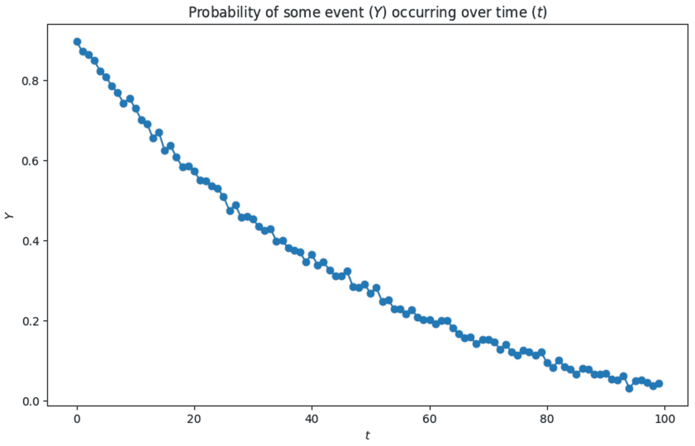
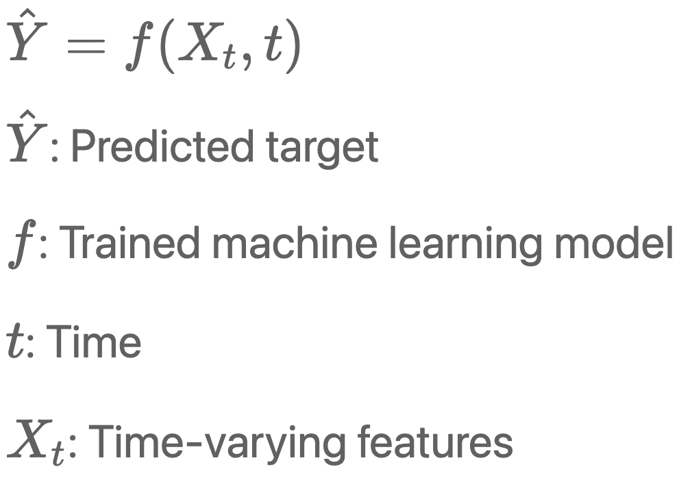
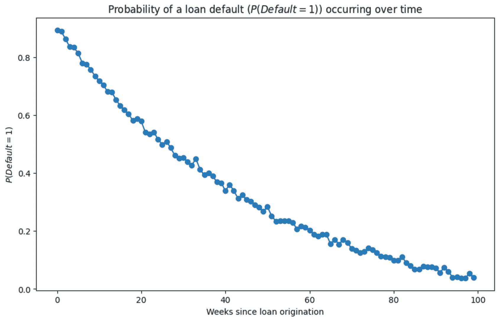
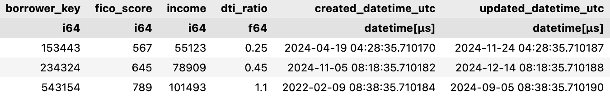
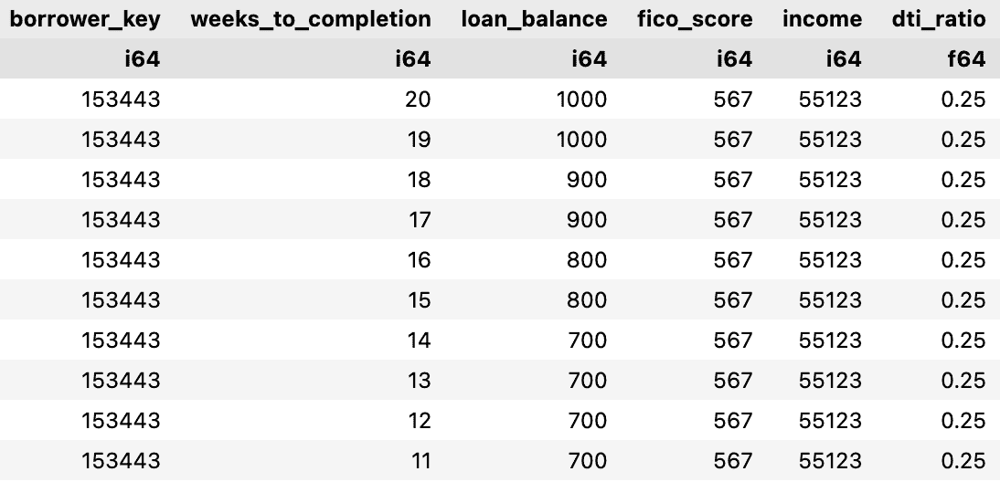
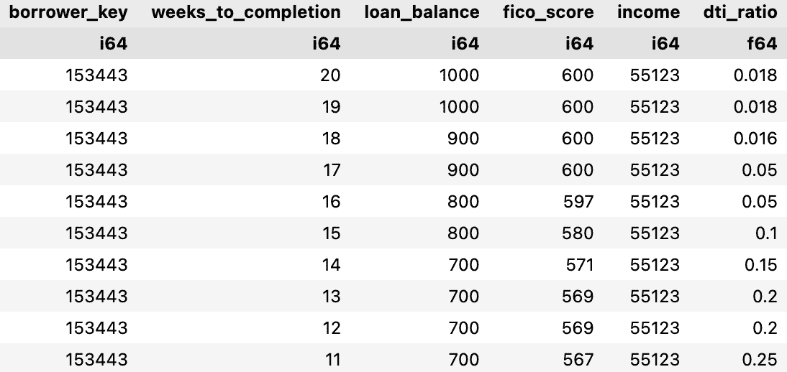
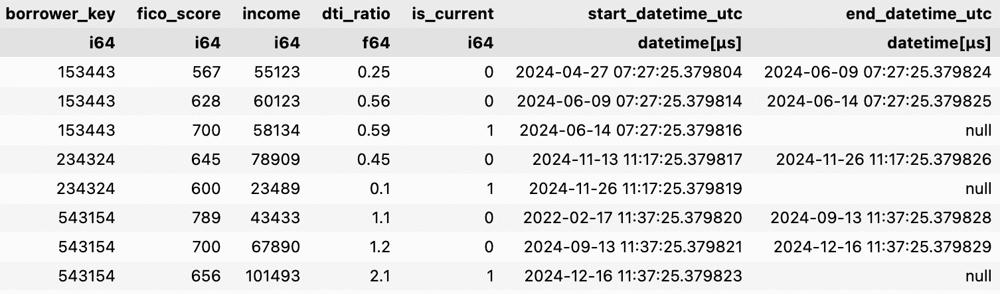
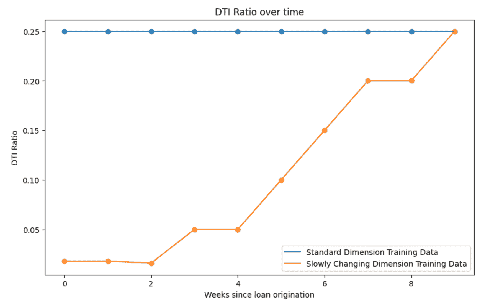
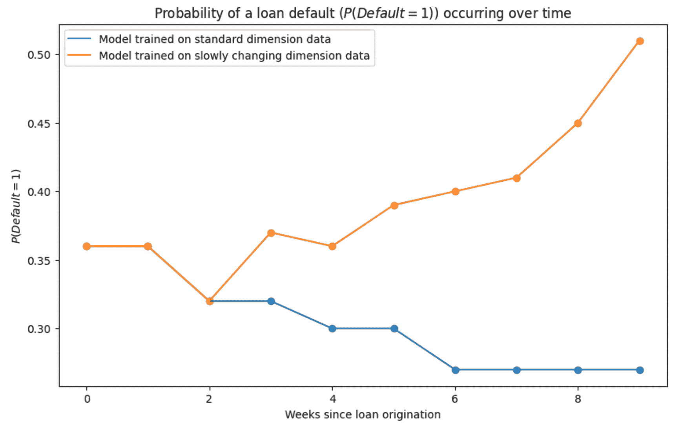

# 智能模型的秘诀：跟踪特征历史

> [`towardsdatascience.com/the-key-to-smarter-models-tracking-feature-histories-a9e3baadd52a/`](https://towardsdatascience.com/the-key-to-smarter-models-tracking-feature-histories-a9e3baadd52a/)

我最近在职业上略有转变，从数据科学转向了一个更侧重于工程的角色。我的团队正在构建一个高质量的数据仓库，以满足组织 BI 和 ML 的需求。我接受这个职位是因为我认为这是一个利用我从数据科学角色中获得洞察力来影响具有前瞻性数据仓库设计和开发的机会。

在我过去 6 年中担任的几乎每一个数据科学角色中，我注意到一个共同的主题——数据基础设施没有考虑到数据科学。数据仓库/数据湖中的许多表，通常是事实和维度，缺乏构建高性能机器学习模型所需的临界字段或结构。我注意到最普遍的限制是，大多数表只跟踪观察的当前状态，而不是历史。

本文探讨了这个问题，并展示了如何通过一种称为“缓慢变化维度”的数据建模技术来解决它。到那时，你将了解存储历史数据对模型性能的影响，并拥有帮助你在用例中实施这些策略的策略。

## 数据科学家常见的诅咒

如果你作为数据科学家或机器学习工程师工作的时间足够长，你很可能遇到过以下建模问题。对于你数据中的每个实例，你都想对随时间发生的事件的概率进行建模：

在每个时间步建模事件发生概率。图片由作者提供。

这种建模范式，通常被称为面板建模，无处不在。任何**特征与时间交互**的建模问题都可以，并且通常**应该**以这种方式进行建模。**常见例子**包括客户流失预测、贷款违约预测、疾病进展监测、欺诈检测、设备故障预测等等。

更正式地说，你可以用以下符号描述这个问题：

面板机器学习模型的符号。图片由作者提供。

以贷款违约预测为例。通用的目标是预测每个时间周期（**t**）内个人是否会违约（**Y**），这是基于自贷款起源以来随时间变化的借款人特征（**X**）。对于一个特定的借款人，你的模型预测可能看起来像这样：

随着时间的推移，对借款人预测的贷款违约概率。图片由作者提供。

在这个图中，t = 0 是贷款发放周，t = 100 是贷款到期时。对于这个例子，模型预测借款人的违约概率随着贷款接近完成而降低，但这并不总是如此，这取决于个人的信用状况和其他相关特征。

为了为这个模型创建特征，你可能会依赖数据仓库中的几个事实和维度表。例如，许多特征可能来自记录借款人属性的`dim_borrower`维度表。在许多在其生命周期后期采用机器学习项目的组织中，`dim_borrower`表看起来像这样：

典型的借款人维度表。图片由作者提供。

`dim_borrower`中的每一行记录了一个由`borrower_key`唯一标识的借款人属性。例如，借款人 153443 目前有一个 567 的 FICO 评分，收入为$55,123，DTI 比率为 0.25。`created_datetime_utc`是记录创建的时间，`updated_datetime_utc`是记录最后更新的时间。

这些类型维度表的问题在于它们没有跟踪历史记录。在上面的例子中，你不知道当记录在`2024–04–19`创建时，借款人 153443 的 FICO 评分、收入和 DTI 比率是多少。你也不知道记录更新了多少次或哪些特征被更新了。你所知道的就是借款人的当前特征、记录创建的时间以及最近一次更新的时间。

如果你构建一个包含借款人 153443 数据的面板训练集，它可能看起来像这样：

一个例子，面板训练集包含一个借款人的数据，该数据来自一个不跟踪历史的维度表。图片由作者提供。

这个训练数据的问题在于，直到`weeks_to_completion` = 0，即你有借款人特征最新记录时，它可能是不正确的。实际上，借款人数据的历程可能看起来更像是这样：

借款人面板训练集应该是什么样的。图片由作者提供。

这组数据讲述了一个与原始训练数据不同的故事，原始训练数据将借款人最新的特征应用于其历史记录。您可以看到，借款人的 FICO 分数从第 20 周降至第 11 周，其 DTI 比率从 0.018（几乎无债务）升至 0.25。这些变化表明，借款人在这些周内积累了更多的外部债务，其信用状况恶化。在这个数据集上训练的模型将远远优于在未保留借款人特征历史记录的数据集上训练的模型。

现在您已经了解了不跟踪历史记录的表的问题，您将探索解决此问题的最佳和最受欢迎的方法之一——缓慢变化维度。

## 解决方案：缓慢变化维度

跟踪维度历史记录的最佳和最受欢迎的方法之一是通过一种称为**缓慢变化维度（SCD）**的数据建模范式。SCD 就像它的名字一样——一个相对稳定的维度，随着时间的推移（缓慢）发生变化。有四种类型的 SCD，但最常见的是 SCD 类型 II。

贷款借款维度是一个完美的 SCD 候选者。在 SCD 模式下，像这样的标准维度表：

一个典型的借款维度表。图片由作者提供。

变成这样：

一个 SCD 类型 II 借款维度表。图片由作者提供。

在这个借款 SCD 中，每一行代表借款人在由 `start_datetime_utc` 和 `end_datetime_utc` 定义的某个时间间隔内的属性。例如，从大约 2024-04-27 到 2024-06-09，借款人 153443 的 FICO 分数为 567，收入为 55,123 美元，DTI 比率为 0.25。每个借款人的当前状态记录在 `is_current` = 1 或 `end_datetime_utc` 为 null 时。因此，只有当 `is_current` = 1 时，`borrower_key` 才是唯一的。

考虑使用 SCD 数据对您的机器学习模型的影响。如果您用于创建机器学习模型数据集的所有表都是 SCD 或事实表，您可以使用一个准确反映特征值随时间变化如何影响目标的最优模型进行训练。

您可以轻松地将 SCD 转换为创建模型所需的面板视图。回想一下上一节中借款人 153443 的例子：

一个示例面板训练集，其中包含一个借款人从 SCD 表中提取的数据。图片由作者提供。

从训练数据的视角来看，`dti_ratio` 特征随时间的变化看起来是这样的：

非 SCD 训练集和 SCD 训练集的 DTI 比率与贷款发放以来周数的关系。图片由作者提供。

在标准维度数据上训练的模型无法看到 DTI 比率随时间的变化，也无法准确模拟 DTI 比率的变动如何影响贷款违约的概率。相反，在 SCD 数据上训练的模型可以完全了解借款人 DTI 比率的历史，并将其纳入其预测中。

在生产环境中，如果你比较两个模型对同一借款人的预测，你可能会得到截然不同的结果：

使用在非 SCD 数据上训练的模型（蓝色）和在 SCD 数据上训练的模型（橙色）对同一借款人的模型预测。图片由作者提供。

在推理时间，使用标准维度数据训练的模型只知道借款人的当前特征值。在借款人 153443 的情况下，这个模型只能看到贷款余额随时间减少或保持不变。因此，除非借款人的特征值移动到训练数据中表示违约的极端范围，否则预测的违约概率将随着时间的推移稳步下降。

另一方面，在 SCD 数据上训练的模型观察到借款人的 FICO 评分下降，他们的 DTI 比率上升。因此，随着时间的推移，借款人风险增加，违约预测概率也随之上升。

你可能可以想象出更多使用 SCD 或一般跟踪完整历史的表会有用的场景。为了结束这篇文章，你将得到一些关于你可以在组织中开始使用 SCD 的建议。

## 行动呼吁

根据你的角色，你可以倡导使用 SCD 或其他历史跟踪表来提高你组织中机器学习模型的质量。

**数据工程师**

如果你是一名数据工程师，你很可能在数据仓库/数据湖的设计中至少有一些话语权。如果你不确定一个表是否应该跟踪历史，默认情况下，它可能应该这样做。虽然实施 SCD 需要更复杂的 ETL，但它带来的价值通常值得付出努力。

你最常遇到的反对意见是存储成本的增加，但大多数现代数据平台由于列式存储格式，存储成本都很低。

**数据科学家/机器学习工程师**

作为数据科学家/机器学习工程师，你可能在数据仓库/数据湖设计方面的话语权较小，尤其是如果机器学习模型不是你组织数据的主要消费者。尽你所能倡导跟踪历史的表。

如果你无法影响你消费的上游表，开始在你特征存储或为你的模型提供数据的集中跟踪历史。可能需要一段时间你才能利用你收集到的历史数据，但尽早开始总是更好的。

**产品经理**

可能影响创建历史跟踪表的最佳方式是将它们作为产品需求。机器学习模型的好坏取决于其训练数据，而使用无历史数据的模型永远无法达到其全部潜力。为了构建最高质量的机器学习产品，你需要最高质量的数据，而跟踪历史的数据集对于高质量模型是基本的。

## 最后的想法

跟踪特征历史是构建更智能机器学习模型的必备条件。通过将历史数据纳入你的数据集中，你捕捉到了上下文和时序动态，提高了预测准确性和模型鲁棒性。

采用历史数据跟踪确实会带来挑战，例如增加存储需求和更复杂的 ETL 流程。然而，在模型性能和洞察力方面的回报远远超过了这些成本。对于数据工程师、数据科学家和产品经理来说，将历史跟踪作为一项基础原则可以提升你们组织的数据基础设施和机器学习能力。

如果需要，从小处着手——倡导在关键表中进行变更，将历史跟踪集成到特征存储中，或将 SCD 集成到新的数据管道中。历史数据的价值随着时间的推移而增长，你开始得越早，你的模型就越能定位到提供可操作、上下文感知预测的最佳位置。

通过关注特征历史，你不仅是在构建更好的模型，你还在为更深入洞察和未来准备的数据生态系统打下基础。

*成为会员：[`harrisonfhoffman.medium.com/membership`](https://harrisonfhoffman.medium.com/membership)*

## 参考文献

1.  _ 缓慢变化维度 – [`zh.wikipedia.org/wiki/缓慢变化维度`](https://zh.wikipedia.org/wiki/缓慢变化维度)_
