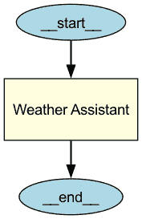
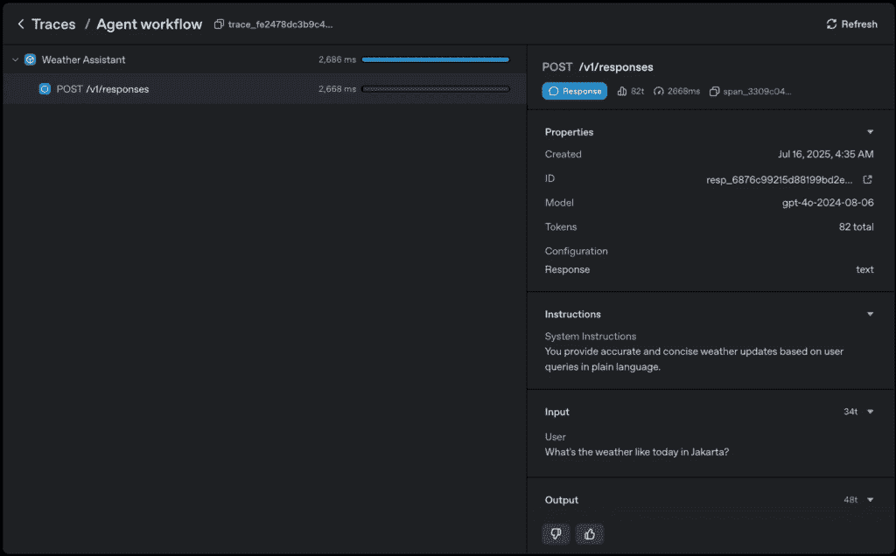
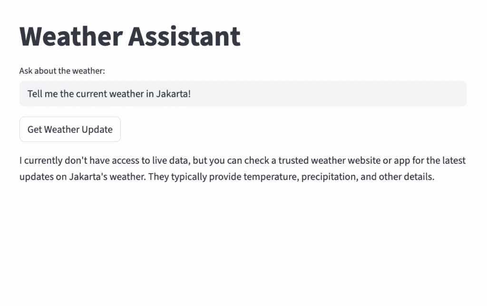
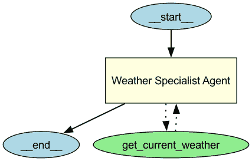
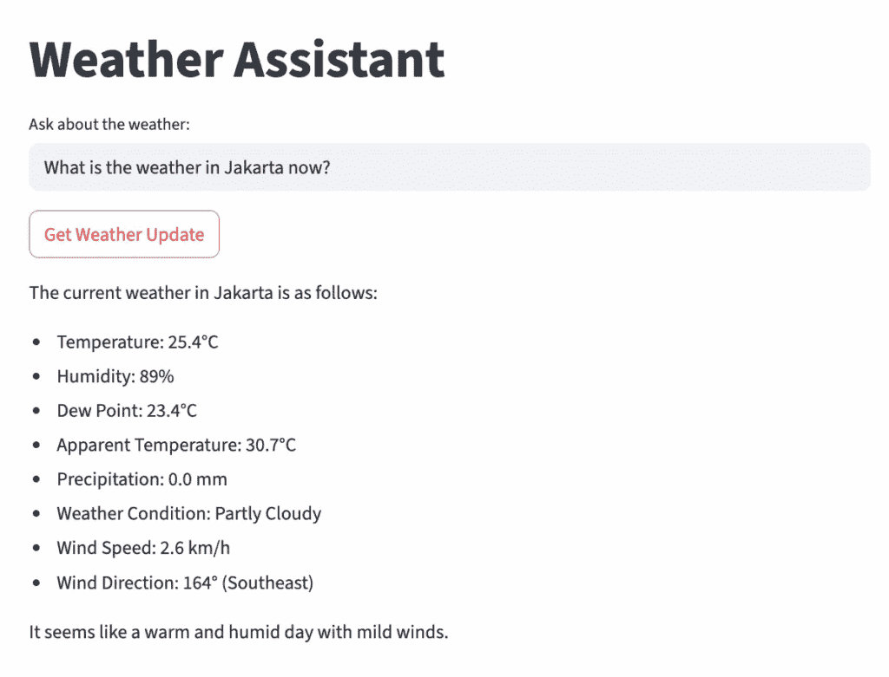
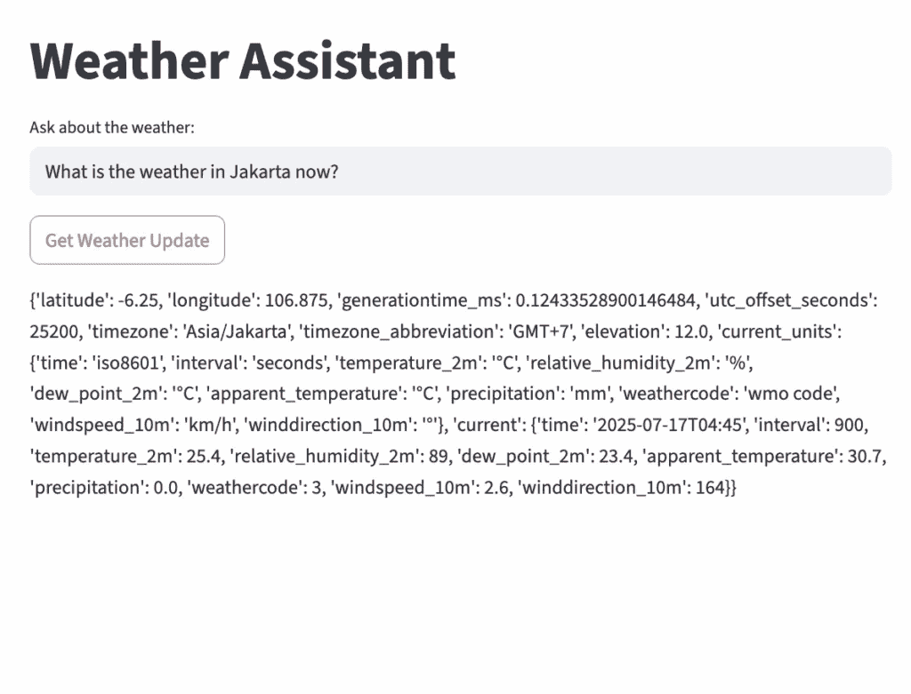
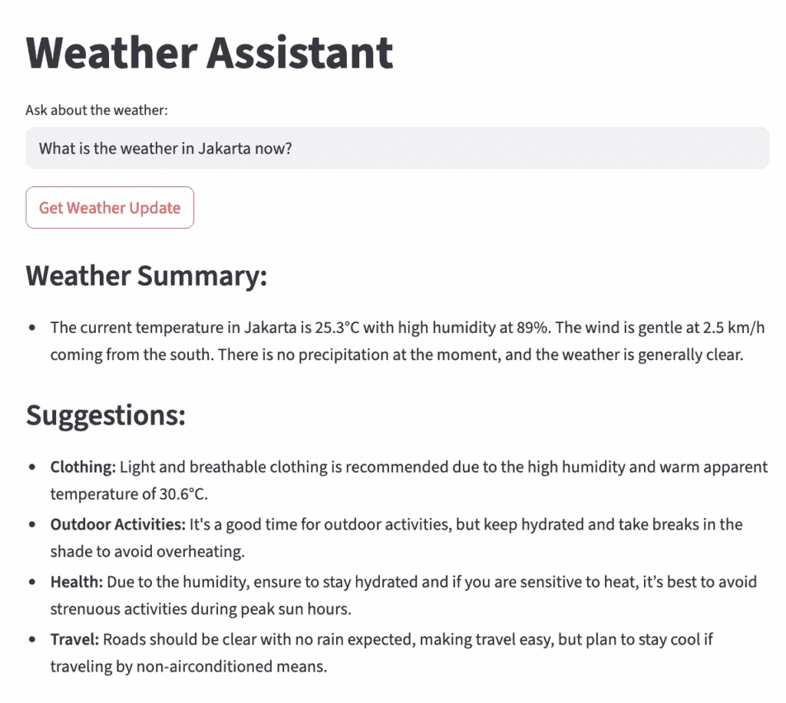

# 实践操作：与 Agents SDK 一起：您的第一个 API 调用代理

> 原文：[`towardsdatascience.com/hands%e2%80%91on-with-agents-sdk-your-first-api%e2%80%91calling-agent/`](https://towardsdatascience.com/hands%e2%80%91on-with-agents-sdk-your-first-api%e2%80%91calling-agent/)

<mdspan datatext="el1753142599864" class="mdspan-comment">围绕 LLMs 的当前热潮现在正在演变为代理式 AI 的热潮。虽然我希望这篇文章不会落入“过度炒作”的类别，但我个人认为这个话题很重要去学习。作为一个来自数据和数据分析背景的人，我发现熟悉它可以在日常工作中非常有帮助，并为它可能如何重塑当前流程做好准备。*

我在代理式 AI 方面的旅程仍然相当新（毕竟，这是一个相对较新的话题），我仍在学习过程中。在这个系列文章中，我想分享一个针对初学者的、逐步的指南，基于我的个人经验开发代理式 AI——重点关注 OpenAI Agents SDK 框架。我计划在本系列中涵盖的一些主题包括：工具使用代理、多代理协作、结构化输出、生成数据可视化、聊天功能等。所以请保持关注！

在本文中，我们将从构建一个基本代理开始，然后将其增强为能够从 API 中检索数据的工具使用代理。最后，我们将使用简单的 Streamlit UI 将一切封装起来，以便用户可以与我们构建的代理进行交互。

在本指南中，我们将始终专注于单个用例：创建一个天气助手应用。我选择这个例子是因为它对每个人来说都很亲切，涵盖了我想分享的大部分主题。由于用例简单且通用，您可以轻松地将此指南应用于自己的项目。

*本文末尾提供了 GitHub 仓库链接和部署的 Streamlit 应用链接。*

## OpenAI Agents SDK 简介简述

OpenAI Agents SDK 是一个基于 Python 的框架，允许我们以简单且易于使用的方式创建代理式 AI 系统 [1]。作为一名初学者，我发现这个说法非常真实，这使得学习之旅感觉不那么令人生畏。

该框架的核心是“代理”——我们可以通过特定指令和工具对其进行配置的大型语言模型 (LLMs)。

如我们所知，LLM 在大量数据上进行训练，使其在理解人类语言和生成文本或图像方面具有强大的能力。当与清晰的指令和与工具交互的能力相结合时，它不仅仅是一个生成器——它可以行动并成为一个代理 [2]。

工具的一个实际用途是使代理能够从外部来源检索事实数据。这意味着 LLM 不再仅仅依赖于其（通常是过时的）训练数据，从而使其能够产生更准确和更新的结果。

在本文中，我们将通过构建一个能够从 API 中检索“实时”数据的代理来关注这一优势。让我们开始吧！

## 设置环境

创建一个包含以下两个重要包的 `requirements.txt` 文件。我更喜欢使用 `requirements.txt` 的两个原因：可重用性和为 Streamlit 部署准备项目。

```py
openai-agents
streamlit
```

接下来，设置一个名为 `venv` 的虚拟环境并安装上述列表中的包。在您的终端中运行以下命令：

```py
python −m venv venv
source venv/bin/activate      # On Windows: venv\Scripts\activate
pip install -r requirements.txt
```

最后，由于我们将使用 OpenAI API 调用 LLM，您需要有一个 API 密钥（[在此获取您的 API 密钥](http://platform.openai.com/api-keys)）。按照以下方式将此密钥存储在 `.env` 文件中。**重要提示：**如果您使用 Git 进行此项目，请确保将 `.env` 添加到 `.gitignore` 文件中。

```py
OPENAI_API_KEY=your_openai_key_here
```

一切设置完毕后，您就可以开始了！

## 简单代理

让我们从创建一个名为 `01-single-agent.py` 的 Python 文件开始，创建一个简单的代理。

### 导入库

在脚本中，我们首先需要做的是导入必要的库：

```py
from agents import Agent, Runner
import asyncio

from dotenv import load_dotenv
load_dotenv()
```

从 Agents SDK 包中，我们使用 `Agent` 来定义代理，使用 `Runner` 来运行它。我们还导入 `asyncio` 以使我们的程序能够在不等待一个任务完成之前开始另一个任务。

最后，`dotenv` 包中的 `load_dotenv` 加载我们在 `.env` 文件中定义的早期环境变量。在我们的例子中，这包括 `OPENAI_API_KEY`，它将在我们定义和调用代理时默认使用。

### 定义简单代理



天气助手代理的结构。

使用 GraphViz 生成。

接下来，我们将定义一个简单的代理，称为 **天气助手**。

```py
agent = Agent(
    name="Weather Assistant",
    instructions="You provide accurate and concise weather updates based on user queries in plain language."
)
```

代理可以用几个属性来定义。在这个简单的例子中，我们只为代理配置了 `name` 和 `instructions`。如果需要，我们还可以指定要使用的 LLM 模型。例如，如果我们想使用较小的模型，如 `gpt-4o-mini`（当前默认模型是 `gpt-4o`），我们可以添加如下配置。

```py
agent = Agent(
    name="Weather Assistant",
    instructions="You provide accurate and concise weather updates based on user queries in plain language.",
    model="gpt-4o-mini"
)
```

在本文和下一篇文章中，我们将稍后介绍其他几个参数。目前，我们将保持模型配置如上所示简单。

定义代理后，下一步是创建一个异步函数来运行代理。

```py
async def run_agent():
    result = await Runner.run(agent, "What's the weather like today in Jakarta?")
    print(result.final_output)
```

`Runner.run(agent, ...)` 方法调用 `agent` 并使用查询 *“今天在雅加达的天气怎么样？”*。`await` 关键字使函数暂停，直到任务完成，同时允许其他异步任务（如果有）在此期间运行。此任务的结果存储在 `result` 变量中。要查看输出，我们将 `result.final_output` 打印到终端。

我们需要添加的最后部分是程序的入口点，以便在脚本运行时执行函数。我们使用 `asyncio.run` 来执行 `run_agent` 函数。

```py
if __name__ == "__main__":
    asyncio.run(run_agent())
```

### 运行简单代理

现在，让我们在终端中运行脚本，执行以下命令：

```py
python 01-single-agent.py
```

结果很可能是代理表示无法提供信息。这是预期的，因为 LLM 是在历史数据上训练的，并且无法访问实时天气条件。

> *我无法提供实时信息，但您可以检查可靠的天气网站或应用程序，获取雅加达今天最新的天气更新。*

在最坏的情况下，代理可能会通过返回随机温度并根据该值提供建议来产生幻觉。为了处理这种情况，我们将在稍后强制代理调用 API 以检索实际的天气条件。

### 使用 Trace

Agents SDK 的一个有用功能是 **Trace**，它允许您可视化、调试和监控您构建和执行的代理的工作流程。您可以通过以下链接访问跟踪仪表板：[`platform.openai.com/traces`](https://platform.openai.com/traces)。

对于我们的简单代理，跟踪将看起来像这样：



跟踪仪表板截图。

在此仪表板中，您可以找到有关工作流程执行的有用信息，包括每个步骤的输入和输出。由于这是一个简单的代理，我们只有一个代理运行。然而，随着工作流程变得更加复杂，此跟踪功能将非常有助于跟踪和调试过程。

### 使用 Streamlit 的用户界面

之前，我们构建了一个简单的脚本来定义和调用代理。现在，让我们通过添加 Streamlit 用户界面使其更加交互式 [3]。

让我们创建一个名为 `02-single-agent-app.py` 的脚本，如下所示：

```py
from agents import Agent, Runner
import asyncio
import streamlit as st
from dotenv import load_dotenv

load_dotenv()

agent = Agent(
    name="Weather Assistant",
    instructions="You provide accurate and concise weather updates based on user queries in plain language."
)

async def run_agent(user_input: str):
    result = await Runner.run(agent, user_input)
    return result.final_output

def main():
    st.title("Weather Assistant")
    user_input = st.text_input("Ask about the weather:")

    if st.button("Get Weather Update"):
        with st.spinner("Thinking..."):
            if user_input:
                agent_response = asyncio.run(run_agent(user_input))
                st.write(agent_response)
            else:
                st.write("Please enter a question about the weather.")

if __name__ == "__main__":
    main()
```

与之前的脚本相比，我们现在导入 Streamlit 库来构建一个交互式应用程序。代理定义保持不变，但我们修改了 `run_agent` 函数以接受用户输入并将其传递给 `Runner.run` 函数。现在，该函数不再直接将结果打印到控制台，而是返回结果。

在 `main` 函数中，我们使用 Streamlit 组件构建界面：设置标题，添加用于用户输入的文本框，并创建一个触发 `run_agent` 函数的按钮。

代理的响应存储在 `agent_response` 中，并使用 `st.write` 组件显示。要在浏览器中运行此 Streamlit 应用程序，请使用以下命令：

```py
streamlit run 02-single-agent-app.py
```



使用 Streamlit 的单代理应用程序截图

要停止应用程序，请在您的终端中按 `Ctrl + C`。

为了使文章专注于 Agents SDK 框架，我尽量使 Streamlit 应用程序保持简单。但这并不意味着您需要停止在这里。Streamlit 提供了各种组件，允许您发挥创意，使您的应用程序更加直观和吸引人。要获取组件的完整列表，请查看参考部分中的 Streamlit 文档。

从现在开始，我们将继续使用这个基本的 Streamlit 结构。

## 工具使用代理

正如我们在上一节中观察到的，代理在询问当前天气状况时可能会遇到困难。它可能返回没有信息，或者更糟糕的是，产生幻觉的回答。为了确保我们的代理使用真实数据，我们可以允许它调用外部 API，以便它可以检索实际信息。

这个过程是使用代理 SDK 中的**工具**的一个实际示例。一般来说，工具使代理能够采取行动——例如获取数据、运行代码、调用 API（我们很快就会这样做），甚至与计算机交互 [1]。使用工具和采取行动是区分代理和典型 LLM 的关键能力之一。

让我们深入代码。首先，创建另一个名为`03-tooluse-agent-app.py`的文件。

### 导入库

我们需要以下库：

```py
from agents import Agent, Runner, function_tool
import asyncio
import streamlit as st
from dotenv import load_dotenv
import requests

load_dotenv()
```

注意，从代理 SDK 中，我们现在导入一个额外的模块：`function_tool`。由于我们将调用外部 API，我们还导入`requests`库。

### 定义函数工具

我们将使用的 API 是 Open-Meteo [4]，它为非商业用途提供免费访问。它提供许多功能，包括天气预报、历史数据、空气质量等。在本篇文章中，我们将从最简单的功能开始：检索当前天气数据。

作为附加说明，Open-Meteo 提供了一个自己的库，`openmeteo-requests`。然而，在本指南中，我使用了一个更通用的方法，使用`requests`模块，目的是使代码可用于其他目的和 API。

这是如何定义一个函数来使用 Open-Meteo 获取特定位置的当前天气的示例：

```py
@function_tool
def get_current_weather(latitude: float, longitude: float) -> dict:
    """
    Fetches current weather data for a given location using the Open-Meteo API.

    Args:
        latitude (float): The latitude of the location.
        longitude (float): The longitude of the location.

    Returns:
        dict: A dictionary containing the weather data, or an error message if the request fails.
    """
    try:
        url = "https://api.open-meteo.com/v1/forecast"
        params = {
            "latitude": latitude,
            "longitude": longitude,
            "current": "temperature_2m,relative_humidity_2m,dew_point_2m,apparent_temperature,precipitation,weathercode,windspeed_10m,winddirection_10m",
            "timezone": "auto"
        }
        response = requests.get(url, params=params)
        response.raise_for_status()  # Raise an error for HTTP issues
        return response.json()
    except requests.RequestException as e:
        return {"error": f"Failed to fetch weather data: {e}"}
```

函数接收`latitude`和`longitude`作为输入以识别位置并构建 API 请求。参数包括温度、湿度、风速等指标。如果 API 请求成功，它将返回作为 Python 字典的 JSON 响应。如果发生错误，它将返回错误消息。

为了使函数对代理可用，我们使用`@function_tool`对其进行装饰，允许代理在用户的查询与当前天气数据相关时调用它。

此外，我们在函数中包含一个文档字符串，提供其目的的描述和其参数的详细信息。包含文档字符串对于代理理解如何使用函数非常有帮助。

### 定义工具使用代理



天气专家代理的结构，一个工具使用代理。

使用 GraphViz 生成。

在定义函数之后，让我们继续定义代理。

```py
weather_specialist_agent = Agent(
    name="Weather Specialist Agent",
    instructions="You provide accurate and concise weather updates based on user queries in plain language.",
    tools=[get_current_weather],
    tool_use_behavior="run_llm_again"
)

async def run_agent(user_input: str):
    result = await Runner.run(weather_specialist_agent, user_input)
    return result.final_output
```

在大多数情况下，结构与上一节相同。然而，由于我们现在使用工具，我们需要添加一些额外的参数。

第一个是`tools`，这是一个代理可以使用的工具列表。在这个例子中，我们只提供了`get_current_weather`工具。接下来是`tool_use_behavior`，它配置了工具使用的方式。对于这个代理，我们将它设置为`"run_llm_again"`，这意味着在收到 API 的响应后，LLM 将进一步处理它，并以清晰、易于阅读的格式呈现。或者，你可以使用`"stop_on_first_tool"`，其中 LLM 将不会进一步处理工具的输出。我们稍后会实验这个选项。

脚本的其余部分遵循我们之前构建主 Streamlit 函数时使用的相同结构。

```py
def main():
    st.title("Weather Assistant")
    user_input = st.text_input("Ask about the weather:")

    if st.button("Get Weather Update"):
        with st.spinner("Thinking..."):
            if user_input:
                agent_response = asyncio.run(run_agent(user_input))
                st.write(agent_response)
            else:
                st.write("Please enter a question about the weather.")

if __name__ == "__main__":
    main()
```

确保保存脚本，然后在终端中运行它：

```py
streamlit run 03-tooluse-agent-app.py
```

你现在可以询问你所在城市的天气问题。例如，当我询问雅加达当前的天气时——在撰写本文时（大约凌晨四点）——响应如下：



使用 Streamlit 的截图，展示工具使用代理应用

现在，代理不再进行幻觉，而是可以提供可读的雅加达当前天气状况。你可能还记得，`get_current_weather`函数需要经纬度作为参数。在这种情况下，我们依赖 LLM 提供这些信息，因为它很可能已经训练了基本的位置信息。未来的改进将是添加一个工具，根据城市名称检索更准确的地理位置。

#### （可选）使用“stop_on_first_tool”

出于好奇，让我们尝试将`tool_use_behavior`参数更改为`"stop_on_first_tool"`并查看它返回的内容。



使用 Streamlit 的截图，展示带有 stop_on_first_tool 选项的工具使用代理应用

如预期的那样，没有 LLM 的帮助来解析和转换 JSON 响应，输出更难以阅读。然而，在需要原始、结构化结果且无需 LLM 进行任何额外处理的情况下，这种行为可能很有用。

### 改进的指令

现在，让我们将`tool_use_behavior`参数改回`"run_llm_again"`。

正如我们所见，使用 LLM 对于解析结果非常有帮助。我们可以更进一步，通过给代理提供更详细的指令——具体来说，要求结构化输出和实用建议。为此，更新`instructions`参数如下：

```py
instructions = """
You are a weather assistant agent.
Given current weather data (including temperature, humidity, wind speed/direction, precipitation, and weather codes), provide:
1\. A clear and concise explanation of the current weather conditions.
2\. Practical suggestions or precautions for outdoor activities, travel, health, or clothing based on the data.
3\. If any severe weather is detected (e.g., heavy rain, thunderstorms, extreme heat), highlight necessary safety measures.

Format your response in two sections:
Weather Summary:
- Briefly describe the weather in plain language.

Suggestions:
- Offer actionable advice relevant to the weather conditions.
"""
```

保存更改后，重新运行应用。使用相同的问题，你现在应该会收到一个更清晰、结构良好的响应，以及实用的建议。



使用改进指令的 Streamlit 工具使用代理应用截图

<details class="wp-block-details is-layout-flow wp-block-details-is-layout-flow"><summary>`03-tooluse-agent-app.py`的最终脚本如下。</summary>

```py
from agents import Agent, Runner, function_tool
import asyncio
import streamlit as st
from dotenv import load_dotenv
import requests

load_dotenv()

@function_tool
def get_current_weather(latitude: float, longitude: float) -> dict:
    """
    Fetches current weather data for a given location using the Open-Meteo API.

    Args:
        latitude (float): The latitude of the location.
        longitude (float): The longitude of the location.

    Returns:
        dict: A dictionary containing the weather data or an error message if the request fails.
    """
    try:
        url = "https://api.open-meteo.com/v1/forecast"
        params = {
            "latitude": latitude,
            "longitude": longitude,
            "current": "temperature_2m,relative_humidity_2m,dew_point_2m,apparent_temperature,precipitation,weathercode,windspeed_10m,winddirection_10m",
            "timezone": "auto"
        }
        response = requests.get(url, params=params)
        response.raise_for_status()  # Raise an error for HTTP issues
        return response.json()
    except requests.RequestException as e:
        return {"error": f"Failed to fetch weather data: {e}"}

weather_specialist_agent = Agent(
    name="Weather Specialist Agent",
    instructions="""
    You are a weather assistant agent.
    Given current weather data (including temperature, humidity, wind speed/direction, precipitation, and weather codes), provide:
    1\. A clear and concise explanation of the current weather conditions.
    2\. Practical suggestions or precautions for outdoor activities, travel, health, or clothing based on the data.
    3\. If any severe weather is detected (e.g., heavy rain, thunderstorms, extreme heat), highlight necessary safety measures.

    Format your response in two sections:
    Weather Summary:
    - Briefly describe the weather in plain language.

    Suggestions:
    - Offer actionable advice relevant to the weather conditions.
    """,
    tools=[get_current_weather],
    tool_use_behavior="run_llm_again" # or "stop_on_first_tool"
)

async def run_agent(user_input: str):
    result = await Runner.run(weather_specialist_agent, user_input)
    return result.final_output

def main():
    st.title("Weather Assistant")
    user_input = st.text_input("Ask about the weather:")

    if st.button("Get Weather Update"):
        with st.spinner("Thinking..."):
            if user_input:
                agent_response = asyncio.run(run_agent(user_input))
                st.write(agent_response)
            else:
                st.write("Please enter a question about the weather.")

if __name__ == "__main__":
    main()
```

## 结论

到目前为止，我们已经探讨了如何创建一个简单的智能体，以及为什么我们需要一个工具使用型智能体——一个足够强大，能够回答简单智能体无法处理的关于实时天气条件的特定问题的智能体。我们还构建了一个简单的 Streamlit UI 来与这个智能体交互。

这第一篇文章仅关注智能体 AI 如何与工具交互的核心概念，而不是仅仅依赖于其训练数据来生成输出。

在下一篇文章中，我们将把重点转移到智能体 AI 的另一个重要概念：智能体协作。我们将探讨为什么多智能体系统可能比单个“超级”智能体更有效，并探讨智能体之间相互交互的不同方式。

我希望这篇文章能为你进入这些主题的旅程提供有价值的见解。

## 下一篇文章

> [亲身体验 Agents SDK：多智能体协作](https://towardsdatascience.com/hands-on-with-agents-sdk-multi-agent-collaboration/)
> 
> [亲身体验 Agents SDK：使用护栏保护输入和输出](https://towardsdatascience.com/hands-on-with-agents-sdk-safeguarding-input-and-output-with-guardrails/)

## 参考文献

[1] OpenAI. (2025). *OpenAI Agents SDK 文档*. 2025 年 7 月 19 日检索，来自 [`openai.github.io/openai-agents-python/`](https://openai.github.io/openai-agents-python/)

[2] Bornet, P., Wirtz, J., Davenport, T. H., De Cremer, D., Evergreen, B., Fersht, P., Gohel, R., Khiyara, S., Sund, P., & Mullakara, N. (2025). *智能体人工智能：利用智能体重塑商业、工作和生活*. 世界科学出版社。

[3] Streamlit Inc. (2025). *Streamlit 文档*. 2025 年 7 月 19 日检索，来自 [`docs.streamlit.io/`](https://docs.streamlit.io/)

[4] Open-Meteo. Open-Meteo API 文档。2025 年 7 月 19 日检索，来自 [`open-meteo.com/en/docs`](https://open-meteo.com/en/docs)

* * *

你可以在以下仓库中找到本文中使用的完整源代码：[agentic-ai-weather | GitHub 仓库](https://github.com/miqbalrp/agentic-ai-weather)。请随意探索、克隆或分叉项目以跟进或构建你自己的版本。

如果你想看到应用程序的实际运行效果，我还在这里部署了它：[天气助手 Streamlit](https://weather-assistant-miqbalrp.streamlit.app/)

最后，让我们在 [LinkedIn](https://www.linkedin.com/in/miqbalrp/) 上保持联系！
