# 线性代数的鸟瞰：映射的度量——行列式

> 原文：[`towardsdatascience.com/a-birds-eye-view-of-linear-algebra-measure-of-a-map-determinants/`](https://towardsdatascience.com/a-birds-eye-view-of-linear-algebra-measure-of-a-map-determinants/)

<mdspan datatext="el1749531389648" class="mdspan-comment">这是正在进行的线性代数书籍的第二章。到目前为止的目录如下：

1.  第一章：[基础](https://towardsdatascience.com/a-birds-eye-view-of-linear-algebra-the-basics/)

1.  第二章：映射的度量（当前）

关注未来章节。

线性代数是多维度的工具。无论你做什么，一旦你扩展到\( n \)维度，线性代数就会进入画面。

在[上一章](https://towardsdatascience.com/a-birds-eye-view-of-linear-algebra-the-basics/)中，我们描述了抽象的线性映射。在这一章中，我们卷起袖子开始处理矩阵。现在将开始探讨实际考虑因素，如数值稳定性、高效算法等。

注意：本文中的所有图片，除非另有说明，均为作者提供。

## I) 如何量化线性映射

行列式是线性代数中最古老的概念之一。该学科的根本在于解线性方程组。行列式将“确定”是否存在值得寻找的解。但在大多数情况下，当系统确实有解时，它还提供了进一步的有用信息。在现代线性映射的框架中，行列式提供了对线性映射的单一定量。

我们在[上一章](https://towardsdatascience.com/a-birds-eye-view-of-linear-algebra-the-basics/)中讨论了向量空间的概念（基本上是 n 维数的集合——更一般地说，是[域](https://en.wikipedia.org/wiki/Field_(mathematics)))以及在这些向量空间上操作的线性映射，将一个空间的对象映射到另一个空间。

作为这些映射的例子，一个向量空间可能是你坐着的地球表面，另一个可能是你坐着的桌子表面。世界地图的直译也是在这个意义上，因为它们“映射”地球表面的每一个点到纸张或桌面的一个点上，尽管它们不是线性映射，因为它们不保留相对面积（例如，在某种投影中，格陵兰看起来比实际大得多）。

地球表面的实际地图在线性代数的意义上也是一种地图，但它不是一个线性映射。图片由 midjourney 提供。

一旦我们为向量空间（空间中*n*个“独立”向量的集合；在一般情况下可能有无限种选择）选择了一个基，该向量空间上的所有线性映射都会被分配唯一的矩阵。

目前，让我们将注意力限制在将向量从*𝑛*-维空间映射回*𝑛*-维空间的映射（我们稍后会进行推广）。对应这些线性映射的矩阵是*𝑛×𝑛*（参见第一章第 III 节）。量化这样一个线性映射可能是有用的，用单个数字表达其对向量空间*ℝⁿ*的影响。我们处理的那种映射实际上将向量从*ℝⁿ*“扭曲”成同一空间中的其他向量。原始向量*𝑣*和映射转换成的向量*𝑢*都有一些长度（比如说*|𝑣|*和*|𝑢|*）。我们可以考虑向量长度被映射改变的程度，*|𝑢|∕|𝑣|*。也许这可以量化映射的影响？它“拉伸”向量的程度？

这种方法有一个致命的缺陷。这个比率不仅取决于线性映射，还取决于它作用的向量*𝑣*。因此，这并不是线性映射本身的严格属性。

如果我们现在取两个向量，*𝑣₁*和*𝑣₂*，它们通过线性映射转换成向量*𝑢₁*和*𝑢₂*。正如单个向量*𝑣*的度量是其长度一样，两个向量的度量是它们之间包含的平行四边形的面积。

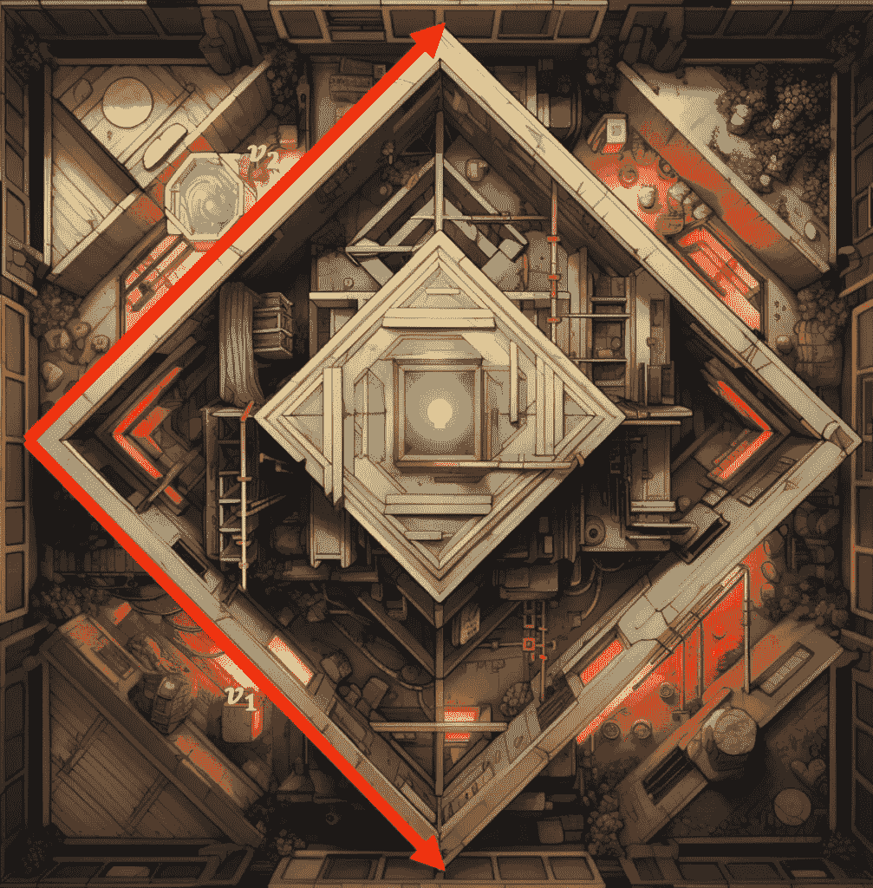

由两个向量形成的平行四边形的面积。图片由 midjourney 提供。

正如我们考虑了向量*𝑣*的长度变化量，现在我们可以谈论向量*𝑣₁*和*𝑣₂*之间的面积变化量，一旦它们通过线性映射变成*𝑢₁*和*𝑢₂*。然而，这同样不仅取决于线性映射，还取决于所选择的向量。

接下来，我们可以考虑三个向量，并考虑它们之间平行六面体的体积变化，并遇到初始向量有发言权的问题。

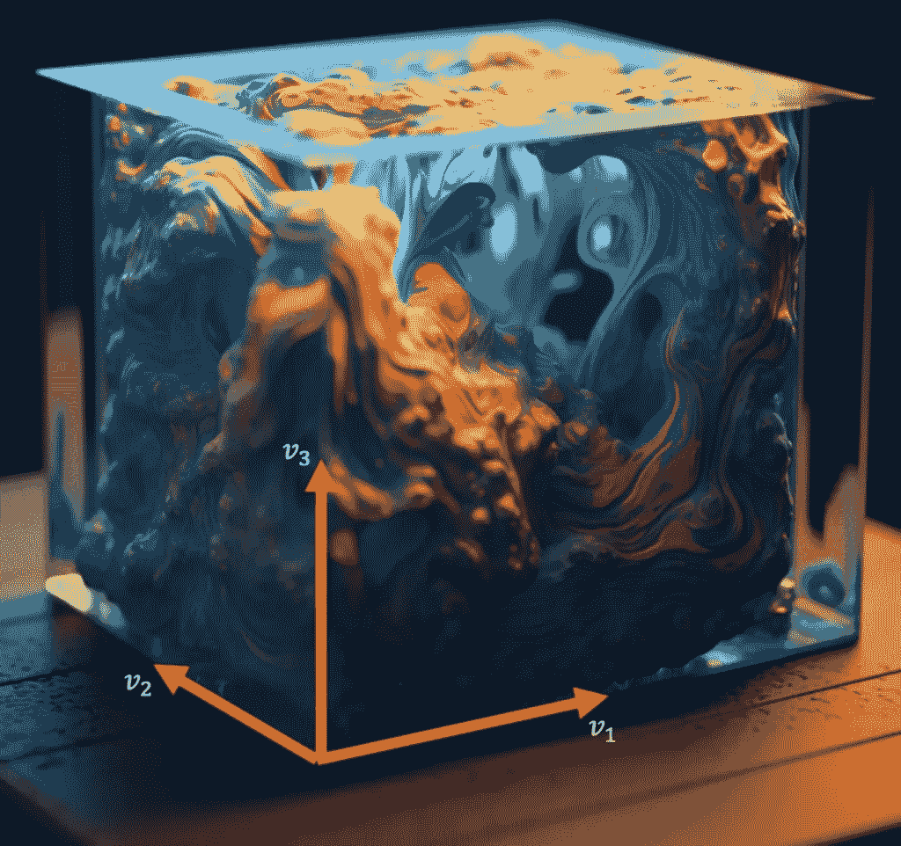

三维空间中的三维区域。如果线性映射作用于这三个向量，无论向量的初始选择如何，体积的变化量都是相同的。图片由 midjourney 提供。

但现在考虑原始向量空间中的 n 维区域。这个区域将有一些“n 维度量”。为了理解这一点，二维度量是一个面积（以平方公里为单位）。三维度量是用于测量水的体积（以升为单位）。四维度量在我们的物理世界中没有对应的物理量，但在数学上同样合理，是四维空间内包含在由四个 4-维向量形成的平行六面体内的量度的度量等等。

在二维空间中的度量是面积，而在三维空间中的度量是体积。这些概念可以扩展到四维空间以及更高维度。图片由 midjourney 提供

*n* 个原始向量 (*v₁, v₂, …, vₙ*) 构成一个平行六面体，该平行六面体被线性映射变换为 *n* 个新向量，*u₁, u₂, …, uₙ*，它们形成自己的平行六面体。然后我们可以询问新区域与原始区域在 *n* 维度上的度量关系。结果，这个比率实际上只依赖于线性映射。无论原始区域看起来如何，它在哪里，等等，线性映射作用于它之后的度量与之前的度量之比将是相同的——这是一个纯粹依赖于线性映射的函数。这个 *n* 维度量的比率（之后到之前）正是我们所寻找的：线性映射的一个**独特属性**，它用一个数字量化了其影响。

这个比率，即线性映射改变任何 *n* 维空间块度量的方式，是量化其对作用空间影响的好方法。它被称为**行列式**（这个名字的原因将在第 V 节中变得明显）。

现在，我们只是陈述了一个事实，即从 *ℝⁿ* 到 *ℝⁿ* 的线性映射“拉伸”任何 *n* 维空间块的程度只取决于映射本身，而没有提供证明，因为这里的目的是激发兴趣。我们将在武装了一些工具之后（第 VI 节），再进行证明。 

## II) 计算行列式

现在，我们如何找到一个从向量空间 *ℝⁿ* 到 *ℝⁿ* 的线性映射的行列式？我们可以取任意 *n* 个向量，找到它们之间的平行六面体的度量以及线性映射作用于所有这些向量后新平行六面体的度量。最后，将后者除以前者。

我们需要使这些步骤更加具体。首先，让我们在这个 *ℝⁿ* 向量空间中开始尝试。

*ℝⁿ* 向量空间只是 *n* 个实数的集合。最简单的向量就是 *n* 个零 — *[0, 0, …, 0]*。这是零向量。如果我们用标量乘以它，我们只会得到零向量。这没什么意思。对于下一个最简单的向量，我们可以将第一个 *0* 替换为 *1.* 这就得到了向量：*e₁ = [1, 0, 0, …, 0]*。现在，乘以标量 *c* 会给我们一个不同的向量。

$$c.[1, 0, 0,.., 0] = [c, 0, 0, …, 0]$$

我们可以用 *e₁* “生成”无限多个向量，这取决于我们选择的标量 *c*。

如果 *e₁* 是只有一个元素为 *1*，其余为 *0* 的向量，那么 *e₂* 是什么？第二个元素为 *1*，其余为 *0* 似乎是一个合理的选择。

$$e_2 = [0,1,0,0,\dots 0]$$

将这个逻辑推到极致，我们得到一个包含 *n* 个向量的集合：

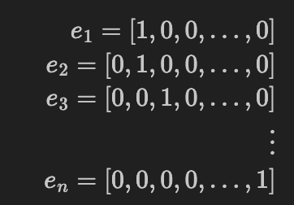

这些向量构成了 *ℝⁿ* 向量空间的一个基。这意味着什么？*ℝⁿ* 中的任何向量 *v* 都可以表示为这些 *n* 个向量的线性组合。这意味着对于某些标量 *c₁, c₂, …, cₙ*：

$$v = c_1.e_1+c_2.e_2+\dots +c_n.e_n$$

所有向量 *v* 都由向量集 *e₁, e₂, …, eₙ* “生成”。

这个特定的向量集合并不是唯一的基。任何 *n* 个向量的集合都行得通。唯一的限制是，这 *n* 个向量中没有一个应该被其余的向量“生成”。换句话说，所有 *n* 个向量应该是线性无关的。如果我们从大多数连续分布中选择 *n* 个随机数，并重复这个过程 *n* 次来创建 *n* 个向量，你将以 100% 的概率（在概率术语中是“几乎肯定”）得到一组线性无关的向量。只是随机向量偶然被一些其他 *k < n* 个随机向量“生成”的可能性非常非常小。

回到本节开头我们寻找线性映射行列式的配方，我们现在有一个基来表达我们的向量。固定基也意味着我们的线性映射可以表示为一个矩阵（参见第一章第 III 节）。由于这个线性映射是将 *ℝⁿ* 中的向量映射回 *ℝⁿ*，相应的矩阵是 *n × n*。

接下来，我们需要 *n* 个向量来形成我们的平行六面体。为什么不采用我们之前定义的标准基 *e₁, e₂, …, eₙ* 呢？这些向量之间包含的空间区域的大小恰好是 *1*，根据定义。下面的 *ℝ³* 图像可能会使这一点更清晰。

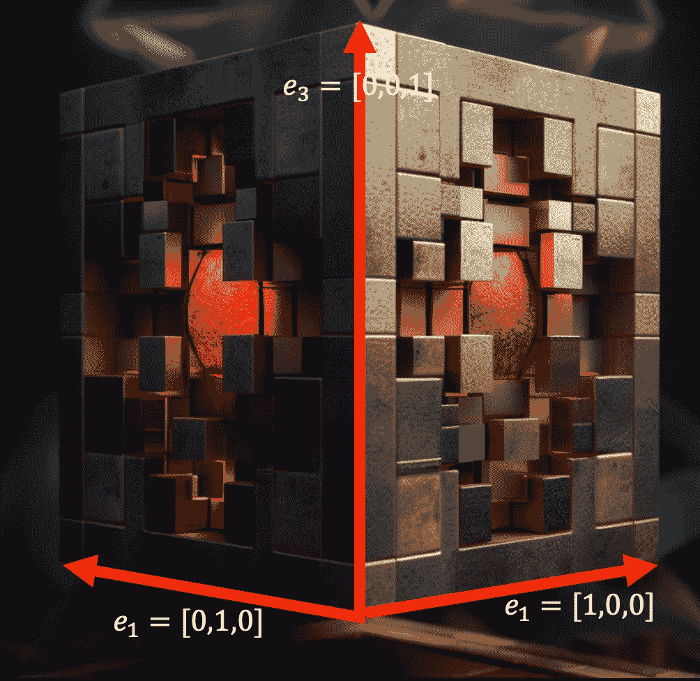

在向量 e1, e2, e3, …, en 之间包含的标准空间区域。在这种情况下，我们有三个向量，因为空间是三维的。图像由 midjourney 创建

如果我们将这些向量从标准基收集到一个矩阵中（行或列），我们得到单位矩阵（主对角线上的 1，其他地方都是 0）：

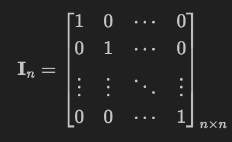

公式 (0)：单位矩阵

当我们说我们可以将我们的线性变换应用于任何 n 维空间区域时，我们也可以将其应用于这个“标准”区域。

但是，很容易证明将任何矩阵与单位矩阵相乘的结果是相同的矩阵。因此，线性变换应用后的结果向量是表示线性变换本身的矩阵的列。因此，线性变换改变“标准区域”体积的量与表示该映射本身的列向量之间的平行六面体的 n 维度量相同。

总结一下，我们最初将行列式激发为线性映射改变 n 维空间区域度量的比率。现在，我们表明这个比率本身是一个 n 维度量。特别是，任何表示线性映射的矩阵的列向量之间的度量。

## III) 激发基本性质

在上一节中，我们描述了如何确定一个线性映射的行列式应该是其任何矩阵表示中向量之间的度量。在本节中，我们使用二维空间（其中度量是面积）来激发行列式必须具有的一些基本性质。

第一个性质是多线性。行列式是一个函数，它接受一些向量（收集在一个矩阵中）并将它们映射到一个单一的标量。由于我们限制在二维空间中，我们将考虑两个二维向量。我们的行列式（因为我们已经激发它成为向量之间的平行四边形面积）可以表示为：

$$det = A(v_1, v_2)$$

如果我们在两个向量中的一个向量上添加一个向量，这个函数应该如何表现？多线性性质要求：

$$A(v_1+v_3, v_2) = A(v_1,v_2)+A(v_3,v_2)\tag{1}$$

从下面的动态图片中可以明显看出（注意新增加的面积）。

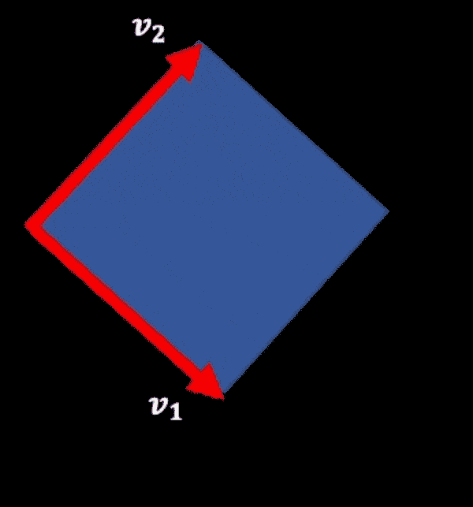

行列式的加性性质。图片由作者提供

这种可视化也可以用来看到（通过缩放其中一个向量而不是向其中添加另一个向量）：

$$A(c.v_1, v_2) = c.A(v_1, v_2) \tag{2}$$

这个第二个性质有一个重要的含义。如果我们把一个负的 *c* 值代入方程会怎样？

面积 *𝐴(𝑣₁, 𝑣₂)* 应该与 *𝐴(𝑐·𝑣₁, 𝑣₂)* 的符号相反。

这意味着我们需要引入负面积和负行列式的概念。

如果我们接受负长度的概念，这就有很多道理。如果长度——一维空间中的度量——可以是正的或负的，那么可以合理地认为面积——二维空间中的度量——也应该允许是负的。因此，任何维度的空间度量也应该如此。

一起，方程 (1) 和 (2) 是 *多线性* 性质。

另一个与行列式符号有关的重要性质是**交替性质**。它要求：

$$A(v_1, v_2) = -A(v_2, v_1)$$

交换两个向量的顺序会改变行列式的符号（或它们之间的度量）。如果你学习了三维向量的[叉积](https://en.wikipedia.org/wiki/Cross_product#:~:text=The%20cross%20product%20a%20%C3%97,parallelogram%20that%20the%20vectors%20span.)，这个性质将非常自然。为了激发它，让我们首先考虑两个位置向量之间的**一维距离**，*𝑑(𝑣₁, 𝑣₂)*。很明显，*𝑑(𝑣₁, 𝑣₂) = −𝑑(𝑣₂, 𝑣₁)*，因为我们从 *𝑣₂* 到 *𝑣₁* 的移动方向与从 *𝑣₁* 到 *𝑣₂* 的移动方向相反。同样，如果向量 *𝑣₁* 和 *𝑣₂* 之间的面积是正的，那么 *𝑣₂* 和 *𝑣₁* 之间的面积必须是负的。这个性质在 *𝑛*-维空间中也成立。如果在 *𝐴(𝑣₁, 𝑣₂, …, 𝑣ₙ)* 中交换两个向量，它会导致符号切换。

交替性质还意味着，如果其中一个向量仅仅是另一个向量的标量倍数，行列式必须是 *0*。这是因为交换这两个向量应该会改变行列式的符号：

$$\begin{align}A(v_1, v_1) = -A(v_1, v_1)\

=> 2 A(v_1, v_1) = 0\

=> A(v_1, v_1) = 0\end{align}$$

我们还通过多线性（方程 2）有：

$$A(v_1, c.v_1) = c A(v_1, v_1) = 0$$

从几何上讲，这是有意义的，因为如果两个向量相互平行，它们之间的面积是 \( 0 \)。

[视频 [6]](https://www.youtube.com/watch?v=9IswLDsEWFk) 用很好的可视化展示了这些性质的几何动机，而[视频 [4]](https://www.youtube.com/watch?v=Ip3X9LOh2dk&t=295s)则很好地可视化了交替性质。

## IV) 将代数化：推导莱布尼茨公式

在本节中，我们摆脱了几何直觉，从另一个角度——冷冰冰的代数计算的角度——来探讨行列式的问题。

看看，我们在上一节中用几何方法激发的*多线性*和*交替*性质（令人惊讶地）足以给我们一个非常具体的行列式公式，称为*莱布尼茨公式*。

该公式帮助我们看到从几何方法或其他代数公式中很难观察到的行列式的性质。

莱布尼茨公式可以简化为*拉普拉斯展开*，这涉及到沿着一行或一列进行计算，并计算*余子式*——这在许多人看来在高中就已经接触过。

让我们推导莱布尼茨公式。我们需要一个函数，它接受矩阵的*𝑛*个列向量，*𝛼₁, 𝛼₂, …, 𝛼ₙ*作为输入，并将它们转换为一个标量，*𝑐*。

$$c=f(\vec{a_1}, \vec{a_2}, \dots \vec{a_n})$$

我们可以用空间的标准基来表示每个列向量。

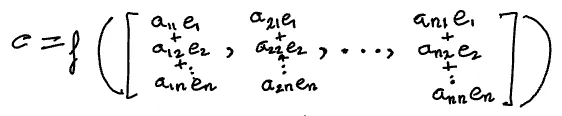

现在，我们可以应用多线性性质。目前，我们只应用到第一列，*𝛼₁*。

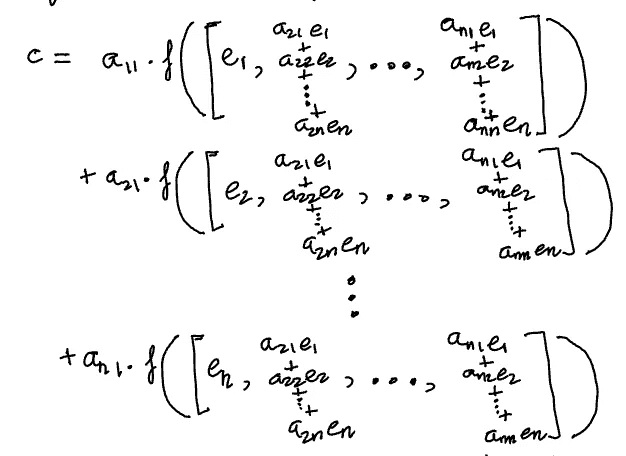

我们可以对第二列做同样的操作。让我们只取上面求和中的第一个项，看看产生的结果项。

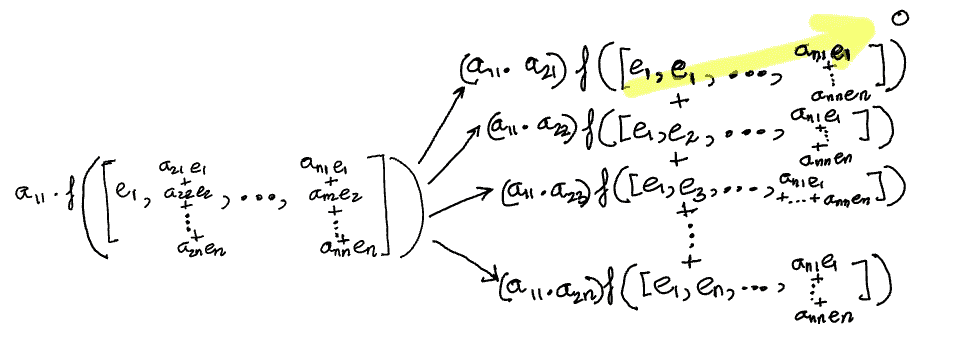

注意，在第一个项中，我们得到了向量*𝑒₁*出现了两次。根据*交替性质*，该项的函数*𝑓*变为*0*。

为了让两个*𝑒₁*出现，乘积中两个*𝑎*的第二索引都必须变成*1*。

因此，一旦我们对所有列都这样做，那些不会因为交替性质变成零的项将是那些*𝑎*的第二索引没有任何重复的项——所以是从*1*到*𝑛*的所有不同的数字。换句话说，我们正在寻找*1*到*𝑛*的排列出现在*𝑎*的第二索引中。

那么*𝑎*的第一个索引是什么呢？这些只是简单地按照顺序排列的数字*1*到*𝑛*，因为我们首先提取*𝑎₁ₓ*，然后是*𝑎₂ₓ*，依此类推。在更紧凑的代数符号中，

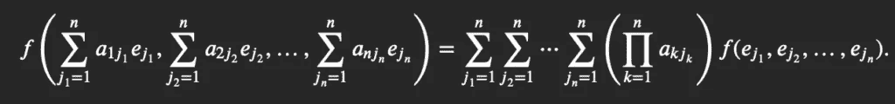

在右侧的表达式中，面积 *𝑓(𝑒_{𝑗₁}, 𝑒_{𝑗₂}, …, 𝑒_{𝑗ₙ})* 可以是 *+1*、*−1* 或 *0*，因为 *𝑒ⱼ* 都是彼此正交的单位向量。我们已经确定，任何包含重复 *𝑒ⱼ* 的项将变成 *0*，只留下排列（没有重复）。在这些排列中，我们有时会得到 *+1*，有时会得到 *−1*。

排列的概念伴随着[符号](https://en.wikipedia.org/wiki/Parity_of_a_permutation#:~:text=The%20sign%2C%20signature%2C%20or%20signum,1%20if%20%CF%83%20is%20odd.). 面积的符号等同于排列的符号。如果我们用 *𝑆ₙ* 表示所有排列的集合 *[1, 2, …, 𝑛]*，那么我们得到行列式的 *莱布尼茨公式*：

$$\det([\vec{a_1}, \vec{a_2}, \dots \vec{a_n}]) = |A| = \sum\limits_{\sigma \in S_n} sgn(\sigma) \prod \limits_{i=1}^n a_{i,\sigma(i)} \tag{3}$$

此公式也在 [mathexchange 帖子，[3]](https://math.stackexchange.com/questions/319321/understanding-the-leibniz-formula-for-determinants#:~:text=The%20formula%20says%20that%20det,permutation%20get%20a%20minus%20sign.&text=where%20the%20minus%20signs%20correspond%20to%20the%20odd%20permutations%20from%20above) 中详细描述。为了使事情更具体，这里有一些简单的 Python 代码实现了它（以及一个测试用例）。

实际上不应该使用这个公式来计算矩阵的行列式（除非只是为了娱乐或展示）。它是有效的，但考虑到对所有排列的求和（这是 *𝑛!*，这是一个超级指数），效率非常低。

然而，当使用 *莱布尼茨公式* 时，行列式的许多理论性质变得非常容易理解，如果从其另一种形式开始，它们将非常难以解析或证明。例如：

1.  **命题-1**：使用这个公式，我们可以清楚地看到矩阵和它的转置具有相同的行列式：*|𝐴| = |𝐴ᵀ|*。这是公式对称性的简单结果。

1.  **命题-2**：可以使用与上述非常相似的推导来证明，对于两个矩阵 *𝐴* 和 *𝐵*，*|𝐴𝐵| = |𝐴| ⋅ |𝐵|*。参见 [mathexchange 帖子，[8]](https://math.stackexchange.com/questions/60284/how-to-show-that-detab-deta-detb) 中的 [这个答案](https://math.stackexchange.com/a/60293/155881)。这是一个非常方便的性质，因为 [矩阵乘法](https://en.wikipedia.org/wiki/Matrix_multiplication) 在矩阵的各种分解中经常出现，并且推理这些分解的行列式可以是一个强大的工具。

1.  **命题-3**：使用 *莱布尼茨公式*，我们可以很容易地看出，如果矩阵是上三角或下三角矩阵（下三角矩阵意味着矩阵对角线以上的所有元素都是零），那么行列式就是对角线元素的乘积。这是因为除了一个排列：*(𝑎₁₁ ⋅ 𝑎₂₂ ⋯ 𝑎ₙₙ)*（主对角线）之外，其他排列都会得到某个零项，使得它们的求和项 *0*。

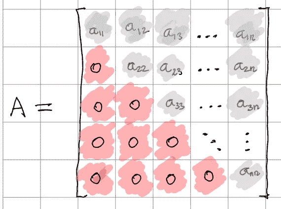

上三角矩阵。主对角线以下的所有项都是 0。

第三个事实实际上导致了计算行列式最有效的算法，这是大多数线性代数库所使用的。一个矩阵可以被有效地分解为下三角矩阵和上三角矩阵（称为 LU 分解，我们将在下一章中介绍）。在完成这种分解之后，第三个事实被用来乘以下三角矩阵和上三角矩阵的对角线以得到它们的行列式。最后，第二个事实被用来乘这两个行列式以得到原始矩阵的行列式。

许多人在高中或大学第一次接触到行列式时，会了解到拉普拉斯展开，这涉及到关于一行或一列的展开，为每个元素找到余子式并求和。这可以通过收集相似项从上述莱布尼茨展开中推导出来。请参阅[mathexchange 帖子，[2]](https://math.stackexchange.com/a/4225580/155881)的[这个答案](https://math.stackexchange.com/a/4225580/155881)。

## V) 历史动机

行列式最初是在线性方程组的背景下被发现的。假设我们有一个 *𝑛* 个变量 *(𝑥₀, 𝑥₁, …, 𝑥ₙ)* 的 *𝑛* 个方程。

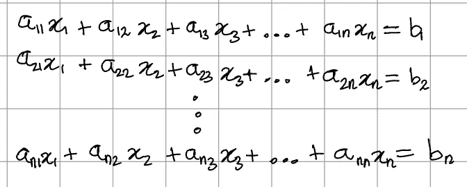

这个系统可以用矩阵形式表示：

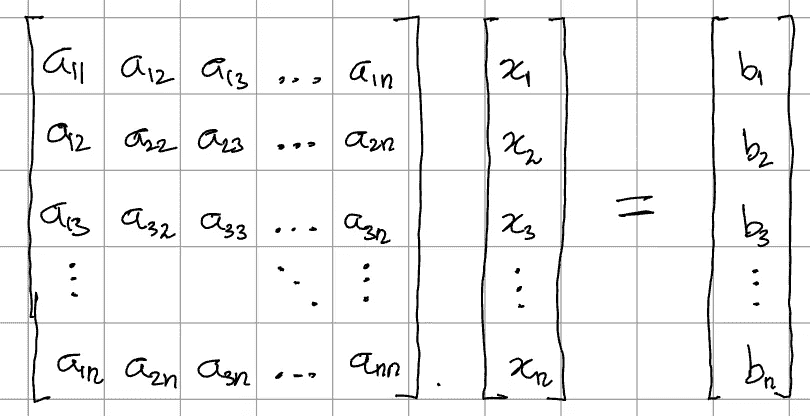

更简洁地说：

$$A.x = b$$

一个重要的问题是上述系统是否有唯一解， *x*。行列式是一个“确定”这个的函数。如果且仅当 *A* 的行列式非零时，才存在唯一解。

这个历史启发的途径将行列式解释为当我们尝试解决与线性映射相关的线性方程组时出现的多项式。我们将在第五章中更深入地探讨这一点。

更多关于这个问题的信息，请参阅[mathexchange 帖子，[8]](https://math.stackexchange.com/a/4782557/155881)中的优秀答案。

## VI) 我们用这个性质进行证明

我们在本章开始时将行列式解释为 *ℝⁿ → ℝⁿ* 线性映射改变 *n*-维空间块度量的量。我们还说过，这不适用于 1, 2, … *n − 1* 维度量。下面是一个证明，其中我们使用了我们在其他部分遇到的一些性质。

定义 *(𝑉, 𝑈)* 为 *𝑛 × 𝑘* 矩阵，其中

$$ V = (v_1, v_2, \dots, v_k) $$

根据定义，

$$|v_1, v_2, \dots, v_k| = \sqrt{\det(V^t V)} $$ 和

$$ |u_1, u_2, \dots, u_k| = \sqrt{\det(U^t U)} = \sqrt{\det((AV)^t (AV))} = \sqrt{\det(V^t A^t A V)} $$

只有当 *n = k* 时，*V* 才是一个方阵，所以

$$|v_1, v_2, \dots, v_k| = \sqrt{\det(V^t A^t A V)}$$

$$= \sqrt{\det(V^t) \det(A^t) \det(A) \det(V)} $$

$$= \det(A) \sqrt{\det(V^t V)} = \det(A) |v_1, v_2, \dots, v_k| $$

## 参考文献

[1] Mathexchange 帖子：线性映射的行列式不依赖于基： [`math.stackexchange.com/questions/962382/determinant-of-linear-transformation`](https://math.stackexchange.com/questions/962382/determinant-of-linear-transformation)

[2] Mathexchange 帖子：矩阵拉普拉斯展开的行列式（高中公式） [`math.stackexchange.com/a/4225580/155881`](https://math.stackexchange.com/a/4225580/155881)

[3] Mathexchange 帖子：理解行列式的莱布尼茨公式 [`math.stackexchange.com/questions/319321/understanding-the-leibniz-formula-for-determinants#:~:text=The%20formula%20says%20that%20det,permutation%20get%20a%20minus%20sign.&text=where%20the%20minus%20signs%20correspond%20to%20the%20odd%20permutations%20from%20above`](https://math.stackexchange.com/questions/319321/understanding-the-leibniz-formula-for-determinants#:~:text=The%20formula%20says%20that%20det,permutation%20get%20a%20minus%20sign.&text=where%20the%20minus%20signs%20correspond%20to%20the%20odd%20permutations%20from%20above).

[4] YouTube 视频：3B1B 关于行列式 [`www.youtube.com/watch?v=Ip3X9LOh2dk&t=295s`](https://www.youtube.com/watch?v=Ip3X9LOh2dk&t=295s)

[5] 将莱布尼茨公式与几何联系起来 [`math.stackexchange.com/questions/593222/leibniz-formula-and-determinants`](https://math.stackexchange.com/questions/593222/leibniz-formula-and-determinants)

[6] YouTube 视频：莱布尼茨公式是面积： [`www.youtube.com/watch?v=9IswLDsEWFk`](https://www.youtube.com/watch?v=9IswLDsEWFk)

[7] Mathexchange 帖子：行列式乘积是乘积的行列式 [`math.stackexchange.com/questions/60284/how-to-show-that-detab-deta-detb`](https://math.stackexchange.com/questions/60284/how-to-show-that-detab-deta-detb)

[8] 行列式动机的历史背景： [`math.stackexchange.com/a/4782557/155881`](https://math.stackexchange.com/a/4782557/155881)
