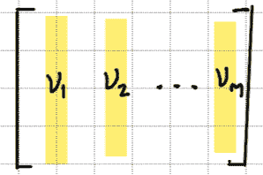
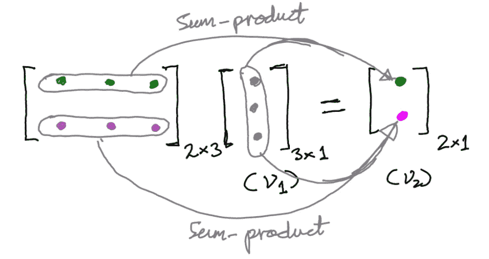
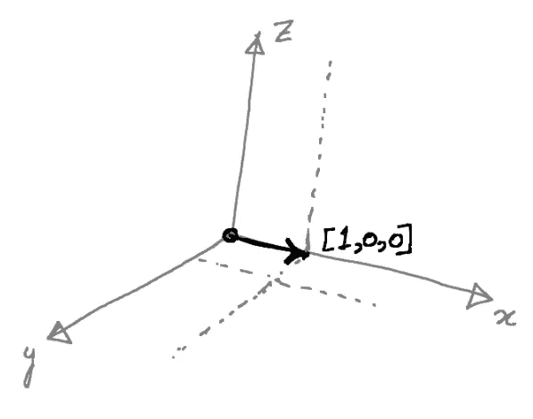
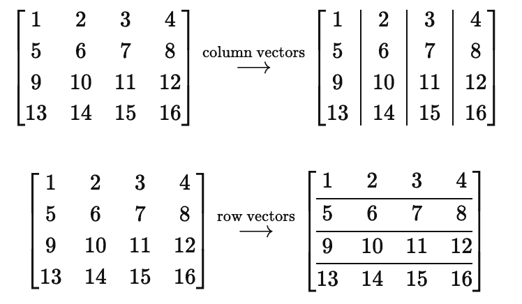
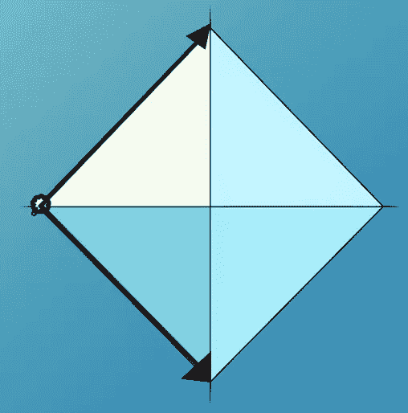
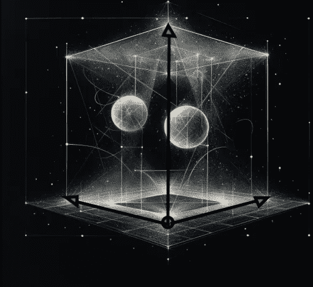

# 线性代数的鸟瞰：基础

> 原文：[`towardsdatascience.com/a-birds-eye-view-of-linear-algebra-the-basics/`](https://towardsdatascience.com/a-birds-eye-view-of-linear-algebra-the-basics/)

<mdspan datatext="el1748542439682" class="mdspan-comment">这是正在编写的线性代数书籍“线性代数的鸟瞰”的第一章</mdspan>。这本书将特别强调人工智能应用以及它们如何利用线性代数。

线性代数是数学中任何应用的基石。从物理学到机器学习，概率论（例如马尔可夫链），无论你做什么，线性代数总是在幕后潜伏，一旦事情变得多维，它就会随时出现。根据我的经验（我也从其他人那里听到过），这是高中和大学之间产生巨大冲击的根源。在高中（印度），我接触了一些非常基础的线性代数（主要是行列式和矩阵乘法）。然后在大一工程教育中，所有科目突然似乎都假定你天生就具备像特征值、雅可比矩阵等概念的能力。

本章旨在提供一个高级概述，介绍该学科中存在的重要概念及其明显的应用。

## 人工智能革命

几乎任何信息都可以嵌入到向量空间中。图像、视频、语言、语音、生物识别信息以及你能想象到的任何其他东西。所有机器学习和人工智能的应用（如最近的聊天机器人、文本到图像等）都是基于这些向量嵌入工作的。由于线性代数是处理高维向量空间的科学，因此它是不可或缺的基石。

来自我们现实世界的复杂概念，如图像、文本、语音等，可以嵌入到高维向量空间中。向量空间的维度越高，它可以编码的信息就越复杂。使用 MIdjourney 创建的图像。

许多技术涉及从一个空间中取一些输入向量，并将它们映射到另一个空间中的其他向量。

但为什么关注“线性”，而大多数有趣的功能都是非线性的？这是因为使我们的模型高维和使它们非线性（足够通用以捕捉各种复杂关系）的问题实际上是正交的。许多神经网络架构通过使用线性层并在它们之间使用简单的一维非线性来实现。而且有一个[定理](https://en.wikipedia.org/wiki/Universal_approximation_theorem)表明这种架构可以模拟任何函数。

由于我们操作高维向量的方式主要是矩阵乘法，所以说它是现代人工智能革命的基础并不夸张。

## I) 向量空间

如前文所述，当事情变得多维时，线性代数不可避免地会出现。我们从一个标量开始，它只是某种类型的数字。对于这篇文章，我们将考虑这些标量是实数和复数。一般来说，标量可以是任何对象，其中加法、减法、乘法和除法的基本运算被定义（抽象为“域”）。现在，我们想要一个框架来描述这样的数字集合（添加维度）。这些集合被称为“向量空间”。我们将考虑向量空间的元素是实数或复数的情况（前者是后者的特殊情况）。由此产生的向量空间分别被称为“实向量空间”和“复向量空间”。

线性代数中的概念适用于这些“向量空间”。最常见的例子是你的地板、桌子或你正在阅读的电脑屏幕。这些都是二维向量空间，因为你的桌子上的每个点都可以用两个数字（如下面所示）来指定（x 和 y 坐标）。这个空间表示为*R²*，因为两个实数可以指定它。

我们可以以不同的方式泛化 R²。首先，我们可以添加维度。我们生活的空间是三维的（*R³*）。或者，我们可以将其弯曲。例如，地球这样的球面（表示为*S²*），仍然是二维的，但与*R²*（它是平的）不同，它是弯曲的。到目前为止，这些空间基本上都是数字数组。但向量空间的概念更为广泛。它是一个**对象的集合**，其中以下概念应该被很好地定义：

1.  任何两个对象的加法。

1.  对象乘以一个标量（一个实数）。

此外，这些对象应该在这些操作下是“封闭”的。这意味着如果你将这些操作应用于向量空间的对象，你应该得到相同类型的对象（你不应该离开向量空间）。例如，整数集不是一个向量空间，因为标量乘法（实数）可能会给我们一些不是整数的东西（3*2.5 = 7.5，这不是一个整数）。

表达向量空间对象的一种方法是通过向量。向量需要一个任意的“基”。一个基的例子是带有方向的罗盘系统——北、南、东和西。任何方向（如“西南”）都可以用这些方向表示。这些是“方向向量”，但我们也可以有“位置向量”，其中需要一个原点和与该原点相交的坐标系。地球表面上每个位置的经纬度系统就是一个例子。经纬度对是识别你家的方法之一。但还有无限种其他方法。另一种文化可能会以略不同的角度绘制经纬度线，因此他们会为你的房子提供不同的数字。但这并不改变房子的物理位置。房子作为向量空间中的一个对象存在，而表达该位置的不同方式被称为“基”。选择一个基允许你为房子分配一对数字，选择另一个基允许你分配另一组同样有效的数字。

一个向量空间，其中每个位置都被组织得井井有条，并精确地映射到一组数字。此图像使用 Midjourney 创建。

向量空间也可以是无限维的。例如，在[2]的第 12 微型版本中，整个实数集被看作是一个无限维向量空间。

## II) 线性映射

现在我们已经知道了什么是向量空间，让我们将其提升到下一个层次，并讨论两个向量空间。由于向量空间仅仅是对象的集合，我们可以考虑一个映射，它将一个空间的对象映射到另一个空间的对象。这种映射的一个例子是最近的 AI 程序，如 Midjourney，你输入一个文本提示，它会返回一个与之匹配的图像。你输入的文本首先被转换为向量。然后，通过这样的“映射”，该向量被转换为图像空间中的另一个向量。

设*V*和*W*为向量空间（可以是实向量空间或复向量空间）。如果对于任意的两个向量*u, v ∈ V*和任意的标量*c*（一个实数或复数，取决于我们是在处理实向量空间还是复向量空间），满足以下两个条件，则函数*f: V -> W*被称为“线性映射”：

$$f(u+v) = f(u) + f(v) \tag{1}$$

$$f(c.v) = c.f(v)\tag{2}$$

结合上述两个性质，我们可以得到关于*n*个向量线性组合的以下结果。

$$f(c_1.u_1+ c_2.u_2+ … c_n.u_n) = c_1.f(u_1)+c_2.f(u_2)+…+c_n.f(u_n)$$

现在我们可以看到“线性映射”这个名字的由来。如果我们向线性映射 *f* 传递一个 *n* 个向量的线性组合（上述方程的左侧），这相当于对单个向量的函数（*f*）应用相同的线性映射。我们可以先应用线性映射然后应用线性组合，或者先应用线性组合然后应用线性映射。这两种方法是等价的。

在高中，我们学习了线性方程。在二维空间中，这样的方程由 *f(x)=m.x+c.* 表示。在这里，*m* 和 *c* 是方程的参数。请注意，这个函数不是一个线性映射。尽管它满足上述方程（1），但它未能满足方程（2）。如果我们设 *f(x)=m.x* ，那么这是一个线性映射，因为它满足两个方程。

线性映射将对象从一矢量空间映射到另一矢量空间，有点像世界之间的门户。当然，可以存在许多这样的“映射”或“门户”。线性映射必须满足其他性质。如果你将来自第一个空间的向量线性组合传递给它，那么你先应用线性映射还是先应用线性组合并不重要。使用 Midjourney 创建的图像。

## III) 矩阵

在第一部分，我们介绍了矢量空间基的概念。给定第一个矢量空间（*V*）的基和第二个的维度（*U*），每个线性映射都可以表示为一个矩阵（详情见[这里](https://math.libretexts.org/Bookshelves/Linear_Algebra/Book%3A_Linear_Algebra_(Schilling_Nachtergaele_and_Lankham)/06%3A_Linear_Maps/6.06%3A_The_matrix_of_a_linear_map)）。矩阵只是向量的集合。这些向量可以按列排列，给我们一个如下面所示的二维数字网格。

矩阵作为按列排列的向量集合。图由作者提供。

矩阵是人们在线性代数背景下首先想到的对象。而且有很好的理由。我们大部分时间都在练习线性代数，处理矩阵。但重要的是要记住，在一般情况下，有无限多种矩阵可以表示线性映射，这取决于我们为第一个空间，*V*，选择的基。因此，线性映射是一个比所使用的矩阵表示更一般的概念。

矩阵如何帮助我们执行它们所表示的线性映射（从一个矢量到另一个矢量）？通过矩阵与第一个矢量相乘。结果是第二个矢量，映射就完成了（从第一个到第二个）。

详细来说，我们取第一个向量，*v_1*，与矩阵的第一行的点积（求和乘积），这得到结果向量 *v_2* 的第一个元素，然后取 *v_1* 与矩阵的第二行的点积以得到 *v_2* 的第二个元素，依此类推。以下是一个具有 2 行 3 列的矩阵的示例，这个过程得到了演示。第一个向量，*v_1*，是三维的，第二个向量，*v_2*，是二维的。

矩阵与向量相乘的工作原理。图片由作者提供。

注意，具有这种维数（*2*x*3*）的矩阵背后的线性映射将始终将三维向量 *v_1* 映射到二维空间，*v_2*。

一种线性变换，它将三维空间中的向量映射到二维空间。使用 MidJourney 创建的图像。

一般而言，一个 (*n*x*m*) 矩阵会将一个 m 维向量映射到一个 n 维向量。

## III-A) 矩阵的性质

让我们探讨一些矩阵的性质，这将使我们能够识别它们所代表的线性映射的性质。

### 行列式

矩阵及其对应的线性映射的一个重要性质是秩。由于矩阵本质上是一组向量，我们可以从这个角度来讨论这个问题。假设我们有一个向量，*v1=[1,0,0]*。向量的第一个元素是 x 轴上的坐标，第二个元素是 y 轴上的坐标，第三个元素是 z 轴上的坐标。这三个轴是三维空间（*R³*）的一个基（有多个），意味着这个空间中的任何向量都可以表示为这三个向量的线性组合。

三维空间中的一个向量。图片由作者提供

我们可以将这个向量乘以一个标量，*s*。这将给我们 *s.[1,0,0] = [s,0,0]*。当我们改变 *s* 的值时，我们可以得到 x 轴上的任何点。但仅此而已。假设我们向我们的集合中添加另一个向量，*v2=[3.5,0,0]*。现在，我们可以通过这两个向量的线性组合得到哪些向量？我们需要将第一个向量乘以任何标量，*s_1*，并将第二个向量乘以任何标量，*s_2*。这将给我们：

$$s_1.[1,0,0] + s_2[3.5,0,0] = [s_1+3.5 s_2, 0,0] = [s’，0,0]$$

在这里， *s’* 只是一个标量。 因此，我们仍然可以通过这两个向量的线性组合到达 x 轴上的点，即使没有第二个向量“扩展我们的范围”。 我们可以通过这两个向量的线性组合到达的点数与第一个向量可以到达的点数完全相同。 所以即使我们有两个向量，这个向量集合的秩仍然是 *1* 因为它们张成的空间是一维的。 另一方面，如果第二个向量是 v2=*[0,1,0]* ，那么你可以用这两个向量得到 x-y 平面上的任何点。 因此，张成的空间将是二维的，这个向量集合的秩将是 *2*。 如果第二个向量是 *v2=[2.1,1.5,0.8]* ，我们仍然可以用 *v1* 和 *v2* 张成二维空间（尽管现在这个空间不再是 x-y 平面，而是一个其他的 2 维平面）。 这两个向量仍然具有秩 *2*。 如果一个向量集合的秩与向量的数量相同（意味着它们可以一起张成一个维度高达向量数量的空间），那么它们被称为“线性无关”。

如果组成矩阵的向量可以张成 *m* 维空间，那么矩阵的秩是 *m*。 但是矩阵可以被看作是向量的集合有两种方式。 由于它是一个简单的二维数字网格，我们可以要么考虑所有列作为向量组，要么考虑所有行作为向量组，如下所示。 这里，我们有一个 (*3*x*4*)矩阵（三行四列）。它可以被视为 4 个列向量（每个 3 维）的集合，或者 3 个行向量（每个 4 维）的集合。

矩阵可以被看作是行向量的集合或列向量的集合。图片由作者提供。

完全行秩意味着所有行向量都是线性无关的。完全列秩 意味着所有列向量都是线性无关的。

当矩阵是一个方阵时，行秩和列秩总是相同的。这并不明显，数学交流帖子中给出了证明，[[3](https://math.stackexchange.com/questions/332908/looking-for-an-intuitive-explanation-why-the-row-rank-is-equal-to-the-column-ran)]。这意味着对于方阵，我们只需谈论秩，而无需麻烦地指定“行秩”或“列秩”。

与秩为 2 的(*3* x *3*)矩阵对应的线性变换会将 3 维空间中的所有内容映射到一个较低的 2 维空间，就像我们在上一节中遇到的(*3 *x* 2*)矩阵一样。

一个光源将 3 维空间中点的影子投射到 2 维地板或墙上，这是一种将 3 维向量映射到 2 维向量的线性变换。图片由 MidJourney 创建。

与方阵秩密切相关的概念是行列式和可逆性。

### 矩阵行列式

方阵的行列式在某种意义上是其“度量”。让我通过将矩阵视为向量的集合来解释。让我们从一个向量开始。测量它的方式很明显——它的长度。由于我们只处理方阵，只有一个向量的方式是它是一维的。这基本上就是一个标量。当我们从一维过渡到二维时，事情变得有趣。现在，我们处于二维空间中。因此，“度量”的概念不再是长度，而是已经发展到面积。在二维空间中的两个向量，它们形成的平行四边形的面积。如果两个向量彼此平行（例如，都位于 x 轴上）。换句话说，它们不是线性独立的，那么它们之间的平行四边形面积将变为零。由它们构成的矩阵的行列式将是零，该矩阵的秩也将是零。

两个向量之间形成一个平行四边形。该平行四边形的面积是由这两个向量构成的矩阵的行列式。图片由作者提供。

将维度提升一个维度，我们得到三维空间。要构建一个方阵（3×3），我们现在需要三个向量。由于三维空间中的“度量”是体积，因此 3×3 矩阵的行列式变成了构成它的向量之间的体积。

在三维空间中，需要三个向量来创建一个 3×3 的矩阵。该矩阵的行列式是这些向量之间的体积。图片由 MidJourney 提供。

这可以扩展到任何维度的空间。

注意，我们提到了向量之间的面积或体积。我们没有指定这些是构成方阵行的向量还是构成其列的向量。有些令人惊讶的是，我们不需要指定这一点，因为无论如何都没有关系。无论是取构成行的向量并测量它们之间的体积，还是取构成列的向量，我们都会得到相同的答案。这在 mathexchange 帖子[[4](https://math.stackexchange.com/a/636198/155881)]中得到证明。

线性映射及其对应矩阵有许多其他属性，这些属性在理解它们和从中提取价值方面是无价的。我们将在未来的文章中深入探讨可逆性、特征值、对角化以及可以进行的不同变换（请在此处查看链接）。

* * *

如果你喜欢这个故事，请给我买杯咖啡 :) [`www.buymeacoffee.com/w045tn0iqw`](https://www.buymeacoffee.com/w045tn0iqw)

## 参考文献

[1] 线性映射：[`en.wikipedia.org/wiki/Linear_map`](https://en.wikipedia.org/wiki/Linear_map)

[2] Matousek 的微型作品集：[`kam.mff.cuni.cz/~matousek/stml-53-matousek-1.pdf`](https://kam.mff.cuni.cz/~matousek/stml-53-matousek-1.pdf)

[3] Mathexchange 帖子证明行秩和列秩相同：[`math.stackexchange.com/questions/332908/looking-for-an-intuitive-explanation-why-the-row-rank-is-equal-to-the-column-ran`](https://math.stackexchange.com/questions/332908/looking-for-an-intuitive-explanation-why-the-row-rank-is-equal-to-the-column-ran)

[4] Mathexchange 帖子证明矩阵及其转置的行列式相同：[`math.stackexchange.com/a/636198/155881`](https://math.stackexchange.com/a/636198/155881)
