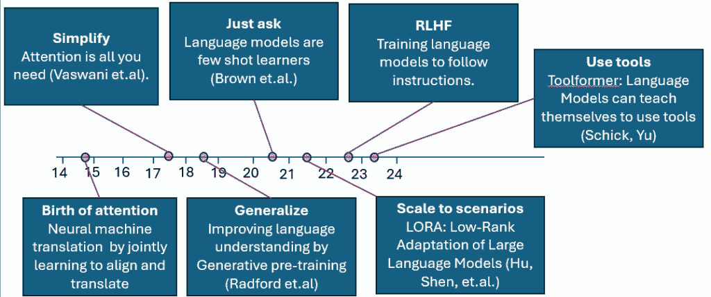
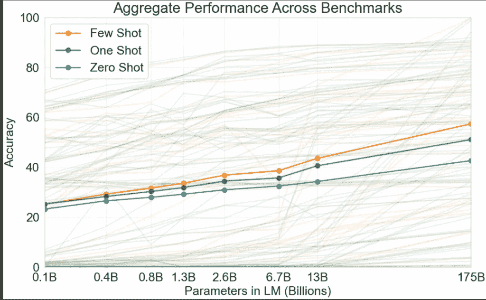

# 通过论文看 GPT 的简要历史

> 原文：[`towardsdatascience.com/a-brief-history-of-gpt-through-papers/`](https://towardsdatascience.com/a-brief-history-of-gpt-through-papers/)

<mdspan datatext="el1755580136411" class="mdspan-comment">本文是该系列文章的第一篇，关于语言模型，涵盖了 Chat-GPT 发布前的进展。</mdspan>

## 0) 前言：图灵测试

1950 年 10 月，艾伦·图灵提出了一种测试。能否与一台机器进行对话，而无法将其与人类区分开来。他称之为“模仿游戏”。这在论文《计算机与智能》中提出。他打算将这个测试作为更深奥、更模糊的问题的代理，“机器能思考吗？”

七十年后，在 2020 年，像 OpenAI 的 ChatGPT 这样的几个大型语言模型通过了现代、严格的测试变体。

2022 年，OpenAI 公开发布了 ChatGPT，它立即吸引了全世界的“关注”。

如果你没有理解这个爸爸的笑话，你会在文章的结尾理解。图片由 midjourney 提供。

这是第一个你可以在几乎任何话题上与之进行长时间对话的聊天机器人（图灵测试破坏者的第一个明显应用）。

从那时起，我们知道这项技术是多么具有颠覆性，像 OpenAI 和 Anthropic 这样的公司训练和托管这些模型，成为历史上增长最快的公司。

虽然表面上看起来是这样，但这样的进步并不是在真空中和一夜之间发生的。在幕后，有一些渐进的进步，最终导致了这样的事件。确实，在 2020 年的突破之前，有一系列的活动（在论文方面），随着这些模型继续获得新的能力和改进，随后又出现了一系列其他重要的发展。

由于这个领域开始稳定下来，现在是回顾一些导致这一突破的关键论文的好时机。

下面的图表展示了我们将在本章中涵盖的论文时间线（轴上的 14 代表 2014 年，以此类推）。

关键论文的历史。图片由作者提供。

导致材料实现量子飞跃的关键架构被称为 Transformer。那么，它背后的深刻洞察是什么？

## I) Transformers：减法，而非加法

最终预示着突破性进展，使得人们可以与可以进行长时间对话的聊天机器人交流的架构是 Transformer。图片由 midjourney 提供。

在发布后不到几个月的时间里，有一种单一的深度学习架构（称为 Transformer）将自然语言模型推向了新的高度。它在著名的 2017 年论文“Attention is all you need”中提出。

那么，是什么关键进步促进了这一点？是什么“缺失的元素”，在之前的最佳实践中没有，而 Transformer 引入了？

真正有趣的是，如果你考虑在 Transformer 之前的状态艺术中的架构元素之间的差异，实际上没有添加任何新东西。相反，一个特定的元素（递归）被*减去*了。这反映在论文的标题中——“注意力即是所需”，意味着你可以去掉“其他不是‘注意力’的东西”。但如果是这篇著名的论文没有发明注意力，那么又是哪篇论文做到了？

## II) 翻译是一切开始的地方

推动语言领域 AI 模型前沿的用例是机器翻译。图由 midjourney 提供。

尽管 ChatGPT 是一个聊天机器人（通过图灵测试的先决条件），但推动早期向 Transformer 架构发展的用例是语言翻译。换句话说，是从一种人类语言翻译到另一种语言。

因此，在语言-1（例如：英语）中有一个“源语句”，目标是将它转换成语言-2（例如：西班牙语）中的“目标语句”。

这本质上是一个“序列到序列”的任务。给定一个输入序列，返回一个输出序列。除了翻译之外，还有很多其他事情可以被视为序列到序列任务。例如，聊天机器人也是一个序列到序列任务。它从用户那里接收输入序列，并返回聊天机器人的响应序列。

通常，这类模型的进步是迭代发生的。有一些架构在某个任务上是当前的最佳实践。研究人员理解其弱点，那些使其难以工作的东西。提出了一种新的架构来解决这些弱点。如果成功，它将通过基准测试并成为新的主导架构。这也是 Transformer 出现的原因。

第一个基于神经网络的机器翻译模型在三个步骤（从高层次来看）中操作。一个编码器会将“源语句”嵌入到向量空间中，从而得到一个“源向量”（编码器）。然后，源向量将通过神经网络（一些非线性映射）映射到一个“目标向量”，最后，一个解码器会将得到的向量映射到“目标语句”。

人们很快意识到，原本应该编码源语句的向量承担了太多的责任。源语句可以任意长。因此，而不是为整个语句使用一个单一的向量，我们可以将每个词转换成一个向量，然后有一个中间元素来挑选出解码器应该更加关注的特定词语。这个中间架构元素被称作“注意力机制”。

那时，负责帮助解码器挑选出需要关注的单词的中间机制具有非常理想的扩展特性。

下一个想法是将它作为整个架构的核心。这正是导致了当前最先进的模型——transformer 的出现。

让我们看看在 transformer 出现之前，语言翻译中的关键论文。

### II-A) 注意力的诞生

既然“注意力就是一切”，（参见第 I 节），让我们首先了解什么是注意力。我们必须回到引入它的那篇论文。

2014 年：“通过联合学习对齐和翻译进行神经机器翻译” [`arxiv.org/abs/1409.0473`](https://arxiv.org/abs/1409.0473)

这篇论文首先介绍了“注意力机制”。这是一种让源句的不同部分在翻译过程中“关注”目标语句中某个位置内容的方法。

这里是关键点：

1) 他们从上述描述的语言翻译中的编码器-解码器机制开始。指出的关键限制是编码步骤（将源语句编码为高维空间中的向量）。如果源语句非常长（尤其是比训练数据中观察到的典型长度更长），简单的编码器-解码器模型的性能会下降，因为大量的责任都放在了目标向量上，需要编码源语句的完整上下文。

2) 引用他们新方法的论文：“与基本的编码器-解码器相比，这种方法的最重要的区别特征是它不试图将整个输入句子编码为单个固定长度的向量。相反，它将输入句子编码为一系列向量，并在解码翻译时自适应地选择这些向量中的子集。这使神经翻译模型从必须将源句的所有信息，无论其长度如何，压缩成固定长度向量的需求中解放出来。我们表明，这允许模型更好地处理长句子。”换句话说，他们从将整个输入句子编码为向量转向将输入句子的单个单词编码为向量。

3) 在解码器部分，第三部分中提到：“直观上，这实现了解码器中的注意力机制。解码器决定关注源句的哪些部分。通过让解码器拥有注意力机制，我们减轻了编码器必须将源句中的所有信息编码为固定长度向量的负担。采用这种新方法，信息可以分布在注释序列中，解码器可以相应地选择性检索。”这是对注意力机制的首次提及。解码器在生成输出序列时决定关注输入句子的哪些部分。

将单词转换为向量的机制基于循环神经网络（RNNs）。关于这方面的详细信息，可以从论文本身获得。这些循环神经网络依赖于隐藏状态来编码序列的过去信息。虽然将所有这些信息编码到单个向量中很方便，但由于这个向量成为瓶颈，必须在处理句子中的其余部分之前进行计算，这不利于并行化。这限制了 GPU 在训练这些模型时发挥作用的程度。

### II-B) 显然，现在这就是你所需要的全部

现在我们来到了最著名的论文，它实际上引入了后来会击败图灵测试的新 Transformer 架构。

2017 年：“注意力即是所需一切” [`arxiv.org/abs/1706.03762`](https://arxiv.org/abs/1706.03762)

这个概念起源于谷歌深度大脑。

从标题中，你可以推断出作者们像谈论已经存在的东西一样谈论注意力。当时它已经 3 岁了。所以，如果他们没有发明“注意力”，那么他们的创新贡献是什么？正如标题所暗示的，他们简化了架构到“仅仅是注意力”，完全去除了循环。好吧，他们确实将注意力与简单的前馈网络结合在一起，所以标题有点误导。事实上，大多数参数都存在于前馈层中。但他们完全去除了循环层。仅仅是注意力、前馈，然后重复。在并行（“多头”和序列）中。

由于注意力具有可并行化的优点，他们可以扩展到更大的架构，并利用 GPU 的强大功能以更可并行化的方式训练它们。

使用这种新的、更简单的架构，他们在主要的翻译数据集上达到了新的最佳水平。

考虑到他们的核心贡献是从现有模型中移除一个关键组件并简化架构，这很容易被看作是之前引入注意力的论文中的消融研究。 

至于他们为什么会想到这一点，可以想象他们对于循环层造成的困难感到沮丧，而注意力层却很容易训练。这可能会使他们想知道“如果循环层如此有问题，为什么不废除它们呢？”。

使用这种新的仅注意力架构，他们在语言翻译任务中超越了当时的最佳水平。

## III) 超越翻译

OpenAI 开始从语言翻译扩展这些模型到各种语言任务。图由 midjourney 提供。

这就是 OpenAI 首次进入这个场景的地方。与其他大型公司内的研究实验室不同，他们可以在语言任务上追求“通用智能”的使命。

### III-A) 生成式预训练

在这篇论文中，他们介绍了第一个 GPT（通用预训练）模型，GPT-1。该模型原本是一个通用工具包，能够执行任何语言任务。它大约有 1.17 亿个参数。

2018 年：“通过生成预训练改进语言理解” [`cdn.openai.com/research-covers/language-unsupervised/language_understanding_paper.pdf`](https://cdn.openai.com/research-covers/language-unsupervised/language_understanding_paper.pdf)

与之前论文中的 Vaswani 等人专注于语言翻译不同，这篇论文的作者们对构建一个能够在多种语言任务中表现出色的通用代理感兴趣。这对于当时像 OpenAI 这样的研究组织来说是有意义的。这篇论文中的主要观点是：不要为每个任务从头开始训练模型。

首先以无监督的方式在一个大型文本语料库上训练一个在语言上一般良好的模型。

> 注意，这一步骤，即在大量文本语料库上训练一个通用模型，是涉及（Anthropic，这些模型训练公司之一和它所训练模型所基于的图书出版商）的一个里程碑式的版权诉讼的主题，这对这类 AI 模型的未来具有极其重要的意义。
> 
> 在**2025 年 6 月 23 日**，**美国地区法官威廉·阿尔苏普**裁定，Anthropic 公司**使用合法获取（购买和扫描）的版权书籍来训练其 AI 模型**的行为在美国版权法下构成了**“合理使用”**。他将这种训练描述为“**本质上具有变革性**”，并将其比作“任何渴望成为作家的读者”如何用自己的话学习和综合内容。

然后，在特定任务数据上以监督方式进一步调整。由于 transformer 是一个序列到序列模型，我们只需将任务框架化为一个序列到序列问题。例如，如果任务是情感分析，输入就变成了需要解析情感的源句子。目标输出变为“积极”或“消极”。

这与人类首先学习通用语言技能，然后专门从事法律等特定领域的方式相似。

以鲍比·费舍尔为例，这位国际象棋大师最初学习俄语（因为当时所有好的象棋书籍都是用那种语言写的），然后阅读它们来提高自己的棋艺。

### III-B) 少样本学习

2020 年，语言模型是少样本学习者 [`arxiv.org/abs/2005.14165`](https://arxiv.org/abs/2005.14165)

这篇论文首次介绍了著名的模型 GPT-3。几年后，在 2022 年 11 月，OpenAI 向公众发布了 ChatGPT。聊天机器背后的模型与这篇论文中的相同。这个模型有 1750 亿个参数。

作者花费了大量时间惊叹于人类如何仅通过几个示范性例子就能一般性地学习执行新的语言任务。然后他们梦想着 AI 模型能够展现出同样的泛化能力，而无需为每个单独的任务重新训练模型。他们认为将模型扩展到更多和更多的参数可以让我们朝着这个目标迈进。

引用：“近年来，transformer 语言模型的能力大幅提升，从 1 亿参数，到 3 亿参数，到 15 亿参数，到 80 亿参数，11 亿参数，最终到 170 亿参数。每一次增加都带来了文本合成和/或下游 NLP 任务的改进，并且有证据表明，与许多下游任务相关联的对数损失随着规模的增加呈现出平滑的改善趋势。由于上下文学习涉及在模型的参数中吸收许多技能和任务，因此上下文学习能力可能也会随着规模的增加而显示出类似强劲的收益。”

这个想法是在推理时给模型提供示范性例子，而不是用它们来训练其参数。如果在上下文中没有提供这样的例子，则称为“零样本”。如果提供一个例子，则称为“一样本”，如果提供几个例子，则称为“少样本”。

下面的图表，取自论文，不仅显示了随着模型参数数量的增加，性能如何提高，而且还显示了模型如何能够利用展示给它们的单个或少数例子。随着参数数量的增加，单个和少样本案例的性能开始从零样本案例中脱颖而出。

随着参数数量的增加，模型的表现会变得更好。但与此同时，它们利用少样本例子的能力也开始逐渐减弱。图片来自本节引用的论文。

一个有趣的实验评估了模型在简单算术任务上的表现，例如两位数的加法和减法。引用：“在加法和减法上，当数字位数较小时，GPT-3 表现出很强的熟练度，在两位数加法上达到 100%的准确率，在两位数减法上达到 98.9%，在三位数加法上达到 80.2%，在三位数减法上达到 94.2%。”即使参数量达到 130 亿的模型在两位数加法上也表现糟糕。

这一段文字肯定让作者感觉像自豪的父母：

“为了检查模型是否只是记忆了特定的算术问题，我们取了测试集中的三位数算术问题，并在我们的训练数据中以“<NUM1> + <NUM2> =”和“<NUM1> plus <NUM2>”的形式进行搜索。在 2,000 个加法问题中我们只找到了 17 个匹配（0.8%），在 2,000 个减法问题中我们只找到了 2 个匹配（0.1%），这表明只有极小比例的正确答案可能是记忆下来的。此外，对错误答案的检查显示，模型经常犯诸如没有进位“1”之类的错误，这表明它实际上是在尝试执行相关计算，而不是记忆一个表格。”。

## 展望与结论

这些是导致 2022 年底作为聊天机器人（ChatGPT）公开发布的 GPT-3 模型的一些关键论文。希望它们能提供一瞥导致图灵测试被打破的迭代演变的视角。

自那时以来，已经有许多显著的论文消除了这些模型的限制，并进一步提高了它们的能力。

首先，需要将模型的响应与人类偏好对齐。为了防止模型变得有毒、无帮助等。这就是 RLHF（从人类反馈中强化学习）概念发挥作用的地方。它使用了一种以前用来教模型玩电子游戏的技巧，并调整到调整语言模型的参数。OpenAI 的论文标题为：“训练语言模型以遵循指令”，并于 2022 年 11 月发布。

如果你曾是这些模型的早期使用者，你可能还记得，如果你询问它关于当前新闻，它会说：“我是一个在 2022 年之前互联网快照上训练的语言模型”或类似的话，并且无法回答关于该快照之后事件的问题。此外，正如我们在第 III-B 节中看到的，这些模型在简单的算术题上也不会得到满分。当我们有专门的工具时，为什么还要依赖生成过程来做这类事情呢？而不是简单地说它没有训练当前事务，模型可以直接调用新闻 API 来检索所需的信息。同样，而不是通过其生成过程尝试进行算术运算，它可以直接调用计算器 API。这就是 Metas AI 实验室（当时为 FAIR）在工具形式论文([`arxiv.org/abs/2302.04761`](https://arxiv.org/abs/2302.04761))中教这些模型使用新闻 API 和计算器等工具的地方。

本文涵盖了 ChatGPT 发布之前的进展，这可以公正地称为 AI 模型的一个转折点。接下来，在系列文章中，我将介绍本节中提到的后续进展，这些进展继续推动着边界。敬请关注。
