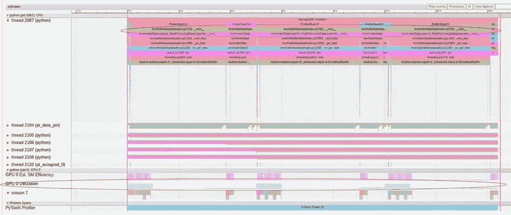
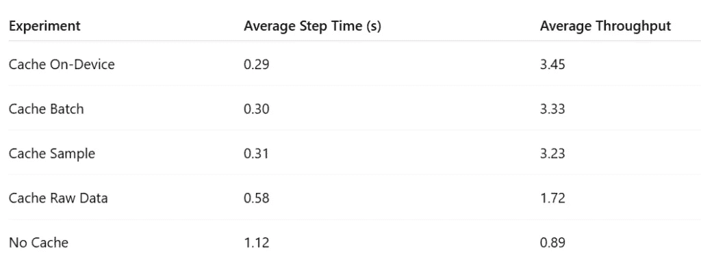
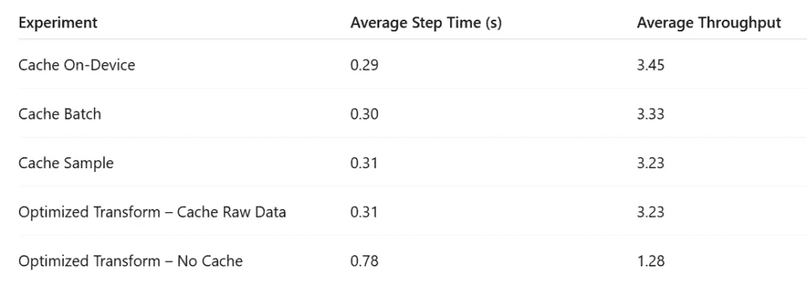

# 数据输入管道瓶颈识别的缓存策略

> 原文：[`towardsdatascience.com/a-caching-strategy-for-identifying-bottlenecks-on-the-data-input-pipeline/`](https://towardsdatascience.com/a-caching-strategy-for-identifying-bottlenecks-on-the-data-input-pipeline/)

<mdspan datatext="el1750962830720" class="mdspan-comment">性能瓶颈</mdspan>在运行在 GPU 上的机器学习模型的数据输入管道中可能特别令人沮丧。在大多数工作负载中，主机（CPU）和设备（GPU）协同工作：CPU 负责准备和提供数据，而 GPU 负责处理繁重的工作——执行模型、在训练期间进行反向传播以及更新权重。

在理想情况下，我们希望 GPU——我们 AI/ML 基础设施中最昂贵的组件——得到高度利用。这会导致更快的开发周期、更低的训练成本以及部署中的延迟降低。为了实现这一点，GPU 必须持续接收输入数据。特别是，我们希望防止“GPU 饥饿”的发生——在这种情况下，我们最昂贵的资源闲置等待输入数据。不幸的是，由于数据输入管道中的瓶颈导致的“GPU 饥饿”相当常见，并且会大大降低系统效率。因此，对于 AI/ML 开发者来说，拥有可靠的工具和策略来诊断和解决此类问题非常重要。

这篇文章——我们关于[PyTorch 模型性能分析和优化](https://towardsdatascience.com/pytorch-model-performance-analysis-and-optimization-10c3c5822869/)主题系列的第八篇文章——介绍了一种简单的缓存策略，用于识别数据输入管道中的瓶颈。与之前的文章一样，我们旨在强化两个关键思想：

1.  AI/ML 开发者必须对其模型的运行时性能负责。

1.  您不需要是 CUDA 或系统专家就能实现重大的性能优化。

我们将首先概述一些导致 GPU 饥饿的常见原因。然后，我们将介绍我们的基于缓存的策略，用于识别和分析输入管道的性能问题。最后，我们将回顾一系列实用的工具、技巧和技术（TTTs），用于克服数据输入管道中的性能瓶颈。

为了方便我们的讨论，我们将定义一个玩具 PyTorch 模型及其相关的数据输入管道。我们分享的代码仅用于演示目的——请勿依赖其正确性或最优性。此外，请勿将我们提到的任何工具或技术视为对其使用的认可。

## 玩具 PyTorch 模型

我们定义了一个简单的基于 PyTorch 的图像分类模型：

```py
undefined
```

我们定义了一个包含多个转换的合成数据集——故意设计以包含严重的输入管道瓶颈。有关数据集定义的更多详细信息，请参阅[这篇文章](https://towardsdatascience.com/solving-bottlenecks-on-the-data-input-pipeline-with-pytorch-profiler-and-tensorboard-5dced134dbe9/#7fbd-af822198c08)。

```py
import numpy as np
from PIL import Image
from torchvision.datasets.vision import VisionDataset
import torchvision.transforms as T

class FakeDataset(VisionDataset):
    def __init__(self, transform):
        super().__init__(root=None, transform=transform)
        self.size = 10000

    def __getitem__(self, index):
        # create a random 1024x1024 image
        img = Image.fromarray(np.random.randint(
            low=0,
            high=256,
            size=(input_img_size[0], input_img_size[1], 3),
            dtype=np.uint8
        ))
        # create a random label
        target = np.random.randint(low=0, high=num_classes, 
                                   dtype=np.uint8).item()
        # Apply tranformations
        img = self.transform(img)
        return img, target

    def __len__(self):
        return self.size

class RandomMask(torch.nn.Module):
    def __init__(self, ratio=0.25):
        super().__init__()
        self.ratio=ratio

    def dilate_mask(self, mask):
        # perform 4 neighbor dilation on mask
        from scipy.signal import convolve2d
        dilated = convolve2d(mask, [[0, 1, 0],
                                    [1, 1, 1],
                                    [0, 1, 0]], mode='same').astype(bool)
        return dilated

    def forward(self, img):
        mask = np.random.uniform(size=(img_size, img_size)) < self.ratio
        dilated_mask = torch.unsqueeze(torch.tensor(self.dilate_mask(mask)),0)
        dilated_mask = dilated_mask.expand(3,-1,-1)
        img[dilated_mask] = 0.
        return img

class ConvertColor(torch.nn.Module):
    def __init__(self):
        super().__init__()
        self.A=torch.tensor(
            [[0.299, 0.587, 0.114],
             [-0.16874, -0.33126, 0.5],
             [0.5, -0.41869, -0.08131]]
        )
        self.b=torch.tensor([0.,128.,128.])

    def forward(self, img):
        img = img.to(dtype=torch.get_default_dtype())
        img = torch.matmul(self.A,img.view([3,-1])).view(img.shape)
        img = img + self.b[:,None,None]
        return img

class Scale(object):
    def __call__(self, img):
        return img.to(dtype=torch.get_default_dtype()).div(255)

transform = T.Compose(
    [T.PILToTensor(),
     T.RandomCrop(img_size),
     RandomMask(),
     ConvertColor(),
     Scale()])

train_set = FakeDataset(transform=transform)
train_loader = torch.utils.data.DataLoader(train_set, batch_size=256,
                                           num_workers=4, pin_memory=True)
```

接下来，我们定义模型、损失函数、优化器、训练步骤和训练循环，并将它们包装在[PyTorch Profiler 上下文管理器](https://pytorch.org/docs/stable/profiler.html#torch.profiler.profile)中以捕获性能数据。

```py
from statistics import mean, variance
from time import time

device = torch.device("cuda:0")
model = Net().cuda(device)
criterion = nn.CrossEntropyLoss().cuda(device)
optimizer = torch.optim.SGD(model.parameters(), lr=0.001, momentum=0.9)

def train_step(model, criterion, optimizer, inputs, labels):
    outputs = model(inputs)
    loss = criterion(outputs, labels)
    optimizer.zero_grad(set_to_none=True)
    loss.backward()
    optimizer.step()

model.train()

t0 = time()
times = []

with torch.profiler.profile(
    schedule=torch.profiler.schedule(wait=10, warmup=2, active=10, repeat=1),
    on_trace_ready=torch.profiler.tensorboard_trace_handler('/tmp/prof'),
    record_shapes=True,
    profile_memory=True,
    with_stack=True
) as prof:
    for step, data in enumerate(train_loader):
        # copy data to device
        inputs = data[0].to(device=device, non_blocking=True)
        labels = data[1].to(device=device, non_blocking=True)

        # run train step
        train_step(model, criterion, optimizer, inputs, labels)
        prof.step()
        times.append(time()-t0)
        t0 = time()
        if step >= 100:
            break

print(f'average time: {mean(times[1:])}, variance: {variance(times[1:])}')
```

对于我们的实验，我们使用一个[Amazon EC2 g5.xlarge](https://aws.amazon.com/ec2/instance-types/g5/)实例（包含一个 NVIDIA A10G GPU 和 4 个 vCPU）运行一个[PyTorch (2.6) 深度学习 AMI](https://aws.amazon.com/releasenotes/aws-deep-learning-ami-gpu-pytorch-2-6-ubuntu-22-04/)（DLAMI）。在这个环境中运行我们的玩具脚本，平均吞吐量为每秒 0.89 个步骤，GPU 利用率仅为 22%，以下是在以下性能分析跟踪中：



GPU 饥饿性能分析跟踪（作者）

如在[之前的文章](https://towardsdatascience.com/solving-bottlenecks-on-the-data-input-pipeline-with-pytorch-profiler-and-tensorboard-5dced134dbe9/#7fbd-af822198c08)中详细讨论的那样，性能分析跟踪显示 GPU 饥饿的清晰模式——GPU 的大部分时间都在等待来自 PyTorch DataLoader 的数据。这表明数据输入管道存在性能瓶颈，阻止输入批次快速准备，以保持 GPU 完全占用。重要的是，输入管道的性能问题可能源于各种原因。在我们的玩具示例中，瓶颈的原因并不明显地从上述捕获的跟踪中可以看出。

以下是对读者/开发者的简要说明：（尽管我们进行了大量讲解）仍然对使用 PyTorch Profiler 持保留态度：下面我们将讨论的数据缓存技术将提供一种识别 GPU 饥饿的替代方法——所以不要灰心。

### GPU 饥饿——寻找根本原因

在本节中，我们简要回顾了输入数据管道中性能瓶颈的常见原因。

回想一下，在典型的模型执行流程中：

1.  原始数据是从存储中加载或流式传输的（例如，本地 RAM 或磁盘、远程网络文件系统，或基于云的对象存储，如[Amazon S3](https://aws.amazon.com/s3/)或[Google Cloud Storage](https://cloud.google.com/storage)）。

1.  然后，在 CPU 上进行预处理。

1.  最后，处理后的数据被复制到 GPU 上进行推理或训练。

相应地，瓶颈可能出现在以下每个阶段：

1.  **慢速数据检索**：有许多因素可以限制 CPU 检索原始数据的速度，包括：存储后端的选择（例如，云存储与本地 SSD）、可用的网络带宽、数据格式等。

1.  **CPU 资源耗尽或误用**：预处理任务，如数据增强、图像转换或解压缩，可能非常占用 CPU 资源。当这些操作的数量或复杂性超过可用的 CPU 容量，或者 CPU 资源管理效率低下（例如，选择的工作者数量不最优），就可能发生瓶颈。值得注意的是，CPU 还负责其他与模型相关的任务，如加载 GPU 内核、内存管理、指标报告等。

1.  **主机到设备传输瓶颈**：一旦数据处理完成，就必须将其传输到 GPU。如果数据批次相对于 CPU-GPU 内存带宽较大，或者内存复制效率低下（例如，复制的是单个样本而不是完整批次），这可能会成为瓶颈。

### 性能分析器的局限性

识别数据管道瓶颈的常见方法是通过使用性能分析器。在本系列的第四部分，[使用 PyTorch Profiler 和 TensorBoard 解决数据输入管道的瓶颈](https://towardsdatascience.com/solving-bottlenecks-on-the-data-input-pipeline-with-pytorch-profiler-and-tensorboard-5dced134dbe9/#7fbd-af822198c08)，我们展示了如何使用 PyTorch 内置的性能分析器来完成这项工作。然而，鉴于输入数据管道在 CPU 上运行，任何[Python 性能分析器](https://docs.python.org/3/library/profile.html)都可以使用。

这种方法的缺点是，我们通常使用多个工作进程进行数据加载，这使得性能分析特别复杂。在我们的[前一篇帖子](https://towardsdatascience.com/solving-bottlenecks-on-the-data-input-pipeline-with-pytorch-profiler-and-tensorboard-5dced134dbe9/#7fbd-af822198c08)中，我们通过在单个进程中运行数据加载和模型执行来克服了这个问题（即，我们将[*DataLoader*](https://docs.pytorch.org/docs/stable/data.html#torch.utils.data.DataLoader)构造函数的*num_workers*参数设置为 0）。然而，这是一个高度侵入性的配置更改，可能会对我们的模型的整体性能产生重大影响。

在本文中，我们提出的基于缓存的方案旨在以一种远非侵入性的方式确定性能瓶颈的源头。特别是，它将使我们能够测量模型性能，而无需改变多工作者的数据加载行为。

## 通过缓存检测瓶颈

在本节中，我们提出了一种多步骤方法来分析输入数据管道的性能。我们将演示如何将这种方法应用于我们的玩具训练工作负载，以确定 GPU 饥饿的原因。

### 第 1 步：在设备上缓存一个批次

我们首先创建一个单独的输入批处理，将其复制到 GPU 上，然后测量模型在仅迭代该批处理时的运行时性能。这提供了模型吞吐量的理论上限，即当 GPU 不缺数据时可以达到的最大吞吐量。

在以下代码块中，我们修改了我们的玩具脚本的训练循环，使其在 GPU 上缓存的单个批处理上运行：

```py
data = next(iter(train_loader))
inputs = data[0].to(device=device, non_blocking=True)
labels = data[1].to(device=device, non_blocking=True)
t0 = time()
times = []
for step in range(100):
    train_step(model, criterion, optimizer, inputs, labels)
    times.append(time()-t0)
    t0 = time()
```

结果平均吞吐量为每秒 3.45 步——几乎是基线结果的 4 倍。这不仅证实了数据管道存在显著的瓶颈，而且还量化了其影响。

**技巧提示：使用设备缓存数据进行分析和优化**

在 GPU 上缓存的单个批处理上运行分析器可以将模型执行与输入管道隔离开来。这有助于您识别模型原始计算路径中的低效之处。理想情况下，这里的 GPU 利用率应接近 100%。在我们的案例中，利用率为 95%，这是可接受的。

### 第 2 步：在主机（CPU）上缓存一个批处理

接下来，我们将单个输入批处理缓存到主机（CPU）而不是设备上。现在，每个步骤都包括从 CPU 到 GPU 的内存复制和模型执行。

由于 PyTorch 的 [内存固定](https://docs.pytorch.org/tutorials/intermediate/pinmem_nonblock.html) 允许异步数据传输，我们预计主机到设备的内存复制对于批处理 *N+1* 将与批处理 *N* 上的模型执行重叠。因此，我们预计吞吐量将与设备缓存情况相同。如果不是这样，这将清楚地表明主机到设备内存复制存在瓶颈。

以下代码块包含我们将此步骤应用于我们的玩具模型的示例：

```py
data = next(iter(train_loader))
t0 = time()
times = []
for step in range(100):
    inputs = data[0].to(device=device, non_blocking=True)
    labels = data[1].to(device=device, non_blocking=True)
    train_step(model, criterion, optimizer, inputs, labels)
    times.append(time()-t0)
    t0 = time()
```

此更改后的吞吐量为每秒 3.33 步——比之前的结果略有下降——表明主机到设备的传输不是瓶颈。我们需要继续寻找性能瓶颈的来源。

### 第 3 步及以后：在数据管道的中间阶段缓存

我们继续通过“向上爬”数据输入管道，在各个中间点缓存，以确定瓶颈。此过程的精确应用将根据管道的细节而变化。假设管道可以分解为 *K* 个阶段。如果在阶段 *N* 之后缓存会导致在阶段 *N+1* 之后缓存时吞吐量显著降低，我们可以推断出包含阶段 *N+1* 的处理正是减慢我们的原因。

**第 3a 步：缓存单个处理过的样本** 在下面的代码块中，我们修改我们的数据集以缓存一个完全处理过的样本。这模拟了一个包括数据收集和 CPU 到 GPU 数据复制的管道。

```py
class FakeDataset(VisionDataset):
    def __init__(self, transform):
        super().__init__(root=None, transform=transform)
        self.size = 10000
        self.cache = None

    def __getitem__(self, index):
        if self.cache is None:
            # create a random 1024x1024 image
            img = Image.fromarray(np.random.randint(
                low=0,
                high=256,
                size=(input_img_size[0], input_img_size[1], 3),
                dtype=np.uint8
            ))
            # create a random label
            target = np.random.randint(low=0, high=num_classes,
                                       dtype=np.uint8).item()
            # Apply tranformations
            img = self.transform(img)
            self.cache = img, target
        return self.cache
```

结果吞吐量为每秒 3.23 步——仍然远高于我们的基线 0.89。我们仍然没有找到罪魁祸首。

**步骤 3b：缓存原始数据（在转换之前）** 接下来，我们修改数据集以便缓存原始数据（例如，未处理的图像文件）。现在，输入数据管道包括数据转换、数据整理以及 CPU 到 GPU 的数据复制。

```py
class FakeDataset(VisionDataset):
    def __init__(self, transform):
        super().__init__(root=None, transform=transform)
        self.size = 10000
        self.cache = None

    def __getitem__(self, index):
        if self.cache is None:
            # create a random 1024x1024 image
            img = Image.fromarray(np.random.randint(
                low=0,
                high=256,
                size=(input_img_size[0], input_img_size[1], 3),
                dtype=np.uint8
            ))
            # create a random label
            target = np.random.randint(low=0, high=num_classes,
                                       dtype=np.uint8).item()
            self.cache = img, target
        # Apply tranformations
        img = self.transform(self.cache[0])
        return img, self.cache[1]
```

这次，吞吐量急剧下降——一直下降到每秒 1.72 步。我们已经找到了第一个罪魁祸首：数据转换函数。

### 中间结果

以下是迄今为止实验的总结：



缓存实验结果（作者）

结果表明，数据转换步骤引入了显著的减速。原始数据缓存结果和基线之间的差距也表明原始数据加载可能是另一个罪魁祸首。让我们从数据处理瓶颈开始。

### 优化数据转换

我们现在继续我们新发现的在数据处理函数中的性能瓶颈。下一个合乎逻辑的步骤是将*转换*函数分解成单个组件，并将我们的缓存技术应用到每一个组件上，以便更深入地了解我们 GPU 饥饿的精确来源。为了简洁起见，我们将跳过并应用我们在之前的帖子[使用 PyTorch Profiler 和 TensorBoard 解决数据输入管道的瓶颈](https://towardsdatascience.com/solving-bottlenecks-on-the-data-input-pipeline-with-pytorch-profiler-and-tensorboard-5dced134dbe9/#7fbd-af822198c08)中讨论的数据处理优化。请参阅那里以获取详细信息。

在数据转换优化之后，缓存的原始数据实验的吞吐量激增至 3.23。我们已经消除了数据处理函数中的瓶颈。

然而，我们新的基线吞吐量（未缓存）变为每秒 1.28 步，这表明原始数据加载中仍然存在瓶颈。这与我们在[之前的帖子](https://towardsdatascience.com/solving-bottlenecks-on-the-data-input-pipeline-with-pytorch-profiler-and-tensorboard-5dced134dbe9/#7fbd-af822198c08)中达到的最终结果相似。



转换优化后的吞吐量（作者）

### 优化原始数据加载

为了解决剩余的瓶颈，我们模拟了本系列第五部分展示的优化，[如何使用自定义 PyTorch 操作符优化您的深度学习数据输入管道](https://medium.com/data-science/how-to-optimize-your-dl-data-input-pipeline-with-a-custom-pytorch-operator-7f8ea2da5206)。我们通过将初始随机图像的大小从 1024×1024 减少到 256×256 来实现这一点。随后，这种变化使得端到端（未缓存）的训练步骤增加到 3.23。问题解决！

### 重要警告

我们以几个重要的注意事项和警告作为总结。

1.  数据管道中包含某个数据处理步骤导致吞吐量下降，并不一定意味着该特定步骤需要优化。完全有可能的是，是另一个接近 CPU 使用率极限的步骤，而新步骤只是将其推过了临界点。

1.  如果您的输入数据大小不一，单个缓存数据样本或样本批次的吞吐量可能无法反映真实世界的性能。

1.  如果 AI 模型包括动态的、数据依赖的特征，例如，如果模型图中的组件依赖于输入数据，则同样适用此注意事项。

## 解决数据输入管道瓶颈的技巧、窍门和技术

我们以一份关于优化基于 PyTorch 的 AI 模型数据输入管道的技巧、窍门和技术的列表来结束这篇文章。这份列表绝不是详尽的——根据您的特定用例和基础设施，存在许多额外的优化。我们将优化分为三个类别：

+   优化原始数据录入/检索

+   优化数据处理

+   优化主机到设备的数据传输

### 优化原始数据录入/检索

高效的数据加载始于对原始数据的快速和可靠访问。以下提示可以帮助您：

+   选择具有足够网络入口带宽的实例类型。

+   使用快速且成本效益高的数据存储解决方案。本地 SSD 速度快但价格昂贵。基于云的解决方案如 S3 提供可伸缩性，但可能会引入延迟。

+   最大化存储网络出口带宽。考虑在 S3 中对数据集进行分区或调整并行下载以减少限制。

+   考虑原始数据压缩。压缩文件可以减少传输时间——但请注意解压缩期间的 CPU 成本增加。

+   将小型样本分组到较大的文件中。这可以减少与打开和关闭多个文件相关的开销。

+   使用优化的数据传输工具。例如，s5cmd 可以显著优于 AWS CLI 进行大量 S3 下载。

+   调整数据检索参数。调整块大小或并发设置可以极大地影响读取性能。

### 解决数据处理瓶颈

+   调整数据加载工作进程的数量和预取因子。

+   在可能的情况下，将数据处理卸载到数据准备阶段。

+   选择具有最佳 CPU/GPU 计算比的实例类型。

+   优化变换的顺序。例如，在应用裁剪之前进行模糊处理将比先处理全尺寸图像然后裁剪更快。

+   利用 Python 加速库。例如，Numba 和 JAX 可以通过 JIT 编译加速纯 Python 操作。

+   在适当的情况下创建自定义 PyTorch CPU 算子（例如，请参阅[这里](https://medium.com/data-science/how-to-optimize-your-dl-data-input-pipeline-with-a-custom-pytorch-operator-7f8ea2da5206)）。

+   考虑添加辅助 CPU（数据服务器）——（例如，请参阅[这里](https://medium.com/data-science/effective-load-balancing-with-ray-on-amazon-sagemaker-d3b9020679d3)）。

+   将适合 GPU 的转换移动到 GPU 图上。一些转换（例如，归一化）可以在 GPU 上加载后进行，以实现更好的重叠。

+   调整操作系统级别的线程和内存配置。

### 优化主机到设备的数据复制

+   使用[memory pinning 和 non-blocking data copies](https://docs.pytorch.org/tutorials/intermediate/pinmem_nonblock.html)将数据直接预取到 GPU 上。还可以查看由[TorchTNT](https://docs.pytorch.org/tnt/stable/)提供的专用[CudaDataPrefetcher](https://docs.pytorch.org/tnt/stable/utils/generated/torchtnt.utils.data.CudaDataPrefetcher.html#torchtnt.utils.data.CudaDataPrefetcher)。

+   将 int8 到 float32 数据类型转换推迟到 GPU 上，以减少内存复制负载的 4 倍。

+   如果您的模型使用低精度浮点数（例如，fp16/bfloat16），请在 CPU 上将浮点数转换为以减少负载量一半。

+   将 one-hot 向量的解包推迟到 GPU 上——即，保持它们作为标签 ID 直到最后一刻。

+   如果您有很多二进制值，考虑使用位掩码来压缩负载。例如，如果您有 8 个二进制图，考虑将它们压缩成一个单一的 uint8。

+   如果您的输入数据是稀疏的，考虑使用[sparse data representations](https://docs.pytorch.org/docs/stable/sparse.html)。

+   避免不必要的填充。虽然零填充是处理可变大小输入样本的流行技术，但它会显著增加内存复制的尺寸。考虑其他选项（例如，参见[这里](https://medium.com/data-science/optimizing-transformer-models-for-variable-length-input-sequences-19fb88fddf71)）。

+   确保您没有在 GPU 上复制您实际上不需要的数据!!

## 摘要

虽然 GPU 被认为是现代 AI/ML 开发的必需品，但它们的成本很高。一旦您决定投资购买它们，您就会希望确保它们尽可能多地被使用。您最不希望看到的是 GPU 闲置，等待管道其他地方的输入数据，因为这是一个可以预防的瓶颈。

不幸的是，这种低效现象非常普遍。在这篇文章中，我们介绍了一种通过在输入管道的不同阶段迭代缓存数据来诊断这些问题的简单技术。通过隔离每个管道组件的运行时影响，这种方法有助于识别特定的瓶颈——无论是在原始数据加载、预处理还是主机到设备传输中。

当然，具体的实现将在不同的项目和管道中有所不同，但我们希望这种策略为诊断和解决您自己 AI/ML 工作流程中的性能问题提供了一个有用的框架。
