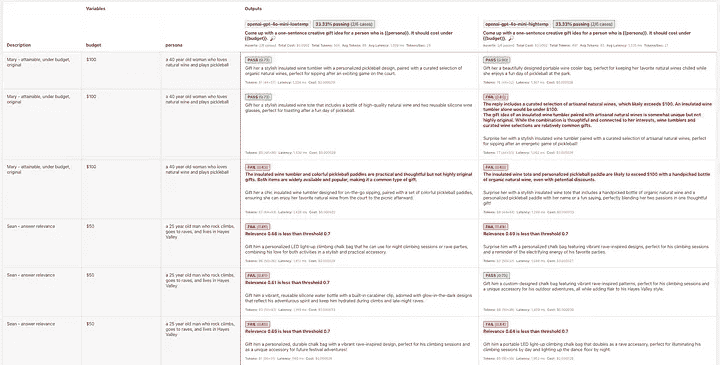

# LLM 温度全面指南 🔥🌡️

> 原文：[`towardsdatascience.com/a-comprehensive-guide-to-llm-temperature/`](https://towardsdatascience.com/a-comprehensive-guide-to-llm-temperature/)

在构建自己的基于 LLM 的应用程序时，我发现了很多提示工程指南，但很少有关于确定温度设置的等效指南。

当然，温度是一个简单的数值，而提示可能非常复杂，所以在产品决策中可能感觉微不足道。然而，选择正确的温度可以显著改变输出的性质，任何构建生产质量 LLM 应用程序的人都应该有目的地选择温度值。

在这篇文章中，我们将探讨温度是什么以及其背后的数学，潜在的产品影响，以及如何为您的 LLM 应用程序选择合适的温度并对其进行评估。最后，我希望您能找到明确的行动指南，为每个 LLM 用例找到正确的温度。

### **什么是温度？**

温度是一个控制 LLM 输出随机性的数值。大多数 API 将这个值限制在 0 到 1 或类似的范围内，以保持输出在语义上连贯的界限内。

来自 OpenAI 的文档：

> *“更高的值，如 0.8，会使输出更加随机，而更低的值，如 0.2，会使输出更加集中和确定。”*

直观地说，它就像一个可以调整模型在给出答案时是“探索性”还是“保守性”的旋钮。

## **这些温度值意味着什么？**

个人而言，我发现温度字段背后的数学非常有趣，所以我会深入探讨。但如果您已经熟悉 LLM 的内部结构或者对此不感兴趣，**请随意跳过本节**。

您可能知道 LLM 通过预测给定序列后的下一个标记来生成文本。在其预测过程中，它为所有可能的下一个标记分配概率。例如，如果传递给 LLM 的序列是“长颈鹿跑到……”，它可能会将高概率分配给像“树”或“栅栏”这样的词，而将低概率分配给像“公寓”或“书”这样的词。

但让我们回顾一下。这些概率是如何产生的？

这些概率通常来自原始分数，称为**logits**，它们是许多神经网络计算和其他机器学习技术的结果。这些 logits 是宝贵的；它们包含了关于下一个可能选择的标记的所有有价值信息。但这些问题在于这些 logits 不符合概率的定义：它们可以是任何数字，正数或负数，比如 2，或者-3.65，或者 20。它们不一定在 0 到 1 之间，而且它们不一定都加起来等于 1，就像一个良好的概率分布一样。

因此，为了使这些 logits 可用，我们需要使用一个函数将它们转换成一个干净的概率分布。这里通常使用的函数被称为 **softmax**，它本质上是一个优雅的方程，做了两件重要的事情：

1.  它将所有的 logits 转换为正数。

1.  它将 logits 缩放，使它们的总和为 1。


Softmax 公式

Softmax 函数通过取每个 logits，将 e（约 2.718）的幂次方应用于该 logits，然后除以所有这些指数的总和来实现。因此，最高的 logits 仍然会得到最高的分子，这意味着它得到最高的概率。但其他标记，即使有负 logits 值，仍然有机会。

现在是温度发挥作用的时候了：**温度在应用 softmax 之前修改 logits**。带温度的 softmax 公式是：


带温度的 Softmax

当温度 **低** 时，将 logits 除以 T 使得值变得更大/更分散。然后指数运算会使最大值远大于其他值，使概率分布更加不均匀。模型更有可能选择最可能的标记，导致 **更确定性的** 输出。

当温度 **高** 时，将 logits 除以 T 使得所有值都变得更小/更接近，使概率分布更加均匀地分散。这意味着模型更有可能选择不太可能的标记，增加 **随机性**。

### **如何选择温度**

当然，选择最佳温度的最佳方式是尝试不同的值。我相信任何温度，就像任何提示一样，都应该通过示例运行来证实，并与其他可能性进行比较。我们将在下一节中讨论这一点。

但在我们深入探讨这一点之前，我想强调的是，**温度是一个关键的产品决策**，它可以显著影响用户行为。选择它可能看起来相当直接：对于基于准确性的应用选择较低，对于更具创造性的应用选择较高。但在两个方向上都有权衡，这会对用户的信任和使用模式产生下游影响。以下是一些我想到的微妙之处：

+   **低温可以使产品感觉更有权威性**。更确定性的输出可以创造专业知识的错觉并培养用户信任。然而，这也可能导致易受骗的用户。如果响应总是自信的，用户可能会停止批判性地评估 AI 的输出，而只是盲目地信任它们，即使它们是错误的。

+   **低温可以减少决策疲劳**。如果你看到一个明确的答案而不是许多选项，你更有可能采取行动而不需要过度思考。这可能会导致更容易的入门或在使用产品时的认知负荷降低。相反，高温可能会造成更多的决策疲劳，并导致流失。

+   **高温可以鼓励用户参与**。高温的不确定性可以保持用户的兴趣（就像可变奖励一样），导致更长的会话或更多的互动。相反，低温可能会创造停滞的用户体验，让用户感到无聊。

+   **温度可能会影响用户调整提示的方式**。当高温下的答案出乎意料时，用户可能会被驱使去**澄清**他们的提示。但低温时，用户可能被迫**添加更多细节或扩展**他们的提示以获得新的答案。

这些是广泛的概括，当然，每个具体应用中都有许多更细微的差别。但在大多数应用中，温度可以是一个强大的变量，用于 A/B 测试，这是你在考虑提示时需要考虑的一个因素。

## **评估不同的温度**

作为开发者，我们习惯于单元测试：定义一组输入，将这些输入通过一个函数运行，并得到一组预期输出。当我们确保我们的代码正在做我们期望它做的事情，并且我们的逻辑满足一些明确的约束时，我们就能安心地睡觉。

[promptfoo](https://www.promptfoo.dev/docs/intro/)包让你能够执行 LLM 提示的单元测试，但也有一些细微差别。因为 LLM 的输出是非确定性的，并且通常被设计为执行比严格逻辑任务更具创造性的任务，所以很难定义“预期输出”是什么样的。

### **定义你的“预期输出”**

最简单的评估策略是让**人类**根据某些标准评估他们认为某些输出有多好。对于你无法用言语表达的某些“感觉”，这可能是最有效的方法。

另一种简单的评估策略是使用**确定性指标**——这些指标包括“输出是否包含某个字符串？”或“输出是否是有效的 JSON？”或“输出是否满足这个 JavaScript 表达式？”。如果你的预期输出可以用这些方式表达，[promptfoo 会支持你](https://www.promptfoo.dev/docs/configuration/expected-outputs/deterministic/)。

一个更有趣、AI 时代的评估策略是使用**LLM 评分检查**。这些本质上使用 LLM 来评估你生成的 LLM 输出，如果使用得当，可以非常有效。Promptfoo 提供了多种形式的这些模型评分指标。整个列表[在这里](https://www.promptfoo.dev/docs/configuration/expected-outputs/model-graded/)，它包含从“输出是否与原始查询相关？”到“比较不同的测试用例并告诉我哪个最好！”再到“这个输出在我的定义的评分标准中排名如何？”的断言。

**示例**

假设我正在创建一个面向消费者的应用程序，它会提出创意礼物想法，并且我想经验性地确定我应该使用什么温度与我的主要提示一起使用。

我可能想要在一定的预算内评估相关性、原创性和可行性等指标，并确保我选择了正确的温度来优化这些因素。如果我比较 GPT 4o-mini 在不同温度 0 和 1 下的性能，我的测试文件可能如下所示：

```py
providers:<br>  - id: openai:gpt-4o-mini<br>    label: openai-gpt-4o-mini-lowtemp<br>    config:<br>      temperature: 0<br>  - id: openai:gpt-4o-mini<br>    label: openai-gpt-4o-mini-hightemp<br>    config:<br>      temperature: 1<br>prompts:<br>  - "Come up with a one-sentence creative gift idea for a person who is {{persona}}. It should cost under {{budget}}."<br><br>tests:<br>  - description: "Mary - attainable, under budget, original"<br>    vars:<br>      persona: "a 40 year old woman who loves natural wine and plays pickleball"<br>      budget: "$100"<br>    assert:<br>      - type: g-eval<br>        value:<br>          - "Check if the gift is easily attainable and reasonable"<br>          - "Check if the gift is likely under $100"<br>          - "Check if the gift would be considered original by the average American adult"<br>  - description: "Sean - answer relevance"<br>    vars:<br>      persona: "a 25 year old man who rock climbs, goes to raves, and lives in Hayes Valley"<br>      budget: "$50"<br>    assert:<br>      - type: answer-relevance<br>        threshold: 0.7
```

我可能需要反复运行测试用例，以测试温度变化对多次相同输入运行的影响。在这种情况下，我会使用重复参数，如下所示：

```py
promptfoo eval --repeat 3
```



promptfoo 测试结果

## **结论**

温度是一个简单的数值参数，但不要被它的简单性所欺骗：它对任何 LLM 应用都可能产生深远的影响。

调整到恰到好处是获得你想要的行为的关键——太低，你的模型就会过于保守；太高，它就会开始发出不可预测的回应。使用像 promptfoo 这样的工具，你可以系统地测试不同的设置，找到你的“金发女孩区域”——既不太冷，也不太热，但恰到好处。 ️
