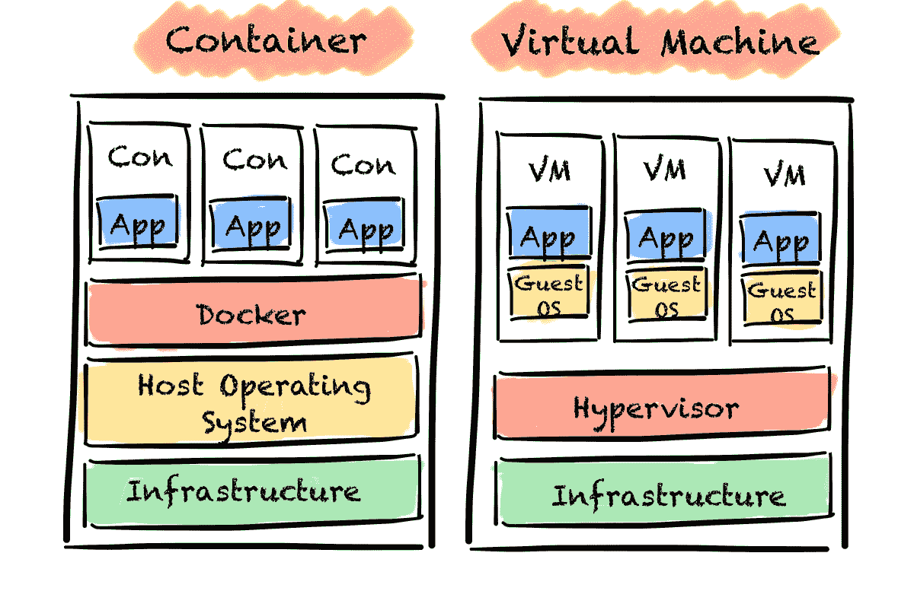
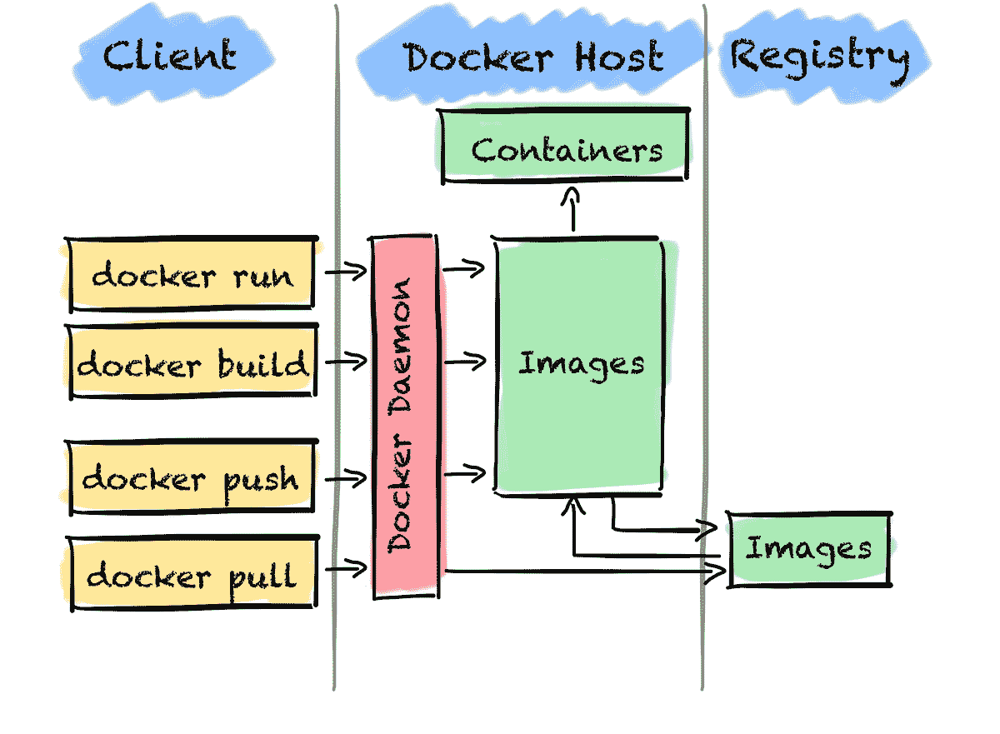

# 数据科学家指南：Docker 容器

> 原文：[`towardsdatascience.com/a-data-scientists-guide-to-docker-containers/`](https://towardsdatascience.com/a-data-scientists-guide-to-docker-containers/)

<mdspan datatext="el1744091632793" class="mdspan-comment">对于</mdspan>一个机器学习<mdspan datatext="el1744142294300" class="mdspan-comment">模型</mdspan>来说，要变得有用，它需要在某个地方运行。这个“某个地方”很可能是你的本地机器。在生产环境中运行的一个不太好的模型，比一个从未离开你本地机器的完美模型要好。

然而，生产机器通常与你在上面开发模型的机器不同。所以，你将模型发送到生产机器，但不知何故，模型不再工作了。这很奇怪，对吧？你在本地机器上测试了一切，它都运行得很好。你甚至编写了单元测试。

发生了什么？最可能的情况是生产机器与你的本地机器不同。也许它没有安装所有运行你的模型所需的依赖项。也许安装的依赖项版本不同。可能有许多原因。

你如何解决这个问题？一种方法可能是完全复制生产机器。但这非常不灵活，因为对于每一台新的生产机器，你都需要构建一个本地的副本。

一个更好的方法是使用 Docker 容器。

Docker 是一个帮助我们创建、管理和运行容器中代码和应用程序的工具。容器是一个小的隔离计算环境，我们可以在这个环境中打包一个应用程序及其所有依赖项。在我们的案例中，我们的机器学习模型及其运行所需的全部库。有了这个，我们不需要依赖于主机机器上安装的内容。Docker 容器使我们能够将应用程序与底层基础设施分离。

例如，我们可以在本地打包我们的机器学习模型并将其推送到云端。有了这个，Docker 帮助我们确保我们的模型可以在任何地方和任何时候运行。使用 Docker 对我们来说有几个优点。它帮助我们更快地交付新模型，提高可重复性，并使协作更加容易。所有这一切都因为我们无论在哪里运行容器，都拥有完全相同的依赖项。

由于 Docker 在业界广泛使用，数据科学家需要能够使用 Docker 构建和运行容器。因此，在这篇文章中，我将介绍容器的基本概念。我会向你展示你需要了解的所有关于 Docker 的知识，以便开始使用。在覆盖了理论之后，我会向你展示如何构建和运行你自己的 Docker 容器。

* * *

## 什么是容器？

容器是一个小型的、隔离的环境，其中所有内容都是自包含的。环境打包了所有代码和依赖项。

容器具有五个主要特性。

1.  **自包含**：容器将应用程序/软件与其环境/基础设施隔离开来。由于这种隔离，我们不需要依赖宿主机器上预先安装的任何依赖项。我们需要的一切都是容器的一部分。这确保了应用程序可以在任何基础设施上始终运行。

1.  **隔离**：容器对宿主和其他容器的影响最小，反之亦然。

1.  **独立**：我们可以独立管理容器。删除一个容器不会影响其他容器。

1.  **便携性**：由于容器将软件与硬件隔离开来，我们可以在任何机器上无缝运行它。有了这个，我们可以在机器之间移动它而不会出现问题。

1.  **轻量级**：容器轻量，因为它们共享宿主机的操作系统。由于它们不需要自己的操作系统，我们不需要分割宿主机的硬件资源。

这可能听起来与虚拟机相似。但有一个很大的区别。区别在于它们如何使用宿主计算机的资源。虚拟机是物理硬件的抽象。它们将一个服务器分割成多个。因此，虚拟机包括一个完整的操作系统副本，这会占用更多空间。

相比之下，容器是应用层的一个抽象。所有容器共享宿主机的操作系统，但运行在隔离的进程中。因为容器不包含操作系统，它们通过减少开销，在利用底层系统和资源方面更加高效。

容器与虚拟机对比（作者基于[docker.com](https://www.docker.com/resources/what-container/)绘制的图像）

现在我们已经知道了容器是什么。让我们对 Docker 的工作原理有一个高层次的理解。我将简要介绍常用的一些技术术语。

* * *

## 什么是 Docker？

要了解 Docker 是如何工作的，让我们简要地看看它的架构。

Docker 使用一个包含三个主要部分的客户端-服务器架构：Docker 客户端、Docker 守护进程（服务器）和 Docker 仓库。

Docker 客户端是通过命令与 Docker 交互的主要方式。我们使用客户端通过 REST API 与任意数量的 Docker 守护进程进行通信。常用的命令有 docker run、docker build、docker pull 和 docker push。我将在后面解释它们的作用。

Docker 守护进程管理 Docker 对象，如镜像和容器。守护进程监听 Docker API 请求。根据请求，守护进程构建、运行和分发 Docker 容器。Docker 守护进程和客户端可以在同一系统或不同系统上运行。

Docker 仓库是一个集中位置，用于存储和管理 Docker 镜像。我们可以使用它们来共享镜像，并使它们对他人可用。

听起来有点抽象？不用担心，一旦我们开始，它就会更加直观。但在那之前，让我们回顾一下创建 Docker 容器所需的步骤。

Docker 架构（图片由作者根据[docker.com](https://docs.docker.com/get-started/docker-overview/)制作）

* * *

## 我们需要什么来创建 Docker 容器？

这很简单。我们只需要做三个步骤：

1.  创建 Dockerfile

1.  从 Dockerfile 构建 Docker 镜像

1.  运行 Docker 镜像以创建 Docker 容器

让我们一步一步来。

Dockerfile 是一个包含如何构建 Docker 镜像的指令的文本文件。在 Dockerfile 中，我们定义应用程序的外观及其依赖项。我们还声明在启动 Docker 容器时应运行哪个进程。Dockerfile 由层组成，代表镜像文件系统的一部分。每一层要么添加、删除，要么修改其下方的层。

根据 Dockerfile，我们创建一个 Docker 镜像。镜像是一个只读模板，包含运行 Docker 容器的指令。镜像是不可变的。一旦我们创建了一个 Docker 镜像，我们就不能再修改它了。如果我们想进行更改，我们只能在现有镜像之上添加更改或创建一个新的镜像。当我们重新构建镜像时，Docker 足够聪明，只重新构建已更改的层，从而减少构建时间。

Docker 容器是 Docker 镜像的可运行实例。容器由镜像定义，以及我们在创建或启动容器时提供的任何配置选项。当我们删除容器时，如果它们没有存储在持久存储中，其内部状态的所有更改也将被删除。

* * *

## 使用 Docker：一个示例

在所有理论的基础上，让我们动手将一切组合起来。

例如，我们将使用 Flask 将一个简单的 ML 模型打包到 Docker 容器中。然后我们可以对容器进行请求并接收预测作为回应。我们将在本地训练一个模型，并且只加载训练模型的工件到 Docker 容器中。

我将介绍创建和运行带有您的 ML 模型的 Docker 容器所需的一般工作流程。我将引导您完成以下步骤：

1.  构建模型

1.  创建包含所有依赖项的`requirements.txt`文件

1.  创建`Dockerfile`

1.  构建 Docker 镜像

1.  运行容器

在我们开始之前，我们需要安装 Docker Desktop。我们将使用它来查看和运行我们的 Docker 容器。

### 1. 构建模型

首先，我们将使用`scikit-learn`的 Iris 数据集训练一个简单的 RandomForestClassifier，然后存储训练好的模型。

第二，我们将使用 Flask 构建一个脚本，使我们的模型可以通过 Rest API 提供。该脚本也很简单，包含三个主要步骤：

1.  从负载 JSON 中提取和转换我们想要传递给模型的所需数据

1.  加载模型工件并创建一个 onnx 会话并运行模型

1.  将模型的预测作为 json 返回

我从[这里](https://onnx.ai/sklearn-onnx/index.html)和[这里](https://github.com/docker/awesome-compose/tree/master/flask)复制了大部分代码，并做了些小的修改。

### 2. 创建需求

一旦我们创建了在 Docker 容器运行时想要执行的 Python 文件，我们必须创建一个包含所有依赖项的`requirements.txt`文件。在我们的例子中，它看起来像这样：

### 3. 创建 Dockerfile

在能够构建 Docker 镜像和运行 Docker 容器之前，我们需要准备的最后一件事情是编写一个 Dockerfile。

Dockerfile 包含了构建 Docker 镜像所需的所有指令。最常见的指令包括

+   `FROM <image>` — 这条指令指定了构建将扩展的基础镜像。

+   `WORKDIR <path>` — 这条指令指定了“工作目录”或镜像中文件将被复制和命令将执行的路由。

+   `COPY <host-path><image-path>` — 这条指令告诉构建器从主机复制文件并将它们放入容器镜像中。

+   `RUN <command>` — 这条指令告诉构建器运行指定的命令。

+   `ENV <name><value>` — 这条指令设置了一个环境变量，运行中的容器将使用这个变量。

+   `EXPOSE <port-number>` — 这条指令在镜像上设置配置，指示镜像希望暴露的端口。

+   `USER <user-or-uid>` — 这条指令为所有后续指令设置默认用户。

+   `CMD ["<command>", "<arg1>"]` — 这条指令设置了一个使用此镜像的容器将运行的默认命令。

使用这些指令，我们可以为我们的示例创建 Dockerfile。我们需要遵循以下步骤：

1.  确定基础镜像

1.  安装应用程序依赖项

1.  复制任何相关的源代码和/或二进制文件

1.  配置最终镜像

让我们一步一步地来看。这些步骤中的每一个都会在 Docker 镜像中产生一个层。

首先，我们指定基础镜像，然后在此基础上构建。正如我们在 Python 示例中所写的，我们将使用 Python 基础镜像。

第二，我们将工作目录设置为我们将复制所有需要的文件以运行我们的 ML 模型。

第三，我们刷新包索引文件，以确保我们拥有有关包及其版本的最新可用信息。

第四，我们复制并安装应用程序依赖项。

第五，我们将源代码和所有其他需要的文件复制进来。在这里，我们也暴露了 8080 端口，我们将使用这个端口与 ML 模型交互。

第六，我们设置了一个用户，这样容器就不会以 root 用户运行。

第七，我们定义当运行 Docker 容器时将执行`example.py`文件。有了这个，我们创建了一个 Flask 服务器来运行我们的请求。

除了创建 Dockerfile 之外，我们还可以创建一个`.dockerignore`文件来提高构建速度。类似于`.gitignore`文件，我们可以从构建上下文中排除目录。

如果你想了解更多信息，请访问[docker.com](https://docs.docker.com/get-started/docker-concepts/building-images/writing-a-dockerfile/)。

### 4. 创建 Docker 镜像

在我们创建了构建 Docker 镜像所需的所有文件之后。

要构建镜像，我们首先需要打开 Docker Desktop。您可以在命令行中运行 `docker ps` 来检查 Docker Desktop 是否正在运行。这个命令显示了所有正在运行的容器。

要构建 Docker 镜像，我们需要与我们的 Dockerfile 和 `requirements.txt` 文件处于同一级别。然后我们可以运行 `docker build -t our_first_image .`。`-t` 标志表示镜像的名称，即 `our_first_image`，而 `.` 告诉我们从这个当前目录构建。

一旦我们构建了镜像，我们就可以做很多事情。我们可以

+   通过运行 `docker image ls` 来查看镜像

+   通过运行 `docker image history <image_name>` 来查看镜像的历史或它是如何创建的

+   通过运行 `docker push <image_name>` 将镜像推送到注册表

### 5. 运行 Docker 容器

一旦我们构建了 Docker 镜像，我们就可以在容器中运行我们的机器学习模型。

对于这一点，我们只需要在命令行中执行 `docker run -p 8080:8080 <image_name>`。通过 `-p 8080:8080`，我们将本地端口（8080）与容器中的端口（8080）连接起来。

如果 Docker 镜像没有暴露端口，我们可以简单地运行 `docker run <image_name>`。除了使用 `image_name`，我们还可以使用 `image_id`。

好的，一旦容器开始运行，让我们向它发送一个请求。为此，我们将通过运行 `curl` 命令 `X POST http://localhost:8080/invocations -H "Content-Type:application/json" -d @.path/to/sample_payload.json` 向端点发送有效载荷。

* * *

## 结论

在这篇文章中，我向您展示了 Docker 容器的基础知识，它们是什么，以及如何自己构建它们。尽管我只是触及了表面，但这应该足以让您开始，并能够打包您的下一个模型。有了这些知识，您应该能够避免“在我的机器上运行正常”的问题。

我希望您觉得这篇文章有用，并且它能帮助您成为一名更好的数据科学家。

欢迎在下一篇文章中见到您，或者留下评论。
