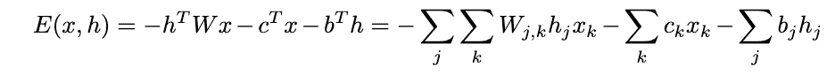
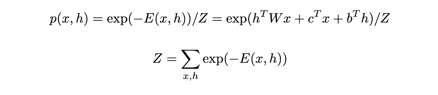
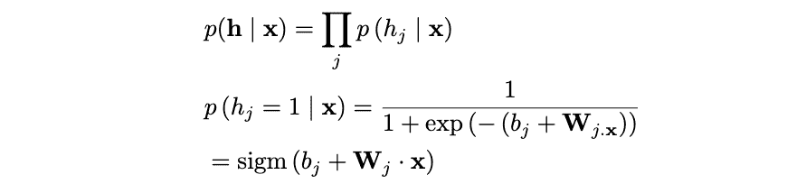
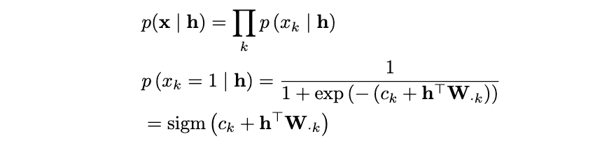
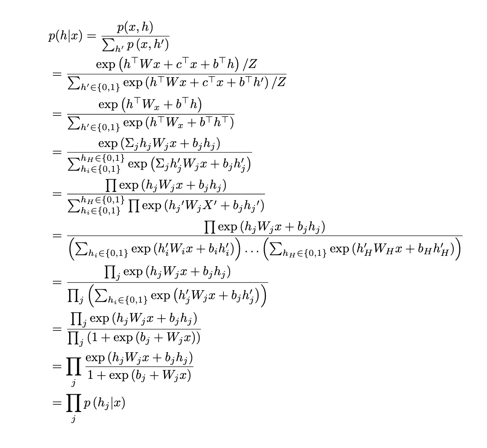

# 限制性玻尔兹曼机的推导与应用（2024 年诺贝尔奖）

> 原文：[`towardsdatascience.com/a-derivation-and-application-of-restricted-boltzmann-machines-2024-nobel-prize-ead5fe66908c/`](https://towardsdatascience.com/a-derivation-and-application-of-restricted-boltzmann-machines-2024-nobel-prize-ead5fe66908c/)

2024 年诺贝尔物理学奖获得者之一是杰弗里·辛顿，他在人工智能和机器学习领域的贡献。很多人知道他从事神经网络的研究，被称为“人工智能之父”，但很少有人了解他的工作。特别是，他几十年前开创了限制性玻尔兹曼机（RBMs）。

本文将带您了解 RBMs 的入门教程，并希望提供一些对这些复杂数学机器背后的直觉。在推导完公式后，我将提供一些使用 PyTorch 从头开始实现 RBMs 的代码。

## RBMs 概述

RBMs 是一种无监督学习形式（仅使用输入进行学习，不使用输出标签）。这意味着我们可以自动从数据中提取有意义的特征，而不依赖于输出。RBM 是一个具有两种不同类型神经元的网络，具有二元输入：可见的*x*和隐藏的*h*。可见神经元接收输入数据，而隐藏神经元学习检测特征/模式。

![RBM 输入 x 和隐藏层 y 的图。来源：[1]](../Images/354535a27f7b676f02b5f7deb88dc365.png)

RBM 输入***x**和隐藏层**y**。来源：[1]*

从更技术性的角度来说，我们说 RBM 是一个无向二分图模型，具有随机的二元可见和隐藏变量。RBM 的主要目标是通过对比学习（稍后讨论）最小化联合配置的能量 _E(*x,h*)。

## 什么是能量？

能量函数并不对应物理能量，但它确实来源于物理学/统计学。可以将其视为一个评分函数。能量函数*E*将较低的分数（能量）分配给我们希望模型偏好的配置*x*，而将较高的分数分配给我们希望模型避免的配置。能量函数是我们作为模型设计者可以做出选择的东西。

对于 RBMs，能量函数如下（基于玻尔兹曼分布）：



RBM 能量函数。来源：作者

能量函数由 3 个部分组成。第一个是隐藏层和可见层之间的交互作用，权重为*W*。第二个是可见单元的偏置项之和。第三个是隐藏单元的偏置项之和。

## 概率分布

使用能量函数，我们可以根据玻尔兹曼分布计算联合配置的概率。有了这个概率函数，我们可以对我们的单元进行建模：



RBM 的联合配置概率。来源：作者

*Z* 是配分函数（也称为归一化常数）。它是所有可能的可见和隐藏单元配置的 e^(-E)之和。Z 的大挑战在于，通常计算上难以精确计算，因为你需要对所有可能的*v*和*h*配置求和。例如，对于二元单元，如果你有*m*个可见单元和*n*个隐藏单元，你需要对 2^(*m*+*n*)个配置求和。因此，我们需要一种避免计算*Z*的方法。

## 推理

定义了这些函数和分布后，我们可以在讨论训练和实现之前，回顾一些推理的推导。我们已经提到了在联合概率分布中计算*Z*的困难。为了解决这个问题，我们可以使用 Gibbs 抽样。Gibbs 抽样是一种马尔可夫链蒙特卡洛算法，用于从指定的多元概率分布中进行抽样，当直接从联合分布中进行抽样困难时，但从条件分布中进行抽样更为实际[2]。因此，我们需要条件分布。

与**全连接**的 Boltzmann 相比，**受限**的 Boltzmann 的一个优点是层内没有连接。这意味着给定可见层，所有隐藏单元都是条件独立的，反之亦然。让我们从 _p(*x|h)_ 开始看看这简化成了什么：



条件分布 *p(h|x)。来源：作者*

我们可以看到条件分布简化为一个 Sigmoid 函数，其中 j 是*W*的第 j 行。我在**附录**中包含了一个更为严格的计算，证明了这个推导的第一行。如有兴趣，请告知！现在让我们观察条件分布 *p*(h|x)：



条件分布 p(x|h)。来源：作者

我们可以看到这个条件分布也简化为一个 Sigmoid 函数，其中 k 是*W*的第 k 行。由于 RBM 的约束条件，条件分布简化为推理过程中的简单计算。一旦我们理解了 RBM 究竟试图学习什么，我们将在 PyTorch 中实现这一点。

## 模型学习

与大多数深度学习一样，我们试图最小化负对数似然（NLL）来训练我们的模型。对于 RBM：


RBM 的 NLL。来源：作者

对此求导得到：


NLL 的导数。来源：作者

方程左边第一个项被称为正相，因为它推动模型降低真实数据的能量。这一项涉及到在给定实际训练数据 *x* 的条件下对隐藏单元 *h* 的期望。正相容易计算，因为我们有实际的训练数据 xᵗ，并且由于条件独立性，可以计算 h 的期望。

第二项被称为负相，因为它提高了模型当前认为可能性的配置的能量。这一项涉及到在模型当前分布下对 *x* 和 *h* 的期望。这很难计算，因为我们需要从模型的全联合分布 *P*(x,h) 中采样（这样做需要马尔可夫链，这在训练中反复进行会效率低下）。另一个替代方案需要计算 *Z*，但我们已经认为这是不可行的。为了解决计算负相的问题，我们使用 **对比发散**。

## 对比发散

对比发散背后的关键思想是使用截断吉布斯采样在 k 次迭代后获得一个点估计。我们可以用这个点估计来替换负相的期望。

![对比发散。来源：[3]](../Images/27ee031a942e205a09af528a3a6b0c42.png)

对比发散。来源：[3]

通常 k = 1，但 k 越大，梯度估计的偏差就越小。我不会展示关于负相（权重/偏置更新）的不同偏导数的推导，但可以通过对 *E*(x,h) 关于变量的偏导数来推导。有一个持续对比发散的概念，其中我们不是将链初始化为 xᵗ，而是初始化为上一迭代周期的负样本。然而，我也不会深入探讨这一点，因为正常的对比发散已经足够有效。

## 实现 RBM

从头开始创建一个 RBM 涉及到将我们讨论的所有概念组合成一个类。在 **init** 构造函数中，我们初始化权重、可见层的偏置项、隐藏层的偏置项以及对比发散的迭代次数。我们需要的只是输入数据的大小、隐藏变量的大小和 k。

我们还需要定义一个伯努利分布来采样。伯努利分布在训练过程中被固定以防止梯度爆炸。这两个分布都在前向传递（对比发散）中使用。

```py
class RBM(nn.Module):
    """Restricted Boltzmann Machine template."""

    def __init__(self, D: int, F: int, k: int):
        """Creates an instance RBM module.

            Args:
                D: Size of the input data.
                F: Size of the hidden variable.
                k: Number of MCMC iterations for negative sampling.

        The function initializes the weight (W) and biases (c &amp; b).
        """
        super().__init__()
        self.W = nn.Parameter(torch.randn(F, D) * 1e-2) # Initialized from Normal(mean=0.0, variance=1e-4)
        self.c = nn.Parameter(torch.zeros(D)) # Initialized as 0.0
        self.b = nn.Parameter(torch.zeros(F)) # Initilaized as 0.0
        self.k = k

    def sample(self, p):
        """Sample from a bernoulli distribution defined by a given parameter."""
        p = torch.clamp(p, 0, 1)
        return torch.bernoulli(p)
```

构建 RBM 类别的下一个方法是条件分布。我们之前已经推导了这两个条件：

```py
def P_h_x(self, x):
    """Stable conditional probability calculation"""
    linear = torch.sigmoid(F.linear(x, self.W, self.b))
    return linear

def P_x_h(self, h):
    """Stable visible unit activation"""
    return self.c + torch.matmul(h, self.W)
```

最终方法包括前向传播和自由能函数的实现。能量函数代表在排除所有可能的隐藏单元配置后，可见单元的有效能量。前向函数是用于吉布斯抽样的经典对比散度。我们初始化 x_negative，然后进行 k 次迭代：从 P_h_x 和 x_negative 中获取 h_k，从伯努利分布中采样 h_k，从 P_x_h 和 h_k 中获取 x_k，然后获取新的 x_negative。

```py
def free_energy(self, x):
    """Numerically stable free energy calculation"""
    visible = torch.sum(x * self.c, dim=1)
    linear = F.linear(x, self.W, self.b)
    hidden = torch.sum(torch.log(1 + torch.exp(linear)), dim=1)
    return -visible - hidden

def forward(self, x):
    """Contrastive divergence forward pass"""
    x_negative = x.clone()

    for _ in range(self.k):
        h_k = self.P_h_x(x_negative)
        h_k = self.sample(h_k)
        x_k = self.P_x_h(h_k)
        x_negative = self.sample(x_k)

    return x_negative, x_k
```

希望这为 RBMs 背后的理论以及一个基本的编码实现类提供了基础，该类可用于训练 RBM。对于任何代码或进一步的推导，欢迎联系以获取更多信息！

## 附录

对于整体*p*(h|x)是每个单独条件分布的乘积的推导：



来源：作者

## 参考文献：

[1] Montufar, Guido. "受限玻尔兹曼机：介绍与综述。" *arXiv:1806.07066v1* (六月 2018).

[2] [`zh.wikipedia.org/wiki/Gibbs_sampling`](https://zh.wikipedia.org/wiki/Gibbs_sampling)

[3] Hinton, Geoffrey. "通过最小化对比散度训练专家乘积。" *Neural Computation* (2002).
