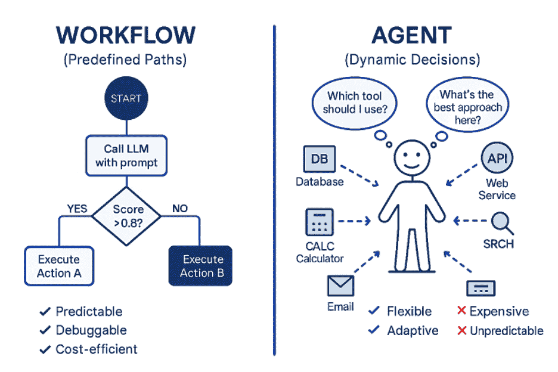
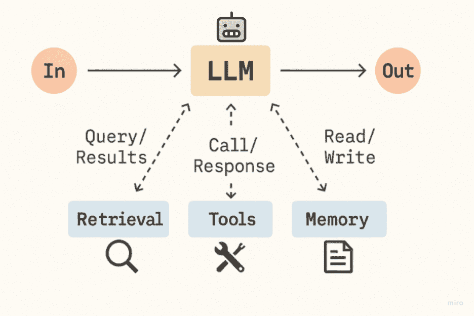
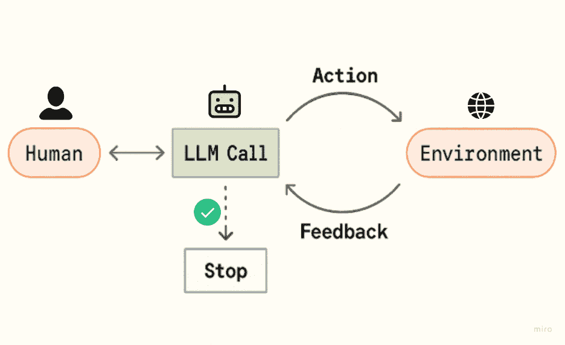
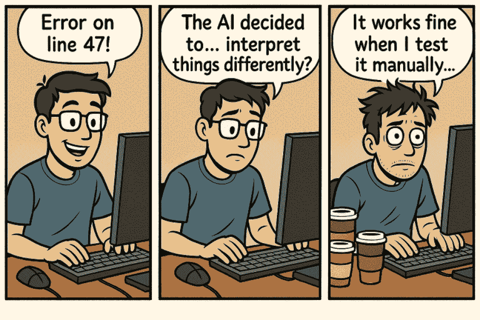
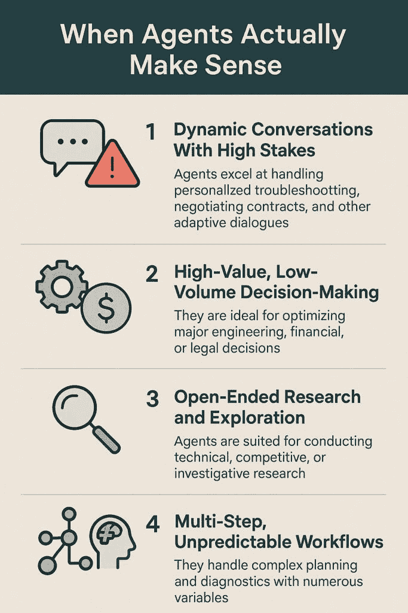
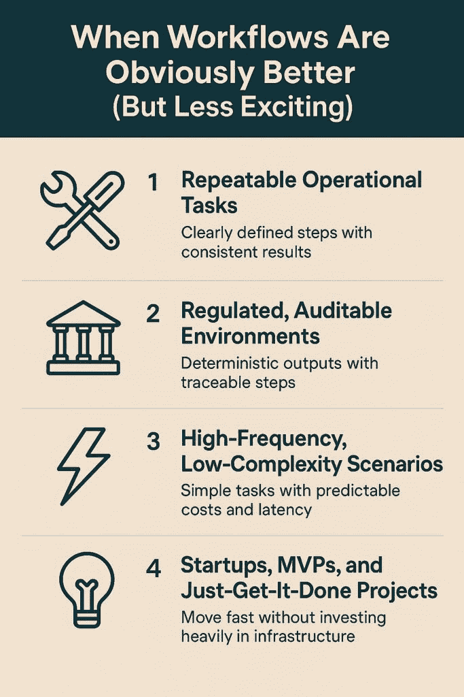
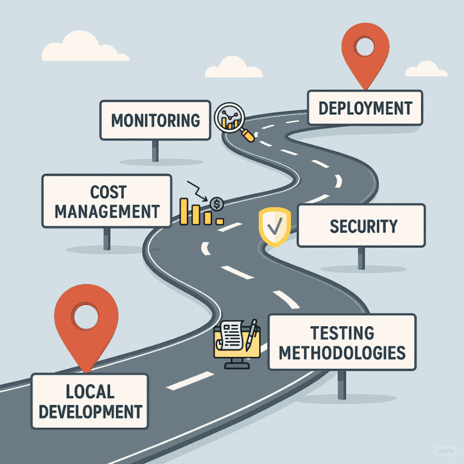

# 开发者构建可扩展 AI 指南：工作流程与代理

> 原文：[`towardsdatascience.com/a-developers-guide-to-building-scalable-ai-workflows-vs-agents/`](https://towardsdatascience.com/a-developers-guide-to-building-scalable-ai-workflows-vs-agents/)

<mdspan datatext="el1750979171594" class="mdspan-comment">不久前，大约三个月前，我陷入了代理的兔子洞中。</mdspan>

我刚开始尝试使用 CrewAI 和 LangGraph，感觉像是解锁了一个全新的构建维度。突然间，我不仅有了工具和管道——我有了*团队*。我可以启动能够推理、规划、与工具和彼此交流的代理。多代理系统！召唤其他代理的代理！我实际上在构建一个初创团队的 AI 版本。

每一个用例都成为了组建团队的一个候选者。会议准备？团队。幻灯片生成？团队。实验室报告审查？团队。

这很令人兴奋——直到它不再令人兴奋。

我构建得越多，遇到的问题就越多，这些问题我之前没有仔细思考过：*我该如何监控它？我该如何调试一个代理不断“思考”的循环？当某件事出错时会发生什么？是否有人能和我一起维护这个系统？*

那时我意识到我忽略了一个关键问题：*这真的需要是代理吗？* 或者我只是对使用这个闪亮的新事物感到兴奋？

从那时起，我变得更加谨慎——也更加务实。因为根据[Anthropic](https://www.anthropic.com/engineering/building-effective-agents)的说法，在以下两者之间存在着很大的区别：

+   **工作流程**：一个具有清晰控制流的 LLM 管道，你定义步骤——使用工具、检索上下文、调用模型、处理输出。

+   以及一个**代理**：一个由 LLM 自主决定下一步做什么、使用哪些工具以及何时“完成”的自主系统。

工作流程更像是你在发号施令，而 LLM 跟随你的领导。代理更像是雇佣一个聪明但有点混乱的实习生，他自己解决问题——有时做得很好，有时以令人恐惧昂贵的代价。

这篇文章是为那些在思考过维护所需条件之前，曾有过建立多代理帝国诱惑的人而写的。这不是一个警告，而是一个现实检查——以及一个指南。因为确实有需要代理的时候。但大多数时候？你只需要一个稳固的工作流程。

* * *

## 目录

1.  AI 代理的现状：每个人都这么做，但没有人知道为什么

1.  技术现实检查：你实际上在做什么选择

    +   工作流程：准时出现的可靠朋友

    +   代理：有时会越界的聪明孩子

1.  无人谈论的隐藏成本

1.  当代理真正有意义时

1.  当工作流程显然更好（但不太令人兴奋）时

1.  一个真正有效的决策框架

    +   评分过程：因为单因素决策是项目死亡的原因

1.  剧情转折：你不必做出选择

1.  生产部署——理论与实践相遇的地方

    +   监控（因为“在我的机器上运行正常”无法扩展）

    +   成本管理（在你首席财务官进行干预之前）

    +   安全（因为自主 AI 和安全是最好的朋友）

    +   测试方法（因为“信任但核实”也适用于 AI）

1.  真诚推荐

1.  参考文献

* * *

## AI 代理的状态：每个人都这样做，但没有人知道为什么

你可能已经看到了统计数据。根据贝恩公司 2024 年的调查，现在 95%的公司正在使用生成式 AI，其中 79%特别实施了 AI 代理[（https://www.bain.com/insights/survey-generative-ai-uptake-is-unprecedented-despite-roadblocks/）]。这听起来很令人印象深刻——直到你仔细看看，发现其中只有*1%*认为这些实施是“成熟的”。

翻译：大多数团队都在用胶带把东西粘在一起，希望它们在生产中不会爆炸。

我这样说是因为爱——我曾经也是其中之一。

当你第一次构建一个有效的代理系统——即使是一个小的——你会觉得它*就像魔法一样*。LLM 决定做什么，选择工具，循环步骤，然后带着一个答案回来，就像它刚刚进行了一次迷你旅行。你想：“为什么我还要写僵化的管道，当我可以让模型自己解决这些问题呢？”

然后，复杂性逐渐渗透进来。

你从干净的管道变成了一个由手持工具的 LLM 组成的网络，它们在循环中推理。你开始编写逻辑来纠正代理的逻辑。你构建一个代理来监督其他代理。在你意识到之前，你正在维护一个由焦虑的实习生组成的分布式系统，他们没有成本意识。

是的，确实有成功的案例。[Klarna 的代理处理了 700 名客户服务代表的 workload](https://www.klarna.com/international/press/klarna-ai-assistant-handles-two-thirds-of-customer-service-chats-in-its-first-month/)。[BCG 构建了一个多代理设计系统，将造船工程时间减少了近一半](https://www.bcg.com/publications/2025/how-ai-can-be-the-new-all-star-on-your-team)。这些不是演示——这些是生产系统，为公司节省了实际的时间和金钱。

但这些公司并非偶然达到这一地步。幕后，他们投资了基础设施、可观察性、回退系统、预算控制和能够在凌晨 3 点调试提示链而不会哭泣的团队。

对于我们大多数人来说？我们不是 Klarna。我们正在尝试让某些东西工作，使其可靠、经济高效，并且不会比结构良好的管道消耗多 20 倍的令牌。

所以，是的，代理*可以*很棒。但我们必须停止假装它们是默认的。仅仅因为模型*可以*决定下一步做什么，并不意味着它*应该*这样做。仅仅因为流程是动态的，并不意味着系统是智能的。而且，仅仅因为每个人都这样做，并不意味着你需要跟随。

有时候，使用代理就像用主厨替换微波炉——更灵活，但也更昂贵，更难管理，偶尔会做出你不需要的决定。

让我们弄清楚何时实际上走那条路线是有意义的——以及何时你应该坚持使用一些有效的方法。

## 技术现实检查：你实际上在选择的到底是什么

在我们深入探讨选择代理和工作流程的生存危机之前，让我们先明确我们的定义。因为在典型的技术风格中，每个人都在用这些术语来表示略有不同的事情。



图片由作者创作

### 工作流程：准时出现的可靠朋友

工作流程是编排的。你编写逻辑：可能使用向量存储检索上下文，调用工具链，然后使用 LLM 总结结果。每一步都是明确的。就像一个食谱。如果它出问题，你知道它发生在哪里——以及可能如何修复它。

这就是大多数“RAG 管道”或提示链的样子。可控的、可测试的、成本可预测的。

美妙之处在于，你可以像调试任何其他软件一样调试它们。堆栈跟踪、日志、回退逻辑。如果向量搜索失败，你会捕捉到它。如果模型响应异常，你会重新路由它。

工作流程是你的可靠朋友，它会准时出现，坚持计划，并且不会因为觉得“效率低下”就重新编写你的整个数据库架构。



图片由作者创作，灵感来自[Anthropic](https://www.anthropic.com/engineering/building-effective-agents)

在这个简单的客户支持任务示例中，这个工作流程始终遵循相同的分类→路由→响应→记录模式。它是可预测的、可调试的，并且表现一致。

```py
def customer_support_workflow(customer_message, customer_id):
    """Predefined workflow with explicit control flow"""

    # Step 1: Classify the message type
    classification_prompt = f"Classify this message: {customer_message}\nOptions: billing, technical, general"
    message_type = llm_call(classification_prompt)

    # Step 2: Route based on classification (explicit paths)
    if message_type == "billing":
        # Get customer billing info
        billing_data = get_customer_billing(customer_id)
        response_prompt = f"Answer this billing question: {customer_message}\nBilling data: {billing_data}"

    elif message_type == "technical":
        # Get product info
        product_data = get_product_info(customer_id)
        response_prompt = f"Answer this technical question: {customer_message}\nProduct info: {product_data}"

    else:  # general
        response_prompt = f"Provide a helpful general response to: {customer_message}"

    # Step 3: Generate response
    response = llm_call(response_prompt)

    # Step 4: Log interaction (explicit)
    log_interaction(customer_id, message_type, response)

    return response
```

确定性方法提供：

+   **可预测的执行**：输入 A 总是导致过程 B，然后结果是 C

+   **显式错误处理**：“如果这个出问题，就做那件事”

+   **透明的调试**：你可以直接跟踪代码以找到问题

+   **资源优化**：你知道每样东西将花费多少

[工作流程实现提供一致的商业价值](https://ascendix.com/blog/salesforce-success-stories/)：OneUnited 银行实现了 89%的信用卡转换率，而 Sequoia 金融集团每年为每个用户节省了 700 小时。不如“自主 AI”性感，但你的运营团队会爱你。

### 代理：有时会越界的聪明孩子

另一方面，代理是围绕循环构建的。LLM 获得一个目标，并开始推理如何实现它。它选择工具，采取行动，评估结果，并决定下一步做什么——所有这些都在递归决策循环中进行。

这就是事情变得……有趣的地方。



图片由作者创作，灵感来自[Anthropic](https://www.anthropic.com/engineering/building-effective-agents)

该架构使一些真正令人印象深刻的功能成为可能：

+   **动态工具选择**：“我应该查询数据库还是调用 API？让我想想……”

+   **适应性推理**：在同一个对话中从错误中学习

+   **自我纠正**：“那不行，让我试试不同的方法”

+   **复杂状态管理**：跟踪三步之前发生了什么

在同一个例子中，代理可能会先搜索知识库，然后获取账单信息，然后提出澄清问题——所有这些都基于其对客户需求的解释。执行路径根据代理推理过程中的发现而变化：

```py
def customer_support_agent(customer_message, customer_id):
    """Agent with dynamic tool selection and reasoning"""

    # Available tools for the agent
    tools = {
        "get_billing_info": lambda: get_customer_billing(customer_id),
        "get_product_info": lambda: get_product_info(customer_id),
        "search_knowledge_base": lambda query: search_kb(query),
        "escalate_to_human": lambda: create_escalation(customer_id),
    }

    # Agent prompt with tool descriptions
    agent_prompt = f"""
    You are a customer support agent. Help with this message: "{customer_message}"

    Available tools: {list(tools.keys())}

    Think step by step:
    1\. What type of question is this?
    2\. What information do I need?
    3\. Which tools should I use and in what order?
    4\. How should I respond?

    Use tools dynamically based on what you discover.
    """

    # Agent decides what to do (dynamic reasoning)
    agent_response = llm_agent_call(agent_prompt, tools)

    return agent_response
```

是的，正是这种自主权让代理变得强大。这也是它们难以控制的原因。

你的代理可能会：

+   决定在中途尝试新的策略

+   忘记它已经尝试过的事情

+   或者连续 15 次调用工具试图“弄清楚事情”

你不能只是设置一个断点来检查堆栈。这里的“堆栈”在模型的上下文窗口内，而“变量”是由你的提示塑造的模糊思维。

当事情出错——而且它会的——你不会得到一个友好的红色错误消息。你得到的是一个看起来像是某人误输了循环条件的代币账单，它召唤了 OpenAI API 600 次。（我知道，因为我至少有一次忘记设置循环上限，代理一直在思考……直到整个系统因为“代币不足”错误而崩溃）。

* * *

用更简单的话来说，你可以这样想：

**工作流程**就像 GPS。

你知道目的地。你遵循清晰的指令。“左转。在这里合并。你到了。”这是结构化的，可预测的，你几乎总是能到达目的地——除非你故意忽略它。

**代理**是不同的。就像给某人一张地图，一部智能手机，一张信用卡，然后说：

> “想想怎么去机场。你可以步行，叫一辆出租车，如果需要的话绕道——只要能成功就好。”

它们可能会更快到达。或者它们可能会与共享出行应用争论，走一条风景优美的路线，然后一个小时后带着价值 18 美元的冰沙到达。（我们都知道这样的人）。

**两种方法都可以行得通**，但真正的问题是：

> **你在这里实际上需要的是自主权，还是一套可靠的指令？**

因为这里的关键是——代理听起来很棒。在理论上确实如此。你可能看过这些标题：

+   “部署一个代理来处理你的整个支持流程！”

+   “让 AI 在你睡觉时管理你的任务！”

+   “革命性的多代理系统——你的个人云端咨询公司！”

这些案例研究到处都是。其中一些是真实的。但大多数呢？

它们就像 Instagram 上的旅行照片。你看到的是璀璨的日落，完美的天际线。你看不到的是六小时的转机等待，错过的火车，机场里价值 25 美元的三明治，或是从街头玉米卷带来的三天胃病。

这就是代理成功故事常常遗漏的部分：**操作的复杂性，调试的痛苦，不断攀升的代币账单**。

嗯，是的，代理*可以*带你到想去的地方。但在你交出钥匙之前，确保你接受他们可能选择的路线。并且你能负担得起过路费。

## 没有人谈论的隐藏成本

在纸上，代理看起来很神奇。你给他们一个目标，他们就会想出如何实现它。无需硬编码控制流。只需定义一个任务，让系统处理其余部分。

理论上，这很优雅。实际上，它就像穿着风衣的混乱。

让我们谈谈成为代理的真正成本——不仅仅是金钱，还有复杂性、失败模式和你的工程团队的情感磨损。

### 令牌成本快速增加

[根据 Anthropic 的研究](https://www.anthropic.com/engineering/built-multi-agent-research-system)，代理消耗的令牌比简单的聊天交互多 4 倍。多代理系统？试试 15 倍。这不是一个错误——这正是重点。它们循环、推理、重新评估，并在做出决定之前往往多次与自己交谈。

这就是数学分解的方式：

+   **基本工作流程**：每月 500 美元，用于 10 万次交互

+   **单代理系统**：每月 2000 美元（相同数量的使用量）

+   **多代理系统**：每月 7500 美元（假设每 1K 令牌 0.005 美元）

如果一切按预期进行，那就是这样。

如果代理陷入工具调用循环或误解了指令？你将看到使你的账单仪表板看起来像加密货币的泵和放图表的峰值。

### 调试感觉像是 AI 考古学

使用工作流程，调试就像在明亮的房子里散步。你可以追踪输入 → 函数 → 输出。很简单。

使用代理？这更像是漫步在一个未绘制的森林中，树木偶尔会重新排列自己。你不会得到传统的日志。你得到的是*推理轨迹*，充满了模型生成的思想，例如：

> “嗯，那没起作用。我会尝试另一种方法。”

那不是堆栈跟踪。那是一个 AI 日记条目。它很诗意，但生产中出现问题时并不实用。

真正“有趣”的部分？**代理系统中的错误传播可以以完全不可预测的方式级联**。推理链中早期的错误决策可能导致代理陷入越来越错误的结论，就像一个电话游戏，每个玩家也在尝试解决一个数学问题。当“错误”是 AI 决定创造性地解释你的指令时，传统的调试方法——设置断点、跟踪执行路径、检查变量状态——就变得不那么有帮助了。



图片由作者提供，由 GPT-4o 生成

### 新的、你从未需要考虑过的失败模式

[微软的研究已经确定了](https://www.microsoft.com/en-us/security/blog/2025/04/24/new-whitepaper-outlines-the-taxonomy-of-failure-modes-in-ai-agents/)全新的、之前代理所不具备的**失败模式**。以下是一些在传统管道中不常见的例子：

+   **智能体注入**：基于提示的漏洞，劫持智能体的推理

+   **多智能体越狱**：智能体以非预期的方式进行勾结

+   **内存中毒**：一个智能体用幻觉的胡言乱语破坏了共享内存

这些不再是边缘情况了——它们变得足够普遍，以至于“LLMOps”的整个子领域现在就是为了处理这些问题而存在的。

如果你的监控堆栈不跟踪令牌漂移、工具垃圾邮件或新兴的智能体行为，你就是在盲目飞行。

### 你可能需要一些你目前没有的基础设施

基于智能体的系统不仅需要计算能力，还需要新的工具层。

你可能会拼凑出一些组合：

+   **LangFuse**、**Arize**或**Phoenix**用于可观察性

+   **AgentOps**用于成本和行为监控

+   定制令牌守卫和回退策略以停止失控循环

这个工具栈**不是可选的**。它是保持系统稳定所必需的。

如果你还没有这样做？你还没有准备好在生产中使用智能体——至少，不是那些影响真实用户或金钱的智能体。

* * *

所以，是的。问题不是智能体“不好”。它们只是比大多数人一开始玩它们时意识到的要昂贵得多——在财务、技术和情感上。

困难的部分是，这些在演示中都没有体现出来。在演示中，它看起来很干净、可控、令人印象深刻。

但在生产中，事情会泄露。系统循环。上下文窗口溢出。你只能向你的老板解释为什么你的 AI 系统花费了 5000 美元来计算发送电子邮件的最佳时间。

## 当智能体真正有意义时

*[在我们深入探讨智能体成功案例之前，先做一个快速的现实检查：这些是从分析当前实现中观察到的模式，而不是软件架构的普遍定律。你的体验可能会有所不同，而且有许多组织在智能体可能理论上有出色表现的场景中成功使用工作流程。将这些有见地的观察视为而不是刻在硅片上的神圣命令。]*

好吧。我之前在智能体系统中抛了很多警戒带——但我不是来永远吓跑你的。

因为有时候，智能体正是你所需要的。它们在方式上非常出色，而僵化的工作流程是无法做到的。

关键在于知道“我想尝试智能体因为它们很酷”和“这个用例实际上需要自主性”之间的区别。

这里有一些智能体真正发挥作用的场景。

### 动态对话和高风险

假设你正在构建一个客户支持系统。一些查询很简单——退款状态、密码重置等。一个简单的流程可以完美处理这些。

但其他对话？它们需要适应。来回推理。根据用户所说的实时优先考虑下一个问题。

这就是智能体发光的地方。

在这些环境中，你不仅仅是填写表格——你是在导航一个情况。个性化的故障排除、产品推荐、合同谈判——这些下一步完全取决于刚刚发生的事情。

实施基于代理的客户支持系统的公司报告了惊人的投资回报率——我们谈论的是[112%到 457%](https://www.mckinsey.com/capabilities/quantumblack/our-insights/the-state-of-ai)的效率提升和转化率增加，具体取决于行业。因为当做得正确时，代理系统*感觉*更聪明。这导致了信任。

### 高价值、低频决策

代理很昂贵。但有时，他们帮助做出的决策*更*昂贵。

BCG 帮助一家造船公司通过多代理设计系统减少了 45%的工程工作量。这是值得的——因为这些决策与数百万美元的结果相关。

如果你正在优化如何在大陆上铺设光纤电缆或分析影响整个公司的合同中的法律风险——在计算上多花一些钱并不是问题。错误的决定才是。

代理之所以在这里工作，是因为*犯错的成本*远远高于*计算的成本*。



图片由作者提供

### 开放式研究和探索

有一些问题，你实际上无法事先定义流程图——因为你不知道“正确的步骤”是什么。

代理擅长深入模糊的任务，分解它们，迭代他们发现的内容，并实时适应。

思考：

+   技术研究助理，阅读、总结和比较论文

+   产品分析机器人，探索竞争对手并综合见解

+   研究代理，调查边缘案例并提出假设

这些不是有已知程序的问题。它们本质上就是开放循环——代理在这些环境中茁壮成长。

### **多步骤、不可预测的工作流程**

有些任务分支太多，无法硬编码——那种写出所有“如果这个，那么那个”条件变成全职工作的类型。

这就是代理循环实际上可以*简化*事情的地方，因为 LLM 根据上下文动态处理流程，而不是预先编写的逻辑。

思考诊断、规划工具或需要考虑数十个不可预测变量的系统。

如果你的逻辑树开始看起来像是由喝了咖啡因的章鱼制作的意大利面图——是的，可能到了让模型接管方向盘的时候了。

* * *

所以，不，我不是反代理（我实际上很喜欢它们！）我是支持对齐——将工具与任务匹配。

当使用案例*需要*灵活性、适应性和自主性时，那么是的——引入代理。但只有在你诚实地评估自己是否在解决真正的复杂性……或者只是在追逐一个闪亮的抽象时。

## 当工作流程显然更好（但不太吸引人）时

*（再次强调，这些是从行业分析中得出的观察结果，而不是不可动摇的规则。毫无疑问，有些公司正在成功使用代理进行监管流程或成本敏感型应用——可能是因为它们有特定的要求、非凡的专业知识或改变经济学的商业模式。将这些视为强有力的起始建议，而不是对可能性的限制。）*

让我们稍微退后一步。

许多关于 AI 架构的对话都陷入了炒作循环——“代理是未来！”“AutoGPT 可以建立公司！”——但在实际的生产环境中，大多数系统不需要代理。

它们需要一些能够正常工作的事物。

这就是工作流程的用武之地。虽然它们可能感觉不那么未来派，但在我们大多数人构建的环境中，它们**极其有效**。

### 可重复的操作任务

如果你的用例涉及明确定义且很少改变的步骤——比如发送跟进、标记数据、验证表单输入——那么工作流程每次都会优于代理。

这不仅仅关乎成本。还关乎稳定性。

你不希望在工资系统中使用创造性推理。你希望每次都能得到相同的结果，没有任何惊喜。一个结构化的管道可以给你带来这一点。

“过程可靠性”并没有什么吸引人的地方——直到你的基于代理的系统忘记了现在是哪一年，并将每位员工标记为未成年人。

### 受监管、可审计的环境

工作流程是确定性的。这意味着它们是可追踪的。也就是说，如果出了问题，你可以通过日志、回退和结构化输出，一步一步地展示发生了什么。

如果你从事医疗保健、金融、法律或政府工作——在这些地方，“我们认为 AI 决定尝试新事物”不是一个可接受的答案——这很重要。

没有透明度，你无法构建一个安全的 AI 系统。工作流程默认为你提供这一点。



图片由作者提供

### 高频、低复杂度场景

有许多任务类别，其中**每项请求的成本**比推理的复杂性更重要。想想：

+   从数据库中获取信息

+   解析电子邮件

+   回答 FAQ 风格的查询

工作流程可以每分钟处理数千个这样的请求，以可预测的成本和延迟，且没有失控行为的风险。

如果你快速扩展并且需要保持精简，结构化管道胜过聪明的代理。

### 创业公司、MVP 项目和快速完成的项目

代理需要基础设施。监控。可观察性。成本跟踪。提示架构。回退计划。内存设计。

如果你还没有准备好投资所有这些——而且大多数早期团队都没有——那么代理可能来得过早，过多。

工作流程让你能够快速行动，在你进入递归推理和涌现行为调试之前了解 LLMs 的行为。

这样想：工作流程是你**达到生产**的方式。代理是你深入了解系统后扩展特定用例的方式。

* * *

我看到过最好的心智模型之一（向[Anthropic 的工程博客](https://www.anthropic.com/engineering/building-effective-agents)致敬）是这样的：

> **使用工作流程来构建可预测性的结构。使用代理来探索不可预测性。**

大多数现实世界的 AI 系统都是混合的——其中许多系统严重依赖工作流程，因为**生产不奖励聪明才智**。它奖励**弹性**。

## 一个真正有效的决策框架

这是我学到的东西（当然是以艰难的方式）：大多数糟糕的架构决策不是来自知识不足——而是来自行动太快。

你处于同步状态。有人说，“这感觉对工作流程来说有点太动态了——我们可能就使用代理？”

每个人都点头。听起来合理。代理是灵活的，对吧？

快进三个月：系统在奇怪的地方循环，日志难以阅读，成本激增，没有人记得最初是谁建议使用代理的。你只是在试图弄清楚为什么一个 LLM 决定通过预订前往秘鲁的航班来总结退款请求。

所以，让我们放慢一点。

这不是关于选择最时髦的选项——这是关于构建你可以解释、扩展并真正维护的东西。

以下框架旨在让你在代币账单堆积起来，你的美好原型变成一个代价高昂的自选冒险故事之前，停下来深思熟虑。


图片由作者提供

### 评分过程：因为单一因素决策是项目死亡的原因

这不是一个在第一个“听起来不错”就放弃的决策树。这是一个结构化评估。你通过**五个维度**，对每个维度进行评分，看看系统真正需要什么——而不仅仅是听起来有趣的东西。

**以下是工作原理：**

> +   每个维度都为工作流程或代理提供**+2 分**。
> +   
> +   一个问题给出**+1 分**（可靠性）。
> +   
> +   最后把所有这些都加起来——并且比你的代理狂热欲望更信任结果。

* * *

### 任务复杂度（2 分）

评估你的用例是否有明确定义的过程。你能否写下处理 80%场景的步骤，而不需要诉诸于模糊不清的手势？

+   是 → **工作流程** +2 分

+   不，存在歧义或动态分支 → **代理** +2 分

如果你的指令包含像“然后系统会想出解决办法”这样的短语——你可能处于代理领域。

### 商业价值与容量（2 分）

评估你用例的冷硬经济性。这是高容量、成本敏感的操作——还是低容量、高价值场景？

+   高容量且可预测 → **工作流程** +2 分

+   低量但高影响力的决策 → **代理** +2 分

基本上：如果计算成本比犯一点小错误更痛苦，工作流程就赢了。如果错误代价高昂，而缓慢会损失金钱，代理可能就值得了。

### 可靠性要求（1 分）

确定你对输出可变性的容忍度——并且诚实地了解你的业务真正需要什么，而不是听起来灵活和现代。你的系统可以容忍多少输出可变性？

+   需要保持一致性和可追溯性（审计、报告、临床工作流程）→ +1 for **工作流程**

+   可以处理一些变化（创意任务、客户支持、探索）→ +1 for **代理**

这一点经常被忽视——但它直接影响到你需要编写（和维护）多少护栏逻辑。

### 技术准备度（2 分）

不要戴着“我们以后会解决”的玫瑰色眼镜评估你当前的能力。你的当前工程设置和舒适度如何？

+   你已经有了日志记录、传统监控和一个尚未构建代理基础设施的 dev 团队 → +2 for **工作流程**

+   你已经有了可观察性、回退计划、令牌跟踪，以及一个理解新兴 AI 行为的团队 → +2 for **代理**

这是你的系统成熟度检查。对自己诚实。希望不是调试策略。

### 组织成熟度（2 分）

以残酷的诚实评估你团队的 AI 专业知识——这不仅仅是关于智力，而是关于对 AI 系统特定怪异性的经验。你的团队在提示工程、工具编排和 LLM 怪异性方面有多大的经验？

+   仍在学习提示设计以及 LLM 行为 → +2 for **工作流程**

+   舒适于分布式系统、LLM 循环和动态推理 → +2 for **代理**

你在这里不是评估智力，而是评估对特定类别问题的经验。代理需要更深入地了解 AI 特定的失败模式。

* * *

### 汇总你的得分

完成所有五个评估后，计算你的总分。

+   **工作流程得分≥6** → 坚持使用工作流程。你以后会感谢自己的。

+   **代理得分≥6** → 代理可能可行——**如果**没有工作流程关键阻碍。

**重要**：这个框架不会告诉你什么是最酷的。它告诉你什么是可持续的。

许多用例将侧重于工作流程。这并不是因为代理不好——而是因为真正的代理准备涉及**许多**系统协同工作：基础设施、运维成熟度、团队知识、故障处理和成本控制。

如果其中任何一个缺失，通常不值得冒险——至少目前还不值得。

## 惊喜转折：你不必选择

这是我希望早点意识到的认识：你不必选择立场。魔法往往来自**混合系统**——其中工作流程提供稳定性，代理提供灵活性。这是两者的最佳结合。

让我们探索它实际上是如何工作的。

### 为什么混合模式是有意义的

想象它就像分层：

1.  **反应层**（你的工作流程）：处理可预测、高量级任务

1.  **审议层**（你的代理）：介入处理复杂、模糊的决定

这正是实际构建的系统数量。工作流程处理 80%的可预测工作，而代理则介入处理 20%需要创造性推理或计划的工作。

### 逐步构建混合系统

这里是一个我使用过（并借鉴了混合最佳实践）的改进方法：

1.  **定义核心工作流程。**

    制定你的可预测任务——数据检索、向量搜索、工具调用、响应合成。

1.  **识别决策点。**

    你可能在哪些情况下**需要**代理动态地做出决定？

1.  **用轻量级代理包装这些步骤。**

    将它们视为范围决策引擎——它们计划、行动、反思，然后向工作流程返回答案。

1.  **明智地使用记忆和计划循环。**

    给代理足够的上下文，使其能够做出明智的选择，同时又不让它失控。

1.  **监控并优雅地失败。**

    如果代理行为失控或成本激增，则回退到默认工作流程分支。保持日志和令牌计量器运行。

1.  **人工检查点**。

    尤其是在受监管或高风险流程中，在代理关键操作之前暂停以进行人工验证

### 何时使用混合方法

| 场景 | 混合方法为何有效 |
| --- | --- |
| 客户支持 | 工作流程处理简单任务，代理在对话变得混乱时进行适应 |
| 内容生成 | 工作流程处理格式和发布；代理撰写正文 |
| 数据分析/报告 | 代理总结和解释；工作流程聚合和交付 |
| 高风险决策 | 使用代理进行探索，工作流程用于执行和合规 |

何时使用混合方法

这与像 WorkflowGen、n8n 和 Anthropic 自己的工具建议构建的方式一致——具有范围自主权的稳定管道。

### 真实示例：混合方法的应用

#### 一个最小化混合示例

这里是一个我使用 LangChain 和 LangGraph 的场景：

+   **工作流程阶段**：获取支持工单，嵌入并搜索

+   **代理单元**：决定它是一个退款问题、投诉还是错误报告

+   **工作流程**：根据代理的标签运行正确的分支

+   **代理阶段**：如果是投诉，总结情感并建议下一步

+   **工作流程**：格式化并发送响应；记录一切

结果？大多数工单在没有代理的情况下流转，节省了成本和复杂性。但当出现歧义时，代理介入并增加实际价值。没有失控的令牌账单。清晰的追溯性。自动回退。

这种模式将逻辑分割为结构化工作流程和范围代理。(**注意：这是一个高级演示**)

```py
from langchain.chat_models import init_chat_model
from langchain_community.vectorstores.faiss import FAISS
from langchain_openai import OpenAIEmbeddings
from langchain.chains import create_retrieval_chain
from langchain.chains.combine_documents import create_stuff_documents_chain
from langchain_core.prompts import ChatPromptTemplate
from langgraph.prebuilt import create_react_agent
from langchain_community.tools.tavily_search import TavilySearchResults

# 1\. Workflow: set up RAG pipeline
embeddings = OpenAIEmbeddings()
vectordb = FAISS.load_local(
    "docs_index",
    embeddings,
    allow_dangerous_deserialization=True
)
retriever = vectordb.as_retriever()

system_prompt = (
    "Use the given context to answer the question. "
    "If you don't know the answer, say you don't know. "
    "Use three sentences maximum and keep the answer concise.\n\n"
    "Context: {context}"
)
prompt = ChatPromptTemplate.from_messages([
    ("system", system_prompt),
    ("human", "{input}"),
])

llm = init_chat_model("openai:gpt-4.1", temperature=0)
qa_chain = create_retrieval_chain(
    retriever,
    create_stuff_documents_chain(llm, prompt)
)

# 2\. Agent: Set up agent with Tavily search
search = TavilySearchResults(max_results=2)
agent_llm = init_chat_model("anthropic:claude-3-7-sonnet-latest", temperature=0)
agent = create_react_agent(
    model=agent_llm,
    tools=[search]
)

# Uncertainty heuristic
def is_answer_uncertain(answer: str) -> bool:
    keywords = [
        "i don't know", "i'm not sure", "unclear",
        "unable to answer", "insufficient information",
        "no information", "cannot determine"
    ]
    return any(k in answer.lower() for k in keywords)

def hybrid_pipeline(query: str) -> str:
    # RAG attempt
    rag_out = qa_chain.invoke({"input": query})
    rag_answer = rag_out.get("answer", "")

    if is_answer_uncertain(rag_answer):
        # Fallback to agent search
        agent_out = agent.invoke({
            "messages": [{"role": "user", "content": query}]
        })
        return agent_out["messages"][-1].content

    return rag_answer

if __name__ == "__main__":
    result = hybrid_pipeline("What are the latest developments in AI?")
    print(result) 
```

**这里发生的事情：**

+   工作流程采取第一步。

+   如果结果看起来较弱或不确定，代理接管。

+   你只有在真正需要的时候才支付代理费用。

简单。可控。可扩展。

#### 高级：由工作流程控制的多代理执行

如果你的问题**真正**需要多个代理——比如在研究或规划任务中——将系统结构化为**图**，而不是递归循环的汤。(**注意：这是一个高级演示**)

```py
from typing import TypedDict
from langgraph.graph import StateGraph, START, END
from langchain.chat_models import init_chat_model
from langgraph.prebuilt import ToolNode
from langchain_core.messages import AnyMessage

# 1\. Define your graph's state
class TaskState(TypedDict):
    input: str
    label: str
    output: str

# 2\. Build the graph
graph = StateGraph(TaskState)

# 3\. Add your classifier node
def classify(state: TaskState) -> TaskState:
    # example stub:
    state["label"] = "research" if "latest" in state["input"] else "summary"
    return state

graph.add_node("classify", classify)
graph.add_edge(START, "classify")

# 4\. Define conditional transitions out of the classifier node
graph.add_conditional_edges(
    "classify",
    lambda s: s["label"],
    path_map={"research": "research_agent", "summary": "summarizer_agent"}
)

# 5\. Define the agent nodes
research_agent = ToolNode([create_react_agent(...tools...)])
summarizer_agent = ToolNode([create_react_agent(...tools...)])

# 6\. Add the agent nodes to the graph
graph.add_node("research_agent", research_agent)
graph.add_node("summarizer_agent", summarizer_agent)

# 7\. Add edges. Each agent node leads directly to END, terminating the workflow
graph.add_edge("research_agent", END)
graph.add_edge("summarizer_agent", END)

# 8\. Compile and run the graph
app = graph.compile()
final = app.invoke({"input": "What are today's AI headlines?", "label": "", "output": ""})
print(final["output"]) 
```

这种模式为你提供：

+   **工作流程级控制**路由和内存

+   **在适当的情况下进行代理级推理。**

+   **有界循环**而不是无限代理递归

这就是像 LangGraph 这样的工具被设计成这样工作的：**结构化自主性**，而不是无序推理。

## 生产部署 — 理论与现实交汇之处

如果你的 AI 系统在真实用户开始使用的那一刻就崩溃了，那么世界上所有的架构图、决策树和白板辩论都无法拯救你。

因为那里事情变得混乱——输入是嘈杂的，边缘情况是无穷无尽的，用户有一种神奇的能力，能够以你从未想象的方式破坏事物。生产流量有自己的个性。它将以你的开发环境从未能测试到的方式测试你的系统。

这就是大多数 AI 项目失败的地方。

演示效果良好。原型给利益相关者留下了深刻印象。但然后你上线——突然模型开始幻想客户名字，你的标记使用量无缘无故地激增，你深陷日志中，试图弄清楚为什么一切在凌晨 3:17 时都崩溃了（真实故事！）

这就是从酷炫的证明概念到真正在野外站得住脚的系统之间的差距。这也是工作流程和智能体之间的区别从哲学层面开始变得非常、非常实际的地方。

无论你是使用智能体、工作流程还是在两者之间的一些混合——一旦进入生产阶段，游戏就完全不同了。

你不再试图证明 AI*可以*工作。

你正在努力确保它每次都能**可靠、经济、安全**地工作。

那实际上需要什么？

让我们把它分解一下。

### 监控（因为“在我的机器上运行正常”并不能扩展）

监控智能体系统不仅仅是“锦上添花”——它是生存装备。

你不能像对待常规应用程序那样对待智能体。传统的 APM 工具不会告诉你为什么 LLM 决定重复调用工具 14 次，或者为什么它烧毁了 10,000 个标记来总结一个段落。

你需要能够说智能体语言的监控工具。这意味着跟踪：

+   标记使用模式，

+   工具调用频率，

+   响应延迟分布，

+   任务完成结果，

+   以及每次交互的成本——**实时**。

这就是像 LangFuse、AgentOps 和 Arize Phoenix 这样的工具发挥作用的地方。它们让你能够窥视黑盒——看到智能体正在做出什么决策，它多久重试一次，以及在你预算耗尽之前，哪些事情开始脱轨。

因为当某件事出错时，“AI 做出了奇怪的选择”并不是一个有帮助的错误报告。你需要可追溯的推理路径和使用日志——而不仅仅是感觉和标记爆炸。

相比之下，工作流程更容易监控。

你有：

+   响应时间，

+   错误率，

+   CPU/内存使用，

+   和请求吞吐量。

你已经用你的标准 APM 堆栈跟踪的所有常规内容——Datadog、Grafana、Prometheus，无论什么。没有惊喜。没有试图计划下一步的循环。只有干净、可预测的执行路径。

所以是的——两者都需要监控。但智能体系统需要一个新的可见性层级。如果你没有为此做好准备，生产将确保你以最艰难的方式学习这一点。



作者图片

### 成本管理（在你首席财务官进行干预之前）

生产中的令牌消耗可能比“自主推理”更快地失控。

它从小的方面开始——这里几个额外的工具调用，那里一个重试循环——然后你还没意识到，你已经烧掉了你一半的月度预算来调试一个单独的对话。特别是对于代理系统，成本不仅仅是累加——它们是复合的。

正因如此，聪明的团队将**成本管理视为基础设施**，而不是事后考虑。

一些常见（且必要的）策略：

+   **动态模型路由**——对于简单任务使用轻量级模型，对于真正重要的时候保留昂贵的模型。

+   **缓存**——如果同一个问题出现了一百次，你不应该为一百次回答它付费。

+   **支出警报**——当使用异常时自动标记，这样你就不需要从首席财务官那里了解问题。

对于代理来说，这一点尤为重要。

因为一旦你将控制权交给推理循环，你就无法了解它将采取多少步骤，它将调用多少工具，以及它将在返回答案之前“思考”多长时间。

如果你没有实时成本跟踪、按代理预算限制和优雅的回退路径——你只需一个提示，就可能犯下一个非常昂贵的错误。

代理很智能。但它们并不便宜。相应地计划。

工作流程也需要成本管理。

如果你为每个用户请求调用 LLM，特别是当涉及到检索、摘要和链式步骤时——数字会累加。如果你出于方便在所有地方使用 GPT-4？你会在发票上感受到这一点。

但工作流程是**可预测的**。你知道你将进行多少次调用。你可以预先计算、批量处理、缓存或交换更小的模型，而不会破坏逻辑。成本呈线性——且可预测。

### 安全性（因为自主 AI 和安全是最好的朋友）

人工智能安全不仅仅是保护端点——它是为能够做出自己决定的系统做准备。

这就是“左移”概念的作用——将安全更早地引入你的开发生命周期。

> 不要在应用程序“工作”之后再添加安全措施，左移策略意味着从第一天开始就考虑安全性：在快速设计、工具配置和管道设置期间。

使用**基于代理的系统**，你不仅仅是在保护一个可预测的应用程序。你正在保护一个可以自主决定调用 API、访问私有数据或触发外部操作的东西——通常是以你未明确编程的方式。这构成了一个非常不同的威胁面。

这意味着你的安全策略需要发展。你需要：

+   为每个代理可以访问的工具提供**基于角色的访问控制**

+   **最小权限执行**对于外部 API 调用

+   **审计跟踪**以捕获代理推理和行为中的每个步骤

+   **威胁建模**针对如提示注入、代理冒充和协作越狱（是的，现在这已经成为一种现象）等新型攻击

大多数传统的应用程序安全框架都假设代码定义了行为。但与代理一起，行为是动态的，由提示、工具和用户输入塑造。如果你正在构建具有自主性的系统，你需要**为不可预测性设计的安全控制**。

* * *

但关于**工作流**呢？

它们更容易——但并非没有风险。

工作流是确定性的。你定义路径，控制工具，没有决策循环可以失控。这使得安全更简单、更易于测试——特别是在合规性和可审计性重要的环境中。

尽管如此，工作流会触及敏感数据，与第三方服务集成，并输出面向用户的结果。这意味着：

+   提示注入仍然是一个担忧

+   输出清理仍然至关重要

+   API 密钥、数据库访问和 PII 处理仍然需要保护

对于工作流，“左移”意味着：

+   早期验证输入/输出格式

+   运行提示测试以检测注入风险

+   限制每个组件可以访问的内容，即使它“看起来安全”

+   自动化针对用户输入的红色团队和模糊测试

这不是关于偏执——这是在事情上线和真实用户开始向它投入意外输入之前保护你的系统。

* * *

无论你是在构建代理、工作流还是混合系统，规则都是相同的：

> **如果你的系统可以生成动作或输出，它就可以被利用**。

因此，构建时要像有人会尝试破解它一样——因为最终，可能有人会这么做。

### 测试方法学（因为“信任但核实”也适用于人工智能）

测试生产 AI 系统就像检查一个非常聪明但稍微不可预测的实习生。

他们本意是好的。他们通常做得对。但时不时地，他们会让你感到惊讶——而且不一定是以好的方式。

这就是为什么你需要**多层测试**，尤其是在处理代理时。

对于**代理系统**，推理中的一个错误可能导致一系列奇怪的决定。早期的错误判断可能会演变成工具调用错误、幻觉输出，甚至数据泄露。而且因为逻辑存在于提示中，而不是静态流程图中，你无法总是通过传统的测试用例来捕捉这些问题。

一个稳固的测试策略通常包括：

+   **沙盒环境**，使用精心设计的模拟数据来压力测试边缘情况

+   **分阶段部署**，在全面推出前使用有限的真实数据来监控行为

+   **自动回归测试**以检查模型版本之间输出中的意外变化

+   **人工审查**——因为某些事情，如语气或领域细微差别，仍然需要人类的判断

对于代理来说，这并非可选的。这是保持领先于不可预测行为的唯一方式。

* * *

但关于**工作流**呢？

它们更容易测试——而且坦白说，这是它们最大的优势之一。

因为工作流遵循确定性的路径，所以你可以：

+   为每个函数或工具调用编写单元测试

+   清洁地模拟外部服务

+   快照预期的输入/输出并测试一致性

+   验证边缘情况，无需担心递归推理或规划循环

你仍然想要测试提示，防范提示注入，并监控输出——但表面积更小，行为可追踪。你知道当第 3 步失败时会发生什么，因为你已经编写了第 4 步。

**工作流程并没有消除测试的需求——它们使测试成为可能。**

当你试图交付的东西不会在接触现实世界数据的那一刻就崩溃时，这是一个大问题。

## 诚实的推荐：简单开始，有意扩展

如果你已经读到这儿，你可能不是在寻找炒作——你是在寻找一个真正起作用的系统。

所以这里有一份诚实、略带无趣的建议：

> **从工作流程开始。只有当你能清楚地证明需要时，才添加代理。**

工作流程可能感觉不到革命性，但它们是可靠的、可测试的、可解释的，并且成本可预测。它们教会你系统在生产中的行为。它们为你提供日志、回退路径和结构。最重要的是：**它们可以扩展。**

这不是限制，这是成熟。

这就像学习烹饪。你不是从分子美食学起——你从学习如何不烧焦米饭开始。工作流程是你的米饭。代理是泡沫。

当你真正遇到需要动态规划、灵活推理或自主决策的问题时，你会知道的。这不会是因为一条推文告诉你代理是未来。而是因为你遇到了工作流程无法跨越的障碍。到那时，你将准备好使用代理——你的基础设施也将准备好。

看看梅奥诊所。[他们在每个心电图上运行**14 种算法**](https://newsnetwork.mayoclinic.org/discussion/mayo-clinic-launches-new-technology-platform-ventures-to-revolutionize-diagnostic-medicine/#:~:text=Mayo%20Clinic%20and%20AI%2Ddriven%20health%20technology%20company,to%20Mayo%27s%20deep%20repository%20of%20medical%20data.)——这不是因为潮流，而是因为它在规模上提高了诊断的准确性。或者看看凯撒永久医疗集团（[Kaiser Permanente](https://healthinnovation.ucsd.edu/news/11-health-systems-leading-in-ai)），它表示其由人工智能驱动的临床支持系统每年帮助挽救了**数百条生命**。

这些不是为了给投资者留下深刻印象的技术演示。这些是实际系统，在生产中处理数百万个案例——安静、可靠，并且具有巨大影响。

秘诀？这不仅仅关于选择代理或工作流程。

这关乎深入理解问题，故意选择合适的工具，并为了弹性而构建——而不是为了短暂的光芒。

因为在现实世界中，价值来自于什么起作用。

不是什么令人惊叹的。

* * *

**现在去做出明智的架构决策吧**。世界上已经有足够的在受控环境中工作的 AI 演示。我们需要的是能够在生产环境的混乱现实中工作的 AI 系统——无论它们是否“酷”到足以在 Reddit 上获得点赞。

* * *

## 参考文献

1.  Anthropic. (2024). *构建有效的代理*. [`www.anthropic.com/engineering/building-effective-agents`](https://www.anthropic.com/engineering/building-effective-agents)

1.  Anthropic. (2024). *我们如何构建我们的多智能体研究系统*. [`www.anthropic.com/engineering/built-multi-agent-research-system`](https://www.anthropic.com/engineering/built-multi-agent-research-system)

1.  Ascendix. (2024). *Salesforce 成功案例：从愿景到胜利*. [`ascendix.com/blog/salesforce-success-stories/`](https://ascendix.com/blog/salesforce-success-stories/)

1.  贝恩公司. (2024). *调查：尽管存在障碍，生成式人工智能的采用仍前所未有*. [`www.bain.com/insights/survey-generative-ai-uptake-is-unprecedented-despite-roadblocks/`](https://www.bain.com/insights/survey-generative-ai-uptake-is-unprecedented-despite-roadblocks/)

1.  BCG 全球. (2025). *人工智能如何成为你团队的新明星*. [`www.bcg.com/publications/2025/how-ai-can-be-the-new-all-star-on-your-team`](https://www.bcg.com/publications/2025/how-ai-can-be-the-new-all-star-on-your-team)

1.  DigitalOcean. (2025). *2025 年 7 种类型的 AI 代理，以自动化你的工作流程*. [`www.digitalocean.com/resources/articles/types-of-ai-agents`](https://www.digitalocean.com/resources/articles/types-of-ai-agents)

1.  Klarna. (2024). *Klarna 人工智能助手在第一个月处理了三分之二的客户服务聊天* [新闻稿]. [`www.klarna.com/international/press/klarna-ai-assistant-handles-two-thirds-of-customer-service-chats-in-its-first-month/`](https://www.klarna.com/international/press/klarna-ai-assistant-handles-two-thirds-of-customer-service-chats-in-its-first-month/)

1.  梅奥诊所. (2024). *梅奥诊所推出新技术平台企业，以革新诊断医学*. [`newsnetwork.mayoclinic.org/discussion/mayo-clinic-launches-new-technology-platform-ventures-to-revolutionize-diagnostic-medicine/`](https://newsnetwork.mayoclinic.org/discussion/mayo-clinic-launches-new-technology-platform-ventures-to-revolutionize-diagnostic-medicine/)

1.  麦肯锡公司. (2024). *人工智能的现状：组织如何重新配置以捕捉价值*. [`www.mckinsey.com/capabilities/quantumblack/our-insights/the-state-of-ai`](https://www.mckinsey.com/capabilities/quantumblack/our-insights/the-state-of-ai)

1.  微软. (2025 年 4 月 24 日). *新白皮书概述了 AI 代理的故障模式分类* [博客文章]. [`www.microsoft.com/en-us/security/blog/2025/04/24/new-whitepaper-outlines-the-taxonomy-of-failure-modes-in-ai-agents/`](https://www.microsoft.com/en-us/security/blog/2025/04/24/new-whitepaper-outlines-the-taxonomy-of-failure-modes-in-ai-agents/)

1.  UCSD 健康创新中心. (2024). *11 个在人工智能领域领先的卫生系统*. [`healthinnovation.ucsd.edu/news/11-health-systems-leading-in-ai`](https://healthinnovation.ucsd.edu/news/11-health-systems-leading-in-ai)

1.  尤恩，J.，金，S.，李，M. (2023). 医疗保健的变革：人工智能在临床实践中的作用. *BMC 医学教育*, 23, 文章 698\. [`bmcmededuc.biomedcentral.com/articles/10.1186/s12909-023-04698-z`](https://bmcmededuc.biomedcentral.com/articles/10.1186/s12909-023-04698-z)

* * *

*如果您喜欢这次对人工智能架构决策的探索，请关注我，获取更多关于导航激动人心且偶尔令人抓狂的生产级人工智能系统指南的指南。*

* * *

[*版权声明

© 2025 海莉·夸克. 版权所有。

本文及其内容受版权法保护。您可以在明确归属并链接回原始来源的情况下引用或引用本文的部分内容。然而，未经作者事先书面许可，本出版物（无论以印刷、数字或衍生形式）的任何部分均不得全部复制、重新发布或重新分发。未经授权的使用可能导致法律诉讼。]
