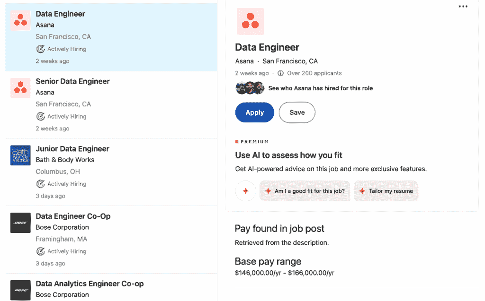
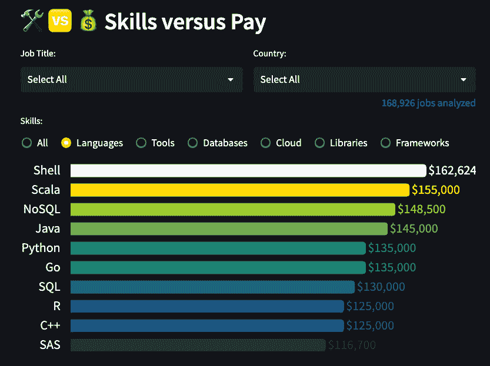
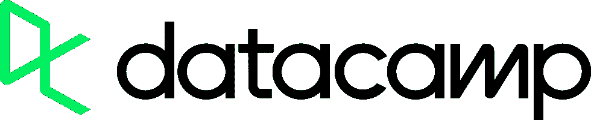
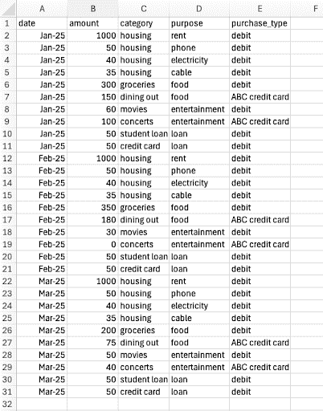

# 学习 SQL 的专注方法

> 原文：[`towardsdatascience.com/a-focused-approach-to-learning-sql/`](https://towardsdatascience.com/a-focused-approach-to-learning-sql/)

数据无处不在，但你如何从中提取洞察力？通常，结构化数据存储在 *关系数据库* 中，这意味着相关数据表的集合。例如，一家公司可能在一个表中存储客户购买信息，在另一个表中存储客户人口统计信息，在第三个表中存储供应商信息。然后，这些表可以合并在一起并查询。为了以这种方式与关系数据库交互，你可能会使用 SQL 语言来检索数据、连接表以及排序和筛选结果。

在这篇文章中，我们将探讨 SQL 是什么，根据你选择的职位角色，哪些主题是最佳关注点，以及如何规划你的学习路径。

## 什么是 SQL？

SQL 代表“结构化查询语言”。它是一种流行的计算机语言，用于与关系数据库交互。

以基本 SQL 使用的例子来说，假设你保存了一个电子表格，记录了你每月使用信用卡的花费。你可能想知道在过去一年中，你在哪些月份的花费至少达到了 100 美元。一个用于回答这个问题的 SQL 查询可能看起来像这样：

```py
SELECT months
FROM credit_card
WHERE expense >= 100 and date > "2025-01-01"
```

这段代码听起来几乎就像一个英文句子：“从信用卡表中选择那些花费至少 100 美元且日期在 2025 年 1 月 1 日之后的月份。”

## 为什么你应该学习 SQL？

SQL 是无处不在的。正如 [这篇文章](https://datacamp.pxf.io/je0yBM) 所指出，SQL 被广泛应用于各个行业（如市场营销、金融、医疗保健等）和职位（如商业分析、数据科学、网站开发）。在数据领域，深入理解数据是一个许多高薪数据职位（包括数据分析师、数据科学家和数据工程师角色）所必需的技能。在数据世界中，SQL 是一个常用的工具，用于检索数据、修改数据以及进行查询。

### AI 工具和学习 SQL

这引发了一些问题：在 vibe coding 和 Copilot 时代，为什么还要学习 SQL？SQL 技能不会在不久的将来变得过时吗？对此观点有许多反驳意见。

首先，SQL 是我们理解、评估和调试现有查询的基础。即使有人或某物编写了特定的代码，你也需要了解 SQL 才能理解查询是如何工作的。很难想象一个人在没有理解其底层语言的情况下评估现有代码。

第二，你如何判断 LLM 生成的代码是否给出了合法的答案？如果其答案是错误的，那么通过简单的修改查询是否就会正确，或者生成的查询是否是无意义的？

第三，现存有大量的遗留代码需要维护。似乎不太可能所有这些代码都会被 LLM 生成的内容所取代。

### 数据工作真的使用 SQL 吗？

SQL 技能对现有的数据工作有用吗？是的，许多工作需要 SQL 技能，通常与其他技能集结合使用。

例如，数据科学家可能会使用 SQL 从数据库中提取数据子集，然后使用 Python 清理数据，接着使用 Python 和机器学习库（如 scikit-learn 或 XGBoost）进行预测建模。通常，从数据中获取的见解可以通过过滤和子集化数据来实现，所有这些都可以仅使用 SQL 完成。

数据工程师可能会使用 SQL 进行 ETL（提取、加载、转换）。这涉及到从源中检索数据，将其转换为适合下游分析的格式，并将转换后的数据加载到数据仓库中。这类工作通常对 SQL 的要求很高。

### 招聘信息

让我们来看看一些 LinkedIn 上的招聘信息，这些信息要求具备 SQL 数据处理技能。以下是我搜索“SQL 数据工程师”时出现的一些职位页面（2025 年 9 月）。



作者截图

对于这次搜索，薪资范围差异很大。例如，Netflix 上数据工程师（L5）职位的起薪范围是每年 170,000 美元到 720,000 美元，而另一家公司发布的初级数据工程师广告中，起薪范围是每年 64,000 美元到 70,000 美元。那么，什么样的薪资是现实的呢？截至本文撰写时，根据[datanerd.tech](http://datanerd.tech)的分析，近 17 万个相关职位中，涉及 SQL 工作的平均年薪为每年 130,000 美元。



作者截图

注意，技能并非孤立存在。许多职位都需要一系列技能。例如，数据科学家的工作可能需要 SQL 和 Python 或 R 的专业知识。数据工程师的工作可能除了 SQL 之外，还要求具备构建数据管道或云技术（如 MS Azure）的技能。

[DataCamp](https://www.datacamp.com/)通过实践学习帮助个人和团队提升数据和分析技能。通过互动课程、真实世界项目和行业认可的 Python、SQL、Power BI、ChatGPT 等认证，DataCamp 使你能够根据自己的节奏学习数据技能。[了解更多](https://www.datacamp.com/)

## 如何学习 SQL

因此，假设你已经决定学习 SQL 是个好主意。你应该如何学习 SQL 呢？首先，在深入之前，做好规划。选择一个环境，学习基础知识，做一个玩具项目，然后根据你的兴趣和职业需求选择一个合适的学习路径，继续你的 SQL 之旅。

### 选择一个环境

有许多可用的 *数据库管理系统*（DBMS）。DBMS 是您用于与数据库交互的软件。[DBMS](https://en.wikipedia.org/wiki/Database) 是您使用的软件。三个流行的开源 DBMS 是 [PostgreSQL](https://www.postgresql.org/)、[MySQL](https://www.mysql.com/) 和 [SQLite](https://sqlite.org/)。SQL 语法在这三个系统之间可能略有不同，但它们都适合学习 SQL。您在一个 DBMS 中学到的知识可以直接应用于其他系统，并且可以通过检查文档轻松解决微小的语法差异。另一种选择是使用亚马逊 AWS 或 MS Azure 等云服务中的 DBMS。

### 学习基础知识

一个常见的错误是试图记住 SQL 的语法。这种方法并不是很好地利用您的时间，因为您最终会试图记住一本百科全书那么多的信息。相反，有许多资源，您可以在需要时查找语法。随着时间的推移，您将通过使用和实践记住常见的语法。

首先，了解关系型数据库的语法和结构。

+   SELECT 语句是什么？

+   您如何使用 WHERE 子句过滤数据？

+   CRUD 操作（创建、读取、更新、删除）是什么？您如何使用它们？

最好是通过对数据进行交互式学习，而不仅仅是被动地阅读书籍或观看无穷无尽的 YouTube 视频来学习。DataCamp 提供了许多交互式课程，包括一门关于 [SQL 基础](https://datacamp.pxf.io/APe35K) 的课程。他们还提供 [SQL 联合认证](https://datacamp.pxf.io/19BaW9)。

### 在上下文中学习 SQL，而不仅仅是语法

一旦您熟悉使用 SELECT 查询数据字段和使用 WHERE 子句过滤数据，您就可以开始尝试一个玩具项目了。

一个有用且可管理的项目是分析您的个人财务。首先，获取数据。您可能已经将您的财务信息保存在电子表格中。如果没有，请使用电子表格创建数据。制作一个小的（二十或三十行）财务数据集。列可能包括花费的金额、使用的卡或银行账户、购买类型（例如，公用事业、账单、娱乐、交通、食品）、日期。



作者截图

将此数据（或您自己的数据）保存为 .csv 文件。现在，将此 .csv 文件导入您的数据库管理系统（DBMS）中，创建一个名为 `credit_card` 的表。具体操作因 DBMS 而异，但每种系统都有将 .csv 文件导入表中的机制。例如，如果您在使用 SQL Server，操作说明[在这里](https://www.sqlshack.com/importing-and-working-with-csv-files-in-sql-server/)。

保存数据后，使用 SQL 通过 SELECT 和 WHERE 子句查询数据。1 月之后您花了多少钱？您可以编写一个类似于以下查询的查询。

```py
SELECT date, amount
FROM credit_card
WHERE date > 'Jan-25'
```

现在，创建新的查询。你每个月平均在食物上花多少钱？外出就餐花了多少钱？在如此小的数据集中，你可以不使用数据库就能找出这些信息，但这里的重点是学习如何使用这项技术。在你提出这些问题后，你可以扩展数据集并编写更多查询。你还能回答哪些问题？在这个项目上花上一周或两周的时间。

## 学习路径

你最初需要关注的 SQL 的广度和深度取决于你的兴趣和职业目标。[这个视频](https://www.youtube.com/watch?v=ITwW825L4zg)建议了三个样本路径（初学者、中级、高级）。让我们来看看这些路径，并将它们映射到常见的数据角色。

**初学者**路径包括学习以下 SQL 技能：

+   如何使用 SELECT 语句从数据库中检索字段

+   如何使用 WHERE 子句过滤数据

+   如何使用 ORDER BY 子句排序数据

+   如何使用 JOIN 语句组合表

+   如何使用 SUM、COUNT、AVG、GROUP BY 等聚合数据

+   如何创建嵌套查询（“子查询”）

**中级**路径在基础路径上增加了以下技能。

+   如何使用公用表表达式（CTE）创建由更大查询使用的临时结果

+   如何使用索引策略优化查询

+   如何使用存储过程和触发器自动化数据库任务

+   如何通过规范化、反规范化和技术设计等技巧设计更好的数据库

+   如何使用窗口函数进行高级聚合

要成为**高级**SQL 用户，还需要学习以下技能。

+   如何防止 SQL 注入攻击

+   如何在复杂查询中使用高级连接

+   如何优化大数据查询

+   如何将基于行的格式（通常由关系型数据库使用）的数据转换为基于列的格式（通常由“NoSQL”数据库，如 MongoDB 使用）

根据您的专业兴趣，哪条路径是合适的？

+   **初学者**：如果你没有 SQL 经验，从基础开始。这条路径适合想要涉足数据世界的新手，或者对数据好奇但不需要深入了解机制的人，例如想要为自己运行简单查询的项目经理。

+   **中级**：如果你已经使用了一些 SQL 但需要提高你的知识，可能为了晋升或职业转变，这可能是一条合适的路径。初级到中级数据分析师和数据科学家需要在这个层面上理解数据。你可能需要为每个主题花费至少两到三周的时间。

+   **高级**：那些需要深入了解数据基础设施的人，例如数据工程师，需要深入理解 SQL，因此这条路径对他们来说很合适。

## 总结

虽然 SQL 可能是一个庞大、分散的语言，有许多角落和细微差别，但它的核心是一个相对容易学习的计算机语言，基于简单的英语语句。

祝你在学习 SQL 的旅程中一切顺利！开始学习 SQL 的一种方式是通过 DataCamp 的 [SQL 基础](https://datacamp.pxf.io/APe35K) 课程。这是一门有趣且强大的语言，值得了解。
