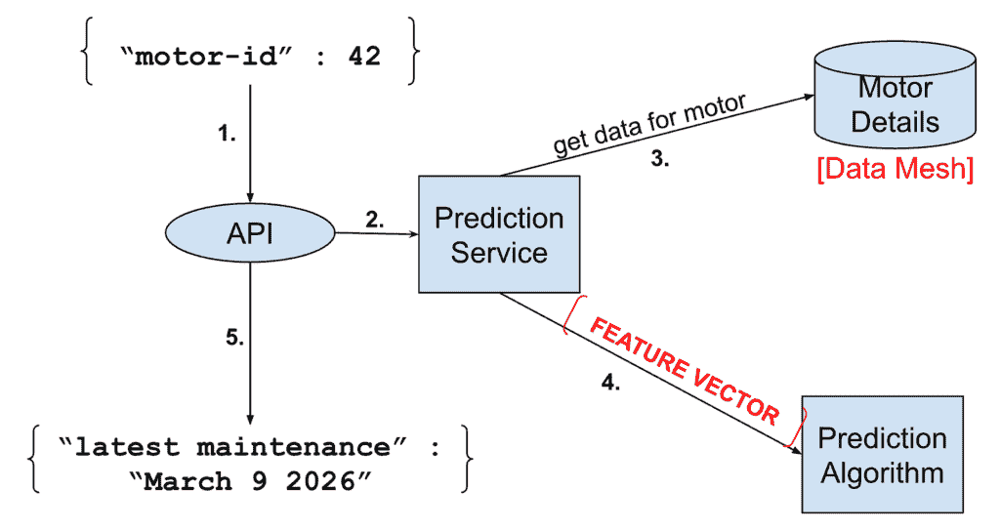

# 更多对话，更少行动——反对过早数据集成的案例

> 原文：[`towardsdatascience.com/a-little-more-conversation-a-little-less-action-a-case-against-premature-data-integration/`](https://towardsdatascience.com/a-little-more-conversation-a-little-less-action-a-case-against-premature-data-integration/)

当我与尚未开始数据科学（DS）和机器学习（ML）的[大型]组织交谈时，他们经常告诉我**他们必须**先**运行一个数据集成项目**，因为“…所有数据都散布在整个组织中，隐藏在孤岛中，以不同格式存储在不同的部门管理的服务器上。”

虽然数据可能难以获取，但在开始机器学习部分之前运行一个大型数据集成项目很容易是一个糟糕的想法。这是因为你在不知道数据用途的情况下进行数据集成——数据在未来某个机器学习用例中适合用途的可能性很小，至多。

在这篇文章中，我讨论了这类集成项目的一些最重要的驱动因素和陷阱，并**建议**一种专注于在集成工作中优化性价比的方法。对于这个挑战的简短答案是[剧透警告...]根据用例逐个集成数据，从用例反向工作以确定你确切需要的数据。

### 对干净整洁数据的渴望

在开始数据科学和机器学习挑战之前进行数据集成是很容易理解的冲动。以下，我列举了四个我经常遇到的驱动因素。这个列表并不全面，但涵盖了最重要的动机，正如我所见。然后我们将逐一分析每个驱动因素，讨论它们的优点、缺点和替代方案。

1.  **破解 AI/ML 用例是困难的**，尤其是如果你不知道有哪些数据可用，以及数据的质量如何。

1.  检索隐藏的数据并将数据**集成到平台上似乎是一个更具体、更易于解决的问题**。

1.  许多组织**有不愿意共享数据的氛围**，而首先关注数据共享和**集成有助于改变这种状况**。

1.  从历史来看，我们知道**许多机器学习项目因数据访问问题而停滞不前**，在机器学习项目之前解决组织、政治和技术挑战可能有助于消除这些障碍。

当然，还有其他数据集成项目的驱动因素，如“单一事实来源”、“客户 360”、“恐惧失去”以及“现在就做点什么！”的基本冲动。虽然这些是数据集成倡议的重要驱动因素，但我认为它们不是机器学习项目的关键，因此不会在本文中进一步讨论这些内容。

### 1. 破解 AI/ML 用例是困难的，

…而且如果不知道有什么数据可用，以及其质量如何，那就更严重了。这实际上是一个真正的“鸡生蛋，蛋生鸡”的问题：没有合适的数据，就无法进行机器学习，但如果你不知道你有什么数据，识别机器学习的潜力基本上也是不可能的。确实，这是开始机器学习的主要挑战之一[参见[“没有人把 AI 逼入死角！”](https://towardsdatascience.com/nobody-puts-ai-in-a-corner-0118641bc319/)了解更多]。但这个问题并不是通过运行一个初步的数据发现和集成项目就能最有效地解决的。更好的解决方法是采用一种经过良好验证的方法，这种方法适用于许多不同的问题领域。它被称为**共同讨论**。由于这在很大程度上是解决几个驱动需求的答案，我们现在将花几行来讨论这个话题。

**人们相互交流的价值无法估量**。这是使团队工作并使组织中的团队共同工作的唯一方式。它也是一种非常有效的信息载体，关于数据、产品、服务或其他由一个团队制作但由其他人使用的复杂细节。将“共同讨论”与这个背景下的对立面进行比较：**制作全面的文档**。制作自包含的文档既困难又昂贵。为了使第三方仅通过查阅文档就能使用数据集，它必须完整。它必须记录数据必须看到的完整背景；数据是如何捕获的？生成过程是什么？在当前形式的数据上应用了哪些转换？不同的字段/列的解释是什么，它们是如何相关的？数据类型和值范围是什么，应该如何处理空值？数据是否有访问限制或使用限制？存在隐私问题吗？等等。随着数据集的变化，文档也必须随之改变。

现在，如果数据是一个独立的、商业的数据产品，您提供给客户，那么全面的文档可能是最佳选择。如果您是[OpenWeatherMap](https://openweathermap.org/)，您希望您的天气数据 API 有良好的文档——这些是真正的数据产品，OpenWeatherMap 通过这些 API 提供实时和历史天气数据，从而建立了一个业务。此外，如果您是一个大型组织，并且一个团队发现它在与人交谈上花费了太多时间，那么制作全面的文档确实会带来回报——那么您就去做吧。但**大多数内部数据产品最初只有一到两个内部消费者**，然后，全面的文档并不划算。

一般而言，*共同讨论*实际上是成功过渡到人工智能和机器学习的关键因素，正如我在“[没有人把 AI 关在角落！](https://towardsdatascience.com/nobody-puts-ai-in-a-corner-0118641bc319/)”一文中所述。而且，它是敏捷软件开发的基础。还记得[敏捷宣言](https://agilemanifesto.org/)吗？它指出：“我们重视个人和交互胜过全面的文档”。所以，这就是关键所在。共同讨论。

此外，文档不仅会产生成本，而且还有增加人们交流障碍的风险（“看看那#$@!!%的文档”）。

现在，为了明确一点：我并不反对文档。**文档非常重要**。但是，正如我们在下一节中讨论的，不要浪费时间在编写不必要的文档上。

### 2. 检索隐藏的数据并将其整合到平台中似乎是一个更具体、更易于解决的问题。

是的，这是事实。然而，在确定机器学习用例之前就做这件事的缺点是，你只解决了“在平台上整合数据”的问题。你没有解决“为机器学习用例收集有用数据”的问题，这正是你想要做的。这是上一节中提到的“双关困境”的另一面：如果你不知道机器学习用例，那么你就不知道需要整合哪些数据。此外，为了数据本身而整合数据，而不让数据使用者成为团队的一部分，需要非常好的文档，这我们已经讨论过了。

要深入了解**为什么**在没有考虑机器学习用例的情况下进行数据整合是过早的，我们可以看看成功机器学习项目的运行方式。从高层次来看，机器学习项目的输出是一种可以为你解答问题的先知（*算法*）。例如，“我们应该向这位用户推荐什么产品？”或者“这个电机何时需要维护？”如果我们坚持后者，算法将是一个将问题中的电机映射到日期的函数，即维护到期日。如果这项服务通过 API 提供，输入可以是{"motor-id" : 42}，输出可以是{"latest maintenance" : “2026 年 3 月 9 日”}。现在，这个预测是由某个“系统”完成的，所以解决方案的更丰富图景可能是这样的

图片由作者提供。

关键在于使用电机-id 从数据网格中获取有关该电机的更多信息，以便进行稳健的预测。所需的数据集由图中的特征向量表示。并且，**在机器学习项目开始之前，你很难知道你需要哪些数据来进行预测**。确实，每个机器学习项目所平衡的悬崖，就是项目能否成功找出回答问题所需的确切信息。这是通过机器学习项目过程中的试错来完成的（我们称之为假设测试、特征提取、实验和其他花哨的事情，但这只是结构化的试错）。

如果你没有进行这些实验就将电机数据集成到平台中，你将如何知道需要集成哪些数据？当然，你可以集成一切，并不断更新平台，直到永远（包括数据和文档）。但很可能是，只有一小部分数据是解决预测问题所需的。**未使用的数据是浪费。**这不仅包括集成和记录数据的努力，还包括未来所有时间的存储和维护成本。根据帕累托法则，你可以预期大约 20%的数据提供了 80%的数据价值。但在知道机器学习用例之前，在运行实验之前，很难知道这 20%是哪些。

这也是对仅仅“为了存储数据而存储数据”的一种警告。我见过许多数据囤积的倡议，高层管理通过命令要求保存尽可能多的数据，因为数据是新的石油/黄金/现金/货币等等。具体例子来说；几年前我遇到了一位老同事，他是机械行业的产品负责人，他们从几年前就开始收集各种关于他们机械的时间序列数据。有一天，他们提出一个杀手级机器学习用例，他们想利用整个工业厂区中分布式事件之间的关系。但是，唉，当他们查看他们的时间序列数据时，他们意识到分布式机器实例的时钟没有足够同步，导致无法关联的时间戳，所以计划的时间序列之间的交叉相关性最终不可行。真糟糕，这是一个典型的例子，说明了当你不知道你收集数据的目的时会发生什么。

### 3. 许多组织都有不共享数据的习惯，首先关注数据共享和集成，有助于改变这种文化。

这句话的前半部分是真实的；毫无疑问，许多好的倡议因组织中的文化问题而被阻碍。权力斗争、数据所有权、不愿分享、部门化等。问题是组织范围内的数据集成努力是否会改变这一点。如果有人不愿意分享他们的数据，上面有一个信条说如果你分享你的数据，世界将会变得更好，这可能是过于抽象，无法改变这种态度。

然而，如果你与这个团队互动，让他们参与工作，并展示他们的数据如何帮助组织改进，你更有可能赢得他们的心。因为态度关乎情感，处理这种差异的最好方式（信不信由你）是**一起交流**。提供数据的团队也需要展示自己。如果他们没有被邀请加入项目，当荣誉和荣耀降临到为解决长期问题提供了一些新潮解决方案的机器学习/产品团队时，他们会感到被遗忘和被忽视。

记住，输入机器学习算法的数据是产品堆栈的一部分——如果你没有将数据拥有团队纳入开发中，你就没有进行全栈开发。（全栈团队比许多替代方案更好的一个重要原因是，团队内部人们可以一起交流。将价值链上的所有参与者都纳入[全栈]团队，使他们能够一起交流。）

我在许多组织中工作过，很多时候都遇到过由于这种文化差异导致的协作问题。我从未见过由于 C 级管理层的命令而消除这些障碍。中层管理人员可能会接受它，但普通员工大多数只是给它一个轻蔑的眼神，继续像以前一样行事。然而，我曾在许多团队中工作，我们通过邀请另一方加入，并一起讨论问题来解决这个问题。

### 4. 从历史来看，我们知道许多数据科学/机器学习项目因数据访问问题而停滞不前，而在机器学习项目之前解决组织、政治和技术挑战可能有助于消除这些障碍。

虽然关于文化变革的段落是关于人类行为的，但我将这个归类为技术状态。当数据集成到平台中时，它应该被安全地存储，并且能够以正确的方式轻松获取和使用。对于一个大组织来说，拥有数据集成策略和政策是关键。但是，在为数据集成构建基础设施以及围绕该基础设施的最少流程之间，与在企业中搜寻并集成大量数据之间，存在差异。是的，你需要平台和政策，但在你知道你需要它之前，不要集成数据。而且，当你这样一步步进行时，你也可以从数据平台的迭代发展中受益。

基本平台基础设施还应包括必要的政策，以确保符合法规、隐私和其他关注点。这些关注点伴随着使用机器学习和人工智能来做出决策的组织，这些组织在可能或可能不是由可能或可能未给予其数据不同用途同意的个人生成的数据上进行训练。

但回到第一个驱动因素，关于不知道机器学习项目可能会接触到哪些数据——**你仍然需要**某种东西来帮助人们导航组织各个部分中驻留的数据**。如果我们不先运行一个集成项目，我们该怎么办？建立一个**目录**，让部门和团队因添加关于他们拥有哪些类型数据的文本块而获得奖励。只需对数据的简要描述；数据的类型，它是什么，谁负责这些数据，也许还有对其可能用途的猜测。将这些内容放入文本数据库或类似的结构中，并使其可搜索。或者，更好的是，让数据库支持一个 AI 助手，允许你通过数据集描述进行适当的语义搜索。随着时间的推移（和项目的进行），目录可以扩展，添加更多信息和文档，因为数据被整合到平台中，并且创建了文档。如果有人查询某个部门关于他们的数据集，你还可以将问题和答案都放入目录数据库中。

这样的数据库，主要包含自由文本，是一个比具有全面文档的现成集成数据平台更便宜的替代品。你只需要不同的数据拥有团队和部门将一些他们的文档倒入数据库中。他们甚至可以使用生成式 AI 来生成文档（允许他们勾选 OKR 🙉🙈🙊）。

### 5. 总结

总结一下，在机器学习项目的背景下，数据集成工作应该通过以下方式来攻击：

1.  建立数据平台/数据网状策略，以及所需的最小基础设施和政策。

1.  创建一个可以免费文本搜索查询的数据集描述目录，作为一种低成本的数据发现工具。通过使用 KPI 或其他机制来激励不同的群体通过使用数据库来填充数据库。

1.  根据每个用例，将数据集成到平台或网状结构中，从用例和机器学习实验反向工作，确保集成数据对于其预期用途既是必要的也是充分的。

1.  通过将相关资源纳入机器学习项目的完整堆栈团队来解决文化、跨部门（或孤岛）障碍，并且...

1.  **共同讨论**

祝好运！

问候

-daniel-
