# 《对 Sora 的实用探索——直观且详尽解释》

> 原文：[`towardsdatascience.com/a-practical-exploration-of-sora-intuitively-and-exhaustively-explained-57426b269a26/`](https://towardsdatascience.com/a-practical-exploration-of-sora-intuitively-and-exhaustively-explained-57426b269a26/)

### OpenAI 的视频生成模型的功能及其背后的理论

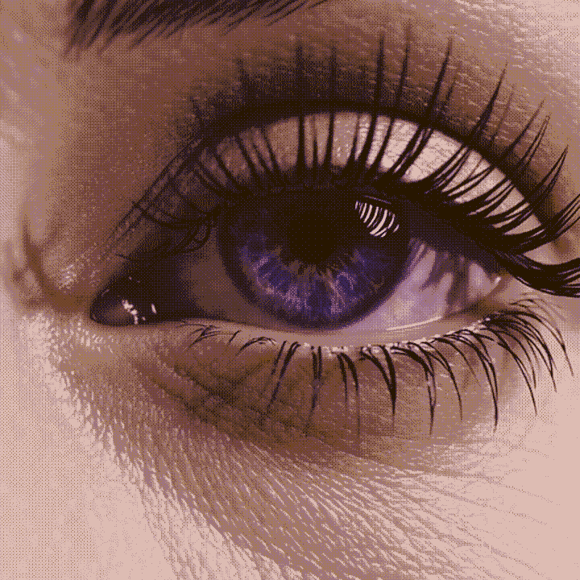

“眼睛”，由 Daniel Warfield 使用 Sora 生成。除非另有说明，所有图片和视频均为作者所有。文章最初在[直观且详尽解释](https://iaee.substack.com/)上发布。

OpenAI 最近发布了 Sora，他们的尖端视频生成模型。使用 Sora，他们还发布了一个 Web UI，允许用户以各种复杂和有趣的方式生成和编辑视频。在本文中，我们将探讨该 UI 的功能，以及 Sora 可能如何实现这些功能。

* * *

**这对谁有用？**任何想要使用 AI 进行视频生成或想要更深入理解人工智能的人。

**这篇文章的深度如何？**这篇文章面向一般读者，旨在对人工智能进行温和的介绍。它还包含一些关于 Sora 工作原理的推测，可能对更高级的读者有吸引力。

**先决条件：**无。

## Sora 之旅

在撰写本文时，这是 Sora UI 的主页：

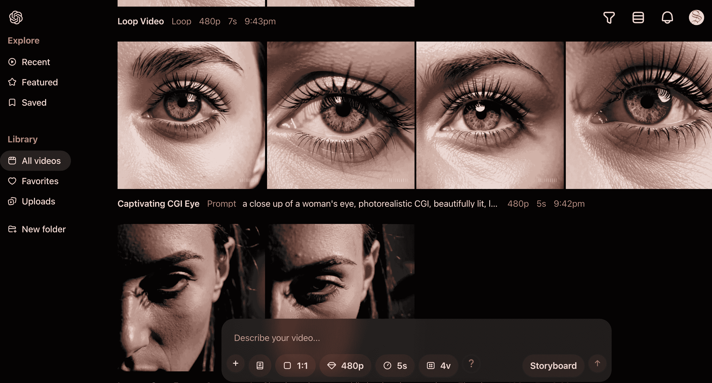

在左侧有一些典型的嫌疑人。探索部分允许你浏览其他创作者生成的视频，而图书馆部分允许你浏览和组织你生成的视频。

实际生成视频时，你使用屏幕底部的文本栏… *东西*。OpenAI 的指南只是将其称为“屏幕底部”，用于定义它的 HTML 类名并不容易发音，所以为了我们的目的，我将称其为“创作栏”。

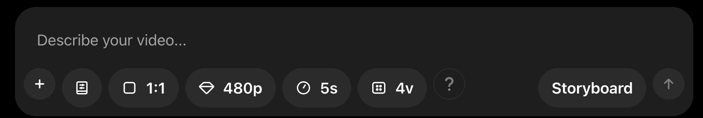

创作栏，Sora 中创建内容的主要地方。

使用 Sora 生成视频的基本方式是输入一些提示，然后点击提交。

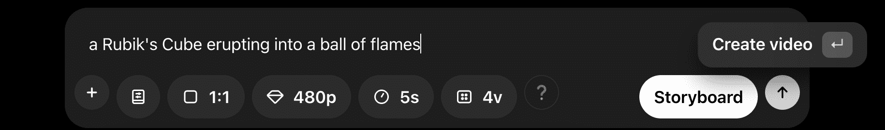

这将触发一个生成任务，随后将在两个地方显示进度条：在你的视频列表中和屏幕顶部的通知区域。

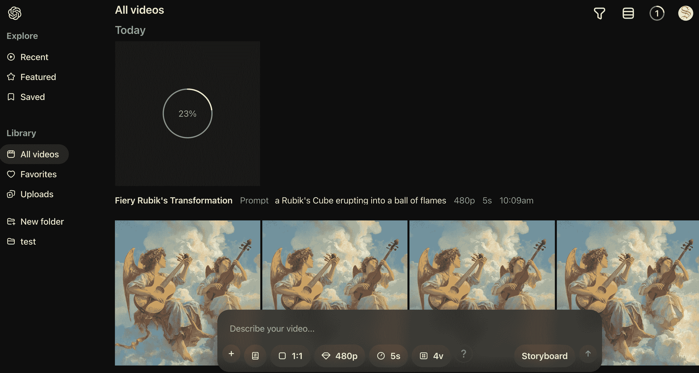

生成完成后，结果可以在 Sora UI 中直观地查看。

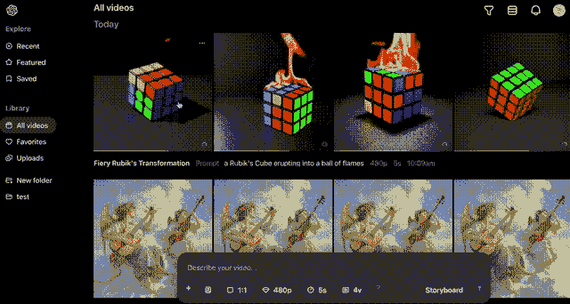

我们提示“一个魔方爆炸成火焰球”的结果。我们可以在我们的视频库中浏览视频，点击播放单个示例，或者打开并播放所有生成的变体。

你还可以上传图片，这些图片可以用来指导视频生成。在这里，我上传了我的[关于 LLM 路由的文章封面](https://medium.com/towards-data-science/llm-routing-intuitively-and-exhaustively-explained-5b0789fe27aa)

当你上传图片时，你可以选择添加一个提示来描述你想要的视频，或者你可以单独上传图片，让 Sora 自己判断哪种类型的视频更合适。

当没有提供提示时，Sora 生成的四个视频示例。如图所示，在这个示例中实际上并没有发生太多事情。

使用图片和描述图片的文本提示进行生成的一个示例。如图所示，这些结果更加动态。

在生成视频时，你可以设置视频的宽高比（视频的形状）。

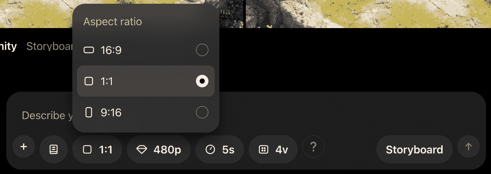

质量（根据你的订阅级别提供不同的选项），

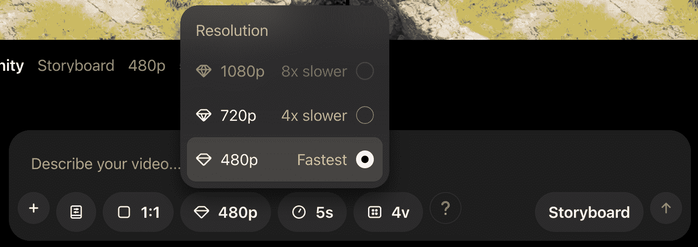

你想要创建的视频长度（这个选项也有不同的选项，取决于你的订阅级别），

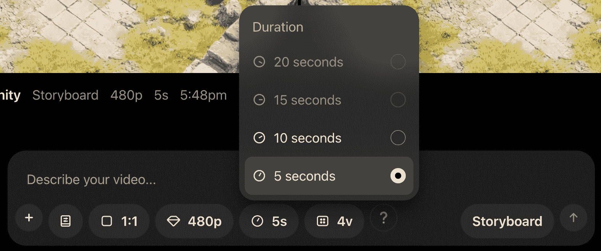

以及你希望每个提交生成多少个视频变体。

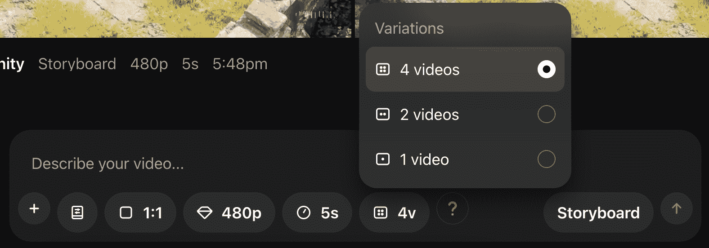

对于想要对视频生成有更精细控制的人来说，可以使用分镜脚本。

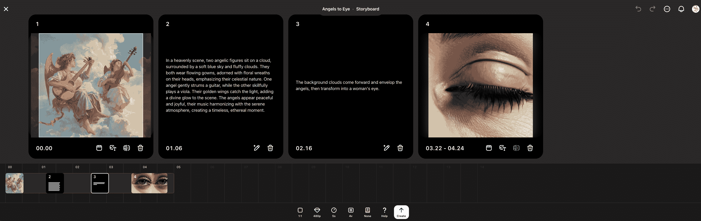

一个故事板的示例，它由随时间变化的图片、文本和视频组成。

使用分镜脚本，你可以在整个脚本中插入图片、视频和文本，以精细控制帧的生成方式。

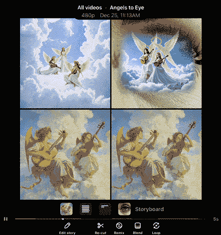

上一个分镜脚本的一些结果示例

视频生成模型的提示策略可能非常复杂。要获得合理质量的结果，需要在内容块及其在故事板中的时间位置上进行大量的调整。我将在后面的部分讨论故事板以及一些可以采用的想法来获得更高质量的结果。

回到创建栏，还有一个预设选项。

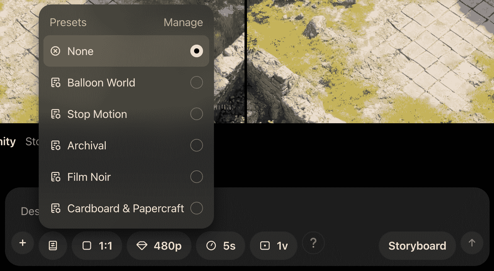

这可能使用了一种名为[LoRA 的技术，我在另一篇文章中进行了介绍](https://medium.com/towards-data-science/lora-intuitively-and-exhaustively-explained-e944a6bff46b)。你可以将 LoRA 想象成专门训练的过滤器，可以应用于像 Sora 这样的 AI 模型。

这里有一些使用相同提示和不同预设的各个生成示例：

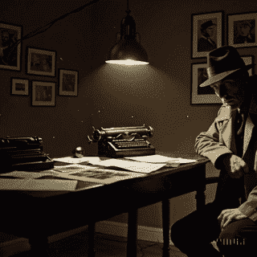

使用“气球世界”预设的“一个在昏暗灯光下的神秘侦探”

使用“气球世界”预设的“一个在昏暗灯光下的神秘侦探”

使用“停止运动”预设的“一个在昏暗灯光下的神秘侦探”

一旦生成了一个视频，就有一些编辑选项。

在特定视频被选中时，屏幕底部的编辑现有视频的选项。

你可以进行“Re-Cut”，这就像正常的视频剪辑，只不过你可以使用 AI 来改变图像的分辨率、长度等。

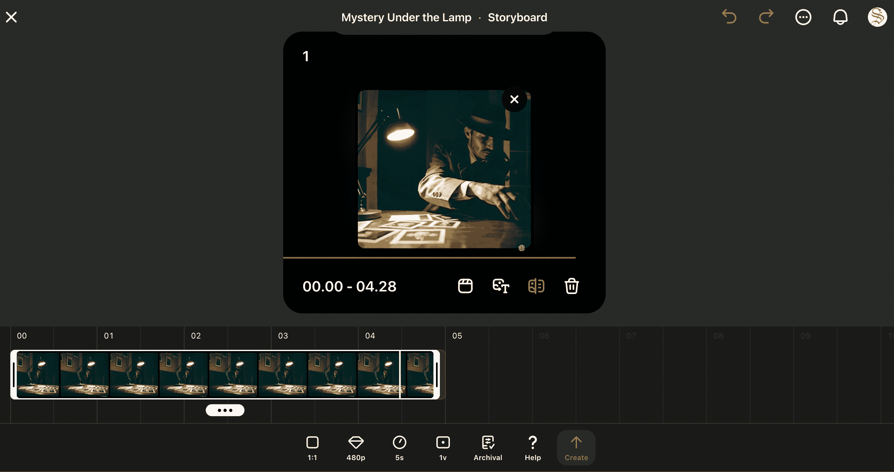

"Re-Cut"允许你进行一些酷炫的操作，比如 AI 提升画质、通过生成更多帧来延长视频等。

你可以进行“Remix”，这允许你基于提示和现有视频生成一个新的视频。

使用提示“由意大利面制成的侦探，在昏暗的灯光下检查照片”进行视频混搭

你可以使用“混合”功能以各种方式在视频之间进行混合。

通过混合工具在侦探和眼睛视频之间创建过渡的结果。

你可以使用“循环”功能将你的视频变成一个循环。这样，视频就会无缝循环，使得视频的结尾完美地连接到开头。

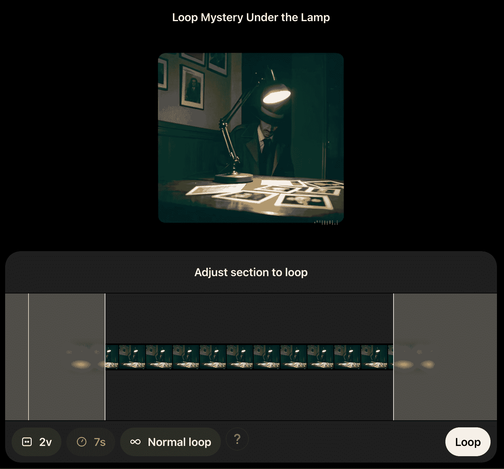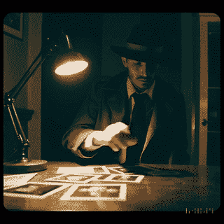

从侦探场景创建循环

这就是 Sora 的本质；它是一个包含 AI 驱动的视频编辑工具的大盒子。在接下来的章节中，我们将逐一探讨这些功能，更深入地了解它们，并讨论它们（可能）是如何工作的。

## 文本到视频生成的理论

Sora 最基本的思想是“扩散模型”。扩散是一种建模方法，其中将生成图像和视频等任务视为去噪问题。

基本上，要训练一个像 Sora 这样的模型，你首先需要一大堆视频以及这些视频的文本描述。然后，你将这些视频变得非常嘈杂。

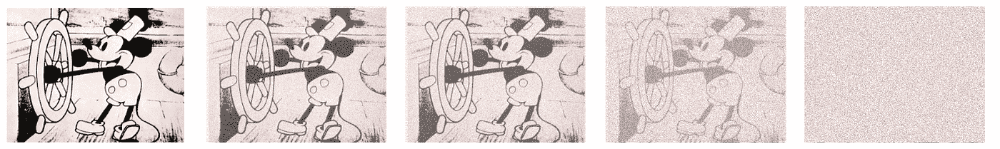

以不同程度向视频中添加噪声。来自我[关于 Sora 的原始文章](https://medium.com/towards-data-science/sora-intuitively-and-exhaustively-explained-a54f83ea9c21)。米老鼠的原始“蒸汽船威尔士”版本属于公共领域，因为它在 1929 年 1 月 1 日之前出版（或在美国版权局注册）。[来源](https://en.wikipedia.org/wiki/File:Steamboat_Willie_(1928)_by_Walt_Disney.webm)。

然后你训练模型根据文本描述从噪声中生成原始视频。

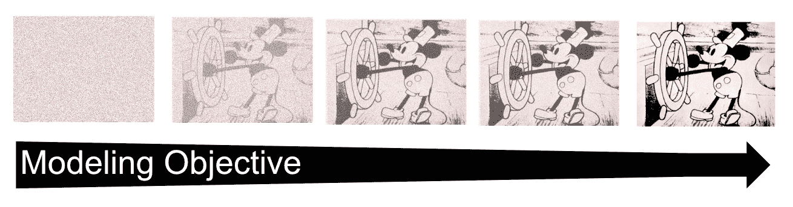

扩散模型的建模目标；从图像中去除噪声。来自我[关于 Sora 的原始文章](https://medium.com/towards-data-science/sora-intuitively-and-exhaustively-explained-a54f83ea9c21)。

通过在大量视频（比如数百万或数十亿小时的视频）上训练像 Sora 这样的模型，OpenAI 训练了一个能够通过去噪将文本转换为视频的模型。

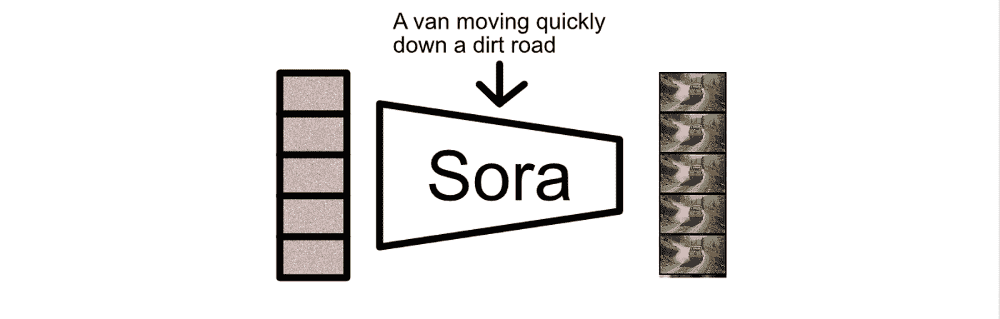

Sora 的概念图。它接收一系列噪声图像，并输出一系列图像作为视频。

大概就是这样。这种去噪视频的策略推动了文本到视频生成、图像到视频生成、时间线、混合等。OpenAI 通过一些巧妙的技巧，使用单个模型实现了所有这些复杂的功能，我们将在接下来的章节中探讨这些技巧。

## Sora 的技巧

回想一下，使用 Sora 制作视频的一种方法是通过时间线编辑器

回想一下，时间线允许我们在时间线内放置内容块，并根据该信息生成视频。

让我们探索一些可能使这成为可能的技巧。

### 技巧 1) 帧注入

回想一下，扩散模型接受噪声视频并输出更少噪声的视频

使用 Sora 根据文本描述生成视频，来自我[关于 Sora 的原始文章](https://medium.com/towards-data-science/sora-intuitively-and-exhaustively-explained-a54f83ea9c21)。

如果你有一张图片，并且想从那张图片创建视频，你可以简单地将其中一帧设置为模型的输入部分。

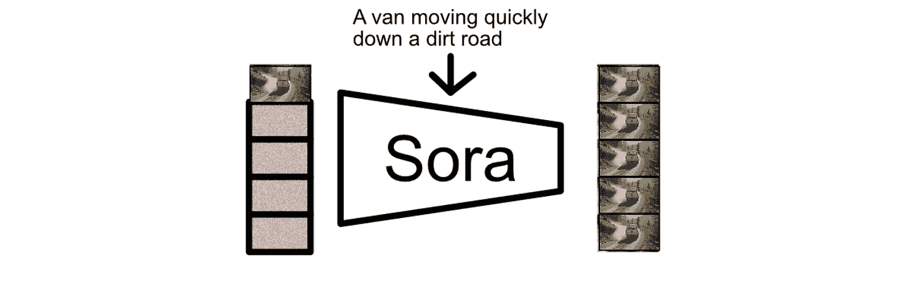

使用 Sora 根据文本描述和图像生成视频，来自我[关于 Sora 的原始文章](https://medium.com/towards-data-science/sora-intuitively-and-exhaustively-explained-a54f83ea9c21)。

如果你想要基于视频生成，你只需将其包含在输入中。

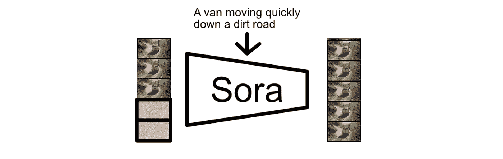

使用 Sora 根据文本描述和视频生成视频，来自我[关于 Sora 的原始文章](https://medium.com/towards-data-science/sora-intuitively-and-exhaustively-explained-a54f83ea9c21)。

Sora 整个理念是它理解视频，并根据提供的任何文本描述去噪整个输入以使其有意义。所以，如果你将视频包含在模型的输入中，它将自然地去噪其余的帧，根据你提供的任何帧使其有意义。

如果你有一个时间线中的多个视频或图片，你只需将它们放入 Sora 输入的相应位置

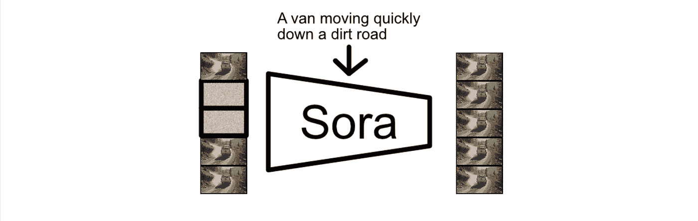

如果你添加多个图像或视频到 Sora 的输入中，它将迫使模型将其去噪过程与周围的帧相协调，来自我[关于 Sora 的原始文章](https://medium.com/towards-data-science/sora-intuitively-and-exhaustively-explained-a54f83ea9c21)。

添加哪些帧以及它们在输入中的位置将极大地影响 Sora 的输出。我怀疑这种类型的方法是 Sora 中一些更高级生成方法（如故事板、混合和循环功能）的核心。

想象一下将视频末尾的帧添加到 Sora 输入的开始处，以及将视频的开始处添加到 Sora 输入的末尾。如果你那样做了，模型将被迫生成从视频末尾到开始的过渡帧。这可能是 Sora 生成视频循环的基本理念。

因此，这就解释了 Sora 如何处理图像和视频的故事板。当你将各种图像和视频放置在故事板中时，这些图像和视频将分布在 Sora 的其余嘈杂输入中，Sora 在去噪其余帧时会考虑这些图像和视频。

记住，在故事板上，我们可以在一段时间内放置文本和视频。

下一个技巧描述了文本描述的故事板可能如何工作。

### 技巧 2）门控交叉注意力

我之前写过一篇关于名为“Flamingo”的模型的文章。[Flamingo 文章](https://medium.com/towards-data-science/flamingo-intuitively-and-exhaustively-explained-bf745611238b)。Flamingo 的想法是创建一个语言模型，该模型可以根据任意序列的文本和图像作为输入生成文本。

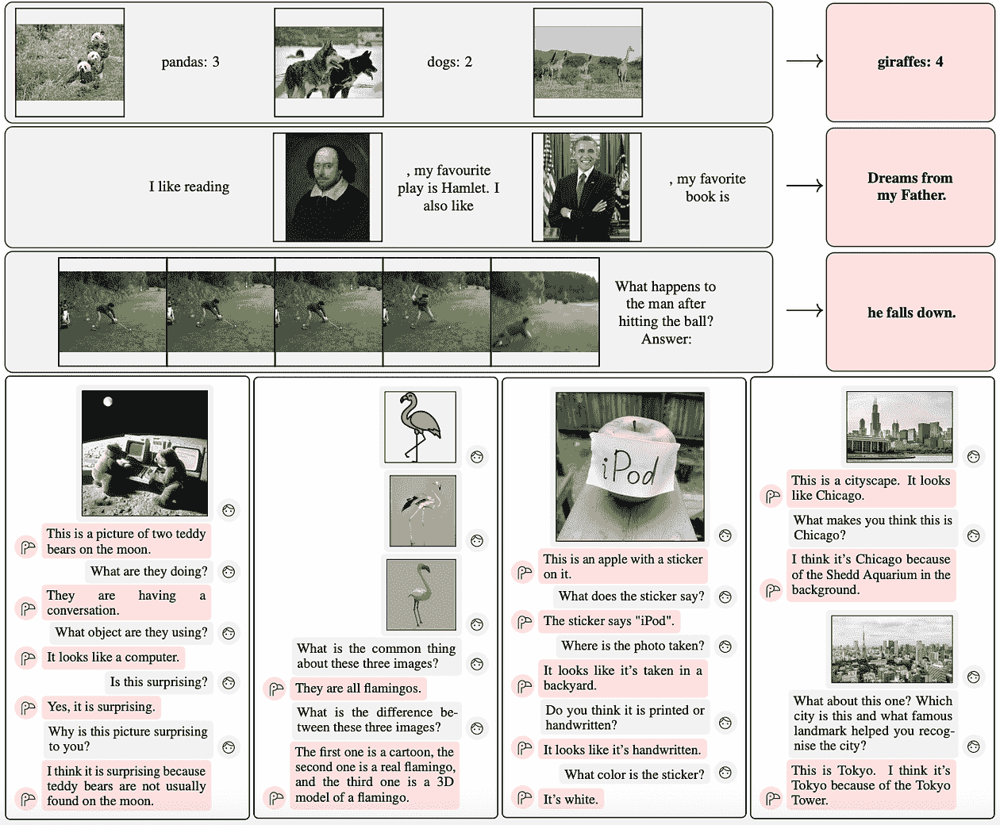

Flamingo 根据文本和图像的输入生成响应。粉红色的块是由 Flamingo 模型生成的。许多处理文本和视觉输入的模型都直接受到 Flamingo 的启发。图片来自 Flamingo 论文。[Flamingo 论文](https://arxiv.org/pdf/2204.14198.pdf)

在很多方面，Flamingo 与 Sora 相似。Flamingo 接受任意序列的图像和文本，并使用这些数据生成文本。Sora 接受任意序列的图像和文本，并使用这些数据生成视频。Flamingo 通过在称为“交叉注意力”的机制中使用特殊的掩码策略来解决同时理解图像和文本的通用问题。

这是一个相当高级的概念，但我将尽力从高层次解释它。

基本上，许多现代 AI 模型中有一个称为注意力的机制，它允许代表单词或图像部分的向量相互交互，以创建抽象且意义丰富的表示。这些表示允许现代 AI 模型进行复杂的推理。

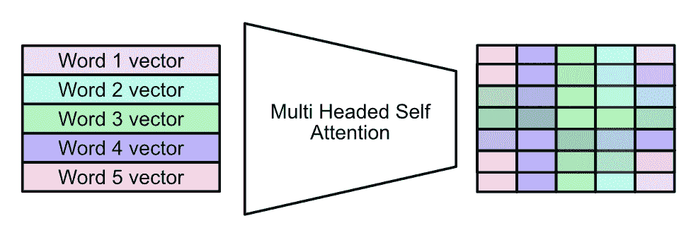

注意力机制有很多不同的种类，但它们都做同样的事情：将代表单个事物的多个向量组合起来，并允许模型通过这些向量之间的交互来创建一个抽象且意义丰富的表示。图片来自[我的关于 Transformer 的文章](https://medium.com/towards-data-science/transformers-intuitively-and-exhaustively-explained-58a5c5df8dbb)。

AI 模型使用两种通用的注意力机制：自注意力和交叉注意力。自注意力允许 AI 模型对输入进行复杂和抽象的表示

想象一下，我们将文本序列“我是一个输入序列”输入到 AI 模型中。我们可能会创建一个代表序列中每个单词的向量，然后将这些向量输入到模型中。“自注意力”，在这种情况下，会使所有原子和孤立的向量相互交互。因此，“我”、“是”、“一个”、“输入”和“序列”的向量将被允许相互交互，从而使模型能够理解整个序列，而不仅仅是孤立的单词列表。

交叉注意力允许不同的输入相互交互。你可以将交叉注意力视为一种过滤器，其中一个输入用于过滤另一个输入。

你可以将交叉注意力机制想象成一个过滤器，其中一个输入（在这种情况下是一个猫的图像）用于过滤另一个输入（在这种情况下，是文本“图像中有什么”）中的信息。请参考我即将发布的关于手动实现交叉注意力机制的文章。

处理多种类型数据的模型，例如 Flamingo 和 Sora，通常同时使用自注意力机制和交叉注意力机制。例如，Flamingo 使用交叉注意力机制将图像数据引入文本表示中，并使用自注意力机制来对文本进行推理。

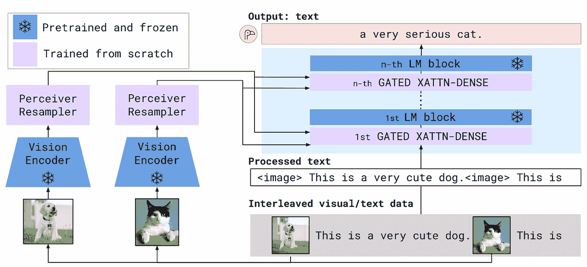

在 Flamingo 论文中，正如我在我的[Flamingo 文章](https://towardsdatascience.com/flamingo-intuitively-and-exhaustively-explained-bf745611238b)中讨论的那样，交叉注意力机制被用来允许模型对语言和图像数据进行推理。图像来自 Flamingo 论文。[Flamingo 论文](https://arxiv.org/pdf/2204.14198.pdf)。

交叉注意力机制的整体思想是允许文本信息与图像信息交互，因此你可以想象，所有图像信息与所有文本信息交互，以便模型可以根据所有文本推理所有图像是有意义的。然而，Flamingo 论文的作者只允许文本与交叉注意力机制中紧接其前的图像交互，而不是所有图像，这被称为“门控”或“掩码”交叉注意力机制。

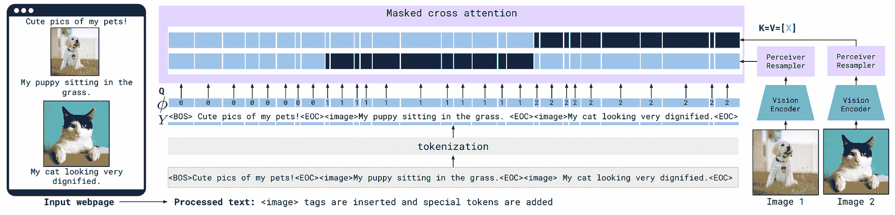

这是一个比较高级的话题。您可以自由地参考我的[Flamingo 文章](https://towardsdatascience.com/flamingo-intuitively-and-exhaustively-explained-bf745611238b)以获取更多信息，但基本思想是，不是所有图像数据都能与所有文本数据交互，文本数据只能与紧接其前的图像数据交互。所以文本“我的小狗坐在草地上”可以与狗的图像交互，而文本“我的猫看起来非常庄重”可以与猫的照片交互。[Flamingo 论文](https://arxiv.org/pdf/2204.14198.pdf)。

这之所以有效，是因为在模型中，也存在自注意力机制的实例。因此，尽管每个图像数据不能*直接*与所有文本数据交互，但它可以*间接*地交互。

火烈鸟也使用多头自注意力机制。因此，即使某些文本片段只能通过交叉注意力直接与某些图像数据交互，所有文本向量都可以在自注意力中相互交互。因此，模型可以学习在它的各种交叉注意力和自注意力层之间按需传播图像信息。想象一下，这张图中的词向量已经有机会通过门控交叉注意力与各种图像交互。

如果我将一系列带有标题的图像列表输入到一个同时使用门控交叉注意力和自注意力的模型中，然后问问题“第一张图像里有什么？”交叉注意力将允许图像数据注入到一些文本数据中，然后自注意力将允许所有文本数据相互交互，从而使模型能够回答问题。

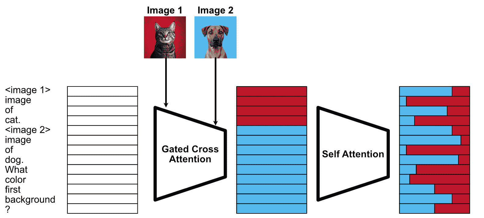

当像火烈鸟这样的模型在同一个模型中使用门控交叉注意力和自注意力时，尽管图像信息只暴露给交叉注意力中的某些文本向量，但这些向量可以在自注意力中相互交互；从而产生包含来自图像信息的混合向量。

有可能 Sora 采用了类似的策略，只不过它不是将图像数据应用于整个文本，而是可能将文本数据应用于一系列图像。对于生成的视频的每一帧，我们可以允许某些文本片段关注这些帧。

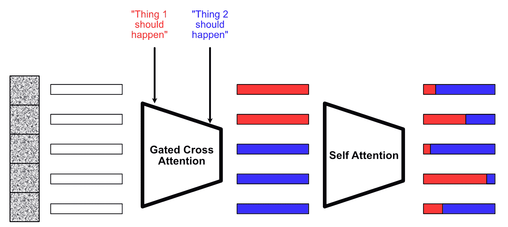

就像火烈鸟一样，即使使用了门控交叉注意力，自注意力也允许模型在帧之间移动文本信息。这些混合向量将被用来去噪图像并生成最终的视频。

尽管某些文本片段只直接与一小部分帧交互，但它们可以通过自注意力间接与所有帧交互，从而使模型能够根据所有文本输入制作一个连贯的视频。

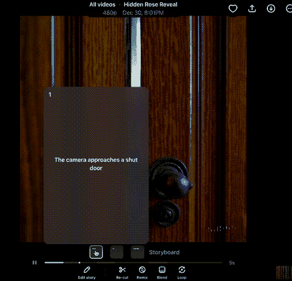

在这里，你可以看到用于生成视频的故事板。注意，当文本“门开了”出现时，玫瑰是可见的，这在故事板中提到玫瑰之前。

我之前提到，使用 Sora 进行提示工程可能会有些复杂。这或许可以解释原因。结果是所有提示的大杂烩。即使你在故事板的非常开头有一个提示，它也可能影响后续帧的生成。

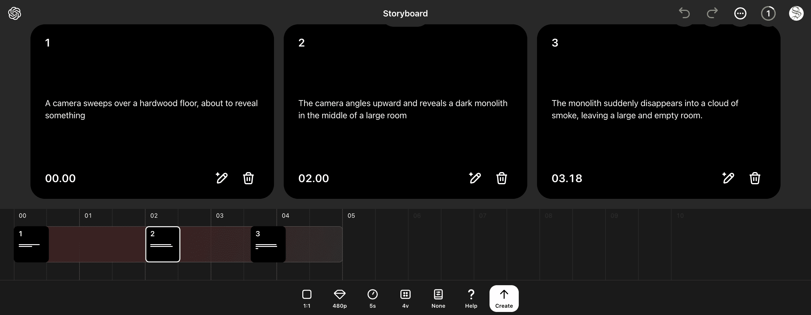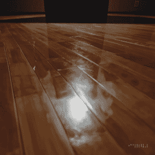

上述故事板定义的结果。它尊重了故事板中定义的许多核心思想，但也忽略了一些关键点。虽然 Sora 非常强大，但也需要一些调整才能得到你想要的确切效果。

### 技巧 3）部分扩散

而不是试图通过提示工程得到我们想要的视频，我们可以使用 Sora 中的“混合”功能来确保我们在感兴趣的场景之间进行过渡。

回想一下，扩散模型迭代地降噪整个视频

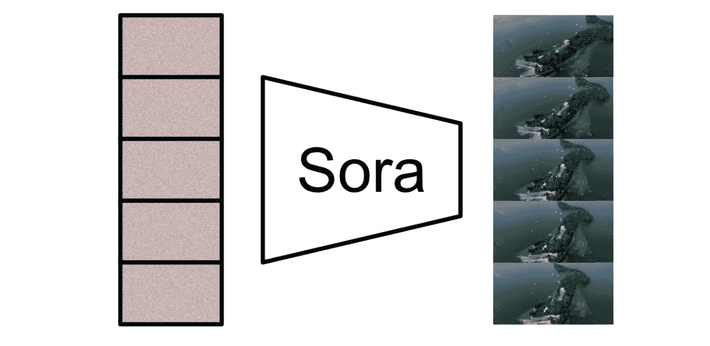

回想一下，扩散视频模型本质上接受一系列噪声图像并输出一系列无噪声图像。

我们可以在两侧注入完整的视频帧，以诱使模型在特定帧之间创建一些过渡。我们之前在时间线部分就是这样做的。

回想一下，我们创建了一个时间线，它从天使的图像开始，以眼睛的视频结束

然而，当我们使用时间线创建这个效果时，我们的结果并不非常吸引人。Sora 中的“混合”功能允许对过渡进行更精细的控制。我不完全确定它是如何工作的，但我有一个强烈的预感。

我认为，与其使用我们 100%想要的帧，或者 100%的噪声帧，不如使用混合功能，我们可以指定我们想要混合的两个视频之间的噪声程度。

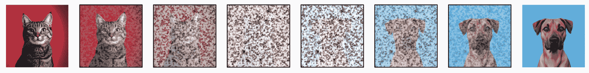

如果我们在它们之间创建一系列具有不同程度噪声的图像，我们可以在帧之间或多或少地控制 Sora。

这允许 Sora 在一段时间内对某些帧进行不同程度的编辑。

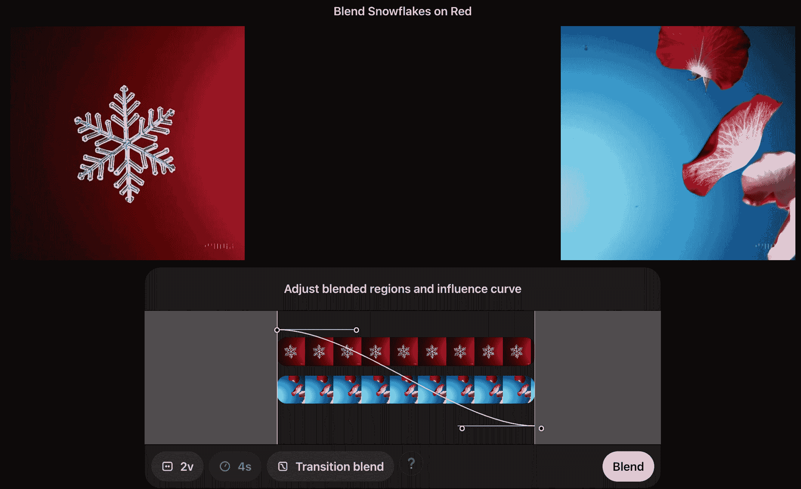

我生成了两个视频，一个是雪花视频，一个是飘落的玫瑰花瓣视频，并在它们之间创建了一个过渡。曲线指定了每个视频有多少最终出现在输出中。

通过编辑此曲线，您可以更改混合的持续时间，其渐进程度以及过渡两端对视频进行调整的程度。例如，如果我们想要一个渐进的过渡，完美地尊重开始时的天使视频，并在结束时完美地尊重眼睛视频，我们可能会这样做：

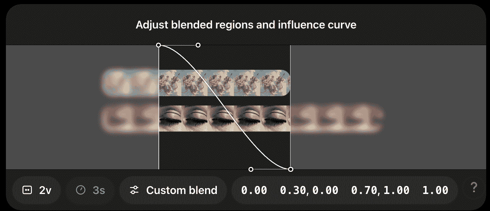

如果我们想要一个只稍微尊重天使视频的视频，然后过渡到一个完全尊重眼睛视频的视频，您可能会制作一个这样的曲线

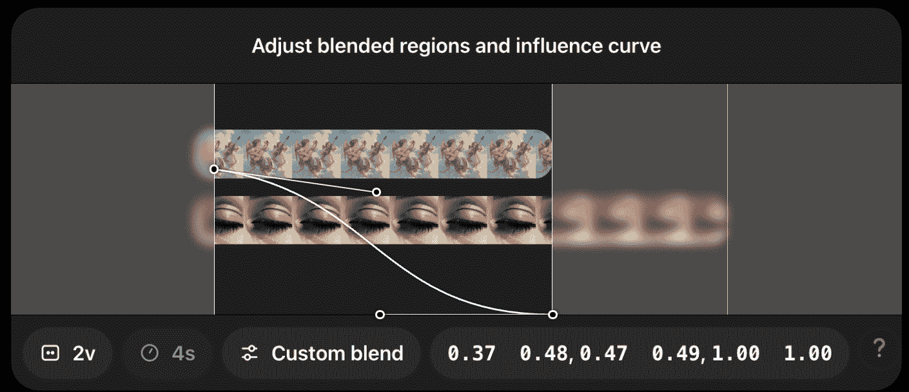

我不确定 Sora 中是否存在一个错误，但我似乎找不到自定义混合中的提交按钮。然而，我们可以通过使用预定义的混合模式来证实我们的怀疑。

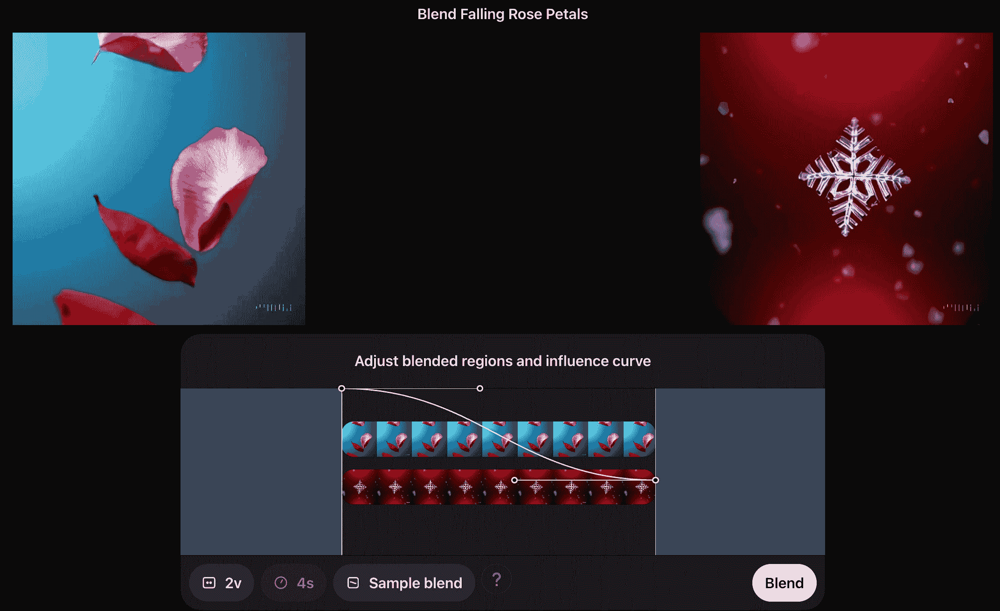

一个在开始时完美尊重玫瑰花瓣帧的视频，然后更松散地融入雪花视频

没有银弹可以使 Sora 在所有用例中都能工作，但我认为混合工具对许多用户来说特别吸引人。我建议投入一些前期努力，使视频对齐，以帮助 Sora。

### 技巧 4）可变宽高比、持续时间以及细节级别

制作一个可以输出几种不同宽高比和分辨率的 AI 模型可能看起来是一个微不足道的细节，但事实并非如此。几乎所有的 AI 模型都可以接受固定大小的输入，并生成固定大小的输出。数据科学家必须使用很多花哨的技巧来创造动态尺寸输出的错觉。

用自然语言来说，这是通过填充完成的。当您提交一个仅由几个标记组成的查询时，会使用特殊的`<pad>`标记来填充空白空间。

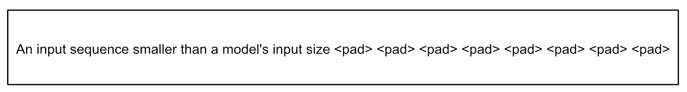

在图像和视频生成中，你可能可以做一些类似的事情。例如，你可以创建一个视频生成模型，该模型始终输出最大分辨率的长时间视频，然后，如果用户想要更短和更低分辨率的视频，你可以在生成的视频周围添加填充。

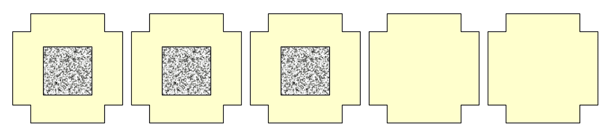

想象一个能够生成各种尺寸和时长、方形、水平以及垂直画幅的视频的 AI 模型。我们只需选择我们想要的尺寸和时长（静态）然后填充剩余的部分（黄色）。

虽然这可能可行，但我认为这并不实用；训练这样的扩散模型会非常浪费。扩散模型的一个主要思想是“潜在扩散模型”的概念。基本上，即使是小图像中也有大量的数据，所以大多数现代扩散模型将数据压缩成更小的表示形式，模型思考这些数据，然后将其解压缩以生成最终图像。

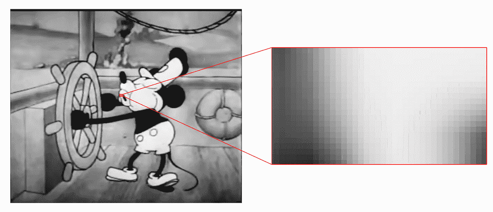

很容易忘记单张图像中包含的信息量有多大。在现代图像中，你必须放大很多才能看到单个像素。这张图像本身包含总共 5,468,400 个像素。考虑到大型模型，其训练成本高达数百万美元，但参数量仍以万亿计，拥有 540 亿参数的输入似乎要求过高。此外，请注意，当你放大到像素级别时，图像中有大量的冗余信息。[我的关于 Sora 的原始文章](https://medium.com/towards-data-science/sora-intuitively-and-exhaustively-explained-a54f83ea9c21)。

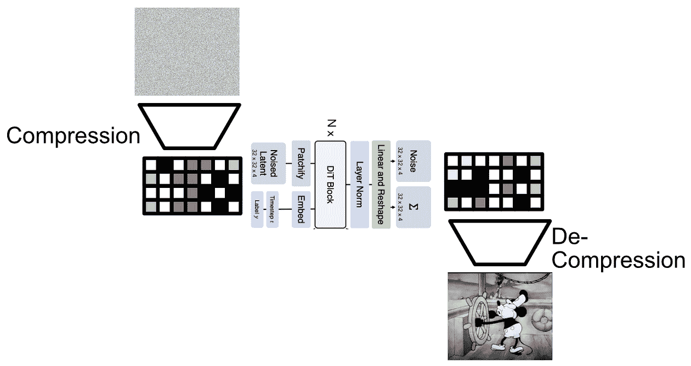

潜在扩散模型在模型前后压缩和解压缩数据。[我的关于 Sora 的原始文章](https://medium.com/towards-data-science/sora-intuitively-and-exhaustively-explained-a54f83ea9c21)。

采用这种方法，我们可以创建模型的不同压缩和解压缩部分，并为各自的输出训练这些部分。

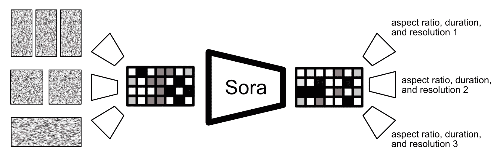

只要它们都被压缩成类似格式，相同的 AI 模型可以用于各种不同的长宽比。

Sora 有三种长宽比、三种分辨率和四种时长，总共有 36 种可能的输出格式。OpenAI 可以为每种表示训练一个单独的解压缩部分，或者他们可以采取无数其他花哨的方法，谁知道呢。

我相信有大约一百万种其他秘密配方用于使 Sora 运作，但现在我想讨论一个与 Sora 相关的问题：人物。

## 一个大问题

最近，全世界都非常关注深度伪造，这是有道理的。深度伪造是专门设计来模仿人物以用于尴尬、指控或剥削目的的 AI 生成内容。因此，OpenAI 在生成包含人物的內容方面设置了一些严肃的护栏。

我希望这篇文章的介绍视频是一系列来自不同人群的逼真人物面孔的幻灯片。计划是在 MidJourney（我选择的图像生成模型）中生成一些图像，然后创建一个时间线来构建视频。

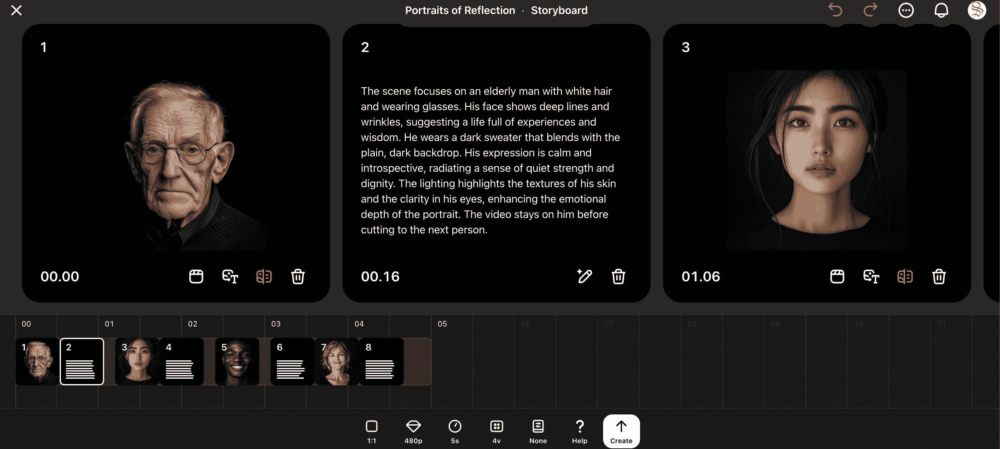

我所追求的

然而，我遇到了以下回应。

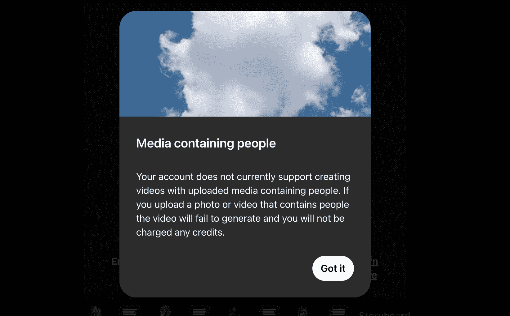

显然，您无法生成包含人物的视频内容。

如您通过阅读这篇文章可能已经了解到的，Sora 非常强大，但同时也有些笨拙和有限。我真心认为 Sora 的强大之处在于其将新且有趣的技巧应用于真实视频或 VFX 的能力。我可以想象 Sora 调整灯光、创建有趣的过渡，以及各种其他有趣的应用。然而，如果您不能使用 Sora 编辑包含人物的视频（这是人类关心的大多数视频），那么谁会在乎呢？

您可以使用 Sora 生成人物的视频，据我所知，一旦生成，您就可以像使用任何其他视频一样使用它们，但无法使用真实人物的视频严重限制了某些用例。

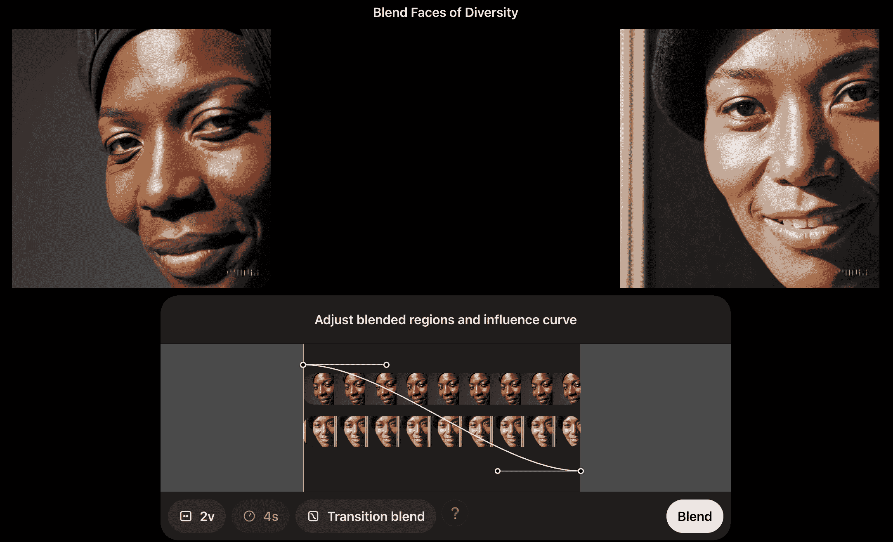

我尝试创建封面视频时生成的两个视频

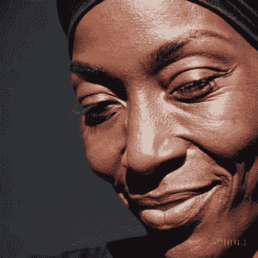

一个融合上述两个视频生成的视频。顺便说一句，一个白人男子在标题为“多元面孔”下制作一个黑人女性微笑的视频的含义并没有逃过我的眼睛。人脸是一种微妙而复杂的交流工具，它同时传达“这是我”和“我这样感受”的信息。使用 Sora，我觉得，意味着有责任意识到并尊重这一事实。

OpenAI 目前处于一个有些棘手的境地。一方面，Sora 最危险的使用是在编辑人的视频，另一方面，Sora 最吸引人的使用也是在编辑人的视频。目前看来，他们似乎是通过只允许某些方上传包含人类内容的视频来处理这个问题。

## 结论

在这篇文章中，我们讨论了 Sora，既包括其核心功能，也包括其背后的理论。首先，我们游览了 Sora 并探索了一些其核心功能，然后我们探讨了这些功能可能如何实现。我们还讨论了在使用 Sora 时可能会遇到的一些实际困难，它引发的一些伦理问题，以及它的一些当前限制。

如果你对从更概念性的角度探索 Sora 感兴趣，请查看我关于这个主题的文章。

> [**Sora – 直观且详尽地解释**](https://towardsdatascience.com/sora-intuitively-and-exhaustively-explained-a54f83ea9c21)

## 直观且详尽地解释

在 IAEE 你可以找到：

+   长篇内容，比如你刚刚读过的文章

+   基于我的数据科学家、工程总监和企业家经验的思想碎片

+   一个专注于学习 AI 的 discord 社区

+   定期讲座和办公时间

[加入 IAEE](https://iaee.substack.com/)
