# 基于转换器的主题建模的 BERTopic 实用指南

> 原文：[`towardsdatascience.com/a-practical-guide-to-bertopic-for-transformer-based-topic-modeling/`](https://towardsdatascience.com/a-practical-guide-to-bertopic-for-transformer-based-topic-modeling/)

<mdspan datatext="el1746680777805" class="mdspan-comment">主题建模</mdspan>在自然语言处理（NLP）领域有广泛的应用场景，例如文档标记、调查分析和内容组织。它属于无监督学习技术范畴，因此是一种非常经济高效的技术，可以减少收集人工标注数据所需的资源。我们将深入了解 BERTopic，这是一个流行的基于转换器的主题建模的 Python 库，帮助我们更快地处理财经新闻，并揭示热门话题随时间的变化。

BERTopic 由 6 个核心模块组成，可以根据不同的用例进行定制。在本文中，我们将逐一检查、实验每个模块，并探讨它们如何协同工作以产生最终结果。

从高层次来看，典型的 BERTopic 架构由以下部分组成：

+   嵌入：使用 sentence-transformer 模型将文本转换为捕获语义意义的向量表示（即嵌入）。

+   维度降低：在保留重要关系的同时，将高维嵌入降低到低维空间，包括 PCA、UMAP 等…

+   聚类：根据具有降低维度的嵌入将相似文档分组，以形成不同的主题，包括 HDBSCAN、K-Means 算法等…

+   向量化器：在形成主题簇之后，向量化器将文本转换为可用于主题分析的数值特征，包括计数向量化器、在线向量化器等…

+   c-TF-IDF：计算主题簇内和跨主题簇的单词重要性分数，以识别关键术语。

+   表示模型：利用候选关键词嵌入与文档嵌入之间的语义相似性，找到最具代表性的主题关键词，包括 KeyBERT、基于 LLM 的技术等…

* * *

## 项目概述

在这个实际应用中，我们将使用主题建模来识别苹果财经新闻中的热门话题。使用 NewsAPI，我们从谷歌搜索中收集每日排名靠前的苹果股票新闻，并将它们整理成包含 250 篇文档的数据集，每篇文档包含一天的具体财经新闻。然而，这并不是本文的重点，所以您可以随意替换为您自己的数据集。目标是展示如何将包含顶级谷歌搜索结果的原始文本文档转换为有意义的主题关键词，并进一步提炼这些关键词以使其更具代表性。


如果您更喜欢视频教程，请查看我的 YouTube 视频：**BERTopic 教程 10 分钟 | 财经新闻分析中的主题建模应用**。

* * *

## BERTopic 的 6 个基本模块

### 1. 嵌入

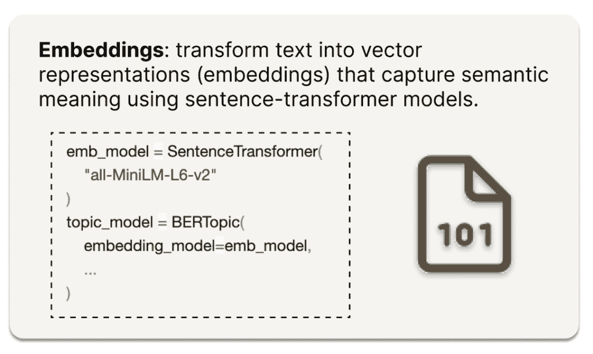

BERTopic 使用句子转换器模型作为其第一个构建块，将句子转换为密集的向量表示（即嵌入），这些嵌入捕捉语义含义。这些模型基于 BERT 等转换器架构，并专门训练以产生高质量的句子嵌入。然后，我们使用嵌入之间的余弦距离来计算句子之间的语义相似度。常见的模型包括：

+   all-MiniLM-L6-v2：轻量级、快速、良好的通用性能

+   BAAI/bge-base-en-v1.5：更大的模型，具有更强的语义理解能力，因此训练和推理速度较慢。

在 “[Sentence Transformer”](https://www.sbert.net/docs/sentence_transformer/pretrained_models.html) 网站和 [Huggingface 模型库](https://huggingface.co/models) 上，你可以选择大量的预训练句子转换器。我们可以用几行代码加载一个句子转换器模型，并将文本序列编码成高维数值嵌入。

```py
from sentence_transformers import SentenceTransformer

# Initialize model
model = SentenceTransformer("all-MiniLM-L6-v2")

# Convert sentences to embeddings
sentences = ["First sentence", "Second sentence"]
embeddings = model.encode(sentences)  # Returns numpy array of embeddings
```

在这个例子中，我们将 2024 年 10 月至 2025 年 3 月的金融新闻数据集输入到句子转换器“bge-base-en-v1.5”中。如下所示的结果显示，这些文本文档被转换成了具有 250 行和每行 384 维度的向量嵌入。

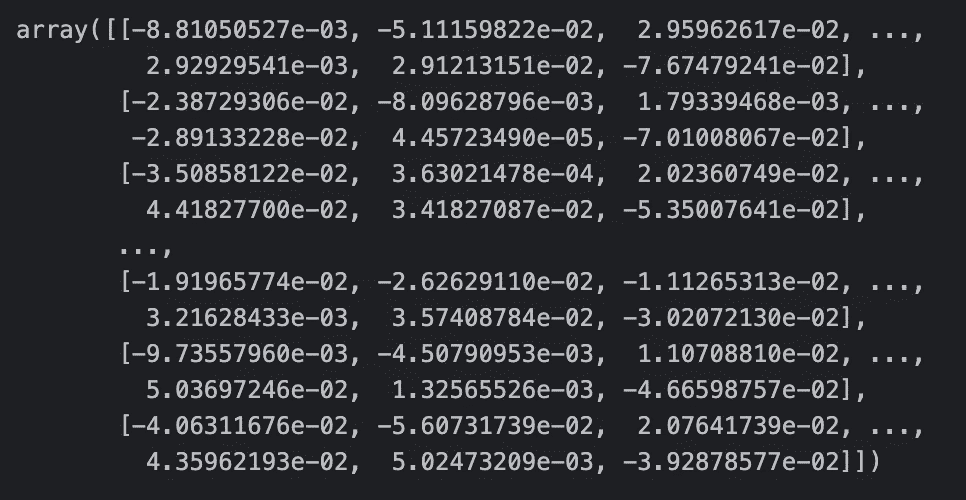

然后，我们可以将这个句子转换器输入到 BERTopic 管道中，并保持所有其他模块为默认设置。

```py
from sentence_transformers import SentenceTransformer
from bertopic import BERTopic

emb_minilm = SentenceTransformer("all-MiniLM-L6-v2")
topic_model = BERTopic(
    embedding_model=emb_minilm,
)

topic_model.fit_transform(docs)
topic_model.get_topic_info()
```

最终结果，我们得到以下主题表示。


与更强大、更大的“bge-base-en-v1.5”模型相比，我们得到以下结果，它比较小的“all-MiniLM-L6-v2”模型稍微更有意义，但仍有很大的改进空间。

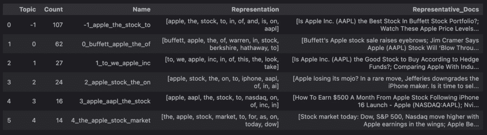

一个改进的领域是降低维度，因为句子转换器通常会产生高维嵌入。由于 BERTopic 依赖于比较嵌入空间中的空间邻近性来形成有意义的聚类，因此应用维度降低技术以使嵌入更密集是至关重要的。因此，我们将在下一节介绍各种维度降低技术。

### 2. 维度降低

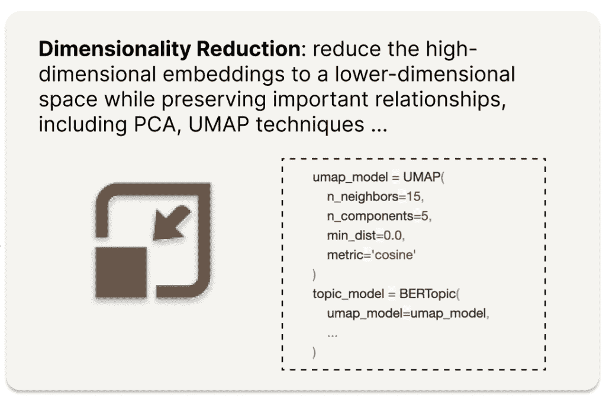

在将金融新闻文档转换为嵌入后，我们面临高维度的难题。由于每个嵌入包含 384 维，向量空间变得过于稀疏，无法在两个向量嵌入之间创建有意义的距离测量。主成分分析（PCA）和均匀流形近似与投影（UMAP）是常见的降低维度同时保留数据最大方差的技术。我们将更详细地探讨 UMAP，BERTopic 的默认维度降低技术。它是一个从拓扑分析中采用的非线性算法，旨在寻找数据中的多样性结构。它通过从每个数据点向外扩展一个半径，并连接其邻近的点来实现。您可以在本网站上深入了解 UMAP 可视化：“[理解 UMAP](https://pair-code.github.io/understanding-umap/)”。

**UMAP `n_neighbours` 实验**

一个重要的 UMAP 参数是 `n_neighbours`，它控制 UMAP 在数据中平衡局部和全局结构的方式。较低的 `n_neighbors` 值将迫使 UMAP 专注于局部结构，而较大的值将查看每个点的更大邻域。

下面的图表展示了多个散点图，展示了不同 `n_neighbors` 值的影响，每个图表都展示了在应用 UMAP 维度降低后，在二维空间中的嵌入可视化。

当 `n_neighbors` 值较小时（例如 n=2, n=5），图表显示更紧密耦合的微观簇，表明关注局部结构。随着 `n_neighbors` 的增加（趋向于 n=100, n=150），点形成更紧密的全局模式，展示了较大的邻域大小如何帮助 UMAP 捕获数据中的更广泛关系。

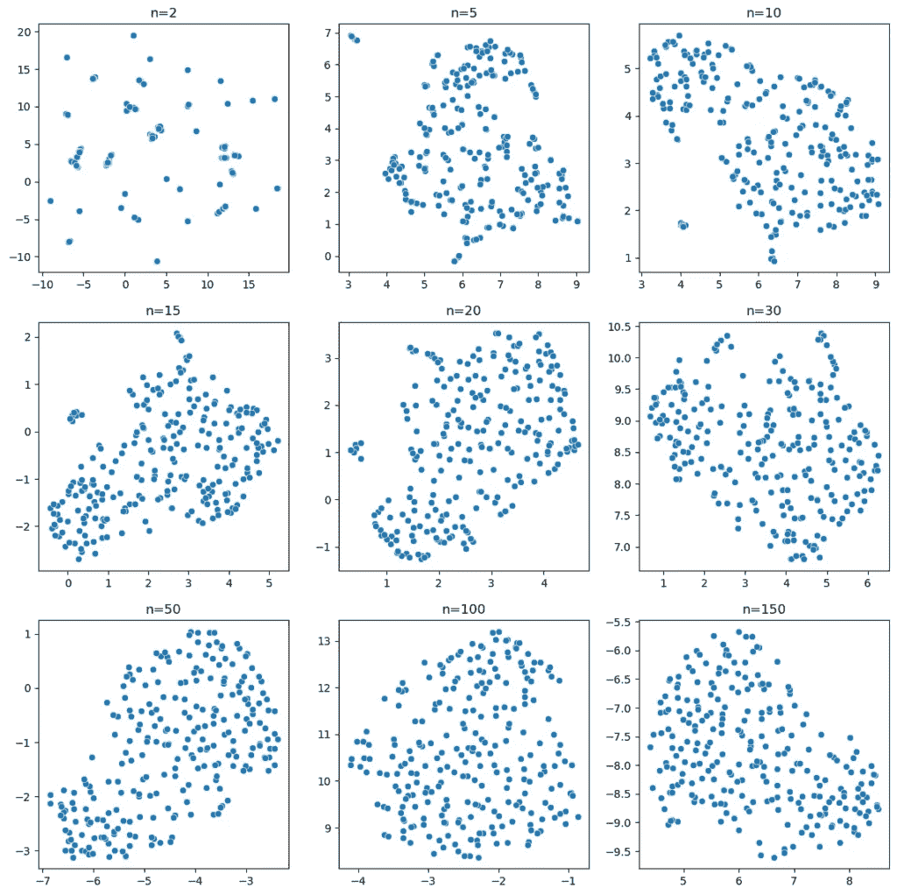

**UMAP `min_dist` 实验**

UMAP 中的 `min_dist` 参数控制点在低维表示中允许多紧密地打包在一起。它设置了嵌入空间中点之间的最小距离。较小的 `min_dist` 允许点非常紧密地打包在一起，而较大的 `min_dist` 则迫使点更加分散并均匀分布。下面的图表展示了在设置 `n_neighbors=5` 时，`min_dist` 值从 0.0001 到 1 的实验。当 min_dist 设置为较小的值时，UMAP 强调保留局部结构，而较大的值将嵌入转换为圆形形状。

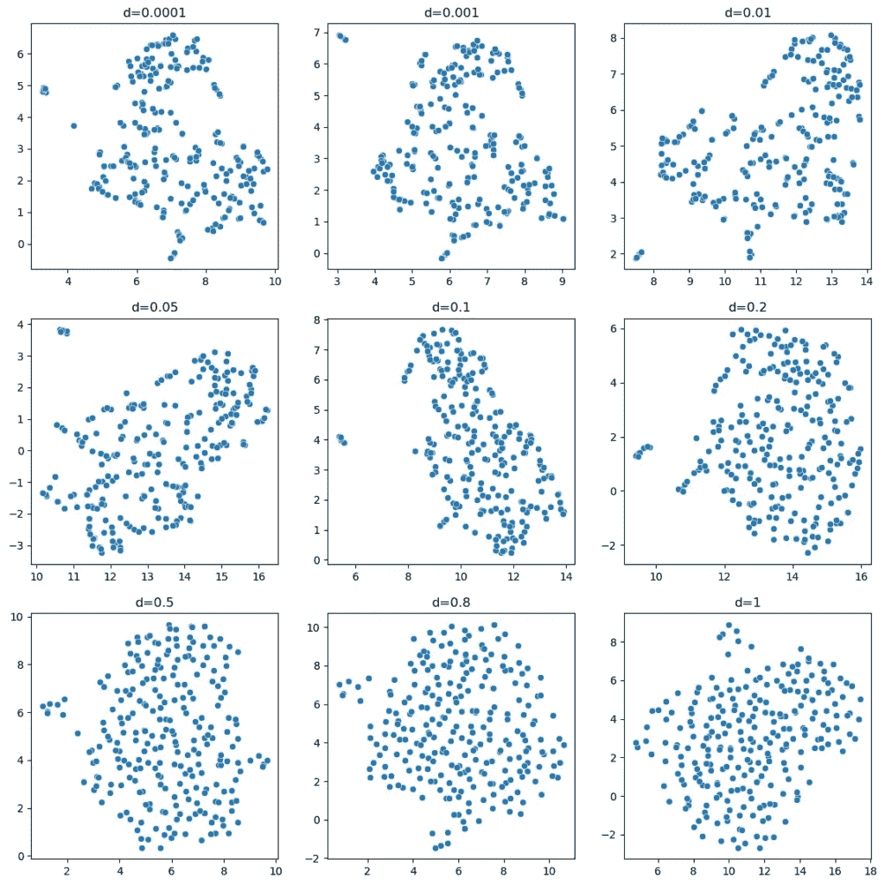

根据超参数调整结果，我们决定将 `n_neighbors` 设置为 5 和 `min_dist` 设置为 0.01，因为它形成了更明显的数据簇，这有助于后续的聚类模型处理。

```py
import umap

UMAP_N = 5
UMAP_DIST = 0.01
umap_model = umap.UMAP(
    n_neighbors=UMAP_N,
    min_dist=UMAP_DIST, 
    random_state=0
)
```

### 3. 聚类

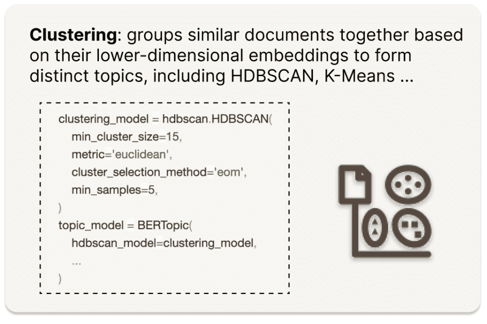

在降维模块之后，这是将接近的嵌入分组到簇中的过程。这个过程对主题建模是基本的，因为它通过查看它们的语义关系将相关的文本文档分类在一起。BERTopic 默认使用 HDBSCAN 模型，它在捕捉具有不同密度的结构方面具有优势。此外，BERTopic 还提供了根据数据集的性质选择其他聚类模型的灵活性，例如 K-Means（用于球形、等大小的簇）或层次聚类（用于层次簇）。

**HDBSCAN 实验**

我们将探讨两个重要参数`min_cluster_size`和`min_samples`如何影响 HDBSCAN 模型的行为。

`min_cluster_size`确定形成簇所需的最小数据点数量，未达到阈值的簇被视为异常值。当设置`min_cluster_size`太低时，可能会得到许多小而不稳定的簇，这些簇可能是噪声。如果设置得太高，可能会将多个簇合并为一个，失去它们的独特特征。

`min_samples`计算一个点与其第 k 个最近邻之间的距离，确定簇形成过程的严格程度。`min_samples`值越大，聚类就越保守，因为簇将限制在密集区域形成，将稀疏点分类为噪声。

压缩树是一种有用的技术，可以帮助我们决定这两个参数的适当值。在压缩树图中左侧垂直轴显示的 lambda 值范围内持续存在的簇被认为是稳定的且更有意义。我们更喜欢选择的簇既高（更稳定）又宽（簇大小大）。我们使用 HDBSCAN 的`condensed_tree_`来比较从 3 到 50 的`min_cluster_size`，然后根据预测的簇标签对向量空间中的数据点进行着色可视化。随着我们通过不同的`min_cluster_size`值，我们可以识别出将接近数据点分组在一起的优化值。

在这个实验中，我们选择了`min_cluster_size=15`，因为它生成了 4 个具有良好稳定性和簇大小的簇（在下面的压缩树图中用红色突出显示）。此外，散点图也表明基于邻近性和密度形成了合理的簇。

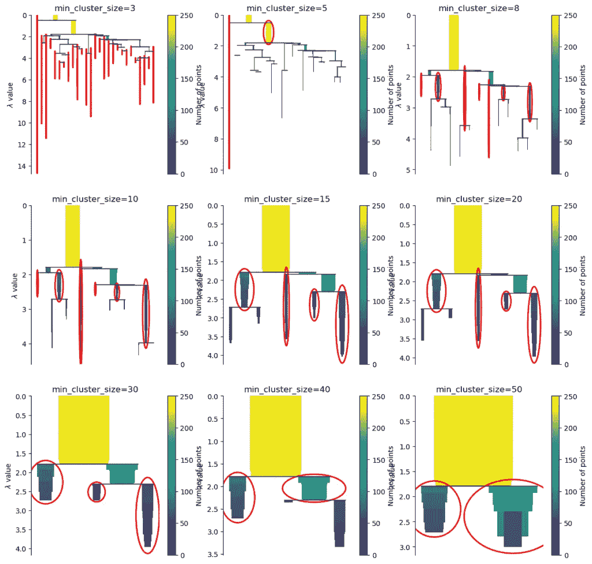

HDBSCAN `<code>min_cluster_size` 实验的压缩树

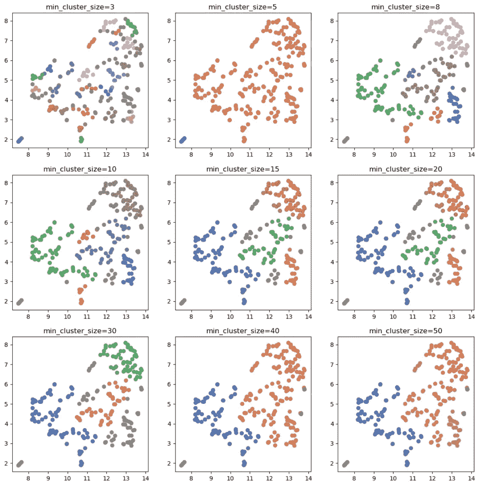

HDBSCAN `<code>min_cluster_size` 实验的散点图

我们接着进行类似的练习，比较从 1 到 80 的`min_samples`值，并选择了`min_samples=5`。正如您可以从视觉中观察到的，参数`min_samples`和`min_cluster_size`对聚类过程有不同的影响。

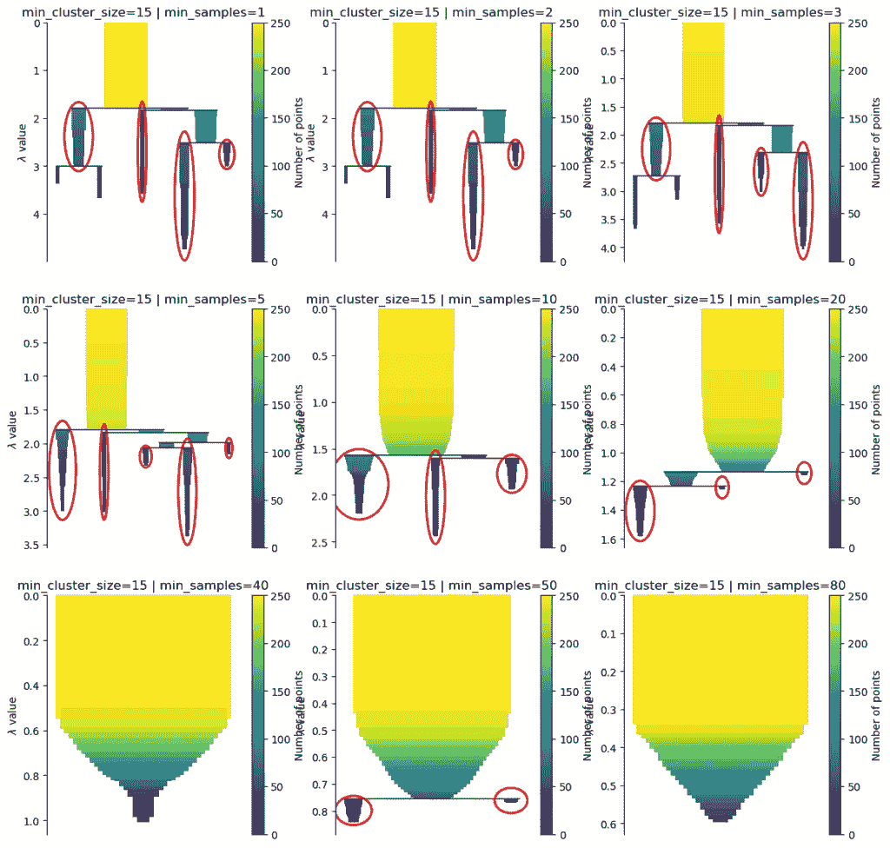

HDBSCAN `min_samples` 实验的压缩树

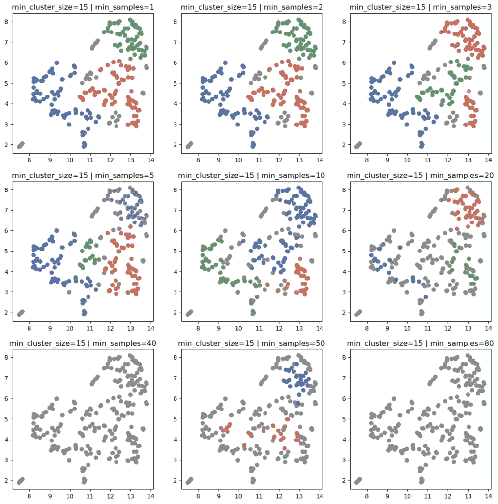

HDBSCAN `min_samples` 实验的散点图

```py
import hdbscan

MIN_CLUSTER _SIZE= 15
MIN_SAMPLES = 5
clustering_model = hdbscan.HDBSCAN(
    min_cluster_size=MIN_CLUSTER_SIZE,
    metric='euclidean',
    cluster_selection_method='eom',
    min_samples=MIN_SAMPLES,
    random_state=0
)

topic_model = BERTopic(
    embedding_model=emb_bge,
    umap_model=umap_model,
    hdbscan_model=clustering_model, 
)

topic_model.fit_transform(docs)
topic_model.get_topic_info()
```

**K-Means 实验**

与 HDBSCAN 相比，使用 K-Means 聚类通过指定 `n_cluster` 参数可以生成更细粒度的主题，从而控制从文本文档中生成的主题数量。

这张图显示了一系列散点图，展示了当使用 K-Means 从 3 到 50 变化簇数 (`n_cluster`) 时不同的聚类结果。当 `n_cluster=3` 时，数据被分为仅三个大型组。随着 `n_cluster` 的增加（5、8、10 等），数据点被分割成更细粒度的分组。总体上，与 HDBSCAN 相比，它形成了圆形的簇。我们选择了 `n_cluster=8`，其中簇既不太宽（丢失重要区分）也不太细（创建人工划分）。此外，这是对 250 天金融新闻进行分类的正确数量的主题。然而，如果您需要识别更细粒度或更宽泛的主题，请随意调整代码片段。

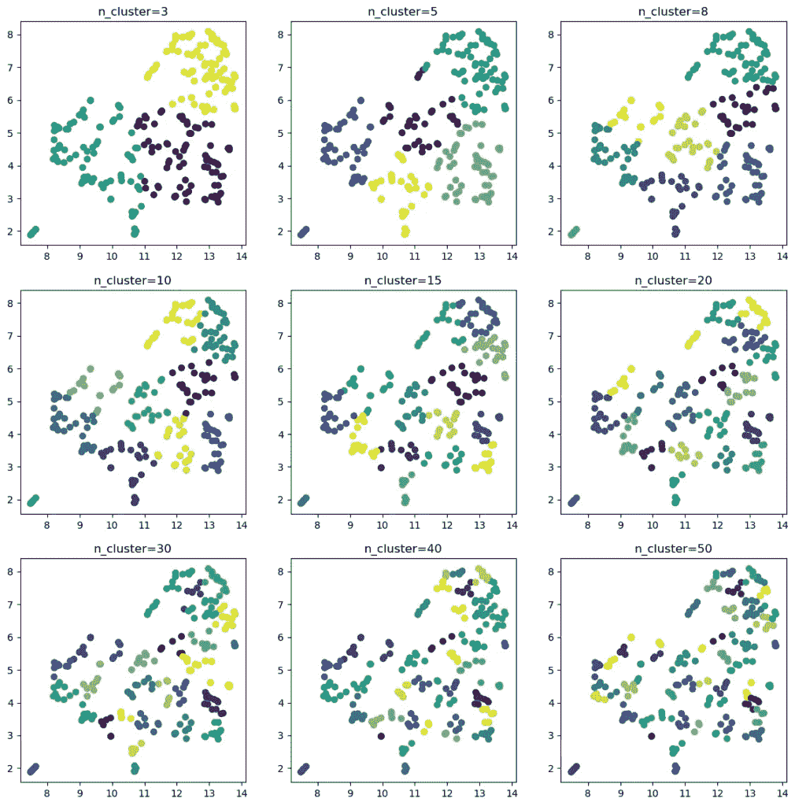

K-Means `n_cluster` 实验的散点图

```py
from sklearn.cluster import KMeans

N_CLUSTER = 8
clustering_model = KMeans(
    n_clusters=N_CLUSTER,
    random_state=0
)

topic_model = BERTopic(
    embedding_model=emb_bge,
    umap_model=umap_model,
    hdbscan_model=clustering_model, 
)

topic_model.fit_transform(docs)
topic_model.get_topic_info()
```

比较 K-Means 和 HDBSCAN 的主题聚类结果，可以发现 K-Means 产生了更明显和有意义的主题表示。然而，两种方法仍然生成了许多停用词，这表明后续模块对于细化主题表示至关重要。


HDBSCAN 输出

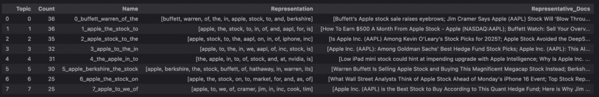

K-Means 输出

### 4. 向量器

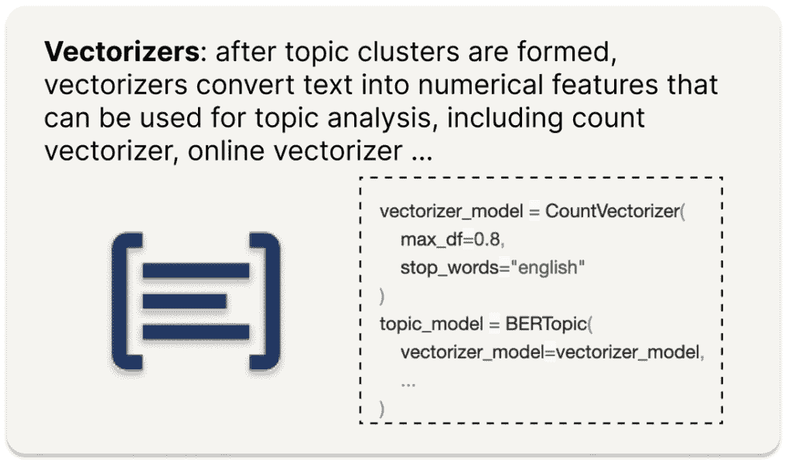

前面的模块负责将文档分组到语义上相似的簇中，而从这个模块开始，主要关注通过选择更具代表性和意义的关键词来微调主题。BERTopic 提供了从基本的 `CountVectorizer` 到更高级的 `OnlineCountVectorizer` 的各种向量器选项，这些选项会增量更新主题表示。在这个练习中，我们将对 `CountVectorizer` 进行实验，这是一个将文档集合转换为词频矩阵的文本处理工具。矩阵中的每一行代表一个文档，每一列代表词汇表中的一个术语，值表示每个术语在每个文档中出现的次数。这种矩阵表示使机器学习算法能够以数学方式处理文本数据。

**向量器实验**

我们将探讨 `CountVectorizer` 的几个重要参数，并了解它们如何可能影响主题表示。

+   `ngram_range` 指定了将多少个单词组合成主题短语。这对于由短短语组成的文档特别有用，但在此情况下并不需要。

    如果我们设置 `ngram_range=(1, 3)` 的示例输出

```py
0                -1_apple nasdaq aapl_apple stock_apple nasdaq_nasdaq aapl   
1  0_apple warren buffett_apple stock_berkshire hathaway_apple nasdaq aapl   
2           1_apple nasdaq aapl_nasdaq aapl apple_apple stock_apple nasdaq   
3              2_apple aapl stock_apple nasdaq aapl_apple stock_aapl stock   
4           3_apple nasdaq aapl_cramer apple aapl_apple nasdaq_apple stock 
```

+   `stop_words`确定是否从主题中移除停用词，这显著提高了主题表示。

+   `min_df`和`max_df`确定术语包含在词汇表中的频率阈值。`min_df`设置术语必须出现的最小文档数，而`max_df`设置术语被认为是过于常见而被丢弃的最大文档频率。

我们探索了将`max_df=0.8`（即忽略在超过 80%的文档中出现的单词）的`CountVectorizer`添加到前一步的 HDBSCAN 和 K-Means 模型的效应。

```py
from sklearn.feature_extraction.text import CountVectorizer
vectorizer_model = CountVectorizer(
		max_df=0.8, 
		stop_words="english"
)

topic_model = BERTopic(
    embedding_model=emb_bge,
    umap_model=umap_model,
    hdbscan_model=clustering_model, 
    vectorizer_model=vectorizer_model
)
```

两个都显示了在引入`CountVectorizer`后有所改进，显著减少了所有文档中频繁出现的关键词，而没有带来额外的值，例如“appl”、“stock”和“apple”。

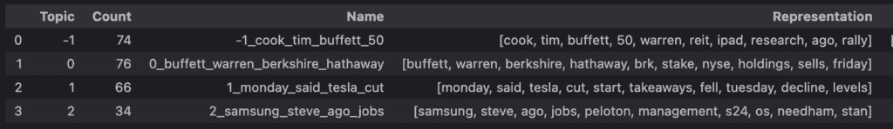

使用向量器的 HDBSCAN 输出


使用向量器的 K-Means 输出

### 5. c-TF-IDF

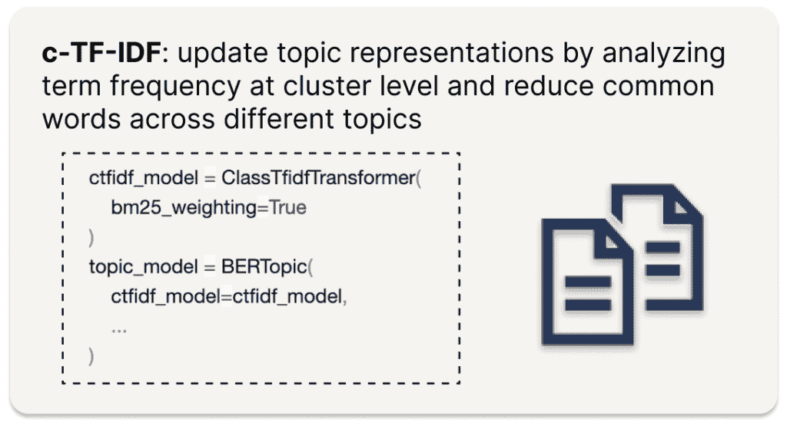

虽然向量器模块专注于调整文档级别的主题表示，但 c-TF-IDF 主要关注聚类级别，以减少跨聚类中频繁遇到的主题。这是通过将属于一个聚类的所有文档视为单个文档，并基于传统的 TF-IDF 方法计算关键词重要性来实现的。

**c-TF-IDF 实验**

+   `reduce_frequent_words`：确定是否对主题中的频繁出现的单词进行降权

+   `bm25_weighting`：当设置为 True 时，使用 BM25 加权而不是标准的 TF-IDF，这有助于更好地处理文档长度的变化。在较小的数据集中，这种变体可以更稳健地处理停用词。

我们使用以下代码片段将 c-TF-IDF（`bm25_weighting=True`）添加到我们的 BERTopic 管道中。

```py
from bertopic.vectorizers import ClassTfidfTransformer

ctfidf_model = ClassTfidfTransformer(bm25_weighting=True)
topic_model = BERTopic(
    embedding_model=emb_bge,
    umap_model=umap_model,
    hdbscan_model=clustering_model, 
    vectorizer_model=vectorizer_model,
    ctfidf_model=ctfidf_model
)
```

下面的主题聚类输出显示，当`CountVectorizer`已经添加时，添加 c-TF-IDF 对最终结果没有产生重大影响。这可能是由于我们的`CountVectorizer`已经设定了一个很高的标准，即消除在文档级别出现超过 80%的单词。随后，这已经在主题聚类级别减少了重叠词汇，这正是 c-TF-IDF 旨在实现的。


使用向量器和 c-TF-IDF 的 HDBSCAN 输出


使用向量器和 c-TF-IDF 的 K-Means 输出

然而，如果我们用 c-TF-IDF 替换`CountVectorizer`，尽管下面的结果与两者都没有添加时相比略有改进，但存在太多的停用词，使得主题表示的价值降低。因此，在这种情况下，对于我们正在处理的文档，c-TF-IDF 模块没有带来额外的价值。

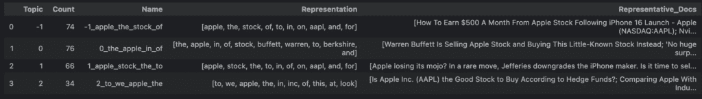

仅使用 c-TF-IDF 的 HDBSCAN 输出

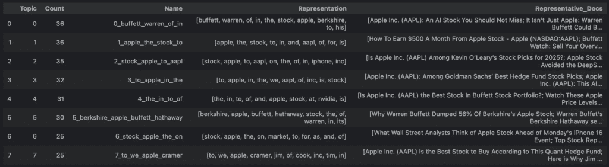

K-Means Output with c-TF-IDF only

### 6. 表示模型

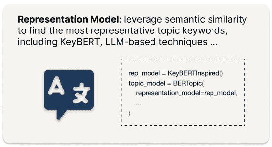

最后一个模块是表示模型，该模型在调整主题表示方面已被观察到具有显著影响。它不是使用像 Vectorizer 和 c-TF-IDF 这样的基于频率的方法，而是利用候选关键词嵌入与文档嵌入之间的语义相似性来找到最具代表性的主题关键词。这可以导致更语义上连贯的主题表示，并减少同义相似关键词的数量。BERTopic 还提供了各种表示模型的定制选项，包括但不限于以下内容：

+   `KeyBERTInspired`: 使用[KeyBERT](https://maartengr.github.io/KeyBERT/)技术根据语义相似性提取主题词。

+   `ZeroShotClassification`: 充分利用[Huggingface 模型库](https://huggingface.co/models?pipeline_tag=zero-shot-classification&sort=downloads)中的开源 transformers 来为主题分配标签。

+   `MaximalMarginalRelevance`: 减少主题中的同义词（例如，股票和 stocks）。

**KeyBERTInspired Experimentation**

我们发现 KeyBERT-Inspired 是一种非常经济高效的方法，因为它通过添加几行额外的代码显著提高了最终结果，而不需要广泛的超参数调整。

```py
from bertopic.representation import KeyBERTInspired

representation_model = KeyBERTInspired()

topic_model = BERTopic(gh
    embedding_model=emb_bge,
    umap_model=umap_model,
    hdbscan_model=clustering_model, 
    vectorizer_model=vectorizer_model,
    representation_model=representation_model
)
```

在引入 KeyBERT-Inspired 表示模型后，我们现在观察到这两个模型生成的主题更加连贯和有价值。


HDBSCAN Output with KeyBERTInspired


K-Means Output with KeyBERTInspired

* * *

## 要点

本文探讨了 BERTopic 技术在主题建模中的应用和实现，详细介绍了其六个关键模块，并通过使用苹果股票市场新闻数据作为实例来展示每个组件对主题表示质量的影响。

+   **嵌入:** 使用基于 transformer 的嵌入模型将文档转换为捕获文本中语义意义和上下文关系的数值表示。

+   **降维:** 使用 UMAP 或其他降维技术来降低高维嵌入，同时保留数据的局部和全局结构

+   **聚类:** 比较基于密度的 HDBSCAN 和基于质心的 K-Means 聚类算法，将相似文档分组为连贯的主题

+   **向量器:** 使用 Count Vectorizer 创建文档-词矩阵，并根据统计方法细化主题。

+   **c-TF-IDF:** 通过分析聚类级别（主题类别）的词频来更新主题表示，并减少不同主题中的常见词汇。

+   **表示模型**：使用语义相似度来细化主题关键词，提供如`KeyBERTInspired`和`MaximalMarginalRelevance`等选项以获得更好的主题描述
