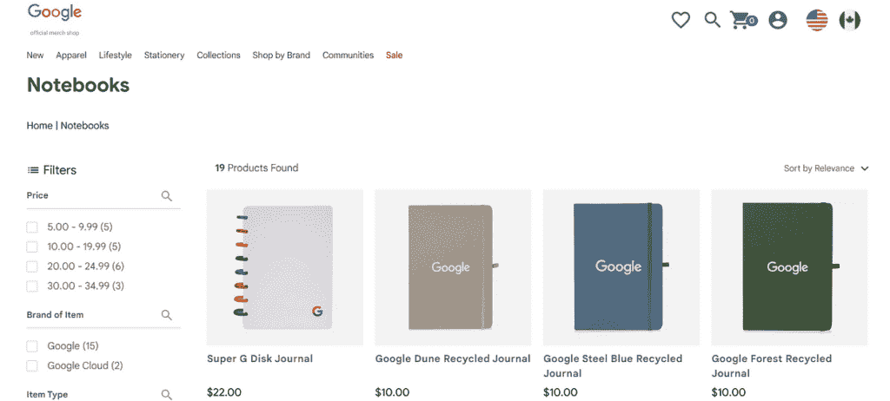
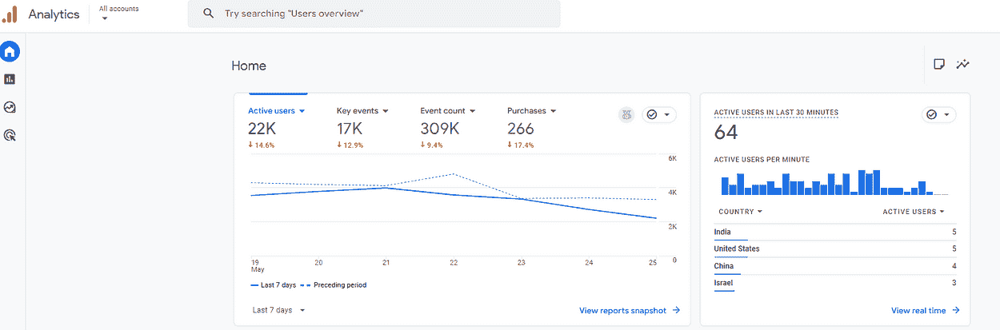
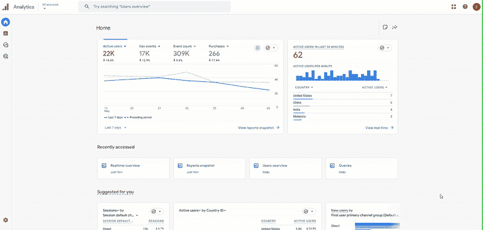
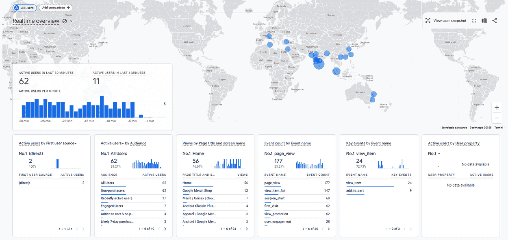
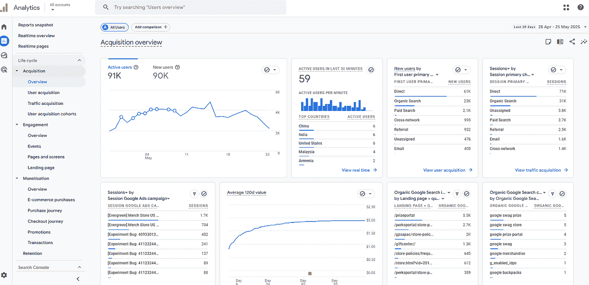
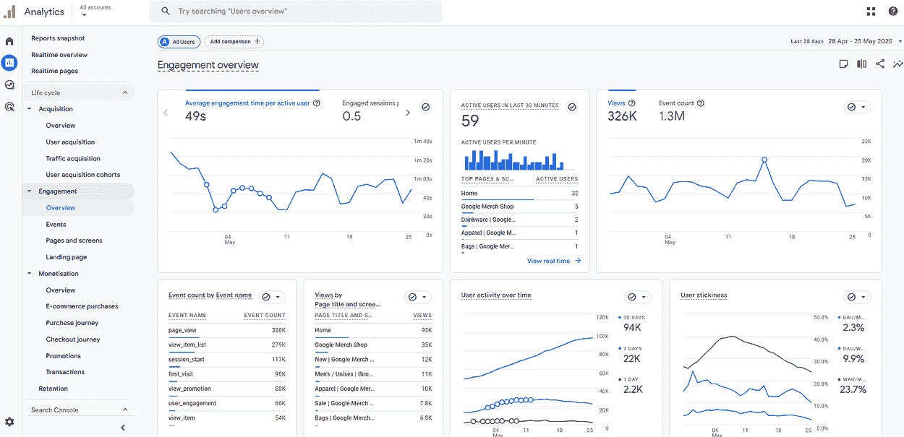
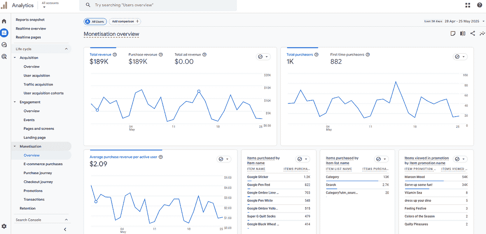
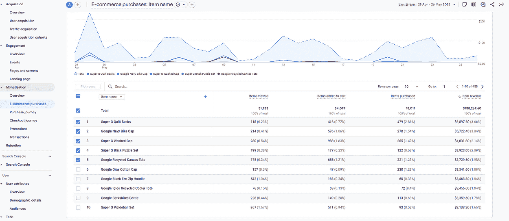
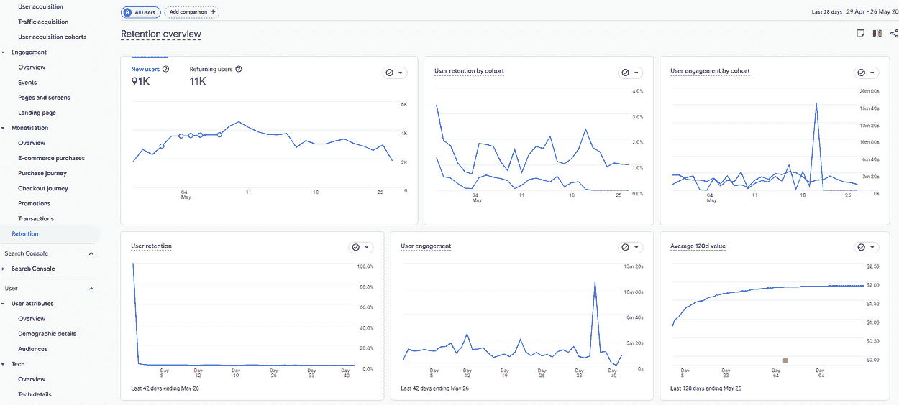

# Google Analytics 的实用介绍

> 原文：[`towardsdatascience.com/a-practical-introduction-to-google-analytics/`](https://towardsdatascience.com/a-practical-introduction-to-google-analytics/)

<mdspan datatext="el1748537283368" class="mdspan-comment">在我的最近项目中</mdspan>，我有机会使用 Google Analytics，这是一个强大的平台，用于跟踪和理解在一家销售服装的电子商务网站上的用户行为。

我的任务是构建一个数据管道，将 GA4 数据导出到 BigQuery，这是一个 Google Cloud 数据仓库。然而，我很快遇到了一个常见问题：许多可用的指南都过时或不一致，这使得整个过程比预期的耗时更长。

在本文中，我将向您介绍一个清晰且最新的 Google Analytics 概览，解释其关键概念，突出最重要的报告，并展示如何使用 **Google Analytics 数据 API 和 Python 导出 GA4 数据的实例。**

好奇 GA4 能为您做什么吗？让我们深入探讨！

* * *

**目录：**

+   **Google Analytics 的生命周期**

+   **维度和指标**

+   **探索 GA4 的核心报告**

+   **探索数据 API**

* * *

## Google Analytics 的生命周期


作者插图。Google Analytics 的三个阶段

Google Analytics 允许了解客户旅程的不同阶段，在每个步骤都提供有价值的见解。

它始于 **Acquisition**，在这一阶段，您吸引用户并激发他们对您业务的兴趣。这一阶段侧重于将客户带到您的网站或应用中的渠道和策略。

接下来是 **Engagement**，它关注用户如何与您的内容或产品互动。例如，他们可能会浏览页面、观看视频或将商品添加到购物车中。

然后是 **Monetization** 和 **Retention**，它们是关键阶段的一部分。货币化阶段有助于了解用户在哪里进行购买，将他们转化为客户，而保留度衡量用户返回的频率，有助于评估长期满意度和忠诚度。

通过分析旅程的每个阶段，可以确定哪些是有效的，发现改进的领域，并做出更明智、基于数据的决策来提升品牌的表现。

## 维度和指标

在继续之前，了解 Google Analytics 中的一个基本概念很重要：每个报告都是使用维度和指标构建的。理解维度和指标如何协同工作对于解释报告并将数据转化为有意义的信息至关重要。

### 维度

维度是分组数据的定性属性。核心维度包括：

+   **Campaign** 是一种付费推广或营销活动

+   **Source** 是用户来自哪里。例如，它可以是来自网站或像 Instagram 和 Facebook 这样的社交媒体网络。

+   **Medium** 是流量来源的一般分类，例如有机搜索、CPC 和推荐。

+   **渠道**是基于规则的一组流量来源、媒介或其他规则，用于分离流量。渠道的例子包括有机搜索、付费搜索和社交。

### 指标

另一方面，指标包含定量值。最重要的指标是：

+   **活跃用户**是指与网站或应用互动的人

+   **新用户**是指首次访问网站或应用的人

+   **回头客**是指之前访问过的人

+   **会话**是指在特定时间框架内的一组用户交互

+   **参与会话**是指至少持续 10 秒的会话

+   **事件**是指任何跟踪的用户行为，如点击、滚动和首次访问

+   **关键事件**是指对业务目标有贡献的重要行为，如购买或注册

+   **总收入**是指来自购买、订阅和广告的收入

## 开始使用 Google Analytics 进行探索



作者的截图。Google Merchandise Store 概述。

一旦你熟悉了 Google Analytics 的关键概念，就是时候在平台上实际应用它们了。一个很好的起点是[Google Analytics 的入门课程](https://skillshop.docebosaas.com/learn/courses/8108/get-started-using-google-analytics/lessons/24354:8107/welcome-to-the-course-html-page)，它提供了免费演示账户的访问权限。此账户允许你探索真实世界的数据，并尝试平台的功能。

在这个教程中，我们将使用 Google Analytics 来探索和分析**Google Merchandise Store**的数据，这是一个销售 Google 品牌产品的在线商店。它是一个学习如何跟踪用户行为、监控性能和获得可操作见解的完美沙盒。您可以使用此[链接](https://analytics.google.com/analytics/web/?utm_source=demoaccount&utm_medium=demoaccount&utm_campaign=demoaccount#/p213025502/)访问 Google Analytics 演示账户。您应该会看到一个像下面截图一样的页面。



作者的截图。Google Analytics 的主页。

这些是要探索的页面：

+   **一般概述**

+   **获取概述**

+   **参与概述**

+   **货币化概述**

+   **留存概述**

* * *

### 一般概述



作者的 GIF。实时概述。

你将看到的第一个页面是主页，它提供了对 Google Merchandise Store 用户行为的概述。它突出了关键绩效指标，如活跃用户、关键事件、总事件数和购买。这些指标提供了用户如何与网站或应用互动以及其表现如何的快速概述。

要实时查看指标，请点击“报告”按钮并选择“实时概述”。此功能提供当前用户活动的实时快照，使得监控网站上的实时事件变得容易。



作者截图。实时概览。

在实时概览报告的顶部，您将找到关键绩效指标，包括过去 5 分钟和 30 分钟内的活跃用户数量。在下方，一系列表格提供了用户活动的详细分解，显示：

+   **用户来自哪里**。这可以通过来源、媒介和渠道等指标来衡量。

+   人口统计和地理数据有助于了解**用户是谁**。

+   **他们正在查看哪些内容**。内容示例包括页面标题和屏幕名称。

+   **他们正在采取哪些行动**。

+   **他们完成了哪些关键事件**。

### 获取概览



作者截图。收入概览。

获取报告是一个了解用户和流量来源的有价值工具。在顶部，您将找到如活跃用户和新用户等关键绩效指标（KPIs），它们提供了一个用户活动的快照。在 KPIs 下方，不同的表格提供了用户如何到达网站的详细信息。

在概览部分中，有两个详细的报告。第一个报告是用户获取报告，它侧重于从该用户看到的营销来源和媒介。接下来是流量获取报告，它涉及会话来源、会话媒介和会话营销。

### 参与概览



作者截图。参与概览。

虽然获取报告回答了“用户和流量来自哪里？”的问题，但参与报告有助于了解**用户如何与网站或应用互动**。

本报告中的关键绩效指标包括每位活跃用户的平均参与时间、每位活跃用户的平均参与会话数、页面浏览量（对于网站）或屏幕浏览量（对于应用），以及事件计数。

在 KPIs 下方，两个主要表格提供了用户活动的高级细节。按事件名称分组的表格显示了用户在网站或应用上正在做什么。常见的事件包括查看网页、开始会话或看到推广横幅或优惠。另一个表格按页面标题和屏幕类别分段数据，使我们能够了解人们停留时间最长的页面或最受欢迎的页面。

### 收入概览



作者截图。收入概览。

现在，我们有了收入概览，它展示了用于量化收入的指标。这些包括总收入、购买总收入和广告总收入。



作者截图。电子商务购买报告。

要深入了解销售表现，您可以探索电子商务购买报告。该报告包含按项目名称分解的表格，使我们能够看到哪些产品最盈利、最受欢迎、添加到购物车或已购买。

从表中可以看出，Super G Quilt Socks 是表现最好的商品，收入最高。

### 留存概述



作者截图。留存概述。

最后，有一个用户留存概述报告，可以了解网站或应用随时间如何保留用户。关键性能指标包括新增用户总数和回头用户总数。

这份报告最有用的功能之一是 **用户留存** 可视化，它显示了用户在首次访问后返回的频率。例如，它回答了像 *“在特定日期（日期 0）首次访问的用户在随后的几天里有多少人回来？”* 这样的问题。

这份报告对于评估用户忠诚度和长期参与度至关重要，有助于识别趋势并改进策略，以保持用户持续回来。

## 探索 Data API

现在我们已经了解了报告的结构，让我们进一步看看如何使用 Google Analytics Data API 导出数据。

### 设置 Data API

在编写任何代码之前，我们需要在 **Google Cloud Console** 中完成一些设置：

+   创建一个新的项目或选择一个已存在的项目

+   为您的项目启用“Google Analytics Reporting API”

+   创建服务帐户，生成凭证并下载 JSON 文件。

对于更深入的了解，我推荐这个[YouTube 视频](https://medium.com/r?url=https%3A%2F%2Fwww.youtube.com%2Fwatch%3Fv%3DoRUpAqYqROQ)，它对我设置 Google Cloud Console 帮助很大。

在我们找到 **属性 ID** 之后，这是代码中需要的。这次我们需要访问 [Google Analytics](https://analytics.google.com/)，从菜单中选择“管理”并选择属性详情。只需将属性 ID 复制并粘贴到您的代码中。

最后一步是安装必要的 Python 库：

```py
pip install google-analytics-data==0.18.18
pip install google-auth-oauthlib==1.2.2
```

### 使用 Data API 导出报告数据

一旦设置完成，我们就可以使用 Google Analytics Data API 通过 Python 下载报告数据。假设我们想要导出一个显示活跃用户和新增用户的报告，按日期细分。在这种情况下：

+   度量：`activeUsers`，`newUsers`

+   维度：`date`

要找到 Data API 所使用的维度和度量字段名称，请参考[官方 GA4 API 参考](https://developers.google.com/analytics/devguides/reporting/data/v1/api-schema)。它包含了每个维度的详细表格。

现在，让我们展示一个代码示例来导出数据。首先，我们实例化分析数据客户端。然后，我们定义带有维度、指标和日期范围的报告请求。最后，我们可以执行报告请求。

```py
from google.analytics.data_v1beta import BetaAnalyticsDataClient
from google.analytics.data_v1beta.types import (
    DateRange,
    Dimension,
    Metric,
    RunReportRequest,
)

PROPERTY_ID = "your-property-id"
os.environ["GOOGLE_APPLICATION_CREDENTIALS"] = "your-path-to-json-file"
client = BetaAnalyticsDataClient()

request = RunReportRequest(
        property=f"properties/{property_id}",
        dimensions=[Dimension(name="city")],
        metrics=[Metric(name="activeUsers"),Metric(name="newUsers")],
        date_ranges=[DateRange(start_date="2024-01-01", end_date="yesterday")],
    )

response = client.run_report(request)
```

要将 API 响应转换为 pandas Dataframe，我们需要一些其他的代码行：

```py
# Extract column headers
headers = [header.name for header in response.dimension_headers] + \
        [header.name for header in response.metric_headers]

# Extract rows
rows = []
for row in response.rows:
    row_data = [dimension_value.value for dimension_value in row.dimension_values] + \
            [metric_value.value for metric_value in row.metric_values]
    rows.append(row_data)

# Create a DataFrame
df = pd.DataFrame(rows, columns=headers)
```

太好了！我们已经成功使用 Data API 从 Google Analytics 获取了报告数据。

## 最后的想法：

这是对 Google Analytics、其核心报告和数据 API 的概述。使用这些工具，您可以更深入地了解用户来自何方，他们如何与您的内容互动，哪些产品表现良好，以及您的网站如何随着时间的推移有效地保留访客。

然而，值得注意的是数据 API 的一些局限性。由于数据处理延迟，API 和 GA4 用户界面之间可能存在差异。Google Analytics 接口可以在短暂的延迟后更新前一天的数据。此外，Google Analytics 有时会对数据进行采样，尤其是在大型数据集中，这可能导致与原始 API 输出比较结果时出现不匹配。

尽管存在挑战，但开始使用 Google Analytics 是朝着基于数据做出决策的有价值的一步。我希望这篇教程提供了一个清晰且实用的起点，以信心开始。感谢阅读！祝您有个愉快的一天！

* * *

**有用资源：**

+   [Google Analytics 入门——1 小时课程](https://skillshop.docebosaas.com/learn/courses/8108/get-started-using-google-analytics/lessons/24354:8107/welcome-to-the-course-html-page)

+   [Google Analytics 认证](https://skillshop.docebosaas.com/learn/courses/14810/google-analytics-certification)

+   [演示账户说明](https://support.google.com/analytics/answer/6367342#zippy=%2Cin-this-article)

+   [获取概述报告](https://support.google.com/analytics/answer/13410671?hl=en&ref_topic=13818299&sjid=3308761703090216662-EU)

+   [参与概述报告](https://support.google.com/analytics/answer/13391283?hl=en&ref_topic=13818299&sjid=3308761703090216662-EU)

+   [货币化概述报告](https://support.google.com/analytics/answer/13409465?hl=en&ref_topic=13818299&sjid=3308761703090216662-EU)

+   [保留概述报告](https://support.google.com/analytics/answer/11004084?hl=en&ref_topic=13818299&sjid=3308761703090216662-EU)

+   [Google Analytics 数据 API 文档](https://github.com/googleanalytics/python-docs-samples/tree/main/google-analytics-data)

+   [数据 API 的维度和度量](https://developers.google.com/analytics/devguides/reporting/data/v1/api-schema)
