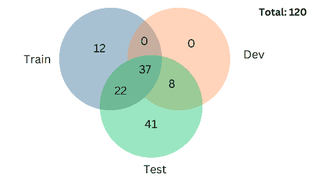
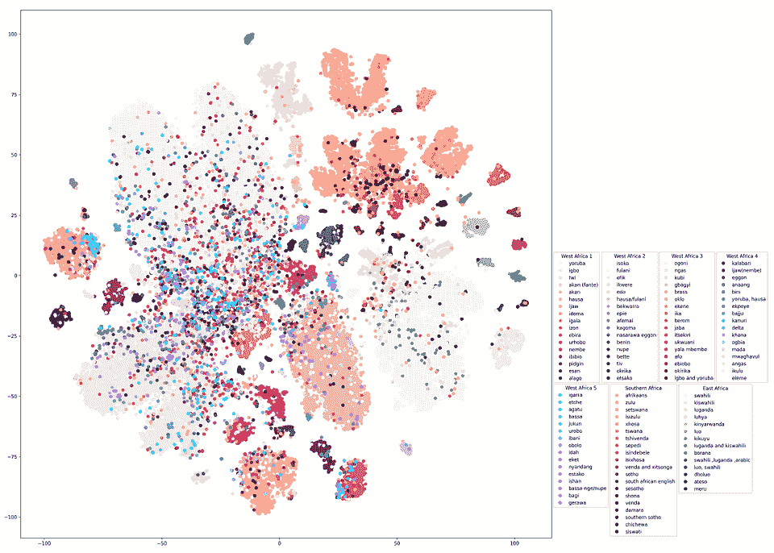
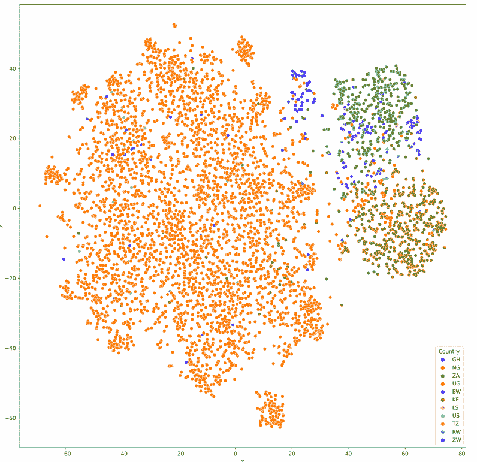
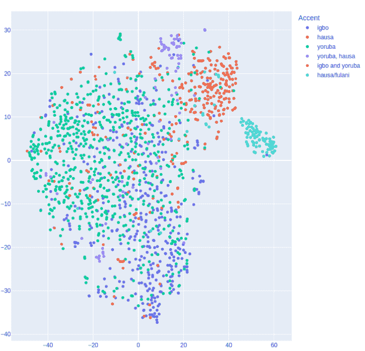
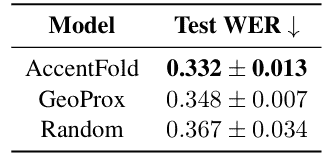
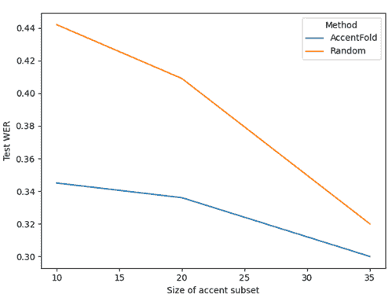

# AccentFold 综述：非洲 ASR 领域最重要的论文之一

> 原文：[`towardsdatascience.com/a-review-of-accentfold-one-of-the-most-important-papers-on-african-asr/`](https://towardsdatascience.com/a-review-of-accentfold-one-of-the-most-important-papers-on-african-asr/)

我真的很喜欢阅读这篇论文，不是因为之前见过一些作者🫣，而是因为它感觉**很有必要**。到目前为止，我写的关于大多数论文都已经在更广泛的 ML 社区中引起了波澜，这很好。然而，这篇论文却毫不掩饰地具有非洲特色（即它解决了一个非常非洲的问题），我认为每个非洲 ML 研究人员，尤其是那些对语音感兴趣的，都应该阅读它。

AccentFold 解决了一个我们许多人都能感同身受的具体问题：当前的 ASR 系统对非洲口音的英语处理得并不好。而这并不是因为尝试得不够。

大多数现有方法使用多任务学习、领域自适应或有限数据的微调等技术，但它们都遇到了相同的障碍：非洲口音在数据集中代表性不足，为每种口音收集足够的数据既昂贵又不太现实。

以尼日利亚为例。我们拥有数百种地方语言，许多人从小讲多种语言。因此，当我们说英语时，口音会受到我们的地方语言如何与之互动的影响——通过发音、节奏，甚至是在句子中间切换。在整个非洲，这种复杂性只会加剧。

与追逐更多数据不同，这篇论文提出了一种更聪明的解决方案：它引入了**AccentFold**，一种从超过 100 种非洲口音中学习口音嵌入的方法。这些嵌入捕捉了深层的语言关系（语音学、句法、形态学），并帮助 ASR 系统泛化到他们从未见过的口音。

单就这个想法而言，这篇论文就做出了如此重要的贡献。

### 相关工作

在这一部分，我发现作者如何将他们的工作定位在最近的语言模型探查进展中是很有趣的。先前的研究表明，像 DeepSpeech 和 XLSR 这样的预训练语音模型已经在它们的嵌入中捕捉到了语言或口音特定的信息，即使没有明确为此进行训练。研究人员已经利用这一点来分析语言变化、检测方言，并使用有限的标记数据改进 ASR 系统。

AccentFold 基于这个想法，但更进一步。最相关的现有工作也使用了模型嵌入来支持带口音的 ASR，但 AccentFold 在两个重要方面有所不同。

+   第一，作者们并没有仅仅分析嵌入，而是使用它们来指导训练子集的选择。这有助于模型泛化到之前未见过的口音。

+   第二，它们在更大的规模上运行，处理 41 种非洲英语口音。这几乎是先前努力的近两倍。

### 数据集

**图 1**。Venn 图显示了 AfriSpeech-200 中的 120 种口音如何在训练、开发和测试集中划分。值得注意的是，41 种口音只出现在测试集中，这对于评估零样本泛化非常理想。*图片来自 Owodunni 等人（2024 年）。*

作者使用了**AfriSpeech 200**，这是一个包含 200 多个小时音频、120 种口音和 2000 多名独特说话者的泛非语音语料库。这篇论文的一位作者还帮助构建了这个数据集，我认为这真的很酷。据他们所说，这是迄今为止可用于 ASR 的非洲口音英语数据集中最多样化的。 

让我印象深刻的是数据集的划分。在 120 种口音中，**41 种只出现在测试集中**。这使得它非常适合评估零样本泛化。由于模型从未在这些口音上训练过，测试结果清楚地展示了它如何适应未见过的口音。

### AccentFold 是什么

正如我之前提到的，AccentFold 建立在使用**学习到的口音嵌入**来引导适应的想法之上。在进一步讨论之前，解释一下嵌入是什么很有帮助。**嵌入**是复杂数据的向量表示。它们以让我们比较不同输入的方式捕捉结构、模式和关系——在这种情况下，不同的口音。每种口音都表示为高维空间中的一个点，语言或地理上相关的口音往往彼此靠近。

使 AccentFold 有用的原因是它不需要显式的标签来知道哪些口音相似。模型通过嵌入学习这一点，这使得它能够推广到训练期间未见过的口音。

### AccentFold 的工作原理

它的工作方式相当简单。AccentFold 建立在名为 XLSR 的大型预训练语音模型之上。作者没有只在一个任务上对其进行训练，而是使用了多任务学习，这意味着模型被训练同时使用相同的输入做几件事情。它有三个头：

1.  一个用于语音识别的**ASR 头**，将语音转换为文本。这是使用 CTC 损失进行训练的，它有助于将音频与正确的单词序列匹配。

1.  一个用于预测说话者口音的**口音分类头**，使用交叉熵损失进行训练。

1.  一个用于识别音频是临床还是一般的**领域分类头**，也使用交叉熵进行训练，但在二进制设置中。

每个任务都有助于模型学习更好的口音表示。例如，尝试对口音进行分类教会模型识别人们说话的不同方式，这对于适应新口音至关重要。

训练后，模型通过平均编码器的输出为每种口音创建一个向量。这被称为平均池化，结果是口音嵌入。

当模型被要求转录它之前未见过的口音的语音时，它会找到具有相似嵌入的口音，并使用它们的数据来微调 ASR 系统。因此，即使没有来自目标口音的任何标记数据，该模型仍然可以适应。这就是 AccentFold 在零样本设置中工作的原因。

### AccentFold 捕获了哪些信息

本文的这一部分探讨了口音嵌入实际上在学什么。通过一系列 tSNE 图，作者探讨了 AccentFold 是否捕捉到了语言、地理和社会语言结构。坦白说，视觉效果已经说明了一切。

1.  **聚类形成，但并非随机**

**图 2.** *AccentFold 中口音嵌入的 t-SNE 可视化，按地区着色。出现了明显的聚类，尤其是西非和南非口音，这表明模型捕捉到了区域相似性。* *图片来自 Owodunni 等人 (2024)。*

在图 2 中，每个点都是一个口音嵌入，按地区着色。你立刻会注意到点并不是随机分布的。来自同一地区的口音往往聚集在一起。例如，左侧的粉红色聚类代表 *西非* 口音，如 *约鲁巴语、伊博语、豪萨语和蒂威语*。右上角的橙色聚类代表 *南非* 口音，如 *祖鲁语、科萨语和茨瓦纳语*。

重要的是，不仅仅是聚类形成，还有它们形成的紧密程度。一些聚类密集且紧凑，表明内部相似性。其他聚类则更分散。南非班图语口音非常紧密地分组，这表明内部一致性很强。西非聚类更广泛，可能反映了西非英语的变体，即使在像尼日利亚这样的单一国家内部也是如此。

2. **地理不仅仅是视觉的。它是空间的**

**图 3.** *按国家划分的口音嵌入的 t-SNE 可视化。尼日利亚口音（橙色）形成一个密集的核心，而肯尼亚、乌干达和加纳口音则分别聚类。位置反映了潜在的地理和语言关系。* *图片来自 Owodunni 等人 (2024)。*

图 3 显示了按国家标记的嵌入。橙色显示的尼日利亚口音形成一个密集的核心。蓝色附近的加纳口音，而肯尼亚和乌干达口音在向量空间中似乎离它们很远。

其中还有一些细微差别。既有法语又有英语影响的卢旺达位于聚类之间。它并不完全与东非或西非嵌入对齐。这反映了其混合的语言身份，并表明模型正在学习一些真实的东西。

3. **双重口音位于两者之间**

**图 4。** *双口音嵌入位于单口音集群之间。例如，同时具有伊博和约鲁巴口音的说话者位于蓝色伊博集群和橙色约鲁巴集群之间。这表明 AccentFold 捕捉到了渐变关系，而不仅仅是离散类别。* *图片来自 Owodunni 等人（2024）。*

图 4 显示了报告双重口音的说话者的嵌入。将自身识别为伊博和约鲁巴的说话者位于蓝色伊博集群和橙色约鲁巴集群之间。甚至更独特的组合，如约鲁巴和豪萨，也位于中间。

这表明 AccentFold 不仅是在分类口音，它还在学习它们之间的关系。该模型将口音视为一种连续和关系性的东西，这正是好的嵌入应该做到的。

4. **语言家族得到加强，有时受到挑战**

在图 9 中，嵌入根据语言家族着色。大多数尼日尔刚果语形成一个大集群，正如预期的那样。但在图 10 中，其中口音根据家族和地区分组，出现了一些意想不到的情况。加纳库瓦口音被放置在南非班图口音附近。

这挑战了像 Ethnologue 这样的分类系统中的常见假设。AccentFold 可能正在捕捉到传统标签无法捕捉到的音韵或形态相似性。

5. **口音嵌入可以帮助修正标签**

作者还展示了嵌入可以清理错误标记或模糊不清的数据。例如：

+   十一个尼日利亚说话者将他们的口音标记为英语，但他们的嵌入与当地口音贝罗姆聚类在一起。

+   二十个说话者将他们的口音标记为皮钦语，但被放置在伊博、伊比比奥和埃菲克附近。

这意味着 AccentFold 不仅在学习哪些口音存在，还在纠正嘈杂或模糊的输入。这对于现实世界的数据集特别有用，因为用户经常自我报告不一致。

### 评估 AccentFold：你应该选择哪些口音

这一节是我最喜欢的部分，因为它提出了一个非常实际的问题。如果你想要为一个新的口音构建一个 ASR 系统，但没有该口音的数据，你应该使用哪些口音来训练你的模型？

假设你正在针对阿凡特口音。你没有来自阿凡特说话者的标记数据，但你确实有一批来自其他口音的语音数据。让我们称这个池为 A。由于时间、预算和计算等资源限制，你只能从 A 中选择 s 个口音来构建你的微调数据集。在他们的实验中，他们把 s 定为 20，这意味着 20 个口音被用来训练每个目标口音。因此，问题变成了：你应该选择哪 20 个口音来帮助你的模型在阿凡特口音上表现良好？

#### 设置：他们如何评估

为了测试这一点，作者使用 Afrispeech 200 数据集中的 41 个目标口音模拟了设置。这些口音没有出现在训练或开发集中。对于每个目标口音，他们：

+   使用三种策略之一从 A 中选择 s 个口音的子集

+   仅使用那些 s 个音标的数据微调预训练的 XLS R 模型

+   在该目标音标的测试集上评估模型

+   报告平均 10 个 epoch 的词错误率（WER）

所有实验的测试集相同，包括 Afrispeech 200 测试分割中的 108 个音标。这确保了每种策略对新音标的泛化能力的公平比较。

作者测试了三种选择训练音标的方法：

1.  **随机抽样**：从 A 中随机选择 s 个音标。这种方法简单但缺乏指导。

1.  **GeoProx**：根据地理位置选择音标。他们使用 geopy 找到最接近目标国家的国家，并从那里选择音标。

1.  **AccentFold**：使用学习到的音标嵌入来选择与目标在表示空间中最相似的 s 个音标。

表 1 显示，AccentFold 在所有 41 个目标音标中都优于 GeoProx 和随机抽样。

**表 1**。*41 个分布外音标的测试词错误率（WER）。AccentFold 在错误率和方差方面优于 GeoProx 和随机抽样，突显了其在零样本 ASR 中的可靠性和有效性。* *表来自 Owodunni 等人（2024）。*

这相对于随机选择在词错误率（WER）上提高了约 3.5%，这对于低资源 ASR 来说意义重大。AccentFold 还具有更低的方差，意味着它表现得更一致。随机抽样具有最高的方差，使其可靠性较低。

#### 更多数据是否有助于

这篇论文提出了一个经典的机器学习问题：随着你添加更多的训练数据，性能是否会持续提升？

**图 5**。*不同训练子集大小的测试 WER。性能随着音标的增加而提高，但大约在 25 个音标后达到平台期，表明智能选择比数量本身更重要。* *图来自 Owodunni 等人（2024）。*

图 5 显示，随着 s 的增加，WER 有所提高，但仅限于一定程度。大约在 20 到 25 个音标后，性能趋于平稳。

因此，更多的数据有助于，但仅限于一定程度。最重要的是使用正确的数据。

### 关键要点

+   AccentFold 解决了一个真实的非洲问题：由于数据有限且不平衡，ASR 系统通常在非洲口音的英语上失败。

+   论文介绍了音标嵌入，它能够捕捉语言和地理相似性，而无需从目标音标获取标记数据。

+   它将子集选择问题形式化：给定一个没有数据的新音标，你应该在哪些其他音标上训练以获得最佳结果？

+   测试了三种策略：随机抽样、地理邻近性和使用嵌入相似性的 AccentFold。

+   AccentFold 在所有基线中表现最佳，具有更低的词错误率和更一致的结果

+   嵌入相似度胜过地理。在嵌入空间中，最接近的音标并不总是地理位置上接近的，但它们更有帮助。

+   更多数据只能帮助到一定程度。性能最初会提升，但最终会趋于平稳。你不需要所有数据，只需要正确的重点。

+   嵌入可以帮助清理噪声或错误标记的数据，提高数据集质量。

+   局限性：结果基于一个预训练模型。未测试对其他模型或语言的泛化。

+   虽然这项工作专注于非洲口音，但其核心方法——从模型已知的内容中学习——可以启发更多适用于资源匮乏环境中的适应方法。

**来源说明：**

本文总结了 Owodunni 等人（2024）发表的论文《AccentFold：通过非洲口音实现零样本 ASR 针对目标口音的适应之旅》的研究发现。图表和见解来源于原始论文，可在[`arxiv.org/abs/2402.01152`](https://arxiv.org/abs/2402.01152)找到。
