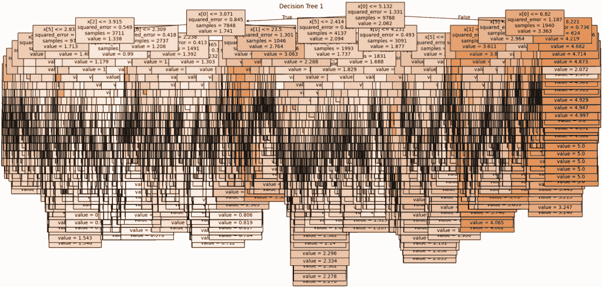
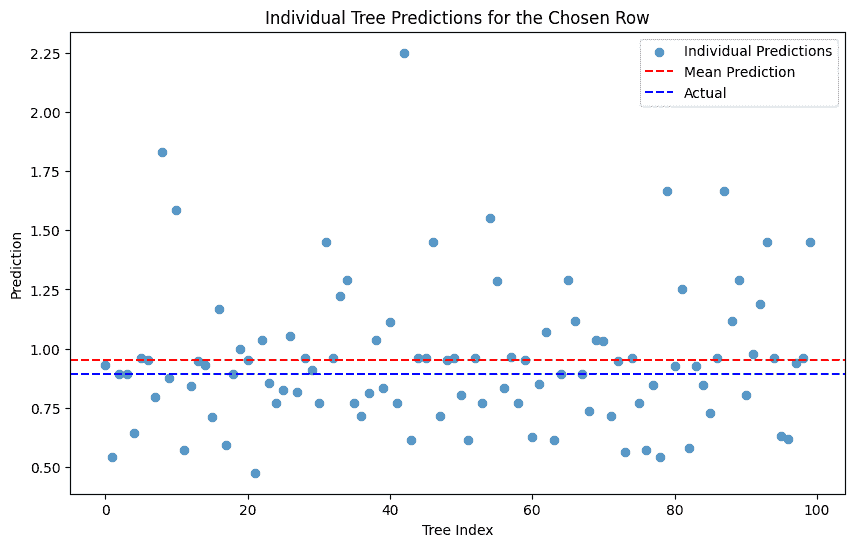
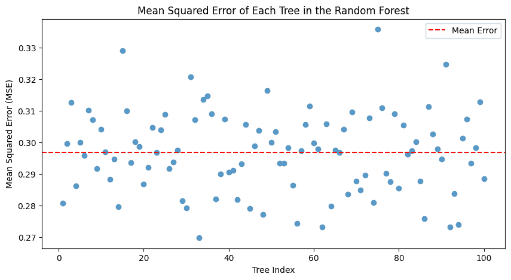
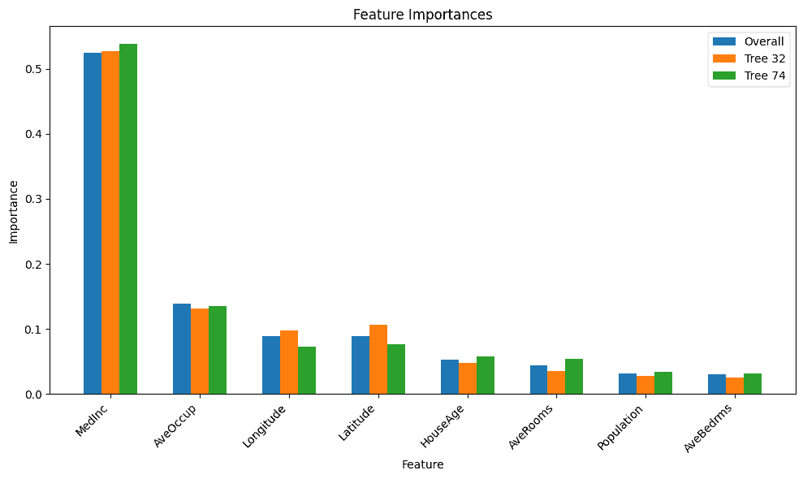
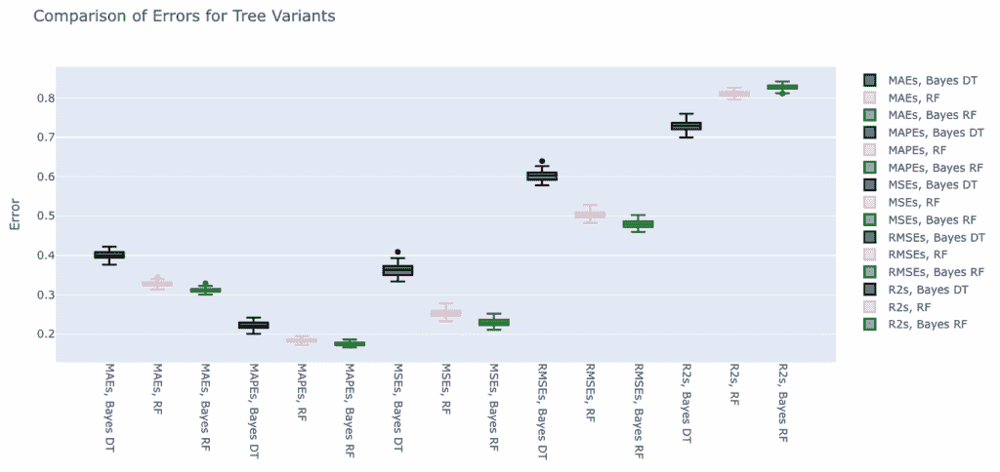

# 随机森林超参数调优的视觉指南

> 原文：[`towardsdatascience.com/a-visual-guide-to-tuning-random-forest-hyperparameters/`](https://towardsdatascience.com/a-visual-guide-to-tuning-random-forest-hyperparameters/)

## <mdspan datatext="el1756964008715" class="mdspan-comment">介绍</mdspan>

在我的[上一篇文章](https://towardsdatascience.com/visualising-decision-trees/)中，我研究了不同超参数对决策树的影响，包括它们的性能和视觉表现。

因此，下一步自然就是使用`sklearn.ensemble.RandomForestRegressor`的随机森林。

同样，我不会深入解释随机森林的工作原理，比如自助法、特征选择和多数投票等区域。本质上，随机森林是由大量树共同工作（因此称为森林），这是我们关心的全部。

我将使用相同的数据（通过 scikit-learn 的加利福尼亚住房数据集，CC-BY）和相同的一般过程，所以如果你还没有看过我之前的帖子，我建议先阅读那个帖子，因为它介绍了我这里使用的一些函数和指标。

代码与之前相同：[`github.com/jamesdeluk/data-projects/tree/main/visualising-trees`](https://github.com/jamesdeluk/data-projects/tree/main/visualising-trees)

如前所述，以下所有图像均由我创建。

## 一个基本的森林

首先，让我们看看一个基本的随机森林的表现如何，即`rf = RandomForestRegressor(random_state=42)`。默认模型具有无限制的最大深度，和 100 棵树。使用平均十次的方法，它花费了大约 6 秒来拟合，大约 0.1 秒来预测——鉴于它是一个森林而不是一棵树，它花费了 50 到 150 倍的时间也不足为奇。那么分数是多少呢？

| 指标 | max_depth=None |
| --- | --- |
| **MAE** | 0.33 |
| **MAPE** | 0.19 |
| **MSE** | 0.26 |
| **RMSE** | 0.51 |
| **R²** | 0.80 |

它预测了我选择的行的值为 0.954，与实际值 0.894 相比。

是的，开箱即用的随机森林比我在上一篇文章中的贝叶斯搜索调整决策树表现更好！

## 可视化

有几种方式可以可视化随机森林，例如树、预测和误差。还可以使用特征重要性来比较森林中的单个树。

**单个树绘图**

很明显，你可以绘制单个决策树。它们可以通过`rf.estimators_`访问。例如，这是第一个：



这棵树的深度为 34，有 9,432 个叶子节点和 18,863 个节点。而这个随机森林有 100 棵类似的树！

**单个预测**

我喜欢的一种可视化随机森林的方式是绘制每棵树的单独预测。例如，我可以使用`[tree.predict(chosen[features].values) for tree in rf.estimators_]`为我选择的行进行操作，并在散点图上绘制结果：



提醒一下，真实值是 0.894。你可以很容易地看到，虽然有些树的预测偏差很大，但所有预测的平均值相当接近——类似于中心极限定理（CLT）。这是我最喜欢的观察随机森林魔力的方式。

**个别误差**

进一步来说，你可以遍历所有树，让它们对整个数据集进行预测，然后计算误差统计量。在这个例子中，对于 MSE：



平均 MSE 为~0.30，略高于整体随机森林——再次显示出森林相对于单棵树的优点。最好的树是编号 32，MSE 为 0.27；最差的，编号 74，为 0.34——尽管仍然相当不错。它们的深度都是 34±1，有约 9400 个叶子节点和约 18000 个节点——所以，在结构上非常相似。

**特征重要性**

显然，如果展示所有树的话，图表会很难看，所以这里展示的是整个森林的重要性，包括最好和最差的树：



最好和最差的树对于不同特征的重要性仍然相似——尽管顺序不一定相同。根据这个分析，中位数收入是最重要的因素。

## 超参数调整

适用于单个决策树的超参数当然也适用于由决策树组成的随机森林。为了比较，我创建了一些 RF，其值与之前文章中使用的值相同：

| **指标** | max_depth=3 | ccp_alpha=0.005 | min_samples_split=10 | min_samples_leaf=10 | max_leaf_nodes=100 |
| --- | --- | --- | --- | --- | --- |
| **拟合时间（秒）** | 1.43 | 25.04 | 3.84 | 3.77 | 3.32 |
| **预测时间（秒）** | 0.006 | 0.013 | 0.028 | 0.029 | 0.020 |
| **MAE** | 0.58 | 0.49 | 0.37 | 0.37 | 0.41 |
| **MAPE** | 0.37 | 0.30 | 0.22 | 0.22 | 0.25 |
| **MSE** | 0.60 | 0.45 | 0.29 | 0.30 | 0.34 |
| **RMSE** | 0.78 | 0.67 | 0.54 | 0.55 | 0.58 |
| **R²** | 0.54 | 0.66 | 0.78 | 0.77 | 0.74 |
| **选择的预测** | 1.208 | 1.024 | 0.935 | 0.920 | 0.969 |

我们首先看到的是——没有一种表现优于默认的树（`max_depth=None`）。这与单个决策树不同，有约束的决策树表现更好——再次证明了 CLT（中心极限定理）驱动的非完美森林相对于一棵“完美”树的强大之处。然而，与之前类似，`ccp_alpha`需要很长时间，浅层树相当糟糕。

除了这些，RF（随机森林）还有一些 DT（决策树）没有的超参数。其中最重要的一个是`n_estimators`——换句话说，就是树的数量！

**n_jobs**

但首先，`n_jobs`。这是并行运行的工作数量。并行处理通常比串行/顺序处理更快。得到的随机森林将相同，具有相同的错误等得分（假设`random_state`已设置），但应该更快完成！为了测试这一点，我在默认的随机森林中添加了`n_jobs=-1`——在这个上下文中，`-1`表示“所有”。

记得默认模型拟合需要近 6 秒，预测需要 0.1 秒吗？并行化后，拟合只需 1.1 秒，预测只需 0.03 秒——提高了 3~6 倍。我肯定会从现在开始这样做！

**n_estimators**

好的，回到树的数量的讨论。默认的随机森林有 100 个估计器；让我们尝试 1000 个。正如预期的那样，它花费了大约 10 倍的时间（并行化后拟合需要 9.7 秒，预测需要 0.3 秒），得分是多少？

| 指标 | n_estimators=1000 |
| --- | --- |
| **MAE** | 0.328 |
| **MAPE** | 0.191 |
| **MSE** | 0.252 |
| **RMSE** | 0.502 |
| **R²** | 0.807 |

差别非常小；MSE 和 RMSE 降低了 0.01，而 R²提高了 0.01。所以更好，但值得 10 倍的时间投资吗？

让我们进行交叉验证，只是为了检查一下。

我将不再使用我的自定义循环，而是使用`sklearn.model_selection.cross_validate`，如前一篇帖子中提到的：

```py
cross_validate(
    rf, X, y,
    cv=RepeatedKFold(n_splits=5, n_repeats=20, random_state=42),
    n_jobs=-1,
    scoring={
        "neg_mean_absolute_error": "neg_mean_absolute_error",
        "neg_mean_absolute_percentage_error": "neg_mean_absolute_percentage_error",
        "neg_mean_squared_error": "neg_mean_squared_error",
        "root_mean_squared_error": make_scorer(
            lambda y_true, y_pred: np.sqrt(mean_squared_error(y_true, y_pred)),
            greater_is_better=False,
        ),
        "r2": "r2",
    },
) 
```

我使用`RepeatedKFold`作为拆分策略，这比`KFold`更稳定但速度较慢；由于数据集不是很大，我对额外花费的时间不太关心。

由于没有标准的 RMSE 评分器，所以我必须使用`sklearn.metrics.make_scorer`和一个 lambda 函数来创建一个。

对于决策树，我进行了 1000 次循环。然而，考虑到默认的随机森林包含 100 棵树，1000 次循环将会有很多树，因此会花费很多时间。我将尝试 100 次（20 次重复的 5 次拆分）——仍然很多，但多亏了并行化，它并没有“太”糟糕——100 棵树的版本花费了 2 分钟（1304 秒的非并行化时间），而 1000 棵树的版本花费了 18 分钟（10254 秒！）几乎所有的核心都在 100%的 CPU 使用率，而且变得非常热——我的 MacBook 风扇通常不会开启，但这次它们达到了最大负荷！

他们如何比较？100 棵树的模型：

| 指标 | 平均值 | 标准差 |
| --- | --- | --- |
| MAE | -0.328 | 0.006 |
| MAPE | -0.184 | 0.005 |
| MSE | -0.253 | 0.010 |
| RMSE | -0.503 | 0.009 |
| R² | 0.810 | 0.007 |

以及 1000 棵树的模型：

| 指标 | 平均值 | 标准差 |
| --- | --- | --- |
| MAE | -0.325 | 0.006 |
| MAPE | -0.183 | 0.005 |
| MSE | -0.250 | 0.010 |
| RMSE | -0.500 | 0.010 |
| R² | 0.812 | 0.006 |

差别非常小——可能不值得额外的时间和电力。

## 贝叶斯搜索

最后，让我们进行贝叶斯搜索。我使用了广泛的超参数范围。

```py
search_spaces = {
    'n_estimators': (50, 500),
    'max_depth': (1, 100),
    'min_samples_split': (2, 100),
    'min_samples_leaf': (1, 100),
    'max_leaf_nodes': (2, 20000),
    'max_features': (0.1, 1.0, 'uniform'),
    'bootstrap': [True, False],
    'ccp_alpha': (0.0, 1.0, 'uniform'),
}
```

我们之前还没有看到的一个超参数是`bootstrap`；这决定了在构建树时是否使用整个数据集，或者使用基于 bootstrap（有放回抽样）的方法。通常情况下，这个参数设置为`True`，但让我们也尝试一下`False`。

我进行了 200 次迭代，耗时 66 分钟（!!!）。结果是：

```py
Best Parameters: OrderedDict({
    'bootstrap': False,
    'ccp_alpha': 0.0,
    'criterion': 'squared_error',
    'max_depth': 39,
    'max_features': 0.4863711682589259,
    'max_leaf_nodes': 20000,
    'min_samples_leaf': 1,
    'min_samples_split': 2,
    'n_estimators': 380
})
```

看一下`max_depth`与上面简单的那些相似，但`n_estimators`和`max_leaf_nodes`都非常高（注意`max_leaf_nodes`不是实际叶子节点的数量，只是允许的最大值；平均叶子节点数为 14,954）。`min_samples_`都是最小值——与我们之前比较受约束的森林和不受约束的森林时相似。而且它没有进行自助采样也很有趣。

这给我们带来了什么（快速测试，而不是交叉验证）？

| 指标 | 值 |
| --- | --- |
| MAE | 0.313 |
| MAPE | 0.181 |
| MSE | 0.229 |
| RMSE | 0.478 |
| R² | 0.825 |

目前为止最好的，尽管只是刚刚好。为了保持一致性，我也进行了交叉验证：

| 指标 | 平均值 | 标准差 |
| --- | --- | --- |
| MAE | -0.309 | 0.005 |
| MAPE | -0.174 | 0.005 |
| MSE | -0.227 | 0.009 |
| RMSE | -0.476 | 0.010 |
| R² | 0.830 | 0.006 |

它的表现非常好。比较最佳决策树（贝叶斯搜索树）、默认 RF 和贝叶斯搜索 RF 的绝对误差，我们得到：



## 结论

在上一篇文章中，贝叶斯决策树看起来很好，特别是与基本决策树相比；现在它看起来很糟糕，误差更高，R²更低，方差更广！那么为什么不用随机森林呢？

好吧，随机森林确实需要更长的时间来拟合（和预测），而且随着数据集的增大，这种情况变得更加明显。在一个拥有数百棵树和数百万行数据以及数百个特征的森林上进行数千次调整迭代……即使有并行化，也可能需要很长时间。这也清楚地说明了为什么专门从事并行处理的 GPU 对于机器学习变得至关重要。即便如此，你还得问自己——什么才算足够好？MAE（平均绝对误差）在 0.05 的改进对于你的用例来说真的重要吗？

当涉及到可视化时，就像决策树一样，绘制单个树可以是一个了解整体结构的好方法。此外，绘制单个预测和误差也是一个很好的方法，可以了解随机森林的方差，并更好地理解它们的工作原理。

但是还有更多的树形结构变体！接下来是梯度提升型。
