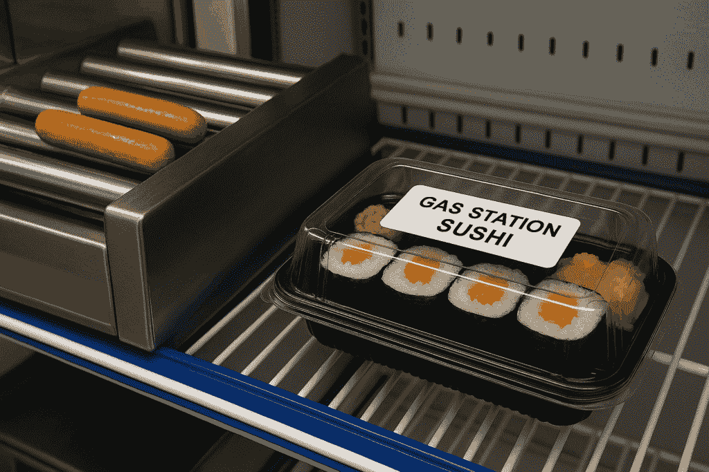
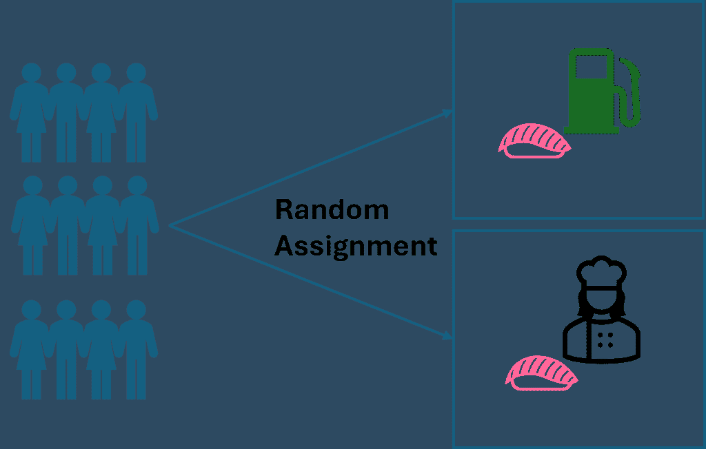
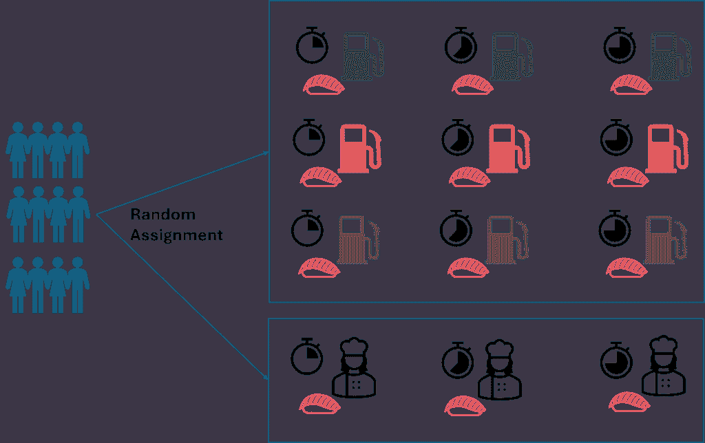
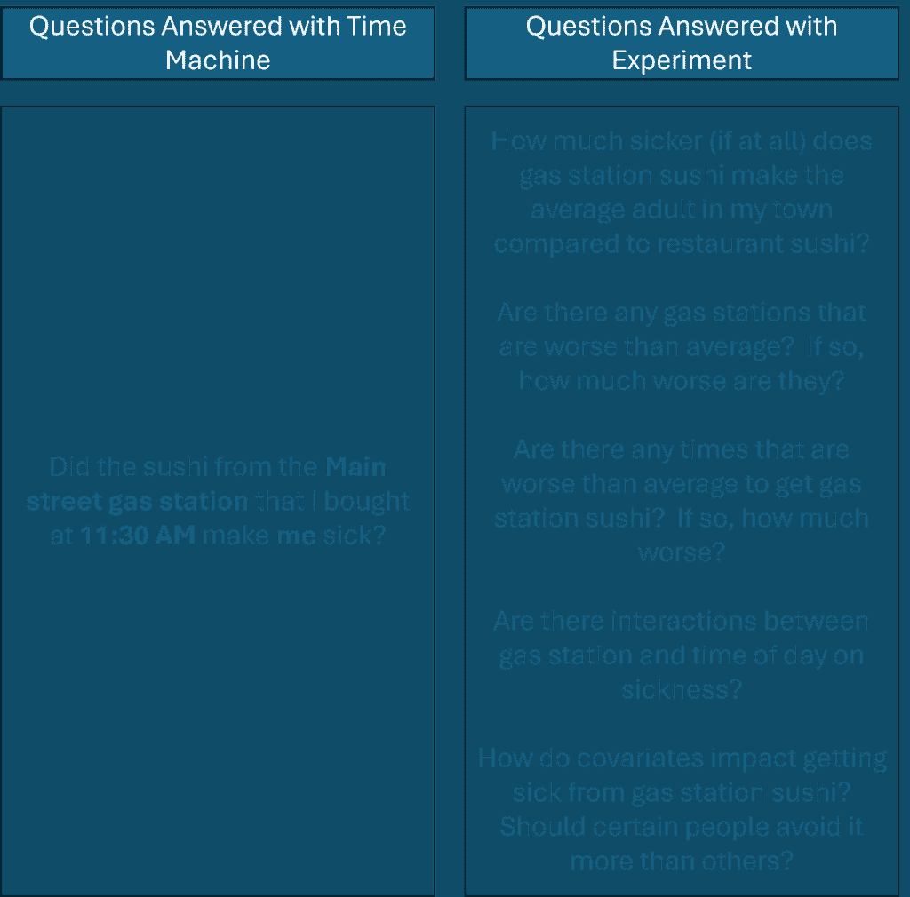

# 一个精心设计的实验能教会你比时光机还多的东西！

> 原文：[`towardsdatascience.com/a-well-designed-experiment-can-teach-you-more-than-a-time-machine/`](https://towardsdatascience.com/a-well-designed-experiment-can-teach-you-more-than-a-time-machine/)

<mdspan datatext="el1753238883859" class="mdspan-comment">如果你想</mdspan>揭示因果关系，停止尝试发明时光机，而是进行实验！理解因果关系提供了通过行动产生预期结果所需的知识。在这篇文章中，我将通过使用基于时光机的概念练习来展示实验设计的力量。我的目标是说服你，通过实验比使用时光机能学到更多关于因果关系的东西。

## 为什么时光机在因果思维实验中是有用的？

用时光机进行思维实验感觉荒谬，从许多方面来看确实如此。但它也有一个特性，使其在探索假设结果时变得有价值。时光机可以给我们一些在我们时间限制的状态下无法看到的东西——反事实。正如其名所示，反事实是未曾发生的事情。根据定义，它们是不可观察的，因为它们从未发生。反事实是不同情况下可能发生的事情。它们回答了像“如果我没吃那个加油站寿司，我会生病吗？”这样的问题。然而，如果我们有时光机，我们可以倒转时钟，做些不同的事情，看看会发生什么。在寿司的情况下，我可以重新开始这一天，不吃寿司，看看我是否还会生病。换句话说，我们可以观察那些原本不可观察的反事实。

由 DALL-E 生成

时光机学到的反事实可以与实际发生的事情进行比较（我想我们可以称之为“事实”……）以了解干预措施的影响。在我们的不幸的寿司例子中，我生病就是“事实”——它确实发生了。如果我有时光机，我可以倒流时间，不吃寿司，观察会发生什么，这就是反事实。然后我可以将事实与反事实进行比较，以建立因果关系。假设我回到了过去，除了吃寿司之外，我的一天保持不变。如果我还生病了（事实 = 反事实），我知道寿司并没有导致疾病，因为无论如何我都会生病。然而，如果我没有生病（事实 ≠ 反事实），那么我可以得出结论，寿司*导致了*我的疾病。有了时光机，为单个事件建立因果关系就会这么简单！

初看之下，我们的时光机似乎也是一个了不起的因果推断机！能够观察反事实情况将非常强大，但实际上，我们可以通过精心设计的实验做出更有用的因果推断。这真是太好了，因为时光机并不存在，但精心设计的实验确实存在！让我们深入了解精心设计的实验如何比使用时光机更好。

## 单个事件的因果关系不可推广

虽然时光机能回答许多由好奇心驱动的“如果”因果问题，但我们从观察反事实情况中获得的经验教训并不能推广到其他类似（但不同）的情况。在我的寿司例子中，我会通过了解寿司是否使我感到不适来满足我的好奇心——但我知道的知识对未来决策没有任何实用价值。我所知道的是，在那个具体的**那天**，在那个具体的**加油站**，在那个具体的**时间**，那特定的一次**供应**的寿司使我感到不适。我不知道如果改变任何粗体字的情况会发生什么。

通过设计实验，我们可以获得可推广的知识，这是时光机无法提供的。可推广的知识非常有用，因为它可以帮助我们在未来做出明智的决定！

想象一下，我进行了一个实验，随机分配多个勇敢的人吃加油站寿司或餐厅寿司。这个实验将告诉我平均而言，加油站寿司是否比餐厅寿司使人感到更不适。这已经比“时光机”方法有所改进，因为结果适用于我所抽取的人群，而不是只适用于我本人。 

简单的设计实验——图片由作者提供

但是，我可以在实验设计上更加聪明，以获取更多的知识！我不仅可以简单地让人们选择加油站或餐厅的寿司，我还可以指定人们在特定时间选择特定的加油站，或者在特定时间选择餐厅。通过添加这两个新变量（时间和加油站位置），我不仅可以了解加油站寿司是否更频繁地使人感到不适，我还可以了解我镇上提供寿司的三个加油站之间是否存在差异，以及一天中的时间是否也有影响。

一个设计实验的例子，测试不同时间不同加油站的寿司——图片由作者提供

在这个实验中，我并没有直接观察反事实情况，但随机分配有助于混淆因素平均化，因此我可以估计平均处理效应（ATE），几乎就像我可以观察反事实情况一样。

实验学习与我的时间机器学习有何不同？实验是（1）使用多个人，（2）多份寿司，（3）多个加油站和（4）一天中的多个时间。因此，我可以获得许多因果洞察，我和其他人都可以使用。例如，我会了解在我镇上，加油站寿司通常比餐厅寿司更容易让人生病。我还会了解有些加油站比其他加油站更容易让人生病，以及在某些时间购买寿司是否比其他时间更糟糕。这些知识可以帮助我和其他人做出未来的决策。这比知道某个加油站和某个时间点的寿司让我生病更有用！

除了我们可以控制的变量之外，我们还可以在我们的分析中包含协变量。协变量是我们无法控制但很重要的因素。在这个例子中，协变量可能包括以前的医疗状况或年龄。通过在分析中包含协变量，我们还可以了解协变量和治疗方法之间是否存在任何交互作用。

以下是对我们可以通过时间机器学习的内容和我们可以通过实验学习的内容的比较总结。

使用时间机器和实验可以学习的内容总结——作者提供

现在我们已经了解了我们可以通过实验理解到的丰富因果关系的深度，让我们过渡到讨论在实验下观察到的各种结果比单一结果（即时间机器运行中观察到的单一逆事实）更有力的原因。

## 设计的实验量化了因果关系；单一的逆事实则不能

对单一逆事实的直接观察并不能给出关于一般因果关系的强度任何想法。如果我生病一次后回到过去去测试寿司是否让我生病，我会知道它是，或者它没有导致我的疾病。我仍然不会知道如果我将来再次在加油站满足我的寿司渴望，我会生病的概率。它是决定性的，即我每次吃加油站寿司都会生病吗？它是概率性的，我会有一半的时间生病吗？我只是没有足够的信息来知道。

我们在前一节中设计的实验不仅可以帮助我们了解“是否”加油站寿司会让人生病，还可以帮助我们量化这种关系。例如，实验可能会发现，平均而言，吃加油站寿司的患病几率是餐厅寿司的五倍。

实验设计更好地概括，*并且*它也更好地量化了因果关系！如果我们回到过去看看一个逆事实，我们无法知道在类似条件下观察到相同结果的概率，但通过实验我们可以！

## 总结

我写这篇文章的目标是讨论即使我有时间机器可以观察反事实，我为什么仍然会使用实验设计来了解因果关系。

实验设计之所以更好，主要原因是：

+   它产生了可推广的因果学习（而不是针对一个特定案例）

+   它提供了关系的强度来指导未来的决策

我希望这个思想实验加深了你对于实验设计优势的理解！
