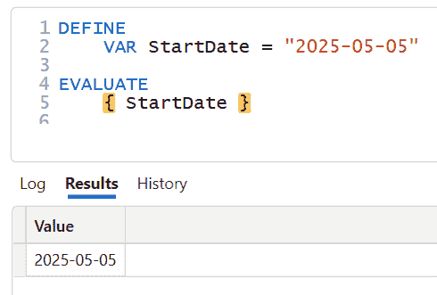
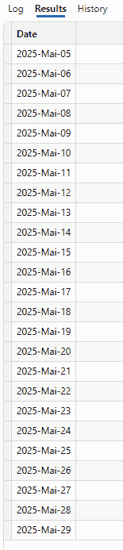
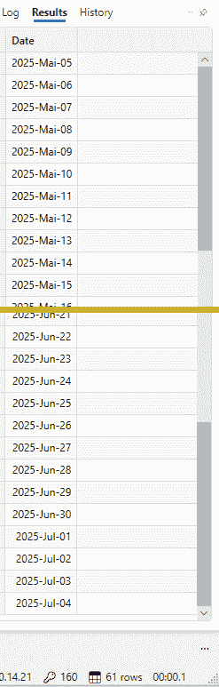
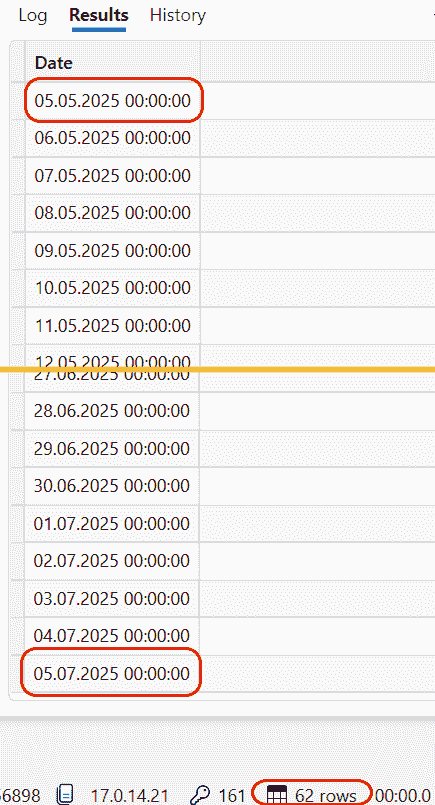
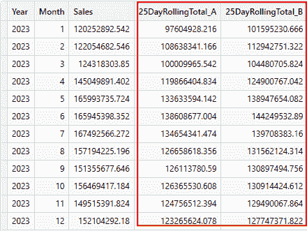

# 关于在 DAX 中计算日期范围

> 原文：[关于在 DAX 中计算日期范围](https://towardsdatascience.com/about-calculating-date-ranges-in-dax/)

## <mdspan datatext="el1747770331300" class="mdspan-comment">简介</mdspan>

在使用 Power BI 或在语义模型中的 Fabric 开发时间智能度量时，创建日期范围以计算特定时间框架的结果可能是必要的。

要精确一点，DAX 中几乎所有的时间智能函数都会为日期范围创建一个日期列表。

但有时我们必须根据特定要求创建自定义日期范围。

DAX 为我们提供了两个用于此任务的功能：

+   [`DATEINPERIOD()`](https://dax.guide/datesinperiod/)

+   [`DATESBETWEEN()`](https://dax.guide/datesbetween/)

这两个函数都接受开始日期作为参数。

但对于结束日期，行为不同。

而 `DATESINPERIOD()` 使用间隔（天数、月份、季度、年份），而 `DATESBETWEEN()` 使用指定的日期作为结束日期。

相比之下，[`DATEADD()`](https://dax.guide/dateadd/) 使用当前筛选上下文来获取开始日期并计算结束日期。

但我们希望传递一个开始日期，它可能不同于当前筛选上下文中的日期（s）。

这时，上述提到的某个函数就派上用场了。

在本文末尾，我将通过使用这里展示的技术展示一个实际示例。

## 工具和场景

像在许多其他文章中一样，我使用 DAX Studio 编写 DAX 查询并分析结果。

如果你不太熟悉编写 DAX 查询，请阅读我关于如何学习编写此类查询的文章：

> [如何使用 DAX 为表格模型编写查询](https://towardsdatascience.com/601823-2/)

这次，我只使用数据模型中的日期表。

我想计算从 2025 年 5 月 5 日开始，25 天或 2 个月后的日期范围。

要设置开始日期，我使用这个表达式：

```py
DEFINE
    VAR StartDate = "2025-05-05"

EVALUATE
       { StartDate }
```

这是 DAX Studio 中的结果：



图 1 – DAX Studio 中的查询和结果（图由作者提供）

我定义了一个变量，并将日期表达式的结果分配给后续的查询。

另一种定义开始日期的方法是使用 `DATE(2025, 05, 05)` 创建一个日期值。

结果将相同。

这两种方法之间的区别在于，第一种返回一个字符串，但第二种返回一个正确的日期。

这里使用的 DAX 函数可以与两者一起工作。

## 使用 DATESINPERIOD()

让我们从 `DATEINPERIOD()` 开始。

我将使用此函数从开始日期和未来 25 天获取日期范围字符串：

```py
DEFINE
    VAR StartDate = "2025-05-05"

EVALUATE
    DATESINPERIOD('Date'[Date]
                    ,StartDate
                    ,25
                    ,DAY)
```

结果是一个包含从 2025 年 5 月 5 日到 2025 年 5 月 29 日的 25 行天的表格：



图 2 – 使用 DATESINPERIOD() 计算的 25 天（图由作者提供）

现在，让我们稍微改变查询，以获取从开始日期到未来 2 个月的日期列表：

```py
DEFINE
    VAR StartDate = "2025-05-05"

EVALUATE
    DATESINPERIOD('Date'[Date]
                    ,StartDate
                    ,2
                    ,MONTH)
```

查询从 2025 年 5 月 5 日开始返回 61 行，直到 2025 年 7 月 4 日：



图 3 – 使用 DATESINPERIOD() 生成的 2 个月的日期（图由作者绘制）

我可以用任意数量的天数（例如，14、28、30 或 31 天）传递间隔，函数会自动计算日期范围。

当我传递负数时，日期范围会到过去，从起始日期开始。

## 使用 DATESBETWEEN()

现在，让我们看看 `DATESBETWEEN()`。

`DATESBETWEEN()` 以起始日期和结束日期作为参数。

这意味着我必须在使用它之前计算结束日期。

当我想从 2025 年 5 月 5 日到 2025 年 5 月 29 日获取日期范围时，我必须使用以下查询：

```py
DEFINE
    VAR StartDate = "2025-05-05"

    VAR EndDate = "2025-05-25"

EVALUATE        
    DATESBETWEEN('Date'[Date]
                    ,StartDate
                    ,EndDate)
```

结果与 `DATESINPERIOD()` 相同。

然而，有一个关键点：结束日期包含在结果中。

这意味着我可以写一些像这样的事情来获取从 2025 年 5 月 5 日到 2025 年 7 月 5 日的两个月日期范围：

```py
DEFINE
    VAR StartDate = "2025-05-05"

    VAR EndDate = "2025-07-05"

EVALUATE        
    DATESBETWEEN('Date'[Date]
                    ,StartDate
                    ,EndDate)
```

结果与使用 `DATESINPERIOD()` 和月份作为间隔的结果非常相似，但多一行：



图 4 – 两个月日期范围加一行结果（图由作者绘制）

这使我能够更灵活地创建日期范围，因为我可以根据我的需求预先计算结束日期。

## 在度量中使用 – 一个实际例子。

我可以使用这些方法在度量中计算一个累计总和。

但我们必须注意正确地使用这两个函数。

例如，为了计算 25 天的每月累计总和。

看看以下代码，其中我定义了两个使用两个函数的度量：

```py
DEFINE
    MEASURE 'All Measures'[25DayRollingTotal_A] =
        VAR DateRange =
            DATESINPERIOD('Date'[Date]
                            ,MIN ( 'Date'[Date] )
                            ,25
                            ,DAY)

        RETURN
            CALCULATE ( [Sum Online Sales]
                        , DateRange )

    MEASURE 'All Measures'[25DayRollingTotal_B] =
        VAR DateRange =
            DATESBETWEEN ( 'Date'[Date]
                            ,MIN ( 'Date'[Date] )
                            ,MIN ( 'Date'[Date] ) + 25 )

        RETURN
            CALCULATE ( [Sum Online Sales]
                        , DateRange )

EVALUATE
CALCULATETABLE (
    SUMMARIZECOLUMNS (
        'Date'[Year]
        ,'Date'[Month]
        ,"Sales", [Sum Online Sales]
        ,"25DayRollingTotal_A", [25DayRollingTotal_A]
        ,"25DayRollingTotal_B", [25DayRollingTotal_B]
        )
        ,'Date'[Date] >= DATE(2023, 01, 01) && 'Date'[Date] <= DATE(2023, 12, 31)
)
ORDER BY 'Date'[Month]
```

这是结果：



图 5 – 使用两个函数计算 25 天滚动总计数的结果（图由作者绘制）

注意两个结果之间的差异。

这是因为 `DATESBETWEEN()` 包含了结束日期在结果中，而 `DATESINPERIOD()` 将间隔数量加到起始日期上，但包括起始日期。

用以下查询尝试一下：

```py
DEFINE
    VAR StartDate = DATE(2025,05,05)

    VAR EndDate = StartDate + 25

EVALUATE
    DATESINPERIOD('Date'[Date]
                    ,StartDate
                    ,25
                    ,DAY)

EVALUATE        
    DATESBETWEEN('Date'[Date]
                    ,StartDate
                    ,EndDate)
```

第一个返回 25 行（2025 年 5 月 5 日至 2025 年 5 月 29 日）和第二个返回 26 行（2025 年 5 月 5 日至 2025 年 5 月 30 日）。

因此，我必须更改这两个度量中的一个来得到相同的结果。

在这种情况下，计算定义是从第一个日期开始，向前 25 天。

校正后的逻辑如下：

```py
DEFINE
    MEASURE 'All Measures'[25DayRollingTotal_A] =
        VAR DateRange =
            DATESINPERIOD('Date'[Date]
                            ,MIN ( 'Date'[Date] )
                            ,25
                            ,DAY)

        RETURN
            CALCULATE ( [Sum Online Sales]
                        , DateRange )

    MEASURE 'All Measures'[25DayRollingTotal_B] =
        VAR DateRange =
            DATESBETWEEN ( 'Date'[Date]
                            ,MIN ( 'Date'[Date] )
                            ,MIN ( 'Date'[Date] ) + 24 )  // 24 instead of 25 days

        RETURN
            CALCULATE ( [Sum Online Sales]
                        , DateRange )

EVALUATE
CALCULATETABLE (
    SUMMARIZECOLUMNS (
        'Date'[Year]
        ,'Date'[Month]
        ,"Sales", [Sum Online Sales]
        ,"25DayRollingTotal_A", [25DayRollingTotal_A]
        ,"25DayRollingTotal_B", [25DayRollingTotal_B]
        )
        ,'Date'[Date] >= DATE(2023, 01, 01) && 'Date'[Date] <= DATE(2023, 12, 31)
)
ORDER BY 'Date'[Month]
```

现在，这两个度量返回相同的结果：


图 6 – 校正后的度量结果（图由作者绘制）

我测试了这两个函数在相同计算（25 天的滚动总计数）上的性能，结果相同。在这些两个之间没有性能或效率的差异。

即使执行计划也是相同的。

这意味着 `DATEINPERIOD()` 是 `DATESBETWEEN()` 的一个快捷函数。

## 结论

从功能角度来看，这两个显示的函数几乎是等效的。

从性能角度来看，也是如此。

它们在定义结束日期的方式上有所不同。

`DATESINPERIOD()`基于日历间隔，如天、月、季度和年。

当需要基于日历来计算日期范围时，会使用此函数。

但当我们有一个预定义的结束日期或者必须计算两个预定义日期之间的日期范围时，应该使用`DATESBETWEEN()`函数。

例如，我在进行时间智能计算时使用`DATESBETWEEN()`。

您可以通过阅读这篇文章来了解更多关于周计算的信息：

> [考虑性能的 DAX 高级时间智能](https://towardsdatascience.com/advanced-time-intelligence-in-dax-with-performance-in-mind/)

正如您所读到的，我在数据表的每一行中存储了每周的开始和结束日期。

这样，我可以轻松地查找每个日期的开始和结束日期。

因此，当我们必须在这两个函数之间进行选择时，这并不是功能问题，而是新报告的受益者或所需数据分析的需求定义的问题。

# 参考文献

阅读这篇文章来学习如何使用 DAX Studio 收集和解释性能数据：

> [如何使用 DAX Studio 从 Power BI 获取性能数据](https://towardsdatascience.com/how-to-get-performance-data-from-power-bi-with-dax-studio/)

就像在我之前的文章中一样，我使用 Contoso 样本数据集。您可以从微软[这里](https://www.microsoft.com/en-us/download/details.aspx?id=18279)免费下载 ContosoRetailDW 数据集。

根据 MIT 许可证，Contoso 数据可以免费使用，如[在此文档](https://github.com/microsoft/Power-BI-Embedded-Contoso-Sales-Demo)中所述。我将数据集更改以将数据移至当代日期。
