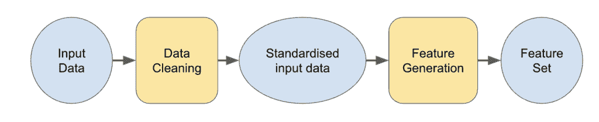
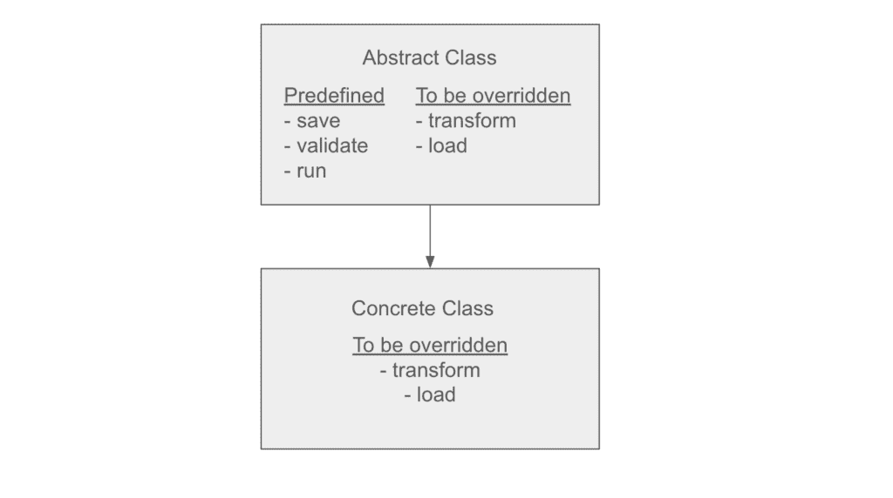
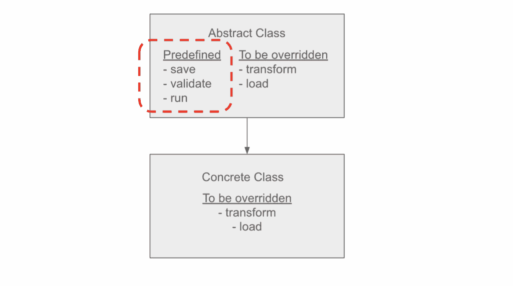
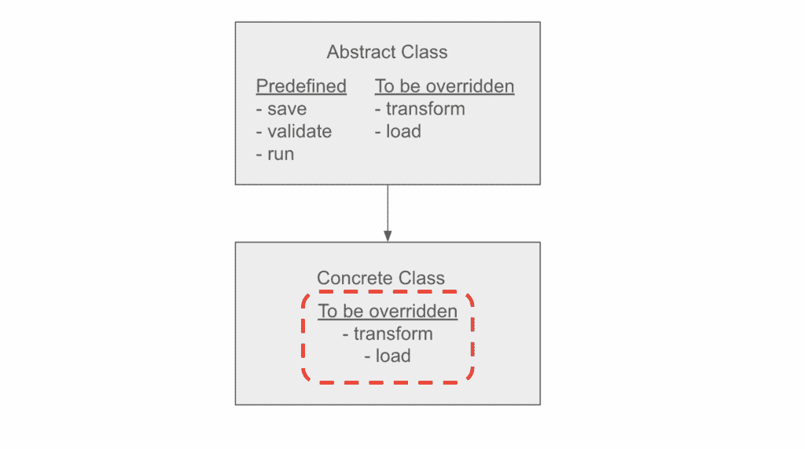

# 抽象类：数据科学家必须了解以成功为目标的软件工程概念

> 原文：[`towardsdatascience.com/abstract-classes-a-software-engineering-concept-data-scientists-must-know-to-succeed/`](https://towardsdatascience.com/abstract-classes-a-software-engineering-concept-data-scientists-must-know-to-succeed/)

## <mdspan datatext="el1750111602668" class="mdspan-comment">为什么</mdspan>你应该阅读这篇文章

如果你打算进入数据科学领域，无论是研究生、寻求职业转变的专业人士，还是负责建立最佳实践的管理者，这篇文章就是为你准备的。

数据科学吸引了来自不同背景的众多人才。根据我的专业经验，我曾与曾是以下同事共事：

+   核物理学家

+   研究引力波博士后

+   计算生物学博士

+   语言学专家

只举几个例子。

能够遇到这样一群背景多样化的群体真是太好了，我看到了各种不同的思维方式如何推动一个富有创造力和高效的数据科学功能的成长。

然而，我也看到了这种多样性的一个重大缺点：

> *每个人对关键软件工程概念的了解程度不同，这导致了编码技能的拼凑。*

因此，我看到了一些数据科学家所做的出色工作，但这些工作：

+   难以阅读——你根本不知道他们试图做什么。

+   不稳定——一旦有人尝试运行它就会崩溃。

+   无法维护——代码很快就会过时或容易损坏。

+   无法扩展——代码是一次性使用，其行为无法扩展

这最终会削弱他们的工作所能产生的影响，并在后续产生各种问题。

因此，在一系列文章中，我计划概述一些核心的软件工程概念，这些概念是我根据数据科学家的需求量身定制的。

这些概念很简单，但知道它们与不知道它们之间的明显区别，划清了业余与专业的界限。


抽象艺术，照片由[Steve Johnson](https://unsplash.com/@steve_j?utm_content=creditCopyText&utm_medium=referral&utm_source=unsplash)在[Unsplash](https://unsplash.com/photos/orange-red-and-blue-abstract-painting-VCLNNMRl07k?utm_content=creditCopyText&utm_medium=referral&utm_source=unsplash)提供

## 今天的概念：抽象类

抽象类是类继承的扩展，如果正确使用，它可以成为数据科学家非常有用的工具。

> *如果你需要关于类继承的复习，请参阅我的文章[这里](https://towardsdatascience.com/inheritance-a-software-engineering-concept-data-scientists-must-know-to-succeed/)*。

就像我们对[类继承](https://towardsdatascience.com/inheritance-a-software-engineering-concept-data-scientists-must-know-to-succeed/)所做的那样，我不会去麻烦给出一个正式的定义。回顾我刚开始编码的时候，我发现很难理解互联网上那些模糊和抽象（无意中）的定义。

通过一个实际例子来说明它要容易得多。

所以，让我们直接进入一个数据科学家可能会遇到的实际例子，以展示它们是如何被使用的，以及为什么它们是有用的。

## 示例：为特征生成管道准备数据


图片由[Scott Graham](https://unsplash.com/@amstram?utm_content=creditCopyText&utm_medium=referral&utm_source=unsplash)在[Unsplash](https://unsplash.com/photos/person-holding-pencil-near-laptop-computer-5fNmWej4tAA?utm_content=creditCopyText&utm_medium=referral&utm_source=unsplash)上拍摄

假设我们是一家专注于为金融机构进行欺诈检测的咨询公司。

我们与多个不同的客户合作，我们有一组特征，这些特征在不同客户项目中传递一致的信号，因为它们包含了从主题专家那里收集到的领域知识。

因此，为每个项目构建这些特征是有意义的，即使它们在特征选择过程中被丢弃，或者被为该客户定制的特征所取代。

### 挑战

我们数据科学家知道，在不同的项目/环境/客户之间工作意味着每个输入数据都是不同的；

+   客户可能提供不同的文件类型：`CSV`、`Parquet`、`JSON`、`tar`等。

+   不同的环境可能需要不同的凭证集。

+   毫无疑问，每个数据集都有其独特的特性，因此每个都需要不同的数据清理步骤。

因此，你可能认为我们需要为每个客户构建一个新的特征生成管道。

你会如何处理每个数据集的复杂性？

### 不，有更好的方法

既然：

+   我们知道我们将为每个客户构建相同的有效特征集

+   我们可以构建一个可以重复用于每个客户的特征生成管道

+   因此，我们唯一需要解决的新问题是清理输入数据。

因此，我们的问题可以概括为以下阶段：



图片由作者提供。蓝色圆圈是数据集，黄色方块是管道。

+   数据清理管道

    +   负责处理为给定客户所需的任何独特的清理和处理，以便将数据集格式化为特征生成管道所规定的*标准化模式*。

+   特征生成管道

    +   实现特征工程逻辑，假设输入数据将遵循固定模式以输出我们有用的特征集。

在给定固定输入数据模式的情况下，构建特征生成管道是微不足道的。

因此，我们将问题简化为以下内容：

> *我们如何确保数据清洗管道的质量，使其输出始终符合下游要求？*

## 我们真正要解决的问题

我们的问题“*确保输出始终符合下游要求*”不仅仅是让代码运行。这是容易的部分。

困难的部分是设计对众多外部、非技术因素具有鲁棒性的代码，例如：

+   人类错误

    +   人们自然会忘记一些小的细节或先前的假设。他们在构建数据清洗管道时可能会忽略某些要求。

+   离职者

    +   随着时间的推移，你的团队不可避免地会发生变化。你的同事可能拥有他们认为显而易见的知识，因此他们从未费心去记录。一旦他们离职，这些知识就会丢失。只有通过试错和数小时的调试，你的团队才能恢复这些知识。

+   新加入的人

    +   同时，新加入的人对那些曾经被认为是显而易见的先前的假设一无所知，因此他们的代码通常需要大量的调试和重写。

这正是抽象类真正发光的地方。

## 输入数据要求

我们提到我们可以修复特征生成管道输入数据的模式，所以让我们为我们的示例定义这个。

假设我们的管道期望读取包含以下列的*parquet*文件：

```py
row_id:
    int, a unique ID for every transaction.
timestamp:
    str, in ISO 8601 format. The timestamp a transaction was made.
amount: 
    int, the transaction amount denominated in pennies (for our US readers, the equivalent will be cents).
direction: 
    str, the direction of the transaction, one of ['OUTBOUND', 'INBOUND']
account_holder_id: 
    str, unique identifier for the entity that owns the account the transaction was made on.
account_id: 
    str, unique identifier for the account the transaction was made on.
```

让我们再添加一个要求，即数据集必须按`时间戳`排序。

## 抽象类

现在，是时候定义我们的抽象类了。

抽象类本质上是一个蓝图，我们可以从中继承以创建子类，也称为‘*具体*’类。

让我们具体说明我们可能需要用于我们的数据清洗蓝图的不同方法。

```py
import os
from abc import ABC, abstractmethod

class BaseRawDataPipeline(ABC):
    def __init__(
        self,
        input_data_path: str | os.PathLike,
        output_data_path: str | os.PathLike
    ):
        self.input_data_path = input_data_path
        self.output_data_path = output_data_path

    @abstractmethod
    def transform(self, raw_data):
        """Transform the raw data.

        Args:
            raw_data: The raw data to be transformed.
        """
        ...

    @abstractmethod
    def load(self):
        """Load in the raw data."""
        ...

    def save(self, transformed_data):
        """save the transformed data."""
        ...

    def validate(self, transformed_data):
        """validate the transformed data."""
        ...

    def run(self):
        """Run the data cleaning pipeline."""
        ...
```

你可以看到，我们已经从`abc`模块导入了`ABC`类，这使得我们能够在 Python 中创建抽象类。



作者提供的图片。抽象类和具体类之间的关系和方法图。

## 预定义行为




现在，让我们在我们的抽象类中添加一些预定义的行为。

记住，这个行为将提供给所有继承这个类的子类，所以这就是我们在这里嵌入你想要为所有未来项目强制执行的行为的地方。

对于我们的示例，需要修复的所有项目相关行为都与我们如何输出处理后的数据集有关。

### 1. `run`方法

首先，我们定义`run`方法。这是将被调用来运行数据清洗管道的方法。

```py
 def run(self):
        """Run the data cleaning pipeline."""
        inputs = self.load()
        output = self.transform(*inputs)
        self.validate(output)
        self.save(output)
```

`run`方法充当所有未来子类的单一入口点。

这标准化了任何数据清洗管道的运行方式，这使得我们能够围绕任何管道构建新的功能，而不用担心底层实现。

你可以想象，如果所有管道都通过相同的 `run` 方法执行，而不是处理许多不同的名称，如 `run`、`execute`、`process`、`fit`、`transform` 等，那么将这些管道集成到某些编排器或调度器中将会更容易。

### 2. `save` 方法

接下来，我们修正了如何输出转换后的数据。

```py
 def save(self, transformed_data:pl.LazyFrame):
        """save the transformed data to parquet."""
        transformed_data.sink_parquet(
            self.output_file_path,
        )
```

我们假设我们将使用 `polars` 进行数据处理，并且按照我们为特征生成管道指定的规范，输出保存为 `parquet` 文件。

### 3. `validate` 方法

最后，我们填充 `validate` 方法，该方法将在保存之前检查数据集是否符合我们预期的输出格式。

```py
 @property
    def output_schema(self):
        return dict(
            row_id=pl.Int64,
            timestamp=pl.Datetime,
            amount=pl.Int64,
            direction=pl.Categorical,
            account_holder_id=pl.Categorical,
            account_id=pl.Categorical,
        )

    def validate(self, transformed_data):
        """validate the transformed data."""
        schema = transformed_data.collect_schema()
        assert (
            self.output_schema == schema, 
            f"Expected {self.output_schema} but got {schema}"
        )
```

我们创建了一个名为 `output_schema` 的属性。这确保了所有子类都将有这个属性可用，同时防止它在不小心删除或覆盖的情况下被意外移除，例如在 `__init__` 中定义。

## 项目特定行为



图片由作者提供。需要重写的项目特定方法用红色圆圈标出。

在我们的示例中，`load` 和 `transform` 方法是项目特定行为所在的地方，所以我们把它们留空在基类中——实现被推迟到负责为项目编写此逻辑的未来数据科学家。

你还会注意到，我们在 `transform` 和 `load` 方法上使用了 `abstractmethod` 装饰器。这个装饰器强制子类定义这些方法。如果用户忘记定义它们，将会引发错误以提醒他们这样做。

让我们现在转到一些示例项目，在这些项目中我们可以定义 `transform` 和 `load` 方法。

## 示例项目

在这个项目中，客户端以以下结构发送他们的数据集作为 CSV 文件：

```py
event_id: str
unix_timestamp: int
user_uuid: int
wallet_uuid: int
payment_value: float
country: str
```

我们从中学到：

+   每笔交易都由 `event_id` 和 `unix_timestamp` 的组合唯一标识。

+   `wallet_uuid` 是“账户”的等效标识符。

+   `user_uuid` 是“账户持有人”的等效标识符

+   `payment_value` 是交易金额，以英镑（或美元）计价。

+   CSV 文件由 `|` 分隔，没有标题。

### 具体类

现在，我们在 `BaseRawDataPipeline` 的子类中实现 `load` 和 `transform` 函数，以处理上述独特的复杂性。

记住，这些方法都是在此项目工作的数据科学家需要编写的。所有上述方法都是预定义的，所以他们不必担心这些，减少了团队需要完成的工作量。

#### 1. 加载数据

`load` 函数相当简单：

```py
class Project1RawDataPipeline(BaseRawDataPipeline):

    def load(self):
        """Load in the raw data.

        Note:
            As per the client's specification, the CSV file is separated 
            by `|` and has no header.
        """
        return pl.scan_csv(
            self.input_data_path,
            sep="|",
            has_header=False
        )
```

我们使用 polars 的 `scan_csv` [方法](https://docs.pola.rs/api/python/dev/reference/api/polars.scan_csv.html) 来流式传输数据，并使用适当的参数来处理我们客户的 CSV 文件结构。

#### 2. 数据转换

对于这个项目来说，转换方法也很简单，因为我们没有复杂的连接或聚合操作要执行。因此，我们可以将所有内容都放入一个单一函数中。

```py
class Project1RawDataPipeline(BaseRawDataPipeline):

    ...

    def transform(self, raw_data: pl.LazyFrame):
        """Transform the raw data.

        Args:
            raw_data (pl.LazyFrame):
                The raw data to be transformed. Must contain the following columns:
                    - 'event_id'
                    - 'unix_timestamp'
                    - 'user_uuid'
                    - 'wallet_uuid'
                    - 'payment_value'

        Returns:
            pl.DataFrame:
                The transformed data.

                Operations:
                    1\. row_id is constructed by concatenating event_id and unix_timestamp
                    2\. account_id and account_holder_id are renamed from user_uuid and wallet_uuid
                    3\. transaction_amount is converted from payment_value. Source data
                    denomination is in £/$, so we need to convert to p/cents.
        """

        # select only the columns we need
        DESIRED_COLUMNS = [
            "event_id",
            "unix_timestamp",
            "user_uuid",
            "wallet_uuid",
            "payment_value",
        ]
        df = raw_data.select(DESIRED_COLUMNS)

        df = df.select(
            # concatenate event_id and unix_timestamp
            # to get a unique identifier for each row.
            pl.concat_str(
                [
                    pl.col("event_id"),
                    pl.col("unix_timestamp")
                ],
                separator="-"
            ).alias('row_id'),

            # convert unix timestamp to ISO format string
            pl.from_epoch("unix_timestamp", "s").dt.to_string("iso").alias("timestamp"),

            pl.col("user_uuid").alias("account_id"),
            pl.col("wallet_uuid").alias("account_holder_id"),

            # convert from £ to p
            # OR convert from $ to cents
            (pl.col("payment_value") * 100).alias("transaction_amount"),
        )

        return df
```

因此，通过重载这两个方法，我们已经为我们客户项目实现了所需的所有功能。

我们所知道的结果符合下游特征工程管道的要求，因此我们自动有保证我们的输出是兼容的。

> ***无需调试。无需麻烦。无需烦恼。***

## 最终总结：为什么在数据科学管道中使用抽象类？

抽象类为将一致性、鲁棒性和改进的可维护性引入数据科学项目提供了一种强大的方式。通过像我们的示例中使用抽象类一样，我们的数据科学团队看到了以下好处：

## 1. 无需担心兼容性

通过定义一个清晰的蓝图，使用抽象类，数据科学家只需专注于实现针对其客户端数据的特定`load`和`transform`方法。

只要这些方法符合预期的输入/输出类型，与下游特征生成管道的兼容性就有保证。

这种关注点的分离简化了开发过程，减少了错误，并加速了新项目的开发。

### 2. 更容易进行文档化

结构化格式自然鼓励通过方法文档字符串进行内联文档。

这种设计决策和实现之间的邻近性使得传达每个客户端数据集的假设、转换和细微差别变得更容易。

代码文档良好，更容易阅读、维护和移交，减少了团队变化或人员流动造成的知识损失。

### 3. 提高代码可读性和可维护性

通过抽象类强制执行一致的接口，生成的代码库避免了难以阅读、不可靠或难以维护的脚本的陷阱。

每个子类都遵循标准化的方法结构（`load`、`transform`、`validate`、`save`、`run`），这使得管道更具可预测性，更容易调试。

### 4. 对人为因素的鲁棒性

抽象类有助于减少人为错误、团队成员离职或新成员学习新技能带来的风险，通过在基类中嵌入基本行为。这确保了关键步骤永远不会被跳过，即使个别贡献者不了解所有下游要求。

### 5. 可扩展性和可重用性

通过在具体类中隔离特定客户端的逻辑，同时在抽象基类中共享常见行为，使得扩展管道以适应新客户或项目变得简单直接。您可以在不重写整个管道的情况下添加新的数据清洗步骤或支持新的文件格式。

总结来说，抽象类将您的数据科学代码库从临时脚本提升到可扩展和可维护的生产级代码。无论您是数据科学家、团队领导还是经理，采用这些软件工程原则将显著提高您工作的影响力和持久性。

## 如果你想了解更多

如果你喜欢这篇文章，那么也可以看看我其他一些相关的文章。

+   **继承：数据科学家必须了解以成功的关键软件工程概念 ([这里](https://towardsdatascience.com/inheritance-a-software-engineering-concept-data-scientists-must-know-to-succeed/))**

+   **封装：数据科学家必须了解以成功的关键软件工程概念 ([这里](https://medium.com/data-science/encapsulation-a-software-engineering-concept-data-scientists-must-know-to-succeed-b3b1a0a42a41))**

+   **你需要的数据科学工具，以实现高效的 ML-Ops ([这里](https://medium.com/ai-advances/the-data-science-tool-you-need-for-efficient-mlops-408d826bd48d))**

+   **DSLP：改变我团队的数据科学项目管理框架 ([这里](https://medium.com/data-science/dslp-the-data-science-project-management-framework-that-transformed-my-team-1b6727d009aa))**

+   **如何在数据科学家面试中脱颖而出 ([这里](https://medium.com/data-science/how-to-stand-out-in-your-data-scientist-interview-f3cbaddbbae4))**

+   **为你的图神经网络解释提供交互式可视化 ([这里](https://medium.com/data-science/an-interactive-visualisation-for-your-graph-neural-network-explanations-1ac79d8ddd0a))**

+   **用于可视化网络图的最新最佳 Python 包 ([这里](https://medium.com/data-science/the-new-best-python-package-for-visualising-network-graphs-e220d59e054e))**

### **你还可以在 Patreon 上成为团队成员** [**这里**](http://patreon.com/BenjaminLeeDataScience)**!**

我们为所有文章都设立了专门的讨论线程；向我提问有关自动化测试的问题，更详细地讨论这个话题，并与其他数据科学家分享经验。学习不应该在这里停止。

你可以在[这里](https://www.patreon.com/posts/abstract-classes-135198601?utm_medium=clipboard_copy&utm_source=copyLink&utm_campaign=postshare_creator&utm_content=join_link)找到这篇文章的专用讨论线程。
