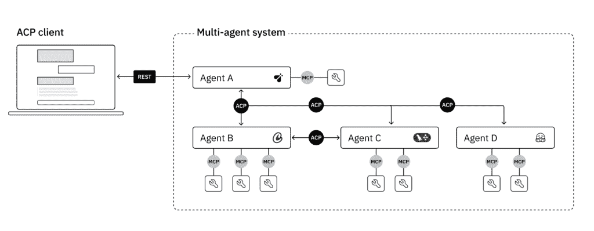
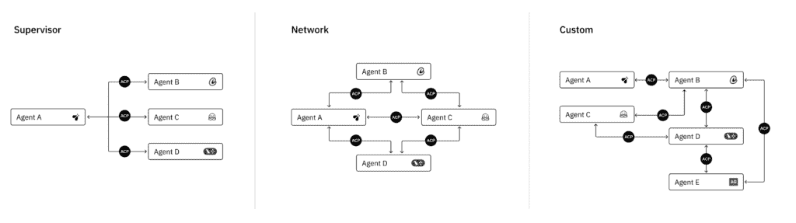
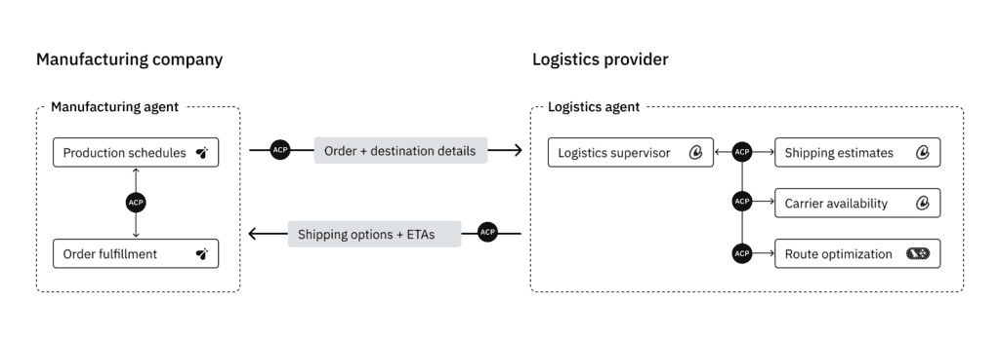

# ACP：AI 代理的互联网协议

> 原文：[`towardsdatascience.com/acp-the-internet-protocol-for-ai-agents/`](https://towardsdatascience.com/acp-the-internet-protocol-for-ai-agents/)

**<mdspan datatext="el1746747854951" class="mdspan-comment">使用 ACP（代理通信协议），AI 代理可以在团队、框架、技术和组织之间自由协作**。这是一个通用协议，将当今 AI 代理的碎片化格局转变为相互连接的团队成员。这解锁了新的互操作性、重用和扩展级别。

作为具有开放治理的开源标准，ACP 刚刚发布了其最新版本，允许 AI 代理在不同框架和技术堆栈之间进行通信。它是 BeeAI（我是团队的一员）等不断增长的生态系统的一部分，BeeAI 已被[捐赠给 Linux 基金会](https://www.linuxfoundation.org/press/ai-workflows-get-new-open-source-tools-to-advance-document-intelligence-data-quality-and-decentralized-ai-with-ibms-contribution-of-3-projects-to-linux-fou-1745937200621)。以下是一些关键特性；你可以在[文档](https://agentcommunicationprotocol.dev/introduction/welcome)中了解更多关于核心概念和细节。



不同框架的 ACP 客户端和 ACP 代理通信的示例。图片已获授权使用。

**ACP 的关键特性：

**基于 REST 的通信**：ACP 使用标准的 HTTP 模式进行通信，这使得它很容易集成到生产环境中。而 JSON-RPC 则依赖于更复杂的方法。

**无需 SDK**（但如果你需要的话有一个）**：ACP 不需要任何专用库。你可以使用 curl、Postman 或甚至浏览器等工具与代理交互。为了增加便利性，还有一个[SDK](https://github.com/i-am-bee/acp/tree/main/python)可用。

**离线发现**：ACP 代理可以直接将其元数据嵌入到其分发包中，即使在它们不活跃时也能实现发现。这支持了安全、空气隔离或扩展到零的环境，在这些环境中，传统的服务发现是不可能的。

**异步优先，同步支持**：ACP 的设计以异步通信为默认。这对于长时间运行或复杂任务来说非常理想。同步请求也得到支持。

**注意**：ACP 可以为任何代理架构模式启用编排，但它不管理工作流程、部署或代理之间的协调。相反，它通过标准化它们之间的通信来使不同代理之间的编排成为可能。IBM Research 构建了[BeeAI](https://beeai.dev/)，这是一个开源系统，旨在处理代理编排、部署和共享（使用 ACP 作为通信层）。

* * *

## 我们为什么需要 ACP？



使用 ACP 启用不同代理架构的示例。图片已获授权使用。

随着 AI 代理“在野外”数量的增加，如何从每个独立技术中获得最佳结果（而不必受限于特定供应商）的复杂性也在增加。每个框架、平台和工具包都提供独特的优势，但将它们全部集成到一个代理系统中具有挑战性。

今天，大多数代理系统都在孤岛中运行。它们建立在不可兼容的框架上，公开自定义 API，并且缺乏共享的通信协议。连接它们需要脆弱且不可重复的集成，这很昂贵。

ACP 代表一个根本性的转变：从碎片化的、*临时性*生态系统到一个相互连接的代理网络——每个代理都能发现、理解并与他人协作，无论它们是由谁构建的或运行在什么堆栈上。有了 ACP，开发者可以利用不同代理的集体智慧来构建比单一系统单独实现更强大的工作流程。

**当前挑战：**尽管代理能力快速增长，但现实世界的集成仍然是一个主要瓶颈。没有共享的通信协议，组织面临几个反复出现的问题：

+   框架多样性：组织通常运行数百或数千个使用不同框架（如 LangChain、CrewAI、AutoGen 或自定义堆栈）构建的代理。

+   定制集成：没有标准协议，开发者必须为每个代理交互编写自定义连接器。

+   指数级开发：有 n 个代理，你可能需要 n(n-1)/2 个不同的集成点（这使得大型代理生态系统难以维护）。

+   跨组织考虑因素：不同的安全模型、身份验证系统和数据格式使公司间的集成复杂化。

* * *

## 一个真实世界的例子



两个代理（制造和物流）使用 ACP 并在组织间相互通信的用例示例。图片已获得许可使用。

为了说明代理间通信的真实世界需求，考虑两个组织：

**制造公司**使用 AI 代理来管理生产计划和订单履行，基于内部库存和客户需求。

**物流提供商**运行代理以提供实时运输估算、承运商可用性和路线优化。

现在想象制造商的系统需要估算大量定制设备订单的交货时间表，以便向客户报价。

**没有 ACP：**这需要构建制造商计划软件和物流提供商 API 之间的定制集成。这意味着需要手动处理身份验证、数据格式不匹配和服务可用性。这些集成成本高昂、脆弱，并且随着更多合作伙伴的加入而难以扩展。

**使用 ACP：** 每个组织都使用 ACP 接口包装其代理。制造代理将订单和目的地详情发送给物流代理，物流代理则响应实时运输选项和预计到达时间。两个系统协作而无需暴露内部或编写自定义集成。新的物流合作伙伴只需通过实现 ACP 简单地插入。

* * *

## 创建一个 ACP 兼容代理有多容易？

ACP 快速入门 – 如何使 AI 代理 ACP 兼容

简单性是 ACP 的核心设计原则。只需几行代码即可使用 ACP 包装代理。使用 Python SDK，您只需装饰一个函数即可定义符合 ACP 规范的代理。

这种最小实现：

1.  创建一个 ACP 服务器实例

1.  使用 @server.agent() 装饰器定义代理函数

1.  使用带有 LLM 后端和用于上下文持久化的内存的 LangChain 框架实现代理

1.  在 ACP 的消息格式和框架的本地格式之间进行翻译，以返回结构化响应

1.  启动服务器，使代理可通过 HTTP 访问

<details class="wp-block-details is-layout-flow wp-block-details-is-layout-flow"><summary>代码示例</summary>

```py
from typing import Annotated
import os
from typing_extensions import TypedDict
from dotenv import load_dotenv
#ACP SDK
from acp_sdk.models import Message
from acp_sdk.models.models import MessagePart
from acp_sdk.server import RunYield, RunYieldResume, Server
from collections.abc import AsyncGenerator
#Langchain SDK
from langgraph.graph.message import add_messages
from langchain_anthropic import ChatAnthropic 

load_dotenv() 

class State(TypedDict):
    messages: Annotated[list, add_messages]

#Set up the llm
llm = ChatAnthropic(model="claude-3-5-sonnet-latest", api_key=os.environ.get("ANTHROPIC_API_KEY"))

#------ACP Requirement-------#
#START SERVER
server = Server()
#WRAP AGENT IN DECORACTOR
@server.agent()
async def chatbot(messages: list[Message])-> AsyncGenerator[RunYield, RunYieldResume]:
    "A simple chatbot enabled with memory"
    #formats ACP Message format to be compatible with what langchain expects
    query = " ".join(
        part.content
        for m in messages
        for part in m.parts             
    )
    #invokes llm
    llm_response = llm.invoke(query)    
    #formats langchain response to ACP compatable output
    assistant_message = Message(parts=[MessagePart(content=llm_response.content)])
    # Yield so add_messages merges it into state
    yield {"messages": [assistant_message]}  

server.run()
#---------------------------#
```</details>

现在，你已经创建了一个完全符合 ACP 规范的代理，它可以：

+   被其他代理发现（在线或离线）

+   同步或异步处理请求

+   使用标准消息格式进行通信

+   与任何其他 ACP 兼容的系统集成

* * *

## ACP 与 MCP & A2A 的比较

为了更好地理解 ACP 在不断发展的 AI 生态系统中的作用，将其与其他新兴协议进行比较很有帮助。*这些协议并不一定是竞争对手。* 相反，它们解决 AI 系统集成堆栈的不同层，并且通常相互补充。

一瞥：

+   **MCP（Anthropic 的模型上下文协议）：** 设计用于通过工具、内存和资源丰富单个模型的上下文。

    *重点：一个模型，多个工具*

+   **ACP（Linux 基金会的代理通信协议）：** 设计用于系统和组织之间独立代理之间的通信。

    *重点：多个代理安全地作为对等体工作，无供应商锁定，开放治理*

+   **A2A（Google 的代理到代理）：** 设计用于系统和组织之间独立代理之间的通信。

    *重点：多个代理作为对等体工作，针对 Google 的生态系统进行优化*

### ACP 和 MCP

ACP 团队最初探索了适应 **模型上下文协议（MCP）**，因为它为模型上下文交互提供了一个强大的基础。然而，他们很快遇到了架构限制，这使得它不适合真正的代理到代理通信。

为什么 MCP 对于多代理系统来说不足：

**流式传输：** MCP 支持流式传输，但它不处理 *增量流*（例如，标记、轨迹更新）。这种限制源于 MCP 最初创建时并未打算用于代理式交互。

**内存共享**：MCP 不支持在服务器之间运行多个代理同时保持共享内存。ACP 也尚未完全支持这一点，但它是一个活跃的开发领域。

**消息结构**：MCP 接受任何 JSON 架构，但未定义消息体的结构。这种灵活性使得互操作性变得困难（尤其是对于构建 UI 或编排必须解释不同消息格式的代理）。

**协议复杂性**：MCP 使用 JSON-RPC 并需要特定的 SDK 和运行时。而 ACP 的基于 REST 的设计具有内置的异步/同步支持，更轻量级且易于集成。

您可以在此处了解更多关于 ACP 和 MCP 如何比较的信息 [here](https://agentcommunicationprotocol.dev/about/mcp-and-a2a#model-context-protocol)。

将 **MCP** 想象成给一个人提供更好的工具，比如计算器或参考书，以增强其性能。相比之下，**ACP** 是关于使人们能够形成 *团队*，其中每个人（或代理）贡献他们的能力并协作。

*ACP 和 MCP 可以相互补充：*

|  | **MCP** | **ACP** |
| --- | --- | --- |
| 范围 | 单个模型 + 工具 | 多个协作代理 |
| 重点关注 | 上下文丰富化 | 代理通信和编排 |
| 交互 | 模型 ↔️ 工具 | 代理 ↔️ 代理 |
| 示例 | 向模型发送数据库查询 | 协调研究代理和编码代理 |

### ACP 和 A2A

Google 的代理到代理协议 (A2A)，在 ACP 之后不久推出，也旨在标准化 AI 代理之间的通信。这两种协议都旨在实现多代理系统，但在哲学和治理上存在差异。

*主要差异：*

|  | **ACP** | **A2A** |
| --- | --- | --- |
| **治理** | 开放标准，在 Linux 基金会下由社区领导 | 由 Google 领导 |
| **生态系统兼容性** | 设计用于与开源多代理平台 **BeeAI** 集成 | 与 Google 生态系统紧密相连 |
| **通信风格** | 基于 REST，使用熟悉的 HTTP 模式 | 基于 JSON-RPC |
| **消息格式** | MIME 类型可扩展，允许灵活的内容协商 | 预先定义的结构化类型 |
| **代理支持** | 明确支持任何类型的代理——从无状态工具到长期运行的对话代理。同步和异步模式都得到支持。 | 支持无状态和有状态代理，但同步保证可能有所不同 |

ACP 被故意设计成：

+   使用常见的 HTTP 工具和 REST 规范简单集成

+   在广泛的代理类型和工作负载上具有灵活性

+   供应商中立，具有开放治理和广泛的生态系统对齐

**两种协议可以共存——根据环境的不同，各自满足不同的需求**。 ACP 的轻量级、开放和可扩展的设计使其非常适合去中心化系统以及跨越组织边界的现实世界互操作性。A2A 的自然集成可能使其成为使用 Google 生态系统的用户更合适的选择。

* * *

## 路线图和社区

随着 ACP 的发展，他们正在探索新的可能性来增强代理通信。以下是一些关键的关注领域：

+   身份联合：ACP 如何与身份验证系统合作，以改善网络间的信任？

+   访问委托：我们如何使代理能够安全地委托任务（同时保持用户控制）？

+   多注册支持：ACP 能否支持跨不同网络的去中心化代理发现？

+   代理共享：我们如何使代理在组织之间或组织内部更容易共享和重用？

+   部署：有哪些工具和模板可以简化代理部署？

ACP 是在公开环境中开发的，因为当标准与用户直接开发时，它们的效果最好。[贡献](https://agentcommunicationprotocol.dev/about/contribute)来自开发人员、研究人员和对代理互操作性未来感兴趣的组织是受欢迎的。加入进来，帮助塑造这个不断发展的标准。

* * *

想要了解更多信息，请访问 [agentcommunicationprotocol.dev](https://agentcommunicationprotocol.dev) 并加入 [github](https://github.com/i-am-bee/acp/discussions) 和 [discord](https://discord.gg/49BmB5BcNY) 频道上的讨论。
