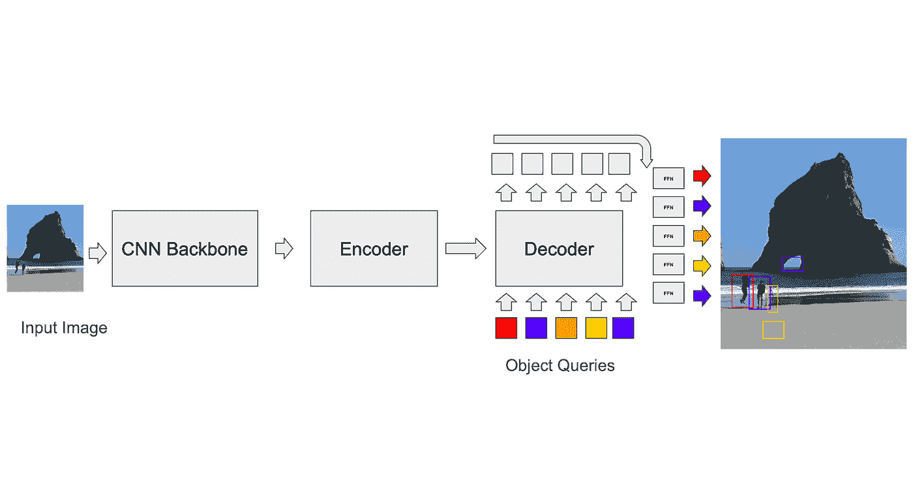
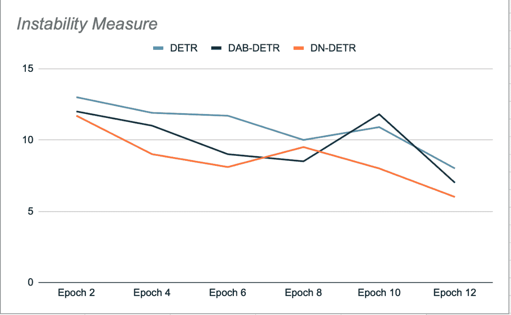
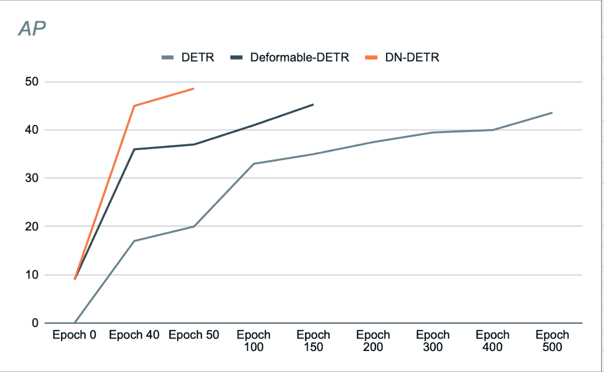
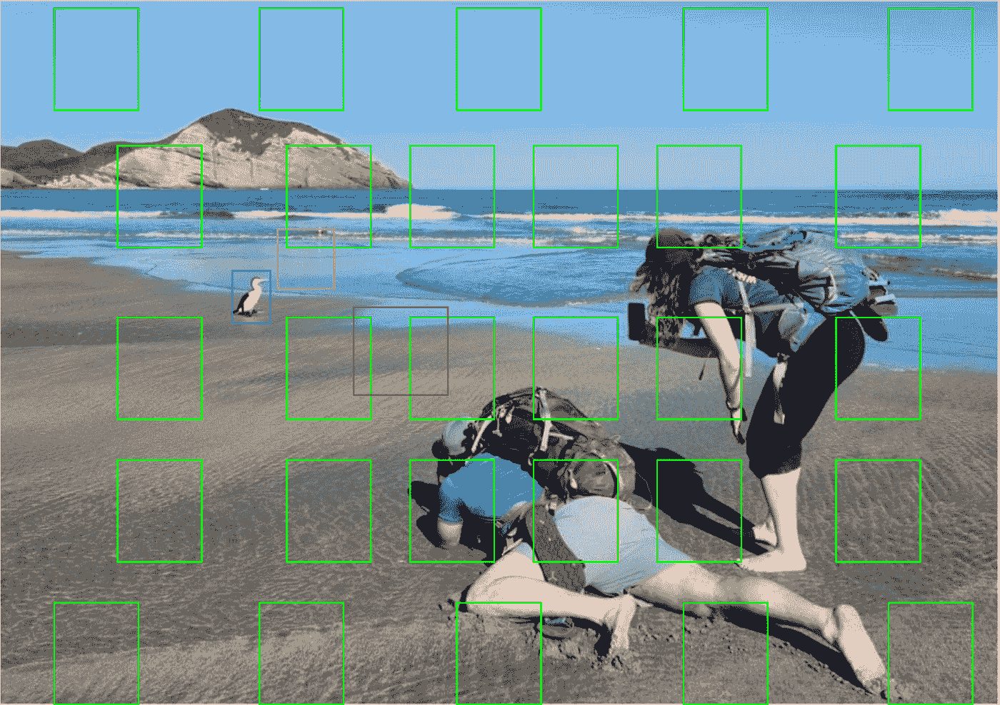

# 向 Transformer 中添加训练噪声以改进检测

> 原文：[`towardsdatascience.com/adding-training-noise-to-improve-detections-in-transformers/`](https://towardsdatascience.com/adding-training-noise-to-improve-detections-in-transformers/)

<mdspan datatext="el1745628298724" class="mdspan-comment">现代视觉 Transformer</mdspan> 通过添加噪声来提高二维和三维物体检测的性能。在这篇文章中，我们将学习这种机制是如何工作的，并讨论其贡献。

## 早期视觉 Transformer

DETR — DEtection TRansformer (Carion, Massa et al. 2020)，是第一个用于物体检测的 Transformer 架构之一，它使用学习到的解码器查询从图像标记中提取检测信息。这些查询是随机初始化的，该架构没有强加任何约束，迫使这些查询学习类似于锚点的东西。虽然与 Faster-RCNN 实现了可比的结果，但其缺点在于其收敛速度慢——需要 500 个 epoch 来训练它（DN-DETR，Li et al.，2024）。更近期的基于 DETR 的架构，使用了可变形聚合，使查询能够仅关注图像中的某些区域（Zhu et al.，Deformable DETR: Deformable Transformers For End-To-End Object Detection，2020），而其他（Liu et al.，DAB-DETR: Dynamic Anchor Boxes Are Better Queries For DETR，2022）使用了空间锚点（使用 k-means 生成，类似于基于锚点的 CNN 的方式），这些锚点被编码到初始查询中。跳过连接迫使 Transformer 的解码器块学习从锚点回归的值。可变形注意力层使用预编码的锚点从图像中采样空间特征，并使用这些特征来构建用于注意力的标记。在训练过程中，模型学习使用最佳锚点。这种方法教会模型在其查询中明确使用诸如框大小等特征。

图 1\. DETR，基本图。黄色和紫色的查询最优地引导到置信度非常低或类别为“无物体”的检测。来源：作者。

## 预测与真实值的匹配

为了计算损失，训练器首先需要将模型的预测与地面真实（GT）框匹配。虽然基于锚点的 CNN 有相对容易的解决方案（例如，每个锚点在训练期间只能与其 voxel 中的 GT 框匹配，在推理时使用非极大值抑制来去除重叠的检测），但由 DETR 设定的 transformer 标准是使用一种称为匈牙利算法的二分匹配算法。在每次迭代中，算法找到最佳预测与 GT 的匹配（一种优化某些成本函数的匹配，如所有框角之间的平均平方距离之和）。然后，计算预测-GT 框对之间的损失，并可以进行反向传播。多余的预测（没有匹配 GT 的预测）将产生一个单独的损失，鼓励它们降低其置信度分数。

## 问题

匈加里算法的时间复杂度为 o(n³)。有趣的是，这并不一定是训练质量的瓶颈：正如（《稳定婚姻问题：从物理学家视角的跨学科综述》，Fenoaltea 等人，2021 年）所展示的，该算法是不稳定的，即其目标函数的微小变化可能导致其匹配结果发生剧烈变化——导致查询训练目标不一致。在 transformer 训练中的实际影响是，目标查询可以在对象之间跳跃，并且需要很长时间才能学习到最佳特征以收敛。

## DN-DETR

李等人提出了一种解决不稳定匹配问题的优雅方案，后来该方案被许多其他工作采用，包括 DINO、Mask DINO、Group DETR 等。

DN-DETR 中的主要思想是通过创建**虚构的、易于回归的锚点**来提升训练，这些锚点跳过了匹配过程。这是在训练过程中通过向 GT 框添加少量噪声并将这些噪声增强的框作为锚点输入到解码器查询中实现的。DN 查询被屏蔽在有机查询之外，反之亦然，以避免干扰训练的交叉注意力。这些查询生成的检测已经与它们的源 GT 框匹配，不需要进行二分匹配。DN-DETR 的作者表明，在验证阶段（在 epoch 结束时，去噪被关闭），与 DETR 和 DAB-DETR 相比，这提高了模型稳定性，即在连续的 epoch 中，更多的查询与其 GT 对象的匹配是一致的。（见图 2）。

作者表明，使用 DN 既可以加速收敛，又能实现更好的检测结果。（见图 3）。他们的消融研究显示，在 COCO 检测数据集上，与之前的 SOTA（DAB-DETR，AP 42.2%）相比，使用 ResNet-50 作为主干网络时，AP 提高了 1.9%。

图 2. 训练过程中不稳定性的示意图，如验证期间测量的。基于 DN-DETR 提供的数据（Li 等，2022）。图像来源：作者。

图 3. DN-DETR 的性能在 1/10 的训练周期内迅速超过 DETR 的最大性能。基于 DN-DETR 中的数据（Li 等，2022）。图像来源：作者。

## DINO 与对比去噪

DINO 将这个想法进一步发展，并将对比学习添加到去噪机制中：除了正例之外，DINO 还为每个 GT 创建另一个噪声增强的版本，该版本在数学上被构建得比正例更远离 GT（见图 4）。该版本被用作训练中的负例：模型学习接受接近真实检测的检测，并拒绝远离的检测（通过学习预测“无物体”类别）。

此外，DINO 使多个对比去噪（CDN）组——每个 GT 对象多个噪声增强的锚点——从每次训练迭代中获得更多。

DINO 的作者报告说，在使用 CDN 时，AP 为 49%（在 COCO val2017 上）。

最近的时间模型，需要从帧到帧跟踪对象，如 Sparse4Dv3，使用 CDN，并添加时间去噪组，其中存储了一些成功的 DN 锚点（以及学习到的、非 DN 的锚点），用于后续帧的使用，从而提高模型在目标跟踪中的性能。

图 4. 去噪示意图。训练过程的一个快照。绿色框是当前锚点（要么是从先前图像中学习到的，要么是固定的）。蓝色框是鸟对象的真实（GT）框。黄色框是通过向 GT 框添加噪声生成的正例（改变了位置和尺寸）。红色框是负例，保证其（在 x，y，w，h 空间）比正例远。来源：作者。

## 讨论

去噪（DN）似乎提高了视觉 transformer 检测器的收敛速度和最终性能。但是，检查上述各种方法的演变，提出了以下问题：

1.  DN 提高了使用可学习锚点的模型。但可学习锚点真的那么重要吗？DN 也会提高使用非可学习锚点的模型吗？

1.  DN 对训练的主要贡献是通过绕过二分图匹配来增加梯度下降过程的不变性。但似乎二分图匹配仍然存在，主要是因为在 transformer 的工作标准中是避免对查询的空间约束。因此，如果我们手动将查询约束到特定的图像位置，并放弃使用二分图匹配（或者使用二分图匹配的简化版本，该版本在每个图像块上单独运行）——DN 是否仍然能提高结果？

我找不到提供明确答案的作品。我的假设是，一个使用非可学习锚点（假设锚点不是太稀疏）和空间约束查询的模型，1 — 不需要二分图匹配算法，2 — 在训练中不会从 DN 中受益，因为锚点已经已知，从其他虚锚点回归学习没有利润。

如果锚点固定但稀疏，那么，我可以理解使用更容易回归的虚锚点可以为训练过程提供一个良好的起点。

Anchor-DETR（Wand 等人，2021）比较了可学习和非可学习锚点的空间分布以及相应模型的性能，在我看来，可学习性并没有给模型性能带来太多价值。值得注意的是——他们在两种方法中都使用了匈牙利算法，因此不清楚他们是否可以放弃二分图匹配并保持性能。

需要考虑的一个因素是，可能存在生产原因避免在推理中使用 NMS，这促进了在训练中使用匈牙利算法。

噪声去除在何处真正具有显著意义？在我看来——在**跟踪**中。在跟踪过程中，模型被输入一个视频流，不仅需要检测连续帧中的多个对象，而且还需要保持每个检测到的对象的唯一身份。时间转换器模型，即利用视频流顺序性质的模型，不会独立处理单个帧。相反，它们维护一个存储先前检测的银行。在训练过程中，跟踪模型被鼓励从对象的先前检测（或更精确地说——附加到对象先前检测的锚点）回归，而不是简单地从最近的锚点回归。由于先前检测不受某些固定锚点网格的限制，因此 DN 引起的灵活性可能是有益的。我非常希望阅读关注这些问题的未来作品。

关于噪声去除及其对视觉转换器的贡献就到这里！如果你喜欢我的文章，欢迎访问我关于深度学习、机器学习和计算机视觉的其他文章！
