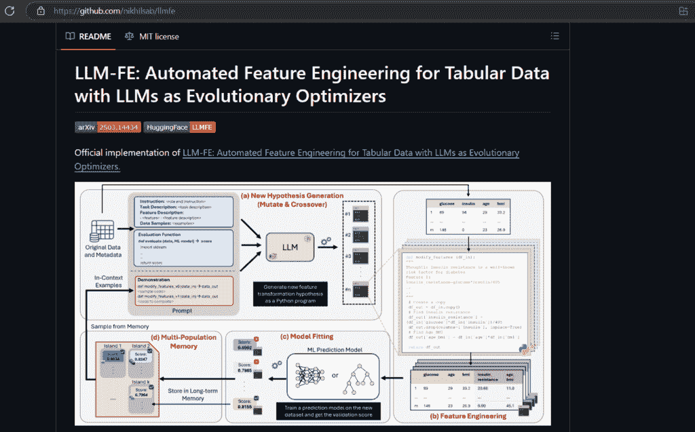
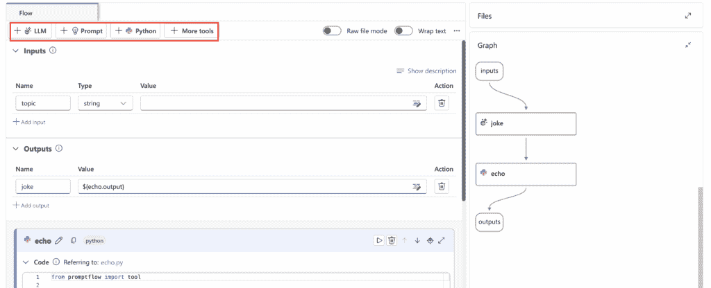

# 高级数据科学项目提示工程

> 原文：[`towardsdatascience.com/advanced-prompt-engineering-for-data-science-projects/`](https://towardsdatascience.com/advanced-prompt-engineering-for-data-science-projects/)

<mdspan datatext="el1755634574506" class="mdspan-comment">作为一名**数据科学家**</mdspan>，你可能已经多次想过如何改进你的工作流程，如何加快任务，以及如何输出更好的结果。

**LLMs**的兴起帮助了无数的数据科学家和机器学习工程师不仅改进了他们的模型，而且帮助他们更快地迭代、学习和专注于真正重要的任务。

在这篇文章中，我要与你分享我最喜欢的提示和提示工程**技巧**，这些技巧帮助我处理数据科学和人工智能任务。

此外，不久的将来，**提示工程**将几乎成为所有数据科学和机器学习职位描述中的必备技能。

本指南将向您介绍基于研究的实用提示技术，这些技术可以加快（有时甚至自动化）您机器学习工作流程的每个阶段。

这是关于数据科学提示工程的一系列**3 篇文章**中的第二篇：

+   **第一部分:** [提示工程用于规划、清理和 EDA](https://towardsdatascience.com/become-a-better-data-scientist-with-these-prompt-engineering-hacks/)

+   **第二部分:** 提示工程用于特征、建模和评估（本文）

+   **第三部分:** 提示工程用于文档、DevOps 和学习

👉本文中所有的**提示**都可在文章末尾作为速查表找到 😉

在本文中：

1.  首要事项：什么是一个好的提示？

1.  提示工程用于特征、建模和评估

1.  提示工程速查表

* * *

## 首要事项：什么是一个好的提示？

你可能已经知道了，但总是刷新我们的思维是件好事。让我们来分解一下。

### 高质量提示的解剖结构

**角色与任务**

首先，告诉 LLM 它是谁以及它需要做什么。例如：

```py
"You are a senior data scientist with experience in feature engineering, data cleaning and model deployment".)
```

**上下文与约束**

这部分非常重要。尽可能添加细节和上下文。

**专业技巧:** 在同一个提示中添加所有细节和上下文。事实证明，这样做效果最好。

这包括：数据类型和格式、数据来源和来源、样本架构、输出格式、详细程度、结构、语气和风格、令牌限制、计算规则、领域知识等。

**示例或测试**

给它一些示例来遵循，甚至单元测试来检查输出。

示例 — 摘要的格式化风格

```py
**Input:**
Transaction: { "amount": 50.5, "currency": "USD", "type": "credit", "date": "2025-07-01" }

**Desired Output:**
- Date: 1 July 2025
- Amount: $50.50
- Type: Credit 
```

**评估钩子**

让它对自己的回答进行评分，解释其推理，或输出一个置信度分数。

### 其他提示技巧

清晰的分隔符（`##`）使部分内容易于浏览。请随时使用它们！

在数据之前放置您的指令，并用清晰的分隔符（如三重反引号）包裹上下文。

例如：`## 这些是我的指令`

尽可能具体。比如说“返回一个 Python 列表”或“只输出有效的 SQL。”

对于需要一致输出的任务，请保持**温度**低（≤0.3），但对于创意任务如特征头脑风暴，你可以增加它。

如果你处于**预算限制**，可以使用更便宜的模型来快速产生想法，然后切换到高级版本来完善最终版本。

## 特征、建模和评估的提示工程

### 1. 文本特征

使用正确的提示，LLM 可以立即生成一组多样化的语义、基于规则或语言特征，包括你可以审查后直接插入工作流程的实用示例。

**模板：单变量文本特征头脑风暴**

```py
## Instructions
Role: You are a feature-engineering assistant.  
Task: Propose 10 candidate features to predict {target}.  

## Context
Text source: """{doc_snippet}"""  
Constraints: Use only pandas & scikit-learn. Avoid duplicates.  

## Output
Markdown table: [FeatureName | FeatureType | PythonSnippet | NoveltyScore(0–1)]  

## Self-check
Rate your confidence in coverage (0–1) and explain in ≤30 words. 
```

**专业提示：**

+   将此与嵌入相结合以创建密集特征。

+   在使用之前，在沙箱环境中验证输出的 Python 代码片段（这样你可以捕捉到语法错误或不匹配的数据类型）。

### 2. 表格特征

手动特征工程通常不是很有趣。特别是对于表格数据，这个过程可能需要几天时间，并且通常非常主观。

像这样的工具**[LLM-FE](https://github.com/nikhilsab/llmfe)**采取了不同的方法。它们将 LLM 视为**进化优化器**，通过迭代发明和改进特征，直到性能得到提升。

由弗吉尼亚理工大学的研究人员开发，LLM-FE 在循环中工作：

1.  LLM 基于现有数据集模式提出了一种新的转换。

1.  候选特征使用简单的下游模型进行测试。

1.  最有希望的特征被保留、改进或组合（就像在遗传算法中一样，但由自然语言提示提供动力）。

与手动特征工程相比，这种方法已经显示出非常好的性能。



LLM-FE 框架的架构，其中大型语言模型充当进化优化器。来源：[nikhilsab/LLMFE：这是论文“LLM-FE”的官方仓库](https://github.com/nikhilsab/llmfe)

**提示（LLM-FE 风格）：**

```py
## Instructions
Role: Evolutionary feature engineer.  
Task: Suggest ONE new feature from schema {schema}.  
Fitness goal: Max mutual information with {target}.  

## Output
JSON: { "feature_name": "...", "python_expression": "...", "reasoning": "... (≤40 words)" }  

## Self-check
Rate novelty & expected impact on target correlation (0–1). 
```

### 3. 时间序列特征

如果你曾经遇到过时间序列数据中的季节性趋势或突然的峰值，你就知道处理所有这些移动部件可能很困难。

**[TEMPO](https://github.com/DC-research/TEMPO?utm_source=chatgpt.com)**是一个项目，它允许你一步完成分解和预测，因此可以节省你数小时的手动工作。

**季节性感知提示：**

```py
## Instructions
System: You are a temporal data scientist.  
Task: Decompose time series {y_t} into components.  

## Output
Dict with keys: ["trend", "seasonal", "residual"]  

## Extra
Explain detected change-points in ≤60 words.  
Self-check: Confirm decomposition sums ≈ y_t (tolerance 1e-6). 
```

**4. 文本嵌入特征**

下一个提示的想法相当直接：我正在提取文档中的关键见解，这些见解对于试图理解他们所处理内容的人来说实际上是有用的。

```py
## Instructions
Role: NLP feature engineer
Task: For each doc, return sentiment_score, top3_keywords, reading_level.

## Constraints
- sentiment_score in [-1,1] (neg→pos)
- top3_keywords: lowercase, no stopwords/punctuation, ranked by tf-idf (fallback: frequency)
- reading_level: Flesch–Kincaid Grade (number)

## Output
CSV with header: doc_id,sentiment_score,top3_keywords,reading_level

## Input
docs = [{ "doc_id": "...", "text": "..." }, ...]

## Self-check
- Header present (Y/N)
- Row count == len(docs) (Y/N) 
```

我不是只给你一个基本的“正面/负面”分类，我使用介于-1 和 1 之间的连续分数，这为你提供了更多的细微差别。

对于关键词提取，我选择了**TF-IDF**排名，因为它实际上在揭示每个文档中最相关的术语方面表现得非常好。

### 代码生成与自动化机器学习

选择正确的模型、构建管道和调整参数——这是机器学习的神圣三位一体，但也是可能消耗数天工作的部分。

LLMs 是这一领域的颠覆者。我不再需要坐在这里比较数十个模型或手动编写另一个预处理管道，我只需描述我想做什么，就能得到可靠的推荐。

**模型选择提示模板：**

```py
## Instructions
System: You are a senior ML engineer.  
Task: Analyze preview data + metric = {metric}.  

## Steps
1\. Rank top 5 candidate models.  
2\. Write scikit-learn Pipeline for the best one.  
3\. Propose 3 hyperparameter grids.  

## Output
Markdown with sections: [Ranking], [Code], [Grids]  

## Self-check
Justify top model choice in ≤30 words. 
```

你不必止步于排名和管道。

你还可以调整这个提示，从一开始就包括模型**可解释性**。这意味着要求 LLM 解释**为什么**它以某种顺序对模型进行排名或训练后输出特征重要性（SHAP 值）。

这样一来，你不仅得到了一个黑盒推荐，还得到了背后的清晰推理。

**附加内容（Azure ML 版本）**

如果你使用 Azure Machine Learning，这将对你很有用。

使用**[AutoMLStep](https://learn.microsoft.com/en-us/python/api/azureml-pipeline-steps/azureml.pipeline.steps.automlstep?view=azure-ml-py)**，你可以在 Azure ML 管道中将整个自动化机器学习实验（模型选择、调整、评估）封装成一个模块化步骤。你将能够访问版本控制、调度和轻松重复运行。

你还可以利用**[Prompt Flow](https://learn.microsoft.com/en-us/azure/machine-learning/prompt-flow/overview-what-is-prompt-flow?view=azureml-api-2)**：它为这个系统添加了一个基于节点的可视化层。功能包括拖放 UI、流程图、提示测试、分支逻辑和实时评估：



Azure AI Foundry 的 Prompt Flow 编辑器中简单管道的示例，其中不同的工具——如 LLM 工具和 Python 工具——被链接在一起。来源：[Azure AI Foundry 门户中的 Prompt flow – Azure AI Foundry | Microsoft Learn](https://learn.microsoft.com/en-us/azure/ai-foundry/concepts/prompt-flow)

你也可以将**Prompt Flow**直接集成到你正在运行的任何系统中，然后你的 LLM 和 AutoML 组件将无缝协同工作。一切都在一个可实际部署的自动化设置中流畅进行。

### 精调提示

微调大型模型并不总是意味着从头开始重新训练（谁有那么多时间？）。

相反，你可以使用轻量级技术，如**[LoRA](https://www.ibm.com/think/topics/lora)**（低秩适应）和[**PEFT**](https://www.ibm.com/think/topics/parameter-efficient-fine-tuning)（参数高效微调）。

**LoRA**

因此，LoRa 实际上非常聪明，因为它不是从头开始重新训练一个大型模型，而是在现有的基础上添加了微小的可训练层。大部分原始模型保持冻结状态，你只需调整这些小的权重矩阵，使其按照你的意愿工作。

**PEFT**

PEFT 基本上是所有这些智能方法的统称（LoRA 只是其中之一），你只训练模型参数的一小部分，而不是整个庞大的东西。

计算节省是惊人的。过去需要花费很长时间和大量成本的事情，现在运行得更快更便宜，因为你几乎没有触及到模型的大部分内容。

最好的事情是：你甚至不需要自己编写这些微调**脚本**了。**LLMs**实际上可以为你生成代码，并且随着时间的推移，通过学习你模型的性能，它们会变得越来越好。

**微调对话提示**

```py
## Instructions
Role: AutoTunerGPT.  
Signature: base_model, task_dataset → tuned_model_path.  
Goal: Fine-tune {base_model} on {task_dataset} using PEFT-LoRA.

## Constraints
- batch_size ≤ 16, epochs ≤ 5  
- Save to ./lora-model  
- Use F1 on validation; set seed=42; enable early stopping (no val gain 2 epochs)

## Output
JSON:
{
  "tuned_model_path": "./lora-model",
  "train_args": { "batch_size": ..., "epochs": ..., "learning_rate": ..., "lora_r": ..., "lora_alpha": ..., "lora_dropout": ... },
  "val_metrics": { "f1_before": ..., "f1_after": ... },
  "expected_f1_gain": ...
}

## Self-check
- Verify constraints respected (Y/N).  
- If N, explain in ≤20 words. 
```

**工具提示：** 使用**[DSPy](https://dspy.ai/)**来改进这个过程。DSPy 是一个用于构建**自我改进**管道的开源框架。这意味着它可以自动重写提示，强制执行约束（如批量大小或训练轮数），并跟踪多次运行中的每个变化。

在实践中，你今天可以运行微调作业，明天审查结果，系统将自动调整你的提示和训练设置以获得更好的结果，而无需从头开始！

## 让大型语言模型评估你的模型

**更智能的评估提示**

研究表明，当由良好的提示引导时，LLM 的预测得分几乎与人类相似。

这里有一些提示可以帮助你提升评估过程：

**单例评估提示**

```py
## Instructions
System: Evaluation assistant.  
User: Ground truth = {truth}; Prediction = {pred}.

## Criteria
- factual_accuracy ∈ [0,1]: 1 if semantically equivalent to truth; 0 if contradictory; partial if missing/extra but not wrong.  
- completeness ∈ [0,1]: fraction of required facts from truth present in pred.

## Output
JSON:
{ "accuracy": <float>, "completeness": <float>, "explanation": "<≤40 words>" }

## Self-check
Cite which facts were matched/missed in ≤15 words. 
```

**交叉验证代码**

```py
## Instructions
You are CodeGenGPT.

## Task
Write Python to:
- Load train.csv
- Stratified 80/20 split
- Train LightGBM on {feature_list}
- Compute & log ROC-AUC (validation)

## Constraints
- Assume label column: "target"
- Use sklearn for split/metric, lightgbm.LGBMClassifier
- random_state=42, test_size=0.2
- Return ONLY a Python code block (no prose)

## Output
(only code block) 
```

**回归判断**

```py
## Instructions
System: Regression evaluator
Input: Truth={y_true}; Prediction={y_pred}

## Rules
abs_error = mean absolute error over all points
Let R = max(y_true) - min(y_true)
Category:
- "Excellent" if abs_error ≤ 0.05 * R
- "Acceptable" if 0.05 * R < abs_error ≤ 0.15 * R
- "Poor" if abs_error > 0.15 * R

## Output
{ "abs_error": <float>, "category": "Excellent/Acceptable/Poor" }

## Self-check (brief)
Validate len(y_true)==len(y_pred) (Y/N) 
```

### 故障排除指南：提示版

如果你遇到这三个问题中的任何一个，这里是如何修复它们的方法：

| 问题 | 症状 | 解决方案 |
| --- | --- | --- |
| 幻觉特征 | 使用不存在的列 | 在提示中添加模式 + 验证 |
| 过多的“创意”代码 | 不稳定的管道 | 设置库限制 + 添加测试片段 |
| 评估漂移 | 分数不一致 | 设置 temp=0，记录提示版本 |

## 总结

自从 LLM 变得流行以来，提示工程已经正式升级。现在，它是一个真正且严肃的方法，触及到 ML 和 DS 工作流程的每个部分。这就是为什么 AI 研究的大部分内容都集中在如何改进和优化提示上。

最后，更好的**提示工程**意味着更好的**输出**和节省大量的**时间**。我想这是任何数据科学家的**梦想**😉

* * *

感谢阅读！

👉 获取包含本文所有提示的**提示工程速查表**。当你订阅[**Sara 的 AI 自动化摘要**](https://saranfn.substack.com/)时，我会发给你。你还将获得访问 AI 工具库和我的每周免费 AI 自动化通讯的机会！

感谢阅读！😉

* * *

我在这里提供关于职业成长和转型的**指导**[`topmate.io/sara_nobrega`](https://topmate.io/sara_nobrega)。

**如果你想支持我的工作**，你可以**买我最喜欢的咖啡**（[`buymeacoffee.com/saranobregu`](https://buymeacoffee.com/saranobregu)）：卡布奇诺。😊

### 参考文献

[什么是 LoRA（低秩适配）？| IBM](https://www.ibm.com/think/topics/lora)

[ChatGPT 数据科学项目使用指南 | DataCamp](https://www.datacamp.com/tutorial/chatgpt-data-science-projects)
