# 考虑性能的 DAX 中高级时间智能

> 原文：[`towardsdatascience.com/advanced-time-intelligence-in-dax-with-performance-in-mind/`](https://towardsdatascience.com/advanced-time-intelligence-in-dax-with-performance-in-mind/)

我们都知道基于年、季度、月份和日子的常规时间智能函数。但有时，我们需要执行更复杂的时间智能计算。但我们不应忘记在编写度量时考虑性能。

## 简介

**更新 27.** **2025 年 12 月**：随着基于日历的时间智能的出现，这里提出的几个解决方案已经过时。

您可以在此处了解更多信息：

[`towardsdatascience.com/use-cases-for-the-new-calendar-based-time-intelligence/`](https://towardsdatascience.com/use-cases-for-the-new-calendar-based-time-intelligence/)

但新的方法仍然存在一些缺陷。因此，我保留了这个方法。

—– 更新结束 —-

Power BI 中有许多用于时间智能度量的 DAX 函数。

最常见的是：

+   `<a href="https://dax.guide/dateadd/">DATEADD()</a>`

+   [DATESMTD()](https://dax.guide/datesmtd/), [DATESQTD()](https://dax.guide/datesqtd/) 和 [DATESYTD()](https://dax.guide/datesytd/) 以及快捷函数 [TOTALMTD()](https://dax.guide/totalmtd/), [TOTALQTD()](https://dax.guide/totalqtd/) 和 [TOTALYTD()](https://dax.guide/totalytd/)

+   [PARALLELPERIOD()](https://dax.guide/parallelperiod/)

+   [PREVIOUSDAY()](https://dax.guide/previousday/), [PREVIOUSMONTH()](https://dax.guide/previousmonth/), [PREVIOUSQUARTER()](https://dax.guide/previousquarter/)) 和 [PREVIOUSYEAR()](https://dax.guide/previousyear/)

+   [SAMEPERIODLASTYEAR()](https://dax.guide/sameperiodlastyear/)

您可以在此处找到时间智能函数的完整列表：[时间智能 – DAX 指南](https://dax.guide/functions/time-intelligence/)。这些函数涵盖了最常见的案例。

然而，某些要求无法轻易用这些函数覆盖。这就是我们所在的位置。

我想介绍我在项目中遇到的一些情况，包括：

+   最后 n 个期间及其变体

+   如何应对闰年

+   本周计算

+   计算每周总和

+   财政周至今

我将向您展示如何使用扩展日期表来支持这些场景并提高效率和性能。

大多数时间智能函数无论财政年度是否与日历年度对齐都适用。一个例外是年度至今（YTD）。

对于此类情况，请查看上面提到的 DATESYTD() 函数。在那里，您将找到传递财政年度最后一天的可选参数。

最后一个案例将涵盖基于周的计算，而财政年度不与日历年度对齐。

## 场景

我将使用知名的 ContosoRetailDW 数据模型。

基础度量是线上销售额总和，其代码如下：

```py
Sum Online Sales = SUMX('Online Sales',
 ( 'Online Sales'[UnitPrice]
            * 'Online Sales'[SalesQuantity] ) 
                         - 'Online Sales'[DiscountAmount] )
```

我将几乎完全在[DAX-Studio](https://www.sqlbi.com/tools/dax-studio/)中工作，它提供了服务器时间功能来分析 DAX 代码的性能。在下面的参考文献部分，您可以找到一篇关于如何在 DAX Studio 中收集和解释性能数据的文章链接。

这是我在示例中用于从数据模型获取一些数据的基线查询：

```py
EVALUATE 
 CALCULATETABLE( 
 SUMMARIZECOLUMNS('Date'[Year] 
 ,'Date'[Month Short Name] 
,'Date'[Week] 
,'Date'[Date] 
,"Online Sales", [Sum Online Sales] 
) 
 ,'Product'[ProductCategoryName] = "Computers" ,'Product'[ProductSubcategoryName] = "Laptops" 
,'Customer'[Continent] = "North America" 
 ,'Customer'[Country] = "United States"  ,'Customer'[State/Province] = "Texas" ) 
```

在大多数示例中，我会移除一些筛选条件以获取更完整的数据（对于每一天）。

## 日期表

我的日期表包括相当多的附加列。

在下面的参考文献部分，您可以找到一些由 SQLBI 撰写的关于构建每周相关计算的文章，包括创建日期表以支持这些计算。

如下文所述的关于日期表的我的文章中，我添加了以下列：

+   索引或偏移列，用于从当前日期计算天数、周、月、季度、学期和年。

+   标志列，用于根据当前日期标记当前天、周、月、季度、学期和年。

+   这和之前的列需要每天重新计算，以确保使用正确的日期作为参考日期。

+   每周和每月的起始和结束日期（如有需要，请添加更多）。

+   财政年度的起始和结束日期。

+   包含当前期间起始和结束日期的上一年份日期。这对于周来说尤其有趣，因为每年的周起始和结束日期都不相同。

正如您将看到的，我将广泛使用这些列来简化我的计算。

此外，我们将使用日历层次结构来计算不同层次结构级别所需的结果。

一个完整的日历层次结构包含以下之一：

1.  年份

1.  学期

1.  季度

1.  月

1.  天

或者

1.  年份

1.  周

1.  天

如果财政年度与日历年度不一致，我将使用财政年度而不是日历年度来构建层次结构。

然后，我添加了一个单独的 FiscalMonthName 列和一个 FiscalMonthSort 列，以确保财政年度的第一个月首先显示。

好的，让我们从第一个案例开始。

## 过去 n 个周期

此场景计算过去 n 个周期内值的滚动总和。

例如，对于每一天，我们希望获取过去 10 天的销售额：

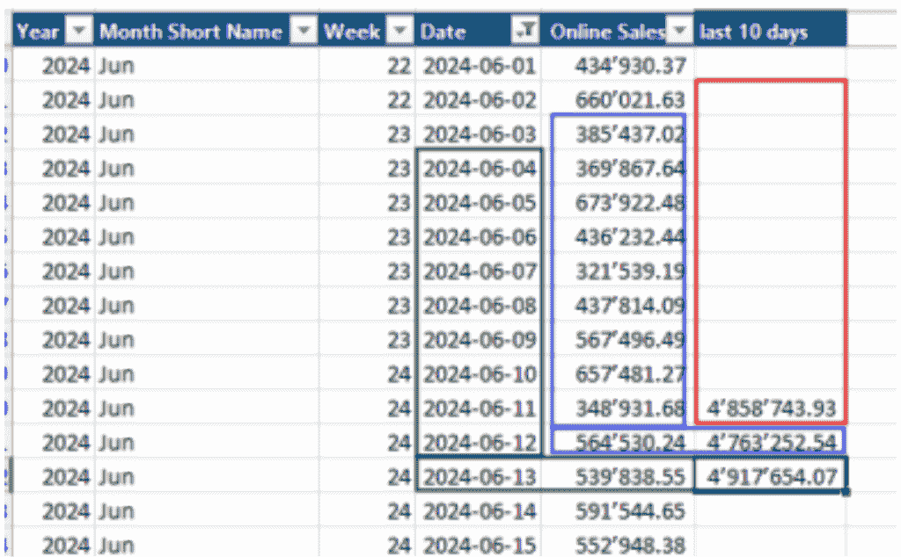

*图 1 – 过去 10 天求和示例（作者制图）*

这里是我提出的方法：

```py
Online Sales (Last 10 days) = 
        CALCULATE (
                [Sum Online Sales]
                ,DATESINPERIOD (
                    'Date'[Date],
                    MAX ( 'Date'[Date] ),
                    -10,
                    DAY
                )
            )
```

当执行查询并筛选计算机和北美时，我得到以下结果：

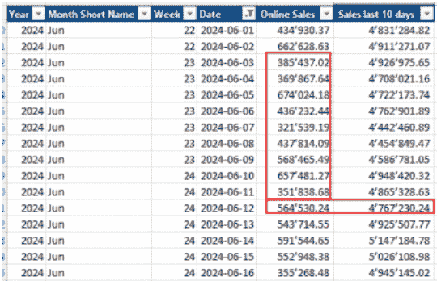

*图 2 – 过去 10 天 – 方法结果（作者制图）*

如果我查看服务器时间，结果还不错：


*图 3 – 过去 10 天的服务器时间（作者制图）*

如您所见，存储引擎完成了超过一半的工作，这是一个好兆头。它并不完美，但执行时间少于 100 毫秒，从性能角度来看仍然非常好。

这种方法有一个关键问题：

在计算跨多个月的滚动总和时，你必须知道这种方法是面向日期的。

这意味着当你查看特定时间时，它会回溯到给定月份的同一天。例如：

我们查看 2024 年 1 月 12 日，并想要计算过去三个月的滚动总和。这个计算的起始日期将是 2023 年 11 月 13 日。

我们何时想要获取整个月的滚动总和？

在上述情况下，我想将起始日期设为 2023 年 11 月 1 日。

对于这个案例，我们可以使用 MonthIndex 列。

每一列都有一个基于当前日期的唯一索引。

因此，我们可以用它回退三个月并获取整个月。

这是这个 DAX 代码：

```py
Online Sales rolling full 3 months = 
        VAR CurDate =
            MAX ( 'Date'[Date] )
        VAR CurMonthIndex =
            MAX ( 'Date'[MonthIndex] )
        VAR FirstDatePrevMonth =
            CALCULATE (
                MIN ( 'Date'[Date] ),
                REMOVEFILTERS ( 'Date' ),
                'Date'[MonthIndex] = CurMonthIndex - 2
            )
        RETURN
            CALCULATE (
                [Sum Online Sales],
                DATESBETWEEN (
                    'Date'[Date],
                    FirstDatePrevMonth,
                    CurDate
                )
            )
```

执行仍然很快，但效率较低，因为大多数计算不能由存储引擎完成：


*图 4 – 过去三个月滚动总和的服务器时间（图由作者绘制）* 如您所见，它不如之前快。

我尝试了其他方法（例如，`'Date'[MonthIndex] >= CurMonthIndex – 2 && `'Date'[MonthIndex] <= CurMonthIndex)`），但这些方法比这个更差。

这里是相同逻辑但针对最后两个月的计算结果（为了避免显示太多行）：

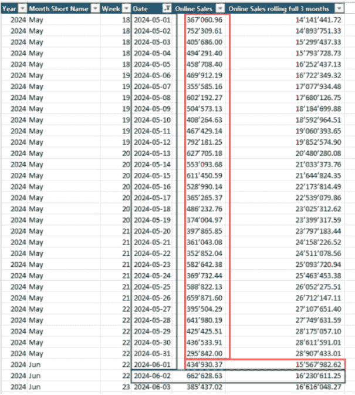

*图 5 – 过去两个整月的计算结果（图由作者绘制）*

## 关于闰年

闰年问题很奇怪，这在计算每天的上一年时很明显。让我解释一下：

当我执行以下查询以获取 2020 年和 2021 年的最后几天：

```py
EVALUATE 
CALCULATETABLE (
    SUMMARIZECOLUMNS (
        'Date'[Year],
        'Date'[Month Short Name],
        'Date'[MonthKey],
        'Date'[Day Of Month],
        "Online Sales", [Sum Online Sales],
        "Online Sales (PY)", [Online Sales (PY)]
    ),
    'Date'[Year] IN {2020, 2021},
    'Date'[Month] = 2,
    'Date'[Day Of Month] IN {27, 28, 29},
    'Customer'[Continent] = "North America",
    'Customer'[Country] = "United States"
)
    ORDER BY 'Date'[MonthKey],
        'Date'[Day Of Month]
```

我得到了以下结果：

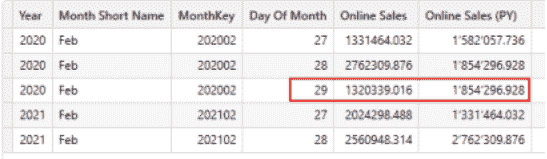

*图 6 – 闰年之后的年度每日 PY 问题（图由作者绘制）*

如您所见，2020 年 2 月 28 日的结果显示了两次，而在线销售（PY）缺少 2021 年 2 月的一天。

当查看月份时，总和是正确的：


*图 7 – 考虑闰年的正确月度总和（图由作者绘制）*

问题在于 2021 年没有 2 月 29 日。因此，在列出每日销售额时，无法显示 2020 年 2 月 29 日的销售额。

虽然结果是正确的，但当数据导出到 Excel 并求和时，每日结果的和将与整个月的显示不同。

这可能会损害用户对数据可靠性的感知。

我的解决方案是添加一个`LeapYearDate`表。这个表是日期表的副本，但没有日期列。我在每年的 2 月 29 日添加一行，即使是闰年也不例外。

然后，我为每个月和每一天添加了一个计算列（`MonthDay`）：

```py
MonthDay = ('LeapYearDate'[Month] * 100 ) + 'LeapYearDate'[Day Of Month]
```

手动计算上一年并使用新表的度量如下：

```py
Online Sales (PY Leap Year) = 
        VAR ActYear =
            SELECTEDVALUE ( 'LeapYearDate'[Year] )
        VAR ActDays =
            VALUES ( 'LeapYearDate'[MonthDay] )
        RETURN
            CALCULATE (
                [Sum Online Sales],
                REMOVEFILTERS ( LeapYearDate ),
                'LeapYearDate'[Year] = ActYear - 1,
                ActDays
            )
```

如您所见，我得到了当前年份，并通过使用[VALUES()函数](https://dax.guide/values/)，我得到了当前筛选上下文中所有日期的列表。

使用这种方法，我的度量适用于单日、月份、季度和年份。此度量结果如下：

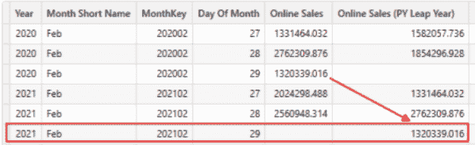

*图 8 – 自定义 PY 度量结果，始终显示闰日（图由作者提供）*

如您所见，度量非常高效，因为大部分工作都是由存储引擎完成的：

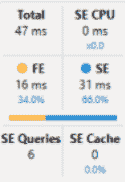

*图 9 – 自定义 PY 度量对于闰年的服务器计时（图由作者提供）*

但说实话，我不喜欢这种方法，尽管它非常有效。

原因是 LeapYearDate 表没有日期列。因此，它不能用作现有时序智能函数的日期表。

我们还必须在可视化中使用此表中的日历列。我们不能使用普通的日期表。

因此，我们必须重新发明所有时序智能函数以使用此表。

我强烈建议仅在必要时使用这种方法。

## 周到今天和 PY

一些业务领域专注于周分析。

不幸的是，标准的时序智能函数不支持开箱即用的周分析。因此，我们必须自己构建我们的周度量。

第一个度量是 WTD。

第一种方法是以下内容：

```py
Online Sales WTD v1 = 
        VAR MaxDate = MAX('Date'[Date])

        VAR CurWeekday = WEEKDAY(MaxDate, 2)

        RETURN
            CALCULATE([Sum Online Sales]
                        ,DATESBETWEEN('Date'[Date]
                                        ,MaxDate - CurWeekDay + 1
                                        ,MaxDate)
                        )
```

如您所见，我使用[`WEEKDAY()`函数](https://dax.guide/weekday/)来计算周的开始日期。然后，我使用[`DATESBETWEEN()`函数](https://dax.guide/datesbetween/)来计算 WTD。

当您将此模式应用于您的具体情况时，请确保`WEEKDAY()`函数中的第二个参数设置为正确的值。请阅读文档以了解更多信息。

结果如下：

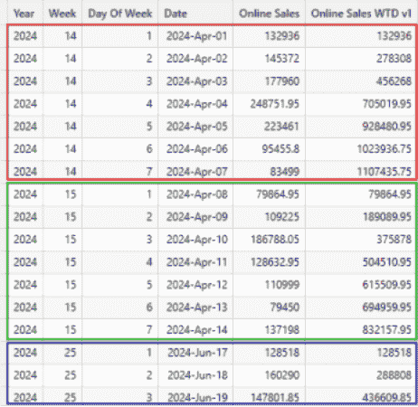

*图 10 – DAX Studio 中 WTD 的结果（图由作者提供）*

另一种方法是存储日期表中每周的第一天，并在度量中使用此信息：

```py
Online Sales WTD PY v2 = 
        VAR DayOfWeek = MAX('Date'[Day Of Week])

        VAR FirstDayOfWeek = MIN('Date'[FirstDayOfWeekDatePY])

        RETURN
            CALCULATE([Sum Online Sales]
                        ,DATESBETWEEN('Date'[Date]
                                        ,FirstDayOfWeek
                                        ,FirstDayOfWeek + DayOfWeek - 1)
                        )
```

结果完全相同。

当在 DAX Studio 中分析性能时，我发现这两个度量是可比的：


*图 11 – 左边是第一版本的执行统计信息，右边是第二版本的执行统计信息。如您所见，两者都非常相似（图由作者提供）*

我倾向于使用第二个，因为它与其他措施结合时具有更好的潜力。但最终，这取决于当前情况。

另一个挑战是计算上一年。

看看不同周同一周的以下日期：


*图 12 – 比较不同年份同一周的日期。（图由作者绘制）*

如您所见，日期发生了偏移。由于标准时间智能函数基于日期偏移，因此它们将不起作用。

我尝试了不同的方法，但最终，我在日期表中存储了上一年同一周的第一天，并像在上述 WTD 的第二个版本中一样使用它：

```py
Online Sales WTD PY = 
        VAR DayOfWeek = MAX('Date'[Day Of Week])

        VAR FirstDayOfWeek = MIN('Date'[FirstDayOfWeekDatePY])

        RETURN
            CALCULATE([Sum Online Sales]
                        ,DATESBETWEEN('Date'[Date]
                                        ,FirstDayOfWeek
                                        ,FirstDayOfWeek + DayOfWeek - 1)
                        )
```

这是结果：

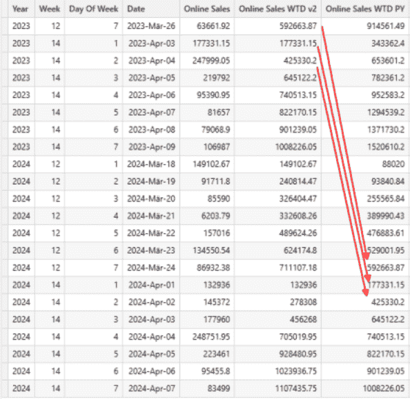

*图 13 – WTD PY 度量的结果。（图由作者绘制）*

由于逻辑与 WTD v2 相同，性能也相同。因此，这个度量非常高效。

## PY 的周汇总

有时，周视图就足够了，我们不需要在每日级别计算 WTD。

对于当前年份，我们不需要 WTD 度量来处理这种情况。基于周的基度量可以覆盖这一点。结果直接正确。

但，同样，对于 PY 来说又是另一回事。

这是我想出的第一个版本：

```py
Online Sales (PY Weekly) v1 = 
        VAR ActYear = MAX('Date'[Year])

        RETURN
            CALCULATE([Sum Online Sales]
                        ,ALLEXCEPT('Date'
                                    ,'Date'[Week]
                                    )
                        ,'Date'[Year] = ActYear - 1
                        )
```

在这里，我在保留当前周过滤器的条件下从当前年份减去 1。这是结果：


*图 14 – 整周 WTD PY 的结果。注意每周最后一天的 WTD 结果对应于 PY 值。（图由作者绘制）*

性能良好，但我可以做得更好。

如果我能在日期列中存储一个唯一的周标识符怎么办？

例如，当前周是 2025 年的第 9 周。

标识符将是 202509。

当我从它减去 100 时，我得到 202409，这是上一年同一周的标识符。在将此列添加到日期表后，我可以将度量更改为以下内容：

```py
MEASURE 'All Measures'[Online Sales (PY Weekly) v2 = 
	VAR WeeksPY = VALUES('Date'[WeekKeyPY])

RETURN
	CALCULATE([Sum Online Sales]
			,REMOVEFILTERS('Date')
			,'Date'[WeekKey] IN WeeksPY
			)
```

这个版本比以前简单得多，结果仍然相同。

当我们比较两个版本的执行统计时，我们看到：


*图 15 – 比较两个版本 WTD PY 整周执行统计的结果。左边是 V1，右边是 V2。（图由作者绘制）*

如您所见，第二个版本，在日期表中具有预先计算的列，效率略高。我只有四个 SE 查询，这是提高效率的好兆头。

## 财周 YTD

这最后一个有点棘手。

用户的要求是希望从财年第一周的第一天开始查看 YTD。

例如，财年从 7 月 1 日开始。

在 2022 年，包含 7 月 1 日的周从 6 月 27 日星期一开始。

这意味着 YTD 计算必须从这一日期开始。

同样适用于从 2021 年 6 月 28 日星期一开始的 YTD PY 计算。

当可视化数据时，这种方法有一些后果。

再次强调，知道结果是否需要在日或周级别显示至关重要。当在日级别显示数据时，选择财政年度时结果可能会令人困惑。

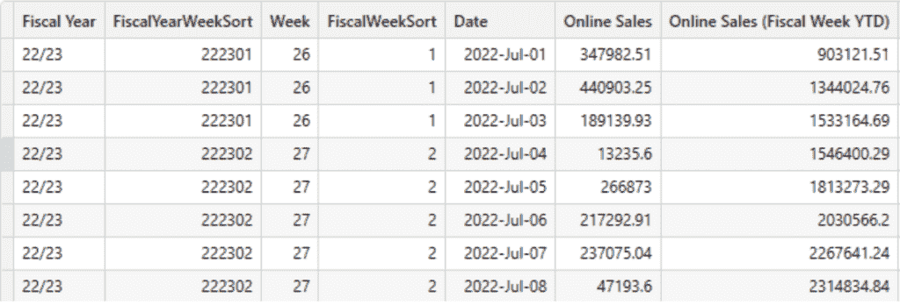

*图 16 – 财政年度 22/23 基于周度的 YTD 结果（作者制图）*

如您所见，周五是财政年度的第一天。YTD 结果不是从 7 月 1 日开始，而是从那一周的周一开始。

结果是 YTD 似乎没有正确开始。用户必须知道他们正在看什么。

对于 YTD PY 结果同样适用。

为了方便计算，我在日期表中添加了更多列：

+   FiscalYearWeekYear—这个字段包含财政年度的数值表示（对于 23/24，我得到 2324），从财政年度的第一周开始。

+   FiscalYearWeekYearPY – 与之前相同，但针对上一年（FiscalYearWeekYear – 101）。

+   FiscalWeekSort—这个排序列以财政年度的第一天开始一周。更详细地使用这个列的方法可能是遵循 ISO-周定义，但我没有这样做，以保持其更简单。

+   FiscalYearWeekSort – 与之前相同，但前面加上 FiscalYearWeekYear（例如 232402）。

+   FirstDayOfWeekDate – 当前日期所在周的周一的日期。

这里是每日累计(YTD)的度量方法：

```py
Online Sales (Fiscal Week YTD) =
        VAR FiscalYearWeekYear = MAX('Date'[FiscalYearWeekYear])

        VAR StartFiscalYear = CALCULATE(MIN('Date'[Date])
                                        ,REMOVEFILTERS('Date')
                                        ,'Date'[FiscalYearWeekSort] = FiscalYearWeekYear * 100 + 1
                                        )

        VAR FiscalYearStartWeekDate = CALCULATE(MIN('Date'[FirstDayOfWeekDate])
                                            ,ALLEXCEPT('Date'
                                                        ,'Date'[FiscalYearWeekYear]
                                                        )
                                            ,'Date'[Date] = StartFiscalYear
                                            )

        VAR MaxDate = MAX('Date'[Date])

        RETURN
            CALCULATE([Sum Online Sales]
                        ,REMOVEFILTERS('Date')
                        ,DATESBETWEEN('Date'[Date]
                                        ,FiscalYearStartWeekDate
                                        ,MaxDate
                                        )
                        )
```

这里是每日 YTD PY 的 DAX 代码：

```py
Online Sales (Fiscal Week YTD) (PY) =
        VAR FiscalYearWeekYear = MAX('Date'[FiscalYearWeekYear])

        -- Get the Week/Weekday at the start of the current Fiscal Year
        VAR FiscalYearStart = CALCULATE(MIN('Date'[Date])
                                        ,REMOVEFILTERS('Date')
                                        ,'Date'[FiscalYearWeekSort] = FiscalYearWeekYear * 100 + 1
                                        )

        VAR MaxDate = MAX('Date'[Date])

        -- Get the number of Days since the start of the FiscalYear
        VAR DaysFromFiscalYearStart =
            DATEDIFF( FiscalYearStart, MaxDate, DAY )

        -- Get the PY Date of the Fiscal Year Week Start date 
        VAR DateWeekStartPY = CALCULATE(MIN('Date'[Date])
                                        ,REMOVEFILTERS('Date')
                                        ,'Date'[FiscalYearWeekSort] = (FiscalYearWeekYear - 101) * 100 + 1
                                        )

        RETURN
            CALCULATE(
                [Sum Online Sales],
                DATESBETWEEN(
                    'Date'[Date],
                    DateWeekStartPY,
                    DateWeekStartPY + DaysFromFiscalYearStart
                )
            ) 
```

如您所见，这两个度量遵循相同的模式：

1.  获取当前财政年度。

1.  获取当前财政年度的起始日期。

1.  获取财政年度开始的那一周的起始日期。

1.  根据这两个日期之间的差异计算结果

对于 PY 度量，需要额外一步：

+   计算起始日期和当前日期之间的天数，以计算正确的 YTD。这是由于年份之间的日期变动所必需的。

这里是每周基础 YTD 的 DAX 代码：

```py
Online Sales (Fiscal Week YTD) =
        VAR FiscalWeekSort = MAX( 'Date'[FiscalWeekSort] )

        -- Get the Week/Weekday at the start of the current Fiscal Year
        VAR FiscalYearNumber = MAX( 'Date'[FiscalYearWeekYear] )

        RETURN
            CALCULATE(
                [Sum Online Sales],
                REMOVEFILTERS('Date'),
                'Date'[FiscalYearWeekSort] >= (FiscalYearNumber * 100 ) + 1
                    && 'Date'[FiscalYearWeekSort] <= (FiscalYearNumber * 100 ) + FiscalWeekSort
            )
```

对于周度 YTD PY，DAX 代码如下：

```py
Online Sales (Fiscal Week YTD) (PY) =
        VAR FiscalWeekSort = MAX( 'Date'[FiscalWeekSort] )

        -- Get the Week/Weekday at the start of the current Fiscal Year
        VAR FiscalYearNumberPY = MAX( 'Date'[FiscalYearWeekYearPY] )

        RETURN
            CALCULATE(
                [Sum Online Sales],
                REMOVEFILTERS('Date'),
                'Date'[FiscalYearWeekSort] >= (FiscalYearNumberPY * 100) + 1
                    && 'Date'[FiscalYearWeekSort] <= (FiscalYearNumberPY * 100) + FiscalWeekSort
            )
```

再次强调，这两个度量遵循相同的模式：

1.  获取财政年度中当前（排序）周数。

1.  获取财政年度第一周的开始日期。

1.  根据这些值计算结果。

基于周度的度量结果如下（在周级别，因为值对于同一周内的每一天都是相同的）：

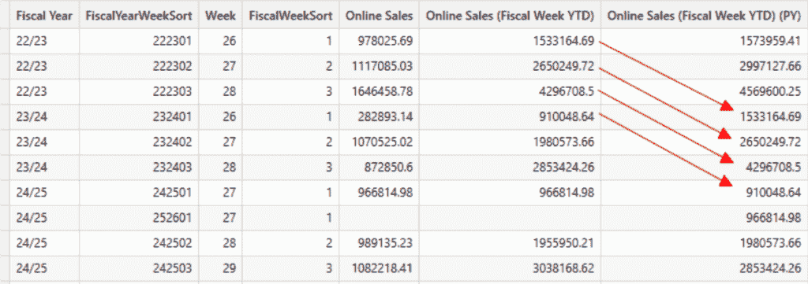

*图 17 – 财政年度每年前三周的基于周度和 PY 度量的结果（作者制图）*

当比较这两种方法时，周度计算的度量比日度计算更高效：

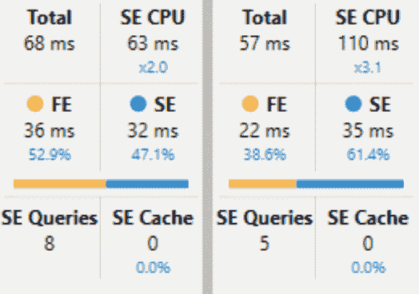

*图 18 – 比较两个度量值的执行统计。左边是每日的，右边是周计算。它们对于当前年和上一年度的计算是相同的（图由作者绘制）*

如您所见，周结果的度量值更快，有更大比例在存储引擎（SE）中执行，并且 SE 查询更少。

因此，询问用户他们是否需要按日级别的 WTD 结果，或者是否足够看到周级别的结果，可能是个好主意。

## 结论

当你开始编写时间智能表达式时，考虑你的日期表中是否可以添加额外的计算列以有所帮助。

一个精心制作并扩展的日期表可以从两个原因上有所帮助：

+   使度量值更容易编写

+   提高度量值的性能

由于我不需要执行计算以获取中间结果来计算所需结果，因此它们将更容易编写。

简短且简单的度量值的结果是更好的效率和性能。

随着我遇到更多可以使用这些列的情况，我将在日期表的模板中添加更多列。

剩下一个问题：如何构建它？

在我的情况下，我使用 Azure SQL 数据库创建了我示例中使用的表。

但你可以创建一个日期表作为 DAX 表，或者使用 Fabric 中的 Python 或 JavaScript，或者使用你使用的任何数据平台。

另一个选项是使用 SQLBI 的 Bravo 工具，该工具允许你创建一个包含额外列的 DAX 表，以支持异类的时间智能场景。

## 参考文献

你可以在[这里](https://contributor.insightmediagroup.io/3-ways-to-improve-your-reporting-with-an-expanded-date-table-2d983d76cced/)找到更多关于我的日期表信息。

阅读这篇[文章](https://medium.com/towards-data-science/how-to-get-performance-data-from-power-bi-with-dax-studio-b7f11b9dd9f9)，了解如何在 DAX-Studio 中提取性能数据以及如何解释它。

一篇关于构建日期表以支持周计算的[SQLBI 文章](https://www.sqlbi.com/articles/using-weekly-calendars-in-power-bi/)：在 Power BI 中使用周历 – SQLBI

用于执行进一步周计算的 SQLBI 模式：

周相关计算 – [DAX 模式](https://www.daxpatterns.com/week-related-calculations/)

如同我之前的文章，我使用 Contoso 样本数据集。您可以从 Microsoft [这里](https://www.microsoft.com/en-us/download/details.aspx?id=18279)免费下载 ContosoRetailDW 数据集。

根据 MIT 许可证，Contoso 数据可以自由使用，具体描述[这里](https://github.com/microsoft/Power-BI-Embedded-Contoso-Sales-Demo)。

我更改了数据集，以便将数据移至当代日期。
