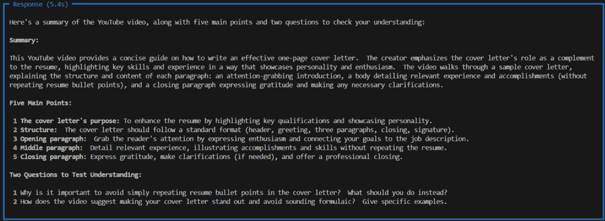
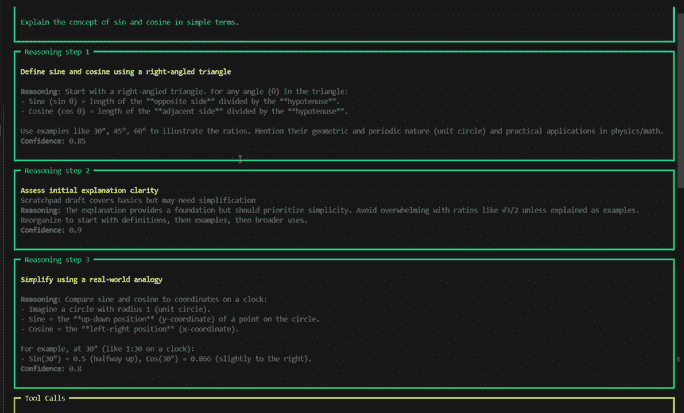
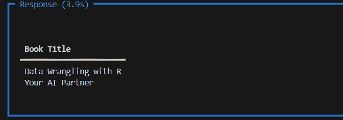
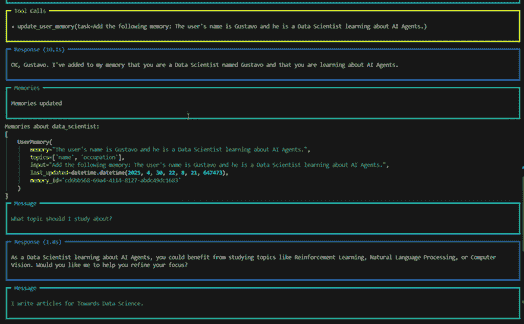

# 代理 AI 101：开始构建 AI 代理的旅程

> 原文：[`towardsdatascience.com/agentic-ai-101-starting-your-journey-building-ai-agents/`](https://towardsdatascience.com/agentic-ai-101-starting-your-journey-building-ai-agents/)

## <mdspan datatext="el1746162647083" class="mdspan-comment">简介</mdspan>

人工智能行业正在快速发展。它令人印象深刻，很多时候也令人感到压倒性。

我一直在学习、学习和在这个数据科学领域建立我的基础，因为我相信数据科学的未来与生成式 AI 的发展密切相关。

就在几天前，我构建了我的第一个 AI 代理，然后在那之后的几周里，就有几个 Python 包可供选择，更不用说那些表现良好的无代码选项了，比如*n8n*。

从只能与我们聊天的“普通”模型到无处不在的 AI 代理的“海啸”，它们在互联网上搜索，处理文件，甚至进行整个数据科学项目（从数据探索到建模和评估），所有这些都在短短几年内发生。

**什么？**

看到这一切，我的想法是：“我需要尽快加入”。毕竟，冲浪总比被吞噬要好。

由于这个原因，我决定开始这个系列文章，我计划从基础知识开始，构建我们的第一个 AI 代理，直到更复杂的概念。

谈话到此为止，让我们深入探讨。

## AI 代理的基本知识

当我们赋予 LLM 与工具交互和为我们执行有用行动的能力时，就创建了一个 AI 代理。所以，它不仅仅是一个聊天机器人，现在它可以安排约会，管理我们的日历，搜索互联网，撰写社交媒体帖子，等等……

> AI 代理可以做一些有用的事情，而不仅仅是聊天。

但我们如何将这种能力赋予 LLM 呢？

简单的答案是使用 API 与 LLM 交互。现在有几个 Python 包可以做到这一点。如果你关注我的博客，你会看到我已经尝试过几个包来构建代理：Langchain、Agno（前 PhiData）和 CrewAI，例如。对于这个系列，我将坚持使用 Agno [1]。

首先，使用`uv`、Anaconda 或你偏好的环境管理器设置一个虚拟环境。接下来，安装包。

```py
# Agno AI
pip install agno

# module to interact with Gemini
pip install google-generativeai

# Install these other packages that will be needed throughout the tutorial
 pip install agno groq lancedb sentence-transformers tantivy youtube-transcript-api
```

在我们继续之前，快速提醒一下。别忘了获取一个 Google Gemini API 密钥[2]。

创建一个简单的代理非常简单。所有的包都非常相似。它们都有一个`Agent`类或类似的类，允许我们选择一个模型并开始与我们的选择 LLM 交互。以下是这个类的主要组件：

+   `model`：与 LLM 的连接。在这里，我们将选择 OpenAI、Gemini、Llama、Deepseek 等。

+   `description`：这个参数让我们描述代理的行为。这被添加到`system_message`中，这是一个类似的参数。

+   `instructions`: 我喜欢将智能体想象成我们管理的员工或助手。为了完成任务，我们必须提供需要完成的说明。这里就是你可以做的地方。

+   `expected_output`: 这里我们可以给出关于预期输出的说明。

+   `tools`: 这使得 LLM 成为一个智能体，使其能够通过这些工具与真实世界互动。

现在，让我们创建一个没有工具的简单智能体，但将有助于我们了解代码结构。

```py
# Imports
from agno.agent import Agent
from agno.models.google import Gemini
import os

# Create agent
agent = Agent(
    model= Gemini(id="gemini-1.5-flash",
                  api_key = os.environ.get("GEMINI_API_KEY")),
    description= "An assistant agent",
    instructions= ["Be sucint. Answer in a maximum of 2 sentences."],
    markdown= True
    )

# Run agent
response = agent.run("What's the weather like in NYC in May?")

# Print response
print(response.content)
```

```py
########### OUTPUT ###############
Expect mild temperatures in NYC during May, typically ranging from the low 50s 
to the mid-70s Fahrenheit.  
There's a chance of rain, so packing layers and an umbrella is advisable.
```

那太棒了。我们正在使用 Gemini 1.5 模型。注意它是如何根据训练数据做出响应的。如果我们要求它告诉我们今天的天气，我们会看到一个响应说它无法访问互联网。

让我们探索`instructions`和`expected_output`参数。我们现在想要一个包含月份、季节和纽约市平均温度的表格。

```py
# Imports
from agno.agent import Agent
from agno.models.google import Gemini
import os

# Create agent
agent = Agent(
    model= Gemini(id="gemini-1.5-flash",
                  api_key = os.environ.get("GEMINI_API_KEY")),
    description= "An assistant agent",
    instructions= ["Be sucint. Return a markdown table"],
    expected_output= "A table with month, season and average temperature",	
    markdown= True
    )

# Run agent
response = agent.run("What's the weather like in NYC for each month of the year?")

# Print response
print(response.content) 
```

结果就在这里。

| 月份 | 季节 | 平均温度（°F） |
| --- | --- | --- |
| 一月 | 冬季 | 32 |
| 二月 | 冬季 | 35 |
| 三月 | 春季 | 44 |
| 四月 | 春季 | 54 |
| 五月 | 春季 | 63 |
| 六月 | 夏季 | 72 |
| 七月 | 夏季 | 77 |
| 八月 | 夏季 | 76 |
| 九月 | 秋季 | 70 |
| 十月 | 秋季 | 58 |
| 十一月 | 秋季 | 48 |
| 十二月 | 冬季 | 37 |

## 工具

之前的回复很棒。但自然地，我们不想使用像 LLM 这样的强大模型来与聊天机器人玩耍或告诉我们旧新闻，对吧？

我们希望它们成为自动化、生产力和知识的桥梁。因此，**工具**将为我们的 AI 智能体添加功能，从而建立与真实世界的桥梁。智能体常用的工具示例包括：搜索网络、运行 SQL、发送电子邮件或调用 API。

但不仅如此，我们可以通过使用任何 Python 函数作为工具来为我们的智能体创建自定义功能。

> **工具**是智能体可以运行的函数，以实现任务。

在代码方面，向智能体添加工具只是使用`Agent`类中的`tools`参数的问题。

想象一下，一个健康生活行业的单打独斗者（一人公司）想要自动化他们的内容生成。这个人每天都会发布关于健康习惯的小贴士。据我所知，内容生成并不像看起来那么简单。它需要创造力、研究能力和文案技巧。所以，如果这部分可以自动化，或者至少部分自动化，那就能节省时间。

因此，我们编写了以下代码来创建一个非常简单的智能体，它可以生成简单的 Instagram 帖子并将其保存为 Markdown 文件以供我们审阅。我们将从思考 > 研究 > 写作 > 审阅 > 发布的过程简化为审阅 > 发布。

```py
# Imports
import os
from agno.agent import Agent
from agno.models.google import Gemini
from agno.tools.file import FileTools

# Create agent
agent = Agent(
    model= Gemini(id="gemini-1.5-flash",
                  api_key = os.environ.get("GEMINI_API_KEY")),
                  description= "You are a social media marketer specialized in creating engaging content.",
                  tools=[FileTools(
                      read_files=True, 
                      save_files=True
                      )],
                  show_tool_calls=True)

# Writing and saving a file
agent.print_response("""Write a short post for instagram with tips and tricks
                        that positions me as an authority in healthy eating 
                        and save it to a file named 'post.txt'.""",
                     markdown=True)
```

因此，我们得到了以下结果。

```py
Unlock Your Best Self Through Healthy Eating:

1\. Prioritize whole foods: Load up on fruits, vegetables, lean proteins, and whole
 grains.  They're packed with nutrients and keep you feeling full and energized.
2\. Mindful eating:  Pay attention to your body's hunger and fullness cues. 
Avoid distractions while eating.
3\. Hydrate, hydrate, hydrate: Water is crucial for digestion, energy levels, 
and overall health.
4\. Don't deprive yourself:  Allow for occasional treats.  
Deprivation can lead to overeating later.  Enjoy everything in moderation!
5\. Plan ahead:  Prep your meals or snacks in advance to avoid unhealthy 
impulse decisions.

#healthyeating #healthylifestyle #nutrition #foodie 
#wellbeing #healthytips #eatclean #weightloss #healthyrecipes 
#nutritiontips #instahealth #healthyfood #mindfuleating #wellnessjourney 
#healthcoach
```

当然，我们可以通过创建一个由其他智能体组成的团队来搜索网站内容、内容检查和审阅者，以及另一个用于生成帖子的图像的智能体来让它变得更加复杂。但我相信你已经了解了如何向一个`智能体`添加`工具`。

我们可以添加的另一种工具是 **函数** 工具。我们可以使用 Python 函数作为 LLM 的工具。只是别忘了添加类型提示，比如 `video_id:str`，这样模型就知道将什么用作函数的输入。否则，你可能会看到错误。

让我们简要看看它是如何工作的。

现在，我们希望我们的智能体能够获取一个特定的 YouTube 视频并对其进行总结。为了执行此类任务，我们只需创建一个函数，从 YT 下载视频的脚本并将其传递给模型进行总结。

```py
# Imports
import os
from agno.agent import Agent
from agno.models.google import Gemini
from youtube_transcript_api import YouTubeTranscriptApi

# Get YT transcript
def get_yt_transcript(video_id:str) -> str:

    """
    Use this function to get the transcript from a YouTube video using the video id.

    Parameters
    ----------
    video_id : str
        The id of the YouTube video.
    Returns
    -------
    str
        The transcript of the video.
    """

    # Instantiate
    ytt_api = YouTubeTranscriptApi()
    # Fetch
    yt = ytt_api.fetch(video_id)
    # Return
    return ''.join([line.text for line in yt])

# Create agent
agent = Agent(
    model= Gemini(id="gemini-1.5-flash",
                  api_key = os.environ.get("GEMINI_API_KEY")),
                  description= "You are an assistant that summarizes YouTube videos.",
                  tools=[get_yt_transcript],
                  expected_output= "A summary of the video with the 5 main points and 2 questions for me to test my understanding.",
                  markdown=True,
                  show_tool_calls=True)

# Run agent
agent.print_response("""Summarize the text of the video with the id 'hrZSfMly_Ck' """,
                     markdown=True)
```

然后你就有了一个结果。



请求的总结结果。图片由作者提供。

## 带有推理的智能体

Agno 包提供的另一个酷炫选项是允许我们轻松创建在回答问题之前能够分析情况的智能体。这就是推理工具。

我们将创建一个使用阿里巴巴的 Qwen-qwq-32b 模型的推理智能体。请注意，这里除了模型之外，唯一的不同之处在于我们添加了工具 `ReasoningTools()`。

`adding_instructions=True` 表示向智能体提供详细的指令，这增强了其工具使用的可靠性和准确性，而将此设置为 `False` 则迫使智能体依赖自己的推理，这可能导致更多的错误。

```py
# Imports
import os
from agno.agent import Agent
from agno.models.groq import Groq
from agno.tools.reasoning import ReasoningTools

# Create agent with reasoning
agent = Agent(
    model= Groq(id="qwen-qwq-32b",
                  api_key = os.environ.get("GROQ_API_KEY")),
                  description= "You are an experienced math teacher.",
                  tools=[ReasoningTools(add_instructions=True)],
                  show_tool_calls=True)

# Writing and saving a file
agent.print_response("""Explain the concept of sin and cosine in simple terms.""",
                     stream=True,
                     show_full_reasoning=True,
                     markdown=True) 
```

接下来是输出。



推理模型的输出。图片由作者提供。

## 带有知识的智能体

这个工具是我创建检索增强生成（RAG）的最简单方式。有了这个功能，你可以将智能体指向一个网站或网站列表，然后它会将内容添加到向量数据库中。然后，它就可以被搜索。一旦被询问，智能体就可以将内容作为答案的一部分使用。

在这个简单的例子中，我添加了我网站的一页，并询问智能体那里列出了哪些书籍。

```py
# Imports
import os
from agno.agent import Agent
from agno.models.google import Gemini
from agno.knowledge.url import UrlKnowledge
from agno.vectordb.lancedb import LanceDb, SearchType
from agno.embedder.sentence_transformer import SentenceTransformerEmbedder

# Load webpage to the knowledge base
agent_knowledge = UrlKnowledge(
    urls=["https://gustavorsantos.me/?page_id=47"],
    vector_db=LanceDb(
        uri="tmp/lancedb",
        table_name="projects",
        search_type=SearchType.hybrid,
        # Use Sentence Transformer for embeddings
        embedder=SentenceTransformerEmbedder(),
    ),
)

# Create agent
agent = Agent(
    model=Gemini(id="gemini-2.0-flash", api_key=os.environ.get("GEMINI_API_KEY")),
    instructions=[
        "Use tables to display data.",
        "Search your knowledge before answering the question.",
        "Only inlcude the content from the agent_knowledge base table 'projects'",
        "Only include the output in your response. No other text.",
    ],
    knowledge=agent_knowledge,
    add_datetime_to_instructions=True,
    markdown=True,
)

if __name__ == "__main__":
    # Load the knowledge base, you can comment out after first run
    # Set recreate to True to recreate the knowledge base if needed
    agent.knowledge.load(recreate=False)
    agent.print_response(
        "What are the two books listed in the 'agent_knowledge'",
        stream=True,
        show_full_reasoning=True,
        stream_intermediate_steps=True,
    )
```



智能体在搜索知识库后的响应。图片由作者提供。

## 带有记忆的智能体

在这篇文章中，我们将讨论的最后一种类型是具有记忆的智能体。

这种类型的智能体可以存储和检索来自先前交互的用户信息，从而使其能够学习用户偏好并个性化其响应。

让我们看看这个例子，我将向智能体提供一些信息，并基于这次交互请求推荐。

```py
# imports
import os
from agno.agent import Agent
from agno.memory.v2.db.sqlite import SqliteMemoryDb
from agno.memory.v2.memory import Memory
from agno.models.google import Gemini
from rich.pretty import pprint

# User Name
user_id = "data_scientist"

# Creating a memory database
memory = Memory(
    db=SqliteMemoryDb(table_name="memory", 
                      db_file="tmp/memory.db"),
    model=Gemini(id="gemini-2.0-flash", 
                 api_key=os.environ.get("GEMINI_API_KEY"))
                 )

# Clear the memory before start
memory.clear()

# Create the agent
agent = Agent(
    model=Gemini(id="gemini-2.0-flash", api_key=os.environ.get("GEMINI_API_KEY")),
    user_id=user_id,
    memory=memory,
    # Enable the Agent to dynamically create and manage user memories
    enable_agentic_memory=True,
    add_datetime_to_instructions=True,
    markdown=True,
)

# Run the code
if __name__ == "__main__":
    agent.print_response("My name is Gustavo and I am a Data Scientist learning about AI Agents.")
    memories = memory.get_user_memories(user_id=user_id)
    print(f"Memories about {user_id}:")
    pprint(memories)
    agent.print_response("What topic should I study about?")
    agent.print_response("I write articles for Towards Data Science.")
    print(f"Memories about {user_id}:")
    pprint(memories)
    agent.print_response("Where should I post my next article?")
```



AI 智能体带记忆的示例。图片由作者提供。

而且这就是我们关于 AI 智能体的第一篇文章的结尾。

## 在你离开之前

这篇文章中有很多内容。我们在了解 AI 智能体的这个学习阶梯上迈出了第一步。我知道，这令人难以置信。外面有如此多的信息，以至于越来越难以知道从哪里开始以及要学习什么。

我的建议是走我正在走的同一条路。一步一步来，只选择几个像 Agno、CrewAI 这样的包，并深入研究这些包，每次都学习如何创建更复杂的智能体。

在这篇文章中，我们从零开始，学习了如何简单地与一个 LLM 交互，以及如何创建具有记忆的代理，甚至为 AI 代理创建一个简单的 RAG。

显然，仅使用单个代理，你还可以做更多的事情。查看参考文献 [4]。

拥有这些简单的技能，确保你在很多人之前，并且你已经有很多事情可以做了。只需使用创造力，为什么不呢？请求 LLM 的帮助来构建一些酷的东西！

在下一篇文章中，我们将更深入地了解代理和评估。敬请期待！

### GitHub 仓库

[`github.com/gurezende/agno-ai-labs`](https://github.com/gurezende/agno-ai-labs)

### 联系方式和在线存在

如果你喜欢这个内容，可以在我的网站上找到更多我的作品和社交媒体：

[`gustavorsantos.me`](https://gustavorsantos.me)

## 参考文献

[1] [`docs.agno.com/introduction`](https://docs.agno.com/introduction)

[2] [`ai.google.dev/gemini-api/docs`](https://ai.google.dev/gemini-api/docs)

[3] [`pypi.org/project/youtube-transcript-api/`](https://pypi.org/project/youtube-transcript-api/)

[4] [`github.com/agno-agi/agno/tree/main/cookbook`](https://github.com/agno-agi/agno/tree/main/cookbook)

[5] [`docs.agno.com/introduction/agents#agent-with-knowledge`](https://docs.agno.com/introduction/agents#agent-with-knowledge)
