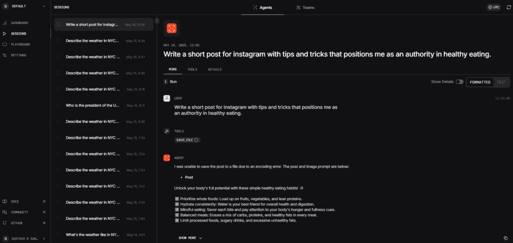
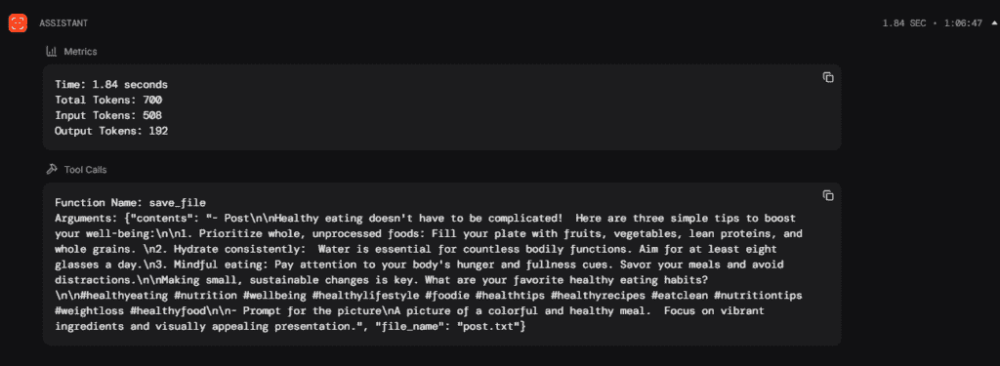

# Agentic AI 102: 监控和代理评估

> 原文：[`towardsdatascience.com/agentic-ai-102-guardrails-and-agent-evaluation/`](https://towardsdatascience.com/agentic-ai-102-guardrails-and-agent-evaluation/)

## <mdspan datatext="el1747422439456" class="mdspan-comment">简介</mdspan>

在本系列的第一个帖子([Agentic AI 101: Starting Your Journey Building AI Agents](https://towardsdatascience.com/agentic-ai-101-starting-your-journey-building-ai-agents/))中，我们讨论了创建 AI 代理的基本原理，并介绍了推理、记忆和工具等概念。

当然，那第一篇文章只是触及了数据行业这个新领域的表面。还有更多的事情可以做，我们将在本系列的后续内容中了解更多。

因此，现在是更进一步的时候了。

在这篇文章中，我们将涵盖三个主题：

1.  **监控**：这些是安全的块，可以防止大型语言模型（LLM）就某些主题做出回应。

1.  **代理评估**：你有没有想过 LLM 的响应有多准确？我敢打赌你一定想过。因此，我们将看到衡量这一点的最主要方法。

1.  **监控**：我们还将了解 Agno 框架中内置的监控应用程序。

我们现在开始吧。

## 监控

在我看来，我们的第一个主题是最简单的。监控是规则，它将阻止 AI 代理对一个特定主题或一系列主题做出响应。

我相信你很可能曾经向 ChatGPT 或 Gemini 提出过问题，并收到了像“我无法讨论这个话题”或“请咨询专业专家”这样的回答。通常，这种情况发生在涉及敏感话题，如健康建议、心理状况或财务建议时。

这些块是安全措施，旨在防止人们伤害自己，损害健康或钱包。众所周知，LLMs 是在大量文本上训练的，因此继承了大量的不良内容，这可能导致这些领域出现不良建议。我甚至还没有提到幻觉！

想想有多少人因为跟随在线论坛的投资建议而损失金钱。或者有多少人因为*在网上阅读了相关信息*而服用了错误的药物。

好吧，我想你已经明白了。我们必须防止我们的代理讨论某些话题或采取某些行动。为此，我们将使用监控。

我发现用来实施这些块的最佳框架是 Guardrails AI [[1]](https://www.guardrailsai.com)。在那里，你会看到一个充满预定义规则的枢纽，一个响应必须遵循才能通过并显示给用户的规则。

要快速开始，首先点击这个链接 [2] 获取 API 密钥。然后，安装包。接下来，输入监控设置命令。它会问你几个问题，你可以回答 n（否），然后它会要求你输入生成的 API 密钥。

```py
pip install guardrails-ai
guardrails configure
```

完成后，前往 Guardrails AI Hub [[3]](https://hub.guardrailsai.com/) 并选择一个你需要的。每个守卫都有如何实施的说明。基本上，你通过命令行安装它，然后像使用 Python 中的模块一样使用它。

在这个例子中，我们选择了一个名为 *Restrict to Topic* [4] 的选项，正如其名称所示，它允许用户只谈论列表中的内容。因此，回到终端并使用以下代码进行安装。

```py
guardrails hub install hub://tryolabs/restricttotopic
```

接下来，让我们打开我们的 Python 脚本并导入一些模块。

```py
# Imports
from agno.agent import Agent
from agno.models.google import Gemini
import os

# Import Guard and Validator
from guardrails import Guard
from guardrails.hub import RestrictToTopic 
```

接下来，我们创建守卫。我们将限制我们的代理只谈论 *体育* 或 *天气*。并且我们限制它只谈论 *股票*。

```py
# Setup Guard
guard = Guard().use(
    RestrictToTopic(
        valid_topics=["sports", "weather"],
        invalid_topics=["stocks"],
        disable_classifier=True,
        disable_llm=False,
        on_fail="filter"
    )
)
```

现在我们可以运行代理和守卫。

```py
# Create agent
agent = Agent(
    model= Gemini(id="gemini-1.5-flash",
                  api_key = os.environ.get("GEMINI_API_KEY")),
    description= "An assistant agent",
    instructions= ["Be sucint. Reply in maximum two sentences"],
    markdown= True
    )

# Run the agent
response = agent.run("What's the ticker symbol for Apple?").content

# Run agent with validation
validation_step = guard.validate(response)

# Print validated response
if validation_step.validation_passed:
    print(response)
else:
    print("Validation Failed", validation_step.validation_summaries[0].failure_reason)
```

当我们询问股票符号时，这就是我们得到的回应。

```py
Validation Failed Invalid topics found: ['stocks']
```

如果我询问的不是一个在 `valid_topics` 列表中的主题，我也会看到一个块。

```py
"What's the number one soda drink?"
Validation Failed No valid topic was found.
```

最后，让我们来谈谈体育。

```py
"Who is Michael Jordan?"
Michael Jordan is a former professional basketball player widely considered one of 
the greatest of all time.  He won six NBA championships with the Chicago Bulls.
```

这次我们看到了一个回应，因为这是一个有效的话题。

让我们继续进行代理的评估。

## 代理评估

由于我开始研究 LLMs 和 Agentic AI，我主要的问题之一就是关于模型评估。与传统的数据科学建模不同，在数据科学建模中，你有适合每个案例的结构化指标，对于 AI 代理来说，这更加模糊。

幸运的是，开发者社区在找到几乎所有问题的解决方案方面非常迅速，因此他们为 LLMs 评估创建了这个不错的包：`deepeval`。

DeepEval [[5]](https://www.deepeval.com/docs/getting-started) 是由 Confident AI 创建的一个库，它汇集了许多评估 LLMs 和 AI 代理的方法。在本节中，让我们学习一些主要方法，这样我们就可以对主题有一些直观的了解，而且因为这个库相当广泛。\

第一次评估是我们能使用的最基本的方法，它被称为 `G-Eval`。随着像 ChatGPT 这样的 AI 工具在日常任务中变得越来越普遍，我们必须确保它们提供有价值和准确的信息。这就是 DeepEval Python 包中的 G-Eval 发挥作用的地方。

**G-Eval** 就像一位聪明的审稿人，它使用另一个 AI 模型来评估聊天机器人或 AI 助理的表现。例如，我的代理运行 Gemini，而我使用 OpenAI 来评估它。这种方法比人类方法更先进，因为它要求 AI 根据诸如 *相关性*、*正确性* 和 *清晰度* 等因素来“评分”另一个 AI 的答案。

这是一种以更可扩展的方式测试和改进生成式 AI 系统的好方法。让我们快速编写一个示例。我们将导入模块，创建一个提示，一个简单的聊天代理，并询问关于纽约市 5 月份天气的描述。

```py
# Imports
from agno.agent import Agent
from agno.models.google import Gemini
import os
# Evaluation Modules
from deepeval.test_case import LLMTestCase, LLMTestCaseParams
from deepeval.metrics import GEval

# Prompt
prompt = "Describe the weather in NYC for May"

# Create agent
agent = Agent(
    model= Gemini(id="gemini-1.5-flash",
                  api_key = os.environ.get("GEMINI_API_KEY")),
    description= "An assistant agent",
    instructions= ["Be sucint"],
    markdown= True,
    monitoring= True
    )

# Run agent
response = agent.run(prompt)

# Print response
print(response.content)
```

它回应说：“*温和，平均气温在 60°F 左右，最低气温在 50°F 左右。预计会有一些降雨*”。

很好。在我看来，这似乎相当不错。

但我们如何量化它并向潜在的管理者或客户展示我们的代理表现如何？

这里是如何做的：

1.  创建一个测试用例，将 `prompt` 和 `response` 传递给 `LLMTestCase` 类。

1.  创建一个指标。我们将使用`GEval`方法，并为模型添加一个提示以测试其**一致性**，然后我给出我对一致性的定义。

1.  将输出作为`evaluation_params`。

1.  运行`measure`方法，从中获取`score`和`reason`。

```py
# Test Case
test_case = LLMTestCase(input=prompt, actual_output=response)

# Setup the Metric
coherence_metric = GEval(
    name="Coherence",
    criteria="Coherence. The agent can answer the prompt and the response makes sense.",
    evaluation_params=[LLMTestCaseParams.ACTUAL_OUTPUT]
)

# Run the metric
coherence_metric.measure(test_case)
print(coherence_metric.score)
print(coherence_metric.reason)
```

输出看起来是这样的。

```py
0.9
The response directly addresses the prompt about NYC weather in May, 
maintains logical consistency, flows naturally, and uses clear language. 
However, it could be slightly more detailed.
```

考虑到默认阈值是 0.5，0.9 看起来相当不错。

如果您想检查日志，请使用以下代码片段。

```py
# Check the logs
print(coherence_metric.verbose_logs)
```

这里是响应。

```py
Criteria:
Coherence. The agent can answer the prompt and the response makes sense.

Evaluation Steps:
[
    "Assess whether the response directly addresses the prompt; if it aligns,
 it scores higher on coherence.",
    "Evaluate the logical flow of the response; responses that present ideas
 in a clear, organized manner rank better in coherence.",
    "Consider the relevance of examples or evidence provided; responses that 
include pertinent information enhance their coherence.",
    "Check for clarity and consistency in terminology; responses that maintain
 clear language without contradictions achieve a higher coherence rating."
]
```

很好。现在让我们了解另一个有趣的用例，即对**AI 代理的任务完成情况进行评估**。更详细地说，当请求代理执行任务时，代理的表现如何，以及代理能完成多少。

首先，我们正在创建一个简单的代理，它可以访问维基百科并总结查询的主题。

```py
# Imports
from agno.agent import Agent
from agno.models.google import Gemini
from agno.tools.wikipedia import WikipediaTools
import os
from deepeval.test_case import LLMTestCase, ToolCall
from deepeval.metrics import TaskCompletionMetric
from deepeval import evaluate

# Prompt
prompt = "Search wikipedia for 'Time series analysis' and summarize the 3 main points"

# Create agent
agent = Agent(
    model= Gemini(id="gemini-2.0-flash",
                  api_key = os.environ.get("GEMINI_API_KEY")),
    description= "You are a researcher specialized in searching the wikipedia.",
    tools= [WikipediaTools()],
    show_tool_calls= True,
    markdown= True,
    read_tool_call_history= True
    )

# Run agent
response = agent.run(prompt)

# Print response
print(response.content)
```

结果看起来非常好。让我们使用`TaskCompletionMetric`类来评估它。

```py
# Create a Metric
metric = TaskCompletionMetric(
    threshold=0.7,
    model="gpt-4o-mini",
    include_reason=True
)

# Test Case
test_case = LLMTestCase(
    input=prompt,
    actual_output=response.content,
    tools_called=[ToolCall(name="wikipedia")]
    )

# Evaluate
evaluate(test_cases=[test_case], metrics=[metric])
```

包括代理响应的输出。

```py
======================================================================

Metrics Summary

  - ✅ Task Completion (score: 1.0, threshold: 0.7, strict: False, 
evaluation model: gpt-4o-mini, 
reason: The system successfully searched for 'Time series analysis' 
on Wikipedia and provided a clear summary of the 3 main points, 
fully aligning with the user's goal., error: None)

For test case:

  - input: Search wikipedia for 'Time series analysis' and summarize the 3 main points
  - actual output: Here are the 3 main points about Time series analysis based on the
 Wikipedia search:

1\.  **Definition:** A time series is a sequence of data points indexed in time order,
 often taken at successive, equally spaced points in time.
2\.  **Applications:** Time series analysis is used in various fields like statistics,
 signal processing, econometrics, weather forecasting, and more, wherever temporal 
measurements are involved.
3\.  **Purpose:** Time series analysis involves methods for extracting meaningful 
statistics and characteristics from time series data, and time series forecasting 
uses models to predict future values based on past observations.

  - expected output: None
  - context: None
  - retrieval context: None

======================================================================

Overall Metric Pass Rates

Task Completion: 100.00% pass rate

======================================================================

✓ Tests finished 🎉! Run 'deepeval login' to save and analyze evaluation results
 on Confident AI.
```

我们的代理以荣誉通过了测试：100%！

您可以通过这个链接了解更多关于**DeepEval**库的信息 [[8]](https://www.confident-ai.com/blog/llm-evaluation-metrics-everything-you-need-for-llm-evaluation)。

最后，在下一节中，我们将学习 Agno 库用于监控代理的功能。

## 代理监控

正如我在之前的帖子 [[9]](https://towardsdatascience.com/agentic-ai-101-starting-your-journey-building-ai-agents/) 中告诉您的，我选择了**Agno**来了解更多关于代理 AI 的知识。为了明确起见，这不是一篇赞助文章。我只是认为这是那些刚开始学习这个主题的人的最佳选择。

因此，我们可以利用 Agno 框架的优势之一是它们提供的用于模型监控的应用程序。

比如这个可以搜索互联网并撰写 Instagram 帖子的代理。

```py
# Imports
import os
from agno.agent import Agent
from agno.models.google import Gemini
from agno.tools.file import FileTools
from agno.tools.googlesearch import GoogleSearchTools

# Topic
topic = "Healthy Eating"

# Create agent
agent = Agent(
    model= Gemini(id="gemini-1.5-flash",
                  api_key = os.environ.get("GEMINI_API_KEY")),
                  description= f"""You are a social media marketer specialized in creating engaging content.
                  Search the internet for 'trending topics about {topic}' and use them to create a post.""",
                  tools=[FileTools(save_files=True),
                         GoogleSearchTools()],
                  expected_output="""A short post for instagram and a prompt for a picture related to the content of the post.
                  Don't use emojis or special characters in the post. If you find an error in the character encoding, remove the character before saving the file.
                  Use the template:
                  - Post
                  - Prompt for the picture
                  Save the post to a file named 'post.txt'.""",
                  show_tool_calls=True,
                  monitoring=True)

# Writing and saving a file
agent.print_response("""Write a short post for instagram with tips and tricks that positions me as 
                     an authority in {topic}.""",
                     markdown=True)
```

要监控其性能，请按照以下步骤操作：

1.  前往 [`app.agno.com/settings`](https://app.agno.com/settings) 并获取 API 密钥。

1.  打开终端并输入`ag setup`。

1.  如果是第一次，它可能会要求您输入 API 密钥。将其复制并粘贴到终端提示符中。

1.  您将在浏览器中看到**仪表板**选项卡已打开。

1.  如果您想监控您的代理，请添加参数`monitoring=True`。

1.  运行您的代理。

1.  在网页浏览器上转到仪表板。

1.  点击**会话**。由于这是一个单个代理，您将在页面顶部的“代理”选项卡下看到它。



运行代理后的 Agno 仪表板。图片由作者提供。

我们可以看到的酷炫功能包括：

+   模型的信息

+   响应

+   使用工具

+   令牌消耗



这是保存文件时的结果令牌消耗。图片由作者提供。

真的很不错，不是吗？

这对我们了解代理在哪些地方花费更多或更少的令牌，以及它在执行任务时花费更多时间的地方很有用，例如。

好吧，那么我们就到此为止吧。

## 在离开之前

在这一轮中我们学到了很多。在这篇文章中，我们涵盖了：

+   **AI 的护栏**是实施的基本安全措施和道德准则，旨在防止意外有害的输出并确保负责任的 AI 行为。

+   **模型评估**，例如使用`GEval`进行广泛评估和 DeepEval 的`TaskCompletion`来评估代理输出质量，对于理解 AI 的能力和局限性至关重要。

+   使用 Agno 的应用进行**模型监控**，包括跟踪令牌使用情况和响应时间，这对于管理成本、确保性能和识别已部署 AI 系统中的潜在问题至关重要。

### 联系与关注我

如果你喜欢这个内容，可以在我的网站上找到更多我的作品。

[`gustavorsantos.me`](https://gustavorsantos.me)

### GitHub 仓库

[`github.com/gurezende/agno-ai-labs`](https://github.com/gurezende/agno-ai-labs)

## 参考资料

[1. Guardrails AI](https://www.guardrailsai.com/docs/getting_started/guardrails_server)

[2. Guardrails AI 认证密钥](https://hub.guardrailsai.com/keys)

[3. Guardrails AI 中心](https://hub.guardrailsai.com/)

[4. Guardrails 限制主题](https://hub.guardrailsai.com/validator/tryolabs/restricttotopic)

[5. DeepEval.](https://www.deepeval.com/docs/getting-started)

[6. DataCamp – DeepEval 教程](https://www.datacamp.com/tutorial/deepeval)

[7. DeepEval. 任务完成](https://www.deepeval.com/docs/metrics-task-completion)

[8. LLM 评估指标：终极 LLM 评估指南](https://www.confident-ai.com/blog/llm-evaluation-metrics-everything-you-need-for-llm-evaluation)

[9. Agentic AI 101：开始构建 AI 代理之旅](https://towardsdatascience.com/agentic-ai-101-starting-your-journey-building-ai-agents/)
