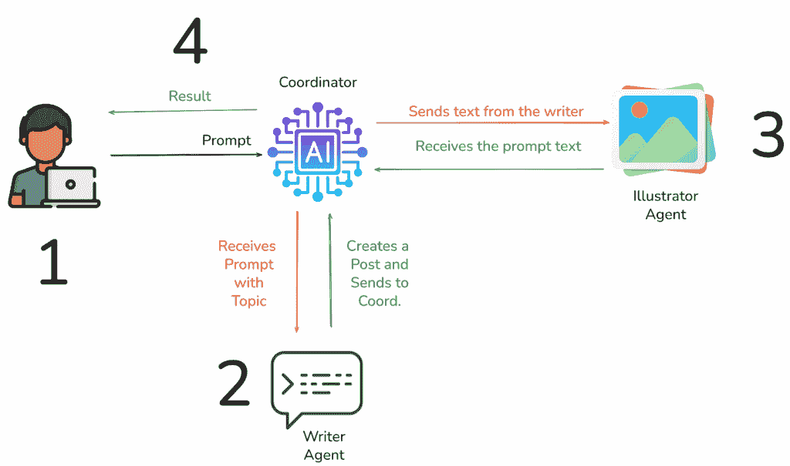
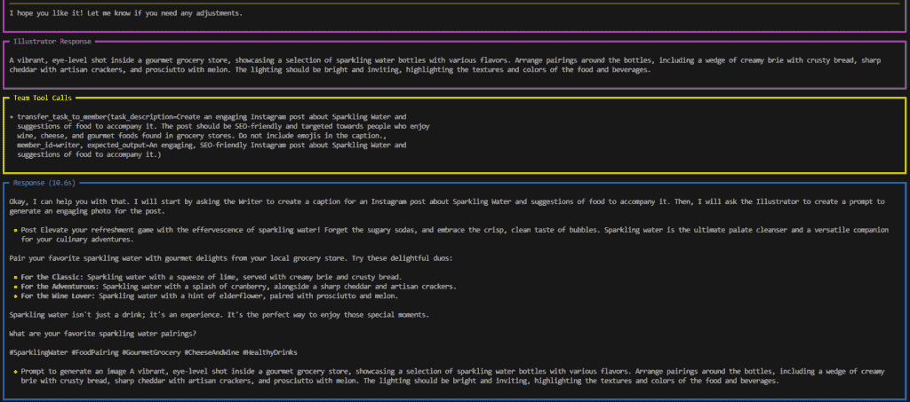
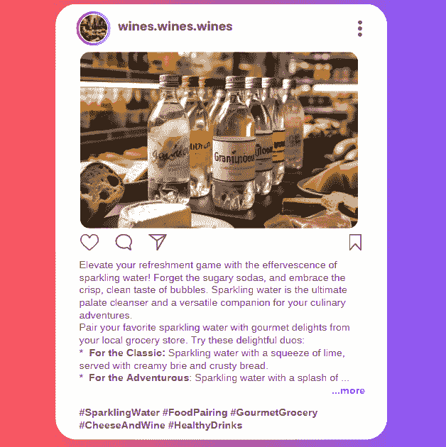

# 智能体 AI 103：构建多智能体团队

> 原文：[`towardsdatascience.com/agentic-ai-103-building-multi-agent-teams/`](https://towardsdatascience.com/agentic-ai-103-building-multi-agent-teams/)

## 简介

<mdspan datatext="el1749756741667" class="mdspan-comment">在我的最后两篇</mdspan>在 TDS 的文章中，我们探讨了智能体 AI 的基础知识。我一直在与您分享一些可以帮助您在这个内容海洋中航行的概念。

在前两篇文章中，我们探讨了如下内容：

+   如何创建您的第一个智能体

+   工具是什么以及如何在您的智能体中实现它们

+   记忆与推理

+   约束条件

+   智能体评估和监控

太好了！如果您想了解更多，我建议您查看参考文献部分的以下文章：[[1]](https://towardsdatascience.com/agentic-ai-101-starting-your-journey-building-ai-agents/) 和 [[2]](https://towardsdatascience.com/agentic-ai-102-guardrails-and-agent-evaluation/)。

智能体 AI 是目前最热门的主题之一，您可以选择多个框架。幸运的是，从我学习智能体的经验中，我看到了一件事，那就是这些基本概念可以从一个框架转移到另一个框架。

例如，一个框架中的`Agent`类在另一个框架中变成了`chat`，或者甚至是其他东西，但通常具有相似的参数和与大型语言模型（LLM）连接的相同目标。

所以让我们在学习之旅中再迈出一步。

在这篇文章中，我们将学习如何创建多智能体团队，为我们打开让 AI 执行更复杂任务的机会。

为了保持一致性，我将继续使用 **[Agno](https://docs.agno.com/introduction)** 作为我们的框架。

让我们开始吧。

## 多智能体团队

多智能体团队无非就是字面上的意思：由多个智能体组成的团队。

*但为什么我们需要那个呢？*

嗯，我为自己制定了一个简单的经验法则，如果一个智能体需要使用 2 个或 3 个以上的工具，那么是时候创建一个团队了。这样做的原因是，两个 *专家* 一起工作会比一个 *通才* 做得更好。

当您试图创建“瑞士军刀智能体”时，事情出现倒退的概率很高。智能体将因为不同的指令和工具的数量而变得过于复杂，最终导致错误或返回较差的结果。

另一方面，当您创建具有单一目的的智能体时，它们只需要一个工具来解决问题，因此可以提高性能并改善结果。

为了协调这个专家团队，我们将使用 Agno 中的`Team`类，该类能够将任务分配给适当的智能体。

让我们继续前进，了解我们将要构建的内容。

## 项目

我们的项目将专注于社交媒体内容生成行业。我们将构建一个团队，该团队生成 Instagram 帖子并根据用户提供的主题建议图片。

1.  用户发送一个帖子提示。

1.  协调员将任务发送给 **作者**。

    +   它会上网搜索该主题。

1.  **作者**返回社交媒体帖子的文本。

1.  一旦协调员得到第一个结果，它将文本路由到 **插画师** 代理，以便为帖子创建一个图像提示。



代理团队的流程图。图片由作者提供。

注意我们如何很好地分离任务，这样每个代理都可以专注于自己的工作。协调员将确保每个代理完成工作，他们将合作以获得良好的最终结果。

为了让我们的团队表现更加出色，我将限制要创建的关于 **葡萄酒与美食** 的帖子主题。这样，我们可以进一步缩小从我们的代理所需的知识范围，并使其角色更加清晰和专注。

让我们现在编写代码。

## 代码

首先，安装必要的库。

```py
pip install agno duckduckgo-search google-genai
```

创建一个环境变量文件 `.env` 并添加 Gemini 和任何所需搜索机制的 API 密钥，如果需要的话。DuckDuckGo 不需要。

```py
GEMINI_API_KEY="your api key"
SEARCH_TOOL_API_KEY="api key"
```

导入库。

```py
# Imports
import os
from textwrap import dedent
from agno.agent import Agent
from agno.models.google import Gemini
from agno.team import Team
from agno.tools.duckduckgo import DuckDuckGoTools
from agno.tools.file import FileTools
from pathlib import Path
```

### 创建代理

接下来，我们将创建第一个代理。它是一个品酒师和美食专家。

+   它需要一个 `name` 以便团队更容易识别。

+   `role` 告诉它其专业是什么。

+   一个 `description` 来告诉代理如何行动。

+   它可以用来执行任务的 `tools`。

+   `add_name_to_instructions` 是为了在响应中附带处理该任务的代理人的名字。

+   我们描述了 `expected_output`。

+   `model` 是代理的大脑。

+   `exponential_backoff` 和 `delay_between_retries` 是为了避免对 LLM 发出过多的请求（错误 429）。

```py
# Create individual specialized agents
writer = Agent(
    name="Writer",
    role=dedent("""\
                You are an experienced digital marketer who specializes in Instagram posts.
                You know how to write an engaging, SEO-friendly post.
                You know all about wine, cheese, and gourmet foods found in grocery stores.
                You are also a wine sommelier who knows how to make recommendations.
                \
                """),
    description=dedent("""\
                Write clear, engaging content using a neutral to fun and conversational tone.
                Write an Instagram caption about the requested {topic}.
                Write a short call to action at the end of the message.
                Add 5 hashtags to the caption.
                If you encounter a character encoding error, remove the character before sending your response to the Coordinator.
                        \
                        """),
    tools=[DuckDuckGoTools()],
    add_name_to_instructions=True,
    expected_output=dedent("Caption for Instagram about the {topic}."),
    model=Gemini(id="gemini-2.0-flash-lite", api_key=os.environ.get("GEMINI_API_KEY")),
    exponential_backoff=True,
    delay_between_retries=2
)
```

现在，让我们创建插画师代理。参数是相同的。

```py
# Illustrator Agent
illustrator = Agent(
    name="Illustrator",
    role="You are an illustrator who specializes in pictures of wines, cheeses, and fine foods found in grocery stores.",
    description=dedent("""\
                Based on the caption created by Marketer, create a prompt to generate an engaging photo about the requested {topic}.
                If you encounter a character encoding error, remove the character before sending your response to the Coordinator.
                \
                """),
    expected_output= "Prompt to generate a picture.",
    add_name_to_instructions=True,
    model=Gemini(id="gemini-2.0-flash", api_key=os.environ.get("GEMINI_API_KEY")),
    exponential_backoff=True,
    delay_between_retries=2
)
```

### 创建团队

为了让这两个专业代理协同工作，我们需要使用 `Agent` 类。我们给它一个名字，并使用 `argument` 来确定团队将具有的交互类型。Agno 提供了 `coordinate`、`route` 或 `collaborate` 模式。

此外，别忘了使用 `share_member_interactions=True` 来确保响应在代理之间流畅流动。您还可以使用 `enable_agentic_context`，这允许团队上下文与团队成员共享。

如果您想使用 Agno 内置的监控仪表板，可以使用 `monitoring` 参数，该仪表板位于 [`app.agno.com/`](https://app.agno.com/)。

```py
# Create a team with these agents
writing_team = Team(
    name="Instagram Team",
    mode="coordinate",
    members=[writer, illustrator],
    instructions=dedent("""\
                        You are a team of content writers working together to create engaging Instagram posts.
                        First, you ask the 'Writer' to create a caption for the requested {topic}.
                        Next, you ask the 'Illustrator' to create a prompt to generate an engaging illustration for the requested {topic}.
                        Do not use emojis in the caption.
                        If you encounter a character encoding error, remove the character before saving the file.
                        Use the following template to generate the output:
                        - Post
                        - Prompt to generate an illustration
                        \
                        """),
    model=Gemini(id="gemini-2.0-flash", api_key=os.environ.get("GEMINI_API_KEY")),
    tools=[FileTools(base_dir=Path("./output"))],
    expected_output="A text named 'post.txt' with the content of the Instagram post and the prompt to generate an picture.",
    share_member_interactions=True,
    markdown=True,
    monitoring=True
)
```

让我们运行它。

```py
# Prompt
prompt = "Write a post about: Sparkling Water and sugestion of food to accompany."

# Run the team with a task
writing_team.print_response(prompt)
```

这是响应。



团队响应的图片。图片由作者提供。

这就是文本文件的样子。

```py
- Post
Elevate your refreshment game with the effervescence of sparkling water! 
Forget the sugary sodas, and embrace the crisp, clean taste of bubbles. 
Sparkling water is the ultimate palate cleanser and a versatile companion for 
your culinary adventures.

Pair your favorite sparkling water with gourmet delights from your local
grocery store.
Try these delightful duos:

*   **For the Classic:** Sparkling water with a squeeze of lime, served with 
creamy brie and crusty bread.
*   **For the Adventurous:** Sparkling water with a splash of cranberry, 
alongside a sharp cheddar and artisan crackers.
*   **For the Wine Lover:** Sparkling water with a hint of elderflower, 
paired with prosciutto and melon.

Sparkling water isn't just a drink; it's an experience. 
It's the perfect way to enjoy those special moments.

What are your favorite sparkling water pairings?

\#SparklingWater \#FoodPairing \#GourmetGrocery \#CheeseAndWine \#HealthyDrinks

- Prompt to generate an image
A vibrant, eye-level shot inside a gourmet grocery store, showcasing a selection
of sparkling water bottles with various flavors. Arrange pairings around 
the bottles, including a wedge of creamy brie with crusty bread, sharp cheddar 
with artisan crackers, and prosciutto with melon. The lighting should be bright 
and inviting, highlighting the textures and colors of the food and beverages.
```

在我们有了这个文本文件后，我们可以去我们更喜欢哪个 LLM 来创建图像，只需复制和粘贴 `生成图像的提示`。

这里是帖子原型的示例。



多代理团队生成的帖子原型。图片由作者提供。

我觉得相当不错。你呢？

## 在你离开之前

在这篇文章中，我们又向前迈出了一步，了解代理人工智能。这个话题很热门，市场上有很多框架可用。我只是停止了尝试学习所有这些框架，而是选择了一个来开始实际构建一些东西。

在这里，我们能够半自动化地创建社交媒体帖子。现在，我们只需要选择一个主题，调整提示，然后运行团队。之后，就完全是去社交媒体上创建帖子的事了。

当然，在这个流程中还可以进行更多自动化，但这里不涉及。

关于构建代理，我建议你从更容易的框架开始，随着你需要更多定制，你可以转向 LangGraph，例如，它允许你这样做。

### 联系方式和在线存在

如果你喜欢这个内容，可以在我的网站上找到更多我的工作和社交媒体：

[`gustavorsantos.me`](https://gustavorsantos.me)

### GitHub 仓库

[`github.com/gurezende/agno-ai-labs`](https://github.com/gurezende/agno-ai-labs)

## 参考文献

**[1. 代理人工智能 101：开始你的 AI 代理构建之旅]** [`towardsdatascience.com/agentic-ai-101-starting-your-journey-building-ai-agents/`](https://towardsdatascience.com/agentic-ai-101-starting-your-journey-building-ai-agents/)

**[2. 代理人工智能 102：边界和代理评估]** [`towardsdatascience.com/agentic-ai-102-guardrails-and-agent-evaluation/`](https://towardsdatascience.com/agentic-ai-102-guardrails-and-agent-evaluation/)

**[3. Agno]** [`docs.agno.com/introduction`](https://docs.agno.com/introduction)

**[4. Agno 团队类]** [`docs.agno.com/reference/teams/team`](https://docs.agno.com/reference/teams/team)
