# 代理 AI：关于评估

> 原文：[`towardsdatascience.com/agentic-ai-evaluation-playbook/`](https://towardsdatascience.com/agentic-ai-evaluation-playbook/)

<mdspan datatext="el1754592262853" class="mdspan-comment">代理评估主要是</mdspan>测试您的 LLM 应用以确保其性能的一致性。

这不是一个最激动人心的主题，但越来越多的公司开始关注。因此，了解要跟踪哪些指标来实际衡量性能是值得的。

在您推送更改时，拥有适当的评估也很重要，以确保事情不会变得混乱。

因此，对于这篇文章，我对多轮聊天机器人、RAG 和代理应用的常见指标进行了一些研究。

我还简要回顾了 DeepEval、RAGAS 和 OpenAI 的 Evals 库等框架，以便您知道何时选择什么。

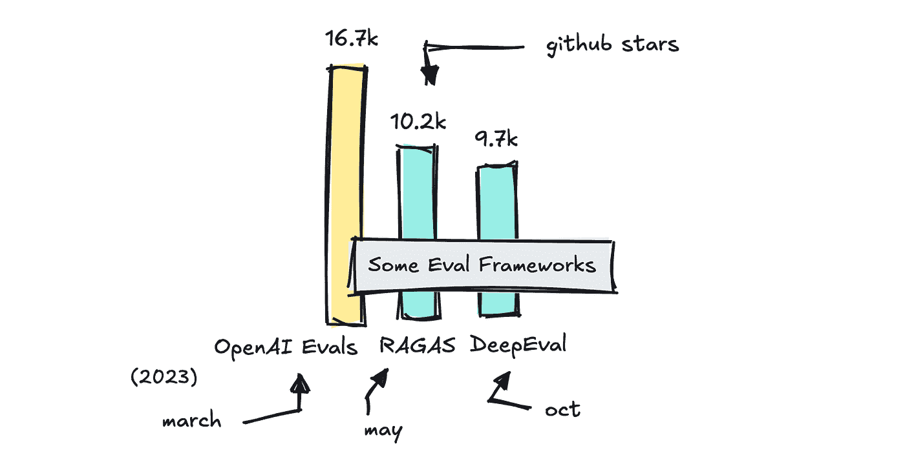

这篇文章分为两部分。如果您是新手，第一部分会简要介绍传统的指标，如 BLEU 和 ROUGE，涉及 LLM 基准，并介绍在评估中使用 LLM 作为评委的想法。

如果这对您来说不是新内容，您可以跳过这部分。第二部分将深入探讨不同类型 LLM 应用的评估。

## 我们之前做了什么

如果您对如何评估 NLP 任务以及公共基准如何工作非常熟悉，您可以跳过这部分。

如果您不熟悉，了解早期指标如准确性和 BLEU 最初用于什么以及它们是如何工作的，以及了解我们如何测试公共基准如 MMLU，是很好的。

### 评估 NLP 任务

当我们评估传统的 NLP 任务，如分类、翻译、摘要等时，我们转向传统的指标，如准确率、精确率、F1、BLEU 和 ROUGE。

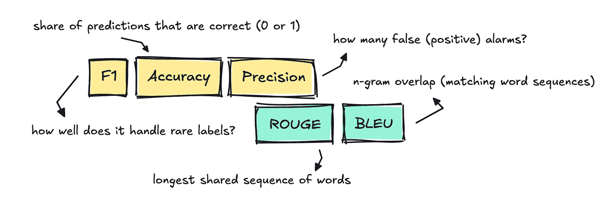

这些指标至今仍在使用，但主要是在模型产生单一、易于比较的“正确”答案时。

以分类为例，任务是为每个文本分配一个单独的标签。为了测试这一点，我们可以使用准确率，通过比较模型分配的标签与评估数据集中的参考标签，看看它是否正确。

这非常明确：如果它分配了错误的标签，它得到 0 分；如果它分配了正确的标签，它得到 1 分。

这意味着如果我们为包含 1,000 封电子邮件的垃圾邮件数据集构建一个分类器，并且模型正确标记了其中的 910 封，那么准确率将是 0.91。

对于文本分类，我们通常还使用 F1、精确率和召回率。

当涉及到摘要和机器翻译等 NLP 任务时，人们经常使用 ROUGE 和 BLEU 来查看模型的翻译或摘要与参考文本的匹配程度。

这两个分数都计算重叠的 n-gram，尽管比较的方向不同**，**本质上它只是意味着共享的单词块越多，分数越高。

这相当简单，因为如果输出使用了不同的措辞，得分就会低。

所有这些指标在有一个正确答案的响应中效果最好，而且通常不是我们今天构建的 LLM 应用程序的正确选择。

### LLM 基准

如果你看过新闻，你可能注意到每次大型语言模型的新版本发布时，都会遵循几个基准：MMLU Pro、GPQA 或 Big-Bench。

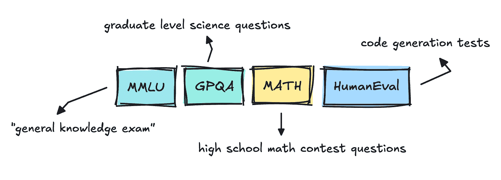

这些是通用的评估，其正确术语实际上是“基准”而不是评估（我们稍后会讨论）。

尽管为每个模型进行了各种其他评估，包括毒性、幻觉和偏见，但最受关注的是更像是考试或排行榜。

像 MMLU 这样的数据集是选择题，并且已经存在了一段时间。我实际上之前已经浏览过它，并看到了它的混乱程度。

有些问题和答案相当模糊，这让我认为 LLM 提供商将尝试在这些数据集上训练他们的模型，以确保他们正确无误。

这在公众中引起了一些恐惧，即大多数 LLM 在这些基准测试中表现良好时只是过度拟合，为什么需要新的数据集和独立评估。

### LLM 评分者

要在这些数据集上运行评估，你通常可以使用准确性和单元测试。然而，现在不同的是增加了所谓的“LLM-as-a-judge”。

为了基准测试模型，团队将主要使用传统方法。

因此，只要是有选择题或者只有一个正确答案，就没有必要做其他任何事情，只需将答案与参考答案进行精确匹配即可。

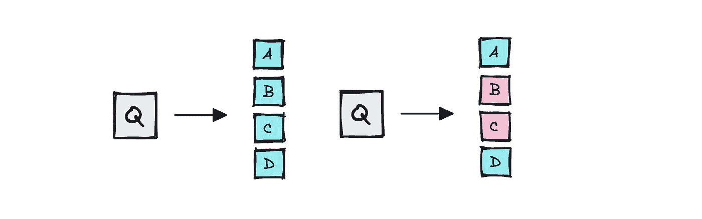

这适用于像 MMLU 和 GPQA 这样的数据集，它们有多个选择题答案。

对于编码测试（HumanEval、SWE-Bench），评分者可以简单地运行模型的补丁或函数。如果每个测试都通过，问题就算解决了，反之亦然。

然而，正如你可以想象的那样，如果问题是模糊或开放式的，答案可能会波动。这个差距导致了“LLM-as-a-judge”的兴起，其中大型语言模型如 GPT-4 评分答案。

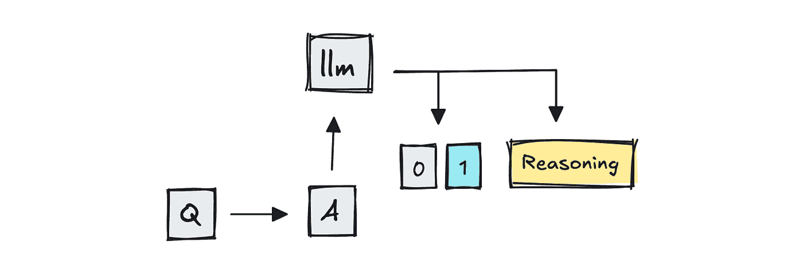

MT-Bench 是使用 LLM 作为评分者的基准之一，因为它为 GPT-4 提供了两个竞争性的多轮答案，并询问哪个更好。

使用人工评分员的 Chatbot Arena，我认为现在通过结合使用 LLM-as-a-judge 的方法也扩大了规模。

*为了透明度，你也可以使用语义尺，如 BERTScore，来比较语义相似度。我在这里略过了一些内容，以保持简洁。*

因此，团队可能仍然会使用重叠指标，如 BLEU 或 ROUGE，进行快速检查，或者在可能的情况下依赖精确匹配解析，但新的是让另一个大型语言模型来评判输出。

## 我们如何处理 LLM 应用

现在变化的主要事情是我们不仅测试 LLM 本身，而是整个系统。

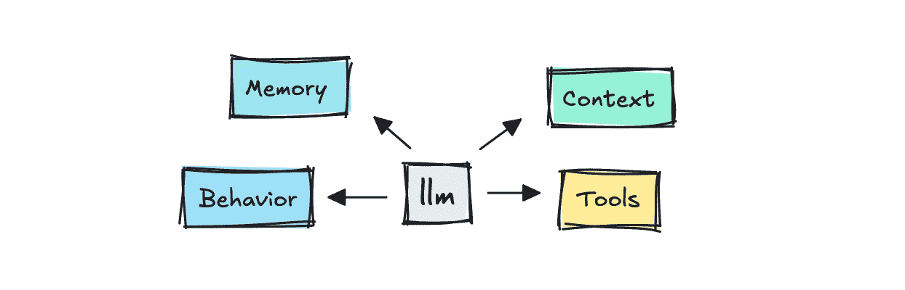

当我们能够做到的时候，我们仍然使用程序性方法来评估，就像以前一样。

对于更细致的输出，我们可以从一些便宜且确定性的东西开始，比如 BLEU 或 ROUGE，来查看 n-gram 重叠，但大多数现代框架现在将使用 LLM 评分器来评估。

有三个领域值得讨论：如何评估多轮对话、RAG 和代理，以及我们如何进行评估和我们可以转向哪些类型的指标。

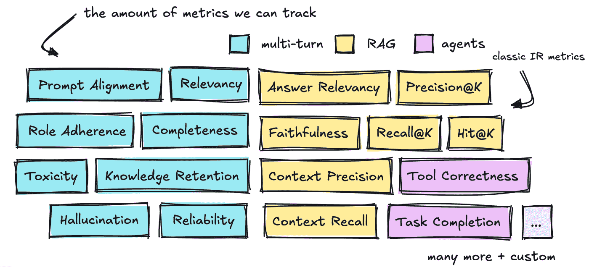

在我们继续探讨不同的框架之前，我们将简要讨论已经定义的所有这些指标。

### 多轮对话

这一部分是关于构建多轮对话的评估，也就是我们在聊天机器人中看到的那些。

当我们与聊天机器人互动时，我们希望对话感觉自然、专业，并且它能记住正确的信息。我们希望它在整个对话中保持主题，并真正回答我们提出的问题。

这里已经定义了相当多的标准指标。我们可以先讨论的是**相关性/连贯性**和**完整性**。

**相关性**是一个应该追踪 LLM 是否适当地回答用户的查询并保持主题的指标，而**完整性**则是在最终结果实际上解决了用户目标时很高。

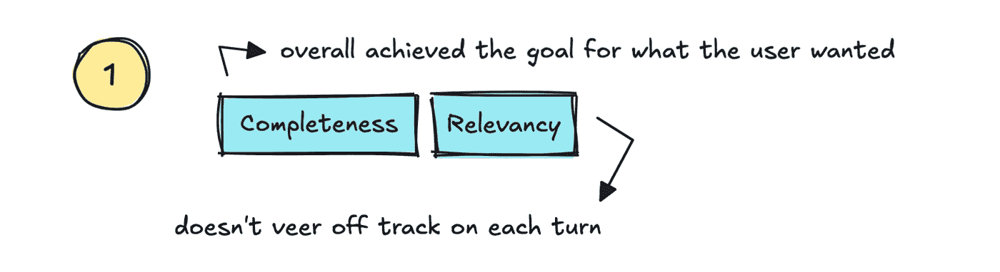

也就是说，如果我们能够追踪整个对话中的满意度，我们也可以追踪它是否真的“减少了支持成本”并增加了信任，同时提供高“自助率”。

第二部分是**知识保留**和**可靠性**。

也就是说：它是否记得对话中的关键细节，我们是否可以信任它不会“迷失”？仅仅记住细节是不够的。它还需要能够自我纠正。

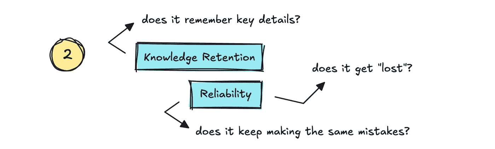

这是我们看到在 vibe 编码工具中的东西。它们忘记了它们犯过的错误，然后继续犯同样的错误。我们应该将其追踪为低**可靠性**或稳定性。

我们可以追踪的第三部分是**角色遵守**和**提示对齐**。这追踪了 LLM 是否坚持其被赋予的角色，以及它是否遵循系统提示中的指令。

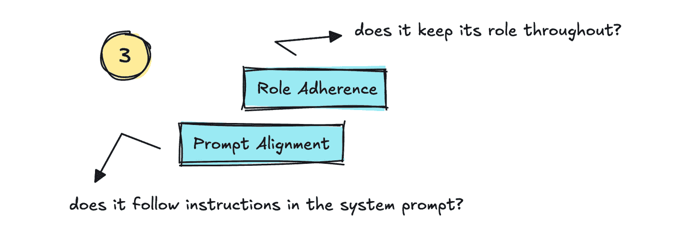

接下来是关于安全性的指标，例如**幻觉**和**偏见/毒性**。

**幻觉**是重要的追踪指标，但也相当困难。人们可能会尝试设置网络搜索来评估输出，或者将输出分成不同的主张，由更大的模型（LLM 作为法官风格）进行评估。

还有其他方法，例如 SelfCheckGPT，它通过多次在相同的提示下调用模型来检查模型的一致性，看看它是否坚持其原始答案以及它偏离了多少次。

对于**偏差/毒性**，你可以使用其他 NLP 方法，例如微调的分类器。

你可能还想跟踪的其他指标可能针对你的应用程序是定制的，例如代码正确性、安全漏洞、JSON 正确性等等。

至于如何进行评估，你不必总是使用 LLM，尽管在这些情况下标准解决方案通常是这样做。

在我们可以提取正确答案的情况下，例如解析 JSON，我们自然不需要使用 LLM。正如我之前所说的，许多 LLM 提供商也使用单元测试来基准测试与代码相关的指标。

不言而喻，使用 LLM 作为评判者并不总是非常可靠，就像它们所衡量的应用一样，但我这里没有具体的数字，所以你可能需要自己寻找。

### 检索增强生成（RAG）

要继续构建我们可以跟踪的多轮对话，我们可以转向使用检索增强生成（RAG）时需要衡量的内容。

在 RAG 系统中，我们需要将过程分为两部分：分别衡量检索和生成指标。

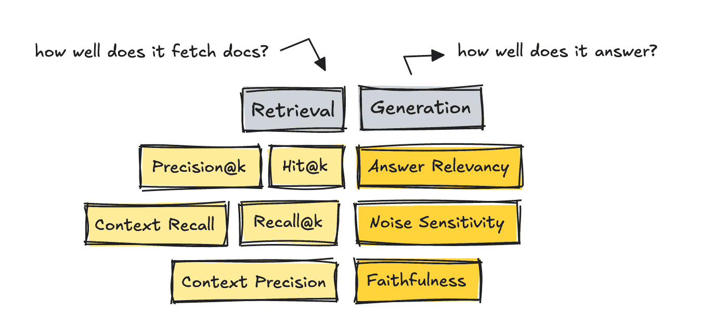

首先要衡量的是检索，以及检索到的文档是否是针对查询的正确文档。

如果我们在检索方面得到低分，我们可以通过设置更好的分块策略、更改嵌入模型、添加混合搜索和重新排序等技术、使用元数据进行过滤等方法来调整系统。

为了衡量检索，我们可以使用依赖于精选数据集的旧指标，或者我们可以使用无参考方法，这些方法使用 LLM 作为评判者。

我需要先提到经典的 IR 指标，因为它们是第一个出现的。对于这些，我们需要“黄金”答案，即我们设置一个查询，然后为该特定查询对每个文档进行排名。

虽然你可以使用 LLM 来构建这些数据集，但我们不使用 LLM 来衡量，因为我们已经在数据集中有了可以比较的分数。

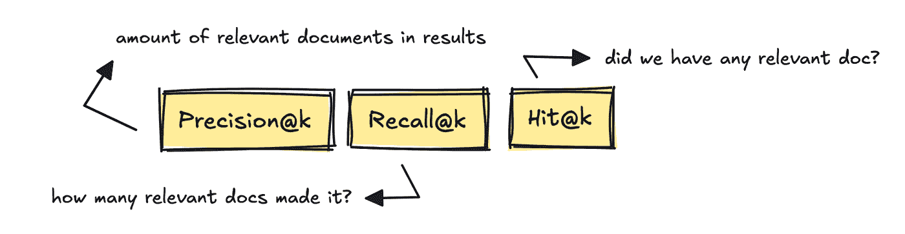

最著名的 IR 指标是 Precision@k、Recall@k 和 Hit@k。

这些指标衡量了结果中相关文档的数量，基于黄金参考答案检索了多少个相关文档，以及是否至少有一个相关文档进入了结果。

新的框架如 RAGAS 和 DeepEval 引入了无参考、LLM 评判风格的指标，如上下文召回率和上下文精确率。

这些指标计算根据查询，有多少真正相关的片段进入了前 K 列表，使用 LLM 进行评判。

也就是说，基于查询，系统是否实际上根据答案返回了任何相关文档，或者有太多不相关的文档无法正确回答问题？

要构建用于评估检索的数据集，你可以从真实日志中挖掘问题，然后使用人工进行整理。

你还可以使用大型语言模型（LLM）的帮助，在大多数框架中或作为独立工具（如 YourBench）使用数据集生成器。

如果你使用 LLM 设置自己的数据集生成器，你可以做如下操作。

```py
# Prompt to generate questions
qa_generate_prompt_tmpl = """\
Context information is below.

---------------------
{context_str}
---------------------

Given the context information and no prior knowledge
generate only {num} questions and {num} answers based on the above context.

...
"""
```

但这需要更高级一些。

如果我们转向 RAG 系统的生成部分，我们现在正在衡量它使用提供的文档回答问题的效果。

如果这部分表现不佳，我们可以调整提示，调整模型设置（温度等），完全更换模型，或者针对领域专业知识进行微调。我们还可以强制它使用 CoT 风格的循环“推理”，检查自我一致性，等等。

对于这部分，RAGAS 的指标：答案相关性、忠实度和噪声敏感性很有用。

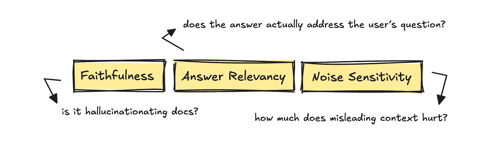

这些指标询问答案是否真正回答了用户的问题，答案中的每个主张是否都得到了检索到的文档的支持，以及一些无关的上下文是否会使模型偏离轨道。

如果我们看看 RAGAS，它们可能首先会要求大型语言模型（LLM）“从 0 到 1 评分，以判断这个答案有多直接地回答了问题”，并提供给它问题、答案和检索到的上下文。这会返回一个 0-1 的原始分数，可以用来计算平均值。

因此，为了总结，我们将系统分为两部分进行评估，虽然你可以使用依赖于信息检索（IR）指标的方 法，但你也可以使用不依赖参考的、依赖于 LLM 进行评分的方法。

我们需要讨论的最后一件事是，代理如何扩展我们现在需要跟踪的指标集，而不仅仅是已经讨论过的那些。

### 代理

对于代理，我们不仅关注输出、对话和上下文。

现在，我们还在评估它“移动”的能力：它是否能够完成任务或工作流程，以及它完成得有多有效，以及它是否在正确的时间调用正确的工具。

框架将用不同的方式称呼这些指标，但本质上你想要跟踪的前两个是任务完成和工具正确性。

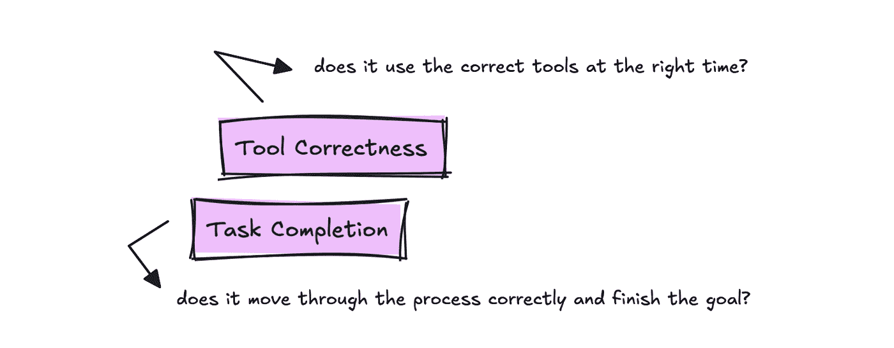

对于跟踪工具使用，我们想知道是否使用了用户查询的正确工具。

我们确实需要某种带有内置真实情况的黄金脚本来测试每次运行，但你可以一次性编写它，然后在每次进行更改时使用它。

对于任务完成，评估是阅读整个跟踪和目标，并返回一个介于 0 和 1 之间的数字，并附上理由。这应该衡量代理完成任务的效率。

对于代理来说，你仍然需要根据你的应用程序测试我们已经讨论过的其他事情。

*我必须指出：即使有相当多的定义好的指标可用，你的用例可能会有所不同，因此值得记录下常见的指标，但不要假设它们是最好的跟踪指标*。

接下来，让我们来概述一下流行的框架，这些框架可以帮助您。

### 评估框架

有很多框架可以帮助你进行评估，但我想谈谈几个流行的框架：RAGAS、DeepEval、OpenAI 的和 MLFlow 的 Evals，以及它们擅长什么以及何时使用什么。

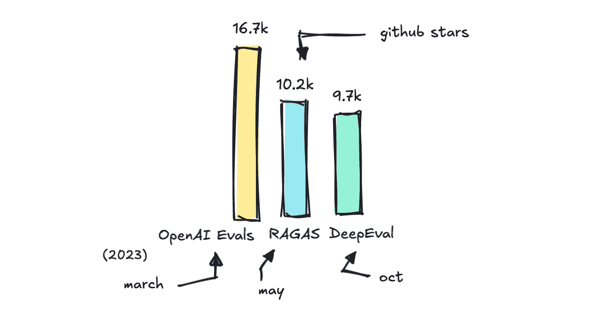

*您可以在* [*这个仓库*](https://github.com/ilsilfverskiold/Awesome-LLM-Resources-List/blob/main/README.md#evaluation-frameworks-and-add-ons) *中找到我找到的不同评估框架的完整列表*。

*您还可以使用许多特定于框架的评估系统，例如 LlamaIndex，特别是用于快速原型设计*。

OpenAI 和 MLFlow 的 Evals 是附加组件，而不是独立的框架，而 RAGAS 主要被构建为评估 RAG 应用程序的指标库（尽管他们也提供了其他指标）。

DeepEval 可能是所有这些中最全面的评估库。

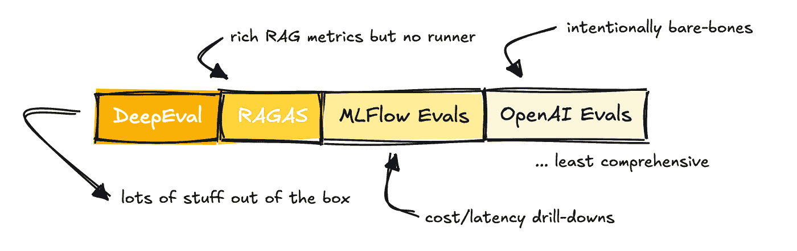

然而，重要的是要提到，它们都提供了在您自己的数据集上运行评估的能力，以某种方式支持多轮对话、RAG 和代理，支持 LLM 作为裁判，允许设置自定义指标，并且对 CI 友好。

正如之前提到的，它们在全面性方面有所不同。

MLFlow 主要被构建来评估传统的机器学习管道，因此他们提供的指标数量对于基于 LLM 的应用程序来说较低。OpenAI 是一个非常轻量级的解决方案，它期望您自己设置指标，尽管他们提供了一个示例库来帮助您开始。

RAGAS 提供了许多指标，并与 LangChain 集成，因此您可以轻松运行它们。

DeepEval 提供了许多开箱即用的功能，包括 RAGAS 指标。

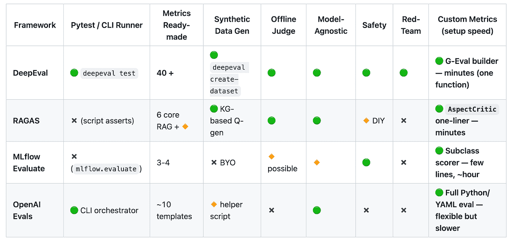

*您可以在[这里](https://github.com/ilsilfverskiold/Awesome-LLM-Resources-List/blob/main/README.md#evaluation-frameworks-and-add-ons)找到比较的仓库*。

如果我们看看提供的指标，我们可以了解这些解决方案的广泛程度。

值得注意的是，提供指标的那些框架并不总是遵循一个标准的命名规范。它们可能意味着相同的事情，但称呼不同。

例如，一个方面的忠实度可能意味着另一个方面的扎根性。答案的相关性可能与响应的相关性相同，等等。

这在评估系统方面造成了大量的不必要的混淆和复杂性。

尽管如此，DeepEval 以超过 40 个指标脱颖而出，并且还提供了一个名为 G-Eval 的框架，该框架可以帮助你快速设置自定义指标，使其成为从想法到可运行的指标的最快方式。

当您需要定制逻辑而不是仅仅需要一个快速裁判时，OpenAI 的 Evals 框架更适合。

根据 DeepEval 团队的说法，自定义指标是开发者设置最多的，所以不要纠结于谁提供什么指标。你的用例将是独特的，因此评估方式也将是独特的。

那么，**在什么情况下你应该使用哪个呢？**

当你需要为 RAG 管道设置专用指标且设置最小化时，请使用 RAGAS。当你想要一个完整、即插即用的评估套件时，请选择 DeepEval。

如果你已经投资了 MLFlow 或者更喜欢内置的跟踪和 UI 功能，那么 MLFlow 是一个不错的选择。OpenAI 的 Evals 框架最为基础，所以如果你与 OpenAI 基础设施紧密相连并且想要灵活性，那么它是最适合的。

最后，DeepEval 还通过他们的 DeepTeam 框架提供红队测试，该框架自动化了 LLM 系统的对抗性测试。还有其他框架也做这件事，尽管可能没有这么广泛。

我将来必须做一些关于 LLM 系统的对抗性测试和提示注入的工作。这是一个有趣的话题。

* * *

数据集业务是一个有利可图的业务，这也是为什么我们现在到了这个地步，可以使用其他 LLM 来标注数据或评分测试。

然而，LLM 判定者并不是魔术师，你设置的评估可能你会发现有点不可靠，就像你构建的任何其他 LLM 应用程序一样。根据网络上的信息，大多数团队和公司每隔几周就会进行一次人工抽样审计，以保持真实。

你为你的应用程序设置的指标很可能是定制的，所以尽管我现在已经让你听到了很多，但你可能还是会自己构建一些东西。

了解标准指标是什么总是好的。

希望无论如何它都证明了其教育价值。

如果你喜欢这篇文章，请务必阅读我在 TDS 上的其他文章，或者在中[Medium](https://medium.com/@ilsilfverskiold)上。

如果你想要在发布新内容时得到通知，可以关注我的[LinkedIn](https://www.linkedin.com/in/ida-silfverskiold/)或我的[网站](https://www.ilsilfverskiold.com/)。

❤
