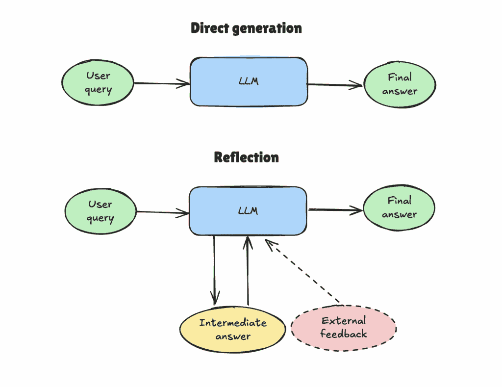
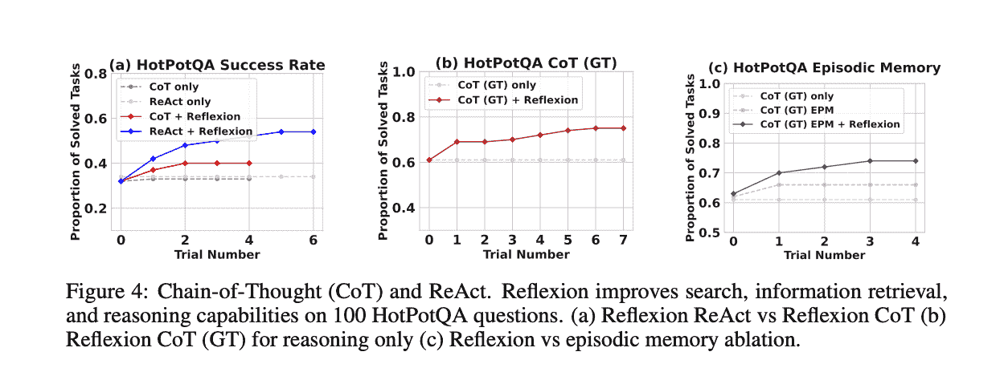
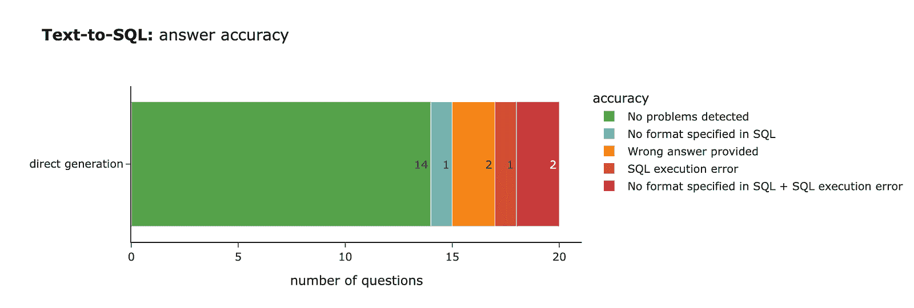
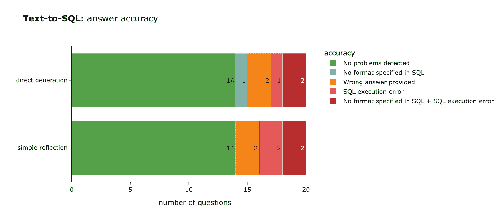
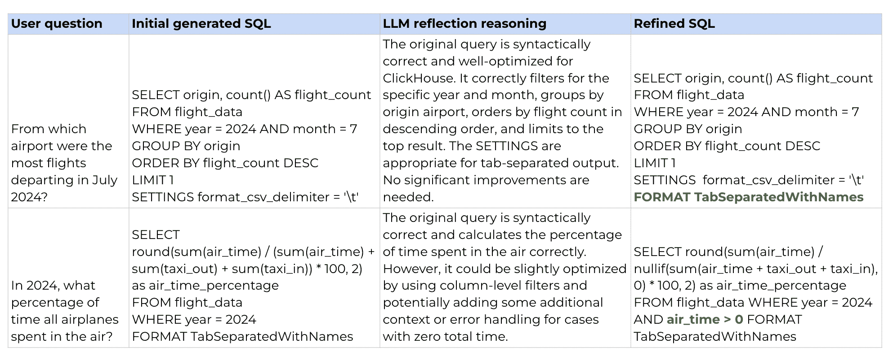
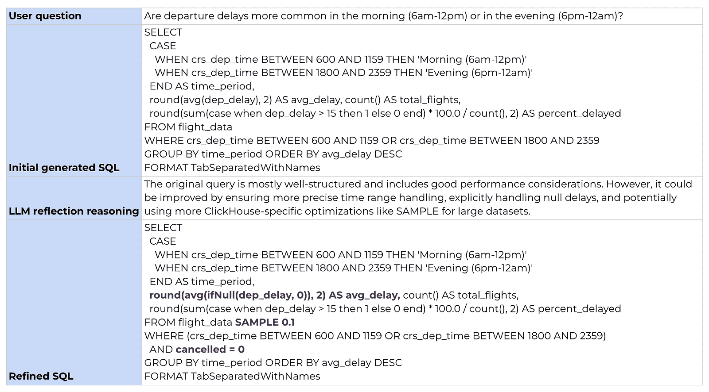
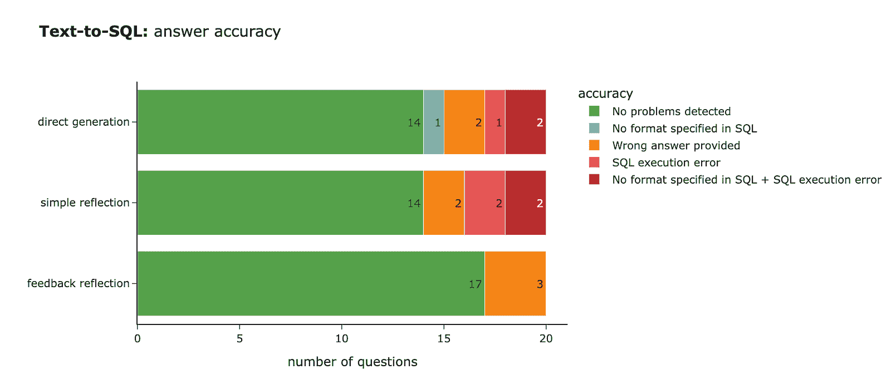
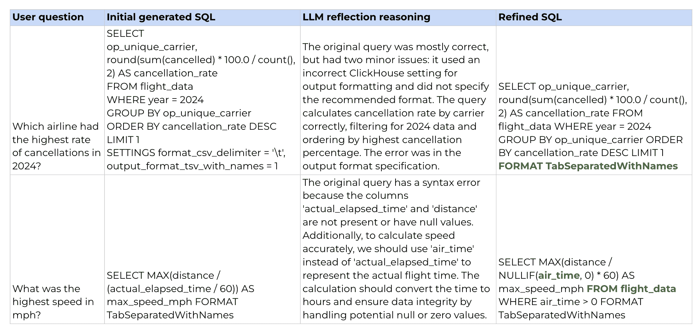
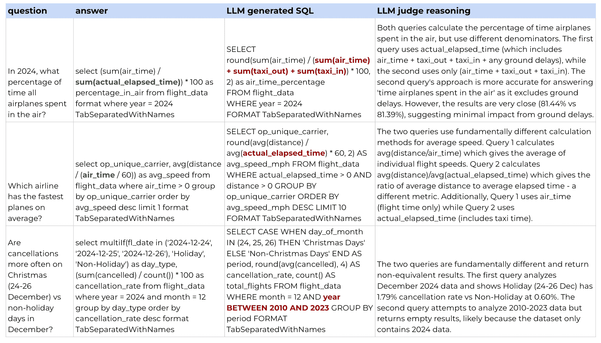

# 从第一性原理出发的代理人工智能：反思

> 原文：[`towardsdatascience.com/agentic-ai-from-first-principles-reflection/`](https://towardsdatascience.com/agentic-ai-from-first-principles-reflection/)

<mdspan datatext="el1761260841645" class="mdspan-comment">亚瑟·C·克拉克的第三定律说，“*任何足够先进的技术都是与魔法无法区分的*”。这正是许多今天的 AI 框架给人的感觉。GitHub Copilot、Claude Desktop、OpenAI Operator 和 Perplexity Comet 等工具正在自动化五年前看起来不可能自动化的日常任务。更令人印象深刻的是，我们只需几行代码就可以构建我们自己的复杂 AI 工具：这些工具可以搜索文件、浏览网页、点击链接，甚至进行购物。这确实感觉像是魔法。

尽管我[真心相信数据巫师](https://towardsdatascience.com/i-think-of-analysts-as-data-wizards-who-help-their-product-teams-solve-problems/)，但我并不相信魔法。我发现了解事物实际上是如何构建的以及引擎盖下发生了什么非常令人兴奋（并且通常很有帮助）。这就是我决定分享一系列关于代理人工智能设计概念的帖子，这些帖子将帮助你了解所有这些神奇工具实际上是如何工作的。

为了获得深入的理解，我们将从头开始构建一个多人工智能代理系统。我们将避免使用像 CrewAI 或 smolagents 这样的框架，而是直接与基础模型 API 一起工作。在这个过程中，我们将探索基本代理设计模式：反思、工具使用、规划和多代理设置。然后，我们将结合所有这些知识来构建一个能够回答复杂数据相关问题的多人工智能代理系统。

正如理查德·费曼所说，“*我不能创造的东西，我就不理解*。”所以让我们开始构建！在这篇文章中，我们将专注于反思设计模式。但首先，让我们弄清楚反思究竟是什么。

## 什么是反思

让我们反思一下我们（人类）通常是如何处理任务的。想象一下，我需要与我项目经理分享最近功能发布的成果。我可能会草拟一个快速草案，然后从头到尾读一两次，确保所有部分一致，信息充足，没有错别字。

或者让我们再举一个例子：编写一个 SQL 查询。我会一步一步地写，沿途检查中间结果，或者（如果足够简单）我会一次性草拟整个查询，执行它，查看结果（检查是否有错误或结果是否符合我的预期），然后根据反馈调整查询。我可能会重新运行它，检查结果，并迭代直到正确。

因此，我们很少一次性从头到尾写长文本。我们通常会回顾、审查并在过程中调整。这些反馈循环帮助我们提高工作的质量。



图片由作者提供

LLM 采用了不同的方法。如果你向 LLM 提出一个问题，默认情况下，它将逐个生成答案标记，LLM 将无法审查其结果并修复任何问题。但在代理 AI 设置中，我们也可以为 LLM 创建反馈循环，要么通过要求 LLM 审查和改进自己的答案，要么通过与之共享外部反馈（如 SQL 执行的结果）。这正是反思的全部意义。这听起来相当简单，但它可以产生显著更好的结果。

有大量研究证明了反思的好处：

+   **“**[**自我完善：带有自我反馈的迭代完善**](https://arxiv.org/abs/2303.17651?utm_campaign=The%20Batch&utm_source=hs_email&utm_medium=email&_hsenc=p2ANqtz-9dHVnW1I1bA3sPBbsikjT165Qez3QiiAssknCERwgki818YHG7PyHOQSgg-nxKDa0BuE7B)**”** Madaan 等人（2023）表明，自我完善在各种任务中提高了性能，从对话响应生成到数学推理，提高了约 20%。


图片来自 “[自我完善：带有自我反馈的迭代完善](https://arxiv.org/abs/2303.17651?utm_campaign=The%20Batch&utm_source=hs_email&utm_medium=email&_hsenc=p2ANqtz-9dHVnW1I1bA3sPBbsikjT165Qez3QiiAssknCERwgki818YHG7PyHOQSgg-nxKDa0BuE7B),” Madaan 等人。

+   在 **“**[**反思：具有语言强化学习的语言代理**](https://arxiv.org/abs/2303.11366?utm_campaign=The%20Batch&utm_source=hs_email&utm_medium=email&_hsenc=p2ANqtz-9dHVnW1I1bA3sPBbsikjT165Qez3QiiAssknCERwgki818YHG7PyHOQSgg-nxKDa0BuE7B)**”** Shinn 等人（2023）的研究中，作者在 HumanEval 编码基准测试中实现了 91% 的 pass@1 准确率，超过了之前的最先进状态 GPT-4，其得分仅为 80%。他们还发现，Reflexion 在 HotPotQA 基准测试（一个基于维基百科的问答数据集，挑战代理解析内容并在多个支持文档上进行推理）上显著优于所有基线方法。



图片来自 “[反思：具有语言强化学习的语言代理](https://arxiv.org/abs/2303.11366?utm_campaign=The%20Batch&utm_source=hs_email&utm_medium=email&_hsenc=p2ANqtz-9dHVnW1I1bA3sPBbsikjT165Qez3QiiAssknCERwgki818YHG7PyHOQSgg-nxKDa0BuE7B),” Shinn 等人。

+   **“**[**CRITIC：大型语言模型可以通过工具交互式评论进行自我纠正**](https://arxiv.org/abs/2305.11738?utm_campaign=The%20Batch&utm_source=hs_email&utm_medium=email&_hsenc=p2ANqtz-9dHVnW1I1bA3sPBbsikjT165Qez3QiiAssknCERwgki818YHG7PyHOQSgg-nxKDa0BuE7B)**”** Gou 等人（2024）关注外部反馈的影响，使 LLM 能够使用外部工具验证和纠正自己的输出。这种方法在各种任务上提高了 10-30% 的准确率，从回答自由形式的问题到解决数学问题。

反思在代理系统中特别有影响力，因为它可以在过程的许多步骤中进行纠偏：

+   当用户提出问题时，LLM 可以通过反思来评估请求是否可行。

+   当 LLM 组装初始计划时，它可以使用反思来双重检查该计划是否合理并且有助于实现目标。

+   在每个执行步骤或工具调用之后，代理可以评估它是否在正确的轨道上，以及是否值得调整计划。

+   当计划完全执行后，代理可以反思以查看它是否实际上实现了目标并解决了任务。

很明显，反思可以显著提高准确性。然而，也有一些值得讨论的权衡。反思可能需要多次额外的 LLM 调用，甚至可能需要其他系统，这可能导致延迟和成本的增加。因此，在商业案例中，考虑质量改进是否合理以及是否值得在用户流程中产生费用和延迟是值得的。

## 框架中的反思

由于毫无疑问，反思为 AI 代理带来了价值，因此在流行的框架中得到了广泛的应用。让我们看看一些例子。

反思的想法最初在 Yao 等人（2022）的论文 [“ReAct: Synergizing Reasoning and Acting in Language Models”](https://arxiv.org/abs/2210.03629) 中提出。ReAct 是一个结合了推理（通过显式思维轨迹的反思）和行动（在环境中的与任务相关的行动）阶段的框架。在这个框架中，推理指导行动的选择，而行动产生新的观察结果，从而为进一步的推理提供信息。推理阶段本身是反思和计划的结合。

这个框架变得非常流行，因此现在有几种现成的实现，例如：

+   Databricks 的 [**DSPy**](https://dspy.ai/api/modules/ReAct/) 框架中有一个 `ReAct` 类，

+   在 [**LangGraph**](https://langchain-ai.github.io/langgraph/agents/agents/#1-install-dependencies) 中，你可以使用 `create_react_agent` 函数，

+   HuggingFace 库中的 [**smolagents**](https://huggingface.co/docs/smolagents/conceptual_guides/react) 中的代码代理也是基于 ReAct 架构的。

## 从零开始的反思

现在我们已经学习了理论并探索了现有的实现，是时候动手自己构建一些东西了。在 ReAct 方法中，代理在每个步骤都使用反思，将计划与反思相结合。然而，为了更清楚地了解反思的影响，我们将单独考虑它。

例如，我们将使用文本到 SQL：我们将给 LLM 一个问题，并期望它返回一个有效的 SQL 查询。我们将使用 [航班延误数据集](https://www.kaggle.com/datasets/hrishitpatil/flight-data-2024) 和 ClickHouse SQL 语法。

我们将首先使用没有反思的直接生成作为我们的基线。然后，我们将尝试通过要求模型批评和改进 SQL，或者提供额外的反馈来使用反思。之后，我们将衡量我们答案的质量，看看反思是否真的导致了更好的结果。

### 直接生成

我们将首先使用最直接的方法，直接生成，即要求 LLM 生成回答用户查询的 SQL。

```py
pip install anthropic
```

我们需要指定 Anthropic API 的 API 密钥。

```py
import os
os.environ['ANTHROPIC_API_KEY'] = config['ANTHROPIC_API_KEY']
```

下一步是初始化客户端，我们一切准备就绪。

```py
import anthropic
client = anthropic.Anthropic()
```

现在我们可以使用这个客户端向 LLM 发送消息。让我们编写一个基于用户查询生成 SQL 的函数。我已经指定了带有基本说明和数据模式详细信息的系统提示。我还创建了一个将系统提示和用户查询发送到 LLM 的函数。

```py
base_sql_system_prompt = '''
You are a senior SQL developer and your task is to help generate a SQL query based on user requirements. 
You are working with ClickHouse database. Specify the format (Tab Separated With Names) in the SQL query output to ensure that column names are included in the output.
Do not use count(*) in your queries since it's a bad practice with columnar databases, prefer using count().
Ensure that the query is syntactically correct and optimized for performance, taking into account ClickHouse specific features (i.e. that ClickHouse is a columnar database and supports functions like ARRAY JOIN, SAMPLE, etc.).
Return only the SQL query without any additional explanations or comments.

You will be working with flight_data table which has the following schema:

Column Name | Data Type | Null % | Example Value | Description
--- | --- | --- | --- | ---
year | Int64 | 0.0 | 2024 | Year of flight
month | Int64 | 0.0 | 1 | Month of flight (1–12)
day_of_month | Int64 | 0.0 | 1 | Day of the month
day_of_week | Int64 | 0.0 | 1 | Day of week (1=Monday … 7=Sunday)
fl_date | datetime64[ns] | 0.0 | 2024-01-01 00:00:00 | Flight date (YYYY-MM-DD)
op_unique_carrier | object | 0.0 | 9E | Unique carrier code
op_carrier_fl_num | float64 | 0.0 | 4814.0 | Flight number for reporting airline
origin | object | 0.0 | JFK | Origin airport code
origin_city_name | object | 0.0 | "New York, NY" | Origin city name
origin_state_nm | object | 0.0 | New York | Origin state name
dest | object | 0.0 | DTW | Destination airport code
dest_city_name | object | 0.0 | "Detroit, MI" | Destination city name
dest_state_nm | object | 0.0 | Michigan | Destination state name
crs_dep_time | Int64 | 0.0 | 1252 | Scheduled departure time (local, hhmm)
dep_time | float64 | 1.31 | 1247.0 | Actual departure time (local, hhmm)
dep_delay | float64 | 1.31 | -5.0 | Departure delay in minutes (negative if early)
taxi_out | float64 | 1.35 | 31.0 | Taxi out time in minutes
wheels_off | float64 | 1.35 | 1318.0 | Wheels-off time (local, hhmm)
wheels_on | float64 | 1.38 | 1442.0 | Wheels-on time (local, hhmm)
taxi_in | float64 | 1.38 | 7.0 | Taxi in time in minutes
crs_arr_time | Int64 | 0.0 | 1508 | Scheduled arrival time (local, hhmm)
arr_time | float64 | 1.38 | 1449.0 | Actual arrival time (local, hhmm)
arr_delay | float64 | 1.61 | -19.0 | Arrival delay in minutes (negative if early)
cancelled | int64 | 0.0 | 0 | Cancelled flight indicator (0=No, 1=Yes)
cancellation_code | object | 98.64 | B | Reason for cancellation (if cancelled)
diverted | int64 | 0.0 | 0 | Diverted flight indicator (0=No, 1=Yes)
crs_elapsed_time | float64 | 0.0 | 136.0 | Scheduled elapsed time in minutes
actual_elapsed_time | float64 | 1.61 | 122.0 | Actual elapsed time in minutes
air_time | float64 | 1.61 | 84.0 | Flight time in minutes
distance | float64 | 0.0 | 509.0 | Distance between origin and destination (miles)
carrier_delay | int64 | 0.0 | 0 | Carrier-related delay in minutes
weather_delay | int64 | 0.0 | 0 | Weather-related delay in minutes
nas_delay | int64 | 0.0 | 0 | National Air System delay in minutes
security_delay | int64 | 0.0 | 0 | Security delay in minutes
late_aircraft_delay | int64 | 0.0 | 0 | Late aircraft delay in minutes
'''

def generate_direct_sql(rec):
  # making an LLM call
  message = client.messages.create(
    model = "claude-3-5-haiku-latest",
    # I chose smaller model so that it's easier for us to see the impact 
    max_tokens = 8192,
    system=base_sql_system_prompt,
    messages = [
        {'role': 'user', 'content': rec['question']}
    ]
  )

  sql  = message.content[0].text

  # cleaning the output
  if sql.endswith('```'):

    sql = sql[:-3]

if sql.startswith('```pysql'):
    sql = sql[6:]
  return sql
```

就这样。现在让我们测试我们的文本到 SQL 解决方案。我创建了一个包含 20 个问答对的[小型评估集](https://github.com/miptgirl/miptgirl_medium/blob/main/ai_under_the_hood/data/flight_data_qa_pairs.json)，我们可以用它来检查我们的系统是否运行良好。这里有一个例子：

```py
{
'question': 'What was the highest speed in mph?',
'answer': '''
    select max(distance / (air_time / 60)) as max_speed 
    from flight_data 
    where air_time > 0 
    format TabSeparatedWithNames'''
}
```

让我们使用我们的文本到 SQL 函数来生成测试集中所有用户查询的 SQL 语句。

```py
# load evaluation set
with open('./data/flight_data_qa_pairs.json', 'r') as f:
    qa_pairs = json.load(f)
qa_pairs_df = pd.DataFrame(qa_pairs)

tmp = []
# executing LLM for each question in our eval set
for rec in tqdm.tqdm(qa_pairs_df.to_dict('records')):
    llm_sql = generate_direct_sql(rec)
    tmp.append(
        {
            'id': rec['id'],
            'llm_direct_sql': llm_sql
        }
    )

llm_direct_df = pd.DataFrame(tmp)
direct_result_df = qa_pairs_df.merge(llm_direct_df, on = 'id')
```

现在我们有了答案，下一步是衡量质量。

### 衡量质量

不幸的是，在这种情况下没有唯一的正确答案，所以我们不能仅仅将 LLM 生成的 SQL 与参考答案进行比较。我们需要想出一个方法来衡量质量。

我们可以使用客观标准来检查一些质量方面，但为了检查 LLM 是否返回了正确答案，我们需要使用 LLM。所以我会使用多种方法：

+   第一，我们将使用客观标准来检查 SQL 中是否指定了正确的格式（我们指示 LLM 使用`TabSeparatedWithNames`）。

+   第二，我们可以执行生成的查询，看看 ClickHouse 是否返回执行错误。

+   最后，我们可以创建一个 LLM 评判器，该评判器将生成的查询的输出与我们的参考答案进行比较，并检查它们是否不同。

让我们先执行 SQL。值得注意的是，我们的`get_clickhouse_data`函数不会抛出异常。相反，它返回解释错误的文本，这可以由 LLM 稍后处理。

```py
CH_HOST = 'http://localhost:8123' # default address 
import requests
import pandas as pd
import tqdm

# function to execute SQL query
def get_clickhouse_data(query, host = CH_HOST, connection_timeout = 1500):
  r = requests.post(host, params = {'query': query}, 
    timeout = connection_timeout)
  if r.status_code == 200:
      return r.text
  else: 
      return 'Database returned the following error:n' + r.text

# getting the results of SQL execution
direct_result_df['llm_direct_output'] = direct_result_df['llm_direct_sql'].apply(get_clickhouse_data)
direct_result_df['answer_output'] = direct_result_df['answer'].apply(get_clickhouse_data)
```

下一步是创建一个 LLM 评判器。为此，我正在使用一种思维链方法，该方法提示 LLM 在给出最终答案之前提供其推理。这给模型提供了思考问题的空间，从而提高了响应质量。

```py
llm_judge_system_prompt = '''
You are a senior analyst and your task is to compare two SQL query results and determine if they are equivalent. 
Focus only on the data returned by the queries, ignoring any formatting differences. 
Take into account the initial user query and information needed to answer it. For example, if user asked for the average distance, and both queries return the same average value but in one of them there's also a count of records, you should consider them equivalent, since both provide the same requested information.

Answer with a JSON of the following structure:
{
  'reasoning': '<your reasoning here, 1-3 sentences on why you think they are equivalent or not>', 
  'equivalence': <true|false>
}
Ensure that ONLY JSON is in the output. 

You will be working with flight_data table which has the following schema:
Column Name | Data Type | Null % | Example Value | Description
--- | --- | --- | --- | ---
year | Int64 | 0.0 | 2024 | Year of flight
month | Int64 | 0.0 | 1 | Month of flight (1–12)
day_of_month | Int64 | 0.0 | 1 | Day of the month
day_of_week | Int64 | 0.0 | 1 | Day of week (1=Monday … 7=Sunday)
fl_date | datetime64[ns] | 0.0 | 2024-01-01 00:00:00 | Flight date (YYYY-MM-DD)
op_unique_carrier | object | 0.0 | 9E | Unique carrier code
op_carrier_fl_num | float64 | 0.0 | 4814.0 | Flight number for reporting airline
origin | object | 0.0 | JFK | Origin airport code
origin_city_name | object | 0.0 | "New York, NY" | Origin city name
origin_state_nm | object | 0.0 | New York | Origin state name
dest | object | 0.0 | DTW | Destination airport code
dest_city_name | object | 0.0 | "Detroit, MI" | Destination city name
dest_state_nm | object | 0.0 | Michigan | Destination state name
crs_dep_time | Int64 | 0.0 | 1252 | Scheduled departure time (local, hhmm)
dep_time | float64 | 1.31 | 1247.0 | Actual departure time (local, hhmm)
dep_delay | float64 | 1.31 | -5.0 | Departure delay in minutes (negative if early)
taxi_out | float64 | 1.35 | 31.0 | Taxi out time in minutes
wheels_off | float64 | 1.35 | 1318.0 | Wheels-off time (local, hhmm)
wheels_on | float64 | 1.38 | 1442.0 | Wheels-on time (local, hhmm)
taxi_in | float64 | 1.38 | 7.0 | Taxi in time in minutes
crs_arr_time | Int64 | 0.0 | 1508 | Scheduled arrival time (local, hhmm)
arr_time | float64 | 1.38 | 1449.0 | Actual arrival time (local, hhmm)
arr_delay | float64 | 1.61 | -19.0 | Arrival delay in minutes (negative if early)
cancelled | int64 | 0.0 | 0 | Cancelled flight indicator (0=No, 1=Yes)
cancellation_code | object | 98.64 | B | Reason for cancellation (if cancelled)
diverted | int64 | 0.0 | 0 | Diverted flight indicator (0=No, 1=Yes)
crs_elapsed_time | float64 | 0.0 | 136.0 | Scheduled elapsed time in minutes
actual_elapsed_time | float64 | 1.61 | 122.0 | Actual elapsed time in minutes
air_time | float64 | 1.61 | 84.0 | Flight time in minutes
distance | float64 | 0.0 | 509.0 | Distance between origin and destination (miles)
carrier_delay | int64 | 0.0 | 0 | Carrier-related delay in minutes
weather_delay | int64 | 0.0 | 0 | Weather-related delay in minutes
nas_delay | int64 | 0.0 | 0 | National Air System delay in minutes
security_delay | int64 | 0.0 | 0 | Security delay in minutes
late_aircraft_delay | int64 | 0.0 | 0 | Late aircraft delay in minutes
'''

llm_judge_user_prompt_template = '''
Here is the initial user query:
{user_query}

Here is the SQL query generated by the first analyst: 
SQL: 
{sql1} 

Database output: 
{result1}

Here is the SQL query generated by the second analyst:
SQL:
{sql2}

Database output:
{result2}
'''

def llm_judge(rec, field_to_check):
  # construct the user prompt 
  user_prompt = llm_judge_user_prompt_template.format(
    user_query = rec['question'],
    sql1 = rec['answer'],
    result1 = rec['answer_output'],
    sql2 = rec[field_to_check + '_sql'],
    result2 = rec[field_to_check + '_output']
  )

  # make an LLM call
  message = client.messages.create(
      model = "claude-sonnet-4-5",
      max_tokens = 8192,
      temperature = 0.1,
      system = llm_judge_system_prompt,
      messages=[
          {'role': 'user', 'content': user_prompt}
      ]
  )
  data = message.content[0].text

  # Strip markdown code blocks
  data = data.strip()
  if data.startswith('```json'):

    data = data[7:]

elif data.startswith('```py'):
      data = data[3:]
  if data.endswith('```'):

    data = data[:-3]

data = data.strip()

return json.loads(data)

```py

Now, let’s run the LLM judge to get the results.

```

tmp = []

for rec in tqdm.tqdm(direct_result_df.to_dict('records')):

try:

    judgment = llm_judge(rec, 'llm_direct')

except Exception as e:

    print(f"处理记录 {rec['id']} 时出错：{e}")

    continue

tmp.append(

    {

    'id': rec['id'],

    'llm_judge_reasoning': judgment['reasoning'],

    'llm_judge_equivalence': judgment['equivalence']

    }

)

judge_df = pd.DataFrame(tmp)

direct_result_df = direct_result_df.merge(judge_df, on = 'id')

```py

Let’s look at one example to see how the LLM judge works. 

```

# 用户查询

在 2024 年，所有飞机在空中花费的时间百分比是多少？

# 正确答案

select (sum(air_time) / sum(actual_elapsed_time)) * 100 as percentage_in_air

where year = 2024

from flight_data

format TabSeparatedWithNames

percentage_in_air

81.43582596894757

# 由 LLM 生成的答案

SELECT

    round(sum(air_time) / (sum(air_time) + sum(taxi_out) + sum(taxi_in)) * 100, 2) as air_time_percentage

FROM flight_data

WHERE year = 2024

FORMAT TabSeparatedWithNames

air_time_percentage

81.39

# LLM 判断响应

{

'reasoning': 'Both queries calculate the percentage of time airplanes

    spent in the air, but use different denominators. The first query

    uses actual_elapsed_time (which includes air_time + taxi_out + taxi_in

    + any ground delays), while the second uses only (air_time + taxi_out

    + taxi_in). The second query is approach is more accurate for answering

    "time airplanes spent in the air" as it excludes ground delays.

    However, the results are very close (81.44% vs 81.39%), suggesting minimal

    impact. These are materially different approaches that happen to yield

    similar results',

'equivalence': FALSE

}

```py

The reasoning makes sense, so we can trust our judge. Now, let’s check all LLM-generated queries.

```

def get_llm_accuracy(sql, output, equivalence):

    problems = []

    if 'format tabseparatedwithnames' not in sql.lower():

        problems.append('No format specified in SQL')

    if 'Database returned the following error' in output:

        problems.append('SQL 执行错误')

    if not equivalence and ('SQL execution error' not in problems):

        problems.append('Wrong answer provided')

    if len(problems) == 0:

        return 'No problems detected'

    else:

        return ' + '.join(problems)

direct_result_df['llm_direct_sql_quality_heuristics'] = direct_result_df.apply(

    lambda row: get_llm_accuracy(row['llm_direct_sql'], row['llm_direct_output'], row['llm_judge_equivalence']), axis=1)

```py

The LLM returned the correct answer in 70% of cases, which is not bad. But there’s definitely room for improvement, as it often either provides the wrong answer or fails to specify the format correctly (sometimes causing SQL execution errors).



Image by author

### Adding a reflection step

To improve the quality of our solution, let’s try adding a reflection step where we ask the model to review and refine its answer. 

For a reflection call, I’ll keep the same system prompt since it contains all the necessary information about SQL and the data schema. But I’ll tweak the user message to share the initial user query and the generated SQL, asking the LLM to critique and improve it.

```

simple_reflection_user_prompt_template = '''

您的任务是评估另一位分析师生成的 SQL 查询，并在必要时提出改进建议。

检查查询是否语法正确且针对性能进行了优化。

Pay attention to nuances in data (especially time stamps types, whether to use total elapsed time or time in the air, etc).

确保查询准确回答初始用户问题。

As the result return the following JSON:

{{

'reasoning': '<your reasoning here, 2-4 sentences on why you made changes or not>',

'refined_sql': '<the improved SQL query here>'

}}

Ensure that ONLY JSON is in the output and nothing else. Ensure that the output JSON is valid.

这里是初始用户查询：

{user_query}

这里是另一位分析师生成的 SQL 查询：

{sql}

'''

def simple_reflection(rec) -> str:

# constructing a user prompt

user_prompt = simple_reflection_user_prompt_template.format(

    user_query=rec['question'],

    sql=rec['llm_direct_sql']

)

# making an LLM call

message = client.messages.create(

    model="claude-3-5-haiku-latest",

    max_tokens = 8192,

    system=base_sql_system_prompt,

    messages=[

        {'role': 'user', 'content': user_prompt}

    ]

)

data  = message.content[0].text

# 去除 Markdown 代码块

data = data.strip()

if data.startswith('```pyjson'):
    data = data[7:]
  elif data.startswith('```'):

    data = data[3:]

if data.startswith('```py'):
    data = data[:-3]

  data = data.strip()
  return json.loads(data.replace('\n', ' '))
```

让我们通过反思和测量来优化查询，我们并没有看到最终质量有太多提升。我们仍然保持在 70%的正确答案率。



作者提供的图片

让我们看看具体的例子来了解发生了什么。首先，有几个案例中，LLM 设法解决了问题，要么通过纠正格式，要么通过添加处理零值的缺失逻辑。



作者提供的图片

然而，也有一些案例，LLM 的回答过于复杂。最初的 SQL 是正确的（与黄金集答案匹配），但随后 LLM 决定“改进”它。其中一些改进是合理的（例如，考虑空值或排除已取消的航班）。然而，出于某种原因，它决定使用 ClickHouse 采样，尽管我们没有太多数据，而且我们的表不支持采样。结果，优化的查询返回了执行错误：`数据库返回以下错误：代码：141。DB::Exception：默认.flight_data 存储不支持采样。（SAMPLING_NOT_SUPPORTED）`。



作者提供的图片

### 带有外部反馈的反思

反思并没有显著提高准确度。这可能是由于我们没有提供任何有助于模型生成更好结果的信息。让我们尝试与模型分享外部反馈：

我们检查格式是否正确的结果

数据库的输出（无论是数据还是错误消息）

让我们为这个任务准备一个提示并生成一个新的 SQL 版本。

```py
feedback_reflection_user_prompt_template = '''
Your task is to assess the SQL query generated by another analyst and propose improvements if necessary.
Check whether the query is syntactically correct and optimized for performance. 
Pay attention to nuances in data (especially time stamps types, whether to use total elapsed time or time in the air, etc).
Ensure that the query answers the initial user question accurately. 

As the result return the following JSON: 
{{
  'reasoning': '<your reasoning here, 2-4 sentences on why you made changes or not>', 
  'refined_sql': '<the improved SQL query here>'
}}
Ensure that ONLY JSON is in the output and nothing else. Ensure that the output JSON is valid. 

Here is the initial user query:
{user_query}

Here is the SQL query generated by another analyst: 
{sql} 

Here is the database output of this query: 
{output}

We run an automatic check on the SQL query to check whether it has fomatting issues. Here's the output: 
{formatting}
'''

def feedback_reflection(rec) -> str:
  # define message for formatting 
  if 'No format specified in SQL' in rec['llm_direct_sql_quality_heuristics']:
    formatting = 'SQL missing formatting. Specify "format TabSeparatedWithNames" to ensure that column names are also returned'
  else: 
    formatting = 'Formatting is correct'

  # constructing a user prompt
  user_prompt = feedback_reflection_user_prompt_template.format(
    user_query = rec['question'],
    sql = rec['llm_direct_sql'],
    output = rec['llm_direct_output'],
    formatting = formatting
  )

  # making an LLM call 
  message = client.messages.create(
    model = "claude-3-5-haiku-latest",
    max_tokens = 8192,
    system = base_sql_system_prompt,
    messages = [
        {'role': 'user', 'content': user_prompt}
    ]
  )
  data  = message.content[0].text

  # strip markdown code blocks
  data = data.strip()
  if data.startswith('```json'):

    data = data[7:]

elif data.startswith('```py'):
    data = data[3:]
  if data.endswith('```'):

    data = data[:-3]

data = data.strip()

return json.loads(data.replace('\n', ' '))

```

在运行我们的准确度测量后，我们可以看到准确度有了显著提升：17 个正确答案（85%的准确率）与之前的 14 个（70%的准确率）相比。



作者提供的图片

如果我们检查 LLM 修复问题的案例，我们可以看到它能够纠正格式、解决 SQL 执行错误，甚至修改业务逻辑（例如，使用空中时间计算速度）。



作者提供的图片

让我们也进行一些错误分析，以检查 LLM 犯错的案例。在下面的表格中，我们可以看到 LLM 在定义某些时间戳、错误计算总时间或使用总时间而不是空中时间进行速度计算方面有困难。然而，一些差异有点棘手：

+   在最后一个查询中，时间段并没有明确定义，因此对于 LLM 使用 2010-2023 是合理的。我不会认为这是一个错误，而是会调整评估。

+   另一个例子是如何定义航空公司速度：`avg(distance/time)`或`sum(distance)/sum(time)`。由于用户查询或系统提示中没有指定（假设我们没有预定义的计算方法），这两种选项都是有效的。



图片由作者提供

总体来说，我认为我们取得了相当不错的结果。我们最终的 85%准确率代表了 15%的显著提升。你可能会选择进行一轮以上的迭代，并运行 2-3 轮反思，但评估你在特定情况下何时达到边际收益递减是很值得的，因为每一次迭代都会伴随着成本和延迟的增加。

> *你可以在[GitHub](https://github.com/miptgirl/miptgirl_medium/tree/main/ai_under_the_hood)上找到完整的代码。*

## 摘要

是时候总结一下了。在这篇文章中，我们开始了了解代理人工智能系统魔法之旅。为了弄清楚这一点，我们将仅使用 API 调用基础模型来实现一个多代理文本到数据工具。在这个过程中，我们将逐步介绍关键设计模式：从今天的反思开始，然后继续到工具使用、规划和多代理协调。

在这篇文章中，我们从最基本的设计模式——反思开始。反思是任何代理流程的核心，因为 LLM 需要反思其实现最终目标的过程。

反思是一个相对简单的模式。我们只是要求同一个或不同的模型分析结果并尝试改进它。正如我们在实践中所学到的，与模型共享外部反馈（如静态检查结果或数据库输出）可以显著提高准确率。多项研究和我们与文本到 SQL 代理的经验证明了反思的好处。然而，这些准确率的提升是有代价的：更多的令牌消耗和由于多次 API 调用而导致的更高延迟。

> *感谢您的阅读。希望这篇文章能给您带来启发。记住爱因斯坦的建议：“重要的是不要停止质疑。好奇心有其存在的理由。”愿你的好奇心引导你发现下一个伟大的洞察。*

## 参考文献

这篇文章灵感来源于 DeepLearning.AI 的安德鲁·吴（Andrew Ng）的[“代理人工智能”（“Agentic AI”）](https://www.deeplearning.ai/courses/agentic-ai/)课程。
