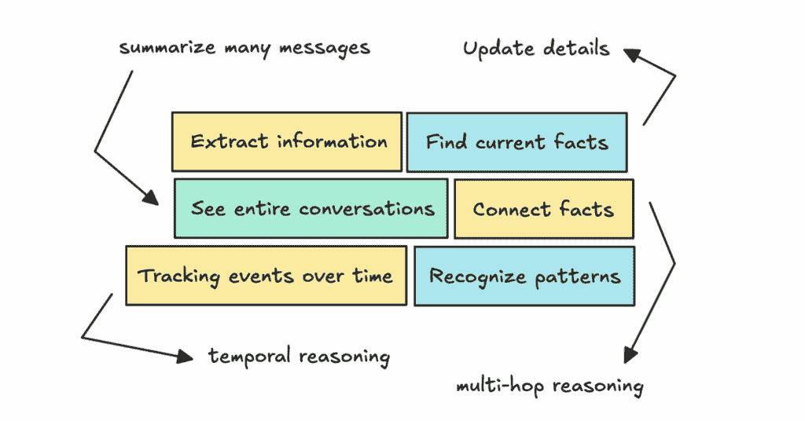
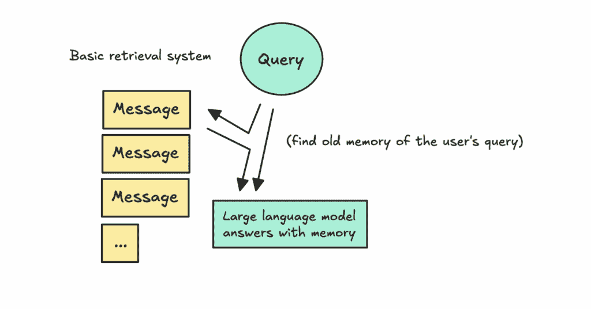
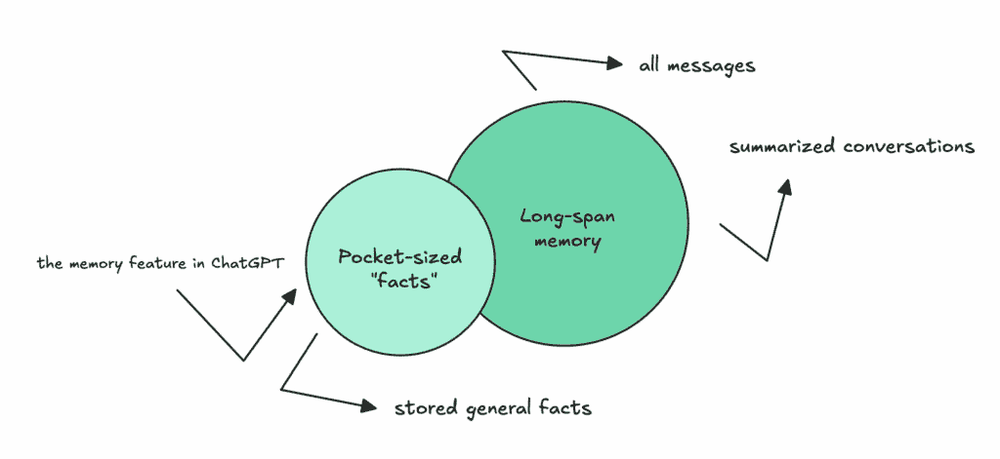
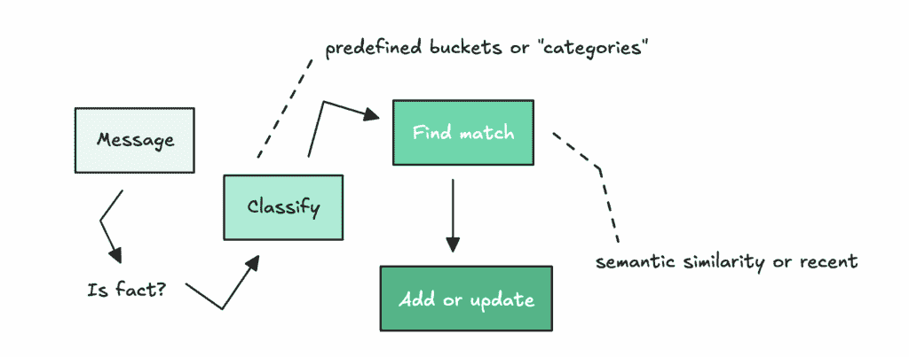
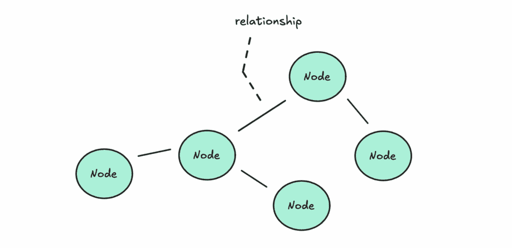
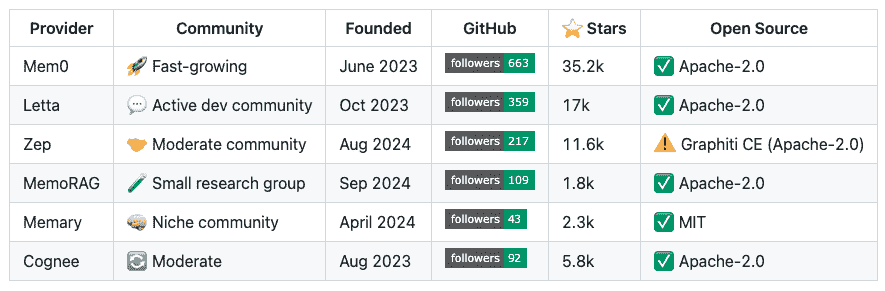
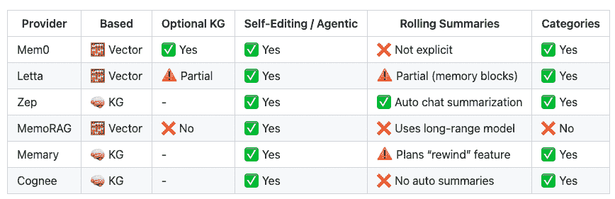
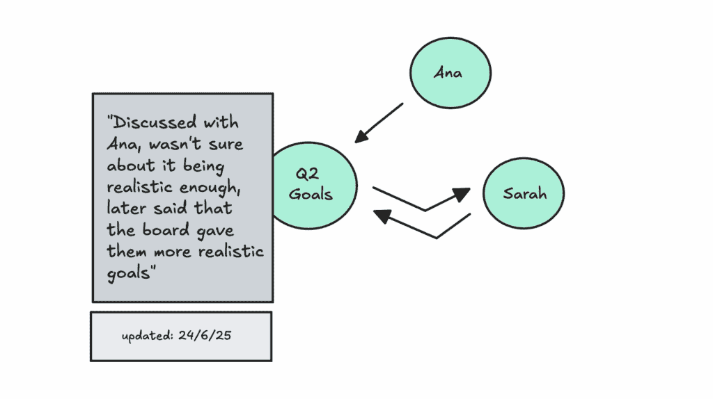
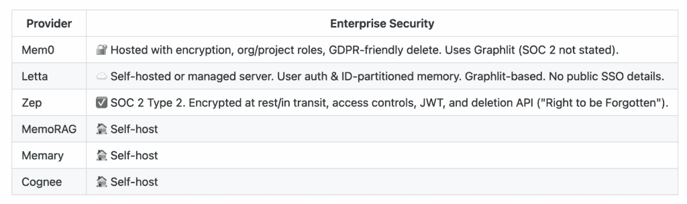
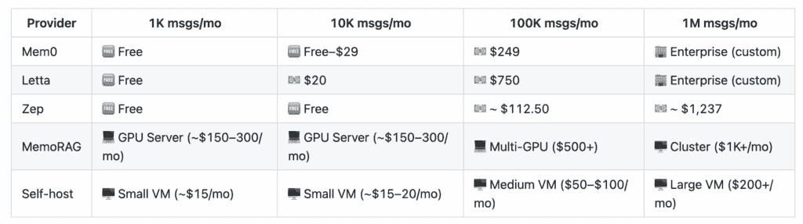

# 代理式 AI：实现长期记忆

> 原文：[`towardsdatascience.com/agentic-ai-implementing-long-term-memory/`](https://towardsdatascience.com/agentic-ai-implementing-long-term-memory/)

<mdspan datatext="el1750793593142" class="mdspan-comment">如果你曾经与 LLM 合作过</mdspan>，你知道它们是无状态的。如果你没有，可以将它们想象为没有短期记忆。

这部电影《记忆碎片》就是一个例子，主角不断需要通过贴有事实的便利贴来提醒自己发生了什么，以拼凑出他接下来应该做什么。

与 LLM 交谈时，我们需要在每次互动时不断提醒它们对话内容。

实现我们所说的“短期记忆”或状态是容易的。我们只需抓取几个先前的问答对，并将它们包含在每个调用中。

另一方面，长期记忆是完全不同的生物。

为了确保 LLM 能够检索正确的信息，理解之前的对话，并连接信息，我们需要构建一些相当复杂的系统。

我们需要一个高效记忆解决方案所需的不同事物 | 图片由作者提供

本文将探讨这个问题，探讨构建高效系统所需的要素，讨论不同的架构选择，并查看可以帮助我们的开源和云服务提供商。

## 思考解决方案

让我们首先回顾一下为 LLM 构建记忆的思考过程，以及我们需要什么来使其高效。

我们首先需要的是让 LLM 能够检索旧消息，告诉我们已经说过什么。所以我们可以问它，“你告诉我去斯德哥尔摩的那家餐厅的名字是什么？”这将是**基本信息提取**。

如果你完全不了解构建 LLM 系统，你的第一个想法可能是将每个记忆直接倒入上下文窗口，让 LLM 自己理解。

这种策略虽然使得 LLM 难以判断什么重要什么不重要，这可能导致它产生幻觉答案。

你的第二个想法可能是存储每条消息及其摘要，并在查询到来时使用混合搜索来检索信息。

使用简单的检索进行记忆 | 图片由作者提供

这将类似于你构建标准检索系统的方式。

这个问题在于，一旦开始扩展，你将遇到内存膨胀、过时或相互矛盾的事实，以及一个不断需要修剪的向量数据库。

你可能还需要了解事情发生的时间，这样你就可以问，“你是什么时候告诉我这家餐厅的？”这意味着你需要一定程度的**时间推理**。

这可能会促使你实施带有时间戳的更好元数据，并可能需要一个**自我编辑系统来更新和总结输入**。

虽然更复杂，但自我编辑系统可以在需要时更新事实并使它们失效。

如果你继续思考这个问题，你可能还希望 LLM 连接不同的事实——执行多跳推理——并识别模式。

因此，你可以问它像，“今年我参加了多少场音乐会？”或“你认为我的音乐品味是什么？”这可能会让你尝试知识图谱。

### 解决方案的组织

这个问题变得如此之大，迫使人们更好地组织它。我认为长期记忆分为两部分：**口袋大小的知识点**和之前对话的**长期记忆**。

组织长期记忆 | 图像由作者提供

对于第一部分，口袋大小的知识点，我们可以以 ChatGPT 的记忆系统为例。

要构建这种类型的记忆，他们可能使用分类器来决定一条消息是否包含应该存储的事实。

模拟 ChatGPT 的口袋知识点记忆 | 图像由作者提供

然后，他们将事实分类到预定义的桶中（例如个人资料、偏好或项目），如果它与现有记忆相似，则更新现有记忆；如果不相似，则创建一个新的记忆。

另一部分，长期记忆，意味着存储所有消息并总结整个对话，以便稍后参考。这在 ChatGPT 中也存在，但就像口袋大小的记忆一样，你必须启用它。

在这里，如果你自己构建它，你需要决定保留多少细节，同时要考虑到我们之前讨论过的内存膨胀和数据库的增长。

### 标准架构解决方案

如果我们看看其他人正在做什么，这里有两个主要的架构选择：向量和知识图谱。

我首先介绍了一种基于检索的方法。这通常是人们入门时首先想到的。检索使用向量存储（通常是稀疏搜索），这意味着它支持语义和关键词搜索。

起初，检索很简单——你将文档嵌入并基于用户问题进行检索。

但按照我们之前讨论的方式去做，意味着每个输入都是不可变的。这意味着即使事实已经改变，文本仍然会保留在那里。

可能会出现的问题包括检索多个相互冲突的事实，这可能会让代理感到困惑。在最坏的情况下，相关的事实可能被埋没在检索到的文本堆中。

代理也不知道某件事是在什么时候说的，或者它是指过去还是未来。

正如我们之前讨论的那样，有办法解决这个问题。

你可以搜索旧的记忆并更新它们，为元数据添加时间戳，并定期总结对话，以帮助 LLM 理解检索细节的上下文。

但使用向量，你也面临着数据库不断增长的问题。最终，你可能需要修剪旧数据或压缩它，这可能会迫使你丢弃有用的细节。

如果我们看看知识图谱（KG），它们将信息表示为实体（节点）的网络以及它们之间的关系（边），而不是像向量那样表示为无结构的文本。

知识图谱 | 图片由作者提供

KG 不是覆盖数据，而是可以为旧事实分配一个`invalid_at`日期，这样你仍然可以追踪其历史。它们使用图遍历来获取信息，这让你可以跨越多个跳数跟踪关系。

因为 KG 可以在连接的节点之间跳跃，并以更结构化的方式更新事实，所以它们在时间和多跳推理方面通常表现得更好。

虽然 KG 确实存在自己的挑战。随着它们的发展，基础设施变得更加复杂，你可能会开始注意到在系统必须查找很远才能找到正确信息时，深度遍历期间的延迟更高。

无论解决方案是基于向量还是 KG，人们通常更新记忆而不是仅仅添加新的，添加了为“便携式”事实设置特定桶的能力，并经常使用 LLM 在摄入之前总结和提取信息。

如果我们回到最初的目标——同时拥有便携式记忆和长期记忆——你可以混合使用 RAG 和 KG 方法来达到你想要的效果。

## 当前供应商解决方案（即插即用）

我将介绍几种不同的独立解决方案，这些解决方案可以帮助你设置记忆，查看它们的工作方式，它们使用的架构以及它们的框架有多成熟。

长期记忆提供者 – 我总是在这个[仓库](https://github.com/ilsilfverskiold/Awesome-LLM-Resources-List/blob/main/README.md#long-term-memory)中收集资源 | 图片由作者提供

构建高级 LLM 应用仍然非常新颖，因此这些解决方案中的大多数只在最近一两年内发布。当你刚开始时，查看这些框架是如何构建的，以了解你可能需要什么，可能会有所帮助。

如前所述，它们大多数属于 KG 优先或向量优先的类别。

内存提供者功能 – 我总是在这个[仓库](https://github.com/ilsilfverskiold/Awesome-LLM-Resources-List/blob/main/README.md#long-term-memory)中收集资源 | 图片由作者提供

如果我们首先看看基于 KG 的解决方案 Zep（或 Graphiti），它们使用 LLM 来提取、添加、使无效和更新节点（实体）以及边（带时间戳的关系）。

可视化 Zep 向节点添加数据并更新 | 图片由作者提供

当你提问时，它会执行语义和关键词搜索以找到相关的节点，然后遍历到连接的节点以获取相关事实。

如果一条新消息包含相互矛盾的事实，它会更新节点，同时保留旧事实。

这与基于向量的 Mem0 解决方案不同，后者在彼此之上添加提取的事实，并使用自我编辑系统来识别和完全覆盖无效的事实。

Letta 以类似的方式工作，但还包括额外的功能，如核心内存，其中它存储对话摘要以及定义应该填充的块（或类别）。

所有解决方案都有设置类别的功能，我们定义了需要通过系统捕获的内容。例如，如果你正在构建一个正念应用程序，一个类别可以是“当前心情”的用户。这些是我们之前在 ChatGPT 系统中看到的相同基于口袋的桶。

我之前提到的一件事是，向量优先的方法在时间和多跳推理方面存在问题。

例如，如果我说我将在两个月后搬到柏林，但之前提到住在斯德哥尔摩和加利福尼亚，那么如果几个月后我询问，系统会理解我现在住在柏林吗？

它能识别模式吗？有了知识图谱，信息已经结构化，这使得 LLM 更容易使用所有可用上下文。

使用向量时，随着信息的增长，噪声可能会变得太强，以至于系统无法连接点。

在 Letta 和 Mem0 中，尽管总体上更成熟，但这两个问题仍然可能发生。

对于知识图谱，担忧的是随着它们的扩展，基础设施的复杂性以及它们如何管理不断增长的信息量。

虽然我没有彻底测试它们，而且还有一些缺失的部分（比如延迟数字），但我想要提及它们如何处理企业安全，以防你打算在公司内部使用这些。

Mem cloud security – 我总是收集资源在[这个](https://github.com/ilsilfverskiold/Awesome-LLM-Resources-List/blob/main/README.md#long-term-memory)仓库 | 图片由作者提供

我找到的唯一一个获得 SOC 2 Type 2 认证的云选项是 Zep。然而，许多这些都可以自行托管，在这种情况下，安全性取决于你自己的基础设施。

这些解决方案仍然非常新。你可能会最终自己构建它们，但我建议你测试它们以了解它们如何处理边缘情况。

## 使用供应商的经济学

能够向你的 LLM 应用程序添加功能是件好事，但你需要记住这也增加了成本。

我总是包括一个关于实施技术的经济学的部分，这次也不例外。这是我在添加任何东西时首先检查的事情。我需要了解它将如何影响应用未来的单位经济学。

大多数供应商解决方案都允许你免费开始。但一旦你超过几千条消息，成本可能会迅速增加。

“估算”每条消息的内存定价——我总是在这个[仓库](https://github.com/ilsilfverskiold/Awesome-LLM-Resources-List/blob/main/README.md#long-term-memory)中收集资源 | 图片由作者提供

记住，如果你的组织每天有几百次对话，那么当你通过这些云解决方案发送每条消息时，价格将会开始累积。

从云解决方案开始可能更理想，随着你的发展再切换到自托管。

你也可以尝试混合方法。

例如，实现自己的分类器来决定哪些消息值得存储为事实以降低成本，同时将其他所有内容推送到自己的向量存储中，定期进行压缩和总结。

话虽如此，在上下文中使用字节大小的信息应该会比粘贴一个 5,000 个标记的历史块更有效。提前给 LLM 提供相关事实也有助于减少幻觉，并且总体上降低 LLM 生成成本。

## 备注

需要注意的是，即使有记忆系统，也不应该期望完美。这些系统有时仍然会幻觉或错过答案。

最好是有预期的不完美，而不是追求 100%的准确性，这样你会节省自己很多挫败感。

目前没有任何系统达到完美的准确性，至少目前还没有。研究表明，幻觉是 LLM 的一个固有部分。即使添加记忆层也无法完全消除这个问题。

* * *

希望这个练习能帮助你看到如何实现 LLM 系统中的记忆，如果你是新手的话。

仍然有一些缺失的部分，比如这些系统的扩展性、如何评估它们、安全性以及在实际环境中的延迟行为。

你需要亲自测试这一点。

如果你想关注我的写作，可以在[LinkedIn](https://www.linkedin.com/in/ida-silfverskiold/)上与我联系，或者在这里[查看我的工作](https://towardsdatascience.com/author/ilsilfverskiold/)、[Medium](https://medium.com/@ilsilfverskiold)或通过我的[个人网站](https://www.ilsilfverskiold.com/)。

我希望在今年夏天推出更多关于评估和提示的文章，并期待得到您的支持。

❤️
