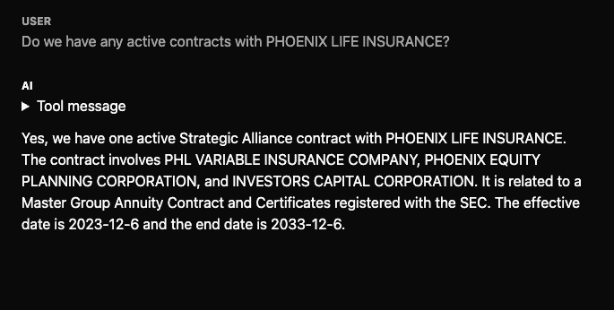
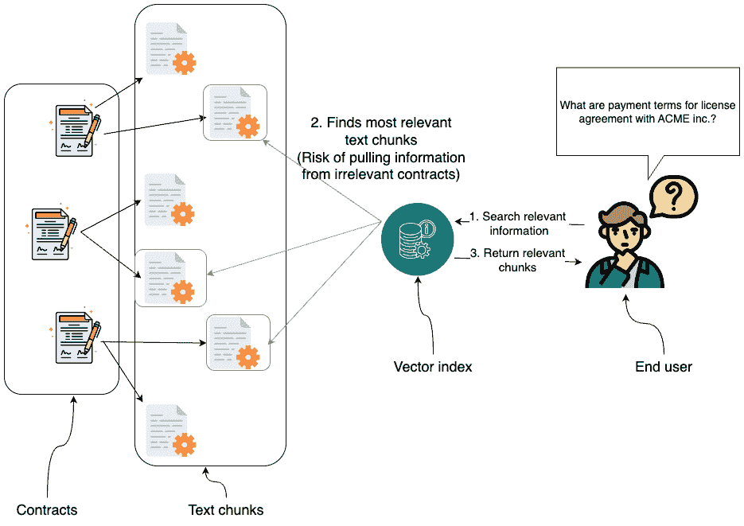
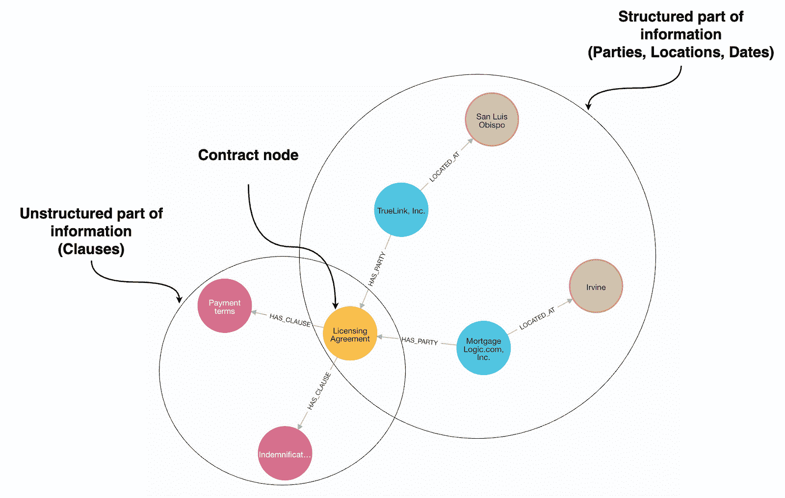
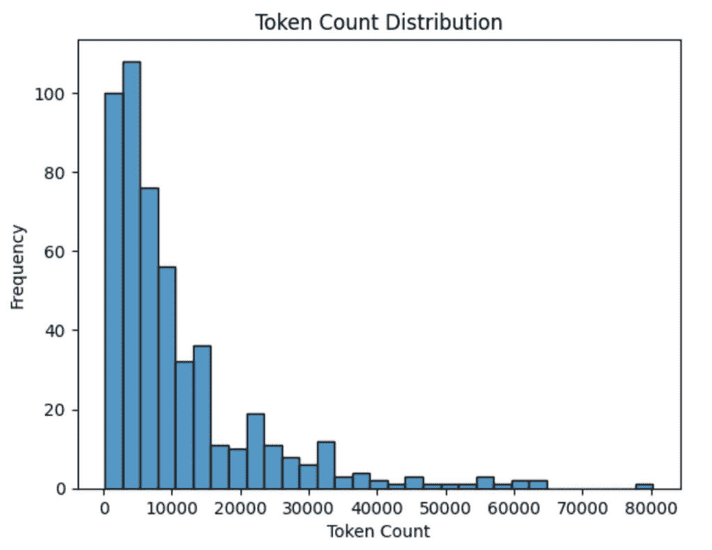
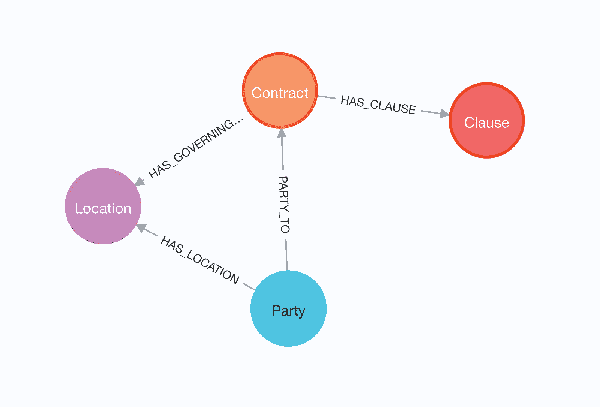
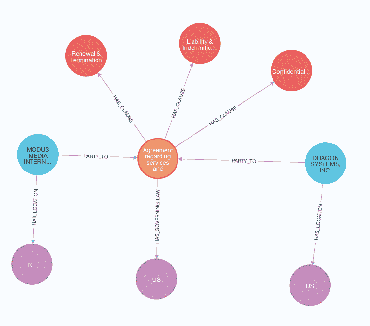
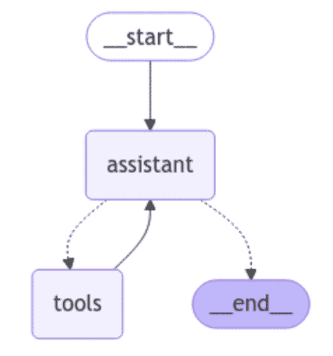
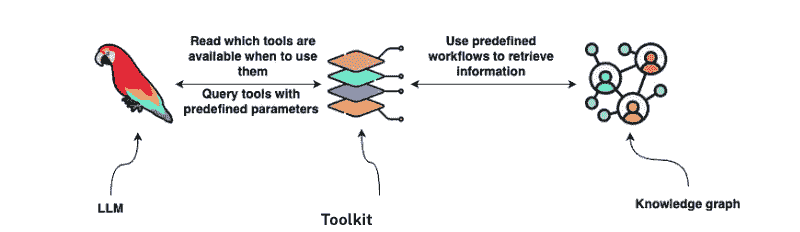
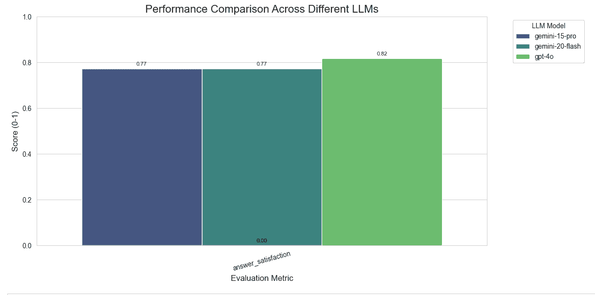
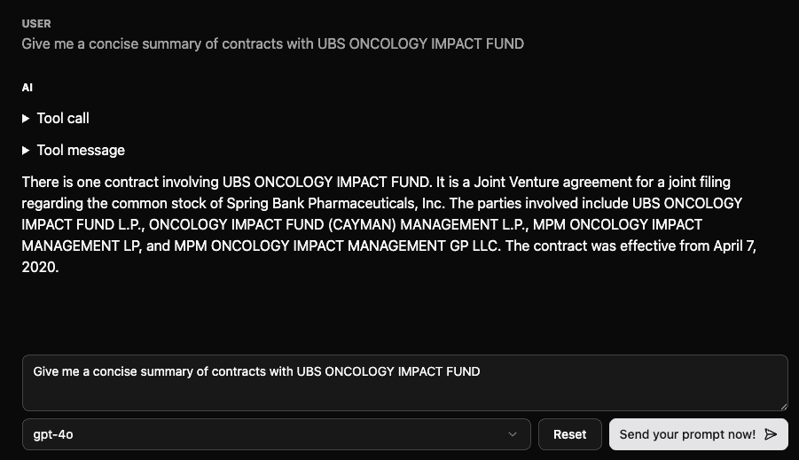

# 商业合同的 Agentic GraphRAG

> 原文：[`towardsdatascience.com/agentic-graphrag-for-commercial-contracts/`](https://towardsdatascience.com/agentic-graphrag-for-commercial-contracts/)

<mdspan datatext="el1743654067385" class="mdspan-comment">在每一个商业</mdspan>中，法律合同是定义各方之间关系、义务和责任的基础文件。无论是合伙协议、保密协议还是供应商合同，这些文件通常包含推动决策、风险管理合规性的关键信息。然而，导航和从这些合同中提取见解可能是一个复杂且耗时的过程。

在本文中，我们将探讨如何通过实现一个端到端解决方案来简化理解和处理法律合同的过程，该解决方案使用 Agentic GraphRAG。我认为 GraphRAG 是一个总称，用于任何检索或推理存储在知识图中的信息的方法，从而实现更结构化和上下文感知的响应。

通过在 Neo4j 中将法律合同结构化为知识图，我们可以创建一个易于查询和分析的信息库。从那里，我们将构建一个 LangGraph 代理，允许用户就合同提出具体问题，从而快速发现新的见解。



代码可在本[GitHub 仓库](https://github.com/tomasonjo-labs/legal-tech-chat)中找到。

### 为什么数据结构化很重要

一些领域与简单的 RAG 配合得很好，但法律合同却提出了独特的挑战。



使用简单的向量 RAG 从无关合同中提取信息

如图中所示，仅依靠向量索引来检索相关块可能会引入风险，例如从无关合同中提取信息。这是因为法律语言高度结构化，不同协议中的相似措辞可能导致检索结果不正确或误导性。这些局限性突显了需要更结构化的方法，如 GraphRAG，以确保精确和上下文感知的检索。

要实现 GraphRAG，我们首先需要构建一个知识图。



包含结构和非结构化信息的法律知识图。

为了构建法律合同的知识图谱，我们需要一种从文档中提取结构化信息并将其与原始文本一起存储的方法。LLM 可以通过阅读合同并识别关键细节（如当事人、日期、合同类型和重要条款）来提供帮助。我们不是将合同视为一个文本块，而是将其分解为反映其潜在法律含义的结构化组件。例如，LLM 可以识别“ACME 公司同意从 2024 年 1 月 1 日起每月支付 10,000 美元”既包含支付义务也包含开始日期，然后我们可以以结构化格式存储这些信息。

一旦我们有了这些结构化数据，我们就将其存储在知识图谱中，其中实体（如公司、协议和条款）以及它们之间的关系被表示出来。非结构化文本仍然可用，但现在我们可以使用结构化层来细化我们的搜索，使检索更加精确。我们不仅可以获取最相关的文本片段，还可以根据属性过滤合同。这意味着我们可以回答简单 RAG 难以解决的问题，例如上个月签署了多少合同，或者我们是否与特定公司有任何活跃的协议。这些问题需要聚合和过滤，而这仅使用标准基于向量的检索是不可能的。

通过结合结构化和非结构化数据，我们还使检索更加具有上下文意识。如果用户询问合同的支付条款，我们确保搜索被限制在正确的协议上，而不是依赖于文本相似性，这可能会从无关的合同中拉入条款。这种混合方法克服了简单 RAG 的局限性，并允许对法律文件进行更深入、更可靠的分析。

### 图的构建

我们将利用一个大型语言模型（LLM）从法律文件中提取结构化信息，使用的是[**CUAD (Contract Understanding Atticus Dataset)**](https://www.atticusprojectai.org/cuad)**，这是一个广泛使用的、在 CC BY 4.0 许可下授权的合同分析基准数据集。CUAD 数据集包含超过 500 份合同，使其成为评估我们结构化提取流程的理想数据集。

下图展示了合同的标记计数分布。



此数据集中的大多数合同相对较短，标记计数低于 10,000。然而，也有一些非常长的合同，其中一些达到 80,000 个标记。这些长合同是罕见的，而较短的合同占多数。分布显示急剧下降，这意味着长合同是例外而不是规则。

我们使用 Gemini-2.0-Flash 进行提取，其输入限制为 100 万个令牌，因此处理这些合同不成问题。即使在我们数据集中最长的合同（大约 80,000 个令牌）也很好地适应了模型的能力。由于大多数合同都相对较短，我们不必担心截断或将文档分割成更小的块进行处理。

#### 结构化数据提取

大多数商业 LLMs 都有使用 Pydantic 对象来定义输出模式的选项。以下是一个关于位置的示例：

```py
class Location(BaseModel):
    """
    Represents a physical location including address, city, state, and country.
    """

    address: Optional[str] = Field(
        ..., description="The street address of the location.Use None if not provided"
    )
    city: Optional[str] = Field(
        ..., description="The city of the location.Use None if not provided"
    )
    state: Optional[str] = Field(
        ..., description="The state or region of the location.Use None if not provided"
    )
    country: str = Field(
        ...,
        description="The country of the location. Use the two-letter ISO standard.",
    )
```

当使用 LLMs 进行结构化输出时，Pydantic 通过指定属性类型并提供指导模型响应的描述来帮助定义一个清晰的模式。每个字段都有一个类型，例如`str`或`Optional[str]`，以及一个描述，告诉 LLM 如何格式化输出。

例如，在一个`Location`模型中，我们定义了关键属性，如`address`、`city`、`state`和`country`，指定了期望的数据以及其结构化方式。例如，`country`字段遵循两位字母的国家代码标准，如`"US"`、`"FR"`或`"JP"`，而不是不一致的变体，如“United States”或“USA”。这一原则也适用于其他结构化数据，ISO 8601 将日期保持在标准格式（`YYYY-MM-DD`），等等。

通过使用 Pydantic 定义结构化输出，我们使 LLM 的响应更加可靠、机器可读，并更容易集成到数据库或 API 中。清晰的字段描述进一步帮助模型生成正确格式的数据，减少了后处理的需求。

Pydantic 的模式模型可以更复杂，例如下面的**Contract**模型，它捕捉了法律协议的关键细节，确保提取的数据遵循标准化的结构。

```py
class Contract(BaseModel):
    """
    Represents the key details of the contract.
    """

    summary: str = Field(
        ...,
        description=("High level summary of the contract with relevant facts and details. Include all relevant information to provide full picture."
        "Do no use any pronouns"),
    )
    contract_type: str = Field(
        ...,
        description="The type of contract being entered into.",
        enum=CONTRACT_TYPES,
    )
    parties: List[Organization] = Field(
        ...,
        description="List of parties involved in the contract, with details of each party's role.",
    )
    effective_date: str = Field(
        ...,
        description=(
            "Enter the date when the contract becomes effective in yyyy-MM-dd format."
            "If only the year (e.g., 2015) is known, use 2015-01-01 as the default date."
            "Always fill in full date"
        ),
    )
    contract_scope: str = Field(
        ...,
        description="Description of the scope of the contract, including rights, duties, and any limitations.",
    )
    duration: Optional[str] = Field(
        None,
        description=(
            "The duration of the agreement, including provisions for renewal or termination."
            "Use ISO 8601 durations standard"
        ),
    )

    end_date: Optional[str] = Field(
        None,
        description=(
            "The date when the contract expires. Use yyyy-MM-dd format."
            "If only the year (e.g., 2015) is known, use 2015-01-01 as the default date."
            "Always fill in full date"
        ),
    )
    total_amount: Optional[float] = Field(
        None, description="Total value of the contract."
    )
    governing_law: Optional[Location] = Field(
        None, description="The jurisdiction's laws governing the contract."
    )
    clauses: Optional[List[Clause]] = Field(
        None, description=f"""Relevant summaries of clause types. Allowed clause types are {CLAUSE_TYPES}"""
    )
```

此合同模式以结构化的方式组织法律协议的关键细节，使得 LLMs 分析起来更加容易。它包括不同类型的条款，如保密或终止，每个条款都有一个简短的摘要。涉及到的各方列出了他们的姓名、地点和角色，而合同细节涵盖了诸如开始和结束日期、总价值以及管辖法等内容。一些属性，如管辖法，可以使用嵌套模型来定义，从而实现更详细和复杂的输出。

*嵌套对象方法与处理复杂数据关系的某些 AI 模型配合良好，而其他模型可能难以处理深层嵌套的细节。*

我们可以使用以下示例来测试我们的方法。我们正在使用 LangChain 框架来编排 LLMs。

```py
llm = ChatGoogleGenerativeAI(model="gemini-2.0-flash")
llm.with_structured_output(Contract).invoke(
    "Tomaz works with Neo4j since 2017 and will make a billion dollar until 2030."
    "The contract was signed in Las Vegas"
)
```

输出内容

```py
Contract(
    summary="Tomaz works with Neo4j since 2017 and will make a billion dollar until 2030.",
    contract_type="Service",
    parties=[
        Organization(
            name="Tomaz",
            location=Location(
                address=None,
                city="Las Vegas",
                state=None,
                country="US"
            ),
            role="employee"
        ),
        Organization(
            name="Neo4j",
            location=Location(
                address=None,
                city=None,
                state=None,
                country="US"
            ),
            role="employer"
        )
    ],
    effective_date="2017-01-01",
    contract_scope="Tomaz will work with Neo4j",
    duration=None,
    end_date="2030-01-01",
    total_amount=1_000_000_000.0,
    governing_law=None,
    clauses=None
)
```

现在合同数据已经以结构化格式存在，我们可以定义 Cypher 查询，将其导入 Neo4j，将实体、关系和关键条款映射到图结构中。这一步将原始提取数据转换为可查询的知识图谱，从而实现高效地遍历和检索合同见解。

```py
UNWIND $data AS row
MERGE (c:Contract {file_id: row.file_id})
SET c.summary = row.summary,
    c.contract_type = row.contract_type,
    c.effective_date = date(row.effective_date),
    c.contract_scope = row.contract_scope,
    c.duration = row.duration,
    c.end_date = CASE WHEN row.end_date IS NOT NULL THEN date(row.end_date) ELSE NULL END,
    c.total_amount = row.total_amount
WITH c, row
CALL (c, row) {
    WITH c, row
    WHERE row.governing_law IS NOT NULL
    MERGE (c)-[:HAS_GOVERNING_LAW]->(l:Location)
    SET l += row.governing_law
}
FOREACH (party IN row.parties |
    MERGE (p:Party {name: party.name})
    MERGE (p)-[:HAS_LOCATION]->(pl:Location)
    SET pl += party.location
    MERGE (p)-[pr:PARTY_TO]->(c)
    SET pr.role = party.role
)
FOREACH (clause IN row.clauses |
    MERGE (c)-[:HAS_CLAUSE]->(cl:Clause {type: clause.clause_type})
    SET cl.summary = clause.summary
)
```

此 Cypher 查询通过创建具有`summary`、`contract_type`、`effective_date`、`duration`和`total_amount`等属性的`Contract`节点，将结构化合同数据导入 Neo4j。如果指定了管辖法律，则将合同链接到`Location`节点。合同涉及的各方存储为`Party`节点，每个节点连接到一个`Location`并分配与合同相关的角色。查询还处理条款，创建`Clause`节点并将它们链接到合同，同时存储它们的类型和摘要。

处理并导入合同后，生成的图遵循以下图模式。



导入的法律图模式

让我们再看看一个单独的合同。



此图表示了一种合同结构，其中合同（橙色节点）连接到各种条款（红色节点）、各方（蓝色节点）和地点（紫色节点）。该合同包含三个条款：*续约与终止*、*责任与赔偿*和*保密与非披露*。涉及两方，*Modus Media International* 和 *Dragon Systems, Inc.*，各自连接到它们相应的地点，荷兰（NL）和美国（US）。该合同受美国法律管辖。合同节点还包含其他元数据，包括日期和其他相关细节。

使用以下凭据可以获取包含 CUAD 法律合同的公共只读实例。

```py
URI: neo4j+s://demo.neo4jlabs.com
username: legalcontracts
password: legalcontracts
database: legalcontracts
```

#### 实体解析

由于公司、个人和地点的引用方式存在差异，法律合同中的实体解析具有挑战性。一家公司可能在一份合同中表现为“Acme Inc.”，在另一份合同中表现为“Acme Corporation”，需要确定它们是否指代同一实体的过程。

一种方法是通过使用文本嵌入或 Levenshtein 距离等字符串距离度量来生成候选匹配。嵌入捕获语义相似性，而字符串距离衡量字符级差异。一旦确定了候选者，就需要进行额外的评估，比较诸如地址或税号等元数据，分析图中的共享关系，或者在关键案例中纳入人工审查。

对于大规模的实体解析，开源解决方案如[Dedupe](https://github.com/dedupeio/dedupe)和商业工具如[Senzing](https://senzing.com/)都提供了自动化方法。选择正确的方法取决于数据质量、准确度要求以及是否可行的人工监督。

在构建了法律图之后，我们可以继续进行 Agentic GraphRAG 的实现。

### Agentic GraphRAG

代理架构在复杂性、模块化和推理能力方面差异很大。在其核心，这些架构涉及一个 LLM 作为中央推理引擎，通常辅以工具、记忆和编排机制。关键的区别在于 LLM 在做出决策时的自主程度以及与外部系统的交互结构。

对于类似聊天机器人实现的最简单和最有效的设计之一是直接 LLM 与工具的方法。在这种设置中，LLM 作为决策者，动态选择调用哪些工具（如果有的话），在必要时重试操作，并按顺序执行多个工具以满足复杂请求。



该图表示一个简单的 LangGraph 代理工作流程。它从`__start__`开始，移动到`assistant`节点，在那里 LLM 处理用户输入。从那里，助手可以调用`tools`来获取相关信息，或者直接过渡到`__end__`以完成交互。如果使用工具，助手在决定是否调用另一个工具或结束会话之前会处理响应。这种结构允许代理在响应之前自主决定何时需要外部信息。

这种方法特别适合像 Gemini 或 GPT-4o 这样的强大商业模型，它们在推理和自我纠正方面表现出色。

#### 工具

LLM 是强大的推理引擎，但它们的有效性通常取决于它们配备外部工具的程度。这些工具，无论是数据库查询、API 还是搜索功能，都扩展了 LLM 检索事实、执行计算或与结构化数据交互的能力。



设计既足够通用以处理各种查询，又足够精确以返回有意义的结果的工具，更多的是艺术而非科学。我们真正构建的是 LLM 和底层数据之间的语义层。我们不是要求 LLM 理解 Neo4j 知识图谱或数据库模式的精确结构，而是定义抽象这些复杂性的工具。

采用这种方法，LLM 不需要知道合同信息是存储为图节点和关系，还是作为文档存储中的原始文本。它只需要根据用户的问题调用正确的工具来获取相关数据。

在我们的案例中，合同检索工具充当这个语义接口。当用户询问合同条款、义务或当事人时，LLM 调用一个结构化查询工具，将请求转换为数据库查询，检索相关信息，并以 LLM 可以解释和总结的格式呈现。这实现了一个灵活的、模型无关的系统，其中不同的 LLM 可以与合同数据交互，而无需直接了解其存储或结构。

设计最佳工具集没有一刀切的标准。对某个模型有效的方法可能对另一个模型无效。一些模型能够优雅地处理模糊的工具指令，而其他模型则难以处理复杂的参数或需要明确的提示。通用性和特定任务效率之间的权衡意味着工具设计需要针对所使用的 LLM 进行迭代、测试和微调。

对于合同分析，一个有效的工具应该能够检索合同并总结关键条款，而无需用户严格地表述查询。实现这种灵活性取决于深思熟虑的提示工程、健壮的架构设计和适应不同的 LLM 能力。随着模型的发展，使工具更加直观和有效的策略也在不断发展。

在本节中，我们将探讨不同的工具实现方法，比较它们的灵活性、有效性和与各种 LLM 的兼容性。

我首选的方法是动态且确定性地构建一个 Cypher 查询，并在数据库上执行它。这种方法确保了查询生成的持续性和可预测性，同时保持了实现的灵活性。通过这种方式构建查询，我们加强了语义层，使用户输入能够无缝地转换为数据库检索。这使 LLM 专注于检索相关信息，而不是理解底层的数据模型。

我们的工具旨在识别相关合同，因此我们需要为 LLM 提供基于各种属性搜索合同的选择。输入描述再次以 Pydantic 对象的形式提供。

```py
class ContractInput(BaseModel):
    min_effective_date: Optional[str] = Field(
        None, description="Earliest contract effective date (YYYY-MM-DD)"
    )
    max_effective_date: Optional[str] = Field(
        None, description="Latest contract effective date (YYYY-MM-DD)"
    )
    min_end_date: Optional[str] = Field(
        None, description="Earliest contract end date (YYYY-MM-DD)"
    )
    max_end_date: Optional[str] = Field(
        None, description="Latest contract end date (YYYY-MM-DD)"
    )
    contract_type: Optional[str] = Field(
        None, description=f"Contract type; valid types: {CONTRACT_TYPES}"
    )
    parties: Optional[List[str]] = Field(
        None, description="List of parties involved in the contract"
    )
    summary_search: Optional[str] = Field(
        None, description="Inspect summary of the contract"
    )
    country: Optional[str] = Field(
        None, description="Country where the contract applies. Use the two-letter ISO standard."
    )
    active: Optional[bool] = Field(None, description="Whether the contract is active")
    monetary_value: Optional[MonetaryValue] = Field(
        None, description="The total amount or value of a contract"
    )
```

使用 LLM 工具，属性可以采取各种形式，这取决于它们的目的。一些字段是简单的字符串，如`contract_type`和`country`，它们存储单个值。其他字段，如`parties`，是字符串列表，允许多个条目（例如，涉及合同的多个实体）。

除了基本数据类型外，属性还可以表示复杂对象。例如，`monetary_value`使用`MonetaryValue`对象，它包括结构化数据，如货币类型和运算符。虽然具有嵌套对象的属性提供了清晰和结构化的数据表示，但模型往往难以有效地处理它们，因此我们应该保持它们简单。

作为本项目的部分，我们正在尝试一个额外的`cypher_aggregation`属性，为 LLM 提供在需要特定过滤或聚合的场景中更大的灵活性。

```py
cypher_aggregation: Optional[str] = Field(
    None,
    description="""Custom Cypher statement for advanced aggregations and analytics.

    This will be appended to the base query:
    ```

    MATCH (c:Contract)

    <基于其他参数的过滤>

    WITH c, summary, contract_type, contract_scope, effective_date, end_date, parties, active, monetary_value, contract_id, countries

    <在此处输入您的 Cypher 查询>

    ```py

    Examples:

    1\. Count contracts by type:
    ```

    RETURN contract_type, count(*) AS count ORDER BY count DESC

    ```py

    2\. Calculate average contract duration by type:
    ```

    WITH contract_type, effective_date, end_date

    WHERE effective_date IS NOT NULL AND end_date IS NOT NULL

    WITH contract_type, duration.between(effective_date, end_date).days AS duration

    RETURN contract_type, avg(duration) AS avg_duration ORDER BY avg_duration DESC

    ```py

    3\. Calculate contracts per effective date year:
    ```

    RETURN effective_date.year AS year, count(*) AS count ORDER BY year

    ```py

    4\. Counts the party with the highest number of active contracts:
    ```

    UNWIND parties AS party

    WITH party.name AS party_name, active, count(*) AS contract_count

    WHERE active = true

    RETURN party_name, contract_count

    ORDER BY contract_count DESC

    LIMIT 1

    ```py
    """
```

`cypher_aggregation` 属性允许 LLM 定义用于高级聚合和分析的自定义 Cypher 语句。它通过附加由问题指定的聚合逻辑扩展了基本查询，从而实现了灵活的过滤和计算。

此功能支持使用用例，如按类型计数合同、计算平均合同期限、分析随时间变化的合同分布以及根据合同活动识别关键当事人。通过利用此属性，LLM 可以动态生成针对特定分析需求量身定制的见解，而无需预定义查询结构。

虽然这种灵活性很有价值，但应该仔细评估，因为增加的适应性是以降低一致性和鲁棒性为代价的，这是由于操作增加的复杂性。

在向 LLM 展示函数时，我们必须清楚地定义函数的名称和描述。一个结构良好的描述有助于指导模型正确使用函数，确保它理解其目的、预期输入和输出。这减少了歧义并提高了 LLM 生成有意义的和可靠的查询的能力。

```py
class ContractSearchTool(BaseTool):
    name: str = "ContractSearch"
    description: str = (
        "useful for when you need to answer questions related to any contracts"
    )
    args_schema: Type[BaseModel] = ContractInput
```

最后，我们需要实现一个函数，该函数处理给定的输入，构建相应的 Cypher 语句，并高效地执行它。

函数的核心逻辑集中在构建 Cypher 语句。我们首先将合同作为查询的基础进行匹配。

```py
cypher_statement = "MATCH (c:Contract) "
```

接下来，我们需要实现处理输入参数的函数。在这个例子中，我们主要使用属性根据给定的标准过滤合同。

**简单属性过滤**

例如，`contract_type` 属性用于执行简单的节点属性过滤。

```py
if contract_type:
    filters.append("c.contract_type = $contract_type")
    params["contract_type"] = contract_type
```

此代码在查询参数用于值时添加了 Cypher 过滤器以防止查询注入安全问题。

由于可能的合同类型值已在属性描述中呈现

```py
contract_type: Optional[str] = Field(
    None, description=f"Contract type; valid types: {CONTRACT_TYPES}"
)
```

我们不必担心将输入值映射到有效的合同类型，因为 LLM 将处理这一点。

**推断属性过滤**

我们正在构建用于 LLM 与知识图交互的工具，这些工具作为结构化查询的抽象层。一个关键特性是能够在运行时使用推断属性，类似于本体，但动态计算。

```py
if active is not None:
    operator = ">=" if active else "<"
    filters.append(f"c.end_date {operator} date()")
```

在这里，`active`作为运行时分类，确定合同是正在进行中（`>= date()`）还是已过期（`< date()`）。这种逻辑通过仅在需要时计算属性来扩展结构化 KG 查询，从而实现更灵活的 LLM 推理。通过在工具中处理这种逻辑，我们确保 LLM 与简化的直观操作交互，使其专注于推理而不是查询制定。

**相邻过滤**

有时过滤取决于相邻节点，例如将结果限制在涉及特定党派的合同中。`parties`属性是一个可选列表，当提供时，它确保只考虑与那些实体链接的合同：

```py
if parties:
    parties_filter = []
    for i, party in enumerate(parties):
        party_param_name = f"party_{i}"
        parties_filter.append(
            f"""EXISTS {{
            MATCH (c)<-[:PARTY_TO]-(party)
            WHERE toLower(party.name) CONTAINS ${party_param_name}
        }}"""
        )
        params[party_param_name] = party.lower()
```

此代码根据关联的党派过滤合同，将逻辑视为**与**，这意味着所有指定的条件都必须满足，合同才被包括。它遍历提供的`parties`列表，并构建一个查询，其中每个党派条件都必须成立。

对于每个党派，生成一个唯一的参数名称以避免冲突。`EXISTS`子句确保合同与一个名称包含指定值的党派有`PARTY_TO`关系。名称被转换为小写以允许不区分大小写的匹配。每个党派条件单独添加，强制它们之间隐含的**与**关系。

如果需要更复杂的逻辑，例如支持**或**条件或允许不同的匹配标准，输入就需要改变。不再是简单的党派名称列表，而是一个指定操作符的结构化输入格式是必需的。

**此外，我们还可以实现一个容忍轻微错别字的党派匹配方法，通过处理拼写和格式变化来改善用户体验。**

**自定义操作符过滤**

为了增加更多灵活性，我们可以引入一个操作符对象作为嵌套属性，从而允许对过滤逻辑有更多的控制。我们不是硬编码比较，而是定义一个操作符枚举并动态使用它。

例如，对于货币值，合同可能需要根据其总金额是否大于、小于或恰好等于指定值来过滤。我们不是假设固定的比较逻辑，而是定义一个表示可能操作符的枚举：

```py
class NumberOperator(str, Enum):
    EQUALS = "="
    GREATER_THAN = ">"
    LESS_THAN = "<"

class MonetaryValue(BaseModel):
    """The total amount or value of a contract"""
    value: float
    operator: NumberOperator

if monetary_value:
    filters.append(f"c.total_amount {monetary_value.operator.value} $total_value")
    params["total_value"] = monetary_value.value
```

这种方法使系统更具表现力。而不是僵化的过滤规则，工具界面允许 LLM 不仅指定一个值，还指定如何进行比较，这使得处理更广泛的查询更加容易，同时保持 LLM 的交互简单和声明性。

一些 LLM 在处理嵌套对象作为输入时遇到困难，这使得基于操作符的结构化过滤更加困难。添加一个**介于**操作符引入了额外的复杂性，因为它需要两个不同的值，这可能导致解析和输入验证中的歧义。

**最小和最大属性**

为了使事情更简单，我倾向于使用`min`和`max`属性来处理日期，因为这自然支持范围过滤，并使`between`逻辑变得简单明了。

```py
if min_effective_date:
    filters.append("c.effective_date >= date($min_effective_date)")
    params["min_effective_date"] = min_effective_date
if max_effective_date:
    filters.append("c.effective_date <= date($max_effective_date)")
    params["max_effective_date"] = max_effective_date
```

此函数通过添加可选的下限和上限条件来根据有效日期范围过滤合同，当提供`min_effective_date`和`max_effective_date`时，确保仅包括指定日期范围内的合同。

**语义搜索**

属性也可以用于语义搜索，其中我们不是一开始就依赖向量索引，而是使用后过滤方法进行元数据过滤。首先，应用结构化过滤器，如日期范围、货币价值或各方，以缩小候选集。然后，在过滤后的子集上执行向量搜索，根据语义相似度对结果进行排序。

```py
if summary_search:
    cypher_statement += (
        "WITH c, vector.similarity.cosine(c.embedding, $embedding) "
        "AS score ORDER BY score DESC WITH c, score WHERE score > 0.9 "
    )  # Define a threshold limit
    params["embedding"] = embeddings.embed_query(summary_search)
else:  # Else we sort by latest
    cypher_statement += "WITH c ORDER BY c.effective_date DESC "
```

当提供`summary_search`时，此代码应用语义搜索，通过计算合同嵌入和查询嵌入之间的余弦相似度，按相关性排序结果，并使用 0.9 的阈值过滤掉得分低的匹配项。否则，它默认按最近的`effective_date`对合同进行排序。

**动态查询**

密文聚合属性是一个我想测试的实验，它赋予 LLM 一定程度的部分文本到 Cypher 的能力，允许它在初始结构化过滤后动态生成聚合。而不是预先定义所有可能的聚合，这种方法允许 LLM 根据需求指定计算，如计数、平均值或分组摘要，使查询更加灵活和表达性强。然而，由于这会将更多的查询逻辑转移到 LLM，确保所有生成的查询都能正确工作变得具有挑战性，因为格式错误或不兼容的 Cypher 语句可能会破坏执行。这种灵活性和可靠性之间的权衡是设计系统时的一个关键考虑因素。

```py
if cypher_aggregation:
    cypher_statement += """WITH c, c.summary AS summary, c.contract_type AS contract_type, 
      c.contract_scope AS contract_scope, c.effective_date AS effective_date, c.end_date AS end_date,
      [(c)<-[r:PARTY_TO]-(party) | {party: party.name, role: r.role}] AS parties, c.end_date >= date() AS active, c.total_amount as monetary_value, c.file_id AS contract_id,
      apoc.coll.toSet([(c)<-[:PARTY_TO]-(party)-[:LOCATED_IN]->(country) | country.name]) AS countries """
    cypher_statement += cypher_aggregation
```

如果没有提供密文聚合，我们将返回识别出的合同总数以及仅五个示例合同，以避免使提示信息过于冗长。处理大量行是至关重要的，因为一个难以处理大量结果集的 LLM 是没有用的。此外，LLM 生成包含 100 个合同标题的答案也不是一个好的用户体验。

```py
cypher_statement += """WITH collect(c) AS nodes
RETURN {
    total_count_of_contracts: size(nodes),
    example_values: [
      el in nodes[..5] |
      {summary:el.summary, contract_type:el.contract_type, 
       contract_scope: el.contract_scope, file_id: el.file_id, 
        effective_date: el.effective_date, end_date: el.end_date,
        monetary_value: el.total_amount, contract_id: el.file_id, 
        parties: [(el)<-[r:PARTY_TO]-(party) | {name: party.name, role: r.role}], 
        countries: apoc.coll.toSet([(el)<-[:PARTY_TO]-()-[:LOCATED_IN]->(country) | country.name])}
    ]
} AS output"""
```

此 Cypher 语句将所有匹配的合同收集到一个列表中，返回总数以及最多五个具有关键属性（包括摘要、类型、范围、日期、货币价值、关联方及其角色以及独特的国家位置）的示例合同。

现在我们已经构建了合同搜索工具，我们将其移交给 LLM，就这样，我们实现了具有代理功能的 GraphRAG。

### 代理基准

如果你认真考虑实施具有代理能力的 GraphRAG，你需要一个评估数据集，而不仅仅是一个基准，它是整个项目的基础。一个构建良好的数据集有助于定义系统应处理的内容范围，确保初始开发与实际用例相一致。除此之外，它还成为评估性能的无价工具，让你能够衡量 LLM 与图交互、检索信息和应用推理的能力。它对于提示工程优化也至关重要，让你能够通过清晰的反馈而不是猜测来迭代地改进查询、工具使用和响应格式。没有结构化的数据集，你就像是在黑暗中飞行，改进变得难以量化，不一致性也更难捕捉。

基准测试的代码在 GitHub 上[可用](https://github.com/tomasonjo-labs/legal-tech-chat/blob/main/research/benchmark/benchmark_evaluate.ipynb)。

我已经编制了一份 22 个问题的清单，我们将使用它来评估系统。此外，我们还将引入一个名为`answer_satisfaction`的新指标，我们将提供一个定制的提示。

```py
answer_satisfaction = AspectCritic(
    name="answer_satisfaction",
    definition="""You will evaluate an ANSWER to a legal QUESTION based on a provided SOLUTION.

Rate the answer on a scale from 0 to 1, where:
- 0 = incorrect, substantially incomplete, or misleading
- 1 = correct and sufficiently complete

Consider these evaluation criteria:
1\. Factual correctness is paramount - the answer must not contradict the solution
2\. The answer must address the core elements of the solution
3\. Additional relevant information beyond the solution is acceptable and may enhance the answer
4\. Technical legal terminology should be used appropriately if present in the solution
5\. For quantitative legal analyses, accurate figures must be provided

+ fewshots
"""
```

许多问题可能会返回大量信息。例如，询问在 2020 年之前签署的合同可能会产生数百个结果。由于 LLM 接收到的既有总数也有几个示例条目，我们的评估应侧重于总数，而不是 LLM 选择显示的具体示例。



基准测试结果。

提供的结果表明，所有评估的模型（Gemini 1.5 Pro、Gemini 2.0 Flash 和 GPT-4o）在大多数工具调用中表现相似，GPT-4o 略优于 Gemini 模型（0.82 比 0.77）。明显的差异主要出现在使用部分`text2cypher`时，尤其是对于各种聚合操作。

*请注意，这只有 22 个相对简单的问题，所以我们并没有真正探索 LLM 的推理能力。*

此外，我还见过一些项目，通过利用 Python 进行聚合，可以显著提高准确性，因为大型语言模型通常比直接生成复杂的 Cypher 查询更好地处理 Python 代码的生成和执行。

### 网络应用

我们还构建了一个简单的 React 网络应用，由 LangGraph 托管在 FastAPI 上，它直接将响应流式传输到前端。特别感谢[Anej Gorkic](https://github.com/easwee)创建这个网络应用。

你可以使用以下命令启动整个堆栈：

```py
docker compose up
```

并导航到`localhost:5173`



### 摘要

随着大型语言模型推理能力的增强，当与合适的工具结合时，它们可以成为在复杂领域如法律合同中导航的强大代理。在这篇文章中，我们只是触及了表面，主要关注核心合同属性，而几乎未触及现实协议中发现的丰富条款种类。从扩展条款覆盖范围到细化工具设计和交互策略，仍有很大的发展空间。

代码可在[GitHub](https://github.com/tomasonjo-labs/legal-tech-chat)上获取。

#### 图片

本帖中所有图片均由作者创作。
